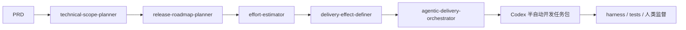

# Remod 开发记录

## 2026-04-25：Delivery Planning Suite 后续升级方向

### 背景

用户希望 `delivery-planning-suite` 不只输出普通开发排期，而是能给出一套类似当前 PM Copilot 框架的“部门各司其职、可持续优化迭代、可直接交给 Codex 等 AI 编程软件在人类监督下半自动开发”的方案。

### 结论

这一方向可行，并且应该作为 `delivery-planning-suite` 的第二阶段能力加入。

当前 `delivery-planning-suite` 已覆盖：

- `technical-scope-planner`：技术范围拆解。
- `release-roadmap-planner`：版本路线拆分。
- `effort-estimator`：工期估算。
- `delivery-effect-definer`：阶段上线效果。
- `delivery-quality-reviewer`：交付质量审查。

后续需要新增更上层的 Skill：

- `agentic-delivery-orchestrator`

它负责把 PRD、技术范围、版本路线和工期估算转成可交给 Codex 半自动开发的组织方案。

### Agentic Delivery Orchestrator 职责

输出应包含：

- 开发部门结构：
  - 产品小管家：维护 PRD 和范围变更。
  - 前端小管家：页面、状态、交互、原型还原。
  - 后端小管家：API、数据模型、权限。
  - AI 小管家：模型、Prompt、RAG、记忆画像。
  - 测试小管家：单测、接口测试、E2E、回归。
  - 审核小管家：代码审查、安全、越界检查。
  - 效率小管家：检查重复开发、无效 token、任务拆分过细。

- Codex 任务拆分：
  - 任务目标。
  - 输入文件。
  - 允许修改文件。
  - 禁止修改文件。
  - 预期输出。
  - 验收命令。
  - 人工确认点。
  - 失败时最小修复策略。

- 开发顺序：
  - Phase 0：仓库理解与技术方案确认。
  - Phase 1：数据模型与 API 契约。
  - Phase 2：核心后端能力。
  - Phase 3：前端主路径。
  - Phase 4：AI 能力接入。
  - Phase 5：测试、观测、回归。
  - Phase 6：人类验收与迭代。

- 监督机制：
  - 改 PRD 范围必须人工确认。
  - 改数据库结构必须人工确认。
  - 接入新模型或外部 API 必须人工确认。
  - 上线成本增加必须人工确认。
  - 删除数据或清理历史记录必须人工确认。
  - 生成或更新 Skill 必须人工确认。
  - 推送 GitHub / 创建 PR 必须人工确认。

- 自动检查机制：
  - harness。
  - regression。
  - lint / test。
  - security check。
  - source trace。
  - delivery plan check。
  - skill generalization。
  - AI eval benchmark。
  - random audit。
  - efficiency audit。

- 持续迭代机制：
  - 开发后记录人类反馈。
  - 判断反馈属于 bug、体验问题、PRD 变更、技术债还是 Skill 改进。
  - 项目偏好进入项目缓存。
  - 通用能力进入 Skill 更新提案。
  - 用户审批后才更新 Skill。
  - 回归评测防止退化。

### 与现有 Delivery Skill 的关系



前几个 Skill 负责“开发什么、多少期、多久、效果是什么”；`agentic-delivery-orchestrator` 负责“怎么组织 AI 编程 Agent 去半自动开发”。

### 建议新增 Artifacts

```yaml
agentic_delivery_plan
codex_task_packages
human_supervision_plan
development_governance_report
```

### 建议新增 Harness 检查

- 每个 Codex 任务必须有允许修改文件和禁止修改文件。
- 每个任务必须有验收命令。
- 涉及高风险操作必须有人类确认点。
- 不允许 Agent 直接修改 PRD / MVP 范围。
- 不允许没有测试或回归就标记完成。
- 不允许多个 Agent 写同一文件范围，除非有冲突管理说明。

### 下一步建议

先新增 `agentic-delivery-orchestrator` Skill，并用“毕业答辩辅导智能体”生成一版 `Codex 半自动开发任务包`，用于检查输出质量。
