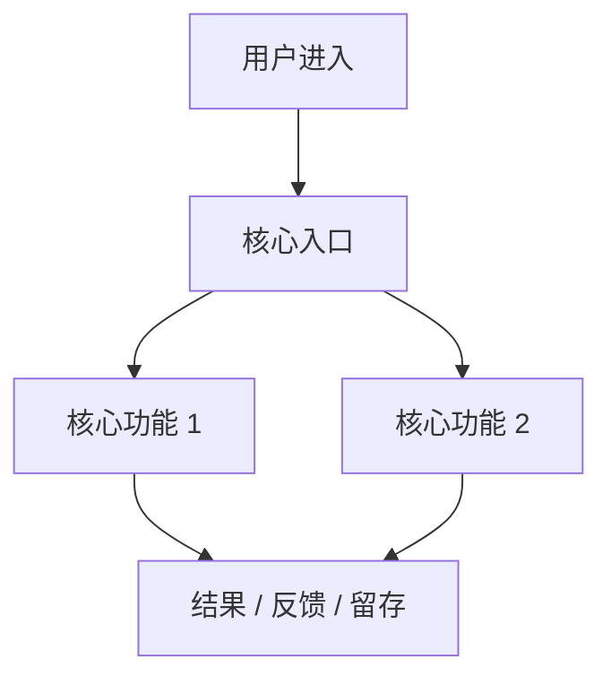
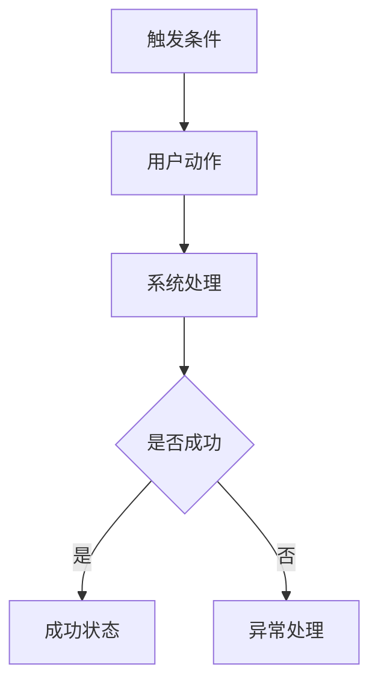

# [项目 / 功能名称]

- 文档状态：Intake / Draft / Review / Aligned / Frozen / In Dev / In Test / Released / Archived
- 文档 Owner：
- 协作者：
- 业务线 / 项目：
- 需求来源：
- 优先级：
- 目标上线时间：
- 文档版本：
- 最后更新时间：
- 关联链接：
  - Roadmap：
  - 工单 / Epic：
  - 设计稿：
  - 原型：
  - 数据看板：
  - 用户研究：
  - 技术方案：
  - 测试用例：
  - 发布记录：

---

## 1. 一句话摘要
> 用 1~3 句话说明：为什么做、给谁做、解决什么问题、预期带来什么结果。

---

## 2. 背景与问题定义

### 2.1 当前背景
- 当前业务背景：
- 当前流程/现状：
- 触发原因（用户反馈 / 数据异常 / 战略要求 / 合规要求 / 竞品压力 / 运营需求）：

### 2.2 问题定义
- 受影响角色：
- 发生场景：
- 问题表现：
- 造成损失 / 障碍：
- 根因假设：

### 2.3 证据
- 定量证据：
- 定性证据：
- 历史方案 / 历史问题：
- 参考案例 / 竞品：

---

## 3. 为什么现在做
- 时间窗口：
- 不做的代价：
- 战略关联：
- 外部约束（大客户/合同/法规/活动节点）：

---

## 4. 目标 / 非目标

### 4.1 业务目标
- 目标 1：
- 目标 2：

### 4.2 用户目标
- 目标 1：
- 目标 2：

### 4.3 非目标（本期明确不做）
- 不做 1：
- 不做 2：
- 不做 3：

---

## 5. 成功指标

| 指标层级 | 指标名 | 当前基线 | 目标值 | 统计口径 | 观察窗口 | 护栏说明 | 看板链接 |
|---|---|---:|---:|---|---|---|---|
| 核心指标 |  |  |  |  |  |  |  |
| 过程指标 |  |  |  |  |  |  |  |
| 过程指标 |  |  |  |  |  |  |  |
| 护栏指标 |  |  |  |  |  |  |  |

---

## 6. 目标用户 / 角色 / JTBD

### 6.1 目标用户
- 角色 A：
- 角色 B：

### 6.2 JTBD / 关键任务
- 当 [场景] 发生时，用户希望 [完成任务]，以便 [获得结果]。

### 6.3 不同角色差异
| 角色 | 目标 | 权限 | 关注点 | 风险点 |
|---|---|---|---|---|
|  |  |  |  |  |

---

## 7. 使用场景

### 7.1 核心场景
1. 场景名称：
   - 触发条件：
   - 用户目标：
   - 当前问题：
   - 预期变化：

### 7.2 次要场景
1. 场景名称：
   - 说明：

### 7.3 反场景 / 不支持场景
- 本期不支持：
- 需要明确规避：

---

## 8. 范围定义

### 8.1 In Scope（本期包含）
- 功能点 1：
- 功能点 2：
- 功能点 3：

### 8.2 Out of Scope（本期不包含）
- 功能点 1：
- 功能点 2：

### 8.3 分阶段规划
- MVP：
- V1：
- V1.1 / Future：

---

## 9. 方案概述

### 9.1 方案摘要
> 用非技术语言描述本次方案如何解决问题。

### 9.2 用户流程 / 业务流程
- 入口：
- 关键步骤：
- 成功路径：
- 失败路径：
- 退出路径：

### 9.3 状态流转
| 当前状态 | 触发动作 | 下一个状态 | 限制条件 | 备注 |
|---|---|---|---|---|
|  |  |  |  |  |

### 9.4 角色与权限
| 角色 | 查看 | 新建 | 编辑 | 删除 | 提交 | 审批 | 导出 | 备注 |
|---|---|---|---|---|---|---|---|---|
|  |  |  |  |  |  |  |  |  |

### 9.5 功能流程图（开发类 PRD 必备）
> 所有开发类 PRD 必须在正文放功能流程图。可以使用 Mermaid，至少覆盖产品总流程、核心业务流程、异常/审核流程；不能只把流程图放在附件。

#### 产品总流程


#### 核心业务流程


### 9.6 原型图 / 线框图（开发类 PRD 必备）
> 所有开发类 PRD 必须在正文放主要页面原型图或线框图。可以是低保真 ASCII / Mermaid / 图片链接 / HTML 原型链接，至少覆盖首页/主工作台、核心详情页、管理/审核页、关键弹窗或表单。

#### 页面 1：[页面名称]
```text
┌────────────────────────────────────────────┐
│ 顶部导航 / 搜索 / 用户入口                  │
├────────────────┬───────────────────────────┤
│ 筛选 / 菜单     │ 主内容区                   │
│                │ 核心卡片 / 表格 / 图表      │
└────────────────┴───────────────────────────┘
```

#### 页面 2：[页面名称]
```text
┌────────────────────────────────────────────┐
│ 标题 / 状态 / 操作                         │
├────────────────────────────────────────────┤
│ 详情信息 / 核心指标 / 关键动作              │
└────────────────────────────────────────────┘
```

### 9.7 AI 模型选型（涉及 AI 能力时必备）
> 只要产品涉及 AI 生成、识别、推荐、Agent、RAG、审核、语音、图像或多模态能力，PRD 正文必须写 AI 模型选型。内容需包含任务拆分、推荐模型等级、成本/延迟/质量权衡、fallback、评测标准和合规约束。模型价格、可用性和政策必须在上线前按官方来源复核。

| AI 任务 | 输入 | 输出 | 推荐模型等级 / 候选模型 | 是否异步 | fallback | 审核要求 |
|---|---|---|---|---|---|---|
|  |  |  |  | 是/否 |  |  |

#### 模型选型原则
- 质量要求：
- 成本上限：
- 延迟要求：
- 上下文长度：
- 结构化输出：
- 工具调用 / RAG：
- 数据合规：
- 内容安全：

#### 评测标准
| 维度 | 权重 | 通过要求 |
|---|---:|---|
| 准确性 |  |  |
| 引用 / 可追溯 |  |  |
| 安全合规 |  |  |
| 成本 |  |  |
| 延迟 |  |  |

---

## 10. 详细需求（按模块写）

### 10.1 模块 A：[名称]
#### 目标
#### 功能说明
#### 页面 / 交互要求
#### 业务规则
#### 数据规则
#### 文案要求
#### 风险提示

### 10.2 模块 B：[名称]
#### 目标
#### 功能说明
#### 页面 / 交互要求
#### 业务规则
#### 数据规则
#### 文案要求
#### 风险提示

---

## 11. 需求明细表

| 模块 | 场景 | 用户动作 | 系统行为 | 前置条件 | 规则/约束 | 优先级 | 备注 |
|---|---|---|---|---|---|---|---|
|  |  |  |  |  |  | P0/P1/P2 |  |

---

## 12. 用户故事与验收标准

### 12.1 用户故事
- 作为 [角色]，我希望 [完成某件事]，以便 [获得某种价值]。
  - 验收标准 1：
  - 验收标准 2：
  - 验收标准 3：

- 作为 [角色]，我希望 [完成某件事]，以便 [获得某种价值]。
  - 验收标准 1：
  - 验收标准 2：
  - 验收标准 3：

### 12.2 Definition of Done
- 研发完成：
- 测试通过：
- 埋点验证：
- 文案确认：
- 风险可控：
- 文档齐全：

---

## 13. 异常、边界与兼容性

### 13.1 异常场景
- 空状态：
- 错误状态：
- 网络失败：
- 重复提交：
- 并发冲突：
- 权限不足：
- 审核拒绝：
- 数据延迟：
- 第三方接口失败：

### 13.2 边界条件
- 时间边界：
- 数值边界：
- 状态边界：
- 人群边界：
- 设备/端边界：
- 历史数据边界：

### 13.3 兼容性
- Web / App / H5：
- 多语言：
- 多币种：
- 老版本兼容：
- 历史数据回填：

---

## 14. 非功能要求
- 性能：
- 安全：
- 隐私：
- 合规：
- 审计日志：
- 可观测性：
- 可配置性：
- 可扩展性：

---

## 15. 埋点与数据方案

### 15.1 关键事件
| 事件名 | 触发时机 | 关键属性 | 指标归属 | owner | 备注 |
|---|---|---|---|---|---|
|  |  |  |  |  |  |

### 15.2 数据校验
- 埋点联调时间：
- 验证方式：
- 对账方式：
- Dashboard 链接：

---

## 16. 依赖、风险与开放问题

### 16.1 外部依赖
| 依赖项 | 依赖团队/系统 | 风险等级 | 需要时间 | 备注 |
|---|---|---|---|---|
|  |  | 高/中/低 |  |  |

### 16.2 风险清单
| 风险 | 影响 | 概率 | 应对方案 | owner |
|---|---|---|---|---|
|  |  | 高/中/低 |  |  |

### 16.3 开放问题
| 问题 | 当前状态 | owner | 截止时间 |
|---|---|---|---|
|  |  |  |  |

---

## 17. 上线与灰度方案
- 上线方式：全量 / 灰度 / 白名单 / 开关控制
- 发布窗口：
- 灰度人群：
- 放量节奏：
- 回滚条件：
- 回滚方案：
- 客服/运营通知：
- Release note：

---

## 18. 验收 Checklist

- [ ] 核心流程可用
- [ ] 异常流程可控
- [ ] 验收标准逐项对齐
- [ ] 埋点已验证
- [ ] 看板可看
- [ ] 权限已验证
- [ ] 文案已确认
- [ ] 风险已记录
- [ ] 灰度方案已确认
- [ ] 回滚方案已确认
- [ ] 客服/运营已同步
- [ ] 已知问题透明

---

## 19. 版本记录

| 版本 | 日期 | 修改人 | 变更内容 |
|---|---|---|---|
| v0.1 |  |  | 初稿 |
| v0.2 |  |  | 评审修改 |
| v1.0 |  |  | 冻结版本 |

---

## 20. 附录 / 链接资料
- 用户访谈：
- 数据分析：
- 原型链接：
- Figma：
- 技术方案：
- 测试用例：
- 培训资料：
- 发布复盘：
