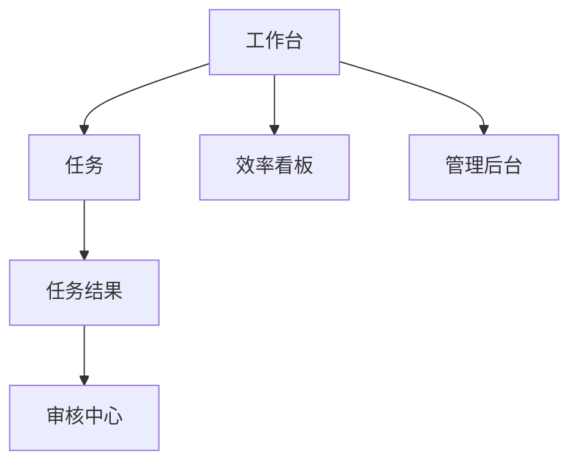
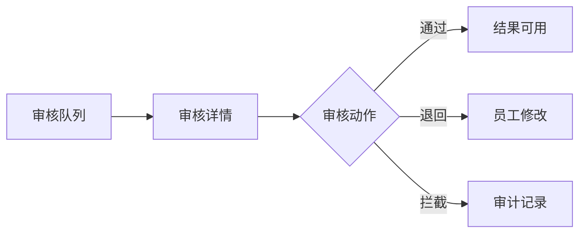

# PRD 辅助理解图与页面说明跳转关系通用机制方案

- 状态：待用户审核
- 日期：2026-04-28
- 适用范围：产品 PRD 输出、页面级原型说明、后续 PNG / HTML / UI 设计 / Codex 开发文档衔接
- 稳定边界：本文是建议方案，不是长期规则；只有用户明确批准后，才允许并入模板、Skill、workflow 或长期偏好。

---

## 1. 问题背景

这轮讨论后，PRD 阶段的默认产物边界需要重新收敛：

1. PRD 里需要辅助理解图，帮助读者快速理解复杂产品。
2. PRD 里也需要页面说明和页面跳转关系，方便后续 UI 设计、HTML 原型和 Codex 开发文档。
3. PRD 阶段不默认输出 PNG，因为 PNG 是视觉参考，不应该成为每份 PRD 的默认交付。
4. PRD 阶段不默认输出 HTML，HTML 应在用户确认页面说明或原型方向后再单独进入下一阶段。
5. 页面说明和跳转关系不能省略，否则后续转 PNG、HTML 或开发文档时会丢页面逻辑、权限、状态和异常边界。

因此，通用机制应该从“PRD + 默认 PNG 原型包”调整为“PRD + 辅助理解图 + 页面说明 + 页面跳转关系”。

---

## 2. 推荐结论

建议采用：

```text
PRD 正文
→ 辅助理解图
→ 页面信息架构
→ 页面说明
→ 页面跳转关系
→ 用户审核
→ 用户确认后，再进入 PNG / HTML / UI 设计 / Codex 开发文档
```

默认规则：

- PRD 阶段默认不输出 PNG。
- PRD 阶段默认不输出 HTML。
- PRD 阶段必须保留页面说明和页面跳转关系。
- 页面说明必须覆盖页面目标、入口、出口、核心区域、字段、操作、权限和异常状态。
- 页面跳转关系必须覆盖全局页面关系、分角色路径、关键操作跳转和异常跳转。
- PNG、HTML、UI 高保真都属于用户确认后的后续阶段。
- 长期沉淀前必须先用测试项目验证，并由用户审核通过。

---

## 3. 推荐产物结构

项目级产物建议为：

```text
projects/<project>/
  01_prd.md
  prototype/
    page_flow.md
    page_specs.md
    page_review_checklist.md
```

文件职责：

| 文件 | 职责 | 是否默认 |
|---|---|---|
| `01_prd.md` | 产品目标、用户、范围、流程、需求、验收标准、辅助理解图、页面章节引用 | 是 |
| `prototype/page_flow.md` | 页面信息架构、页面跳转、分角色路径、关键状态和异常跳转 | 是 |
| `prototype/page_specs.md` | 每个页面的目标、角色、入口、出口、核心区域、字段、操作、权限、异常状态 | 是 |
| `prototype/page_review_checklist.md` | 给用户审核页面说明和跳转关系的检查清单 | 是 |
| `prototype/png/` | PNG 原型图 | 否，用户确认后再做 |
| `prototype/html/` | HTML 原型 | 否，用户确认后再做 |

---

## 4. PRD 正文中的辅助理解图机制

PRD 不应机械输出所有图。每份 PRD 先做必要性判断：

| 图表 | 触发条件 | 默认建议 | 放置位置 |
|---|---|---|---|
| 产品总览思维导图 | 产品模块、用户角色、目标较多 | 复杂 PRD 默认需要 | 摘要后 |
| 用户场景 / JTBD 思维导图 | 用户类型多，任务差异大 | 需要时输出 | 目标用户后 |
| 核心业务泳道图 | 多角色协作、多系统参与、人工介入多 | 复杂流程默认需要 | 主流程后 |
| 页面信息架构图 / 页面跳转图 | 需要进入 UI、原型或开发文档 | 默认需要 | 页面规划前 |
| 状态流转图 | 有明显生命周期或多状态 | 需要时输出 | 状态定义处 |
| MVP 范围地图 | 范围大，容易膨胀 | 复杂 PRD 默认需要 | 范围定义后 |
| AI / Skill 路由决策树 | 涉及模型、Skill、AI 决策或人工复核 | AI 产品默认需要 | AI 方案处 |
| 权限矩阵 | 多角色、多动作、多数据边界 | 权限复杂时需要 | 权限章节 |
| 风险控制闭环图 | 有合规、审核、风控、日志、复盘 | 风险产品默认需要 | 风控章节 |
| 用户故事地图 | 要进入开发排期、优先级判断 | 开发前默认需要 | 用户故事前 |

原则：

- 辅助理解图用于降低阅读难度，不替代正文需求。
- 简单 PRD 可以少图，复杂 PRD 必须用图压清关系。
- 页面信息架构图属于默认建议，因为它是页面说明和后续开发文档的入口。

---

## 5. PRD 中的页面说明章节

PRD 页面章节只做四件事：

1. 列页面清单。
2. 摘要说明页面之间的关系。
3. 引用 `page_flow.md` 和 `page_specs.md`。
4. 明确 PNG / HTML 不在当前阶段默认输出。

PRD 不应塞满每个页面的全部细节。完整页面说明放在 `prototype/page_specs.md`，完整跳转关系放在 `prototype/page_flow.md`。

PRD 页面章节建议模板：

```markdown
## 页面与原型说明

本阶段不默认输出 PNG 或 HTML。PRD 阶段默认输出页面说明和页面跳转关系，用于产品审核、UI 设计前置对齐和后续 Codex 开发文档衔接。PNG / HTML 需要用户确认后再进入下一阶段。

### 页面清单

| 页面 | 页面目标 | 覆盖角色 | 核心操作 | 详情说明 |
|---|---|---|---|---|
| 工作台 | 查看任务、待办、风险提醒 | 员工 / 主管 | 新建任务、查看待办、进入看板 | `prototype/page_specs.md` |

### 配套说明

- 页面跳转：[prototype/page_flow.md](prototype/page_flow.md)
- 页面说明：[prototype/page_specs.md](prototype/page_specs.md)
- 评审清单：[prototype/page_review_checklist.md](prototype/page_review_checklist.md)
```

---

## 6. `page_flow.md` 标准

`page_flow.md` 负责说明页面关系，不替代 PRD，也不替代页面说明。

建议结构：

````markdown
# 页面跳转关系

## 1. 全局页面信息架构



## 2. 员工视角路径


## 3. 审核人视角路径



## 4. 管理员视角路径

## 5. 异常与状态跳转

| 当前页面 | 操作 | 条件 | 下一页面 / 状态 |
|---|---|---|---|
| 任务结果 | 提交 Review | P1 风险 | 审核详情：待审核 |
| 任务结果 | 保存结果 | Low 风险 | 任务归档：已保存 |
| 审核详情 | 拦截 | P0 风险 | 审计日志：已拦截 |
````

必须覆盖：

- 全局页面结构。
- 分角色路径。
- 关键操作跳转。
- 关键异常跳转。
- 与 `page_specs.md` 中页面名称一致。

---

## 7. `page_specs.md` 标准

`page_specs.md` 是 PRD 阶段的页面级文字原型说明。它不提供 PNG，但必须足够支撑后续 PNG、HTML、UI 设计和 Codex 开发文档。

每个页面必须有一条说明记录。

建议模板：

```markdown
# 页面说明

## P01 工作台总览

- 页面目标：让用户进入系统后看到任务、待办、推荐 Skill、风险提醒和效率概览。
- 适用角色：员工、评审人、部门主管。
- 入口来源：登录后默认进入；导航栏点击“工作台”。
- 出口跳转：
  - 点击“新建任务”进入 `P02 创建任务`
  - 点击“待 Review”进入 `P04 审核队列`
  - 点击“团队看板”进入 `P06 效率看板`
- 核心区域：
  - 顶部指标卡
  - 常用 Skill
  - 我的任务
  - 风险提醒
- 核心操作：
  - 新建任务
  - 查看任务详情
  - 进入审核队列
- 字段说明：
  - 任务状态：草稿、执行中、待审、已通过、已退回、已拦截
  - 风险等级：P0、P1、P2、Low
  - 时间字段：创建时间、最近更新时间、审核截止时间
- 权限差异：
  - 员工只能看个人任务
  - 主管看团队汇总
  - HR 不看敏感明细
- 异常状态：
  - 无任务：展示推荐 Skill
  - 无权限：隐藏团队看板入口
  - 风险命中：顶部显示风险提醒
- 对应 PRD 章节：工作台总览、权限矩阵、风险控制
- 后续转 PNG / HTML 注意点：
  - 指标卡需要可点击下钻
  - 风险提醒必须有明确状态色和详情入口
```

必填字段：

| 字段 | 是否必填 | 作用 |
|---|---|---|
| 页面目标 | 是 | 防止页面变成装饰描述 |
| 适用角色 | 是 | 支撑权限设计 |
| 入口来源 | 是 | 支撑跳转关系 |
| 出口跳转 | 是 | 支撑后续 PNG / HTML |
| 核心区域 | 是 | 支撑页面结构 |
| 核心操作 | 是 | 支撑交互和验收 |
| 字段说明 | 是 | 防止假数据占位 |
| 权限差异 | 相关时必填 | 支撑鉴权 |
| 异常状态 | 相关时必填 | 支撑边界 |
| 对应 PRD 章节 | 是 | 保证产品逻辑可追溯 |
| 后续转 PNG / HTML 注意点 | 是 | 为下一阶段保留依据 |

---

## 8. 页面状态覆盖规则

PRD 阶段虽然不默认画 PNG，但页面说明必须覆盖关键状态。

必要状态：

- 默认态。
- 空状态。
- 加载 / 处理中。
- 错误 / 失败。
- 无权限。
- 高风险操作确认。
- 审核退回。
- 审核拦截。
- 发布成功。
- 下线 / 归档。

判断标准：

- 如果状态会影响用户操作，必须写进页面说明。
- 如果状态会影响开发验收，必须写进页面说明。
- 如果状态只改变一行文案，可以在页面说明里一句话带过。
- 如果状态需要视觉重点，后续进入 PNG 或 HTML 阶段再单独画。

---

## 9. `page_review_checklist.md` 标准

该文件用于用户审核页面说明和跳转关系。

建议模板：

```markdown
# 页面说明与跳转关系评审清单

## 1. 页面覆盖

- [ ] 是否覆盖所有 MVP 核心页面？
- [ ] 是否覆盖创建、列表、详情、审核、管理、看板等关键页面类型？
- [ ] 是否存在只在 PRD 中出现、但页面说明没有体现的核心功能？

## 2. 跳转关系

- [ ] 每个核心按钮是否有明确下一步？
- [ ] 页面入口和出口是否清楚？
- [ ] 分角色路径是否合理？
- [ ] 异常路径是否有去向？

## 3. 信息结构

- [ ] 每个页面的核心区域是否清楚？
- [ ] 页面主次是否清楚？
- [ ] 是否存在明显信息过载？

## 4. 业务字段

- [ ] 是否使用真实业务字段，而不是泛泛占位？
- [ ] 状态、风险、权限、来源、时间等字段是否完整？

## 5. 状态和异常

- [ ] 空状态是否覆盖？
- [ ] 错误状态是否覆盖？
- [ ] 无权限状态是否覆盖？
- [ ] 高风险操作是否有确认？

## 6. 权限与风控

- [ ] 不同角色看到的入口和动作是否正确？
- [ ] 高风险内容是否进入审核或拦截？
- [ ] 是否有审计、原因、复盘入口？

## 7. 后续衔接

- [ ] 是否足以进入 PNG 原型图制作？
- [ ] 是否足以进入 HTML 原型制作？
- [ ] 是否足以转 Codex 开发文档？
- [ ] 是否还有需要先改 PRD 的业务逻辑问题？
```

---

## 10. PRD、页面说明、PNG、HTML 的边界

### 10.1 PRD 阶段负责

- 说明产品要做什么。
- 说明用户、场景、范围、流程、权限、风险。
- 给出辅助理解图。
- 给出页面清单。
- 给出页面说明。
- 给出页面跳转关系。
- 给出页面评审清单。

### 10.2 页面说明阶段负责

- 表达页面目标、结构和信息层级。
- 表达主要字段和核心操作。
- 表达角色差异、权限边界和异常状态。
- 作为用户审核、UI 设计、PNG、HTML 和开发拆解参考。

### 10.3 PNG 阶段负责

- 在用户确认需要后启动。
- 把页面说明转成可视化页面原型。
- 用于更直观地评审布局、信息密度和视觉方向。

### 10.4 HTML 阶段负责

- 在用户确认页面说明或 PNG 原型后启动。
- 将 PRD、page_specs、page_flow 和必要视觉参考转成交互页面。
- 验证导航、交互、视觉、响应式和可点击体验。

### 10.5 不能混淆的边界

- 页面说明不是最终 UI。
- PNG 不是 PRD 默认产物。
- HTML 不是 PRD 默认产物。
- UI 高保真不是 PRD 默认产物。
- Codex 开发文档不能混进 PRD 正文，但可以引用 PRD 和页面说明产物。

---

## 11. 质量检查

### 11.1 第一轮：产物完整性检查

检查项：

- `01_prd.md` 是否有页面章节。
- `prototype/page_flow.md` 是否存在。
- `prototype/page_specs.md` 是否存在。
- `prototype/page_review_checklist.md` 是否存在。
- PRD 页面清单是否能对应到 `page_specs.md`。
- `page_flow.md` 中的页面是否能对应到 `page_specs.md`。
- 没有默认生成 PNG 或 HTML。

### 11.2 第二轮：遗漏和一致性检查

检查项：

- PRD 中的核心页面是否都有页面说明。
- 页面说明中的核心操作是否在 page_flow 有跳转。
- 角色权限是否与权限矩阵一致。
- 风险状态是否与风险控制章节一致。
- 状态流转是否与页面状态一致。
- 是否误把 PNG / HTML 当成默认交付。
- 是否新增了不必要的 skill、harness、workflow 或长期规则。

---

## 12. 何时需要修改 PRD

用户审核页面说明或跳转关系时，如果反馈属于以下类型，必须同步改 PRD：

| 反馈类型 | 是否改 PRD | 示例 |
|---|---|---|
| 业务逻辑变化 | 必须 | 审核流从主管审核改为合规审核 |
| 页面结构变化 | 视情况 | 新增独立页面或合并核心页面 |
| 字段变化 | 必须 | 增加风险来源、审核原因、版本号 |
| 权限变化 | 必须 | HR 可以看个人明细改为只能看汇总 |
| 状态变化 | 必须 | 新增已撤回、已归档、二次审核 |
| 纯视觉变化 | 不改 PRD | 卡片样式、颜色、间距 |
| 文案微调 | 通常不改 | 按钮文案从提交改为开始生成 |

原则：只要影响产品行为、范围、权限、风控、验收，就不能只改页面说明。

---

## 13. 是否需要新增 Skill / Harness

当前建议：暂不新增。

理由：

- 已有 `low-fi-prototype-designer` 可作为原型产物契约参考。
- 已有 `interactive-html-prototype-builder` 可在后续 HTML 阶段使用。
- 已有 `docs/prototype_flow.md` 可承接原型流转规则。
- 当前问题先用模板、输出规范和审核清单解决即可。
- 新增 skill 或 harness 会增加维护成本，暂时不必要。

后续只有在多次项目验证后仍反复出现以下问题，才考虑新增检查：

- 页面说明经常缺少入口或出口。
- 页面跳转经常遗漏。
- PNG 或 HTML 经常被误提前生成。
- PRD 与页面说明经常不一致。
- 权限、状态、风险在页面说明中经常漏掉。

---

## 14. 优势

- PRD 更容易读，复杂关系不再只靠长文字。
- 不默认生成 PNG，减少阶段混淆。
- 不默认生成 HTML，符合用户确认后再制作的链路。
- 页面说明和跳转关系能防止后续 PNG、HTML 或开发文档丢逻辑。
- `page_specs.md` 能把页面、PRD、权限、状态、风险连接起来。
- 机制不强行新增 skill/harness，维护成本较低。

---

## 15. 劣势和风险

- 页面说明仍然比纯 PRD 更重。
- 没有 PNG 时，页面布局直观性弱一些。
- 如果 page_specs 写得粗糙，后续转 PNG / HTML 仍可能丢细节。
- 如果图表判断不准确，可能出现图太多或图不够。
- 用户审核时需要同时看 PRD、page_flow 和 page_specs。

---

## 16. 替代方案

| 方案 | 说明 | 不推荐原因 |
|---|---|---|
| 只写 PRD，不写页面说明 | 页面留给后续设计 | 后续转 UI / HTML / 开发文档时容易丢逻辑 |
| PRD 默认直接输出 PNG | 每个项目都画图 | 用户已明确不默认输出 PNG |
| PRD 默认直接输出 HTML | PRD 完成后直接生成 HTML | 用户已明确 HTML 后续单独讨论 |
| 页面说明不写跳转关系 | 只列页面字段 | 不能支撑完整产品流转 |
| 新增专门 harness 强制检查 | 通过自动检查约束 | 当前先不增加维护成本 |

---

## 17. 建议执行范围

如果用户审核通过，建议分两步落地：

### 第一步：文档和模板层

建议修改：

- `pm-prd-copilot/templates/prd_template_2026.md`
- `pm-prd-copilot/references/output_style_guide.md`
- `docs/prototype_flow.md`

修改内容：

- 加入辅助理解图必要性判断。
- 加入 PRD 页面说明章节。
- 加入 `page_flow.md`、`page_specs.md`、`page_review_checklist.md` 的标准结构。
- 明确 PRD 阶段不默认输出 PNG。
- 明确 HTML 只在用户确认后启动。

### 第二步：项目验证层

建议用 1-2 个项目测试：

- `projects/ai-collaboration-efficiency-platform/`
- 后续用户指定的新 0-1 PRD 项目

验证内容：

- PRD 是否更容易读。
- 页面说明是否能支撑用户审核。
- page_flow 是否能支撑后续 HTML 和 Codex 开发文档。
- 是否没有过早生成 PNG / HTML。
- 产物是否过重或遗漏。

暂不建议修改：

- Skill 行为。
- Harness 检查器。
- Workflow 阶段。
- Steward 分工。
- 自动化任务。

---

## 18. 验证方法

执行后每个试点项目检查：

1. PRD 是否包含必要图表判断表。
2. PRD 是否有页面说明章节。
3. `prototype/page_flow.md` 是否覆盖全局路径、分角色路径和异常路径。
4. `prototype/page_specs.md` 是否覆盖页面目标、入口、出口、字段、权限、状态。
5. `prototype/page_review_checklist.md` 是否能让用户直接评审。
6. 是否没有默认生成 PNG。
7. 是否没有默认生成 HTML。
8. 两轮自检是否记录产物完整性和一致性。

---

## 19. 需要用户确认的点

请用户审核以下问题：

1. 是否确认 PRD 阶段默认不输出 PNG？
2. 是否确认 PRD 阶段默认不输出 HTML？
3. 是否确认 PRD 阶段必须输出页面说明和页面跳转关系？
4. 是否确认默认产物为 `page_flow.md`、`page_specs.md`、`page_review_checklist.md`？
5. 是否确认先只改模板和输出规范，暂不新增 skill/harness？
6. 是否确认用 `ai-collaboration-efficiency-platform` 或新 0-1 项目继续做产物级测试？

---

## 20. 推荐审批结论

我的建议是：批准进入试点，但暂不直接永久化。

推荐执行方式：

1. 先按本文方案做一轮项目级 PRD + 页面说明 + 页面跳转关系测试。
2. 用户审核 PRD、page_flow、page_specs 和 page_review_checklist。
3. 根据审核反馈修改方案。
4. 再由用户明确批准是否并入长期模板和输出规范。

这样既保留了页面原型链路，又不会把 PNG / HTML 过早变成默认产物。
