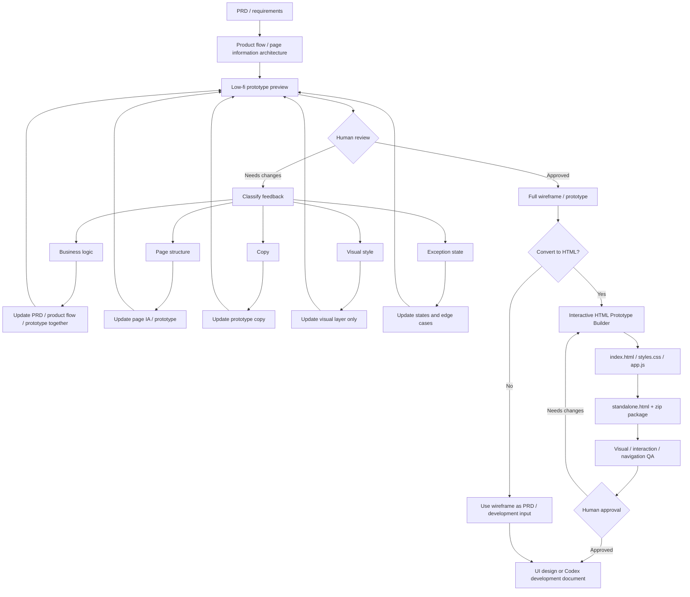

# Prototype Flow

This document defines the long-term supervised prototype delivery flow.

## Default Chain



## Required Rules

- Start with product flow or page information architecture before drawing screens.
- Produce a low-fi preview before a full prototype.
- Do not create a full prototype or HTML prototype without preview approval, unless the user explicitly approves skipping the preview for the current task.
- Classify feedback before editing: business logic, page structure, copy, visual style, or exception state.
- If feedback changes product behavior, update PRD/product notes and product flow, not only the visual artifact.
- Visual-only feedback should not rewrite product behavior.
- HTML conversion uses the existing `interactive-html-prototype-builder`.
- HTML source stays editable: `index.html`, `styles.css`, and `app.js`.
- HTML handoff includes `standalone.html`, a zip package, `prototype_manifest.json`, and `prototype_notes.md` when applicable.
- Critical actions such as create, edit, detail, review, publish, optimize, and compare should route to real screens or panels with context.
- Multiple related screenshots should become one navigable multi-page HTML prototype, not disconnected static pages.

## QA Before Handoff

- The prototype opens directly without a local dev server.
- Navigation targets are real and match the intended screen flow.
- Key buttons provide visible feedback.
- Text does not overflow or overlap in the target viewport.
- Empty, error, loading, permission, and blocked states are covered where relevant.
- `standalone.html` is synchronized with the editable source files.
- The zip package can be unpacked and opened on macOS and Windows.
- Product flow, PRD notes, and prototype behavior do not conflict.

## Output Locations

Project-scoped HTML prototypes should use:

```text
projects/<project>/prototype/html/
  index.html
  styles.css
  app.js
  standalone.html
  prototype_manifest.json
  prototype_notes.md
```

Project-scoped prototype packages should use:

```text
projects/<project>/prototype/<prototype-name>.zip
```

## Existing Tooling

- Skill: `plugins/prd-prototype-suite/skills/interactive-html-prototype-builder/SKILL.md`
- Package script: `plugins/prd-prototype-suite/skills/interactive-html-prototype-builder/scripts/package_html_prototype.py`
- Template: `plugins/prd-prototype-suite/skills/interactive-html-prototype-builder/assets/html-prototype-template/`
