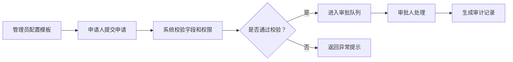

# Real Output Eval: B2B Approval Workflow

metadata:
case_id: b2b_saas_approval_workflow
market_scope_source: request_or_approved_preference_only
external_truth_status: eval_sample_not_verified
human_verification_required: true
prototype_mode: preview
full_prototype_blocked: true

## 1. 用户群体矩阵

| 用户群体 | 高频场景 | 核心痛点 | 价值判断 | 优先级 |
| --- | --- | --- | --- | --- |
| 业务申请人 | 发起采购/报销/权限申请 | 不知道流程卡在哪里 | 提升透明度 | 高 |
| 审批人 | 批量处理申请 | 信息不完整、上下文不足 | 降低判断成本 | 高 |
| 管理员 | 配置审批链 | 规则复杂、变更风险高 | 降低配置错误 | 高 |
| 审计/财务 | 追踪历史记录 | 缺少可追溯证据 | 合规价值高 | 中高 |

## 2. 痛点与需求

B2B 审批不是单页表单，而是“配置、发起、流转、异常处理、审计追踪”的闭环。MVP 应先覆盖高频通用审批链，而不是一开始做所有复杂规则。

## 3. 竞品外延地图

| 类别 | 代表性替代方式 | 对用户的影响 | 机会 |
| --- | --- | --- | --- |
| 直接工具 | 审批流/流程管理系统 | 功能完整但配置复杂 | 做轻量配置体验 |
| 相邻平台 | 协作办公套件 | 易接入但定制受限 | 强化业务字段与审计 |
| 平台原生/系统能力 | 表单、邮件、IM 审批 | 低成本但难追踪 | 补足状态和审计链 |
| 内容/社区 | 模板市场、流程范例 | 可借鉴但不执行 | 从模板生成流程 |
| 手动/线下/人工 | 纸质签字、群内确认 | 灵活但不可追溯 | 提供合规记录 |

## 4. 场景 ROI

首发核心场景：管理员配置一个审批模板，申请人提交，审批人处理，系统生成审计记录。价值高且可复用，成本低于全规则引擎。

## 5. MVP 范围

- MVP：模板配置、发起申请、审批处理、状态通知、审计记录。
- V1：条件分支、委托审批、批量处理。
- Later：复杂规则引擎、跨系统集成、智能风控。
- Non-goal：不替审批人做最终业务判断。

### 产品总览思维导图
放在摘要后，用于解释目标用户、核心场景、MVP 范围、风险边界和成功指标；不集中成单独的 PRD 可视化章节。

### 页面说明
- 审批工作台：展示待处理、已提交、异常状态、搜索筛选和快捷入口。
- 审批详情页：展示申请信息、审批链路、历史记录、通过/拒绝/退回操作。
- 规则配置页：展示流程规则、角色权限、启停状态和审计日志入口。

### 页面跳转关系
- 主路径：审批工作台 -> 审批详情页 -> 通过/拒绝/退回 -> 状态回写 -> 审计日志。
- 异常路径：无权限、规则缺失、并发处理时阻断并提示处理人。

### 原型图层
- 页面级低保真原型说明：列出关键页面的布局、主要动作、状态反馈、权限/异常和返回路径。
- 当前边界：本阶段不输出 PNG、HTML 或高保真 UI，除非用户确认进入原型/UI 阶段。

## 6. 核心业务流程

权限与异常必须进入 MVP：字段权限、审批权限、退回失败、审批人缺失都影响流程可信度。

## 7. 原型预览计划

prototype_mode: preview
full_prototype_blocked: true

预览只画 3 屏：模板配置、申请提交、审批处理。异常态和权限提示作为预览标注，确认后再扩展完整状态流。

## 8. Source Trace / Verification

- external_truth_status: eval_sample_not_verified
- human_verification_required: true
- 需人工验证：竞品类型、权限规则和审批场景优先级只是评测样例，不作为真实市场结论。
