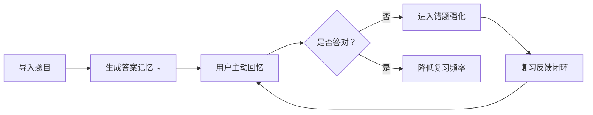

# Real Output Eval: Exam Question Memorization Tool

metadata:
case_id: education_exam_memo_tool
market_scope_source: request_or_approved_preference_only
external_truth_status: eval_sample_not_verified
human_verification_required: true
prototype_mode: preview
full_prototype_blocked: true

## 1. 用户群体矩阵

| 用户群体 | 高频场景 | 核心痛点 | 价值判断 | 优先级 |
| --- | --- | --- | --- | --- |
| 临考学生 | 考前集中刷题 | 时间少，记不住正确答案内容 | 提升短期记忆效率 | 高 |
| 职业资格考生 | 多轮复习 | 题量大，错题难复盘 | 降低复习成本 | 高 |
| 培训机构学员 | 跟班学习 | 需要统一节奏和反馈 | 方便教学管理 | 中高 |
| 自学用户 | 零散时间复习 | 缺少结构化计划 | 提高坚持率 | 中 |

## 2. 痛点与需求

用户不是只要题库，而是要在有限时间内识别正确答案内容。产品应该把题目导入、答案理解、错题复现和复习反馈闭环串起来。

## 3. 竞品外延地图

| 类别 | 代表性替代方式 | 对用户的影响 | 机会 |
| --- | --- | --- | --- |
| 直接工具 | 刷题/错题本工具 | 题库强但记忆策略不一定强 | 聚焦临考记忆 |
| 相邻平台 | 在线课程、训练营 | 有讲解但个人化弱 | 结合错题反馈 |
| 平台原生/系统能力 | 截图、备忘录、文档 | 快速但难复习 | 自动整理复习卡片 |
| 内容/社区 | 经验帖、答案解析分享 | 启发强但不稳定 | 结构化吸收方法 |
| 手动/线下/人工 | 手抄错题、同学互问 | 有效但耗时 | 保留主动回忆机制 |

## 4. 场景 ROI

首发核心场景：导入一组题目后生成可反复识别正确答案内容的复习卡。价值高，成本低于完整题库平台。

## 5. MVP 范围

- MVP：题目导入、答案卡片、错题标记、复习计划、复习反馈闭环。
- V1：OCR 清洗、同义答案识别、记忆曲线提醒。
- Later：课程体系、教师端、多人题库协作。
- Non-goal：不保证考试通过，不提供未经验证的答案事实。

### 产品总览思维导图
放在摘要后，用于解释目标用户、核心场景、MVP 范围、风险边界和成功指标；不集中成单独的 PRD 可视化章节。

### 页面说明
- 题库导入页：展示导入入口、解析状态、失败原因和样例预览。
- 快速记忆页：展示题干、答案识别点、遮挡/揭示、下一题和标记不会。
- 复习反馈页：展示错题、熟练度、复习提醒和学习反馈闭环。

### 页面跳转关系
- 主路径：题库导入页 -> 快速记忆页 -> 标记掌握/不会 -> 复习反馈页 -> 下一轮复习。
- 异常路径：解析失败、题目重复、空题库时提示原因和重新导入入口。

### 原型图层
- 页面级低保真原型说明：列出关键页面的布局、主要动作、状态反馈、权限/异常和返回路径。
- 当前边界：本阶段不输出 PNG、HTML 或高保真 UI，除非用户确认进入原型/UI 阶段。

## 6. 核心业务流程

反馈闭环必须明确：复习结果会影响下一轮错题优先级，而不是只展示题目列表。

## 7. 原型预览计划

prototype_mode: preview
full_prototype_blocked: true

预览只画 3 屏：导入题目、记忆卡片、错题反馈。确认学习路径后再扩展 full prototype。

## 8. Source Trace / Verification

- external_truth_status: eval_sample_not_verified
- human_verification_required: true
- 需人工验证：题目答案、学习效果和竞品判断只是评测样例，不作为真实学习或考试结论。
