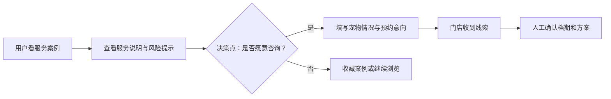

# Real Output Eval: Local Service Consultation Conversion

metadata:
case_id: pet_store_service_growth
market_scope_source: request_or_approved_preference_only
external_truth_status: eval_sample_not_verified
human_verification_required: true
prototype_mode: preview
full_prototype_blocked: true

## 1. 用户群体矩阵

| 用户群体 | 高频场景 | 核心痛点 | 价值判断 | 优先级 |
| --- | --- | --- | --- | --- |
| 新客宠物主人 | 第一次找门店 | 不信任服务质量和安全性 | 需要建立信任 | 高 |
| 老客 | 复购预约 | 想快速知道档期和价格 | 减少沟通成本 | 高 |
| 高敏感宠物主人 | 洗护/护理前咨询 | 担心应激、受伤、用品不安全 | 需要透明过程 | 中高 |
| 价格敏感用户 | 比较多家门店 | 不清楚服务差异 | 需要套餐解释 | 中 |

## 2. 痛点与需求

用户从内容到咨询之间最大的阻力是“不确定是否靠谱”。产品需要把服务过程、案例、价格范围和预约入口串成低摩擦路径，而不是只展示内容。

## 3. 竞品外延地图

| 类别 | 代表性替代方式 | 对用户的影响 | 机会 |
| --- | --- | --- | --- |
| 直接工具 | 门店预约/会员系统 | 能预约但信任建设弱 | 把信任材料前置 |
| 相邻平台 | 本地生活平台 | 有评价与团购，但关系弱 | 强化私域咨询转化 |
| 平台原生/系统能力 | 短视频私信、地图电话 | 入口方便但信息分散 | 统一沉淀咨询线索 |
| 内容/社区 | 门店短视频、用户笔记 | 能种草但难闭环 | 从内容直接进入咨询 |
| 手动/线下/人工 | 电话、微信、到店问价 | 灵活但低效 | 将重复问题标准化 |

## 4. 场景 ROI

首发核心场景：用户看完服务案例后进入咨询预约。该场景能直接影响线索量，成本低于完整会员系统，适合作为 MVP。

## 5. MVP 范围

- MVP：服务案例页、价格/注意事项摘要、咨询表单、预约意向、门店确认。
- V1：会员复购提醒、护理记录、套餐推荐。
- Later：智能客服、动态排班、跨店库存。
- Non-goal：不替门店承诺最终服务效果，不自动确认订单。

### 产品总览思维导图
放在摘要后，用于解释目标用户、核心场景、MVP 范围、风险边界和成功指标；不集中成单独的 PRD 可视化章节。

### 页面说明
- 内容落地页：展示服务亮点、门店信任信息、咨询入口和风险提示。
- 咨询预约页：展示服务类型、可预约时间、联系方式、用户备注和提交反馈。
- 商家跟进页：展示待回复咨询、预约状态、转化记录和异常处理。

### 页面跳转关系
- 主路径：内容落地页 -> 咨询预约页 -> 提交咨询 -> 商家跟进页 -> 用户确认预约。
- 异常路径：时段不可用、联系方式缺失、重复提交时给出明确提示和回退入口。

### 原型图层
- 页面级低保真原型说明：列出关键页面的布局、主要动作、状态反馈、权限/异常和返回路径。
- 当前边界：本阶段不输出 PNG、HTML 或高保真 UI，除非用户确认进入原型/UI 阶段。

## 6. 核心业务流程

关键决策点是“是否愿意咨询”和“是否提交预约意向”，不能只做展示页。

## 7. 原型预览计划

prototype_mode: preview
full_prototype_blocked: true

预览只画 3 屏：案例内容页、咨询信息页、预约提交页。用户确认转化路径后才能画 full prototype。

## 8. Source Trace / Verification

- external_truth_status: eval_sample_not_verified
- human_verification_required: true
- 需人工验证：竞品类型、转化假设和用户优先级只是评测样例，不作为真实市场结论。
