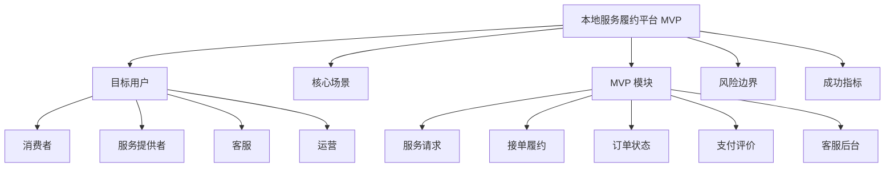
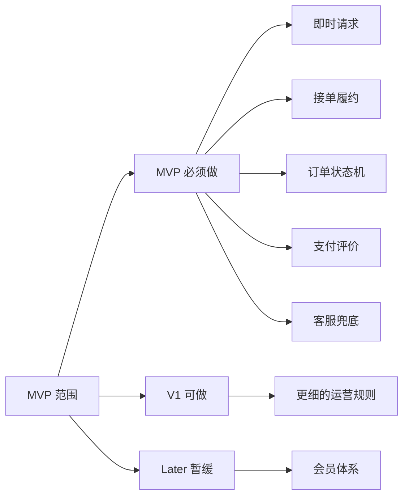
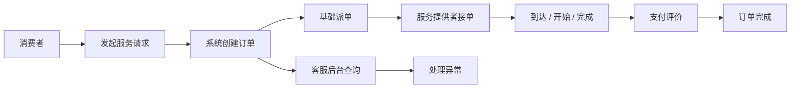
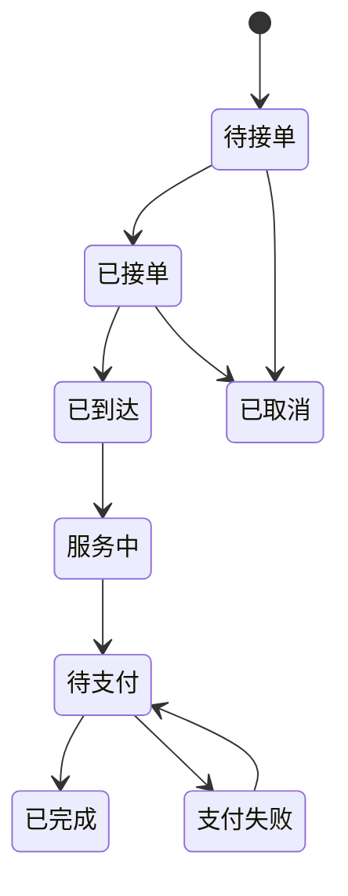
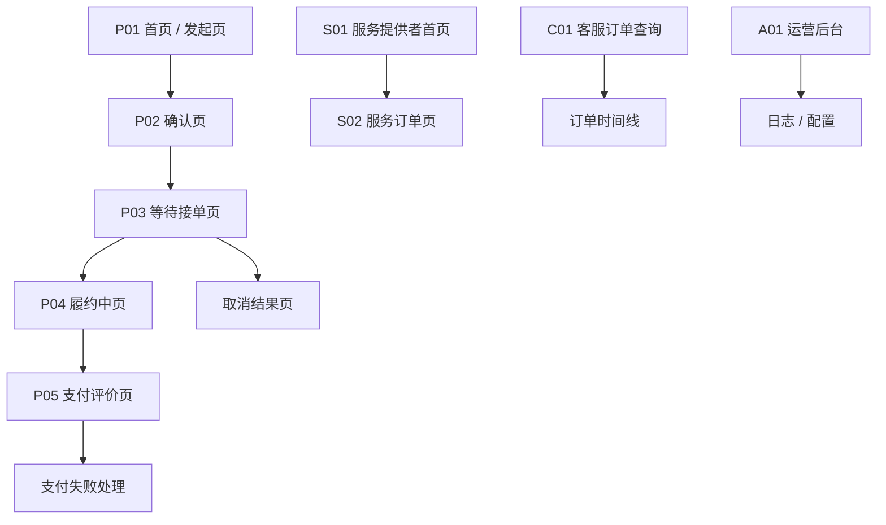

# 0-1 本地服务履约平台 MVP PRD

- 版本：v0.1
- 状态：结构样例
- 当前边界：本阶段不输出 PNG，不输出 HTML；只输出 PRD 正文、辅助理解图、页面说明、页面跳转关系和原型图层。

## 1. 摘要

本地服务履约平台 MVP 面向消费者、服务提供者、客服、运营和管理员，先完成“用户发起服务请求 - 平台派单 - 服务提供者接单 - 履约服务 - 支付评价 - 客服兜底”的最小闭环。首期重点解决用户等待不确定、服务状态不清楚、接单链路不稳定、支付评价不完整和异常兜底不足的问题。

### 1.1 产品总览思维导图

## 2. 背景与问题定义

### 2.1 当前背景

即时服务类产品的关键不是功能堆叠，而是履约链路是否清楚、状态是否可信、异常是否可兜底。

### 2.2 问题定义

| 问题 | 影响对象 | 表现 | 优先级 |
|---|---|---|---|
| 等待不确定 | 消费者 | 不知道是否有人接单、多久到达 | P0 |
| 履约状态不清楚 | 消费者 / 服务提供者 | 到达、开始、完成等动作缺少状态反馈 | P0 |
| 异常处理弱 | 消费者 / 客服 | 取消、超时、支付失败后缺少兜底路径 | P0 |
| 后台可视性不足 | 运营 / 客服 | 难以查询订单和追踪处理记录 | P1 |

## 3. 目标用户 / 角色 / JTBD

| 角色 | 目标 | 核心任务 | 风险点 |
|---|---|---|---|
| 消费者 | 快速完成一次服务请求 | 填写需求、等待接单、确认服务、支付评价 | 等不到服务、状态不清楚 |
| 服务提供者 | 高效接单并完成履约 | 上线、接单、到达、开始、完成 | 地址不清、订单争议 |
| 客服 | 快速定位并处理异常 | 查询订单、联系双方、记录处理结果 | 无法追溯处理过程 |
| 运营 | 查看供需和履约质量 | 看指标、筛选订单、配置基础规则 | 规则变更影响范围不清 |

## 4. 使用场景

### 4.1 核心场景

| 场景 | 触发 | 主路径 | 成功结果 |
|---|---|---|---|
| 即时服务请求 | 消费者需要服务 | 填写需求 -> 确认价格 -> 等待接单 | 订单被接单并进入履约 |
| 服务提供者接单 | 有可接订单 | 查看订单 -> 接单 -> 更新状态 | 服务按状态完成 |
| 客服介入 | 订单异常 | 查询订单 -> 联系双方 -> 记录结果 | 异常被关闭或升级 |

### 4.2 暂不支持场景

- 预约服务。
- 拼单或多人共享订单。
- 企业账户。
- 会员体系。
- 跨城市服务。

## 5. 范围定义

### 5.1 In Scope

- 消费者发起即时服务请求。
- 服务提供者上线、接单和履约状态更新。
- 订单状态机。
- 价格预估、支付和评价。
- 客服订单查询和异常处理。
- 基础运营后台。

### 5.2 Out of Scope

- 复杂动态定价。
- 预约服务。
- 企业用车或企业服务账户。
- 会员权益。
- 复杂增长活动。

### 5.3 MVP 范围地图

## 6. 方案概述

### 6.1 核心业务泳道图

### 6.2 状态流转

### 6.3 页面说明

| 页面 | 使用者 | 目的 | 核心内容 | 异常 |
|---|---|---|---|---|
| P01 首页 / 发起页 | 消费者 | 快速发起服务请求 | 地址、服务类型、时间、价格预估入口 | 地址缺失、服务范围外 |
| P02 确认页 | 消费者 | 确认服务和价格 | 服务摘要、预估价、确认按钮 | 价格获取失败 |
| P03 等待接单页 | 消费者 | 明确等待状态 | 等待时间、订单状态、取消入口 | 超时、无人接单 |
| P04 履约中页 | 消费者 | 查看服务进展 | 服务提供者信息、状态、联系入口 | 服务偏离、异常求助 |
| P05 支付评价页 | 消费者 | 完成支付和评价 | 金额、支付方式、评分 | 支付失败 |
| S01 服务提供者首页 | 服务提供者 | 查看可接订单 | 上线状态、订单卡片 | 无可接订单 |
| S02 服务订单页 | 服务提供者 | 完成履约动作 | 订单详情、到达、开始、完成按钮 | 状态冲突 |
| C01 客服订单查询 | 客服 | 处理异常 | 搜索、订单时间线、处理记录 | 权限不足 |
| A01 运营后台 | 运营 / 管理员 | 监控履约质量 | 指标、订单列表、规则、日志 | 配置冲突 |

### 6.4 页面跳转关系

### 6.5 原型图层

当前边界：PRD 阶段提供页面级低保真原型图/页面原型说明，不输出 PNG、HTML 或高保真 UI。以下内容用于后续 UI 设计、原型确认和 Codex 开发文档承接。

| 页面 | 页面级低保真布局 | 核心组件 | 主要动作 | 状态反馈 | 权限 / 异常 |
|---|---|---|---|---|---|
| P01 首页 / 发起页 | 上方地址区，中间服务类型，下方提交按钮 | 地址输入、服务类型、备注 | 填写、定位、提交 | 可提交、缺字段、范围外 | 服务范围外不可提交 |
| P03 等待接单页 | 顶部状态，中间服务提供者匹配，下方操作 | 状态条、等待时间、取消按钮 | 取消、刷新、联系客服 | 待接单、超时、已接单 | 超时进入客服入口 |
| P04 履约中页 | 顶部服务状态，中间服务信息，下方安全入口 | 状态条、联系入口、异常入口 | 联系、求助、确认完成 | 已到达、服务中、异常 | 高风险入口常驻 |
| C01 客服订单查询 | 搜索在上，时间线和处理记录并列 | 搜索、时间线、处理表单 | 查询、记录、升级 | 正常、处理中、已关闭 | 无权限不可查看 |
| A01 运营后台 | 指标看板、订单列表、规则和日志分区 | 指标卡、筛选、日志 | 查看、筛选、配置 | 正常、告警、待确认 | 配置变更需审计 |

### 6.6 权限矩阵

| 角色 | 查看订单 | 发起订单 | 接单履约 | 客服处理 | 规则配置 | 日志审计 |
|---|---|---|---|---|---|---|
| 消费者 | 自己订单 | 是 | 否 | 发起求助 | 否 | 否 |
| 服务提供者 | 自己订单 | 否 | 是 | 否 | 否 | 否 |
| 客服 | 授权订单 | 否 | 否 | 是 | 否 | 处理日志 |
| 运营 | 汇总和授权订单 | 否 | 否 | 否 | 部分 | 查看 |
| 管理员 | 全部 | 否 | 否 | 是 | 是 | 是 |

## 7. 详细需求

| ID | 模块 | 需求 | 优先级 | 验收要点 |
|---|---|---|---|---|
| R01 | 服务请求 | 用户可填写地址、服务类型和备注 | P0 | 缺必填项不能提交 |
| R02 | 接单履约 | 服务提供者可接单并更新状态 | P0 | 状态不能跳转错误 |
| R03 | 订单状态 | 系统展示清晰状态和时间线 | P0 | 消费者和客服看到一致状态 |
| R04 | 支付评价 | 用户可支付并评价 | P0 | 支付失败有重试路径 |
| R05 | 客服兜底 | 客服可查询订单并记录处理 | P0 | 处理记录可追溯 |
| R06 | 运营后台 | 运营可看基础指标和订单列表 | P1 | 权限和日志通过验收 |

## 8. 用户故事与验收标准

### 8.1 用户故事地图

| 阶段 | 发起请求 | 等待接单 | 履约中 | 支付评价 | 异常兜底 | 运营监控 |
|---|---|---|---|---|---|---|
| MVP | 必须做 | 必须做 | 必须做 | 必须做 | 必须做 | 基础看板 |
| V1 | 优化填写 | 推荐排序 | 服务轨迹 | 优惠规则 | 更细工单 | 规则配置 |
| Later | 多人协同 | 复杂匹配 | 高级保障 | 会员权益 | 自动化处理 | 预测分析 |

### 8.2 核心验收

- 消费者能完成一次服务请求、等待接单、查看履约、支付评价。
- 服务提供者能接单并按状态完成履约。
- 客服能查询订单、查看时间线、记录处理结果。
- 运营能查看基础履约指标。
- 权限、日志、异常入口通过验收。

## 9. 异常、边界与兼容性

| 异常 | 处理 |
|---|---|
| 无人接单 | 提示等待或取消，提供客服入口 |
| 服务提供者取消 | 订单重新匹配或进入取消结果 |
| 用户取消 | 按状态判断是否允许取消 |
| 支付失败 | 保留待支付状态并允许重试 |
| 高风险求助 | 提升优先级并进入客服处理 |

## 10. 目标 / 非目标

### 10.1 业务目标

- 建立本地即时服务履约闭环。
- 验证供需匹配和状态机是否可用。
- 降低异常订单的人工处理不确定性。

### 10.2 非目标

- 不做复杂动态定价。
- 不做会员体系。
- 不做跨城市服务。
- 不做企业账户。

## 11. 成功指标

| 指标 | MVP 目标 | 统计口径 | 护栏 |
|---|---|---|---|
| 请求创建成功率 | 稳定提升 | 成功创建订单 / 发起请求 | 不能牺牲必填校验 |
| 平均接单时长 | 逐步下降 | 创建到接单 | 不能隐藏超时 |
| 订单完成率 | 达到可验证水平 | 完成订单 / 已接单订单 | 取消原因要可追踪 |
| 客服响应时长 | P0 优先 | 异常触发到处理 | 高风险事件不得延迟 |

## 12. 风险与开放问题

### 12.1 风险控制闭环图

### 12.2 开放问题

- 首期服务范围如何定义？
- 服务提供者准入规则是什么？
- 支付失败后的最长保留时间是多少？
- 客服处理时效如何分级？
- 哪些配置变更必须二次确认？

## 13. 上线与灰度

- 先在单一区域灰度。
- 开启订单状态、支付、客服处理和日志监控。
- 观察接单时长、取消率、支付失败率和客服响应时长。
- 高风险异常保留人工兜底。
