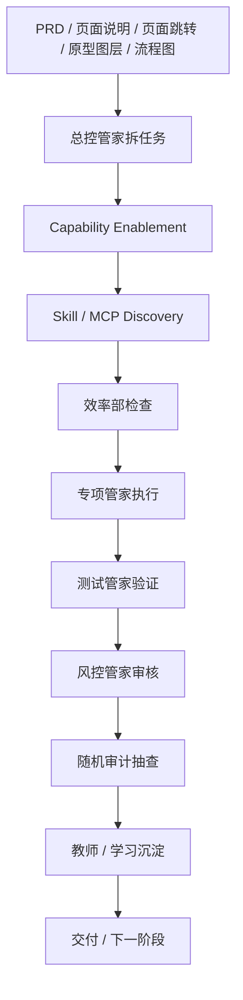

# Codex 开发文档模板

- 文档目标：把 PRD 转成可交给 Codex 半自动开发的执行文档
- 配套 PRD：
- 文档状态：
- 分发等级：内部完整版，仅限自有项目 / 可信团队使用
- 最后更新：

---

## 0. 产品 / 开发边界

- 用户侧产品能力：
- 开发内部机制：
- 禁止写进用户侧产品的内容：

开发内部机制包括但不限于：内部多管家、效率部、教师 / 学习管家、Skill/MCP、harness、registry、memory、Codex 任务包、写入边界、随机审计。

如果本文档要发给外部开发者、外包团队、合作方或投资人，必须改用 `external_protected_development_document_template.md`，不得直接分发内部完整版。

---

## 1. PM Skill 框架输入

### 1.1 Facts

-

### 1.2 Assumptions

-

### 1.3 Open Questions

| 优先级 | 问题 | 影响 | 当前处理 |
|---|---|---|---|
| P0 |  | 阻塞开发 / 影响方向 | 待确认 |
| P1 |  | 可带假设推进 | 标注假设 |
| P2 |  | 不阻塞首版 | 后续确认 |

### 1.4 必备产品输入

- PRD：
- 功能流程图：
- 页面说明：
- 页面跳转关系：
- PRD 原型图层：
- AI 模型选型（仅涉及 AI 能力时必填）：
- 用户故事与验收标准：
- Out of Scope：

---

## 2. 总体开发运行架构



---

## 3. Capability Enablement

| 检查项 | 结论 | 处理动作 | 是否需人工确认 |
|---|---|---|---|
| Skill 复用 |  |  |  |
| 新 Skill |  |  |  |
| MCP 接入 |  |  |  |
| harness |  |  |  |
| registry |  |  |  |
| 外部 API / 模型 |  |  |  |

---

## 4. Skill / MCP Discovery 与路由

Codex 每次开发前必须执行：

```text
rg --files | rg '(^|/)SKILL.md$|skill|mcp|harness|scripts'
```

任务记录必须写：

- 找到的 Skill / MCP：
- 使用原因：
- 读取的关键规则：
- 未使用原因：
- 来源追踪要求：

---

## 5. 内部多管家 / 部门分工

| 管家 / 部门 | 职责 | 输出物 | 禁止事项 |
|---|---|---|---|
| 总控管家 | 任务拆解、门禁、协调 | 任务包、状态、风险 | 不替代用户确认 |
| 产品管家 | 范围、PRD、流程、原型、验收 | 差异清单 | 不混入开发机制 |
| 能力启用管家 | Skill/MCP/harness/registry 判断 | 能力启用计划 | 不先写代码后补治理 |
| 开发治理管家 | 写入边界、任务包、审批点 | 开发操作系统计划 | 不让 Codex 无边界写 |
| 架构管家 | 架构、数据、接口、部署 | 技术方案 | 不过度设计 |
| 前端管家 | 页面、状态、交互、埋点 | 前端代码和测试 | 不改产品信息架构 |
| 后端管家 | API、权限、任务队列、审计 | 后端代码和测试 | 不绕过权限审计 |
| 数据管家 | 数据源、清洗、实体、追溯 | 数据质量报告 | 不接未授权数据 |
| AI 管家 | Prompt、RAG、模型路由、评测 | AI 方案和评测 | 不输出无来源结论 |
| 风控管家 | 合规、版权、隐私、风险表达 | 拦截规则和报告 | 不放行高风险内容 |
| 测试管家 | 单测、接口、E2E、回归 | 测试报告 | 不用手工感觉代替测试 |
| 效率部 | 工具选择、并行、重复劳动、成本 | 效率审计报告 | 不降低质量门槛 |
| 随机审计管家 | 抽查边界、来源、验证、越权 | 审计报告 | 不直接修改产物 |
| 教师 / 学习管家 | 用户反馈、经验归类、提案 | 学习提案 | 不绕过人工审批 |

---

## 6. 分期交付路线

开发交付先按“一期、二期、三期、最终”管理。细分 Phase 或任务只能作为执行拆分放在后面。

### 6.1 一期：[MVP 主链路]

- 目标：
- 包含工程任务：
- 交付物：
- 用户侧实现效果：
- 业务验证效果：
- 技术实现效果：
- AI / 数据 / 风控效果：
- 验收标准：

### 6.2 二期：[效率、质量、留存]

- 目标：
- 包含工程任务：
- 交付物：
- 用户侧实现效果：
- 业务验证效果：
- 技术实现效果：
- AI / 数据 / 风控效果：
- 验收标准：

### 6.3 三期：[后台、协作、规模化]

- 目标：
- 包含工程任务：
- 交付物：
- 用户侧实现效果：
- 业务验证效果：
- 技术实现效果：
- AI / 数据 / 风控效果：
- 验收标准：

### 6.4 最终：[稳定发布与长期演进]

- 目标：
- 包含工程任务：
- 交付物：
- 用户侧实现效果：
- 业务验证效果：
- 技术实现效果：
- AI / 数据 / 风控效果：
- 验收标准：

---

## 7. 工程任务拆分

每个细分任务必须写：

- 任务目标：
- 归属期数：
- 交付物：
- 用户侧实现效果：
- 业务验证效果：
- 技术实现效果：
- AI / 数据 / 风控效果：
- 验收标准：

---

## 8. Codex 任务包

每个任务必须写：

- 任务目标：
- 输入文件：
- 允许修改文件：
- 禁止修改文件：
- 预期输出：
- Skill / MCP Discovery 结果：
- Capability Enablement 结论：
- 使用的内部管家：
- 验证命令：
- 人工确认点：
- 最小修复策略：
- 效率部检查：
- 随机审计是否触发：
- 教师 / 学习沉淀路径：

---

## 9. Harness / 审计 / 效率 / 学习

建议命令：

```bash
python3 harness/run_harness.py --base-dir . --project <project-slug> --mode advisory --check-only
python3 harness/run_harness.py --base-dir . --project <project-slug> --mode advisory --check-only --audit
python3 harness/run_harness.py --base-dir . --project <project-slug> --mode advisory --check-only --efficiency
```

如果 harness 不可运行，必须说明原因和替代验证。

---

## 10. 人工确认点

- PRD 范围变化。
- 数据库 schema 变化。
- 数据源 / MCP / 外部 API 接入。
- 模型供应商、高成本模型或跨境数据变化。
- GitHub push / PR / production release。
- Skill、harness、registry、memory 长期规则变更。
- 删除数据、迁移数据、公开发布。

---

## 11. 开发启动 Checklist

- [ ] P0 问题已确认或标注为阻塞。
- [ ] PRD / 流程图 / 页面说明 / 页面跳转关系 / 原型图层齐全。
- [ ] 涉及 AI 能力时，AI 模型选型已确认；非 AI 项目不强行补 AI 选型。
- [ ] Capability Enablement 已完成。
- [ ] Skill / MCP Discovery 已完成。
- [ ] 内部多管家分工已确认。
- [ ] Codex 任务包已定义写入边界。
- [ ] harness / 审计 / 效率 / 教师闭环已确认。
- [ ] 人工确认点已列出。
