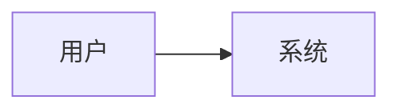

# [项目名称] Codex 开发文档
<!-- codex-runtime: apply governance/runtime/artifact_controls/index.md when updating this artifact -->

- 文档状态：Draft / Review / Final Draft / In Dev / In Test / Released
- 项目：
- 需求来源：
- 可行性状态：
- 文档 Owner：
- 技术负责人：
- 最后更新时间：
- 关联文档：
  - PRD：
  - 阶段计划：
  - 测试计划：
  - 部署文档：

---

## 1. 事实口径

### 1.1 已知事实

-

### 1.2 本文档口径

-

### 1.3 待明确参数

| 参数 | 默认建议 | 影响 | 决策状态 |
|---|---|---|---|
|  |  |  | 待定 |

---

## 2. 目标与范围

### 2.1 总体目标

-

### 2.2 分期范围

| 阶段 | 目标 | 主要交付 | 非目标 |
|---|---|---|---|
| 一期 |  |  |  |
| 二期 |  |  |  |
| 三期 |  |  |  |

### 2.3 Out of Scope

-

---

## 3. 架构与模块

### 3.1 总体架构



### 3.2 模块边界

| 模块 | 职责 | 输入 | 输出 | Owner |
|---|---|---|---|---|
|  |  |  |  |  |

---

## 4. 数据模型

| 表 / 对象 | 字段 | 类型 | 说明 | 约束 |
|---|---|---|---|---|
|  |  |  |  |  |

---

## 5. API / 接口

### 5.1 接口清单

| 方法 | 路径 | 用途 | 权限 | 备注 |
|---|---|---|---|---|
|  |  |  |  |  |

### 5.2 关键接口契约

```json
{
  "example": true
}
```

---

## 6. 状态与流程

### 6.1 状态流转

| 当前状态 | 触发动作 | 下一个状态 | 规则 |
|---|---|---|---|
|  |  |  |  |

### 6.2 主流程

1.

### 6.3 异常流程

| 场景 | 系统行为 | 用户提示 | 测试方式 |
|---|---|---|---|
|  |  |  |  |

---

## 7. 权限与安全

### 7.1 权限矩阵

| Action | Admin | Operator | Viewer | 备注 |
|---|---|---|---|---|
|  |  |  |  |  |

### 7.2 安全要求

-

### 7.3 脱敏与日志

-

---

## 8. 页面 / 交互

| 页面 | 目标 | 关键组件 | 空 / 错误状态 | 验收标准 |
|---|---|---|---|---|
|  |  |  |  |  |

---

## 9. 测试方案

### 9.1 测试矩阵

| 模块 | 单元测试 | 集成测试 | Harness / Smoke | 手工验收 |
|---|---|---|---|---|
|  |  |  |  |  |

### 9.2 必测风险路径

-

---

## 10. 发布与回滚

### 10.1 发布计划

-

### 10.2 回滚条件

-

### 10.3 回滚方案

-

---

## 11. 部署与交接

### 11.1 开发环境

-

### 11.2 部署说明

-

### 11.3 交接阅读顺序

1.

---

## 12. 阶段验收

| 阶段 | 验收项 | 通过标准 | 状态 |
|---|---|---|---|
| 一期 |  |  | 待定 |
| 二期 |  |  | 待定 |
| 三期 |  |  | 待定 |

---

## 13. 版本记录

| 版本 | 日期 | 修改人 | 变更内容 |
|---|---|---|---|
| v0.1 |  |  | 初稿 |
