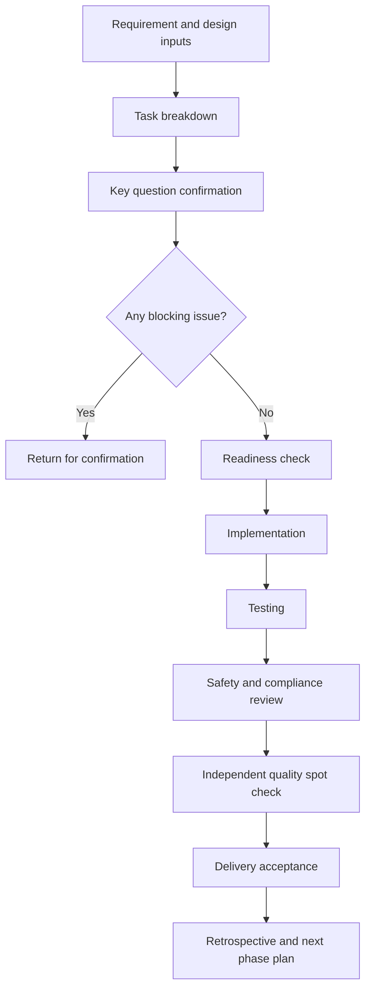

# B

- Document goal: describe implementation scope, phased delivery, quality requirements, and acceptance standards.
- Paired requirement file: A
- Status:
- Package level: B
- Last updated:

---

## 0. Use Boundary

This document only describes the product scope, technical approach, interface boundaries, delivery cadence, quality gates, and acceptance requirements needed for implementation.

It does not include:

- Process assets owned by the project owner.
- Reusable templates.
- Automation implementation details.
- Management methods.
- Internal reusable rules or tool details.

---

## 1. Development Inputs

- Product requirements:
- Functional flow:
- Page descriptions, page navigation, and approved prototype notes:
- AI plan:
- User stories and acceptance criteria:
- In scope:
- Out of scope:
- Open questions:

---

## 2. Development Flow

---

## 3. Delivery Route

Delivery is managed in four top-level stages. Each stage must state:

- Goal:
- Deliverables:
- Delivered effect:
- Acceptance standards:

### 3.1 Stage 1: MVP Core Loop

- Goal:
- Deliverables:
- Delivered effect:
- Acceptance standards:

### 3.2 Stage 2: Efficiency, Quality, and Retention

- Goal:
- Deliverables:
- Delivered effect:
- Acceptance standards:

### 3.3 Stage 3: Operations, Permissions, and Scale

- Goal:
- Deliverables:
- Delivered effect:
- Acceptance standards:

### 3.4 Final Stage: Stable Release and Long-Term Evolution

- Goal:
- Deliverables:
- Delivered effect:
- Acceptance standards:

---

## 4. Readiness Check

| Check | Requirement | Blocking |
|---|---|---|
| Scope | Requirement scope is clear and blocking questions are confirmed | Yes |
| Design inputs | Flow, page descriptions, page navigation relationships, PRD prototype layer, approved prototypes when available, and key screen states are available | Yes |
| Technical approach | Services, data, APIs, and deployment approach are clear | Yes |
| AI plan | Model routing, citations, fallback, and safety review are clear | Blocking when AI is involved |
| Data source | Authorization, source, update time, and quality labels are clear | Yes |
| Quality standard | Testing, acceptance, rollback, and monitoring requirements are clear | Yes |

---

## 5. Task Brief Format

Each task must include:

- Goal:
- Input documents:
- Allowed change scope:
- Forbidden change scope:
- Expected output:
- API / data impact:
- Testing requirements:
- Safety and compliance requirements:
- Approval points:
- Minimal fix strategy:

---

## 6. Quality Gates

| Gate | Pass standard |
|---|---|
| Scope gate | Do not add features outside the approved requirements |
| Design gate | Pages stay aligned with page descriptions, page navigation relationships, PRD prototype layer, approved prototypes when available, flows, and states |
| Data gate | Key data keeps source, authorization status, and update time |
| AI gate | AI output includes citations, confidence, risk notes, and fallback |
| Safety gate | Domain-specific safety, compliance, privacy, and risk-expression limits are documented and enforced |
| Testing gate | Unit, API, core path tests, or substitute checks are completed |
| Release gate | Rollback, monitoring, error handling, and acceptance records are ready |

---

## 7. Approval Points

- Requirement scope changes.
- Database schema changes.
- Data source or external API integration.
- Model provider, high-cost model, or cross-border data changes.
- Production release, public display, or external distribution.
- Data deletion, data migration, or irreversible operations.

---

## 8. Delivery Checklist

- [ ] Stage goals and delivered effects are confirmed.
- [ ] Task briefs are split.
- [ ] Allowed and forbidden change scopes are clear.
- [ ] API and data impact is documented.
- [ ] Testing and acceptance requirements are completed.
- [ ] Safety and compliance review is complete.
- [ ] Open issues and next phase plan are recorded.
