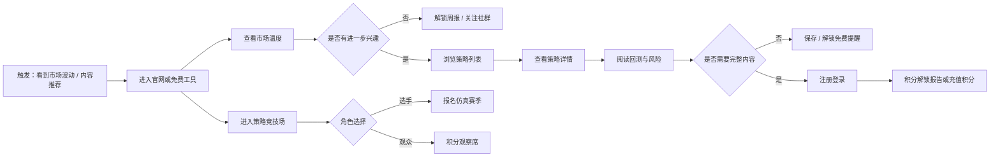
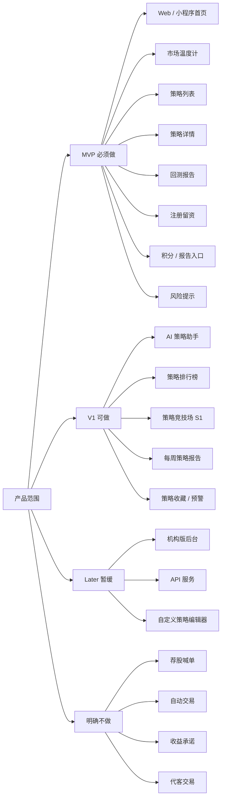
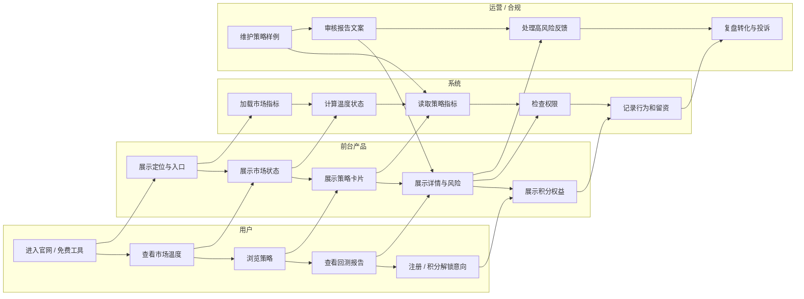
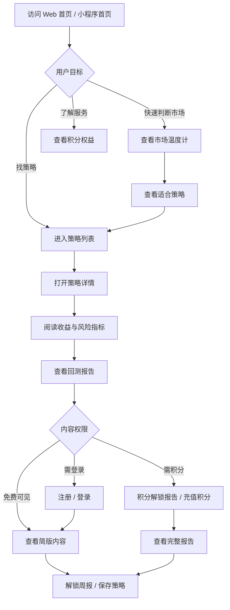
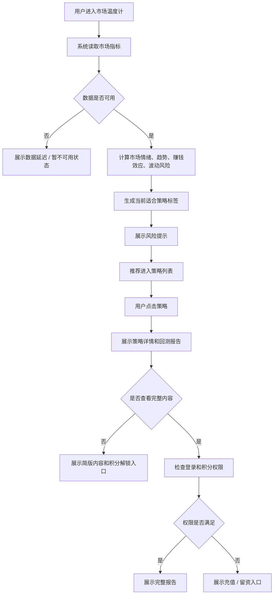
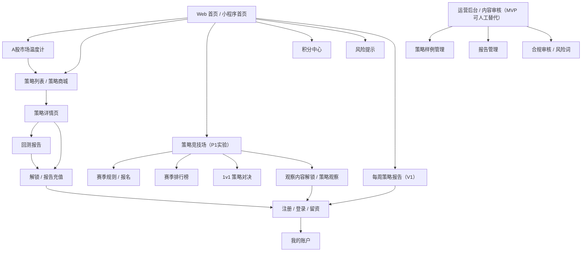
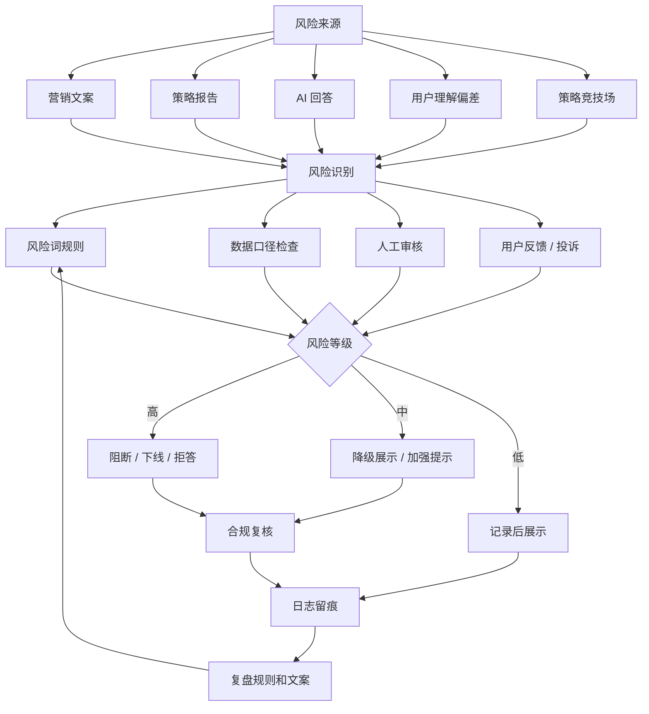

# A股 AI 量化策略研究平台 PRD

- 文档状态：Draft / 假设版
- 文档 Owner：待定
- 协作者：待定
- 业务线 / 项目：A股 AI 量化策略研究平台
- 需求来源：[00_source_notes.md](/Users/liujun/Desktop/产品经理skill/projects/a-share-ai-quant-strategy-platform/00_source_notes.md)
- 优先级：P0 验证型项目
- 目标上线时间：待定，建议 MVP 6-8 周内完成微信小程序 + Web 端可内测版本
- 文档版本：v0.1
- 最后更新时间：2026-05-04
- 关联链接：
  - 原始输入：[未命名.txt](/Users/liujun/Desktop/未命名.txt)
  - 来源整理：[00_source_notes.md](/Users/liujun/Desktop/产品经理skill/projects/a-share-ai-quant-strategy-platform/00_source_notes.md)

---

## 1. 一句话摘要

A股 AI 量化策略研究平台面向有投资经验的个人用户、ETF/基金投资者和投研团队，通过市场温度计、策略回测报告、风险指标、AI 解读和积分解锁服务，帮助用户理解市场环境、比较策略质量、识别策略失效风险，并验证用户是否愿意用积分消耗研究内容和功能服务。

平台不定位为荐股、喊单、带单或自动交易工具。MVP 目标是先验证“策略研究内容 + 免费工具 + 积分解锁”的商业闭环。

### 1.1 产品总览思维导图

```mermaid
flowchart TB
  P["A股 AI 量化策略研究平台"]
  P --> U["目标用户"]
  U --> U1["有 A 股经验的个人投资者"]
  U --> U2["ETF / 基金投资者"]
  U --> U3["量化兴趣用户"]
  U --> U4["B 端机构 / 投研团队"]
  P --> S["核心场景"]
  S --> S1["查看市场温度"]
  S --> S2["浏览策略"]
  S --> S3["阅读回测报告"]
  S --> S4["解锁研究服务"]
  S --> S5["参与策略竞技场"]
  P --> M["MVP 范围"]
  M --> M1["Web 首页 / 小程序首页"]
  M --> M2["市场温度计"]
  M --> M3["策略列表 / 详情"]
  M --> M4["回测报告"]
  M --> M5["登录留资 / 积分入口"]
  P --> R["风险边界"]
  R --> R1["不荐股喊单"]
  R --> R2["不承诺收益"]
  R --> R3["不代客交易"]
  R --> R4["不输出买卖指令"]
  P --> K["成功指标"]
  K --> K1["注册转化"]
  K --> K2["工具复访"]
  K --> K3["报告解锁"]
  K --> K4["积分充值"]
  K --> K5["竞技场报名 / 观察内容解锁"]
```

---

## 2. 背景与问题定义

### 2.1 当前背景

A股个人投资者常见决策方式仍依赖消息、短期热点、社群观点和个人经验。用户并不缺少行情信息，而是缺少把行情、策略、风险、历史表现和适用条件放在一起理解的工具。

同时，AI 投研和量化回测降低了策略研究内容的生产和解释门槛，但如果产品表达越过合规边界，容易滑向“AI 荐股”“自动赚钱”“老师带单”等高风险方向。因此本项目需要把产品定位压在策略研究、风险识别和投资者教育上。

### 2.2 问题定义

| 受影响角色 | 发生场景 | 问题表现 | 造成障碍 | 根因假设 |
|---|---|---|---|---|
| 有 A 股经验的个人投资者 | 每天判断是否交易 | 只看涨跌、消息或单个指标 | 容易追涨杀跌，难以理解风险 | 缺少市场状态和策略适用性的统一解释 |
| ETF / 基金投资者 | 选择指数、行业、风格 ETF | 不知道当前适合趋势、轮动还是防守 | 配置决策缺少结构化依据 | 缺少轮动强弱和策略状态观察工具 |
| 量化兴趣用户 | 学习或比较策略 | 只看到收益曲线，看不懂回撤、滑点、失效场景 | 容易误判策略质量 | 缺少标准化回测报告和 AI 解释 |
| 机构 / 投研团队 | 制作策略内容和研究报告 | 人工整理慢，输出口径不统一 | 内容生产效率低，审阅成本高 | 缺少标准化策略研究后台和报告生成流程 |

### 2.3 证据与限制

- 输入材料提供了产品定位、用户分层、功能候选、MVP 建议、引流路径、商业模式和合规边界。
- 当前没有提供真实用户访谈、竞品证据、交易数据授权、策略实盘表现、回测明细、充值转化数据和合规资质证明。
- 因证据不足，本文中的 MVP 范围、价格、指标目标和上线节奏均作为待验证假设。

---

## 3. 为什么现在做

- AI 投研工具正在降低策略解释和报告生产成本，适合用 MVP 快速验证用户是否愿意为“策略理解和风险识别”消耗积分。
- A股用户对 ETF、指数、红利低波、行业轮动等研究内容有持续关注需求，比个股短线荐股更适合做合规边界可控的解锁型产品。
- 如果不先明确合规边界，产品容易被市场营销和社群运营带偏，形成高投诉、高监管、高履约风险。
- 免费工具和策略报告可以形成低成本验证路径，不必一开始建设完整自动交易或高复杂度量化平台。

---

## 4. 目标 / 非目标

### 4.1 业务目标

- 验证用户是否愿意为 A股量化策略研究、回测报告和风险分析消耗积分。
- 形成免费工具引流、注册留资、内容沉淀、低价报告、积分解锁的转化路径。
- 验证“仿真策略竞技场”是否能把垂直粉丝的策略研究能力转化为选手报名、观察内容解锁、优质策略库和创作者激励。
- 建立策略展示、回测口径、风险提示和 AI 输出的合规表达基础。
- 为后续积分进阶能力、机构版和 API 服务预留产品结构。

### 4.2 用户目标

- 先看懂当前市场状态，再判断是否需要关注策略。
- 对比不同策略的收益、回撤、波动、适用行情和失效场景。
- 理解回测报告和风险指标，而不是只看收益排名。
- 在不接受买卖指令的前提下，用 AI 辅助理解策略逻辑和市场状态。

### 4.3 非目标

MVP 明确不做：

- 不做荐股喊单、牛股推荐、老师带单、内幕消息、目标价承诺。
- 不做保本保收益、收益承诺或自动赚钱表达。
- 不做代客交易、自动跟单、实盘自动下单。
- 不做个股短线、高频交易、涨停板策略作为首期重点。
- 不做一对一投资指导。
- 不把回测结果包装成未来收益保证。
- 不默认服务全量 B 端机构定制需求。

---

## 5. 成功指标

| 指标层级 | 指标名 | 当前基线 | MVP 目标 | 统计口径 | 观察窗口 | 护栏说明 |
|---|---:|---:|---:|---|---|---|
| 核心指标 | 注册转化率 | 待采集 | 5%-15% | 完整查看市场温度或策略详情后的注册比例 | 30 天 | 不使用误导收益文案换转化 |
| 核心指标 | 低价积分用户数 | 待采集 | 100-300 | 充值单份报告或月度周报人数 | 90 天 | 退款率和投诉率必须同步看 |
| 核心指标 | 积分进阶用户数 | 待采集 | 30-100 | 有效 积分解锁 解锁用户 | 90 天 | 不通过荐股承诺诱导充值 |
| 过程指标 | 免费工具使用率 | 待采集 | 20%+ | 访问用户中使用市场温度计或策略榜单的比例 | 30 天 | 工具结论必须展示风险提示 |
| 过程指标 | 工具复访率 | 待采集 | 20%+ | 7 日内二次访问免费工具用户比例 | 30 天 | 避免只靠短期行情波动拉动 |
| 过程指标 | 策略详情查看率 | 待采集 | 25%+ | 策略列表曝光后进入详情比例 | 30 天 | 详情页必须展示回撤和风险 |
| 增长实验 | 竞技场选手报名数 | 待采集 | 30-50 | S1 赛季完成积分或内测报名的选手数 | 首个赛季 | 仅限仿真比赛，不接入实盘资金 |
| 增长实验 | 竞技场观察内容解锁数 | 待采集 | 100-300 | 解锁观察解锁或策略观察解锁的用户数 | 首个赛季 | 解锁权益不包含持仓、买卖点和跟单信号 |
| 增长实验 | 有效策略沉淀数 | 待采集 | 3-5 | 连续完成赛季、回撤可控、可做路演摘要的匿名策略数 | 90 天 | 只作为研究观察，不作为收益承诺 |
| 护栏指标 | 合规拦截率 | 待采集 | 可解释 | 被拦截或改写的高风险 AI 输出占比 | 持续 | 买卖指令、收益承诺必须拦截 |
| 护栏指标 | 投诉 / 退款率 | 待采集 | 低于内部阈值 | 积分用户投诉或退款比例 | 30/90 天 | 超阈值暂停相关转化入口 |
| 护栏指标 | 竞技场违规处理率 | 待采集 | 可解释 | 异常交易、评论违规、信号泄露等处理数量及闭环率 | 每赛季 | 高风险违规需下线或取消成绩 |

---

## 6. 目标用户 / 角色 / JTBD

### 6.1 目标用户

| 角色 | 目标 | 权限 | 关注点 | 风险点 |
|---|---|---|---|---|
| 有 A 股经验的个人投资者 | 判断市场是否适合交易，选择关注策略 | 免费 / 积分用户 | 市场温度、策略状态、回撤风险 | 容易把研究内容理解为买卖建议 |
| ETF / 基金投资者 | 比较指数、行业、风格策略机会 | 免费 / 积分用户 | ETF 轮动、行业强弱、风格切换 | 误把轮动信号当确定收益 |
| 量化兴趣用户 | 学习策略逻辑和回测指标 | 免费 / 积分用户 | 回测方法、因子表现、失效场景 | 过度相信历史数据 |
| 策略竞技场选手 | 用匿名仿真比赛验证自己的策略表现 | 报名积分 / 参赛权限 | 公平规则、匿名展示、奖金池、曝光机会 | 担心策略泄露或比赛规则不公 |
| 策略竞技场观众 | 观看匿名策略曲线和路演摘要，学习策略研究方法 | 观察解锁 / 积分解锁权限 | 收益曲线、回撤、夏普、榜单、1v1 对决 | 误把观察内容理解为跟单信号 |
| 内容运营 / 投研人员 | 生成和维护策略报告 | 后台角色 | 报告模板、审核、更新效率 | 内容口径不一致或过度营销 |
| 合规 / 管理员 | 审核内容和 AI 输出边界 | 后台角色 | 风险词、免责声明、日志 | 高风险内容漏发 |
| B 端客户 | 采购策略研究后台或数据服务 | 机构版 | API、团队权限、私有化、报告生成 | 需求定制过重，拖慢 C 端验证 |

### 6.2 核心 JTBD

- 当用户每天打开产品时，希望快速知道当前 A股市场偏冷、中性还是偏热，以便决定今天是观察、防守还是进一步研究策略。
- 当用户看到某个策略近期表现好时，希望同时看到最大回撤、波动率、适用行情和失效场景，以便避免只按收益追高。
- 当用户看不懂回测指标时，希望 AI 用通俗语言解释策略逻辑和风险，以便做出更理性的研究判断。
- 当用户准备积分时，希望知道积分后能看到哪些完整报告、数据口径和持续更新内容，以便判断是否值得解锁。
- 当策略爱好者希望验证自己的策略水平时，希望在统一规则、匿名展示、仿真环境中参赛，以便获得反馈、排名、奖金和潜在曝光机会。
- 当观众希望学习优质策略时，希望解锁匿名策略曲线、风险指标和路演摘要，以便了解策略研究方法，但不接收跟单信号。

### 6.3 用户场景地图

---

## 7. 使用场景

### 7.1 核心场景

| 场景 | 触发条件 | 用户目标 | 当前问题 | 预期变化 |
|---|---|---|---|---|
| 每日市场判断 | 用户早盘、午盘或收盘后查看市场 | 判断市场偏趋势、震荡、防守还是观察 | 信息分散，只看指数涨跌 | 通过市场温度和风险指标快速形成判断 |
| 策略比较 | 用户从内容或榜单进入策略列表 | 比较 ETF、指数、红利低波等策略 | 只看收益，不知道风险 | 收益、回撤、夏普、适用行情并列展示 |
| 回测报告阅读 | 用户进入策略详情 | 判断策略是否可信 | 不懂回测口径、滑点、手续费 | 标准化报告解释策略表现和风险 |
| 积分转化 | 用户想看完整数据或报告 | 判断是否积分解锁报告或积分 | 权益和价值不清楚 | 用报告样例、历史更新和权限差异促进转化 |
| AI 辅助理解 | 用户对策略表现有疑问 | 让 AI 解释表现、风险、失效原因 | 指标难懂，专业门槛高 | AI 输出解释、风险分析和非投资建议声明 |
| 策略竞技场参赛 | 策略爱好者想验证自己的仿真策略 | 以匿名身份参与统一规则比赛 | 缺少公平展示和反馈机制 | 通过赛季、段位、榜单和路演沉淀优质策略 |
| 策略竞技场观战 | 观众想学习高手策略表现 | 解锁匿名曲线、风险指标和路演摘要 | 看不到可信的策略对比过程 | 用观察解锁充值研究观察内容，不获得交易信号 |

### 7.2 次要场景

- 内容运营发布每周策略周报，沉淀公众号和社群用户。
- 运营组织策略竞技场赛季、榜单、1v1 对决、路演摘要和异常处理。
- 管理员审核策略报告、AI 高风险回答和营销文案。
- B 端机构申请机构版或 API 服务，由销售或运营跟进。

### 7.3 反场景 / 不支持场景

- 用户要求“今天买哪只股票”“哪个股票明天涨”“现在仓位多少”。
- 用户要求平台代下单或自动跟单。
- 用户要求一对一投资建议。
- 用户要求根据内幕消息、未公开信息或虚假承诺做决策。
- 用户要求把历史回测收益作为未来收益保证。
- 观众要求解锁后获得实时持仓、买卖点、策略代码、仓位建议或自动跟单入口。

---

## 8. 范围定义

### 8.1 In Scope

MVP 包含：

- Web 首页 / 小程序首页：展示定位、核心价值、合规边界、策略样例和转化入口。
- A股市场温度计：展示市场情绪、趋势强度、赚钱效应、波动风险、行业轮动强度和当前适合策略。
- 策略列表：展示策略样例和核心指标，支持按策略类型、适用市场、风险等级和积分权限筛选。
- 策略详情页：展示策略概览、收益曲线、回撤、风险指标、策略逻辑、适用行情、失效场景、回测口径和积分解锁入口。
- 策略回测报告：提供标准化回测区间、基准、手续费、滑点、调仓频率、收益曲线、回撤曲线、月度收益和极端行情测试说明。
- 用户登录 / 留资：小程序优先支持微信授权登录和手机号绑定，Web 支持手机号或邮箱注册登录，记录报告下载和积分解锁意向。
- 积分 / 报告转化入口：展示免费、报告解锁、积分解锁、高级积分、机构版权益差异。MVP 可先做积分解锁意向或人工成交，真实充值待确认。
- 风险提示与合规文案：所有策略、报告、AI 解读和转化页面必须展示统一风险提示。
- 策略竞技场 P1 实验：面向现有垂直粉丝做仿真赛季，支持选手报名、匿名曲线、赛季榜单、1v1 对决、观察内容解锁和管理审核；该模块不阻塞 P0 主路径上线。

### 8.2 Out of Scope

MVP 不包含：

- 自动交易、券商账户绑定、实盘下单、自动跟单。
- 售卖实时持仓、买卖点、交易信号、策略代码或可复制跟单服务。
- 个股短线荐股、涨停板策略、高频策略。
- 一对一投资咨询和老师带单服务。
- 复杂机构后台、私有化部署、完整 API 商业化。
- 全量自定义策略编辑器。
- 原生 App 和高保真 App 设计。App 放到后期规划。
- 多语言、多市场、多币种。

### 8.3 分阶段规划

| 阶段 | 目标 | 范围 |
|---|---|---|
| MVP | 验证 C 端获客和积分意愿 | 微信小程序 + Web 端：首页、市场温度计、策略列表、策略详情、回测报告、注册留资、积分入口、风险提示 |
| V1 | 提升浏览、互动和理解效率 | AI 策略助手、策略排行榜、策略竞技场 S1、每周策略报告、策略收藏、失效预警基础版 |
| V1.5 | 提升解锁留存 | 策略组合、积分权益深化、报告自动更新、社群运营工具 |
| Future | 扩展 B 端、数据服务与 App | 机构版后台、团队权限、API、私有化部署、定制报告、原生 App |

### 8.4 MVP 范围地图

---

## 9. 方案概述

### 9.1 方案摘要

MVP 采用“免费工具 + 策略样例 + 风险透明 + 积分转化”的产品方案。用户先通过市场温度计形成每日使用习惯，再进入策略列表和详情页比较策略表现。平台通过标准化回测报告建立信任，通过注册、报告下载、低价报告和积分入口验证积分意愿。

### 9.2 核心业务泳道图

### 9.3 产品总流程

### 9.4 核心业务流程

### 9.5 页面信息架构图

### 9.6 页面说明

| 页面 | 页面目标 | 入口来源 | 核心信息区 | 主要动作 | 退出路径 | 权限 / 异常 |
|---|---|---|---|---|---|---|
| Web 首页 / 小程序首页 | 解释产品价值并引导使用免费工具 | 公域内容、SEO、社群、直接访问、微信分享 | 定位、核心功能、策略样例、可信边界、积分中心 | 查看市场温度、查看策略列表、注册 | 市场温度计、策略列表、积分中心页 | 所有营销文案不得承诺收益；小程序首屏需更轻 |
| A股市场温度计 | 帮用户判断市场状态 | 首页、内容文章、社群链接 | 市场情绪、趋势强度、赚钱效应、波动风险、行业轮动强度、适合策略 | 查看策略、解锁周报 | 策略列表、注册 | 数据延迟时展示更新时间和不可用说明 |
| 策略列表 | 让用户比较策略样例 | 首页、市场温度计、排行榜 | 策略卡片、筛选、排序、风险等级、积分标签 | 筛选、排序、进入详情 | 策略详情、积分中心页 | 收益指标必须标明回测/模拟/实盘 |
| 策略详情 | 让用户理解单个策略的收益、风险和逻辑 | 策略列表、报告链接 | 概览、收益曲线、回撤、风险指标、逻辑说明、适用/失效场景 | 查看回测、收藏、解锁 | 回测报告、积分中心页 | 权限不足展示简版和积分入口 |
| 回测报告 | 标准化展示策略验证结果 | 策略详情、报告页 | 回测区间、基准、手续费、滑点、收益/回撤曲线、月度收益、极端行情测试 | 下载报告、充值积分 | 登录、积分中心页 | 缺少口径时不得展示完整报告 |
| 注册 / 登录 | 完成留资和权限识别 | 详情页、报告下载、积分中心页 | 小程序微信授权/手机号绑定，Web 手机/邮箱，验证码、隐私协议、风险提示 | 注册、登录、找回 | 原页面、我的账户 | 未同意协议不得注册 |
| 积分中心 | 解释权益和转化 | 首页、详情页、报告页 | 免费、报告解锁、积分解锁、高级积分、机构版权益 | 解锁、咨询机构版 | 充值/留资、我的账户 | 充值未接入时展示人工咨询 |
| 策略竞技场 | 组织仿真策略赛季，承接选手报名和观察内容解锁 | 首页、社群、策略列表、内容文章 | 赛季状态、匿名榜单、收益/回撤/夏普、1v1 对决、观察内容解锁 | 报名参赛、查看榜单、积分观察、投票 | 登录、观察内容解锁、选手主页 | 不展示持仓、买卖点、实盘跟单和策略代码 |
| 风险提示页 | 集中说明产品边界 | 全站页脚、报告、AI 解读 | 非投资建议、回测局限、数据口径、用户责任 | 返回上一页 | 原页面 | 必须可访问，不隐藏 |
| 运营后台 | 维护策略和审核内容 | 内部入口 | 策略管理、报告管理、风险词、日志 | 新增/编辑/审核/下线 | 前台预览 | MVP 可先用轻后台或人工配置替代 |

### 9.7 页面跳转关系

- 主路径：首页 → 市场温度计 → 策略列表 → 策略详情 → 回测报告 → 注册 / 积分入口。
- 内容路径：公域文章 / 周报 → 策略详情或市场温度计 → 注册 / 解锁周报。
- 转化路径：策略详情 → 权限提示 → 注册登录 → 报告充值或积分解锁。
- 竞技场路径：首页 / 社群入口 → 策略竞技场 → 赛季规则 → 选手报名或观察内容解锁 → 榜单 / 1v1 对决 / 选手主页。
- 合规路径：任意策略、报告、AI 解读页面 → 风险提示页。
- 后台路径：运营后台 → 策略样例管理 / 报告管理 / 合规审核 → 前台预览。

### 9.8 原型图层

| 页面 | 低保真布局 | 核心组件 | 主要动作 | 状态反馈 | 权限 / 异常 | 备注 |
|---|---|---|---|---|---|---|
| Web 首页 / 小程序首页 | 顶部导航/小程序顶部栏 + 首屏价值 + 功能区 + 策略样例 + 可信边界 + 积分规则区 | CTA、功能卡、策略样例、积分规则表 | 查看市场温度、查看策略 | CTA 点击反馈 | 风险提示固定入口 | PRD 阶段只写说明，不产出 HTML |
| 市场温度计 | 顶部时间 + 6 个指标 + 当前适合策略 + 历史趋势 | 指标仪表、更新时间、解释说明 | 查看详情、跳转策略 | 数据正常/延迟/缺失 | 数据缺失时降级展示 | 重点展示更新时间 |
| 策略列表 | 筛选栏 + 排序 + 策略卡片列表 | 策略类型、风险等级、收益、回撤、状态 | 筛选、排序、进详情 | 空结果、加载失败 | 积分内容打标签 | 避免收益榜单单点诱导 |
| 策略详情 | 概览 + 指标区 + 图表区 + 逻辑/风险区 + 积分解锁入口 | 收益曲线、回撤、风险指标、适用行情 | 查看回测、解锁 | 图表加载、权限提示 | 需展示非投资建议 | 风险模块不能折叠隐藏 |
| 回测报告 | 报告头 + 参数口径 + 图表 + 分析 + 下载 | 回测区间、基准、手续费、滑点、月度收益 | 下载、解锁 | 下载成功/失败 | 积分锁 | 简版和完整版明确区别 |
| 积分中心页 | 积分规则 + 消耗 + FAQ + 合规说明 | 积分卡、权益表、机构咨询 | 充值、咨询 | 充值状态 | 充值未接入时留资 | 积分消耗数量为待验证假设 |
| 策略竞技场 | 赛季头图 + 规则摘要 + 榜单预览 + 1v1 对决 + 积分解锁入口 | 赛季、段位、匿名曲线、排行榜、观察解锁、报名积分 | 报名、解锁、投票、查看主页 | 比赛进行中/结算中/异常复核 | 不展示持仓和买卖信号 | P1 增长变现实验 |

### 9.9 状态流转

| 对象 | 当前状态 | 触发动作 | 下一个状态 | 限制条件 | 备注 |
|---|---|---|---|---|---|
| 策略 | 草稿 | 运营新建 | 待审核 | 必填指标完整 | 后台能力可人工替代 |
| 策略 | 待审核 | 合规通过 | 已发布 | 风险提示和口径完整 | 发布后前台可见 |
| 策略 | 已发布 | 指标异常 / 合规风险 | 已下线 / 待复核 | 管理员操作 | 前台展示不可用说明 |
| 回测报告 | 草稿 | 上传数据和分析 | 待审核 | 回测参数完整 | 缺少滑点/手续费不得发布 |
| 回测报告 | 待审核 | 审核通过 | 已发布 | 合规文案通过 | 分免费版和完整版 |
| 用户 | 游客 | 注册 | 注册用户 | 同意协议 | 可保存行为和下载简版 |
| 用户 | 注册用户 | 积分解锁报告 / 充值积分 | 积分用户 | 充值或人工确认 | 充值接入待确认 |
| AI 回答 | 生成中 | 命中风险词 | 拦截 / 改写 | 禁止买卖指令 | V1 若上线必须具备 |
| 竞技场赛季 | 筹备中 | 发布规则 | 报名中 | 规则、标的池、风控、奖励说明已审核 | 奖金和现金结算需法务/财务确认 |
| 竞技场赛季 | 报名中 | 达到开赛时间 | 进行中 | 参赛账户完成绑定 | 统一虚拟资金和交易成本 |
| 竞技场赛季 | 进行中 | 到达结算日 | 结算中 | 异常账户完成复核 | 结算前不发放奖励 |
| 竞技场赛季 | 结算中 | 公示结果 | 已结束 | 榜单、违规处理、奖励记录已留痕 | 可进入下一赛季 |
| 竞技场选手 | 正常参赛 | 命中异常规则 | 待复核 | 疑似刷单、异常曲线或违规评论 | 可取消成绩或要求说明 |
| 观察内容解锁 | 未解锁 | 充值或人工确认 | 已解锁 | 同意风险提示 | 只可查看观察内容，不含交易信号 |

### 9.10 角色与权限

| 角色 | 查看市场温度 | 查看策略列表 | 查看策略详情 | 查看完整回测 | 使用 AI 解读 | 下载报告 | 管理内容 | 备注 |
|---|---|---|---|---|---|---|---|---|
| 游客 | 可看简版 | 可看部分 | 可看简版 | 不可 | 不可或试用 | 不可 | 不可 | 引导注册 |
| 注册用户 | 可看完整版基础指标 | 可看部分 | 可看更多简版 | 部分可见 | 试用待定 | 下载简版 | 不可 | 留资和周报解锁 |
| 报告解锁 | 可看 | 可看 | 可看 | 单报告或折扣 | 受限 | 可下载已购报告 | 不可 | 权益待定 |
| 积分进阶用户 | 可看 | 可看 | 可看完整 | 可看完整 | 可用 | 可下载 积分解锁 报告 | 不可 | MVP 可作为主要积分层 |
| 高级积分用户 | 可看 | 可看 | 可看完整 | 可看完整 | 可用高级能力 | 可下载高级报告 | 不可 | 含失效预警和策略组合 |
| 竞技场选手 | 可看 | 可看 | 可看 | 部分可见 | 受限 | 可看规则和自己记录 | 不可 | 可报名仿真赛季，匿名展示曲线 |
| 竞技场观众 | 可看 | 可看 | 可看简版 | 不可 | 不可 | 不可 | 不可 | 可解锁匿名曲线、榜单和路演摘要 |
| 机构用户 | 可看 | 可看 | 可看 | 可看 | 可用 | 可导出 | 团队权限待定 | Future |
| 运营管理员 | 可预览 | 可预览 | 可预览 | 可预览 | 可测试 | 可管理 | 可管理 | 内部后台 |
| 合规管理员 | 可预览 | 可预览 | 可预览 | 可预览 | 可审核 | 可审核 | 可审核 | 高风险内容审核 |

### 9.11 AI 模型选型

AI 策略助手属于 V1 优先级，若 MVP 需要上线，必须采用受限能力：只解释平台内策略、指标、回测和风险，不回答具体买卖、目标价、仓位和收益承诺。

| AI 任务 | 输入 | 输出 | 推荐模型等级 / 候选模型 | 是否异步 | fallback | 审核要求 |
|---|---|---|---|---|---|---|
| 策略指标解释 | 策略详情、回测指标、用户问题 | 通俗解释、风险提示 | 中等推理模型，支持结构化输出 | 否 | 展示固定指标解释模板 | 禁止买卖建议 |
| 策略表现归因 | 策略近期收益、回撤、市场温度 | 表现原因假设和风险说明 | 较强推理模型 | 可异步 | 展示人工报告摘要 | 必须引用数据区间 |
| 策略对比 | 两个或多个策略指标 | 差异、适用行情、风险对比 | 中等推理模型 | 否 | 展示规则化对比表 | 不给投资结论 |
| 报告摘要 | 标准回测报告 | 摘要、重点风险、适合阅读人群 | 中等推理模型 | 是 | 展示报告原文摘要 | 必须保留免责声明 |
| 高风险内容审核 | 用户问题、AI 草稿、运营文案 | 风险等级、拦截原因、改写建议 | 轻量分类模型 + 规则 | 否 | 规则词表拦截 | P0 风险必须阻断 |

#### 模型选型原则

- 质量要求：输出必须基于平台内结构化数据和报告内容，不允许编造回测结果。
- 成本上限：高频问答优先使用中低成本模型，复杂归因和报告摘要可异步调用更高质量模型。
- 延迟要求：普通问答目标 3-8 秒内返回；报告摘要可异步。
- 上下文长度：需要支持完整策略指标、报告摘要和风险规则上下文。
- 结构化输出：AI 输出必须包含结论类型、依据、风险提示、非投资建议声明。
- 工具调用 / RAG：只允许检索平台策略、报告、指标解释和合规规则，不允许检索或生成未经授权的数据。
- 数据合规：上线前必须确认金融数据授权、用户数据处理和日志留存规则。
- 内容安全：命中买卖指令、收益承诺、内幕消息、带单话术时必须拒答或改写。

#### 评测标准

| 维度 | 权重 | 通过要求 |
|---|---:|---|
| 准确性 | 30% | 对指标、回测口径和策略状态解释准确，不编造数据 |
| 可追溯 | 20% | 能说明依据来自哪个策略、报告、时间区间或指标 |
| 安全合规 | 30% | 不输出买卖指令、收益承诺、仓位建议、个股荐股 |
| 用户可理解 | 10% | 普通投资者能理解最大回撤、夏普、波动率等解释 |
| 成本与延迟 | 10% | 高频问答成本可控，普通问答延迟可接受 |

---

## 10. 详细需求

### 10.1 Web 首页 / 小程序首页

#### 目标

让首次访问用户在微信小程序和 Web 端快速理解平台定位、可信边界和核心功能，并进入市场温度计或策略列表。

#### 功能说明

- 展示产品名称、定位和核心价值。
- 展示两个主 CTA：免费查看市场温度、查看策略列表。
- 展示四个核心能力：市场温度计、策略回测报告、AI 策略解读、策略风险评分。
- 展示 3-5 个策略样例卡片。
- 展示“为什么可信”：回测/模拟/实盘区分、完整风险指标、不承诺收益、不做荐股喊单、数据口径透明。
- 展示积分中心和机构咨询入口。
- 页脚固定展示风险提示入口。
- 小程序端需要适配微信分享进入、顶部胶囊区域和底部 Tab 导航。
- Web 端需要保留 SEO 友好的产品介绍和内容承接入口。

#### 业务规则

- 首屏文案不得使用“稳赚”“必涨”“牛股”“内幕”“躺赚”等表达。
- 策略样例必须同时展示收益和最大回撤。
- 如果积分消耗数量未确认，页面显示“内测价 / 待定 / 咨询”而不是正式价格。

#### 验收标准

- 用户从首页 1 次点击可进入市场温度计。
- 用户从首页 1 次点击可进入策略列表。
- 首页任一收益表达旁边可见风险提示或指标口径。
- 页面存在全站风险提示链接。

### 10.2 A股市场温度计

#### 目标

帮助用户在交易前或收盘后快速判断当前市场环境，形成每日使用习惯。

#### 功能说明

展示以下指标：

| 指标 | 说明 | 展示方式 |
|---|---|---|
| 市场情绪 | 偏冷 / 中性 / 偏热 | 标签 + 解释 |
| 趋势强度 | 弱 / 中 / 强 | 标签 + 指标变化 |
| 赚钱效应 | 低 / 中 / 高 | 标签 + 说明 |
| 波动风险 | 低 / 中 / 高 | 标签 + 风险提示 |
| 行业轮动强度 | 弱 / 中 / 强 | 标签 + 行业摘要 |
| 当前适合策略 | 趋势 / 震荡 / 防守 / 观察 | 策略标签 |

#### 业务规则

- 必须展示数据更新时间。
- 指标不可用时不得展示默认正常状态。
- 当前适合策略只能表达“适合关注的策略类型”，不能表达“建议买入”。
- 温度计结论应与策略列表默认筛选联动。

#### 验收标准

- 所有 6 个指标均有明确状态和解释。
- 数据延迟时页面展示延迟提示和最近更新时间。
- 点击“查看适合策略”后进入策略列表并带入筛选条件。
- 页面底部展示非投资建议提示。

### 10.3 策略列表 / 策略商城

#### 目标

让用户快速浏览并比较不同策略，理解策略类型、收益风险和积分权限差异。

#### 功能说明

- 展示策略卡片列表。
- 支持按策略类型筛选：趋势、轮动、均值回归、防守。
- 支持按适用市场筛选：A股、ETF、指数。
- 支持按风险等级筛选：低、中、高。
- 支持按当前状态筛选：适用、观察、风险升高。
- 支持排序：综合评分、近 30 日表现、最大回撤、夏普比率。

策略卡片字段：

| 字段 | 说明 |
|---|---|
| 策略名称 | 如沪深300趋势增强策略 |
| 适用市场 | A股 / ETF / 指数 |
| 策略类型 | 趋势、轮动、均值回归、防守 |
| 年化收益 | 必须标注回测 / 模拟盘 / 实盘 |
| 最大回撤 | 必须展示 |
| 夏普比率 | 风险收益指标 |
| 胜率 | 辅助指标 |
| 当前状态 | 适用 / 观察 / 风险升高 |
| 风险等级 | 低 / 中 / 高 |
| 解锁积分 | 免费 / 报告解锁 / 积分解锁 / 高级积分 |

#### 业务规则

- 默认排序不得只按收益率排序，建议使用综合评分。
- 任何收益指标必须展示数据口径。
- 风险升高的策略不得在列表中标为推荐。
- 免费用户可查看策略卡片，完整指标权限按积分消耗规则控制。

#### 验收标准

- 用户可以按策略类型、适用市场、风险等级筛选策略。
- 策略卡片同时展示年化收益和最大回撤。
- 年化收益旁明确标识回测/模拟/实盘。
- 空结果状态提供重置筛选入口。

### 10.4 策略详情页

#### 目标

让用户完整理解单个策略的表现、逻辑、风险、适用行情和失效条件。

#### 功能说明

页面模块：

1. 策略概览。
2. 收益曲线。
3. 最大回撤。
4. 月度收益。
5. 风险指标。
6. 策略逻辑说明。
7. 适用行情。
8. 失效场景。
9. 历史交易样例。
10. AI 策略解读入口。
11. 积分解锁入口。
12. 风险提示。

必须展示：

- 年化收益。
- 最大回撤。
- 夏普比率。
- 波动率。
- 最大连续亏损。
- 策略适用行情。
- 策略不适用场景。
- 回测区间。
- 手续费和滑点说明。

#### 业务规则

- 收益曲线不得单独展示在首屏而不展示风险指标。
- 失效场景必须和适用行情同级展示。
- 历史交易样例必须标明样例性质，不得暗示未来复现。
- AI 解读如果未上线，入口显示“即将开放”或隐藏。

#### 验收标准

- 用户能在详情页看到收益、回撤、夏普、波动率和回测区间。
- 页面存在策略适用行情和不适用场景。
- 权限不足时展示简版内容和明确积分解锁入口。
- 所有图表加载失败时有错误提示和刷新入口。

### 10.5 策略回测报告

#### 目标

用标准化回测报告帮助用户判断策略质量，避免只看收益曲线。

#### 功能说明

| 内容 | 说明 |
|---|---|
| 回测区间 | 如 2020-01-01 至今 |
| 初始资金 | 统一口径 |
| 手续费 | 必须纳入 |
| 滑点 | 必须纳入 |
| 调仓频率 | 日频 / 周频 / 月频 |
| 基准对比 | 沪深300 / 中证500 / 创业板指 |
| 收益曲线 | 策略 vs 基准 |
| 回撤曲线 | 展示亏损阶段 |
| 月度收益 | 观察稳定性 |
| 极端行情测试 | 测试风险承受能力 |

#### 业务规则

- 缺少手续费或滑点口径时，报告不得标为完整。
- 基准必须与策略类型匹配。
- 报告需要区分回测、模拟盘和实盘。
- 报告下载可作为注册或积分转化点。

#### 验收标准

- 报告头部展示回测区间、基准、手续费、滑点和调仓频率。
- 报告同时展示收益曲线和回撤曲线。
- 用户能区分免费简版和积分解锁完整版。
- 报告底部展示统一风险提示。

### 10.6 用户登录 / 留资

#### 目标

在不打断免费体验的前提下收集高意向用户，并支持后续积分权限识别。

#### 功能说明

- 微信小程序支持微信授权登录和手机号绑定。
- Web 端支持手机号或邮箱注册登录。
- 支持验证码登录。
- 支持用户同意隐私协议和风险提示。
- 记录用户来源、查看策略、报告下载和积分解锁意向。
- 支持周报解锁。

#### 业务规则

- 用户未同意隐私协议不得注册。
- 下载报告、保存策略、查看完整内容可触发登录。
- 登录后应返回触发登录前的页面。
- 同一用户在小程序和 Web 端应能绑定到同一账号。

#### 验收标准

- 用户可完成注册、登录和退出。
- 小程序用户可通过微信授权登录并绑定手机号。
- Web 用户可通过手机号或邮箱登录。
- 登录拦截后能返回原策略详情或报告页。
- 注册流程包含隐私协议和风险提示确认。
- 后台能识别用户来源和关键转化动作。

### 10.7 积分制度 / 内容解锁

#### 目标

在降低“积分制证券投资咨询”误解风险的前提下，验证用户是否愿意为策略研究内容、完整回测、AI 解读次数和竞技场观察功能消耗积分。

重要说明：积分制度不天然规避证券投研收费合规风险。只要平台面向用户提供证券投资分析、预测或建议并获得经济利益，仍可能触及证券投资咨询监管边界。上线前必须完成法务 / 合规确认。

#### 功能说明

取消月票、会员、报告会员、Pro、Premium、观众票等订阅制表达，统一改为积分账户：

| 项目 | 规则 | MVP 处理 |
|---|---|---|
| 免费内容 | 市场温度计、部分策略榜单、简版周报 | 0 积分，必做 |
| 积分充值 | 1 元 = 1 积分 | 充值接口占位，上线前确认充值、发票、退款、税务 |
| 每日登录奖励 | 每天登录送 1 积分 | 必做，作为活跃机制 |
| 报告解锁 | 完整回测报告按份消耗积分 | 建议 10-30 积分 / 份，待验证 |
| AI 解读 | 按次消耗积分 | 建议 1 积分 / 次，AI 未上线时隐藏 |
| 竞技场报名 | 选手报名消耗积分 | 建议 30 积分 / 赛季，P1 小圈层试水 |
| 观察内容解锁 | 匿名曲线、风险指标、榜单、1v1、路演摘要按内容消耗积分 | 不使用月票 / 观众票 / 订阅表达 |
| 机构服务 | API、团队权限、私有化、定制报告 | 保留人工咨询，不进入积分体系 |

#### 业务规则

- 积分只用于平台内研究内容和功能次数消耗，不得宣传为投资收益、分红、返利、理财权益或可提现资产。
- 积分充值比例固定为 1 元 = 1 积分。
- 每日登录赠送 1 积分，赠送积分不可提现。
- 积分消耗前必须展示消耗数量、内容范围和风险提示。
- 积分解锁内容不得包含明确买卖建议、收益保证、带单服务、持仓、买卖点、实时信号或策略代码。
- 充值接口上线前需要确认充值、发票、退款、税务和平台虚拟权益规则。
- MVP 可以先做充值接口占位和积分明细，不强制接入真实充值。

#### 验收标准

- 用户能清楚看到积分获取方式：充值、每日登录赠送、运营赠送。
- 用户能清楚看到积分消耗场景：报告解锁、AI 解读、竞技场报名、观察内容解锁。
- 充值接口占位明确展示 1 元 = 1 积分。
- 积分明细记录充值、赠送、消耗、退回。
- 所有积分解锁页展示统一风险提示和“不含交易信号”说明。
- 原型和文档不再出现月票、会员、报告会员、Pro、Premium、观众票等收费层级作为 C 端主制度。

### 10.8 AI 策略助手

#### 目标

帮助用户理解策略表现、风险指标和适用场景，而不是告诉用户买卖什么。

#### 功能说明

典型问题：

- 这个策略为什么最近表现不好？
- 当前市场适合趋势策略吗？
- 这个策略最大风险是什么？
- 这个策略适合稳健型用户吗？
- 这个策略在哪些行情下容易失效？
- 如何理解最大回撤？
- 这个策略和另一个策略有什么区别？

#### 业务规则

- AI 输出应以策略解释、风险分析、市场状态判断、历史数据总结和非投资建议提示为主。
- 禁止直接给出个股买卖指令、目标价、仓位建议和收益承诺。
- AI 输出必须带风险提示。
- 命中高风险问题时必须拒答或改写为教育性解释。

#### 验收标准

- 用户询问指标解释时，AI 能返回通俗解释和风险提示。
- 用户询问买卖建议时，AI 拒绝提供指令，并引导查看风险研究。
- AI 回答中不出现收益承诺或具体交易指令。
- AI 回答可追溯到策略数据、报告内容或市场温度指标。

### 10.9 策略排行榜

#### 目标

让用户快速发现值得研究的策略，同时避免只按收益追高。

#### 功能说明

排行维度：

- 近 7 日表现。
- 近 30 日表现。
- 近 90 日表现。
- 最大回撤。
- 夏普比率。
- 稳定性评分。
- 风险等级。
- 当前适用行情。

#### 业务规则

- 默认使用综合评分，不鼓励单纯按收益率排序。
- 排行榜必须展示风险等级和最大回撤。
- 风险升高策略应降权或展示警示。

#### 验收标准

- 用户能切换排行维度。
- 默认榜单不是单一收益率榜。
- 每条排行数据展示收益和风险指标。
- 风险升高策略有明显提示。

### 10.10 策略竞技场

#### 目标

用仿真赛季、匿名排名、1v1 策略对决和观察内容解锁，把垂直粉丝中的策略研究能力沉淀为可观看、可评估、可解锁的策略研究内容，同时避免代客理财、实盘跟单和荐股风险。

#### 功能说明

- 支持创建赛季，如 S1、S2，默认月赛，可扩展季度赛。
- 支持选手报名，配置昵称、签名、头像/角色皮肤、段位和仿真账户信息。
- 支持统一规则：虚拟资金、标的池、交易成本、持仓上限、回撤熔断、最低操作频率。
- 支持多维排行榜：综合榜、今日涨幅 TOP、本周黑马、风险波动榜、夏普榜、稳定性榜。
- 支持 1v1 策略对决：同一市场环境、同一标的池、同一交易成本、同一时间窗下比较收益、回撤和夏普。
- 支持观众投票，但投票问题应聚焦风控、稳定性和策略研究质量。
- 支持选手主页：匿名净值曲线、回撤曲线、核心指标、策略逻辑摘要和路演摘要。
- 支持观察内容解锁：查看匿名曲线、风险指标、榜单、1v1 对决和路演摘要。
- 支持隐藏策略池解锁，但隐藏范围只能是策略细节，基础风险指标必须可见。
- 支持管理端审核：异常交易、疑似刷单、评论违规、昵称签名、路演摘要、解锁文案。

#### 业务规则

- 竞技场只允许仿真比赛，不接入用户实盘资金，不做代客理财。
- 对外展示匿名昵称、曲线和指标，不展示真实姓名、持仓、实时买卖信号、策略代码和仓位建议。
- 榜单综合排序不能只看收益，必须同时考虑最大回撤、夏普比率、稳定性和违规记录。
- 今日涨幅 TOP、本周黑马等榜单必须同步展示风险指标，避免诱导追高。
- 最大回撤相关榜单建议命名为“风险波动榜”或“回撤警示”，不做羞辱式展示。
- 积分消耗收入按“研究内容解锁”和“创作者激励”处理，不写成投资收益分成。
- 若使用现金奖金池、报名积分、观察解锁或创作者激励，上线前必须完成法务、财务、税务和平台规则确认。
- 评论区、路演摘要、昵称签名和解锁文案需要合规审核，禁止买卖建议、收益承诺、带单话术和内幕消息表达。
- 取消成绩、异常处理和奖励发放需要留痕，并提供申诉入口。

#### 验收标准

- 用户能查看赛季状态、比赛规则、匿名榜单和风险提示。
- 选手报名时必须确认仿真比赛规则、匿名展示范围和合规边界。
- 观察内容解锁页明确说明不包含持仓、买卖点、实时信号、跟单服务和策略代码。
- 排行榜至少包含综合榜、今日涨幅 TOP、本周黑马、风险波动榜和夏普榜。
- 1v1 对决页同时展示收益、最大回撤、夏普和观众投票。
- 管理端能查看异常账户、违规评论、路演摘要和处理状态。
- 高风险内容被拦截或进入人工审核。

### 10.11 风险提示与合规控制

#### 目标

保证平台内容表达在策略研究、数据分析和投资者教育范围内，降低误导、投诉和合规风险。

#### 功能说明

- 全站统一风险提示文案。
- 策略、报告、AI 解读、积分中心页均展示非投资建议提示。
- 后台维护风险词和禁用表达。
- 高风险内容进入人工审核或阻断。

标准提示语：

> 本平台内容仅用于量化策略研究、数据分析和投资者教育，不构成任何证券投资建议。历史回测和模拟表现不代表未来收益，投资有风险，决策需谨慎。

#### 业务规则

- 禁用“稳赚”“保本”“必涨”“牛股”“内幕消息”“跟着买”等表达。
- 收益、回测、模拟、实盘必须区分。
- 积分权益不得被描述为获取确定收益。
- 投诉或合规风险升高时，相关内容可下线复核。

#### 验收标准

- 所有策略详情、报告和积分中心页均展示风险提示。
- 高风险文案无法通过发布审核。
- AI 高风险问答被拒答或改写。
- 管理员能查看内容审核记录。

---

## 11. 需求明细表

| 模块 | 场景 | 用户动作 | 系统行为 | 前置条件 | 规则 / 约束 | 优先级 | 备注 |
|---|---|---|---|---|---|---|---|
| Web 首页 / 小程序首页 | 首次访问 | 点击查看市场温度 | 跳转市场温度计 | 页面可访问 | 文案不得承诺收益 | P0 | 获客入口 |
| 市场温度计 | 每日判断 | 查看市场指标 | 展示 6 类状态和解释 | 数据可用 | 展示更新时间 | P0 | 免费工具 |
| 策略列表 | 比较策略 | 筛选策略 | 返回匹配策略卡片 | 策略已发布 | 默认综合排序 | P0 | 卡片同时展示收益和回撤 |
| 策略详情 | 了解策略 | 打开详情 | 展示概览、图表、风险 | 策略已发布 | 权限控制 | P0 | 风险模块必显 |
| 回测报告 | 判断质量 | 查看报告 | 展示标准化回测内容 | 报告已发布 | 手续费和滑点必填 | P0 | 可做积分锁 |
| 登录留资 | 下载报告 | 注册 / 登录 | 创建用户并返回原页 | 同意协议 | 记录来源 | P0 | 转化基础 |
| 积分入口 | 充值权益 | 点击解锁 | 进入充值或留资 | 积分数量确认 | 不承诺收益 | P0 | 充值待确认 |
| AI 助手 | 理解策略 | 提问 | 返回解释和风险提示 | AI 已启用 | 不输出买卖指令 | P1 | 受限上线 |
| 策略排行榜 | 发现策略 | 切换排行 | 展示综合榜单 | 策略指标完整 | 不能只按收益 | P1 | 提升浏览 |
| 策略竞技场 | 选手参赛 | 报名 S1 赛季 | 创建匿名参赛档案并绑定仿真账户 | 已确认规则和风险提示 | 只允许仿真，不接实盘资金 | P1 | 增长变现实验 |
| 策略竞技场 | 观察内容解锁 | 解锁观察席 | 展示匿名曲线、榜单和路演摘要 | 已登录/已充值或人工确认 | 不展示持仓和买卖信号 | P1 | 观察解锁 |
| 策略竞技场 | 1v1 对决 | 投票 / 查看对比 | 展示同条件收益、回撤、夏普和投票 | 对决数据可用 | 投票不得诱导跟单 | P1 | 游戏化互动 |
| 策略竞技场 | 异常审核 | 处理违规 | 取消成绩/要求说明/恢复成绩 | 管理员权限 | 留痕和可申诉 | P1 | 公平性保障 |
| 后台审核 | 发布内容 | 审核报告 | 通过/拒绝/下线 | 管理员权限 | 高风险阻断 | P1 | MVP 可人工替代 |

---

## 12. 用户故事与验收标准

### 12.1 用户故事地图

| 版本 | 访问与理解 | 市场判断 | 策略比较 | 深度阅读 | 转化 | 合规 |
|---|---|---|---|---|---|---|
| MVP 必须做 | Web 首页 / 小程序首页 | 市场温度计 | 策略列表 | 策略详情、回测报告 | 注册、报告/积分入口 | 风险提示 |
| V1 可做 | 周报入口 / 竞技场入口 | 历史温度趋势 | 策略排行榜 / 竞技场榜单 | AI 策略助手 / 1v1 对决 | 收藏、失效预警、观察内容解锁 | AI 审核 / 竞技场审核 |
| Later 暂缓 | 机构落地页 | API 温度服务 | 机构策略库 | 定制报告 | 企业合同 | 私有化审计 |

### 12.2 有 A 股经验的个人投资者

作为有 A 股经验的个人投资者，我希望每天先看到市场温度，以便判断当前更适合观察、防守还是研究策略。

验收标准：

- 用户可以在市场温度计看到市场情绪、趋势强度、赚钱效应、波动风险、行业轮动强度和适合策略。
- 页面展示指标更新时间。
- 页面明确提示不构成投资建议。

### 12.3 ETF / 基金投资者

作为 ETF / 基金投资者，我希望比较 ETF 轮动、指数趋势和红利低波策略，以便找到适合继续研究的策略类型。

验收标准：

- 用户可以按 ETF、指数、风格策略筛选。
- 每个策略展示收益、最大回撤、夏普和风险等级。
- 用户点击策略后可看到适用行情和失效场景。

### 12.4 量化兴趣用户

作为量化兴趣用户，我希望查看标准化回测报告，以便判断策略表现是否稳定、风险是否可接受。

验收标准：

- 报告展示回测区间、基准、手续费、滑点和调仓频率。
- 报告展示策略收益曲线和基准对比。
- 报告展示回撤曲线、月度收益和极端行情测试说明。

### 12.5 积分解锁意向用户

作为积分解锁意向用户，我希望知道积分能解锁哪些完整内容，以便判断是否充值积分或消耗积分。

验收标准：

- 积分中心页展示各版本权益差异。
- 策略详情和回测报告的积分解锁内容边界清楚。
- 用户可以完成注册并提交充值或咨询意向。

### 12.6 合规管理员

作为合规管理员，我希望平台拦截高风险内容，以便避免误导用户和违规宣传。

验收标准：

- 高风险营销词无法发布。
- AI 对买卖建议类问题拒答或改写。
- 策略和报告发布前经过风险提示检查。

### 12.7 策略竞技场选手

作为策略竞技场选手，我希望在统一规则和匿名展示的仿真比赛中验证策略，以便获得排名、反馈、奖金机会和路演曝光。

验收标准：

- 选手报名时可以设置昵称、签名、头像/角色皮肤和仿真账户信息。
- 选手必须确认赛季规则、风控规则、匿名展示范围和风险提示。
- 选手主页只展示匿名曲线、风险指标和策略逻辑摘要，不展示持仓、代码或买卖信号。

### 12.8 策略竞技场观众

作为策略竞技场观众，我希望解锁匿名策略曲线、风险指标、榜单和路演摘要，以便学习策略研究方法。

验收标准：

- 观察内容解锁页明确说明权益不包含持仓、买卖点、实时信号、跟单服务和策略代码。
- 观众能查看综合榜、今日涨幅 TOP、本周黑马、风险波动榜和 1v1 对决。
- 观众评论或投票不能发布买卖建议、收益承诺或带单内容。

### 12.9 Definition of Done

- 研发完成：MVP 主路径从首页到市场温度计、策略列表、策略详情、回测报告、注册/积分入口可用。
- 测试通过：核心流程、空状态、错误状态、权限状态、数据延迟状态均通过测试。
- 埋点验证：首页 CTA、市场温度查看、策略详情查看、报告查看、注册、积分点击均可追踪。
- 文案确认：营销文案、风险提示、积分权益文案完成合规检查。
- 风险可控：高风险内容表达有拦截或审核机制。
- 文档齐全：PRD、数据口径、策略样例、验收清单和上线风险记录齐全。
- P1 竞技场如上线：赛季规则、选手报名、观察内容解锁、榜单、1v1 对决、异常审核和风险提示均通过验收。

---

## 13. 异常、边界与兼容性

### 13.1 异常场景

- 空状态：暂无策略、暂无报告、筛选无结果时展示说明和返回入口。
- 数据延迟：市场温度或策略指标延迟时展示最近更新时间，不展示误导性结论。
- 图表失败：收益曲线或回撤曲线加载失败时展示错误提示和重试入口。
- 权限不足：用户查看完整报告时展示登录或积分入口。
- 充值失败：充值接入后需要展示失败原因和重试入口；充值未接入时改为留资。
- AI 高风险：用户询问买卖建议、收益承诺或内幕消息时拒答。
- 内容下线：策略或报告被下线后，前台展示“内容复核中”。
- 竞技场异常：仿真数据同步失败时展示“数据复核中”；选手疑似刷单、异常曲线或违规评论时进入待复核；观察内容解锁失败时提供重试和人工处理入口。

### 13.2 边界条件

- 时间边界：所有市场数据、策略指标和报告必须展示数据日期或更新时间。
- 数值边界：收益、回撤、夏普、波动率需要统一小数位和展示单位。
- 状态边界：策略状态必须在适用、观察、风险升高、下线中选择。
- 人群边界：未成年、无投资经验用户不作为主要目标用户。
- 设备边界：MVP 默认支持微信小程序 + Web 端；原生 App 后期规划。
- 历史数据边界：回测区间不足时必须提示样本不足。
- 竞技场边界：仅支持统一规则下的仿真比赛，不支持实盘账户、实盘资金、自动跟单和交易信号解锁。

### 13.3 兼容性

- 微信小程序：MVP 必须支持小程序首页、市场温度计、策略列表、策略详情、回测报告、登录留资和积分入口。
- Web 端：MVP 必须支持桌面 Web，并兼顾移动浏览器访问。
- 微信生态：需要支持小程序分享、微信群/公众号引流和微信内置浏览器承接。
- 原生 App：MVP 不支持，后期在用户留存、积分账户规模和核心路径稳定后再规划。
- 多语言：MVP 不支持。
- 多市场：MVP 以 A 股、指数、ETF 为主，不支持全球市场。
- 历史数据回填：策略上线前需要确认历史数据授权和回填口径。

---

## 14. 非功能要求

- 性能：核心页面首屏加载目标 3 秒内；图表数据可异步加载。
- 安全：登录、积分账户、报告下载需要基础权限校验。
- 隐私：注册留资需展示隐私协议，明确用户数据用途。
- 合规：全站风险提示、禁用高风险营销词、AI 输出合规控制。
- 审计日志：策略发布、报告发布、内容下线、AI 高风险拦截需要留痕。
- 可观测性：关键转化漏斗、接口失败、图表加载失败、AI 拒答需要监控。
- 可配置性：策略状态、积分权益、风险词、报告上下线应可配置或由运营维护。
- 可扩展性：为后续 AI 助手、排行榜、策略竞技场、机构版、API 预留模块边界。

---

## 15. 埋点与数据方案

### 15.1 关键事件

| 事件名 | 触发时机 | 关键属性 | 指标归属 | owner | 备注 |
|---|---|---|---|---|---|
| home_view | 用户访问首页 | source, device | 流量 | 产品/数据 | 统计入口来源 |
| home_cta_click | 点击首页 CTA | cta_type | 转化 | 产品 | 市场温度 / 策略列表 |
| thermometer_view | 查看市场温度计 | market_date, data_status | 工具使用 | 产品/数据 | 记录数据状态 |
| strategy_list_view | 查看策略列表 | filter, sort | 策略浏览 | 产品 | 默认排序需记录 |
| strategy_card_click | 点击策略卡片 | strategy_id, card_position | 策略兴趣 | 产品 | 支持策略转化分析 |
| strategy_detail_view | 查看策略详情 | strategy_id, user_level | 策略兴趣 | 产品 | 区分免费/积分 |
| backtest_report_view | 查看回测报告 | report_id, access_level | 内容消费 | 产品 | 简版/完整版 |
| login_start | 触发登录 | trigger_page, trigger_action | 注册转化 | 产品 | 识别登录拦截点 |
| login_success | 登录成功 | method, source | 注册转化 | 产品 | 统计注册转化 |
| subscribe_click | 点击充值/咨询 | plan_type, source_page | 积分转化 | 产品/运营 | 充值未接入也记录 |
| arena_view | 查看策略竞技场首页 | season_id, source, user_level | 竞技场 | 产品/运营 | P1 |
| arena_rules_confirm | 确认赛季规则 | season_id, role_type | 竞技场 | 产品/合规 | 选手报名前置 |
| arena_player_apply | 提交选手报名 | season_id, fee_type, source | 竞技场转化 | 产品/运营 | 报名积分 |
| arena_audience_subscribe | 解锁观察内容解锁 | season_id, plan_type, source | 竞技场转化 | 产品/运营 | 观察解锁 |
| arena_rank_view | 查看竞技场榜单 | season_id, rank_type | 竞技场使用 | 产品 | 综合榜/黑马榜/风险波动榜 |
| arena_battle_vote | 1v1 对决投票 | season_id, battle_id, voted_side | 竞技场互动 | 产品 | 投票不得诱导跟单 |
| arena_risk_review | 竞技场异常处理 | season_id, risk_type, action | 合规 | 产品/合规 | 异常交易/违规评论/信号泄露 |
| ai_question_submit | 提交 AI 问题 | question_type, strategy_id | AI 使用 | 产品/AI | V1 |
| ai_risk_block | AI 高风险拦截 | risk_type | 合规 | 产品/合规 | V1 |

### 15.2 数据校验

- 埋点联调时间：MVP 开发联调阶段。
- 验证方式：前端事件日志 + 后台事件入库 + 漏斗看板抽样核对。
- 对账方式：注册用户数、报告下载数、充值/咨询意向数与运营后台记录对账。
- Dashboard 链接：待创建。

---

## 16. 合规与风险控制

### 16.1 风险控制闭环图

### 16.2 产品表达边界

允许表达：

- 策略研究。
- 市场分析。
- 回测工具。
- 风险评分。
- 策略解释。
- 投资者教育。
- ETF / 指数策略研究。
- 仿真策略比赛。
- 匿名策略曲线观察。
- 策略逻辑路演摘要。
- 创作者激励。

谨慎或禁止表达：

- 直接推荐具体股票买卖。
- 告诉用户具体买入卖出时间。
- 收费荐股群。
- 老师带单。
- 承诺收益。
- 保本保收益。
- 代客交易。
- 自动跟单。
- 售卖实时持仓、买卖点、交易信号、策略代码或可复制跟单服务。
- 将观察内容解锁描述为投资收益分成或确定收益机会。
- 一对一指导交易。
- 使用“内幕消息”“牛股”“必涨”等营销词。

### 16.3 数据合规

- 所有行情、指数、ETF、财务和策略数据上线前必须确认授权范围。
- 回测结果需要保留数据来源、时间区间、计算口径和版本。
- 用户行为数据和联系方式需按隐私协议使用。
- 报告下载和积分订单记录需要可追溯。
- 策略竞技场如使用第三方仿真平台，需要确认数据导出、昵称匿名、参赛账户绑定、比赛结果公示和用户授权边界。
- 报名积分、观察解锁、奖金池和创作者激励涉及现金结算时，需要财务、税务和平台服务协议支持。

---

## 17. 依赖、风险与开放问题

### 17.1 外部依赖

| 依赖项 | 依赖团队 / 系统 | 风险等级 | 需要时间 | 备注 |
|---|---|---|---|---|
| A股行情和指数数据源 | 数据供应商 | 高 | 待评估 | 授权范围决定能否上线 |
| 策略回测数据 | 投研 / 量化团队 | 高 | 待评估 | 首批策略样例必须真实可解释 |
| 合规审核 | 法务 / 合规 | 高 | 待评估 | 金融投研产品上线前必须确认 |
| 充值能力 | 充值服务商 / 财务 | 中 | 待评估 | MVP 可用留资替代 |
| AI 模型服务 | 模型供应商 | 中 | 待评估 | V1 或受限 MVP 能力 |
| 内容渠道 | 运营 | 中 | 持续 | 内容矩阵影响获客 |
| 策略竞技场仿真平台 | 第三方量化平台 / 自建仿真系统 | 高 | 待评估 | 影响比赛公平性、数据同步、防作弊和成本 |
| 竞技场奖金/创作者激励结算 | 财务 / 法务 / 税务 | 高 | 待评估 | 涉及报名积分、观察解锁、奖金池、服务费和激励分成 |

### 17.2 风险清单

| 风险 | 影响 | 概率 | 应对方案 | owner |
|---|---|---|---|---|
| 合规边界不清 | 可能导致下线、投诉或处罚 | 高 | 上线前完成合规审查，禁用荐股/收益承诺表达 | 法务/产品 |
| 回测数据口径不完整 | 用户误判策略质量 | 高 | 强制展示手续费、滑点、基准和区间 | 投研/产品 |
| MVP 范围过大 | 上线周期拉长，验证失败 | 中 | P0 聚焦免费工具、策略详情、报告和留资 | 产品 |
| 用户把研究内容理解为建议 | 投诉和风险升高 | 高 | 全站风险提示，AI 拒答买卖指令 | 产品/合规 |
| 缺少真实策略样例 | 产品可信度不足 | 高 | 首期先准备 3-5 个可解释策略报告 | 投研 |
| 充值转化不足 | 商业闭环无法验证 | 中 | 同时测试低价报告、周报解锁和报告解锁意向 | 运营 |
| 内容获客不稳定 | 注册用户不足 | 中 | 布局短视频、公众号、SEO、社群多渠道 | 运营 |
| 竞技场被理解为跟单服务 | 合规风险和用户投诉升高 | 高 | 只展示匿名曲线、风险指标和路演摘要，不展示持仓、买卖点、代码和跟单入口 | 产品/合规 |
| 竞技场作弊或规则争议 | 损害公平性和信任 | 高 | 统一虚拟资金、标的池、交易成本和风控规则；异常账户复核并公示处理结果 | 运营/合规 |
| 奖金池和创作者激励不清晰 | 可能引发财务、税务和用户纠纷 | 中 | 上线前确认服务协议、结算规则、发票/税务和退款规则 | 财务/法务 |

### 17.3 开放问题

| 问题 | 当前状态 | owner | 截止时间 |
|---|---|---|---|
| 是否已有或计划获取相关金融服务资质 | 待确认 | 项目负责人 | PRD 评审前 |
| 首期是否接入真实充值 | 待确认 | 产品/财务 | MVP 开发前 |
| 首批策略样例和回测数据从哪里来 | 待确认 | 投研 | 原型评审前 |
| 市场温度计指标计算公式是否已有 | 待确认 | 投研/数据 | 开发前 |
| AI 策略助手是否进入 MVP | 待确认 | 产品 | 排期前 |
| 首期是否需要运营后台 | 待确认 | 产品/运营 | 开发前 |
| 小程序和 Web 端是否共用同一套页面信息架构与权益展示 | 待确认 | 产品/设计 | 设计前 |
| 小程序充值、Web 充值和人工成交分别采用什么路径 | 待确认 | 产品/财务 | MVP 开发前 |
| 积分中心是否沿用输入材料建议 | 待确认 | 业务 | 上线前 |
| 策略竞技场首期使用第三方仿真平台还是自建仿真环境 | 待确认 | 产品/技术 | P1 开发前 |
| 报名积分、观察解锁、奖金池和创作者激励是否采用现金结算 | 待确认 | 业务/财务/法务 | P1 上线前 |
| 竞技场策略解锁能展示到什么颗粒度 | 待确认 | 产品/合规 | P1 设计前 |

---

## 18. 上线与灰度方案

- 上线方式：建议白名单内测 → 小流量公测 → 全量发布。
- 发布窗口：待定。
- 灰度人群：内部团队、投研种子用户、社群早期用户。
- 放量节奏：
  - 第 1 阶段：内部验证策略数据和风险文案。
  - 第 2 阶段：100-300 名种子用户验证免费工具和报告理解。
  - 第 3 阶段：公域内容引流，验证注册和低价积分。
  - 第 4 阶段：面向垂直粉丝小圈层开启策略竞技场 S1 内测，先验证报名、观察内容解锁、榜单和异常审核。
- 回滚条件：
  - 发现高风险荐股或收益承诺表达。
  - 数据口径错误影响策略判断。
  - 投诉率或退款率超过内部阈值。
  - 关键页面错误导致报告或积分权益误展示。
  - 竞技场出现跟单诱导、持仓信号泄露、奖金结算争议或作弊处理争议。
- 回滚方案：
  - 下线相关策略或报告。
  - 关闭 AI 策略助手入口。
  - 暂停策略竞技场报名、观察内容解锁和榜单公示。
  - 暂停积分充值入口，保留留资。
  - 发布说明并人工跟进受影响用户。

---

## 19. 验收 Checklist

- [ ] 首页主路径可用。
- [ ] 市场温度计展示 6 类指标、更新时间和风险提示。
- [ ] 策略列表支持筛选、排序、空状态和策略卡片展示。
- [ ] 策略详情展示收益、回撤、夏普、波动率、适用行情和失效场景。
- [ ] 回测报告展示区间、基准、手续费、滑点、收益曲线和回撤曲线。
- [ ] 注册 / 登录流程可用，并能返回触发前页面。
- [ ] 积分权益和报告权限边界清楚。
- [ ] 全站风险提示可见。
- [ ] 高风险营销词不能发布。
- [ ] AI 如上线，买卖建议类问题必须拒答。
- [ ] 策略竞技场如上线，赛季规则、选手报名、观察内容解锁、匿名榜单、1v1 对决、异常审核和风险提示均可用。
- [ ] 策略竞技场不展示持仓、买卖点、实时信号、策略代码和跟单入口。
- [ ] 策略竞技场涉及报名积分、观察解锁、奖金池或创作者激励时，法务、财务、税务规则已确认。
- [ ] 核心埋点可采集并进入看板。
- [ ] 数据授权、合规审查、隐私协议和服务协议上线前确认。

---

## 20. facts / assumptions / open_questions

### facts

- 输入材料明确产品应定位为 A股 AI 量化策略研究与验证平台。
- 输入材料明确不应做荐股喊单、收益承诺、代客交易和自动跟单。
- 输入材料建议 MVP 包含首页、市场温度计、策略列表、策略详情、回测报告、用户登录、积分解锁和风险提示；用户已确认首期端形态为微信小程序 + Web 端。
- 输入材料建议第一阶段优先做 ETF 轮动、指数趋势、红利低波、行业强弱轮动和防守型仓位管理策略。
- 用户新增“策略竞技场”机制，目标是通过仿真比赛、匿名曲线、观察内容解锁、榜单、1v1 对决和创作者激励转化垂直粉丝策略研究能力。

### assumptions

- MVP 首期以 C 端微信小程序 + Web 端验证为主，后期再规划原生 App。
- 充值系统可以后置，MVP 可先用报告解锁解锁意向或人工成交验证。
- AI 策略助手不是 MVP 必须上线能力，若上线也只能以受限解释能力出现。
- 策略竞技场作为 P1 增长变现实验，不阻塞 P0 策略研究主路径上线。
- 策略竞技场首期只做仿真研究和内容解锁，不接入实盘资金、实盘交易、自动跟单和实时买卖信号。
- 首批策略和回测数据由项目方或投研团队提供。
- 运营后台可以在 MVP 中用轻量配置或人工流程替代，除非策略和报告更新频率很高。

### open_questions

- 项目主体是否具备金融信息服务、投顾、数据授权等必要资质或合作安排？
- 首期是优先验证低价报告，还是完整报告积分解锁？
- 市场温度计的指标公式、数据源和更新时间如何定义？
- 首批 3-5 个策略样例的真实回测报告是否已经准备好？
- 积分中心是否按输入材料建议执行，还是先做内测价？
- AI 策略助手是否进入 MVP？如果进入，合规审核和拒答规则由谁确认？
- MVP 是否需要真实充值、发票和退款流程？
- 首期是否需要内容审核后台，还是由人工发布流程替代？
- 策略竞技场首期使用第三方仿真平台还是自建仿真环境？
- 报名积分、观察解锁、奖金池和创作者激励是否涉及现金结算？
- 策略竞技场解锁能展示到什么颗粒度，哪些信息必须隐藏？

---

## 21. 版本记录

| 版本 | 日期 | 修改人 | 变更内容 |
|---|---|---|---|
| v0.1 | 2026-05-04 | Codex | 基于输入总结整理 PRD 假设版初稿 |
| v0.2 | 2026-05-04 | Codex | 加入策略竞技场 P1 实验模块、游戏化解锁机制和合规边界 |
