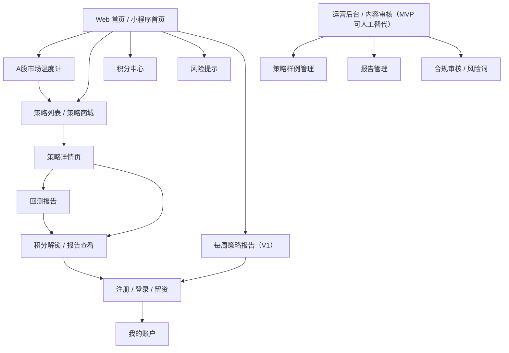
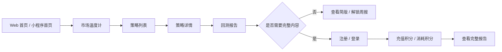

# A股 AI 量化策略研究平台原型图层

- 文档状态：Draft / PRD 原型图层
- 关联 PRD：[01_prd.md](/Users/liujun/Desktop/产品经理skill/projects/a-share-ai-quant-strategy-platform/01_prd.md)
- 最后更新时间：2026-05-04
- 说明：本文件是从 PRD 中单独拆出的低保真原型说明，用于评审页面结构、信息层级和跳转关系。当前不包含高保真 UI、PNG 或 HTML 原型。

---

## 1. 页面范围

### MVP 页面

| 页面 | 作用 | 优先级 |
|---|---|---|
| Web 首页 / 小程序首页 | 解释产品定位，引导进入市场温度计和策略列表 | P0 |
| A股市场温度计 | 免费工具入口，展示市场状态和适合关注的策略类型 | P0 |
| 策略列表 / 策略商城 | 展示策略样例，支持筛选和比较 | P0 |
| 策略详情页 | 展示策略收益、风险、逻辑、适用行情和积分解锁入口 | P0 |
| 回测报告页 | 标准化展示策略验证结果 | P0 |
| 注册 / 登录 / 留资页 | 完成用户识别、报告下载和积分账户识别 | P0 |
| 积分中心页 | 展示积分余额、充值、每日赠送和内容消耗规则 | P0 |
| 风险提示页 | 集中展示非投资建议、回测局限和用户责任 | P0 |

### V1 / Later 页面

| 页面 | 作用 | 阶段 |
|---|---|---|
| AI 策略助手 | 解释策略、指标和风险，不输出买卖指令 | V1 |
| 策略排行榜 | 用综合评分帮助用户发现值得研究的策略 | V1 |
| 每周策略报告 | 内容沉淀和复访留存 | V1 |
| 运营后台 / 内容审核 | 策略、报告、风险词和日志管理 | MVP 可人工替代，V1 完善 |
| 机构版 / API 服务页 | B 端咨询和后续商业化 | Future |
| 原生 App | 后期提升留存和移动端体验 | Future |

---

## 2. 页面信息架构图



---

## 3. 主路径跳转



### 路径说明

- 主路径：Web 首页 / 小程序首页 → 市场温度计 → 策略列表 → 策略详情 → 回测报告 → 注册 / 积分入口。
- 内容路径：公域文章 / 周报 → 策略详情或市场温度计 → 注册 / 解锁周报。
- 转化路径：策略详情 → 权限提示 → 注册登录 → 充值积分或消耗积分解锁内容。
- 合规路径：任意策略、报告、AI 解读页面 → 风险提示页。
- 后台路径：运营后台 → 策略样例管理 / 报告管理 / 合规审核 → 前台预览。

---

## 4. 页面低保真原型

### 4.1 Web 首页 / 小程序首页

页面目标：让首次访问用户在微信小程序和 Web 端快速理解产品定位，并进入免费工具或策略列表。

```text
┌──────────────────────────────────────────────┐
│ 顶部导航 / 小程序顶部栏：产品名 | 市场温度 | 策略列表 | 积分 | 风险提示 │
├──────────────────────────────────────────────┤
│ 首屏：A股 AI 量化策略研究与验证平台              │
│ 副标题：用回测、风险指标和 AI 解读看懂策略          │
│ [免费查看市场温度] [查看策略列表]                 │
├──────────────────────────────────────────────┤
│ 核心功能：市场温度计 | 回测报告 | AI 解读 | 风险评分 │
├──────────────────────────────────────────────┤
│ 策略样例：沪深300趋势 | ETF轮动 | 红利低波 | 行业轮动 │
│ 每张卡展示：收益、最大回撤、风险等级、适用行情       │
├──────────────────────────────────────────────┤
│ 为什么可信：区分回测/模拟/实盘，不承诺收益，不喊单    │
├──────────────────────────────────────────────┤
│ 积分中心：余额 | 充值 | 每日赠送 | 消耗记录 | 机构咨询 │
├──────────────────────────────────────────────┤
│ 页脚：风险提示 / 隐私协议 / 联系方式               │
└──────────────────────────────────────────────┘
```

验收关注：

- 首屏两个 CTA 明确。
- 策略样例同时展示收益和回撤。
- 风险提示入口不可隐藏。
- 小程序端首屏更轻，优先放市场温度和策略入口。
- Web 端保留 SEO 内容承接和完整积分规则说明。

### 4.2 A股市场温度计

页面目标：帮助用户快速判断市场状态，并进入适合关注的策略类型。

```text
┌──────────────────────────────────────────────┐
│ 标题：A股市场温度计             更新时间：YYYY-MM-DD HH:mm │
├──────────────────────────────────────────────┤
│ 今日结论：中性偏热 / 适合观察趋势与轮动策略           │
├──────────────────────────────────────────────┤
│ 指标区：                                             │
│ [市场情绪] 偏冷/中性/偏热   [趋势强度] 弱/中/强        │
│ [赚钱效应] 低/中/高        [波动风险] 低/中/高         │
│ [行业轮动] 弱/中/强        [适合策略] 趋势/防守/观察    │
├──────────────────────────────────────────────┤
│ 解释区：为什么是这个状态 / 需要注意什么风险             │
├──────────────────────────────────────────────┤
│ [查看适合策略] [解锁每周策略周报]                      │
├──────────────────────────────────────────────┤
│ 风险提示：不构成投资建议，历史表现不代表未来收益         │
└──────────────────────────────────────────────┘
```

状态：

- 数据正常：展示 6 个指标和解释。
- 数据延迟：展示最近更新时间和“数据延迟”提示。
- 数据缺失：不展示市场结论，提供刷新和稍后再试。

### 4.3 策略列表 / 策略商城

页面目标：让用户比较策略，并进入详情页。

```text
┌──────────────────────────────────────────────┐
│ 标题：策略列表 / 策略商城                         │
├──────────────────────────────────────────────┤
│ 筛选：市场[A股/ETF/指数] 类型[趋势/轮动/防守] 风险[低/中/高] │
│ 排序：综合评分 | 近30日表现 | 最大回撤 | 夏普比率             │
├──────────────────────────────────────────────┤
│ 策略卡片 1：沪深300趋势增强策略                     │
│ 年化收益：xx%（回测）  最大回撤：xx%  夏普：x.x       │
│ 状态：适用/观察/风险升高  风险等级：中  权限：积分解锁      │
│ [查看详情]                                             │
├──────────────────────────────────────────────┤
│ 策略卡片 2：ETF行业轮动策略                         │
│ 年化收益 / 最大回撤 / 夏普 / 状态 / 风险 / 权限          │
│ [查看详情]                                             │
└──────────────────────────────────────────────┘
```

验收关注：

- 默认不按单一收益率排序。
- 每张卡必须展示最大回撤。
- 收益必须标注回测 / 模拟盘 / 实盘。
- 空结果提供“重置筛选”。

### 4.4 策略详情页

页面目标：让用户完整理解单个策略的收益、风险、逻辑和失效条件。

```text
┌──────────────────────────────────────────────┐
│ 策略名称：沪深300趋势增强策略       状态：观察 / 风险中 │
│ 标签：指数 / 趋势 / 中风险 / 积分解锁                       │
├──────────────────────────────────────────────┤
│ 核心指标：年化收益 | 最大回撤 | 夏普比率 | 波动率 | 胜率     │
├──────────────────────────────────────────────┤
│ 图表区：收益曲线（策略 vs 基准） + 回撤曲线              │
├──────────────────────────────────────────────┤
│ 策略逻辑：策略如何产生信号 / 调仓频率 / 标的范围          │
├──────────────────────────────────────────────┤
│ 适用行情：趋势行情 / 行业轮动增强 / 波动可控              │
│ 失效场景：震荡反复 / 极端波动 / 流动性不足                │
├──────────────────────────────────────────────┤
│ 回测口径：区间 / 基准 / 手续费 / 滑点 / 数据来源           │
├──────────────────────────────────────────────┤
│ [查看完整回测报告] [解锁该策略] [AI 解读（V1/可隐藏）]     │
├──────────────────────────────────────────────┤
│ 风险提示：不构成投资建议，回测表现不代表未来收益           │
└──────────────────────────────────────────────┘
```

验收关注：

- 风险指标不能被收益图表遮住。
- 适用行情和失效场景必须同级展示。
- 权限不足时展示简版内容和积分解锁入口。

### 4.5 回测报告页

页面目标：用标准化报告帮助用户判断策略质量。

```text
┌──────────────────────────────────────────────┐
│ 报告标题：沪深300趋势增强策略回测报告                 │
│ 版本：简版/完整版       更新时间：YYYY-MM-DD             │
├──────────────────────────────────────────────┤
│ 回测参数：区间 | 初始资金 | 手续费 | 滑点 | 调仓频率 | 基准 │
├──────────────────────────────────────────────┤
│ 图表区：策略 vs 基准收益曲线                           │
│ 图表区：最大回撤曲线                                    │
├──────────────────────────────────────────────┤
│ 表格区：月度收益 / 年度收益 / 极端行情测试                │
├──────────────────────────────────────────────┤
│ 分析区：表现总结 / 主要风险 / 失效条件 / 适合阅读人群      │
├──────────────────────────────────────────────┤
│ 权限区：试看结束，登录或充值积分查看完整报告              │
│ [登录查看] [用积分解锁报告] [充值积分]                           │
├──────────────────────────────────────────────┤
│ 风险提示：历史回测和模拟表现不代表未来收益                 │
└──────────────────────────────────────────────┘
```

验收关注：

- 缺少手续费或滑点口径时，不得标为完整报告。
- 收益曲线和回撤曲线必须同时展示。
- 简版和完整版边界清楚。

### 4.6 注册 / 登录 / 留资页

页面目标：完成用户识别，并让用户返回触发前页面。

```text
┌──────────────────────────────────────────────┐
│ 标题：登录后查看完整报告 / 解锁策略更新                 │
├──────────────────────────────────────────────┤
│ 小程序：微信授权登录 + 手机号绑定                       │
│ Web：手机号 / 邮箱输入                                  │
│ 验证码输入                                             │
│ [登录 / 注册]                                          │
├──────────────────────────────────────────────┤
│ 勾选：我已阅读并同意隐私协议、服务协议和风险提示          │
├──────────────────────────────────────────────┤
│ 说明：登录后将返回刚才查看的策略或报告页面                │
└──────────────────────────────────────────────┘
```

验收关注：

- 未同意协议不能注册。
- 登录成功后返回原页面。
- 记录触发登录的来源页面和动作。

### 4.7 积分中心页

页面目标：展示积分获取、充值、每日登录赠送和内容解锁规则，替代月票、会员和观众票等收费表达。

```text
┌──────────────────────────────────────────────┐
│ 标题：积分中心：充值与内容解锁                         │
├──────────────────────────────────────────────┤
│ 积分余额：36        今日登录已赠送 +1 积分               │
│ 充值规则：1 元 = 1 积分                                  │
│ 每日奖励：每天登录送 1 积分，不可提现                     │
│ 消耗场景：报告解锁 / AI 解读 / 竞技场报名 / 观察内容解锁   │
├──────────────────────────────────────────────┤
│ [充值积分] [查看积分明细] [咨询机构服务]                  │
├──────────────────────────────────────────────┤
│ FAQ：积分是否可提现 / 是否构成投资建议 / 数据口径 / 退款规则 │
├──────────────────────────────────────────────┤
│ 风险提示：积分解锁内容不包含买卖建议、收益承诺和带单服务   │
└──────────────────────────────────────────────┘
```

验收关注：

- 充值接口未接入时，按钮文案应为“充值接口占位”或“申请内测”。
- 积分规则不能出现收益保证、荐股、带单、返利、提现表达。
- 页面必须展示“1 元 = 1 积分”和“每天登录送 1 积分”。

### 4.8 风险提示页

页面目标：集中说明产品边界，降低用户误解。

```text
┌──────────────────────────────────────────────┐
│ 标题：风险提示与服务边界                              │
├──────────────────────────────────────────────┤
│ 本平台内容仅用于量化策略研究、数据分析和投资者教育。       │
│ 不构成任何证券投资建议。                              │
│ 历史回测和模拟表现不代表未来收益。                      │
│ 投资有风险，决策需谨慎。                              │
├──────────────────────────────────────────────┤
│ 平台不提供：荐股喊单 / 收益承诺 / 代客交易 / 自动跟单       │
├──────────────────────────────────────────────┤
│ 数据口径说明 / 回测局限 / 用户责任 / 联系方式             │
└──────────────────────────────────────────────┘
```

验收关注：

- 全站页脚、策略详情、回测报告、积分中心页都能进入该页。
- 文案不可被折叠到用户难以看到的位置。

### 4.9 策略竞技场

页面目标：把垂直粉丝的仿真策略表现沉淀成可观看、可解锁、可孵化的策略研究内容，同时避免代客理财、跟单和荐股风险。

定位建议：

- 首期作为“小程序 + Web 增长/变现实验模块”，不直接接入实盘交易。
- 比赛在第三方量化仿真平台或平台自建仿真环境中运行。
- 平台展示匿名净值曲线、最大回撤、夏普、赛季排名和策略路演摘要。
- 不展示底层持仓、实时买卖信号、代码、仓位建议和可复制交易指令。
- 策略积分消耗收入按“研究内容解锁/创作者激励”处理，不写成投资收益分成。

#### 4.9.1 竞技场首页

```text
┌──────────────────────────────────────────────┐
│ 顶部：策略竞技场 S1             [参赛报名] [观察内容解锁] │
├──────────────────────────────────────────────┤
│ 赛季状态：S1 进行中｜第 2 周｜参赛策略 48｜观众 186       │
│ 规则摘要：统一虚拟资金 / 限定标的池 / 风控上限 / 匿名展示   │
├──────────────────────────────────────────────┤
│ 今日看点：                                                │
│ [今日涨幅 TOP] [本周黑马] [稳健防守] [最大回撤警示]         │
├──────────────────────────────────────────────┤
│ 榜单预览：                                                │
│ 1. 选手 A7｜综合分 92｜收益 +8.4%｜最大回撤 -2.1%｜段位 铂金 │
│ 2. 选手 K3｜综合分 89｜收益 +6.9%｜最大回撤 -1.4%｜段位 黄金 │
│ 3. 选手 M9｜综合分 86｜收益 +10.2%｜最大回撤 -5.8%｜段位 黄金│
├──────────────────────────────────────────────┤
│ [查看完整排行榜] [进入 1v1 对决] [解锁隐藏策略池]          │
├──────────────────────────────────────────────┤
│ 风险提示：仅为仿真策略研究和比赛展示，不构成投资建议        │
└──────────────────────────────────────────────┘
```

验收关注：

- 首页强调“仿真”“匿名”“规则统一”。
- 榜单同时展示收益和最大回撤，不只展示收益。
- 积分解锁入口不能写“跟单”“复制交易”“获取买点”。

#### 4.9.2 赛季规则页

```text
┌──────────────────────────────────────────────┐
│ 标题：S1 赛季规则                                      │
├──────────────────────────────────────────────┤
│ 基础规则：                                                │
│ 赛季周期：月赛 / 季度赛                                   │
│ 初始资金：统一虚拟资金 100 万                              │
│ 标的池：沪深300成分股 + ETF（示例，待确认）                │
│ 交易成本：统一佣金 / 滑点                                  │
├──────────────────────────────────────────────┤
│ 风控规则：                                                │
│ 单标的持仓上限 20%｜单日最大回撤熔断 7%｜禁止异常刷单        │
│ 每周至少一次有效操作，长期挂机不计入核心榜单                │
├──────────────────────────────────────────────┤
│ 排名规则：综合分 = 收益率 + 回撤控制 + 夏普 + 稳定性         │
│ 奖励规则：奖金池 / 平台服务费 / 创作者激励说明              │
├──────────────────────────────────────────────┤
│ 合规边界：不展示持仓信号，不提供投资建议，不承诺收益          │
│ [我已阅读规则，申请参赛]                                  │
└──────────────────────────────────────────────┘
```

验收关注：

- 参赛前必须确认规则和风险提示。
- 奖励说明要透明，但不得写成投资收益承诺。
- 如涉及现金奖金、分成、税务和平台抽佣，上线前需要法务/财务确认。

#### 4.9.3 选手报名页

```text
┌──────────────────────────────────────────────┐
│ 标题：申请成为 S1 赛季选手                              │
├──────────────────────────────────────────────┤
│ 昵称：__________       签名：________________             │
│ 头像 / 角色皮肤：默认皮肤｜量化研究员｜防守大师｜趋势猎手     │
│ 段位初始：青铜｜成长积分：0｜游戏货币：0                   │
├──────────────────────────────────────────────┤
│ 参赛类型：月赛 / 季度赛                                  │
│ 参赛费用：199-299 元/月（待确认）                         │
│ 策略平台账号：第三方平台昵称 / 仿真账户 ID                  │
├──────────────────────────────────────────────┤
│ 勾选：我同意匿名展示收益曲线、回撤、夏普和赛季排名            │
│ 勾选：我确认不在平台内发布买卖指令、带单或收益承诺            │
├──────────────────────────────────────────────┤
│ [提交报名] [查看规则]                                     │
└──────────────────────────────────────────────┘
```

验收关注：

- 对外只展示昵称、代号、曲线和指标。
- 管理端可做实名/联系方式留存，但前台不展示。
- 角色皮肤和游戏货币只作为平台内身份装饰或权益，不直接承诺现金价值。

#### 4.9.4 排行榜页

```text
┌──────────────────────────────────────────────┐
│ 标题：S1 策略排行榜                     筛选：总榜 / 分榜 │
├──────────────────────────────────────────────┤
│ 榜单 Tabs：综合榜｜今日涨幅 TOP｜本周黑马｜最大回撤榜｜夏普榜 │
├──────────────────────────────────────────────┤
│ 综合榜：                                                  │
│ 排名｜选手｜段位｜收益｜最大回撤｜夏普｜稳定性｜解锁状态        │
│ 01｜A7｜铂金｜+8.4%｜-2.1%｜1.8｜高｜可解锁                 │
│ 02｜K3｜黄金｜+6.9%｜-1.4%｜1.6｜高｜隐藏                   │
│ 03｜M9｜黄金｜+10.2%｜-5.8%｜1.1｜中｜可解锁                │
├──────────────────────────────────────────────┤
│ 榜单说明：综合排名不只看收益，同时考虑回撤、夏普和稳定性       │
├──────────────────────────────────────────────┤
│ [解锁策略观察] [查看选手主页] [查看赛季规则]                │
└──────────────────────────────────────────────┘
```

验收关注：

- 最大回撤榜不能做成“羞辱榜”，建议叫“风险波动榜”或“回撤警示”。
- 今日涨幅榜必须同时展示回撤和风险等级。
- 隐藏策略只能隐藏细节，不能隐藏基础风险指标。

#### 4.9.5 选手主页 / 策略档案页

```text
┌──────────────────────────────────────────────┐
│ 选手：A7                         段位：铂金  皮肤：趋势猎手 │
│ 签名：顺势而为，先控回撤                              │
├──────────────────────────────────────────────┤
│ 核心指标：赛季收益 +8.4%｜最大回撤 -2.1%｜夏普 1.8｜胜率 xx% │
├──────────────────────────────────────────────┤
│ 图表：匿名净值曲线 / 回撤曲线 / 月度表现                   │
├──────────────────────────────────────────────┤
│ 策略说明：因子方向 / 风控思路 / 适用市场环境                 │
│ 不展示：实时持仓、具体买卖信号、代码、仓位建议                │
├──────────────────────────────────────────────┤
│ 路演摘要：10 分钟策略逻辑复盘（文字 / 音频 / 视频占位）        │
├──────────────────────────────────────────────┤
│ [解锁该策略观察] [加入 1v1 对决投票] [举报异常]              │
├──────────────────────────────────────────────┤
│ 风险提示：解锁内容仅用于研究观察，不构成跟单或投资建议          │
└──────────────────────────────────────────────┘
```

验收关注：

- 选手主页可展示研究逻辑，不展示可复制交易指令。
- 解锁的是“策略观察内容”，不是“跟单信号”。
- 必须提供异常举报或申诉入口。

#### 4.9.6 1v1 策略对决页

```text
┌──────────────────────────────────────────────┐
│ 标题：1v1 策略对决｜A7 vs K3                         │
├──────────────────────────────────────────────┤
│ 对决条件：同一市场环境｜同一标的池｜同一交易成本｜同一时间窗     │
├──────────────────────────────────────────────┤
│ 左侧 A7：收益 +3.2%｜最大回撤 -1.1%｜夏普 1.4              │
│ 右侧 K3：收益 +2.5%｜最大回撤 -0.6%｜夏普 1.7              │
├──────────────────────────────────────────────┤
│ 双曲线对比：净值曲线 / 回撤曲线                           │
├──────────────────────────────────────────────┤
│ 观众投票：你更看好谁的风控和稳定性？                       │
│ [投 A7] [投 K3]                                          │
├──────────────────────────────────────────────┤
│ 评论区：仅允许讨论策略逻辑和风控，不允许发布买卖建议           │
└──────────────────────────────────────────────┘
```

验收关注：

- 投票问题应引导关注风控和稳定性，不只问“谁能赚钱”。
- 评论区需要风险词和买卖建议拦截。
- 对决结果不能包装成未来收益能力证明。

#### 4.9.7 观察内容解锁页

```text
┌──────────────────────────────────────────────┐
│ 标题：积分解锁策略竞技场观察内容                        │
├──────────────────────────────────────────────┤
│ 可解锁内容：                                              │
│ 查看匿名策略动态收益曲线                                  │
│ 查看最大回撤、夏普、稳定性评分                             │
│ 查看赛季榜单、1v1 对决、路演摘要                           │
│ 不包含：持仓、买卖点、实时信号、跟单服务                     │
├──────────────────────────────────────────────┤
│ 积分规则：充值 1 元 = 1 积分，每天登录送 1 积分             │
│ 内容消耗：单次观察内容 5-10 积分（待验证）                  │
│ [充值积分] [查看免费榜单]                                  │
├──────────────────────────────────────────────┤
│ 积分说明：积分仅用于平台内容和功能消耗，不可提现、不返利      │
│ 风险提示：积分解锁不代表获得投资建议或收益保证               │
└──────────────────────────────────────────────┘
```

验收关注：

- 积分只解锁“观察权”和“研究内容”，不能买交易信号。
- 分成描述应为内容激励，不写投资收益分成。
- 积分消耗数量需要在商业验证后确认。

#### 4.9.8 管理端审核页

```text
┌──────────────────────────────────────────────┐
│ 管理端：策略竞技场审核                                  │
├──────────────────────────────────────────────┤
│ 今日异常：高频刷单疑似 2｜回撤熔断 1｜评论风险词 5           │
├──────────────────────────────────────────────┤
│ 选手监控：账号｜净值异常｜交易频率｜回撤｜处理状态             │
│ A7｜正常｜低｜-2.1%｜通过                                  │
│ X5｜异常高频｜高｜-0.2%｜待复核                             │
├──────────────────────────────────────────────┤
│ 处理动作：[取消成绩] [要求说明] [恢复成绩] [公示处理结果]      │
├──────────────────────────────────────────────┤
│ 内容审核：路演摘要 / 评论 / 昵称签名 / 解锁文案               │
└──────────────────────────────────────────────┘
```

验收关注：

- 防作弊、内容合规和用户举报必须有处理闭环。
- 取消成绩需要留痕和可申诉。
- 公示只展示违规原因和处理结果，不泄露个人隐私。

---

## 5. 待确认

| 问题 | 影响 |
|---|---|
| 微信小程序和 Web 端首屏是否完全一致，还是小程序优先工具化 | 影响页面布局密度和导航结构 |
| 小程序充值、Web 充值和人工成交是否都进入 MVP | 影响积分中心页按钮和转化流程 |
| 策略竞技场首期使用第三方仿真平台还是自建仿真环境 | 影响开发成本、数据一致性和防作弊能力 |
| 报名积分、观察解锁、奖金池和创作者激励是否涉及现金结算 | 影响法务、财务、税务和平台规则 |
| 策略解锁展示到什么颗粒度 | 影响合规边界，不能展示实时持仓和买卖信号 |
| AI 策略助手是否进入 MVP | 影响详情页和积分中心页是否展示 AI 入口 |
| 是否需要真实运营后台 | 影响后台页面是否进入原型阶段 |
| 首批策略样例是否已确定 | 影响策略卡片和详情页字段真实性 |
