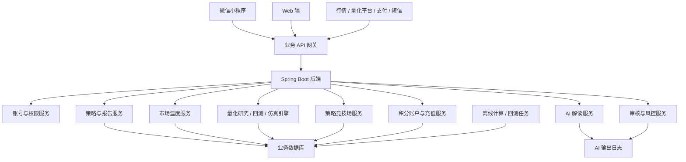
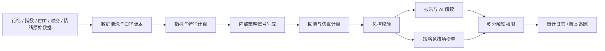
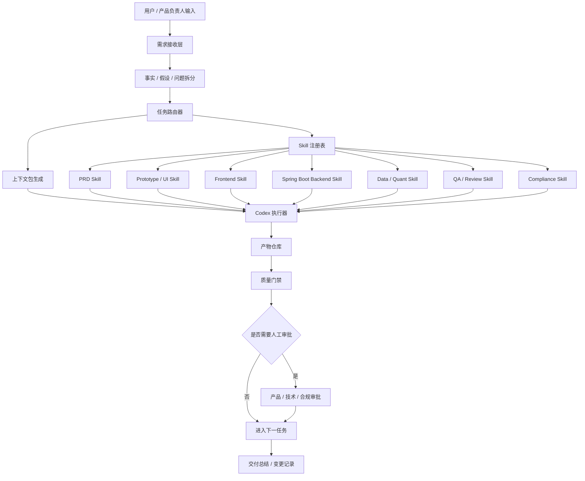
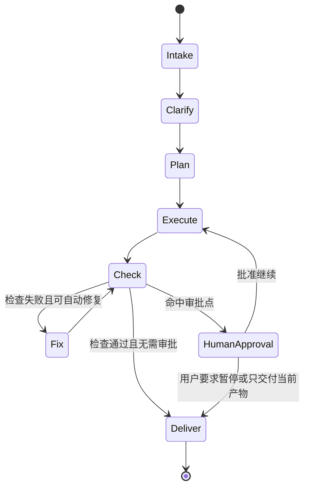
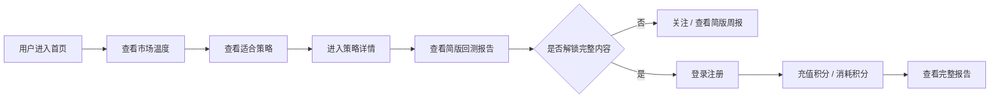
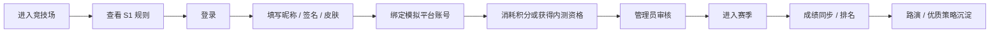
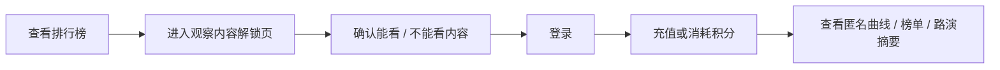
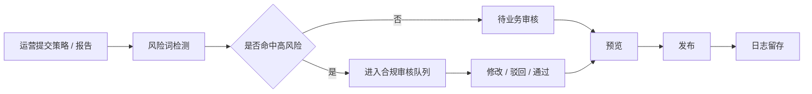

# A股 AI 量化策略研究平台内部开发文档

- 文档状态：Draft / 内部开发版
- 适用读者：产品、设计、前端、后端、算法、运营、合规审核、测试
- 项目阶段：MVP + P1 实验规划
- 首期端侧：微信小程序 + Web
- 后续端侧：原生 App
- 关联 PRD：[01_prd.md](/Users/liujun/Desktop/产品经理skill/projects/a-share-ai-quant-strategy-platform/01_prd.md)
- 关联原型说明：[02_prototype_layer.md](/Users/liujun/Desktop/产品经理skill/projects/a-share-ai-quant-strategy-platform/02_prototype_layer.md)
- HTML 原型：[prototype/html/index.html](/Users/liujun/Desktop/产品经理skill/projects/a-share-ai-quant-strategy-platform/prototype/html/index.html)
- 最后更新时间：2026-05-09

---

## 1. 文档定位

本文件是内部开发协作文档，不作为对外招商、用户说明或监管披露材料。

这是项目负责人自有项目的内部版文档，可以写清自动化开发框架、Codex 分线程、Skill 管理、后端模块拆分、风控门禁和内部执行约束。对外分享、招商、外包交付或用户说明时，需要另行裁剪为外部版。

开发团队需要用本文件明确：

- 首期做什么、不做什么。
- 微信小程序与 Web 的功能边界。
- 前端页面、后端接口、数据模型、权限、埋点和审核要求。
- 策略竞技场的开发拆分方式。
- 合规红线如何落实到产品和技术实现中。
- Codex 如何低人工介入地把 PRD、原型、Spring 后端、小程序 / Web 前端、测试和合规检查串起来。

### 1.1 当前研发基线

| 方向 | 当前决策 |
|---|---|
| 首期端侧 | 微信小程序 + Web C 端，原生 App 后置 |
| 后端框架 | Spring Boot 3.x，按模块拆分但 MVP 可先单体部署 |
| 商业化表达 | C 端不使用会员、月票、观众票、订阅等表达，统一为积分制度 |
| 积分规则 | `1 元 = 1 积分`，每日登录赠送 `1 积分`，积分不可提现、不可承诺收益 |
| 量化执行 | 参考 QuantDinger 的数据、指标、回测、风控、监控闭环，但只落地研究和仿真，不接实盘 |
| 竞技场 | P1 实验，采用赛季、段位、昵称、签名、皮肤、排行榜、1v1、积分观察解锁 |
| 自动化研发 | 使用 Codex 多 Skill、任务路由、分线程 / 分支和质量门禁降低人工介入 |
| 合规红线 | 不做荐股、喊单、带单、跟单、代客理财、实盘自动交易，不展示持仓、买卖点、实时信号和策略代码 |

本文件不替代正式合规意见。涉及证券业务资质、付费服务边界、营销话术和第三方数据授权时，需要单独走法务 / 合规确认。

---

## 2. 确认事实、开发假设、待确认问题

### 2.1 已确认事实

- 一期先做微信小程序 + Web 端。
- 后期再考虑原生 App。
- 产品定位是 A股 AI 量化策略研究平台。
- 平台提供策略研究、回测报告、风险指标、AI 解读、积分解锁、策略竞技场等能力。
- 平台不做荐股、喊单、带单、跟单、代客理财、实盘自动交易。
- 策略竞技场以仿真比赛和匿名策略表现展示为主，不展示持仓、买卖点、实时信号和策略代码。
- 当前已有 HTML 原型，覆盖首页、市场温度、策略列表、策略详情、回测报告、AI 助手、积分中心、风险提示、竞技场、排行榜、观察内容解锁、选手报名、后台审核等页面。

### 2.2 开发假设

- MVP 可先使用内部维护的策略样例、回测结果和市场温度数据，不强依赖全自动数据链路。
- 收费制度调整为积分制度：1 元 = 1 积分，每天登录赠送 1 积分。充值接口可以分两期：一期先做充值接口占位和积分明细，二期接微信支付或第三方支付。
- 策略回测和市场温度指标初期可以离线计算，每日或每周更新。
- AI 解读初期只做“解释型输出”，不做个性化投资建议。
- 后台审核初期先覆盖策略、报告、风险词命中和 AI 输出记录，运营流程可半自动。
- 策略竞技场可作为 P1 实验，不阻塞 P0 主路径上线。

### 2.3 待确认问题

| 类型 | 问题 | 影响 |
|---|---|---|
| 数据 | 市场行情、指数成分、ETF 数据、回测数据来自哪里，是否有商用授权 | 影响数据接入、缓存、展示免责声明 |
| 支付 | 一期是否接微信支付，还是只做充值接口占位 | 影响订单、退款、发票、积分入账 |
| 账号 | Web 与小程序是否统一账号体系，是否必须绑定手机号 | 影响登录、积分账户同步 |
| 合规 | 积分充值、积分消耗、策略竞技场观察解锁和选手积分报名是否需要额外资质或话术审核 | 影响商业化上线 |
| AI | 使用哪个模型供应商、输出是否需要审核后展示 | 影响成本、延迟、风控 |
| 竞技场 | 是否使用聚宽、掘金、MT5 等外部平台作为比赛环境 | 影响选手账号绑定、成绩同步、防作弊 |
| 运营 | 报告更新频率、策略上架流程、异常处理 SLA | 影响后台和测试用例 |

---

## 3. 版本范围

### 3.1 P0 MVP 范围

P0 目标是验证“免费工具引流 → 策略研究内容 → 注册 / 留资 → 积分解锁”的基本闭环。

P0 页面：

- 首页
- 市场温度计
- 策略列表
- 策略详情
- 回测报告
- 登录 / 注册 / 留资
- 积分中心
- 风险提示
- 我的账户基础版
- 运营后台基础版

P0 能力：

- 展示市场温度和指标解释。
- 展示策略列表、策略详情、回测报告。
- 展示积分规则、充值入口或留资入口。
- 用户登录后保存关注策略、报告访问、积分余额和积分明细。
- 后台维护策略、报告、风险词、页面内容。
- 所有策略和 AI 解读页面展示风险提示。

### 3.2 P1 策略竞技场实验

P1 目标是验证“策略竞技场”是否能把垂直粉丝的策略研究能力转化为选手报名、积分观察解锁和优质策略库。

P1 页面：

- 策略竞技场首页
- 竞技场排行榜
- S1 赛季规则
- 1v1 策略对决
- 观察内容解锁
- 选手报名
- 选手档案
- 后台竞技场管理

P1 能力：

- 选手匿名参赛。
- 统一虚拟资金、统一标的池、统一交易成本、统一风控限制。
- 排行榜支持综合榜、今日涨幅 TOP、本周黑马、回撤警示、夏普榜。
- 1v1 策略对决支持观众投票。
- 积分解锁只展示匿名收益曲线、最大回撤、夏普、稳定性、路演摘要。
- 排名前几策略可被积分解锁观察，但不展示持仓、买卖点、实时信号或策略代码。
- 管理员可处理异常交易、违规内容、榜单复核。

### 3.3 暂不做

- 原生 App。
- 券商账户绑定。
- 实盘交易、自动下单、跟单。
- 持仓、买卖点、实时信号展示。
- 策略代码售卖。
- 个股短线荐股、涨停板荐股。
- 一对一投资咨询。
- 完整机构私有化部署。

---

## 4. 推荐技术架构

本节分为两层：

- 产品运行架构：面向最终产品上线后的微信小程序、Web、后台、API、数据和 AI 服务。
- Codex 自动化开发主架构：面向内部研发过程，用多 Skill、多 Agent、多检查门禁降低人工介入。

### 4.1 总体架构



### 4.1.1 后端技术栈

后端统一采用 Spring 技术栈：

| 层 | 建议 |
|---|---|
| 应用框架 | Spring Boot 3.x |
| Web/API | Spring MVC / RESTful API |
| 安全认证 | Spring Security + JWT / Session，小程序登录接微信 openid |
| 数据访问 | Spring Data JPA 或 MyBatis Plus，按团队熟悉度选择 |
| 数据库 | MySQL 或 PostgreSQL |
| 缓存 | Redis，用于验证码、会话、热点榜单和积分防重复发放 |
| 任务调度 | Spring Scheduler / XXL-Job，用于市场温度、回测、榜单、每日登录积分补偿 |
| 接口文档 | OpenAPI / Swagger |
| 测试 | JUnit 5 + Spring Boot Test |
| 审计日志 | AOP 记录后台发布、审核、积分调整、充值回调等关键动作 |

### 4.2 端侧建议

| 端 | 建议 | 说明 |
|---|---|---|
| 微信小程序 | 用户主阵地 | 首页、市场温度、策略、报告、积分中心、竞技场、我的 |
| Web C 端 | 内容承接 + SEO + 积分转化 | 首页、策略详情、报告、积分中心、风险提示 |
| Web 管理后台 | 内部运营工具 | 策略管理、报告管理、竞技场管理、合规审核、日志 |
| 原生 App | 后期规划 | MVP 不投入开发 |

### 4.3 服务拆分建议

MVP 可以先做单体后端，但代码模块建议按服务边界拆：

- `auth`：登录、微信 openid、手机号、会话、用户权限。
- `user`：用户资料、关注策略、阅读历史、风险确认。
- `market`：市场温度、指标解释、更新时间。
- `market-data`：行情、指数、ETF、交易日历、数据源状态和缓存。
- `indicator-engine`：市场温度、技术指标、行业 / 风格指标计算。
- `strategy-engine`：内部策略信号、策略版本、策略参数管理。
- `backtest-engine`：回测任务、手续费 / 滑点、净值曲线、绩效指标。
- `risk-engine`：回撤、集中度、异常收益、违规表达、内容风控。
- `strategy`：策略列表、策略详情、状态、权限。
- `report`：回测报告、报告版本、试看、积分解锁权限。
- `points`：积分账户、充值接口、每日登录赠送、积分消耗、积分明细。
- `arena`：赛季、选手、榜单、对决、投票、积分解锁观察。
- `ai`：AI 解读、提示词模板、输出拦截、日志。
- `audit`：风险词、内容审核、操作日志。
- `admin`：后台聚合接口。

### 4.4 量化执行逻辑参考（参考 QuantDinger）

QuantDinger 可以作为“量化闭环”的参考：从数据源进入指标、信号、策略、回测、风控、执行监控和审计，形成完整研究链路。但本项目一期必须按国内合规边界收敛：只做研究、回测、仿真、策略竞技场和积分解锁，不做券商账户绑定、不做实盘下单、不做跟单、不向 C 端展示买卖点或实时交易信号。

#### 4.4.1 一期量化执行链路



| 环节 | 说明 | 一期输出 |
|---|---|---|
| 数据接入 | 接入行情、指数、ETF、财务、情绪、第三方仿真平台成绩等数据 | 原始数据批次、来源、更新时间 |
| 数据清洗 | 处理交易日历、复权、停牌、缺失值、异常值、数据口径版本 | 标准化 K 线、指标底表 |
| 指标与特征 | 计算市场温度、趋势、波动率、回撤、行业轮动、风格因子 | 指标快照、解释字段 |
| 内部策略信号 | 生成趋势、轮动、防守、多因子等内部研究信号 | 仅后台可见，不直接展示买卖建议 |
| 回测与仿真 | 统一初始资金、手续费、滑点、调仓频率和基准 | 年化、回撤、夏普、胜率、曲线 |
| 风控校验 | 校验最大回撤、集中度、异常收益、违规词、荐股风险 | 风险等级、拦截原因、人工复核状态 |
| 报告生成 | 输出回测报告、AI 解读、风险提示、试看内容 | 可积分解锁的研究内容 |
| 竞技场计算 | 计算赛季榜、黑马榜、今日涨幅榜、回撤榜、1v1 对决 | 匿名排名和观众可见指标 |
| 审计追踪 | 记录数据版本、计算版本、AI 输出、积分消耗、人工复核 | 可追溯日志 |

#### 4.4.2 Spring 模块落地

| 模块 | 职责 |
|---|---|
| `market-data` | 数据接入、缓存、交易日历、数据源状态 |
| `indicator-engine` | 市场温度、技术指标、风格/行业指标计算 |
| `strategy-engine` | 内部策略信号、策略版本、策略参数管理 |
| `backtest-engine` | 回测任务、手续费/滑点、净值曲线、绩效指标 |
| `risk-engine` | 回撤、集中度、异常收益、违规表达、内容风控 |
| `arena-engine` | 赛季、匿名选手、榜单、对决、投票和成绩复核 |
| `report-engine` | 报告生成、试看、AI 解读、报告版本 |
| `points` | 积分解锁、充值接口、每日登录赠送、积分明细 |
| `audit-log` | 数据批次、计算版本、后台操作、AI 输出和积分流水审计 |

#### 4.4.3 可借鉴与不采用

| 类别 | 处理方式 |
|---|---|
| 可借鉴 | 回测引擎、风险管理器、绩效分析器、执行监控、权限审批、仿真优先、安全审计 |
| 需改造 | QuantDinger 的 Python / Flask 技术栈改为 Spring Boot 后端模块；交易执行链路改为研究与仿真链路 |
| 不采用 | 实盘交易、券商 / 交易所账户连接、自动下单、跟单、公开买卖点、面向 C 端的实时交易信号 |

#### 4.4.4 安全默认值

- 默认运行模式为 `research_only` / `simulation_only`，不提供 `live_trade` 能力。
- 后台可以看到策略参数、回测配置和风控详情，C 端只看到经过审核的摘要、指标和风险提示。
- AI 只能解释数据和报告，不允许生成“立即买入 / 卖出 / 持有”等直接操作指令。
- 任何新增外部行情源、仿真平台、支付充值、积分规则或实盘相关能力，必须先走人工审批和合规复核。

---

## 5. Codex 自动化开发主架构

### 5.1 架构目标

本项目内部研发建议采用“多 Skill 管理 + 任务编排 + 质量门禁 + 人工审批点”的 Codex 自动化开发框架。

目标不是完全无人参与，而是把人工从重复劳动中抽离出来，只保留在方向、范围、合规、支付、数据授权、发布等关键节点做确认。

核心目标：

- 从需求输入自动生成 PRD、原型、开发文档、接口草案和任务拆分。
- 根据任务类型自动选择对应 Skill 或执行链。
- 让 Codex 可以低人工介入地完成文档更新、原型迭代、代码实现、检查修复和交付总结。
- 所有高风险动作保留人工审批点。
- 所有产物可追溯、可检查、可回滚。

### 5.2 自动化研发总架构



### 5.3 核心模块

| 模块 | 职责 | 输入 | 输出 |
|---|---|---|---|
| 需求接收层 | 接收用户输入、文件、截图、PRD 片段和反馈 | 对话、文件、图片、现有代码 | 原始需求记录 |
| 事实拆分器 | 区分已确认事实、开发假设、待确认问题 | 原始需求 | 需求事实表、阻塞问题 |
| 任务路由器 | 判断任务属于产品、原型、前端、后端、数据、测试、合规或文档 | 需求事实表 | Skill 执行链 |
| Skill 注册表 | 管理可用 Skill、适用范围、输入输出和检查项 | Skill 元数据 | 可执行 Skill 列表 |
| 上下文包生成器 | 为每个任务生成最小上下文，避免过载 | PRD、原型、代码、历史记录 | Task Brief |
| Codex 执行器 | 执行文档、代码、原型、测试、修复任务 | Task Brief + Skill | 文件变更 / 报告 |
| 质量门禁 | 自动运行语法、链接、截图、单测、接口、合规词检查 | 变更产物 | 通过 / 失败 / 修复建议 |
| 人工审批点 | 在高风险变更前要求人工确认 | 发布、支付、数据、合规、删除等动作 | 批准 / 驳回 |
| 产物仓库 | 存储 PRD、开发文档、原型、接口、测试记录 | 自动化输出 | 可追溯项目资料 |

### 5.4 Skill 分层设计

建议按“产品研发链路”而不是单个页面来组织 Skill。

| Skill 类型 | 用途 | 典型输入 | 典型输出 |
|---|---|---|---|
| 需求整理 Skill | 把用户输入整理成结构化需求 | 原始文本、截图、文件 | source notes、事实 / 假设 / 问题 |
| PRD Skill | 生成或更新 PRD | source notes、用户补充 | PRD、范围、指标、验收 |
| 原型 Skill | 生成低保真 / HTML 原型 | PRD、参考图、页面清单 | 原型说明、HTML/CSS/JS |
| UI 还原 Skill | 从参考图提取组件和视觉规则 | 图片文件夹、现有原型 | 高保真 HTML 原型、组件清单 |
| 开发文档 Skill | 把 PRD 转为内部开发文档 | PRD、原型、技术约束 | 开发文档、接口草案、数据模型 |
| 前端实现 Skill | 实现 Web / 小程序页面 | 原型、接口草案 | 前端代码、组件、样式 |
| Spring Boot 后端 Skill | 实现 API、权限、业务逻辑、模块边界和数据库迁移 | 数据模型、接口草案 | Spring Boot 代码、迁移、接口 |
| 数据 / 量化 Skill | 实现市场温度、指标、回测、仿真榜单和 QuantDinger 参考逻辑适配 | 数据口径、样例数据、参考项目说明 | 计算模块、指标说明、风控边界 |
| AI 风控 Skill | 管理提示词、输出结构、拦截规则 | AI 场景、风险词库 | prompt、拦截器、日志规则 |
| QA Skill | 运行检查、测试、截图验收 | 代码、原型、验收标准 | 测试报告、缺陷列表 |
| 合规审核 Skill | 检查高风险表述和服务边界 | 文案、AI 输出、页面 | 风险清单、修改建议 |
| 发布 Skill | 打包、部署、变更说明 | 通过门禁的代码 | 发布包、版本记录 |

### 5.5 任务编排流程

每次 Codex 自动化开发任务按以下固定流程执行：

```text
需求输入
-> 读取项目规则和现有产物
-> 识别任务类型
-> 生成 Task Brief
-> 选择 Skill 执行链
-> 执行文件修改或代码实现
-> 运行质量门禁
-> 自动修复可修复问题
-> 输出变更摘要和剩余风险
-> 如命中审批点，停止并等待人工确认
```

Task Brief 必须包含：

- 目标。
- 输入来源。
- 可修改文件。
- 不可修改文件。
- 预期输出。
- 必跑检查。
- 人工审批点。
- 最小可交付范围。

### 5.6 自动化开发状态机



### 5.7 人工介入边界

低人工介入不代表跳过审批。以下动作必须人工确认：

- 改变产品范围。
- 改变数据库结构。
- 接入新的外部数据源。
- 引入或改造 QuantDinger 等外部量化项目的执行逻辑。
- 接入真实支付。
- 修改积分充值、消耗和收费规则。
- 修改合规边界。
- 增加任何实盘、券商账户、自动下单、跟单或实时买卖信号能力。
- 发布到线上环境。
- 删除数据或迁移数据。
- 推送远程仓库、创建公开 PR。
- 创建或修改长期稳定项目规则。

普通低风险动作可自动执行：

- 更新 PRD、原型说明、内部开发文档。
- 根据参考图修改 HTML 原型。
- 生成接口草案、数据模型草案。
- 增加页面空态、错误态、权限态说明。
- 运行语法检查、截图检查、链接检查。
- 修复格式、文案一致性、组件样式问题。

### 5.8 质量门禁

每类产物都要有自动检查。

| 产物 | 自动检查 |
|---|---|
| PRD / 文档 | 链接可用、章节完整、事实 / 假设 / 问题分离、范围和非范围清晰 |
| HTML 原型 | 页面可打开、无控制台错误、无明显溢出、无已删除组件回归 |
| 小程序前端 | lint、构建、关键页面截图、权限态检查 |
| Web 前端 | lint、类型检查、构建、关键页面截图 |
| Spring Boot 后端 | JUnit、Spring Boot Test、接口测试、迁移检查、权限测试 |
| API 文档 | 路径、参数、权限、错误码、示例完整 |
| 量化执行逻辑 | 默认 research_only / simulation_only；无券商账户、无实盘下单、无跟单、无 C 端实时买卖信号 |
| AI 输出 | 禁止词拦截、结构化输出、风险提示存在 |
| 合规文案 | 不出现收益承诺、买卖建议、跟单、持仓和实时信号 |
| 竞技场 | 榜单口径、异常处理、积分解锁边界、匿名展示检查 |

### 5.9 产物目录建议

当前项目可按以下目录沉淀自动化产物：

```text
projects/a-share-ai-quant-strategy-platform/
  AGENTS.md
  Makefile
  00_source_notes.md
  01_prd.md
  02_prototype_layer.md
  03_internal_development_doc.md
  04_codex_development_doc.md
  05_codex_parallel_branch_development_doc.md
  06_api_spec.md
  07_database_schema.md
  08_backend_engineering_spec.md
  09_task_breakdown.md
  10_test_plan.md
  11_local_dev_runbook.md
  12_codex_thread_governance.md
  13_task_brief_template.md
  14_file_boundary_matrix.md
  15_failure_handling_protocol.md
  16_codex_execution_runbook.md
  17_sdd_engineering_lessons.md
  18_contract_change_request_template.md
  19_merge_review_checklist.md
  scripts/
    check-docs.sh
    check-compliance.sh
    check-contracts.sh
    check-prototype.sh
    check-thread-boundary.sh
  tasks/
    p0-spring-api.brief.md
    p0-quant-engine.brief.md
    p0-points.brief.md
    qa-gates.brief.md
  automation/
    thread_registry.md
    skill_registry.md
    task_router.md
    quality_gates.md
    approval_points.md
    runbooks.md
  prototype/
    html/
```

说明：

- `automation/` 是项目级自动化研发框架，不是产品 C 端功能。
- Skill 注册表只记录本项目如何选用 Skill，不直接修改 Codex 全局 Skill。
- 如果未来要沉淀为长期通用规则，需要单独提出稳定变更方案并获得确认。

### 5.10 本项目推荐 Skill 执行链

| 场景 | 推荐执行链 |
|---|---|
| 新需求输入 | 需求整理 Skill → PRD Skill → 开发文档 Skill |
| 原型迭代 | 原型 Skill → UI 还原 Skill → QA Skill |
| P0 前端开发 | 开发文档 Skill → 前端实现 Skill → QA Skill |
| P0 后端开发 | 开发文档 Skill → Spring Boot 后端 Skill → API 检查 → QA Skill |
| 市场温度开发 | 数据 / 量化 Skill → Spring Boot 后端 Skill → 前端实现 Skill → QA Skill |
| 量化执行逻辑适配 | 数据 / 量化 Skill → Spring Boot 后端 Skill → 合规审核 Skill → QA Skill |
| AI 助手开发 | AI 风控 Skill → Spring Boot 后端 Skill → 前端实现 Skill → 合规审核 Skill |
| 积分体系开发 | 开发文档 Skill → Spring Boot 后端 Skill → 前端实现 Skill → QA Skill |
| 竞技场开发 | PRD Skill → 数据 / 量化 Skill → Spring Boot 后端 Skill → 前端实现 Skill → 合规审核 Skill → QA Skill |
| 上线前检查 | QA Skill → 合规审核 Skill → 发布 Skill |

---

## 6. 前端页面清单

### 6.1 小程序 / C 端页面

| 页面 | 路由建议 | 优先级 | 登录要求 | 权限要求 |
|---|---|---:|---|---|
| 首页 | `/pages/home/index` | P0 | 否 | 无 |
| 市场温度计 | `/pages/market/index` | P0 | 否 | 无 |
| 策略列表 | `/pages/strategy/list` | P0 | 否 | 无 |
| 策略详情 | `/pages/strategy/detail?id=` | P0 | 否 | 部分内容需积分解锁 |
| 回测报告 | `/pages/report/detail?id=` | P0 | 试看否，完整是 | 积分解锁 |
| 登录注册 | `/pages/auth/login` | P0 | 否 | 无 |
| 积分中心 | `/pages/points/index` | P0 | 否 | 无 |
| 我的账户 | `/pages/profile/index` | P0 | 是 | 用户本人 |
| 风险提示 | `/pages/risk/index` | P0 | 否 | 无 |
| AI 策略助手 | `/pages/ai/chat` | V1 | 是 | 积分次数限制 |
| 每周策略报告 | `/pages/weekly/index` | V1 | 试看否，完整是 | 积分解锁 |
| 竞技场首页 | `/pages/arena/index` | P1 | 否 | 无 |
| 竞技场排行榜 | `/pages/arena/ranking` | P1 | 否 | 免费看简版 |
| 1v1 对决 | `/pages/arena/battle?id=` | P1 | 否 | 投票需登录 |
| 观察内容解锁 | `/pages/arena/audience` | P1 | 否 | 积分解锁后可看 |
| S1 赛季规则 | `/pages/arena/rules` | P1 | 否 | 无 |
| 选手报名 | `/pages/arena/signup` | P1 | 是 | 积分报名 / 审核 |
| 选手档案 | `/pages/arena/player?id=` | P1 | 否 | 部分需积分解锁 |

### 6.2 Web 管理后台页面

| 页面 | 路由建议 | 优先级 |
|---|---|---:|
| 后台首页 | `/admin/dashboard` | P0 |
| 策略管理 | `/admin/strategies` | P0 |
| 报告管理 | `/admin/reports` | P0 |
| 合规审核 | `/admin/audit` | P0 |
| 风险词库 | `/admin/risk-words` | P0 |
| 用户管理 | `/admin/users` | P0 |
| 积分 / 充值记录 | `/admin/points` | P0 |
| 竞技场管理 | `/admin/arena/seasons` | P1 |
| 选手管理 | `/admin/arena/players` | P1 |
| 榜单复核 | `/admin/arena/rankings` | P1 |
| 1v1 对决管理 | `/admin/arena/battles` | P1 |
| AI 输出日志 | `/admin/ai/logs` | V1 |

---

## 7. 核心流程

### 7.1 免费工具到积分解锁



### 7.2 策略竞技场选手流程



### 7.3 观察内容积分解锁流程



### 7.4 内容审核流程



---

## 8. 权限与角色

| 角色 | 权限 |
|---|---|
| 游客 | 看首页、市场温度、策略列表、策略详情简版、报告试看、风险提示、竞技场免费榜单 |
| 注册用户 | 保存关注、查看周报、查看我的账户、投票、提交报名资料 |
| 免费用户 | 注册用户基础权限 |
| 积分用户 | 通过充值、每日登录赠送或运营赠送获得积分 |
| 内容解锁用户 | 消耗积分查看完整报告、AI 解读、策略观察内容 |
| 竞技场观察用户 | 消耗积分查看匿名策略曲线、榜单、1v1、路演摘要 |
| 竞技场选手 | 报名参赛、查看本人赛季成绩、参与路演 |
| 运营 | 管理策略、报告、周报、竞技场内容 |
| 合规审核 | 审核风险词、AI 输出、报告文案、营销话术 |
| 管理员 | 全量后台权限、用户和订单管理、榜单复核 |

权限底线：

- 未登录用户不能充值、消耗积分、投票、报名、保存关注。
- 未消耗积分用户不能查看完整报告和需解锁内容。
- 积分解锁不能解锁持仓、买卖点、实时信号或策略代码。
- 选手本人也不能通过平台向观众发布交易指令。
- 后台所有发布、下线、审核、退款、取消成绩动作必须记录操作日志。

---

## 9. 数据模型草案

### 9.1 用户与权限

`users`

| 字段 | 类型 | 说明 |
|---|---|---|
| id | bigint | 用户 ID |
| openid | varchar | 微信 openid |
| unionid | varchar | 微信 unionid，可空 |
| phone | varchar | 手机号，可空 |
| email | varchar | 邮箱，可空 |
| nickname | varchar | 昵称 |
| avatar_url | varchar | 头像 |
| status | enum | active / disabled |
| created_at | datetime | 创建时间 |
| updated_at | datetime | 更新时间 |

`point_accounts`

| 字段 | 类型 | 说明 |
|---|---|---|
| id | bigint | 积分账户 ID |
| user_id | bigint | 用户 ID |
| balance | int | 可用积分余额 |
| total_recharged | int | 累计充值积分 |
| total_granted | int | 累计赠送积分 |
| total_consumed | int | 累计消耗积分 |
| updated_at | datetime | 更新时间 |

`point_transactions`

| 字段 | 类型 | 说明 |
|---|---|---|
| id | bigint | 积分流水 ID |
| user_id | bigint | 用户 ID |
| account_id | bigint | 积分账户 ID |
| tx_type | enum | recharge / daily_grant / admin_grant / consume / refund |
| amount | int | 积分变动，收入为正，消耗为负 |
| scene | varchar | report / ai / arena_signup / arena_observe / recharge |
| related_object_type | varchar | report / strategy / battle / season |
| related_object_id | bigint | 关联对象 ID |
| status | enum | pending / success / failed / reversed |
| created_at | datetime | 创建时间 |

`point_recharge_orders`

| 字段 | 类型 | 说明 |
|---|---|---|
| id | bigint | 充值订单 ID |
| user_id | bigint | 用户 ID |
| amount_cny | decimal | 充值金额，1 元 = 1 积分 |
| points | int | 入账积分 |
| payment_channel | varchar | wechat / manual / test |
| status | enum | created / paid / failed / refunded |
| paid_at | datetime | 支付完成时间 |

`risk_confirmations`

| 字段 | 类型 | 说明 |
|---|---|---|
| id | bigint | 记录 ID |
| user_id | bigint | 用户 ID |
| scene | varchar | strategy / report / arena / recharge |
| version | varchar | 风险提示版本 |
| confirmed_at | datetime | 确认时间 |

### 9.2 策略与报告

`strategies`

| 字段 | 类型 | 说明 |
|---|---|---|
| id | bigint | 策略 ID |
| name | varchar | 策略名称 |
| code | varchar | 展示短码 |
| strategy_type | varchar | trend / rotation / defense / multi_factor |
| market_scope | varchar | 指数 / ETF / 股票池 |
| risk_level | enum | low / medium / high |
| access_level | enum | free / preview / points_locked / internal_only |
| status | enum | draft / review / published / offline |
| summary | text | 简介 |
| logic_summary | text | 策略逻辑 |
| applicable_market | text | 适用行情 |
| failure_scenarios | text | 失效场景 |
| compliance_note | text | 风险提示 |
| created_by | bigint | 创建人 |
| updated_at | datetime | 更新时间 |

`strategy_metrics`

| 字段 | 类型 | 说明 |
|---|---|---|
| strategy_id | bigint | 策略 ID |
| period | varchar | 统计周期 |
| annual_return | decimal | 历史年化收益 |
| max_drawdown | decimal | 最大回撤 |
| sharpe | decimal | 夏普比率 |
| volatility | decimal | 波动率 |
| win_rate | decimal | 胜率 |
| data_type | enum | backtest / simulation / imported_simulation |
| calculated_at | datetime | 计算时间 |

`reports`

| 字段 | 类型 | 说明 |
|---|---|---|
| id | bigint | 报告 ID |
| strategy_id | bigint | 策略 ID |
| title | varchar | 报告标题 |
| version | varchar | 版本 |
| visibility | enum | preview / points_locked / internal_only |
| content_blocks | json | 报告结构化内容 |
| backtest_params | json | 回测参数 |
| status | enum | draft / review / published / offline |
| published_at | datetime | 发布时间 |

### 9.2.1 量化执行与回测

`data_batches`

| 字段 | 类型 | 说明 |
|---|---|---|
| id | bigint | 数据批次 ID |
| source | varchar | 数据来源 |
| market | varchar | 市场 / 指数 / ETF 池 |
| data_type | varchar | kline / index / etf / finance / sentiment |
| trade_date | date | 交易日 |
| version | varchar | 数据口径版本 |
| status | enum | pending / ready / failed / archived |
| error_message | text | 失败原因 |
| created_at | datetime | 创建时间 |

`indicator_snapshots`

| 字段 | 类型 | 说明 |
|---|---|---|
| id | bigint | 指标快照 ID |
| data_batch_id | bigint | 数据批次 ID |
| indicator_code | varchar | 指标编码 |
| indicator_value | decimal | 指标值 |
| dimension | varchar | market / industry / style / strategy |
| calculated_at | datetime | 计算时间 |

`backtest_runs`

| 字段 | 类型 | 说明 |
|---|---|---|
| id | bigint | 回测任务 ID |
| strategy_id | bigint | 策略 ID |
| run_mode | enum | research_only / simulation_only |
| params | json | 初始资金、手续费、滑点、调仓频率、基准 |
| data_version | varchar | 数据版本 |
| engine_version | varchar | 计算引擎版本 |
| status | enum | queued / running / success / failed / blocked |
| result_summary | json | 年化、回撤、夏普、胜率等摘要 |
| risk_status | enum | pass / warning / blocked |
| created_at | datetime | 创建时间 |
| completed_at | datetime | 完成时间 |

`backtest_equity_points`

| 字段 | 类型 | 说明 |
|---|---|---|
| id | bigint | 净值点 ID |
| run_id | bigint | 回测任务 ID |
| trade_date | date | 交易日 |
| equity | decimal | 净值 |
| drawdown | decimal | 当前回撤 |
| benchmark_equity | decimal | 基准净值 |

`risk_checks`

| 字段 | 类型 | 说明 |
|---|---|---|
| id | bigint | 风控检查 ID |
| object_type | varchar | strategy / report / backtest_run / arena_player |
| object_id | bigint | 对象 ID |
| check_type | varchar | drawdown / concentration / abnormal_return / forbidden_words |
| result | enum | pass / warning / blocked |
| detail | json | 命中明细 |
| checked_at | datetime | 检查时间 |

### 9.3 市场温度

`market_temperature_snapshots`

| 字段 | 类型 | 说明 |
|---|---|---|
| id | bigint | 快照 ID |
| market | varchar | A股 / 沪深300 / ETF 等 |
| score | int | 综合温度 0-100 |
| conclusion | varchar | 偏冷 / 中性 / 偏热 |
| sentiment_score | int | 市场情绪 |
| trend_score | int | 趋势强度 |
| profit_effect_score | int | 赚钱效应 |
| volatility_risk_score | int | 波动风险 |
| rotation_score | int | 行业轮动 |
| explanation | text | 解释 |
| data_source | varchar | 数据来源 |
| snapshot_at | datetime | 数据时间 |

### 9.4 竞技场

`arena_seasons`

| 字段 | 类型 | 说明 |
|---|---|---|
| id | bigint | 赛季 ID |
| name | varchar | S1 / S2 |
| starts_at | date | 开始日期 |
| ends_at | date | 结束日期 |
| initial_capital | decimal | 虚拟初始资金 |
| target_pool | json | 标的池 |
| rules | json | 规则配置 |
| status | enum | draft / active / ended |

`arena_players`

| 字段 | 类型 | 说明 |
|---|---|---|
| id | bigint | 选手 ID |
| user_id | bigint | 用户 ID |
| season_id | bigint | 赛季 ID |
| nickname | varchar | 匿名昵称 |
| signature | varchar | 签名 |
| skin_code | varchar | 皮肤 |
| platform_account_id | varchar | 外部模拟平台账号 |
| review_status | enum | pending / approved / rejected |
| tier | varchar | 段位 |

`arena_rankings`

| 字段 | 类型 | 说明 |
|---|---|---|
| id | bigint | 排名记录 |
| season_id | bigint | 赛季 ID |
| player_id | bigint | 选手 ID |
| rank_type | varchar | comprehensive / day / horse / drawdown / sharpe |
| rank_no | int | 排名 |
| return_rate | decimal | 收益 |
| max_drawdown | decimal | 最大回撤 |
| sharpe | decimal | 夏普 |
| stability | decimal | 稳定性 |
| score | decimal | 综合分 |
| calculated_at | datetime | 计算时间 |

`arena_battles`

| 字段 | 类型 | 说明 |
|---|---|---|
| id | bigint | 对决 ID |
| season_id | bigint | 赛季 ID |
| player_a_id | bigint | A 方 |
| player_b_id | bigint | B 方 |
| starts_at | datetime | 开始时间 |
| ends_at | datetime | 结束时间 |
| result | json | 对决结果 |
| status | enum | scheduled / active / ended |

`arena_votes`

| 字段 | 类型 | 说明 |
|---|---|---|
| id | bigint | 投票 ID |
| battle_id | bigint | 对决 ID |
| user_id | bigint | 用户 ID |
| voted_player_id | bigint | 投票对象 |
| created_at | datetime | 投票时间 |

### 9.5 审核与日志

`audit_tasks`

| 字段 | 类型 | 说明 |
|---|---|---|
| id | bigint | 审核任务 |
| object_type | varchar | strategy / report / ai_output / comment |
| object_id | bigint | 对象 ID |
| risk_level | enum | low / medium / high |
| matched_words | json | 命中风险词 |
| status | enum | pending / approved / rejected / revised |
| reviewer_id | bigint | 审核人 |
| reviewed_at | datetime | 审核时间 |

`operation_logs`

| 字段 | 类型 | 说明 |
|---|---|---|
| id | bigint | 日志 ID |
| actor_id | bigint | 操作人 |
| action | varchar | 操作 |
| object_type | varchar | 对象类型 |
| object_id | bigint | 对象 ID |
| before_data | json | 变更前 |
| after_data | json | 变更后 |
| created_at | datetime | 操作时间 |

---

## 10. API 草案

### 10.1 C 端 API

| 方法 | 路径 | 说明 |
|---|---|---|
| GET | `/api/v1/market/temperature/latest` | 获取最新市场温度 |
| GET | `/api/v1/strategies` | 策略列表 |
| GET | `/api/v1/strategies/{id}` | 策略详情 |
| GET | `/api/v1/reports/{id}` | 报告详情，按权限返回试看或完整内容 |
| POST | `/api/v1/auth/wechat-login` | 小程序微信登录 |
| POST | `/api/v1/auth/sms-login` | 手机号验证码登录 |
| GET | `/api/v1/points/account` | 积分账户和余额 |
| GET | `/api/v1/points/transactions` | 积分明细 |
| POST | `/api/v1/points/recharge-orders` | 创建充值订单，1 元 = 1 积分 |
| POST | `/api/v1/points/daily-checkin` | 每日登录赠送 1 积分 |
| POST | `/api/v1/points/consume` | 消耗积分解锁内容 |
| GET | `/api/v1/profile` | 我的账户 |
| POST | `/api/v1/user/favorites` | 关注策略 |
| POST | `/api/v1/risk/confirmations` | 风险提示确认 |
| POST | `/api/v1/ai/strategy-explain` | AI 策略解释 |

### 10.2 竞技场 API

| 方法 | 路径 | 说明 |
|---|---|---|
| GET | `/api/v1/arena/seasons/current` | 当前赛季 |
| GET | `/api/v1/arena/rankings` | 排行榜 |
| GET | `/api/v1/arena/players/{id}` | 选手档案 |
| POST | `/api/v1/arena/players/apply` | 选手报名 |
| GET | `/api/v1/arena/battles/{id}` | 1v1 对决详情 |
| POST | `/api/v1/arena/battles/{id}/votes` | 投票 |
| GET | `/api/v1/arena/audience/entitlements` | 观察内容可解锁范围 |
| POST | `/api/v1/arena/audience/unlock` | 消耗积分解锁观察内容 |

### 10.3 管理后台 API

| 方法 | 路径 | 说明 |
|---|---|---|
| GET | `/api/v1/admin/dashboard` | 后台指标 |
| GET | `/api/v1/admin/strategies` | 策略管理列表 |
| POST | `/api/v1/admin/strategies` | 新建策略 |
| PATCH | `/api/v1/admin/strategies/{id}` | 更新策略 |
| POST | `/api/v1/admin/strategies/{id}/submit-review` | 提交审核 |
| POST | `/api/v1/admin/strategies/{id}/publish` | 发布策略 |
| POST | `/api/v1/admin/strategies/{id}/offline` | 下线策略 |
| GET | `/api/v1/admin/reports` | 报告列表 |
| POST | `/api/v1/admin/reports/{id}/publish` | 发布报告 |
| GET | `/api/v1/admin/data-batches` | 数据批次列表 |
| POST | `/api/v1/admin/indicators/recalculate` | 重新计算指标 |
| GET | `/api/v1/admin/backtest-runs` | 回测任务列表 |
| POST | `/api/v1/admin/backtest-runs` | 创建 research_only / simulation_only 回测任务 |
| GET | `/api/v1/admin/risk-checks` | 风控检查记录 |
| GET | `/api/v1/admin/audit/tasks` | 审核任务 |
| POST | `/api/v1/admin/audit/tasks/{id}/approve` | 审核通过 |
| POST | `/api/v1/admin/audit/tasks/{id}/reject` | 审核驳回 |
| GET | `/api/v1/admin/arena/seasons` | 赛季管理 |
| GET | `/api/v1/admin/arena/players` | 选手管理 |
| POST | `/api/v1/admin/arena/players/{id}/approve` | 选手审核通过 |
| POST | `/api/v1/admin/arena/players/{id}/disqualify` | 取消选手成绩 |

---

## 11. AI 解读要求

### 11.1 允许输出

- 解释市场温度指标含义。
- 解释策略逻辑、回测表现、最大回撤、夏普比率。
- 解释适用行情和失效场景。
- 用通俗语言解释报告内容。
- 提醒用户历史表现不代表未来收益。

### 11.2 禁止输出

- “可以买 / 可以卖 / 建议买入 / 建议卖出”。
- “明天会涨 / 一定上涨 / 稳赚 / 保本”。
- 具体股票买卖点、仓位比例、止盈止损位。
- 实时交易信号。
- 代客理财、跟单、自动交易承诺。
- 绕开风险提示或引导用户忽略风险。

### 11.3 输出结构

AI 回复建议固定包含：

- 结论摘要。
- 指标解释。
- 主要风险。
- 数据来源。
- 风险提示。
- 无法回答时的兜底说明。

示例结构：

```json
{
  "summary": "该策略在中性偏热行情下更值得观察，但不能据此判断未来收益。",
  "explanation": "策略依赖趋势确认和回撤控制，回测中收益主要来自趋势延续阶段。",
  "risks": ["震荡反复", "极端波动", "流动性不足"],
  "sources": ["市场温度计", "策略回测报告", "风险评分"],
  "disclaimer": "仅供策略研究参考，不构成任何投资建议。"
}
```

---

## 12. 合规与风控实现

### 12.1 页面级要求

所有以下页面必须展示风险提示：

- 市场温度计
- 策略列表
- 策略详情
- 回测报告
- AI 策略助手
- 每周策略报告
- 积分中心
- 策略竞技场
- 竞技场排行榜
- 1v1 对决
- 观察内容解锁
- 选手档案

### 12.2 交易信号防护

技术上需要避免出现以下字段或页面能力：

- `position`
- `holding`
- `buy_point`
- `sell_point`
- `trade_signal`
- `copy_trade`
- `follow_order`
- `target_price`
- `recommended_position`

如果后端数据中存在类似字段，仅允许后台内部风控使用，不允许 C 端 API 返回。

### 12.3 风险词库

首批高风险词：

- 稳赚
- 保本
- 必涨
- 牛股
- 买入
- 卖出
- 跟单
- 带单
- 抄作业
- 收益保证
- 一键交易
- 老师喊单
- 目标价
- 满仓
- 梭哈

命中高风险词的内容：

- 不允许自动发布。
- 进入合规审核队列。
- 审核通过前 C 端不可见。
- 审核动作写入日志。

### 12.4 竞技场合规边界

竞技场允许展示：

- 匿名昵称。
- 收益率曲线。
- 最大回撤。
- 夏普比率。
- 稳定性评分。
- 排名。
- 策略逻辑路演摘要。

竞技场不允许展示：

- 真实姓名。
- 持仓明细。
- 买卖点。
- 实时信号。
- 策略代码。
- 跟单入口。
- 收益承诺。

---

## 13. 埋点与指标

### 13.1 用户行为埋点

| 事件 | 触发时机 | 关键属性 |
|---|---|---|
| `home_view` | 首页曝光 | source, platform |
| `market_view` | 市场温度页曝光 | score, snapshot_at |
| `strategy_list_view` | 策略列表曝光 | filter, sort |
| `strategy_detail_view` | 策略详情曝光 | strategy_id, access_level |
| `report_preview_view` | 报告试看曝光 | report_id, strategy_id |
| `point_lock_view` | 积分解锁提示曝光 | scene, cost_points |
| `login_start` | 登录开始 | method |
| `login_success` | 登录成功 | method |
| `point_recharge_click` | 点击充值积分 | source_page, amount |
| `point_recharge_success` | 积分充值成功 | points, amount_cny |
| `point_daily_grant` | 每日登录赠送 | points |
| `point_consume` | 消耗积分 | scene, points, object_id |
| `risk_confirm` | 风险确认 | scene, version |
| `ai_question_submit` | AI 提问 | scene, strategy_id |
| `arena_view` | 竞技场曝光 | season_id |
| `ranking_view` | 排行榜曝光 | rank_type |
| `arena_observe_unlock_click` | 观察内容解锁点击 | season_id, points |
| `player_apply_submit` | 选手报名提交 | season_id |
| `battle_vote` | 1v1 投票 | battle_id, player_id |

### 13.2 核心指标

- 注册转化率。
- 市场温度工具使用率。
- 策略详情查看率。
- 报告试看到积分解锁转化率。
- 积分充值转化率。
- 积分消耗率。
- 7 日复访率。
- 竞技场选手报名数。
- 观察内容积分解锁数。
- AI 输出拦截率。
- 投诉 / 退款率。

---

## 14. 验收标准

### 14.1 P0 验收

- 首页能进入市场温度、策略列表、积分中心、风险提示。
- 市场温度能展示综合分、结论、6 个指标、解释、更新时间。
- 策略列表能展示策略卡片，并支持基础筛选和排序。
- 策略详情必须展示收益、最大回撤、夏普、风险等级、适用行情、失效场景。
- 回测报告必须展示回测参数、收益曲线、回撤曲线、年度 / 月度表格和试看边界。
- 登录后能回到原触发页面。
- 积分中心明确充值、赠送、消耗和不可提现规则。
- 风险提示页面可被访问，关键积分解锁或报告场景可记录确认。
- 后台能创建、编辑、审核、发布、下线策略和报告。
- C 端页面不得出现买卖点、持仓、实时信号和跟单入口。

### 14.2 P1 验收

- 能创建 S1 赛季并配置规则。
- 选手可报名并进入审核队列。
- 管理员可审核选手报名。
- 排行榜能展示综合榜、今日涨幅 TOP、本周黑马、回撤警示、夏普榜。
- 1v1 对决能展示双方表现并支持登录用户投票。
- 观察内容解锁页清楚展示“可获得”和“不包含”内容。
- 选手档案只展示匿名表现和路演摘要，不展示持仓、买卖点、实时信号和代码。
- 管理员可取消异常成绩并记录原因。

### 14.3 兼容性验收

- 微信小程序主路径适配 iPhone 和主流 Android 尺寸。
- Web C 端适配桌面和移动浏览器。
- 管理后台优先适配桌面端。
- 网络失败、数据延迟、权限不足、空列表、审核中、充值失败等状态有提示。

---

## 15. 开发拆分建议

### 15.1 前端

- 建立小程序基础工程和 Web 基础工程。
- 抽象核心组件：顶部栏、搜索栏、功能条、策略卡、指标卡、图表卡、风险提示、积分锁、积分卡、榜单行、表单项。
- 完成 P0 页面。
- 完成 P1 原型页面可配置化。
- 接入埋点。
- 接入接口联调。

### 15.2 后端

- 建立 Spring Boot 基础工程，统一认证、异常、响应结构、审计日志和 OpenAPI。
- 建立账号、用户、权限、策略、报告、市场温度、积分账户、审核模块。
- 建立 `market-data`、`indicator-engine`、`strategy-engine`、`backtest-engine`、`risk-engine` 等量化研究模块。
- 实现 P0 API。
- 实现后台 API。
- 实现权限拦截和内容试看逻辑。
- 实现积分账户、充值订单、每日登录赠送、积分消耗和幂等流水。
- 实现操作日志。
- P1 增加赛季、选手、榜单、对决、投票、观察内容积分解锁。

### 15.3 算法 / 数据

- 定义市场温度指标口径。
- 定义策略回测参数口径。
- 参考 QuantDinger 的数据、指标、策略、回测、风控、监控闭环，改造为 Spring 后端研究 / 仿真链路。
- 生成策略指标和曲线数据。
- 生成回测报告结构化数据。
- 定义排行榜综合评分公式。
- 定义异常交易检测规则。
- 明确所有计算任务默认 `research_only` / `simulation_only`，不输出 C 端买卖点、持仓和实时信号。

### 15.4 运营 / 合规

- 维护策略样例。
- 维护报告内容。
- 维护风险词库。
- 审核营销话术。
- 制定竞技场积分报名规则、榜单激励规则、路演规则。
- 制定异常处理公告模板。

### 15.5 测试

- 页面主路径测试。
- 权限测试。
- 充值 / 积分消耗 / 留资流程测试。
- 后台审核测试。
- AI 输出拦截测试。
- 合规风险词测试。
- 竞技场榜单和投票测试。

---

## 16. 里程碑建议

| 周期 | 目标 | 交付物 |
|---|---|---|
| 第 1 周 | 需求冻结和技术设计 | 接口草案、数据模型、页面清单、风险词库初版 |
| 第 2-3 周 | P0 基础开发 | 小程序 / Web 首页、市场温度、策略列表、详情、报告试看、Spring Boot 基础 API |
| 第 4 周 | 登录、积分、后台基础 | 登录注册、积分账户、充值接口占位、策略报告后台、审核流 |
| 第 5 周 | 量化数据联调和合规检查 | 市场温度数据、回测数据、research_only / simulation_only 风控、AI 拦截 |
| 第 6 周 | 内测版本 | P0 可内测包、后台可运营、埋点可看 |
| 第 7-8 周 | P1 竞技场实验 | S1 规则、积分报名、排行榜、观察内容解锁、1v1 对决 |

---

## 17. 当前 HTML 原型映射

当前 HTML 原型已覆盖以下页面，用于设计和开发对齐：

| 原型路由 ID | 对应页面 |
|---|---|
| `home` | 首页 |
| `market` | 市场温度计 |
| `strategy` | 策略列表 |
| `strategyDetail` | 策略详情 |
| `backtest` | 回测报告 |
| `ai` | AI 策略助手 |
| `weekly` | 每周策略报告 |
| `risk` | 风险提示 |
| `login` | 登录注册 |
| `member` | 积分中心 |
| `profile` | 我的账户 |
| `arena` | 策略竞技场首页 |
| `ranking` | 竞技场排行榜 |
| `battle` | 1v1 策略对决 |
| `audience` | 观察内容解锁 |
| `arenaRules` | S1 赛季规则 |
| `signup` | 选手报名 |
| `player` | 选手档案 |
| `admin` | 运营后台 / 内容审核 |

原型文件：

- [index.html](/Users/liujun/Desktop/产品经理skill/projects/a-share-ai-quant-strategy-platform/prototype/html/index.html)
- [styles.css](/Users/liujun/Desktop/产品经理skill/projects/a-share-ai-quant-strategy-platform/prototype/html/styles.css)
- [app.js](/Users/liujun/Desktop/产品经理skill/projects/a-share-ai-quant-strategy-platform/prototype/html/app.js)

---

## 18. 上线前检查清单

- 数据源授权已确认。
- 风险提示版本已确认。
- 积分规则、充值文案和消耗规则已确认。
- AI 禁止输出规则已测试。
- 所有积分充值和积分解锁页不承诺收益。
- 所有策略页展示最大回撤。
- 所有报告标注回测 / 模拟 / 实盘口径。
- 观察内容解锁页明确不包含持仓、买卖点、实时信号、跟单服务。
- 后台发布、下线、审核动作有日志。
- 异常交易和违规内容有处理流程。
- 用户协议、隐私政策、服务协议、风险提示入口可访问。
- 内测数据和真实数据环境隔离。

---

## 19. 主要风险

| 风险 | 表现 | 应对 |
|---|---|---|
| 合规风险 | 用户误解为荐股、喊单、带单 | 页面和 AI 强制风险提示，禁止交易信号字段 |
| 数据风险 | 数据延迟或口径错误 | 展示更新时间、数据来源、异常提示 |
| 回测误导 | 用户只看收益忽略风险 | 强制展示最大回撤、夏普、失效场景 |
| 充值投诉 | 用户认为充值积分后能获得买卖点 | 积分解锁页明确“不包含”内容，消耗积分前确认 |
| AI 幻觉 | AI 输出具体交易建议 | 提示词约束、风险词拦截、日志审核 |
| 竞技场作弊 | 异常交易刷榜 | 统一交易成本、异常监控、取消成绩 |
| 策略泄露 | 选手担心代码或持仓被公开 | 匿名展示，不展示代码、持仓和信号 |
| 运维压力 | 报告和榜单更新不及时 | 先离线批处理，后台显示更新时间和状态 |

---

## 20. 下一步

建议下一步按以下顺序推进：

1. 确认数据源和回测口径。
2. 确认积分充值方式、积分消耗规则和退款边界。
3. 确认合规风险提示和风险词库。
4. 将 HTML 原型拆成小程序和 Web 的设计稿。
5. 输出接口详细文档和数据库建表 SQL。
6. 按 `codex/p0-spring-api`、`codex/p0-quant-engine`、`codex/p0-points` 启动后端并行开发。
7. 小程序 / Web 前端接入 P0 API。
8. P0 内测稳定后启动策略竞技场 S1 实验。
