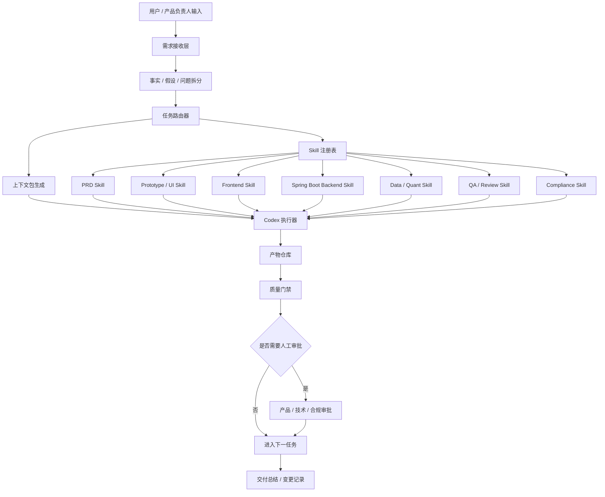
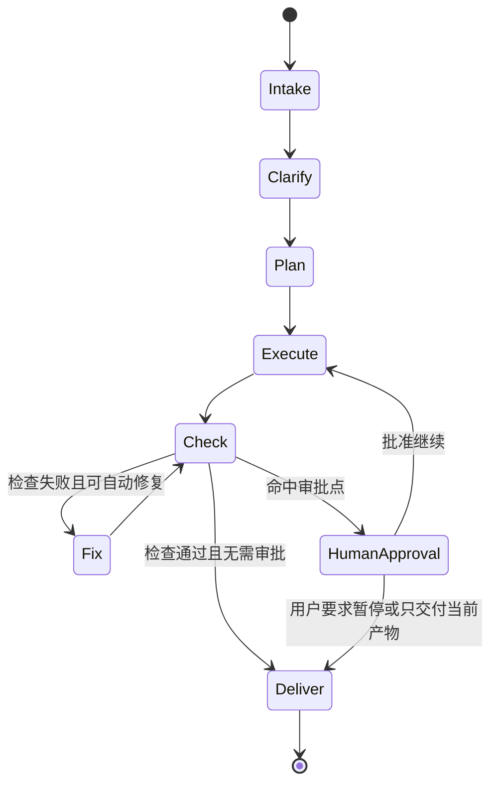

# Codex 自动化开发文档

- 文档状态：Draft / 内部研发自动化版
- 适用项目：A股 AI 量化策略研究平台
- 适用读者：产品负责人、研发负责人、Codex 操作者、QA、合规审核
- 关联开发文档：[03_internal_development_doc.md](/Users/liujun/Desktop/产品经理skill/projects/a-share-ai-quant-strategy-platform/03_internal_development_doc.md)
- 最后更新时间：2026-05-09

---

## 1. 目标

本文件定义如何用 Codex 低人工介入地推进本项目开发。

这是项目负责人自有项目的内部研发自动化文档，可以包含多 Skill 管理、分线程策略、质量门禁、人工审批点和内部执行边界。对外协作时应另行裁剪，不直接暴露内部自动化框架。

目标不是完全无人参与，而是把人工从重复文档整理、原型修改、代码实现、检查修复中释放出来，只在产品方向、合规边界、数据授权、充值接口、发布上线等高风险节点做确认。

本项目 Codex 自动化开发的核心目标：

- 从需求输入自动生成 PRD、原型、开发文档、接口草案和任务拆分。
- 根据任务类型自动选择对应 Skill 或执行链。
- 让 Codex 可以持续完成文档更新、HTML 原型迭代、Spring Boot 后端实现、小程序 / Web 前端实现、检查修复和交付总结。
- 所有产物可追溯、可检查、可回滚。
- 所有高风险动作保留人工审批点。

当前项目基线：

- 首期端侧为微信小程序 + Web，原生 App 后置。
- 后端使用 Spring Boot 3.x。
- 商业化表达统一为积分制度，不使用会员、月票、观众票和订阅作为 C 端付费包装。
- 量化执行参考 QuantDinger 的闭环，但默认只允许 `research_only` / `simulation_only`。
- 策略竞技场属于 P1 实验，不阻塞 P0 主路径。

---

## 2. 自动化研发总架构



---

## 3. 核心模块

| 模块 | 职责 | 输入 | 输出 |
|---|---|---|---|
| 需求接收层 | 接收用户输入、文件、截图、PRD 片段和反馈 | 对话、文件、图片、现有代码 | 原始需求记录 |
| 事实拆分器 | 区分已确认事实、开发假设、待确认问题 | 原始需求 | 需求事实表、阻塞问题 |
| 任务路由器 | 判断任务属于产品、原型、前端、后端、数据、测试、合规或文档 | 需求事实表 | Skill 执行链 |
| Skill 注册表 | 管理可用 Skill、适用范围、输入输出和检查项 | Skill 元数据 | 可执行 Skill 列表 |
| 上下文包生成器 | 为每个任务生成最小上下文，避免过载 | PRD、原型、代码、历史记录 | Task Brief |
| Codex 执行器 | 执行文档、代码、原型、测试、修复任务 | Task Brief + Skill | 文件变更 / 报告 |
| 质量门禁 | 自动运行语法、链接、截图、单测、接口、合规词检查 | 变更产物 | 通过 / 失败 / 修复建议 |
| 人工审批点 | 在高风险变更前要求人工确认 | 发布、支付、数据、合规、删除等动作 | 批准 / 驳回 |
| 产物仓库 | 存储 PRD、开发文档、原型、接口、测试记录 | 自动化输出 | 可追溯项目资料 |

---

## 4. Skill 分层

| Skill 类型 | 用途 | 典型输入 | 典型输出 |
|---|---|---|---|
| 需求整理 Skill | 把用户输入整理成结构化需求 | 原始文本、截图、文件 | source notes、事实 / 假设 / 问题 |
| PRD Skill | 生成或更新 PRD | source notes、用户补充 | PRD、范围、指标、验收 |
| 原型 Skill | 生成低保真 / HTML 原型 | PRD、参考图、页面清单 | 原型说明、HTML/CSS/JS |
| UI 还原 Skill | 从参考图提取组件和视觉规则 | 图片文件夹、现有原型 | 高保真 HTML 原型、组件清单 |
| 开发文档 Skill | 把 PRD 转为内部开发文档 | PRD、原型、技术约束 | 开发文档、接口草案、数据模型 |
| 前端实现 Skill | 实现 Web / 小程序页面 | 原型、接口草案 | 前端代码、组件、样式 |
| Spring Boot 后端 Skill | 实现 API、权限、业务逻辑 | 数据模型、接口草案 | Spring Boot 代码、迁移、接口 |
| 数据 / 量化 Skill | 实现市场温度、指标、回测、仿真榜单和 QuantDinger 参考逻辑适配 | 数据口径、样例数据、参考项目说明 | 计算模块、指标说明、风控边界 |
| AI 风控 Skill | 管理提示词、输出结构、拦截规则 | AI 场景、风险词库 | prompt、拦截器、日志规则 |
| QA Skill | 运行检查、测试、截图验收 | 代码、原型、验收标准 | 测试报告、缺陷列表 |
| 合规审核 Skill | 检查高风险表述和服务边界 | 文案、AI 输出、页面 | 风险清单、修改建议 |
| 发布 Skill | 打包、部署、变更说明 | 通过门禁的代码 | 发布包、版本记录 |

---

## 5. 标准任务流程

```text
需求输入
-> 读取项目规则和现有产物
-> 识别任务类型
-> 生成 Task Brief
-> 选择 Skill 执行链
-> 执行文件修改或代码实现
-> 运行质量门禁
-> 自动修复可修复问题
-> 输出变更摘要和剩余风险
-> 如命中审批点，停止并等待人工确认
```

Task Brief 必须包含：

- 目标。
- 输入来源。
- 可修改文件。
- 不可修改文件。
- 预期输出。
- 必跑检查。
- 人工审批点。
- 最小可交付范围。

---

## 6. 自动化开发状态机



---

## 7. 人工介入边界

低人工介入不代表跳过审批。以下动作必须人工确认：

- 改变产品范围。
- 改变数据库结构。
- 接入新的外部数据源。
- 引入或改造 QuantDinger 等外部量化项目的执行逻辑。
- 接入真实充值 / 支付。
- 修改积分充值、积分消耗和收费规则。
- 修改合规边界。
- 增加任何实盘、券商账户、自动下单、跟单或实时买卖信号能力。
- 发布到线上环境。
- 删除数据或迁移数据。
- 推送远程仓库、创建公开 PR。
- 创建或修改长期稳定项目规则。

普通低风险动作可自动执行：

- 更新 PRD、原型说明、内部开发文档。
- 根据参考图修改 HTML 原型。
- 生成接口草案、数据模型草案。
- 增加页面空态、错误态、权限态说明。
- 运行语法检查、截图检查、链接检查。
- 修复格式、文案一致性、组件样式问题。

---

## 8. 质量门禁

| 产物 | 自动检查 |
|---|---|
| PRD / 文档 | 链接可用、章节完整、事实 / 假设 / 问题分离、范围和非范围清晰 |
| HTML 原型 | 页面可打开、无控制台错误、无明显溢出、无已删除组件回归 |
| 小程序前端 | lint、构建、关键页面截图、权限态检查 |
| Web 前端 | lint、类型检查、构建、关键页面截图 |
| Spring Boot 后端 | JUnit、Spring Boot Test、接口测试、迁移检查、权限测试 |
| API 文档 | 路径、参数、权限、错误码、示例完整 |
| 量化执行逻辑 | 默认 research_only / simulation_only；无券商账户、无实盘下单、无跟单、无 C 端实时买卖信号 |
| AI 输出 | 禁止词拦截、结构化输出、风险提示存在 |
| 合规文案 | 不出现收益承诺、买卖建议、跟单、持仓和实时信号 |
| 竞技场 | 榜单口径、异常处理、积分解锁边界、匿名展示检查 |

---

## 9. 推荐 Skill 执行链

| 场景 | 推荐执行链 |
|---|---|
| 新需求输入 | 需求整理 Skill → PRD Skill → 开发文档 Skill |
| 原型迭代 | 原型 Skill → UI 还原 Skill → QA Skill |
| P0 前端开发 | 开发文档 Skill → 前端实现 Skill → QA Skill |
| P0 后端开发 | 开发文档 Skill → Spring Boot 后端 Skill → API 检查 → QA Skill |
| 市场温度开发 | 数据 / 量化 Skill → Spring Boot 后端 Skill → 前端实现 Skill → QA Skill |
| 量化执行逻辑适配 | 数据 / 量化 Skill → Spring Boot 后端 Skill → 合规审核 Skill → QA Skill |
| AI 助手开发 | AI 风控 Skill → Spring Boot 后端 Skill → 前端实现 Skill → 合规审核 Skill |
| 积分体系开发 | 开发文档 Skill → Spring Boot 后端 Skill → 前端实现 Skill → QA Skill |
| 竞技场开发 | PRD Skill → 数据 / 量化 Skill → Spring Boot 后端 Skill → 前端实现 Skill → 合规审核 Skill → QA Skill |
| 上线前检查 | QA Skill → 合规审核 Skill → 发布 Skill |

---

## 10. 项目产物目录

```text
projects/a-share-ai-quant-strategy-platform/
  AGENTS.md
  Makefile
  00_source_notes.md
  01_prd.md
  02_prototype_layer.md
  03_internal_development_doc.md
  04_codex_development_doc.md
  05_codex_parallel_branch_development_doc.md
  06_api_spec.md
  07_database_schema.md
  08_backend_engineering_spec.md
  09_task_breakdown.md
  10_test_plan.md
  11_local_dev_runbook.md
  12_codex_thread_governance.md
  13_task_brief_template.md
  14_file_boundary_matrix.md
  15_failure_handling_protocol.md
  16_codex_execution_runbook.md
  17_sdd_engineering_lessons.md
  18_contract_change_request_template.md
  19_merge_review_checklist.md
  scripts/
    check-docs.sh
    check-compliance.sh
    check-contracts.sh
    check-prototype.sh
    check-thread-boundary.sh
  tasks/
    p0-spring-api.brief.md
    p0-quant-engine.brief.md
    p0-points.brief.md
    qa-gates.brief.md
  automation/
    thread_registry.md
    skill_registry.md
    task_router.md
    quality_gates.md
    approval_points.md
    runbooks.md
  prototype/
    html/
```

说明：

- `automation/` 是项目级自动化研发框架，不是产品 C 端功能。
- Skill 注册表只记录本项目如何选用 Skill，不直接修改 Codex 全局 Skill。
- 如果未来要沉淀为长期通用规则，需要单独提出稳定变更方案并获得确认。
