# AI 协作效率平台开发文档

- 文档状态: 产品方案 Ready / 一期开发范围待确认 / 上线前业务参数待补齐
- 文档版本: v1.4
- 生成日期: 2026-05-08
- 适用读者: 研发负责人、前端、后端、测试、运维、AI 平台工程师
- 核心交付口径: PRD、原型图、开发文档为主；业务思维说明作为单独补充文档保留。
- 配套文档:
  - PRD: [01_product_document.md](/Users/liujun/Desktop/产品经理skill/projects/ai-collaboration-efficiency-platform/01_product_document.md)
  - 原型图: [06_prototype_wireframes.md](/Users/liujun/Desktop/产品经理skill/projects/ai-collaboration-efficiency-platform/06_prototype_wireframes.md)

---

## 0. 开发边界

本文件只描述 AI 协作效率平台的产品实现方案，不修改产品经理 skill、harness、workflow、registry、governance 或长期偏好。

本次允许写入:

- `projects/ai-collaboration-efficiency-platform/`

本次禁止写入:

- `pm-prd-copilot/`
- `workflow/`
- `registry/`
- `harness/`
- `governance/`
- `docs/proposals/`
- `memory-cache/`
- 根目录文件

如果后续需要把本项目的规则沉淀为稳定架构，必须先输出推荐计划并获得明确审批。

### 0.1 核心实现结论

- 价值计算引擎是核心服务，必须以一次 `SkillCall` 为最小事实单元，生成可解释的 `ScoreRecord` 和公式快照。
- 员工只提交事实: 任务上下文、输入材料、采用状态、人工修改耗时、返工情况和痛点反馈；员工不能调用管理接口修改 Skill、Prompt、权重、风险等级、Review 规则或发布状态。
- Prompt 管理作为二期 `Prompt Lab` 子域保留，提供 PromptVersion、Dataset、PromptRun、Evaluation、OptimizationJob、CandidateVersion、Compare 和多人评审发布门禁；一期不实现。
- 二期测试集驱动优化必须工程化: 反馈、Review 退回和低分 Case 先进入 `DatasetCase` 候选池，经管理确认后进入正式测试集，避免脏样本污染回归基线。
- 二期候选 Prompt 和 SkillVersion 不能自动上线。Compare 只产生发布建议，最终必须通过多人评审和审计留痕。
- 加密、授权、充值按控制面顺序实现: `AuditLog` 先记录事实，`AuthorizationGrant` 决定可做什么，资产版本进入快照，风险规则决定门禁，`ScoreRecord` / `UsageMeterRecord` 计量价值与消耗，`CostAllocationRecord` 归集成本，最后才进入 `SettlementAccount`、充值流水或 `LicenseEntitlement`。
- 一期必须实现 Skill 源码 / 能力实现包加密存储和受控解密执行。`call` 授权只允许运行，不允许查看、下载或复制 Prompt 源、Workflow DAG、工具适配代码、执行脚本和私有规则；一期不开放源码导出。
- Skill 并发执行以 `ExecutionPlan + SkillSubCall + Reducer` 作为二期设计方向保留；一期不实现并发 Worker，不创建并发相关生产表，不开放 execution-plan 接口。

### 0.2 已确认工程决策

以下决策已确认，开发时不得再作为待定项处理:

| 决策项 | 已确认结论 | 一期落地方式 |
|---|---|---|
| Skill 源码加密 | 必须做 | 上传 zip / skillpkg，平台校验后加密成 `SkillSourcePackage`，Worker 运行时临时解密执行 |
| 首批 Skill 执行方式 | 平台内执行 | 至少接入 1-2 个试点 Skill，不只记录外部结果 |
| 后端技术栈 | FastAPI | Python 3.11 + FastAPI + Pydantic + SQLAlchemy / Alembic |
| 登录方式 | 账号导入优先 | 一期用账号导入 + RBAC，保留 SSO 适配层 |
| 加密方案 | 简单加密即可 | 本阶段用服务端 AES-GCM 包级加密，密钥从服务端环境变量或部署 Secret 读取；KMS / Vault 只作为后续替换项 |
| 权限与版本管理 | 开发重点 | 严格区分 `call/read/source_read/source_export/manage`，源码包按版本不可覆盖，SkillVersion 只能绑定明确的 SourcePackage 版本 |
| Skill 文件夹结构 | 使用推荐默认 | 强制 `manifest.json + entrypoint + input_schema + output_schema`，其他目录可选 |
| Review 默认规则 | 使用推荐默认 | P0 拦截；P1 强制 Review；多人评审默认 `2/3 通过`；合规安全低于 60 分复审 |
| 并发执行 | 一期不做 | 一期只允许 `single`，不创建 `ExecutionPlan` 和 `SkillSubCall`，不开放 execution-plan 接口；二期实现 |
| P1 默认项 | 按推荐值推进 | Excel 优先、异步评分、Prompt Lab 二期、结算二期、成本归集二期、IM 通知不接、PostgreSQL FTS 起步 |

### 0.3 一期开发冻结清单

本清单是一期研发拆任务的唯一依据。开发 Agent 只能基于本清单拆分一期任务，不能从全文、二期规划、领域模型扩展或原型补充说明中自行扩大一期范围。

#### 一期必须实现页面

| 页面 | 路由 | 一期能力边界 |
|---|---|---|
| 工作台 | `/` | 当前用户待办、个人基础指标、常用 Skill、风险提醒入口 |
| 任务列表 | `/tasks` | 任务搜索、筛选、状态查看、创建入口 |
| 新建任务 | `/tasks/new` | 创建任务、补充调用前上下文、选择 Skill、输入校验 |
| 任务详情 | `/tasks/{id}` | SkillCall 执行记录、TaskResult 查看、结果确认、提交 Review、提交 Skill 反馈 |
| Review 队列 | `/reviews` | 待审任务筛选、风险等级、状态、SLA 摘要 |
| Review 详情 | `/reviews/{id}` | 评分、意见、通过、退回、拦截、复审标记 |
| 个人看板 | `/dashboard/personal` | 个人节省工时、贡献分、有效调用和证据链入口 |
| Skill 看板 | `/analytics/skills` | Skill 维度节省工时、贡献分、有效调用率、Review 通过率 |
| 组织看板 | `/analytics/orgs` | 组织维度节省工时、贡献分、覆盖率、有效使用率 |
| 权重计算说明 | `/score-calculation` | 公式版本、分数拆解、权重来源、封顶和反刷分说明 |
| Skill 清单 | `/skills` | 可调用 Skill、状态、风险、通过率、反馈入口 |
| Skill 详情 | `/skills/{id}` | 输入输出要求、Review 规则、released 版本摘要、员工反馈入口 |
| Skill 反馈管理 | `/admin/skill-feedback` | 反馈聚合、处理状态、明细查看；不创建 Prompt Lab 任务 |
| Skill 源码包上传 | `/admin/skill-source-packages` | 上传 zip / skillpkg、校验 manifest、加密存储、绑定 released / candidate 版本 |
| 授权与计量控制台 | `/admin/authorization` | 授权 Grant、有效权限、调用计量证据、不可用原因 |
| 报表中心 | `/reports` | Excel 报表导出任务、导出状态、审计记录 |
| 管理后台 | `/admin` | 用户、组织、角色、权限、风险规则、审计日志 |

#### 一期必须实现接口

| 接口 | 用途 |
|---|---|
| `GET /api/me` | 当前用户、角色、权限、数据范围 |
| `GET /api/skills` | Skill 清单 |
| `GET /api/skills/{id}` | Skill 详情 |
| `POST /api/admin/skill-source-packages` | 上传并加密 Skill 源码包 |
| `GET /api/admin/skill-source-packages/{id}/metadata` | 查看源码包元数据，不返回源码明文 |
| `POST /api/tasks` | 创建任务 |
| `PATCH /api/tasks/{id}/context` | 提交或更新调用前业务上下文 |
| `POST /api/tasks/{id}/run` | 以 `single` 模式执行 Skill，创建 SkillCall 和 TaskResult |
| `GET /api/skill-calls/{id}` | SkillCall 详情和执行快照 |
| `PATCH /api/task-results/{id}/confirmation` | 员工确认采用状态、人工修改耗时、返工情况 |
| `POST /api/skills/{id}/feedback` | 员工提交 Skill 使用反馈 |
| `GET /api/skills/{id}/feedback/mine` | 员工查看自己的反馈处理状态 |
| `GET /api/admin/skill-feedback` | 管理端查看反馈聚合和明细 |
| `PATCH /api/admin/skill-feedback/{id}` | 管理端更新反馈处理状态 |
| `GET /api/reviews` | Review 队列 |
| `POST /api/reviews/{id}/decision` | 提交评审结论 |
| `POST /api/skill-calls/{id}/calculate` | 计算价值，生成 ScoreRecord 和公式快照 |
| `GET /api/score-records/{id}/explanation` | 单条贡献分解释 |
| `GET /api/dashboard/personal` | 个人基础看板 |
| `GET /api/analytics/skills` | Skill 维度基础看板 |
| `GET /api/analytics/orgs` | 组织维度基础看板 |
| `GET /api/authorization/effective` | 查询有效授权 |
| `GET /api/metering/skill-calls/{id}` | 查询一次调用的基础计量证据 |
| `POST /api/reports/export` | 创建 Excel 报表导出任务 |
| `GET /api/reports/exports/{id}` | 查询导出任务状态 |

一期明确不开放 `GET /api/skill-calls/{id}/execution-plan`，不注册并发执行接口，不创建 `ExecutionPlan` 和 `SkillSubCall` 生产数据。

#### 一期必须实现数据表

| 数据表 | 一期用途 |
|---|---|
| `users`、`departments` | 账号导入、组织范围、数据权限 |
| `roles`、`permissions`、`role_permissions` | RBAC |
| `authorization_grants` | Skill 调用授权、管理授权 |
| `audit_logs` | 写操作和高风险操作审计 |
| `encrypted_secrets` | 源码包密钥引用和敏感凭据引用 |
| `skills`、`skill_versions` | Skill 清单、released 版本、执行配置 |
| `skill_source_packages` | 加密源码包、manifest、hash、密钥引用 |
| `tasks` | 任务和调用前上下文 |
| `skill_calls` | 一次 Skill 调用事实单元，`execution_mode` 固定为 `single` |
| `task_results` | 候选结果、采用确认、人工修改耗时、返工情况 |
| `review_groups`、`review_records` | 基础 Review 和多人评分聚合结果 |
| `skill_feedback` | 员工反馈和处理状态 |
| `skill_score_policies`、`score_formula_versions` | 评分策略和公式版本 |
| `score_records` | 贡献分、节省工时、公式快照、解释 |
| `usage_meter_records` | 调用次数、执行耗时、用户、组织、Skill、版本、时间证据 |
| `report_exports` | Excel 报表导出任务、状态、文件引用、审计关联 |

一期不得把 `skill_optimization_tasks`、`prompts`、`prompt_versions`、`datasets`、`dataset_cases`、`prompt_runs`、`prompt_evaluations`、`prompt_optimization_jobs`、`prompt_candidate_versions`、`prompt_compares`、`cost_allocation_records`、`settlement_accounts`、`recharge_transactions`、`license_entitlements`、`execution_plans`、`skill_sub_calls` 纳入一期开发任务。

#### 一期必须实现状态机

| 对象 | 状态机 |
|---|---|
| `Task` | `draft -> submitted/running -> pending_review/approved/returned/blocked/archived` |
| `SkillCall` | `created -> running -> succeeded/failed -> confirmed/scored`，一期只允许 `single` |
| `TaskResult` | `candidate -> saved/submitted_review/approved/rejected` |
| `ReviewRecord / ReviewGroup` | `pending -> approved/returned/blocked/need_recheck` |
| `ScoreRecord` | `draft -> pending/confirmed/rejected/adjusted/frozen` |
| `SkillSourcePackage` | `draft -> active/revoked/archived` |
| `UsageMeterRecord` | `pending -> confirmed/voided`，一期不进入成本归集 |
| `ReportExport` | `queued -> running -> succeeded/failed/expired` |

#### 加密实现边界

加密目标是防止 Skill 文件夹源码被普通调用方、前端、报表、日志或未授权管理者直接拿到，不追求复杂密钥体系。全阶段开发重点是权限管理、版本管理和审计追溯，加密只做简单基础防护。

| 项 | 做法 | 不作为开发重点 |
|---|---|---|
| 加密算法 | 服务端 AES-GCM 包级加密，随机 nonce / iv | HSM、硬件密钥、复杂 envelope encryption |
| 密钥来源 | 环境变量或部署 Secret 注入服务端 | 企业 KMS / Vault 强集成 |
| 密钥轮换 | 记录 key_version，支持后续新包用新 key | 自动批量重加密历史包 |
| 明文处理 | 上传校验后立即加密，Worker 临时目录解密，执行后清理 | 长期明文缓存、源码下发 |
| 管理重点 | 权限管理、版本绑定、不可覆盖、审计 | 复杂密码学方案 |

工程优先级: 权限边界、版本绑定、不可覆盖和审计追溯高于加密复杂度。只要源码包不以明文出现在 API、前端、日志、报表和对象存储中，加密即满足本阶段目标。

#### 一期验收标准

| 验收项 | 通过标准 |
|---|---|
| 主链路 | 员工能创建任务、选择 Skill、执行 single SkillCall、确认结果、提交 Review、评审通过、生成 ScoreRecord、看板更新 |
| 加密 | 一期只做简单包级加密: SkillSourcePackage 上传后保存密文包；Worker 运行时临时解密，执行后清理；响应、日志、报表不出现源码明文 |
| 权限与版本 | `call` 不等于源码查看；`manage` 不等于源码导出；源码包版本不可覆盖；SkillVersion 绑定的 SourcePackage 可追溯 |
| 授权 | 未授权调用返回 `FORBIDDEN` 并写审计；授权快照写入 SkillCall |
| Review | P0 拦截，P1 强制 Review；退回、拦截必须有原因 |
| 计分 | 缺少采用状态或人工修改耗时不得确认入账；公式快照可解释且不随规则变化回写 |
| 反馈 | 员工能提交反馈并查看处理状态；反馈不修改 Skill、Prompt、权重、风险等级或 Review 规则 |
| 看板 | 个人、Skill、组织看板只统计 confirmed 分数，能下钻到证据链 |
| 报表 | Excel 导出可创建、查询状态、下载授权文件，并写入审计 |
| 越权 | 员工不能查看他人敏感任务；HR 默认只看汇总 |
| 二期隔离 | 一期无 Prompt Lab、无测试集回归、无 Candidate / Compare、无发布门禁、无成本归集、无充值、无 license、无并发执行、无复杂 DAG、无完整知识库、无通知、无申诉 |

### 0.4 上线前业务确认表

以下参数不阻塞研发骨架和一期主流程开发，但上线前必须补齐；未确认时只能使用灰度默认值，不得扩大数据可见范围或上线高风险 Skill。

| 确认项 | 需要业务提供什么 | 默认口径 / 未确认处理 |
|---|---|---|
| 试点部门 | 部门 ID、负责人、数据范围 | 未确认不开放真实用户 |
| 首批用户 | 用户名单、角色、部门、是否评审人 | 仅导入白名单账号 |
| 首批 1-2 个 Skill | Skill 名称、负责人、风险等级、输入输出要求、源码包 | 未确认不发布 Skill |
| 基准工时库 owner | 维护人、任务类型、基准分钟、校准周期 | 先由 AI 平台负责人维护，灰度每周复核 |
| Review 人员和 SLA | 评审人名单、适用任务、SLA、替补规则 | P1 默认强制 Review，SLA 默认 1 个工作日 |
| 风险规则 owner | P0/P1/P2 规则维护人、审批人、更新频率 | 未确认规则只允许低风险 Skill 灰度 |
| HR 可见范围 | HR 是否看个人明细、可见部门、导出权限 | 默认只看汇总，不看敏感明细 |
| 数据留存口径 | 输入附件、输出附件、报表、审计日志留存周期 | 默认附件 180 天、审计 3 年 |
| 生产加密密钥保存方式 | 环境变量 / 部署 Secret 的保管人、轮换负责人、泄露应急处理人 | 默认部署 Secret + AES-GCM；外部密钥服务属于后续增强 |

## 1. MVP 技术目标

一期 MVP 只打通 Skill 价值计算闭环:

```text
员工创建任务
-> 选择 / 推荐 Skill
-> 填写任务上下文
-> 输入权限和敏感信息校验
-> 调用 Skill 或记录外部执行结果
-> Worker 运行时解密 SkillSourcePackage 并执行 Skill
-> 生成候选结果
-> 员工确认采纳状态、人工修改耗时和返工情况
-> 风险分级和质量初评
-> 低风险保存 / 高风险进入 Review
-> 评审通过、退回或拦截
-> 价值计算引擎生成节省工时、贡献分和公式快照
-> 员工 / 团队 / Skill 看板更新
-> Skill 反馈进入管理端处理队列
-> 基础计量记录生成
-> Excel 报表导出
-> 审计留痕
```

一期 MVP 总体开发目标:

- 主流程可用: 员工能创建任务、调用 Skill、提交 Review、查看结果。
- 评审可控: P0/P1 风险进入明确处理链路。
- 评分可追溯: 每个贡献分能回到任务、员工确认、Review、SkillVersion、PromptVersion 和公式快照。
- 反馈可追踪: 员工反馈能进入管理端处理队列，但一期不进入测试集、Prompt 候选优化或 SkillVersion 发布门禁。
- 权限可控: 不同角色看到不同数据范围。
- 报表可用: 能生成基础员工、团队、Skill、Review Excel 报表。
- 控制面可落地: 一期只完成审计、授权校验和基础计量证据；二期再完成成本归集、充值、结算和 license 授权。
- 源码保护可落地: 一期 Skill 在平台内运行，源码包加密存储，调用方只拿结果，不拿源码。
- 并发可控: 一期不实现并发执行；二期支持受控并发，多线程 / 多 Worker 只在服务端运行，调用方不能拿到源码或子任务内部实现。

二期规划保留 Prompt Lab、测试集回归、Candidate、Compare、多人发布评审、成本归集、充值、license 和并发执行，但这些内容不得进入一期 Sprint。

## 2. 推荐技术栈

| 层级 | 推荐技术 | 说明 |
|---|---|---|
| Web 前端 | Next.js / React + TypeScript | 多角色后台、表格、表单、看板、路由权限 |
| UI | Tailwind CSS + shadcn/ui 或企业已有组件库 | 保持后台效率工具风格 |
| 图表 | ECharts | 趋势、雷达、漏斗、分布、ROI 图表 |
| 后端 API | Python 3.11 + FastAPI | 已确认后端技术栈，使用 Pydantic 做请求响应 Schema |
| 数据库 | PostgreSQL | 任务、评审、Skill、评分、权限、审计 |
| ORM / Migration | SQLAlchemy 2.x + Alembic | 数据模型、迁移、事务和索引管理 |
| 缓存 / 队列 | Redis + Celery | Skill 执行、报表生成、异步评分；二期可承接并发子任务 |
| 对象存储 | S3 兼容存储 / MinIO | 上传材料、输出附件、报表文件 |
| 搜索 | PostgreSQL FTS 起步，后续 OpenSearch | Skill、任务、知识资产搜索 |
| 鉴权 | 账号导入 + RBAC，一期保留 SSO 适配层 | SSO 不进入一期强依赖 |
| 密钥与加密 | 服务端 AES-GCM 简单包级加密 | 密钥从环境变量或部署 Secret 读取；保留 `SecretProvider` 小接口，KMS / Vault 后续可替换 |
| 观测 | OpenTelemetry + Sentry / 日志系统 | API、任务队列、Skill 调用和错误追踪 |
| 部署 | Docker Compose 起步，后续 K8s | MVP 先降低环境复杂度 |

MVP 最小服务建议:

- `web`: 前端工作台。
- `api`: FastAPI 业务 API、鉴权、权限、评分、报表。
- `worker`: Celery Worker，负责 Skill 运行时解密执行、异步评分、报表导出。
- `postgres`: 主数据库。
- `redis`: 队列和缓存。
- `object-storage`: 文件和报表。
- `secret`: `SecretProvider` 小接口和 AES-GCM 实现；一期不做企业 KMS / Vault 集成。

## 3. 总体架构

下图同时展示一期核心和二期规划服务。标注“二期 / 三期”的 API、服务和数据对象不得进入一期开发冻结清单。

```mermaid
flowchart TB
  subgraph Client["Client"]
    Web["Web 工作台"]
  end

  subgraph API["API Layer"]
    Gateway["API Gateway / Backend"]
    Auth["Auth + RBAC"]
    TaskAPI["Task API"]
    SkillAPI["Skill API"]
    PromptAPI["Prompt Lab API（二期）"]
    ReviewAPI["Review API"]
    ScoreAPI["Score API"]
    MeteringAPI["Metering API"]
    SettlementAPI["Settlement API（二期）"]
    ReportAPI["Report API"]
    AdminAPI["Admin API"]
  end

  subgraph Core["Core Services"]
    TaskSvc["任务服务"]
    SkillSvc["Skill 管理服务"]
    SourcePkgSvc["Skill 源码包服务"]
    ExecutionSvc["Skill 执行服务（一期 single）"]
    PromptSvc["Prompt 管理服务（二期）"]
    DatasetSvc["测试集服务（二期）"]
    EvaluationSvc["评测服务（二期）"]
    OptimizationSvc["候选优化服务（二期）"]
    CompareSvc["版本对比服务（二期）"]
    RouteSvc["Skill 路由服务"]
    AuthzSvc["授权决策服务"]
    SecretSvc["密钥 / 凭据服务"]
    RiskSvc["风险识别服务"]
    ReviewSvc["评审工作流"]
    ScoreSvc["贡献计算服务"]
    MeteringSvc["消耗计量服务"]
    CostSvc["成本归集服务（二期）"]
    SettlementSvc["结算 / 充值服务（二期）"]
    LicenseSvc["License 授权服务（二期）"]
    KnowledgeSvc["知识沉淀服务（三期）"]
    ReportSvc["报表服务"]
    AuditSvc["审计服务"]
  end

  subgraph Data["Data Layer"]
    PG["PostgreSQL"]
    Redis["Redis Queue / Cache"]
    Storage["Object Storage"]
    KeyCfg["Deployment Secret / Key Config"]
    Logs["Audit / App Logs"]
  end

  Web --> Gateway
  Gateway --> Auth
  Gateway --> TaskAPI
  Gateway --> SkillAPI
  Gateway --> PromptAPI
  Gateway --> ReviewAPI
  Gateway --> ScoreAPI
  Gateway --> MeteringAPI
  Gateway --> SettlementAPI
  Gateway --> ReportAPI
  Gateway --> AdminAPI

  TaskAPI --> TaskSvc
  SkillAPI --> SkillSvc
  SkillAPI --> SourcePkgSvc
  TaskAPI --> ExecutionSvc
  PromptAPI --> PromptSvc
  PromptAPI --> DatasetSvc
  PromptAPI --> EvaluationSvc
  PromptAPI --> OptimizationSvc
  PromptAPI --> CompareSvc
  TaskSvc --> RouteSvc
  TaskSvc --> AuthzSvc
  TaskSvc --> MeteringSvc
  ExecutionSvc --> MeteringSvc
  TaskSvc --> RiskSvc
  ReviewAPI --> ReviewSvc
  ReviewSvc --> ScoreSvc
  ScoreSvc --> MeteringSvc
  MeteringAPI --> MeteringSvc
  MeteringSvc --> CostSvc
  SettlementAPI --> SettlementSvc
  SettlementAPI --> LicenseSvc
  ReviewSvc --> KnowledgeSvc
  ReportAPI --> ReportSvc
  AdminAPI --> AuthzSvc
  AdminAPI --> SecretSvc
  AdminAPI --> SourcePkgSvc
  AdminAPI --> AuditSvc

  Core --> PG
  Core --> Redis
  Core --> Storage
  SecretSvc --> KeyCfg
  AuditSvc --> Logs
```



架构关系:

```text
PromptVersion 是 SkillVersion 的底层资产，但 Prompt Lab 在二期实现。
一期 SkillVersion 只读取 released 版本、模型配置摘要、输入输出 Schema、Review 规则、计分规则和可空 PromptVersion 引用。
二期 SkillVersion 再绑定 PromptVersion、测试集基线、Compare 结果和发布评审。
Prompt Lab 二期负责研发、评测、优化和候选版本。
Skill 管理一期负责权限、权重、风险、价值计算和运营看板；发布门禁和回滚二期实现。
控制面一期负责审计、授权、版本快照、风险、价值计量和基础计量证据；二期负责成本归集、结算、充值和 license。
员工只访问 Skill 使用与反馈入口，不访问生产 Prompt 管理入口。
```

## 4. 核心领域模型

### 4.1 User

| 字段 | 类型 | 说明 |
|---|---|---|
| id | uuid | 用户 ID |
| name | string | 姓名 |
| email | string | 邮箱 |
| department_id | uuid | 所属部门 |
| role_ids | uuid[] | 角色集合 |
| level | enum | 新手、成长期、熟手、专家 |
| status | enum | active / disabled |
| created_at / updated_at | datetime | 时间戳 |

### 4.2 Department

| 字段 | 类型 | 说明 |
|---|---|---|
| id | uuid | 部门 ID |
| name | string | 部门名称 |
| parent_id | uuid/null | 上级部门 |
| manager_id | uuid/null | 主管 |
| status | enum | active / disabled |

### 4.3 Skill

| 字段 | 类型 | 说明 |
|---|---|---|
| id | uuid | Skill ID |
| name | string | 名称 |
| description | text | 描述 |
| owner_id | uuid | 负责人 |
| department_scope | uuid[] | 可用部门 |
| version | string | 当前版本 |
| risk_level | enum | P0 / P1 / P2 / Low |
| input_schema | jsonb | 输入要求 |
| output_schema | jsonb | 输出格式 |
| review_rule | jsonb | Review 规则 |
| weight | decimal | Skill 权重 |
| status | enum | draft / testing / published / paused / archived |
| created_at / updated_at | datetime | 时间戳 |

### 4.3.1 SkillVersion

| 字段 | 类型 | 说明 |
|---|---|---|
| id | uuid | Skill 版本 ID |
| skill_id | uuid | 所属 Skill |
| version_code | string | 版本号，例如 `v2.3` |
| prompt_version_id | uuid | 绑定的 PromptVersion |
| source_package_id | uuid | 加密 Skill 源码 / 能力实现包 |
| model_profile_id | uuid/null | 运行模型配置 |
| dataset_baseline_id | uuid/null | 发布时使用的回归测试集 |
| input_schema | jsonb | 输入要求快照 |
| output_schema | jsonb | 输出要求快照 |
| review_rule_snapshot | jsonb | Review 规则快照 |
| score_policy_id | uuid | 计分规则 |
| execution_mode | enum | single / parallel / dag |
| parallel_policy | jsonb/null | 最大并发、超时、重试、预算、失败策略 |
| reducer_policy | jsonb/null | 并发结果汇总策略 |
| release_status | enum | candidate / reviewing / released / rejected / rolled_back |
| release_review_id | uuid/null | 发布评审记录 |
| effective_from / effective_to | datetime | 生效区间 |
| created_by | uuid | 创建人 |
| created_at / updated_at | datetime | 时间戳 |

规则:

- `SkillVersion` 是员工调用时的生产能力版本。
- 任何贡献计算必须绑定 `skill_id` 和 `skill_version_id`。
- 生产调用只读取 `source_package_id` 的运行时引用，不向调用方返回源码内容。
- `execution_mode = parallel` 时必须配置 `parallel_policy` 和 `reducer_policy`。
- 二期新版本发布前必须有测试集回归结果、Compare 对比结果和通过态发布评审；一期不做 SkillVersion 发布门禁。

### 4.3.1.1 SkillSourcePackage

Skill 源码 / 能力实现包用于保存可运行但不可被普通调用方读取的能力实现。它可以包含 Prompt 源、Workflow DAG、工具适配代码、执行脚本、私有规则、测试集答案或内部配置。

| 字段 | 类型 | 说明 |
|---|---|---|
| id | uuid | 源码包 ID |
| skill_id | uuid | 所属 Skill |
| version_code | string | 源码包版本 |
| package_type | enum | prompt_bundle / workflow_bundle / tool_adapter / mixed |
| encrypted_package_ref | string | 加密包对象存储引用 |
| package_hash | string | 加密前内容摘要，用于完整性校验 |
| key_ref_id | uuid | EncryptedSecret / key_version 引用；一期只要求可定位当前部署 Secret 版本 |
| manifest | jsonb | 入口、依赖、运行时、允许工具、Reducer 名称 |
| visibility | enum | private / org_restricted / shared_runtime_only |
| status | enum | draft / active / revoked / archived |
| created_by | uuid | 创建人 |
| created_at / updated_at | datetime | 时间戳 |

规则:

- `call` 授权只能触发运行时解密执行，不能返回 `encrypted_package_ref`、源码内容或明文 manifest 中的敏感配置。
- `source_read` 授权只能在管理端查看脱敏源码或结构化摘要；`source_export` 授权才允许导出源码包，且必须二次审批和审计。
- 运行时解密必须在 Worker / 沙箱环境中完成，执行完成后不得把源码落到普通日志、前端响应、TaskResult 或报表中。
- 源码包被 `revoked` 后，不允许新调用；历史 SkillCall 仍保留版本和摘要证据。

### 4.3.2 SkillScorePolicy

| 字段 | 类型 | 说明 |
|---|---|---|
| id | uuid | 计分策略 ID |
| skill_id | uuid | Skill |
| skill_version_id | uuid/null | 可绑定版本，也可作为 Skill 默认策略 |
| task_type | string | 适用任务类型 |
| baseline_minutes | int | 任务类型基准人工工时 |
| complexity_coef_map | jsonb | 简单/标准/复杂/高复杂系数 |
| input_size_rule | jsonb | 输入规模系数规则 |
| adoption_factor_map | jsonb | 采纳状态系数 |
| quality_factor_rule | jsonb | Review 分数到质量系数规则 |
| business_value_factor | decimal | 业务价值系数 |
| skill_weight | decimal | 审批后 Skill 权重 |
| daily_cap_rule | jsonb/null | 日封顶规则 |
| anti_gaming_rule | jsonb | 去重、拆分、异常规则 |
| status | enum | draft / active / archived |
| effective_from / effective_to | datetime | 生效区间 |
| approved_by | uuid/null | 审批人 |

### 4.4 Task

| 字段 | 类型 | 说明 |
|---|---|---|
| id | uuid | 任务 ID |
| creator_id | uuid | 创建人 |
| department_id | uuid | 所属部门 |
| title | string | 任务标题 |
| task_type | enum/string | 任务类型 |
| business_scenario | string/null | 业务场景 |
| business_object | string/null | 客户、项目、合同、会议、数据表等业务对象 |
| expected_output | text/null | 期望产出 |
| business_value | enum/int | 业务价值等级 |
| complexity | enum/int | 复杂度 |
| skill_id | uuid/null | 选择的 Skill |
| skill_version_id | uuid/null | 调用的 SkillVersion |
| status | enum | draft / submitted / running / failed / pending_review / approved / returned / blocked / archived |
| risk_level | enum | P0 / P1 / P2 / Low |
| input_summary | text | 输入摘要，不存敏感全文到看板 |
| input_object_key | string/null | 输入附件存储路径 |
| created_at / updated_at | datetime | 时间戳 |

使用者必须提供的最小上下文:

```text
task_type
business_scenario
business_object
expected_output
complexity
input_material
```

`manual_baseline_estimate` 可作为扩展字段记录在任务扩展表或 JSON 中，只用于规则校准和异常复核，不直接决定基准工时。

### 4.4.1 SkillCall

| 字段 | 类型 | 说明 |
|---|---|---|
| id | uuid | 一次 Skill 调用 ID |
| task_id | uuid | 所属任务 |
| user_id | uuid | 调用人 |
| department_id | uuid | 调用人所属组织 |
| skill_id | uuid | Skill |
| skill_version_id | uuid | SkillVersion |
| prompt_version_id | uuid/null | 底层 PromptVersion |
| context_snapshot | jsonb | 调用前业务上下文快照 |
| authorization_snapshot | jsonb | 授权决策快照 |
| input_size_snapshot | jsonb | 字数、页数、记录数、附件数量等 |
| execution_snapshot | jsonb | 模型、耗时、错误、重试等 |
| execution_plan_id | uuid/null | 并发执行计划 |
| status | enum | created / running / succeeded / failed / confirmed / scored |
| created_at / updated_at | datetime | 时间戳 |

规则:

- `SkillCall` 是人调用 Skill 维度的最小事实表。
- 一个任务可以有多次 SkillCall，但同一任务最终贡献默认只取最终采纳结果，其他调用用于过程分析和反刷分。
- 如果 SkillVersion 使用并发执行，一个 SkillCall 下可有多个 SkillSubCall；贡献分仍以最终 TaskResult 的采用、Review 和人工修改耗时计算。

### 4.4.2 ExecutionPlan

二期数据模型。一期不创建 `ExecutionPlan` 生产数据，也不开放 execution-plan 查询接口。

ExecutionPlan 是一次 SkillCall 的服务端执行编排计划。它不暴露 Skill 源码，只暴露可审计的执行结构和状态摘要。

| 字段 | 类型 | 说明 |
|---|---|---|
| id | uuid | 执行计划 ID |
| skill_call_id | uuid | 父级 SkillCall |
| skill_version_id | uuid | SkillVersion |
| execution_mode | enum | single / parallel / dag |
| plan_snapshot | jsonb | 子任务拓扑、输入切片、依赖关系、Reducer 配置摘要 |
| max_parallelism | int | 最大并发数 |
| timeout_ms | int | 总超时 |
| retry_policy | jsonb | 重试策略 |
| failure_policy | enum | fail_fast / best_effort / require_all / quorum |
| budget_limit_snapshot | jsonb | token、金额、工具调用、时间预算 |
| reducer_status | enum | pending / running / succeeded / failed / skipped |
| status | enum | planned / running / reducing / succeeded / partial_failed / failed / canceled |
| started_at / finished_at | datetime/null | 开始和结束时间 |
| created_at / updated_at | datetime | 时间戳 |

### 4.4.3 SkillSubCall

二期数据模型。一期不创建 `SkillSubCall` 生产数据。

SkillSubCall 是并发分支的最小执行证据。

| 字段 | 类型 | 说明 |
|---|---|---|
| id | uuid | 子调用 ID |
| execution_plan_id | uuid | 执行计划 |
| skill_call_id | uuid | 父级 SkillCall |
| step_key | string | 子任务标识 |
| parent_step_keys | string[] | 依赖的前置步骤 |
| shard_key | string/null | 文档、Case、章节、数据源等分片标识 |
| input_summary | text/jsonb | 子任务输入摘要，不保存未授权明文 |
| output_summary | text/jsonb/null | 子任务输出摘要 |
| usage_meter_record_ids | uuid[] | 子任务计量记录 |
| status | enum | queued / running / succeeded / failed / skipped / canceled |
| error_code / error_message | string/null | 错误 |
| started_at / finished_at | datetime/null | 开始和结束时间 |
| created_at / updated_at | datetime | 时间戳 |

规则:

- SkillSubCall 继承父级 SkillCall 的授权、源码包、license、额度、风险和审计上下文。
- 子调用输出不得直接进入用户业务流程，必须经过 Reducer 汇总和最终风险检查。
- 子调用失败按 ExecutionPlan.failure_policy 处理；Reducer 失败时父级 SkillCall 不得进入 `succeeded`。

### 4.5 TaskResult

| 字段 | 类型 | 说明 |
|---|---|---|
| id | uuid | 结果 ID |
| task_id | uuid | 任务 |
| skill_call_id | uuid | 一次 Skill 调用 |
| skill_id | uuid | Skill |
| skill_version_id | uuid | SkillVersion |
| skill_version | string | Skill 版本展示值 |
| model_name | string/null | 模型名称 |
| prompt_version_id | uuid/null | PromptVersion |
| prompt_version | string/null | Prompt 版本展示值 |
| output_summary | text | 输出摘要 |
| output_object_key | string/null | 输出附件 |
| confidence | decimal/null | 置信度 |
| estimated_saved_minutes | int | 预计节省工时 |
| execution_ms | int | 执行耗时 |
| adoption_status | enum/null | direct_use / minor_edit / major_edit / reference_only / not_used |
| human_edit_minutes | int/null | 员工确认的人工修改耗时 |
| rework_required | bool/null | 是否返工 |
| rework_minutes | int/null | 返工耗时 |
| business_submitted | bool/null | 是否已进入业务流程 |
| status | enum | candidate / saved / submitted_review / approved / rejected |
| created_at | datetime | 创建时间 |

结果确认规则:

- 保存、导出、提交 Review 或进入贡献计算前必须确认 `adoption_status` 和 `human_edit_minutes`。
- `not_used` 默认不计贡献。
- `major_edit` 必须触发痛点反馈或原因选择，便于进入优化队列。

### 4.6 ReviewRecord

| 字段 | 类型 | 说明 |
|---|---|---|
| id | uuid | 评审记录 ID |
| task_id | uuid | 任务 |
| result_id | uuid/null | 任务结果；候选 Prompt 或 Skill 发布评审可为空 |
| review_type | enum | task_output / prompt_candidate / skill_release |
| reviewer_id | uuid | 评审人 |
| score_quality | int | 质量评分 |
| score_risk | int | 风险评分 |
| score_reuse | int | 复用价值 |
| action | enum | approve / return / block / request_changes |
| comment | text | 评审意见 |
| reason_code | string/null | 退回或拦截原因 |
| review_group_id | uuid/null | 多人评审批次 |
| passed | bool | 本评审人是否通过 |
| created_at | datetime | 评审时间 |

多人评审发布门禁:

- `prompt_candidate` 和 `skill_release` 类型必须按 Review 规则聚合，例如 `2/3 通过`、专家强审或合规一票否决。
- Compare 可以给发布建议，但不能自动生成通过态 `skill_release`。
- 评审意见不能为空，未通过必须填写原因。

### 4.7 SkillFeedback

| 字段 | 类型 | 说明 |
|---|---|---|
| id | uuid | 反馈 ID |
| skill_id | uuid | 关联 Skill |
| skill_version | string | 反馈时使用的 Skill 版本 |
| task_id | uuid/null | 关联任务 |
| result_id | uuid/null | 关联结果 |
| reporter_id | uuid | 反馈员工 |
| department_id | uuid | 反馈员工所属部门 |
| feedback_type | enum | inaccurate / missing_field / wrong_format / unusable / no_time_saved / weak_risk_warning / complex_params / scenario_mismatch / new_scenario / other |
| severity | enum | low / medium / high |
| description | text | 反馈说明 |
| evidence_object_key | string/null | 可选截图或附件 |
| status | enum | submitted / triaged / planned / released / rejected |
| owner_id | uuid/null | 处理人，通常为 Skill 管理员 |
| converted_dataset_case_id | uuid/null | 转入测试集后的 Case |
| optimization_task_id | uuid/null | 二期转入优化任务后的任务 ID |
| resolution_note | text/null | 处理结果 |
| created_at / updated_at | datetime | 时间戳 |

规则:

- 员工可以创建 `SkillFeedback`，但不能直接修改 `Skill`、`SkillWeightConfig`、Review 规则、风险等级或版本状态。
- 管理角色基于反馈聚合、Review 退回率、执行失败率、节省工时变化、风险命中率和复用率决定是否优化 Skill。
- 一期有效反馈只能更新处理状态；二期才可以转为 `DatasetCase` 或 `SkillOptimizationTask`，且必须由管理角色确认。
- 反馈处理状态必须可追踪，员工能看到自己提交反馈的处理结果。

### 4.7.1 SkillOptimizationTask（二期）

二期数据模型。一期不创建 Skill 优化任务。

| 字段 | 类型 | 说明 |
|---|---|---|
| id | uuid | 优化任务 ID |
| skill_id | uuid | 目标 Skill |
| source_type | enum | feedback / review_return / low_score / manual |
| source_ids | uuid[] | 来源反馈、Review 或结果 |
| target_prompt_id | uuid/null | 目标 Prompt |
| target_dataset_id | uuid/null | 目标测试集 |
| owner_id | uuid | 处理人 |
| status | enum | created / dataset_ready / optimizing / comparing / reviewing / released / rejected |
| problem_summary | text | 问题摘要 |
| expected_improvement | text/null | 期望改善 |
| created_at / updated_at | datetime | 时间戳 |

规则:

- 员工反馈不能直接生成生产版本；二期也只能进入优化任务候选。
- 二期管理角色确认后，优化任务才能创建测试集 Case、发起 Prompt 优化或生成 SkillVersion 候选。

### 4.8 KnowledgeAsset

| 字段 | 类型 | 说明 |
|---|---|---|
| id | uuid | 知识资产 ID |
| source_task_id | uuid | 来源任务 |
| source_result_id | uuid | 来源结果 |
| type | enum | prompt / sop / case / failure_pattern / review_note |
| title | string | 标题 |
| content | text | 内容 |
| owner_id | uuid | 所有人 |
| version | string | 版本 |
| status | enum | draft / published / archived |
| reuse_count | int | 复用次数 |
| created_at / updated_at | datetime | 时间戳 |

### 4.9 ScoreRecord

| 字段 | 类型 | 说明 |
|---|---|---|
| id | uuid | 评分记录 ID |
| user_id | uuid | 员工 |
| task_id | uuid | 来源任务 |
| skill_call_id | uuid | 来源调用 |
| result_id | uuid | 来源结果 |
| skill_id | uuid | Skill |
| skill_version_id | uuid | SkillVersion |
| prompt_version_id | uuid/null | PromptVersion |
| review_record_id | uuid/null | 来源 Review |
| baseline_minutes | int | 基准人工工时 |
| after_skill_minutes | int | 使用后人工工时 |
| raw_saved_minutes | int | 原始节省工时 |
| confirmed_saved_minutes | int | 确认节省工时 |
| contribution_score | decimal | 单次贡献分 |
| formula_snapshot | jsonb | 公式和权重快照 |
| explanation | text | 解释 |
| status | enum | draft / pending / confirmed / rejected / adjusted / frozen |
| created_at | datetime | 创建时间 |

补充要求:

- `formula_snapshot` 必须保存公式版本、基准工时、使用后人工耗时、采纳状态、任务复杂度、输入规模、业务价值系数、Skill 权重、质量系数、有效性系数、反作弊系数、封顶前分数和入账分数。
- 历史 `ScoreRecord` 解释优先读取自身快照，不随后续权重调整改变。

### 4.9.1 ScoreFormulaVersion

| 字段 | 类型 | 说明 |
|---|---|---|
| id | uuid | 公式版本 ID |
| version_code | string | 公式版本，例如 `score_v1_2026_05` |
| formula | jsonb | 公式结构和系数定义 |
| rounding_rule | jsonb | 舍入规则 |
| status | enum | draft / active / archived |
| effective_from / effective_to | datetime | 生效区间 |
| approved_by | uuid | 审批人 |

### 4.9.2 SkillWeightConfig

| 字段 | 类型 | 说明 |
|---|---|---|
| id | uuid | 配置 ID |
| skill_id | uuid | Skill |
| skill_version | string | Skill 版本 |
| suggested_weight | decimal | 系统建议权重 |
| effective_weight | decimal | 审批后生效权重 |
| metric_snapshot_id | uuid | 统计快照 |
| reason | text | 调整原因 |
| approval_status | enum | pending / approved / rejected |
| effective_from / effective_to | datetime | 生效区间 |

### 4.10 RiskEvent

| 字段 | 类型 | 说明 |
|---|---|---|
| id | uuid | 风险事件 ID |
| task_id | uuid/null | 任务 |
| skill_id | uuid/null | Skill |
| user_id | uuid | 触发用户 |
| risk_level | enum | P0 / P1 / P2 |
| risk_type | string | 风险类型 |
| action | enum | block / require_review / warn / log |
| detail | text/jsonb | 风险详情 |
| created_at | datetime | 触发时间 |

### 4.11 AuditLog

| 字段 | 类型 | 说明 |
|---|---|---|
| id | uuid | 日志 ID |
| actor_id | uuid | 操作人 |
| action | string | 操作 |
| target_type | string | 对象类型 |
| target_id | uuid/string | 对象 ID |
| before | jsonb/null | 变更前 |
| after | jsonb/null | 变更后 |
| reason | text/null | 原因 |
| ip | string/null | IP |
| created_at | datetime | 时间 |

### 4.11.1 AuthorizationGrant

授权记录用于回答“谁在什么范围内能对哪个能力资产做什么”。它不是页面权限展示表，而是所有调用、管理、计量和结算动作的统一授权依据。

| 字段 | 类型 | 说明 |
|---|---|---|
| id | uuid | 授权 ID |
| subject_type | enum | user / role / department / cost_center / service_account |
| subject_id | uuid/string | 被授权主体 |
| asset_type | enum | skill / workflow / knowledge_pack / tool_permission / prompt / dataset / settlement_account |
| asset_id | uuid/string | 被授权资产 |
| action_scope | string[] | call / read / source_read / source_export / review / manage / export / settle / recharge / license_grant |
| constraints | jsonb | 时间、额度、部门、风险等级、IP、模型、工具等约束 |
| effective_from / effective_to | datetime | 授权生效区间 |
| status | enum | pending / active / suspended / expired / revoked |
| approved_by | uuid/null | 审批人 |
| revoke_reason | text/null | 撤销原因 |
| created_at / updated_at | datetime | 时间戳 |

规则:

- `subject_type + subject_id + asset_type + asset_id + action_scope + effective_from` 在未删除记录中应保持唯一。
- 调用 Skill 前必须存在 `call` 授权；充值、license 发放、成本调整必须存在 `settle`、`recharge` 或 `license_grant` 授权。
- 查看或导出 Skill 源码必须分别存在 `source_read` 或 `source_export` 授权，不能用 `call`、`manage` 或 `export` 推断。
- 授权决策结果必须写入 `SkillCall.authorization_snapshot` 或对应操作审计，历史调用不因后续授权撤销而丢失解释。

### 4.11.2 EncryptedSecret

敏感凭据不在业务表保存明文，只保存密钥引用、密文引用和脱敏显示值。一期 `EncryptedSecret` 主要用于记录 SkillSourcePackage 简单加密的 key_version、secret_ref 和脱敏信息，不要求接入外部密钥服务。

| 字段 | 类型 | 说明 |
|---|---|---|
| id | uuid | 凭据 ID |
| secret_type | enum | api_key / license_key / webhook_secret / settlement_certificate / object_key / skill_source_key |
| provider | string | deployment_secret / env / local_dev / external_secret |
| encrypted_value_ref | string | 部署 Secret / 本地 SecretProvider / 后续外部密钥服务引用 |
| masked_value | string | 页面可展示的脱敏值 |
| key_version | string | 密钥版本 |
| owner_type | enum | skill / skill_source_package / tool_permission / settlement_account / license_entitlement / system |
| owner_id | uuid/string | 所属对象 |
| status | enum | active / rotated / revoked |
| rotated_at | datetime/null | 轮换时间 |
| created_at / updated_at | datetime | 时间戳 |

规则:

- API 不能返回 `encrypted_value_ref` 的可解密内容，也不能返回明文凭据。
- 密钥轮换必须生成新版本并写审计，不覆盖历史引用。

### 4.11.3 UsageMeterRecord

消耗计量记录用于回答“一次能力调用用了多少资源、对应哪个资产版本、能否归因”。

| 字段 | 类型 | 说明 |
|---|---|---|
| id | uuid | 计量记录 ID |
| skill_call_id | uuid/null | 关联 SkillCall |
| user_id | uuid | 使用人 |
| department_id | uuid | 使用人部门 |
| cost_center_id | uuid/null | 成本中心 |
| asset_type | enum | skill / workflow / knowledge_pack / tool_permission / model / storage / review |
| asset_id | uuid/string | 资产 ID |
| asset_version | string/null | 资产版本 |
| metric_type | enum | call_count / input_tokens / output_tokens / tool_call / storage_mb_day / review_minutes / license_seat |
| quantity | decimal | 数量 |
| unit | string | 次、token、MB-day、分钟、席位等 |
| occurred_at | datetime | 发生时间 |
| evidence_ref | jsonb | SkillCall、TaskResult、ReviewRecord、日志或外部账单引用 |
| status | enum | pending / confirmed / allocated / voided |
| created_at / updated_at | datetime | 时间戳 |

规则:

- 进入结算的消耗必须有 `confirmed` 或 `allocated` 状态。
- 无法归因到用户、组织、资产版本和时间周期的消耗只能进入待处理队列，不能扣费。

### 4.11.3.1 ReportExport

一期数据模型。仅用于 Excel 报表导出任务和审计追踪。

| 字段 | 类型 | 说明 |
|---|---|---|
| id | uuid | 导出任务 ID |
| report_type | enum | personal_score / skill_score / org_score / review_summary |
| requested_by | uuid | 导出人 |
| scope | jsonb | 时间、部门、Skill、用户等筛选范围 |
| format | enum | xlsx |
| status | enum | queued / running / succeeded / failed / expired |
| file_object_key | string/null | 导出文件对象存储引用 |
| error_code / error_message | string/null | 失败原因 |
| audit_log_id | uuid/null | 导出审计 |
| created_at / updated_at | datetime | 时间戳 |
| expires_at | datetime/null | 下载链接过期时间 |

规则:

- 一期只支持 Excel。
- 导出内容必须按操作者数据权限过滤。
- 导出文件不得包含 Skill 源码、明文密钥、成本单价或未授权敏感输入全文。

### 4.11.4 CostAllocationRecord

二期数据模型。一期不创建成本归集生产数据。

成本归集记录用于把计量消耗映射到内部成本中心、Skill、组织、项目或外部客户。

| 字段 | 类型 | 说明 |
|---|---|---|
| id | uuid | 成本记录 ID |
| usage_meter_record_id | uuid | 来源计量记录 |
| cost_center_id | uuid/null | 成本中心 |
| department_id | uuid/null | 组织 |
| skill_id | uuid/null | Skill |
| cost_type | enum | model / tool / storage / review / license / settlement_adjustment |
| amount | decimal | 金额 |
| currency | string | 默认 CNY |
| formula_snapshot | jsonb | 单价、折扣、汇率、分摊规则快照 |
| period | string | YYYY-MM 或账期 ID |
| status | enum | pending / allocated / frozen / settled / adjusted / voided |
| created_at / updated_at | datetime | 时间戳 |

规则:

- 成本归集必须保留公式快照，不能只保存结果金额。
- `frozen` 或 `settled` 状态只能通过调整记录修正，不能原地覆盖。

### 4.11.5 SettlementAccount

二期数据模型。一期不创建结算账户、充值或真实扣费数据。

结算账户用于表达内部成本中心、外部客户或 license 池的额度和结算状态。

| 字段 | 类型 | 说明 |
|---|---|---|
| id | uuid | 账户 ID |
| account_type | enum | internal_cost_center / external_customer / project_account / license_pool |
| owner_type | enum | department / customer / project / system |
| owner_id | uuid/string | 账户归属 |
| balance | decimal | 当前余额或额度 |
| credit_limit | decimal | 授信额度 |
| currency | string | 默认 CNY |
| billing_period | string | monthly / quarterly / annual / prepaid |
| status | enum | active / frozen / exhausted / closed |
| created_at / updated_at | datetime | 时间戳 |

规则:

- 余额变更只能通过 `RechargeTransaction`，不能直接更新 `balance`。
- 账户冻结后不能扣减、充值或发放 license，除非系统管理员解除冻结并写审计。

### 4.11.6 RechargeTransaction 与 LicenseEntitlement

二期数据模型。一期不创建充值流水或 license 授权生产数据。

充值流水记录内部额度、外部预付费、退款、调整和扣减；LicenseEntitlement 记录某个主体被授权使用哪些能力资产和额度。

`RechargeTransaction`:

| 字段 | 类型 | 说明 |
|---|---|---|
| id | uuid | 流水 ID |
| settlement_account_id | uuid | 结算账户 |
| transaction_type | enum | recharge / deduct / refund / adjust / freeze / unfreeze |
| amount | decimal | 金额，扣减为负数 |
| currency | string | 币种 |
| source | enum | manual / usage_settlement / external_payment / license_grant / adjustment |
| external_ref | string/null | 外部支付、合同或工单编号 |
| related_cost_allocation_id | uuid/null | 来源成本记录 |
| status | enum | pending / approved / posted / rejected / canceled |
| reason | text | 原因 |
| created_by / approved_by | uuid/null | 创建人与审批人 |
| created_at / posted_at | datetime/null | 时间 |

`LicenseEntitlement`:

| 字段 | 类型 | 说明 |
|---|---|---|
| id | uuid | License 授权 ID |
| settlement_account_id | uuid | 结算账户或 license 池 |
| subject_type / subject_id | enum + uuid/string | 被授权主体 |
| asset_scope | jsonb | 可用 Skill、Workflow、Knowledge Pack、Tool Permission 范围 |
| quota | jsonb | 次数、token、席位、周期上限 |
| secret_ref_id | uuid/null | license key 的 EncryptedSecret |
| valid_from / valid_to | datetime | 有效期 |
| status | enum | pending / active / suspended / expired / revoked |
| created_at / updated_at | datetime | 时间戳 |

规则:

- 充值和 license 发放必须审批后才能 `posted` 或 `active`。
- `external_ref` 在非空时应唯一，避免重复入账。
- license key 只保存 `secret_ref_id`，不得在 LicenseEntitlement 中保存明文。

### 4.12 Prompt（二期）

二期数据模型。一期不创建 Prompt Lab 生产数据。

| 字段 | 类型 | 说明 |
|---|---|---|
| id | uuid | Prompt ID |
| name | string | Prompt 名称 |
| task_type | string | 适用任务类型 |
| business_scenario | string/null | 业务场景 |
| owner_id | uuid | 负责人 |
| tags | string[] | 标签 |
| status | enum | draft / active / archived |
| created_at / updated_at | datetime | 时间戳 |

### 4.13 PromptVersion（二期）

二期数据模型。一期只在 SkillVersion 上保留可空引用或展示字段，不实现 Prompt 管理。

| 字段 | 类型 | 说明 |
|---|---|---|
| id | uuid | Prompt 版本 ID |
| prompt_id | uuid | 所属 Prompt |
| version_code | string | 版本号 |
| content_modules | jsonb | 结构化 Prompt 模块 |
| change_note | text | 变更说明 |
| source_candidate_id | uuid/null | 来源候选版本 |
| status | enum | draft / candidate / approved / published / archived |
| created_by | uuid | 创建人 |
| created_at | datetime | 创建时间 |

规则:

- `PromptVersion` 只作为底层资产，不直接暴露给普通员工管理。
- 生产 `SkillVersion` 只能绑定 `approved` 或 `published` 的 `PromptVersion`。

### 4.14 Dataset（二期）

二期数据模型。一期不做测试集回归。

| 字段 | 类型 | 说明 |
|---|---|---|
| id | uuid | 测试集 ID |
| name | string | 测试集名称 |
| task_type | string | 任务类型 |
| skill_id | uuid/null | 关联 Skill |
| version_code | string | 测试集版本 |
| source | enum | manual_import / feedback_pool / review_failures / mixed |
| scoring_rule | jsonb | 评分规则 |
| status | enum | draft / active / archived |
| created_at / updated_at | datetime | 时间戳 |

### 4.15 DatasetCase（二期）

二期数据模型。一期 Skill 反馈不转 DatasetCase。

| 字段 | 类型 | 说明 |
|---|---|---|
| id | uuid | Case ID |
| dataset_id | uuid | 测试集 |
| source_type | enum | feedback / review_return / low_score / manual / golden |
| source_id | uuid/null | 来源对象 |
| input_payload | jsonb | 输入数据 |
| expected_output | jsonb/text/null | 期望输出或正确示例 |
| tags | string[] | 标签 |
| risk_level | enum | P0 / P1 / P2 / Low |
| priority | enum | low / medium / high |
| status | enum | candidate / accepted / rejected / archived |
| created_at / updated_at | datetime | 时间戳 |

### 4.16 PromptRun（二期）

二期数据模型。一期不做批量回归运行。

| 字段 | 类型 | 说明 |
|---|---|---|
| id | uuid | 运行任务 ID |
| prompt_version_id | uuid | 被测 PromptVersion |
| dataset_id | uuid | 测试集 |
| model_profile_id | uuid | 被测模型 |
| status | enum | queued / running / succeeded / failed / canceled |
| total_cases | int | Case 总数 |
| succeeded_cases | int | 成功数 |
| failed_cases | int | 失败数 |
| started_at / finished_at | datetime/null | 开始和结束时间 |

### 4.17 PromptEvaluation（二期）

二期数据模型。一期不做教师模型评测。

| 字段 | 类型 | 说明 |
|---|---|---|
| id | uuid | 评测 ID |
| run_id | uuid | 运行任务 |
| teacher_model_profile_id | uuid | 教师模型 |
| overall_score | decimal | 总分 |
| pass_rate | decimal | 通过率 |
| failure_summary | jsonb | 失败原因聚合 |
| case_scores | jsonb | Case 级评分摘要 |
| status | enum | queued / running / succeeded / failed |
| created_at | datetime | 创建时间 |

### 4.18 PromptOptimizationJob（二期）

二期数据模型。一期不做 Prompt 候选优化。

| 字段 | 类型 | 说明 |
|---|---|---|
| id | uuid | 优化任务 ID |
| skill_optimization_task_id | uuid/null | 来源 Skill 优化任务 |
| base_prompt_version_id | uuid | 基础 PromptVersion |
| evaluation_id | uuid | 来源评测 |
| allowed_modules | string[] | 允许修改的 Prompt 模块 |
| objective | text | 优化目标 |
| status | enum | queued / generating / candidates_ready / comparing / reviewing / completed / failed |
| created_by | uuid | 创建人 |
| created_at / updated_at | datetime | 时间戳 |

### 4.19 PromptCandidateVersion（二期）

二期数据模型。一期不做 Candidate / Compare 发布链路。

| 字段 | 类型 | 说明 |
|---|---|---|
| id | uuid | 候选版本 ID |
| optimization_job_id | uuid | 优化任务 |
| base_prompt_version_id | uuid | 基础版本 |
| content_modules | jsonb | 候选 Prompt 内容 |
| generation_reason | text | 生成原因 |
| regression_run_id | uuid/null | 回归运行 |
| compare_id | uuid/null | Compare 结果 |
| review_group_id | uuid/null | 多人评审批次 |
| status | enum | generated / regression_running / compared / approved / rejected / promoted |
| created_at | datetime | 创建时间 |

### 4.20 PromptCompare（二期）

二期数据模型。一期不做版本对比。

| 字段 | 类型 | 说明 |
|---|---|---|
| id | uuid | 对比 ID |
| baseline_prompt_version_id | uuid | 现网或基准版本 |
| candidate_prompt_version_id | uuid | 候选版本 |
| dataset_id | uuid | 同一测试集 |
| baseline_score | decimal | 基准分 |
| candidate_score | decimal | 候选分 |
| pass_rate_delta | decimal | 通过率变化 |
| improved_case_count | int | 改好 Case 数 |
| regressed_case_count | int | 改坏 Case 数 |
| risk_case_delta | int | 风险 Case 变化 |
| recommendation | enum | promote / hold / reject |
| created_at | datetime | 创建时间 |

规则:

- Compare 只提供建议，不能自动发布 Prompt 或 Skill。
- `regressed_case_count > 0` 时必须展示改坏 Case 明细，并要求评审人确认是否可接受。

### 4.21 数据库落地规范

数据库默认使用 PostgreSQL。字段表是领域模型，真正建表时必须补齐主外键、唯一约束、索引、软删除和审计字段，不允许只按字段名裸建表。

#### 4.21.1 通用字段规范

除纯关联表外，所有业务表必须包含:

| 字段 | 类型 | 说明 |
|---|---|---|
| id | uuid primary key | 主键，服务端生成 |
| created_at | timestamptz not null | 创建时间 |
| created_by | uuid null | 创建人，系统任务可为空 |
| updated_at | timestamptz not null | 更新时间 |
| updated_by | uuid null | 更新人 |
| deleted_at | timestamptz null | 软删除时间 |
| deleted_by | uuid null | 软删除人 |
| row_version | int not null default 1 | 乐观锁版本 |
| audit_request_id | text null | 关联请求 ID |

规则:

- 查询默认只查 `deleted_at is null`。
- 业务主表不做物理删除；数据清理通过归档或软删除。
- 更新时必须带 `row_version`，冲突返回 `STATE_CONFLICT`。
- 所有时间字段使用 `timestamptz`，接口展示时按用户时区格式化。

#### 4.21.2 枚举落地策略

| 类型 | 落地方式 | 示例 |
|---|---|---|
| 稳定状态枚举 | 代码枚举 + DB CHECK 约束 | Task.status、Skill.status、ScoreRecord.status |
| 可运营字典 | 字典表 | task_type、business_scenario、feedback_type |
| 权限角色 | 角色表 + 权限表 | role、permission、role_permission |
| 风险类型 | 字典表 + 规则表 | risk_type、risk_rule |

约束:

- 状态枚举变更必须同步状态机章节。
- 可运营字典不得硬编码到前端。
- JSONB 中引用枚举值时，必须保存当时展示名和 code，避免后续字典改名影响历史解释。

#### 4.21.3 主外键关系

一期数据库迁移只强制创建一期冻结清单内的数据表和外键。指向二期表的字段，例如 `skill_versions.prompt_version_id`、`skill_versions.dataset_baseline_id`、`skill_calls.prompt_version_id`、`task_results.prompt_version_id`、`score_records.prompt_version_id`、`skill_feedback.converted_dataset_case_id`、`skill_feedback.optimization_task_id`，一期必须允许为空，且不得创建指向未建二期表的外键；二期创建 Prompt Lab / 优化任务表时再补外键和数据校验。

| 表 | 主键 | 关键外键 |
|---|---|---|
| users | id | department_id -> departments.id |
| departments | id | parent_id -> departments.id, manager_id -> users.id |
| skills | id | owner_id -> users.id |
| skill_versions | id | skill_id -> skills.id, prompt_version_id -> prompt_versions.id, source_package_id -> skill_source_packages.id, dataset_baseline_id -> datasets.id, score_policy_id -> skill_score_policies.id |
| skill_source_packages | id | skill_id -> skills.id, key_ref_id -> encrypted_secrets.id |
| skill_score_policies | id | skill_id -> skills.id, skill_version_id -> skill_versions.id |
| tasks | id | creator_id -> users.id, department_id -> departments.id, skill_id -> skills.id, skill_version_id -> skill_versions.id |
| skill_calls | id | task_id -> tasks.id, user_id -> users.id, department_id -> departments.id, skill_id -> skills.id, skill_version_id -> skill_versions.id, prompt_version_id -> prompt_versions.id |
| execution_plans | id | skill_call_id -> skill_calls.id, skill_version_id -> skill_versions.id |
| skill_sub_calls | id | execution_plan_id -> execution_plans.id, skill_call_id -> skill_calls.id |
| task_results | id | task_id -> tasks.id, skill_call_id -> skill_calls.id, skill_id -> skills.id, skill_version_id -> skill_versions.id, prompt_version_id -> prompt_versions.id |
| review_records | id | task_id -> tasks.id, result_id -> task_results.id, reviewer_id -> users.id |
| skill_feedback | id | skill_id -> skills.id, task_id -> tasks.id, result_id -> task_results.id, reporter_id -> users.id, converted_dataset_case_id -> dataset_cases.id |
| score_records | id | user_id -> users.id, task_id -> tasks.id, skill_call_id -> skill_calls.id, result_id -> task_results.id, skill_id -> skills.id, skill_version_id -> skill_versions.id, prompt_version_id -> prompt_versions.id |
| authorization_grants | id | approved_by -> users.id |
| encrypted_secrets | id | 一期用于记录简单加密 key_version / secret_ref 元数据；业务归属通过 owner_type + owner_id 约束，由应用层校验 |
| usage_meter_records | id | skill_call_id -> skill_calls.id, user_id -> users.id, department_id -> departments.id |
| report_exports | id | requested_by -> users.id, audit_log_id -> audit_logs.id |
| cost_allocation_records | id | usage_meter_record_id -> usage_meter_records.id, department_id -> departments.id, skill_id -> skills.id |
| settlement_accounts | id | 业务归属通过 owner_type + owner_id 约束，由应用层校验 |
| recharge_transactions | id | settlement_account_id -> settlement_accounts.id, related_cost_allocation_id -> cost_allocation_records.id, created_by -> users.id, approved_by -> users.id |
| license_entitlements | id | settlement_account_id -> settlement_accounts.id, secret_ref_id -> encrypted_secrets.id |
| prompts | id | owner_id -> users.id |
| prompt_versions | id | prompt_id -> prompts.id, source_candidate_id -> prompt_candidate_versions.id |
| datasets | id | skill_id -> skills.id |
| dataset_cases | id | dataset_id -> datasets.id |
| prompt_runs | id | prompt_version_id -> prompt_versions.id, dataset_id -> datasets.id |
| prompt_evaluations | id | run_id -> prompt_runs.id |
| prompt_optimization_jobs | id | skill_optimization_task_id -> skill_optimization_tasks.id, base_prompt_version_id -> prompt_versions.id, evaluation_id -> prompt_evaluations.id |
| prompt_candidate_versions | id | optimization_job_id -> prompt_optimization_jobs.id, base_prompt_version_id -> prompt_versions.id |
| prompt_compares | id | baseline_prompt_version_id -> prompt_versions.id, candidate_prompt_version_id -> prompt_versions.id, dataset_id -> datasets.id |

外键删除策略:

- 主业务对象默认 `on delete restrict`。
- 用户离职不删除 users，状态改为 `disabled`。
- 可选来源字段如 `source_candidate_id` 可 `on delete set null`，但不建议删除来源对象。

#### 4.21.4 唯一约束

| 表 | 唯一约束 |
|---|---|
| users | `unique(email) where deleted_at is null` |
| departments | `unique(parent_id, name) where deleted_at is null` |
| skills | `unique(name) where deleted_at is null` |
| skill_versions | `unique(skill_id, version_code) where deleted_at is null` |
| skill_source_packages | `unique(skill_id, version_code) where deleted_at is null` |
| skill_score_policies | `unique(skill_id, skill_version_id, task_type, effective_from) where deleted_at is null` |
| tasks | 不做业务唯一，允许同名任务 |
| skill_calls | 不做唯一，同一任务允许多次调用 |
| task_results | `unique(skill_call_id) where deleted_at is null`，一期默认一次调用一个最终结果 |
| review_records | `unique(review_group_id, reviewer_id) where deleted_at is null` |
| skill_feedback | `unique(reporter_id, result_id, feedback_type, date_trunc('day', created_at))` 通过应用层或函数索引实现 |
| score_records | `unique(skill_call_id, result_id, formula_version_code) where deleted_at is null` |
| execution_plans | `unique(skill_call_id) where deleted_at is null` |
| skill_sub_calls | `unique(execution_plan_id, step_key, shard_key) where deleted_at is null` |
| authorization_grants | `unique(subject_type, subject_id, asset_type, asset_id, action_scope_hash, effective_from) where deleted_at is null` |
| encrypted_secrets | `unique(owner_type, owner_id, secret_type, key_version) where deleted_at is null` |
| usage_meter_records | `unique(skill_call_id, asset_type, asset_id, asset_version, metric_type) where skill_call_id is not null and deleted_at is null` |
| report_exports | 不做业务唯一，允许同一用户重复导出 |
| cost_allocation_records | `unique(usage_meter_record_id, cost_type, period) where deleted_at is null` |
| settlement_accounts | `unique(account_type, owner_type, owner_id, currency) where deleted_at is null` |
| recharge_transactions | `unique(external_ref) where external_ref is not null and deleted_at is null` |
| license_entitlements | `unique(subject_type, subject_id, settlement_account_id, valid_from) where deleted_at is null` |
| prompts | `unique(name, task_type) where deleted_at is null` |
| prompt_versions | `unique(prompt_id, version_code) where deleted_at is null` |
| datasets | `unique(skill_id, name, version_code) where deleted_at is null` |
| dataset_cases | `unique(dataset_id, source_type, source_id) where source_id is not null and deleted_at is null` |
| prompt_compares | `unique(baseline_prompt_version_id, candidate_prompt_version_id, dataset_id) where deleted_at is null` |

#### 4.21.5 索引策略

必须创建的查询索引:

```sql
create index idx_tasks_creator_status on tasks (creator_id, status) where deleted_at is null;
create index idx_tasks_department_created on tasks (department_id, created_at desc) where deleted_at is null;
create index idx_skill_calls_skill_period on skill_calls (skill_id, skill_version_id, created_at desc) where deleted_at is null;
create index idx_execution_plans_status on execution_plans (status, created_at desc) where deleted_at is null;
create index idx_skill_sub_calls_plan_status on skill_sub_calls (execution_plan_id, status, started_at desc) where deleted_at is null;
create index idx_skill_source_packages_skill on skill_source_packages (skill_id, status, created_at desc) where deleted_at is null;
create index idx_task_results_task on task_results (task_id, created_at desc) where deleted_at is null;
create index idx_reviews_queue on review_records (review_type, action, created_at desc) where deleted_at is null;
create index idx_feedback_skill_status on skill_feedback (skill_id, status, created_at desc) where deleted_at is null;
create index idx_scores_user_period on score_records (user_id, created_at desc, status) where deleted_at is null;
create index idx_scores_skill_period on score_records (skill_id, skill_version_id, created_at desc, status) where deleted_at is null;
create index idx_authz_subject_asset on authorization_grants (subject_type, subject_id, asset_type, asset_id, status) where deleted_at is null;
create index idx_usage_meter_period on usage_meter_records (asset_type, asset_id, occurred_at desc, status) where deleted_at is null;
create index idx_usage_meter_user_period on usage_meter_records (user_id, occurred_at desc, status) where deleted_at is null;
create index idx_report_exports_user_status on report_exports (requested_by, status, created_at desc) where deleted_at is null;
create index idx_cost_allocation_period on cost_allocation_records (period, cost_center_id, status) where deleted_at is null;
create index idx_settlement_owner on settlement_accounts (account_type, owner_type, owner_id, status) where deleted_at is null;
create index idx_recharge_account_status on recharge_transactions (settlement_account_id, status, created_at desc) where deleted_at is null;
create index idx_license_subject_status on license_entitlements (subject_type, subject_id, status, valid_to) where deleted_at is null;
create index idx_dataset_cases_dataset_status on dataset_cases (dataset_id, status, priority) where deleted_at is null;
create index idx_prompt_runs_status on prompt_runs (status, created_at desc) where deleted_at is null;
```

JSONB 查询索引只允许加在稳定高频字段上:

```sql
create index idx_skill_calls_context_gin on skill_calls using gin (context_snapshot);
create index idx_score_formula_snapshot_gin on score_records using gin (formula_snapshot);
```

#### 4.21.6 JSONB 字段结构示例

`Skill.input_schema`:

```json
{
  "required": ["business_scenario", "input_material", "expected_output"],
  "properties": {
    "business_scenario": {"type": "string", "dictionary": "business_scenario"},
    "input_material": {"type": "file_ref", "max_files": 5},
    "expected_output": {"type": "string", "max_length": 1000}
  }
}
```

`Skill.review_rule`:

```json
{
  "required_for_risk": ["P0", "P1"],
  "mode": "multi_reviewer",
  "pass_rule": {"type": "ratio", "pass": 2, "total": 3},
  "veto_dimensions": [{"dimension": "compliance_safety", "min_score": 60}],
  "score_threshold": 70
}
```

`SkillVersion.parallel_policy`:

```json
{
  "max_parallelism": 6,
  "timeout_ms": 180000,
  "retry": {"max_attempts": 2, "backoff_ms": 1000},
  "failure_policy": "best_effort",
  "budget_limit": {
    "max_total_tokens": 200000,
    "max_tool_calls": 30,
    "max_amount_cny": 20
  },
  "allowed_parallel_types": ["document_shard", "dataset_case", "data_source"]
}
```

`SkillVersion.reducer_policy`:

```json
{
  "reducer_type": "structured_merge",
  "conflict_strategy": "require_evidence",
  "dedup_key": ["source_doc_id", "finding_type"],
  "quality_gate": {
    "min_success_ratio": 0.8,
    "require_final_risk_check": true
  }
}
```

`SkillCall.context_snapshot`:

```json
{
  "task_type": "business_analysis_report",
  "business_scenario": "finance_monthly_review",
  "business_object": "2026-04 月经营数据",
  "expected_output": "报告正文 + 风险点 + 建议动作",
  "complexity": "standard",
  "manual_baseline_estimate_minutes": 480
}
```

`SkillCall.execution_snapshot`:

```json
{
  "model_profile_id": "model_answer_001",
  "prompt_version_id": "prv_001",
  "started_at": "2026-05-08T10:01:00+08:00",
  "finished_at": "2026-05-08T10:01:52+08:00",
  "execution_ms": 52000,
  "retry_count": 0,
  "error_code": null
}
```

`SkillCall.authorization_snapshot`:

```json
{
  "decision": "allow",
  "matched_grants": ["authz_001", "authz_009"],
  "subject": {"type": "user", "id": "usr_001"},
  "asset": {"type": "skill", "id": "sk_001", "version": "2.3"},
  "actions": ["call"],
  "constraints": {
    "department_scope": ["finance"],
    "risk_allowed": ["P2", "Low"],
    "quota_policy": "monthly_100_calls"
  },
  "decided_at": "2026-05-08T10:00:58+08:00"
}
```

`ExecutionPlan.plan_snapshot`:

```json
{
  "execution_mode": "parallel",
  "source_package_id": "spkg_001",
  "source_package_version": "v2.3.1",
  "steps": [
    {"step_key": "doc_001_extract", "type": "document_shard", "shard_key": "doc_001"},
    {"step_key": "doc_002_extract", "type": "document_shard", "shard_key": "doc_002"},
    {"step_key": "reduce_findings", "type": "reducer", "depends_on": ["doc_001_extract", "doc_002_extract"]}
  ],
  "source_visibility": "runtime_only",
  "authz_inherited": true
}
```

`ScoreRecord.formula_snapshot`:

```json
{
  "formula_version": "score_v1_2026_05",
  "baseline_minutes": 480,
  "after_skill_minutes": 52,
  "raw_saved_minutes": 428,
  "validity": {
    "adoption_factor": 0.85,
    "quality_factor": 0.9,
    "review_gate_factor": 1.0,
    "dedup_factor": 1.0,
    "feedback_penalty_factor": 1.0
  },
  "weights": {
    "hour_point_rate": 10,
    "skill_weight": 1.15,
    "business_value_factor": 1.0,
    "attribution_factor": 1.0
  },
  "result": {
    "confirmed_saved_minutes": 327,
    "contribution_score": 62.7
  }
}
```

`CostAllocationRecord.formula_snapshot`:

```json
{
  "pricing_version": "cost_v1_2026_05",
  "meter": {
    "metric_type": "output_tokens",
    "quantity": 12000,
    "unit_price": 0.00002,
    "currency": "CNY"
  },
  "allocation": {
    "cost_center_id": "cc_finance",
    "skill_id": "sk_001",
    "period": "2026-05",
    "rule": "direct_owner"
  },
  "result": {
    "amount": 0.24,
    "rounding": "cent"
  }
}
```

#### 4.21.7 审计字段规范

必须写审计的动作:

- Skill 创建、修改、发布、暂停、回滚、归档。
- SkillVersion 创建、提交评审、发布、回滚。
- SkillSourcePackage 创建、更新、key_version 变更、源码查看、源码导出、吊销。
- ExecutionPlan 创建、取消、Reducer 失败、强制终止。
- SkillSubCall 重试、失败、取消、人工补偿。
- PromptVersion 创建、候选晋升、归档。
- DatasetCase 从候选转正式、拒绝、归档。
- Review 决策。
- ScoreRecord 调整、冻结。
- 权限、风险规则、权重规则修改。
- AuthorizationGrant 创建、审批、暂停、撤销。
- EncryptedSecret 创建、轮换、吊销。
- UsageMeterRecord 作废、补录。
- CostAllocationRecord 调整、冻结、结算。
- SettlementAccount 创建、冻结、关闭。
- RechargeTransaction 创建、审批、入账、拒绝、取消。
- LicenseEntitlement 发放、暂停、撤销、过期处理。
- 报表导出。

审计日志保存要求:

- `before` 和 `after` 必须是脱敏后的 JSON。
- 敏感全文和附件不写入审计日志，只写对象引用和摘要。
- 审计日志不软删除，不允许普通管理员修改。

## 5. 状态机

### 5.1 Task 状态

| 状态 | 说明 | 可进入下一状态 |
|---|---|---|
| draft | 草稿 | submitted |
| submitted | 已提交 | running / returned |
| running | 执行中 | failed / pending_review / approved |
| failed | 执行失败 | archived / submitted |
| pending_review | 待评审 | approved / returned / blocked |
| approved | 已通过 | scored / archived |
| returned | 已退回 | draft / submitted |
| blocked | 已拦截 | archived |
| archived | 已归档 | 无 |

### 5.2 Skill 状态

| 状态 | 说明 | 可进入下一状态 |
|---|---|---|
| draft | 草稿 | testing / archived |
| testing | 测试中 | published / draft / archived |
| published | 已上架 | paused / archived / testing |
| paused | 暂停调用 | published / archived |
| archived | 已归档 | 无 |

### 5.3 SkillVersion 版本状态

一期只做可调用版本的绑定、读取、停用和归档，不做候选版本、多人发布门禁、测试集回归或回滚。二期发布治理再增加 `candidate`、`reviewing`、`rejected`、`rolled_back` 等状态。

| 状态 | 说明 | 可进入下一状态 |
|---|---|---|
| released | 已发布，可被员工调用，必须绑定明确的 `SkillSourcePackage` 版本和包 hash | archived |
| archived | 已归档，不再作为新调用入口，历史 `SkillCall` 仍按快照可追溯 | 无 |

### 5.4 PromptCandidateVersion 状态（二期）

| 状态 | 说明 | 可进入下一状态 |
|---|---|---|
| generated | 已生成候选 Prompt | regression_running / rejected |
| regression_running | 正在回归测试 | compared / rejected |
| compared | 已完成 Compare | approved / rejected |
| approved | 多人评审通过 | promoted |
| rejected | 多人评审未通过 | generated / archived |
| promoted | 已保存为正式 PromptVersion | 无 |

### 5.5 ScoreRecord 状态

| 状态 | 说明 | 可进入下一状态 |
|---|---|---|
| draft | 任务未完成或数据不足 | pending / rejected |
| pending | 等待用户确认、Review 或复审 | confirmed / rejected / adjusted |
| confirmed | 已确认，可进入看板 | disputed / frozen |
| rejected | 不计贡献，保留原因 | adjusted |
| adjusted | 管理员复核后修正 | confirmed / frozen |
| frozen | 计分周期或账期冻结，不再回改 | 无 |

### 5.6 KnowledgeAsset 状态

| 状态 | 说明 | 可进入下一状态 |
|---|---|---|
| draft | 草稿 | published / archived |
| published | 已发布 | archived |
| archived | 已归档 | 无 |

### 5.7 控制面状态（一期授权 / 二期结算 License）

`AuthorizationGrant`:

| 状态 | 说明 | 可进入下一状态 |
|---|---|---|
| pending | 待审批 | active / revoked |
| active | 已生效 | suspended / expired / revoked |
| suspended | 暂停 | active / revoked |
| expired | 到期 | 无 |
| revoked | 已撤销 | 无 |

`RechargeTransaction`:

| 状态 | 说明 | 可进入下一状态 |
|---|---|---|
| pending | 待审批 | approved / rejected / canceled |
| approved | 已审批，待入账 | posted / canceled |
| posted | 已入账 | 无 |
| rejected | 已拒绝 | 无 |
| canceled | 已取消 | 无 |

`LicenseEntitlement`:

| 状态 | 说明 | 可进入下一状态 |
|---|---|---|
| pending | 待审批 | active / revoked |
| active | 已生效 | suspended / expired / revoked |
| suspended | 暂停 | active / revoked |
| expired | 到期 | 无 |
| revoked | 已撤销 | 无 |

### 5.8 并发执行状态

`ExecutionPlan`:

| 状态 | 说明 | 可进入下一状态 |
|---|---|---|
| planned | 已生成计划，未开始 | running / canceled |
| running | 子任务执行中 | reducing / partial_failed / failed / canceled |
| reducing | 子任务完成，Reducer 汇总中 | succeeded / failed |
| succeeded | 汇总成功 | 无 |
| partial_failed | 部分子任务失败，等待策略处理 | reducing / failed / canceled |
| failed | 执行或汇总失败 | 无 |
| canceled | 已取消 | 无 |

`SkillSubCall`:

| 状态 | 说明 | 可进入下一状态 |
|---|---|---|
| queued | 等待执行 | running / skipped / canceled |
| running | 执行中 | succeeded / failed / canceled |
| succeeded | 子任务成功 | 无 |
| failed | 子任务失败 | queued / skipped / canceled |
| skipped | 按依赖或失败策略跳过 | 无 |
| canceled | 已取消 | 无 |

一期约束:

- 一期不创建 `ExecutionPlan` 和 `SkillSubCall` 生产数据。
- 一期 `SkillVersion.execution_mode` 固定为 `single`。
- `GET /api/skill-calls/{id}/execution-plan` 不进入一期必做接口。
- 并发相关表不得纳入一期数据库基线；二期通过独立 migration 增加，避免开发 Agent 误接入并发执行。

## 6. 核心 API 契约

本节是开发接口契约，不是路径清单。开发实现不得自行改变请求字段、响应结构、错误码、权限要求和状态迁移约束；需要调整时必须先更新本文。

### 6.0 通用约定

认证:

- 所有 `/api/**` 接口必须带用户身份。开发环境可用 `X-User-Id`，生产环境接 SSO 后从会话解析。
- 所有写操作必须写 `AuditLog`，至少包含 `actor_id`、`action`、`target_type`、`target_id`、`before`、`after`、`reason`、`audit_request_id`。

通用响应:

```json
{
  "request_id": "req_20260508_001",
  "data": {},
  "error": null
}
```

通用错误响应:

```json
{
  "request_id": "req_20260508_001",
  "data": null,
  "error": {
    "code": "VALIDATION_ERROR",
    "message": "task_type is required",
    "details": {
      "field": "task_type"
    }
  }
}
```

通用错误码:

| HTTP | code | 说明 |
|---:|---|---|
| 400 | `VALIDATION_ERROR` | 请求字段缺失、类型错误、枚举非法 |
| 401 | `UNAUTHENTICATED` | 未登录或身份无效 |
| 403 | `FORBIDDEN` | 无权限访问或操作 |
| 404 | `NOT_FOUND` | 对象不存在或已软删除 |
| 409 | `STATE_CONFLICT` | 当前状态不允许该操作 |
| 409 | `DUPLICATE_RESOURCE` | 唯一约束冲突 |
| 422 | `BUSINESS_RULE_BLOCKED` | 命中业务门禁，例如未 Review 不能发布 |
| 422 | `INSUFFICIENT_BALANCE` | 结算账户余额或额度不足 |
| 422 | `LICENSE_EXPIRED` | license 不存在、已过期或不覆盖目标资产 |
| 422 | `SECRET_UNAVAILABLE` | 密钥引用不可用、已吊销或解密失败 |
| 423 | `FROZEN_RECORD` | 结算冻结记录不可改 |
| 429 | `RATE_LIMITED` | 调用过于频繁 |
| 500 | `INTERNAL_ERROR` | 服务内部错误 |

角色标识:

```text
employee
reviewer
manager
hr
skill_admin
prompt_optimizer
settlement_admin
system_admin
```

分页参数:

```text
page: number, default 1
page_size: number, default 20, max 100
```

分页响应:

```json
{
  "items": [],
  "page": 1,
  "page_size": 20,
  "total": 0
}
```

状态迁移通用要求:

- 所有状态迁移必须校验当前状态、操作者权限和数据范围。
- 状态迁移失败统一返回 `STATE_CONFLICT` 或 `BUSINESS_RULE_BLOCKED`。
- 写操作不得物理删除业务主数据，只能软删除或归档。

### 6.0.1 一期必须实现接口

一期只实现 Skill 价值计算闭环所需接口:

```text
GET /api/me
GET /api/skills
GET /api/skills/{id}
POST /api/admin/skill-source-packages
GET /api/admin/skill-source-packages/{id}/metadata
POST /api/tasks
PATCH /api/tasks/{id}/context
POST /api/tasks/{id}/run
GET /api/skill-calls/{id}
PATCH /api/task-results/{id}/confirmation
POST /api/skills/{id}/feedback
GET /api/skills/{id}/feedback/mine
GET /api/admin/skill-feedback
PATCH /api/admin/skill-feedback/{id}
GET /api/reviews
POST /api/reviews/{id}/decision
POST /api/skill-calls/{id}/calculate
GET /api/score-records/{id}/explanation
GET /api/dashboard/personal
GET /api/analytics/skills
GET /api/analytics/orgs
GET /api/authorization/effective
GET /api/metering/skill-calls/{id}
POST /api/reports/export
GET /api/reports/exports/{id}
```

### 6.0.2 二期必须实现接口

二期新增 Prompt Lab、发布治理、成本结算和并发执行接口:

```text
GET /api/prompts
POST /api/prompts
POST /api/prompts/{id}/versions
GET /api/datasets
POST /api/datasets
POST /api/datasets/{id}/cases
POST /api/admin/skill-feedback/{id}/convert-dataset-case
POST /api/prompt-runs
POST /api/prompt-evaluations
POST /api/prompt-optimization-jobs
POST /api/prompt-candidates/{id}/regression-run
POST /api/prompt-compares
POST /api/prompt-candidates/{id}/submit-review
POST /api/prompt-candidates/{id}/promote
POST /api/skills/{id}/versions
POST /api/skill-versions/{id}/submit-review
POST /api/skill-versions/{id}/release
POST /api/skill-versions/{id}/rollback
GET /api/skill-calls/{id}/execution-plan
GET /api/admin/cost-allocations
GET /api/admin/settlement/accounts
POST /api/admin/settlement/accounts
POST /api/admin/settlement/accounts/{id}/recharge
POST /api/admin/settlement/accounts/{id}/freeze
GET /api/admin/license-entitlements
POST /api/admin/license-entitlements
POST /api/admin/license-entitlements/{id}/revoke
```

### 6.1 Auth / Me

| 方法 | 路径 | 说明 |
|---|---|---|
| GET | `/api/me` | 当前用户、角色、权限、部门 |
| GET | `/api/permissions` | 当前用户权限列表 |

### 6.2 Task

| 方法 | 路径 | 说明 |
|---|---|---|
| GET | `/api/tasks` | 任务列表，支持角色范围过滤 |
| POST | `/api/tasks` | 创建任务 |
| GET | `/api/tasks/{id}` | 任务详情 |
| PATCH | `/api/tasks/{id}` | 修改草稿或补充材料 |
| PATCH | `/api/tasks/{id}/context` | 提交或更新调用前业务上下文 |
| POST | `/api/tasks/{id}/submit` | 提交任务 |
| POST | `/api/tasks/{id}/run` | 调用 Skill 执行，并创建 SkillCall |
| GET | `/api/skill-calls/{id}` | SkillCall 详情和执行快照 |
| GET | `/api/skill-calls/{id}/execution-plan` | 二期接口: 并发执行计划、子任务和 Reducer 状态 |
| GET | `/api/tasks/{id}/results` | 结果列表 |
| PATCH | `/api/task-results/{id}/confirmation` | 员工确认采用状态、人工修改耗时、返工情况 |
| POST | `/api/tasks/{id}/review` | 提交 Review |
| POST | `/api/tasks/{id}/archive` | 归档 |

### 6.3 Skill

| 方法 | 路径 | 说明 |
|---|---|---|
| GET | `/api/skills` | Skill 清单 |
| POST | `/api/skills` | 创建 Skill，员工无权限 |
| GET | `/api/skills/{id}` | Skill 详情 |
| PATCH | `/api/skills/{id}` | 修改 Skill，员工无权限 |
| POST | `/api/skills/{id}/test` | 测试 Skill |
| POST | `/api/skills/{id}/versions` | 创建 SkillVersion 候选，员工无权限 |
| GET | `/api/skills/{id}/versions` | SkillVersion 列表 |
| POST | `/api/admin/skill-source-packages` | 上传并加密 Skill 源码包 |
| GET | `/api/admin/skill-source-packages/{id}/metadata` | 查看源码包元数据，不返回源码明文 |
| POST | `/api/admin/skill-source-packages/{id}/export` | 二期接口: 导出源码包，需 source_export 授权和二次审批 |
| POST | `/api/skill-versions/{id}/submit-review` | 提交 SkillVersion 发布评审 |
| POST | `/api/skill-versions/{id}/release` | 发布通过评审的 SkillVersion |
| POST | `/api/skill-versions/{id}/rollback` | 回滚 SkillVersion |
| POST | `/api/skills/{id}/publish` | 上架 |
| POST | `/api/skills/{id}/pause` | 暂停 |
| POST | `/api/skills/{id}/archive` | 下线归档 |
| POST | `/api/skills/{id}/feedback` | 员工提交 Skill 使用反馈 |
| GET | `/api/skills/{id}/feedback/mine` | 员工查看自己的反馈处理状态 |
| GET | `/api/admin/skill-feedback` | 管理端查看 Skill 反馈聚合和明细 |
| PATCH | `/api/admin/skill-feedback/{id}` | 管理端更新反馈处理状态 |
| POST | `/api/admin/skill-feedback/{id}/convert-dataset-case` | 将有效反馈转为测试集候选 Case |
| POST | `/api/admin/skill-optimization-tasks` | 二期接口: 创建 Skill 优化任务 |

### 6.4 Prompt Lab（二期）

| 方法 | 路径 | 说明 |
|---|---|---|
| GET | `/api/prompts` | Prompt 列表 |
| POST | `/api/prompts` | 创建 Prompt |
| GET | `/api/prompts/{id}` | Prompt 详情 |
| POST | `/api/prompts/{id}/versions` | 保存 PromptVersion |
| GET | `/api/prompt-versions/{id}` | PromptVersion 详情 |
| GET | `/api/datasets` | 测试集列表 |
| POST | `/api/datasets` | 创建测试集 |
| POST | `/api/datasets/{id}/cases` | 新增 DatasetCase |
| POST | `/api/datasets/{id}/import-json` | JSON 导入测试集 |
| POST | `/api/prompt-runs` | 创建批量运行 |
| GET | `/api/prompt-runs/{id}` | 运行详情和 Case 结果 |
| POST | `/api/prompt-evaluations` | 创建教师模型评测 |
| GET | `/api/prompt-evaluations/{id}` | 评测结果 |
| POST | `/api/prompt-optimization-jobs` | 创建 Prompt 优化任务 |
| GET | `/api/prompt-optimization-jobs/{id}` | 优化任务详情 |
| POST | `/api/prompt-candidates/{id}/regression-run` | 对候选 Prompt 发起回归测试 |
| POST | `/api/prompt-compares` | 创建新旧版本对比 |
| GET | `/api/prompt-compares/{id}` | Compare 详情 |
| POST | `/api/prompt-candidates/{id}/submit-review` | 提交候选 Prompt 多人评审 |
| POST | `/api/prompt-candidates/{id}/promote` | 将通过评审的候选保存为正式 PromptVersion |

### 6.5 Review

| 方法 | 路径 | 说明 |
|---|---|---|
| GET | `/api/reviews` | 待审队列 |
| GET | `/api/reviews/{id}` | 评审详情 |
| GET | `/api/review-groups/{id}` | 多人评审批次、成员、分歧和聚合结果 |
| POST | `/api/reviews/{id}/decision` | 提交通过 / 退回 / 拦截 / 复审决定 |
| POST | `/api/review-groups/{id}/finalize` | 聚合多人评审结果，生成通过/退回/复审结论 |
| POST | `/api/reviews/{id}/knowledge` | 沉淀知识 |

### 6.6 Dashboard / Score / Report

| 方法 | 路径 | 说明 |
|---|---|---|
| GET | `/api/dashboard/personal` | 个人效率看板 |
| GET | `/api/dashboard/team` | 团队效率看板 |
| GET | `/api/scores` | 评分明细 |
| GET | `/api/score-formulas/current` | 当前评分公式、版本和展示说明 |
| GET | `/api/score-records/{id}/explanation` | 单条贡献分解释、权重来源和公式快照 |
| POST | `/api/skill-calls/{id}/calculate` | 对一次调用执行价值计算 |
| GET | `/api/analytics/skills` | Skill 维度价值聚合 |
| GET | `/api/analytics/users` | 人调用 Skill 维度价值聚合 |
| GET | `/api/analytics/orgs` | 组织维度价值聚合 |
| GET | `/api/analytics/timeline` | 时间维度价值聚合 |
| POST | `/api/score-records/recalculate-preview` | 新公式重算预览，不覆盖历史 |
| POST | `/api/scores/{id}/dispute` | 三期接口: 发起申诉 |
| GET | `/api/reports` | 报表列表 |
| POST | `/api/reports/export` | 创建导出任务 |
| GET | `/api/reports/exports/{id}` | 导出任务状态 |

### 6.7 Admin

| 方法 | 路径 | 说明 |
|---|---|---|
| GET | `/api/admin/users` | 用户管理 |
| GET | `/api/admin/departments` | 组织架构 |
| GET | `/api/admin/roles` | 角色权限 |
| PATCH | `/api/admin/roles/{id}` | 修改角色 |
| GET | `/api/admin/risk-rules` | 风险规则 |
| PATCH | `/api/admin/risk-rules/{id}` | 修改风险规则 |
| GET | `/api/admin/skill-weight-configs` | Skill 权重配置和建议值 |
| PATCH | `/api/admin/skill-weight-configs/{id}` | 提交 Skill 权重调整 |
| POST | `/api/admin/skill-weight-configs/{id}/approve` | 审批 Skill 权重生效 |
| GET | `/api/admin/score-audit-logs` | 评分和权重审计日志 |
| GET | `/api/admin/audit-logs` | 审计日志 |

### 6.7.1 授权、计量、结算与 License（一期授权计量 / 二期结算 License）

| 方法 | 路径 | 说明 |
|---|---|---|
| GET | `/api/authorization/effective` | 查询当前用户对某能力资产的有效授权 |
| GET | `/api/metering/skill-calls/{id}` | 查询一次 SkillCall 的计量证据 |
| GET | `/api/admin/cost-allocations` | 二期接口: 查询成本归集记录 |
| GET | `/api/admin/settlement/accounts` | 二期接口: 查询结算账户 |
| POST | `/api/admin/settlement/accounts` | 二期接口: 创建结算账户 |
| POST | `/api/admin/settlement/accounts/{id}/recharge` | 二期接口: 充值、退款或额度调整 |
| POST | `/api/admin/settlement/accounts/{id}/freeze` | 二期接口: 冻结或解冻结算账户 |
| GET | `/api/admin/license-entitlements` | 二期接口: 查询 license 授权 |
| POST | `/api/admin/license-entitlements` | 二期接口: 创建 license 授权 |
| POST | `/api/admin/license-entitlements/{id}/revoke` | 二期接口: 撤销 license 授权 |

#### GET `/api/authorization/effective`

用途: 在前端展示“可调用 / 不可调用原因”，也供任务运行前做授权预检。

权限: 登录用户可查自己的授权；`skill_admin`、`settlement_admin`、`system_admin` 可在授权范围内代查。

请求参数:

```text
subject_type=user
subject_id=usr_001
asset_type=skill
asset_id=sk_001
action=call
```

响应:

```json
{
  "request_id": "req_authz_001",
  "data": {
    "allowed": true,
    "decision": "allow",
    "matched_grants": ["authz_001"],
    "constraints": {
      "risk_allowed": ["P2", "Low"],
      "quota_remaining": 32,
      "valid_to": "2026-06-30T23:59:59+08:00"
    },
    "denied_reason": null
  },
  "error": null
}
```

错误码: `VALIDATION_ERROR`、`FORBIDDEN`、`NOT_FOUND`。

状态约束:

- 授权状态必须为 `active` 且在有效期内。
- 一期如果风险等级超出授权约束，应返回 `allowed = false` 和明确 `denied_reason`，不要让前端自行推断。license 已过期、额度耗尽属于二期。

#### GET `/api/metering/skill-calls/{id}`

用途: 查看一次调用的消耗计量、价值计量和证据链，供看板、审计和结算前校验使用。

权限: 任务创建人可看自己的计量摘要；`manager`、`skill_admin`、`settlement_admin`、`system_admin` 按数据范围查看。

响应:

```json
{
  "request_id": "req_meter_001",
  "data": {
    "skill_call_id": "call_001",
    "score_record_id": "score_001",
    "usage_records": [
      {
        "id": "umr_001",
        "metric_type": "call_count",
        "quantity": 1,
        "unit": "次",
        "status": "confirmed",
        "asset_type": "skill",
        "asset_version": "v2.3"
      }
    ],
    "cost_allocations": [],
    "cost_allocation_phase": "phase_2",
    "audit_log_ids": ["audit_001", "audit_002"]
  },
  "error": null
}
```

错误码: `FORBIDDEN`、`NOT_FOUND`。

状态约束:

- 一期没有关联 `UsageMeterRecord` 的调用不能进入确认看板；二期也不能进入结算。
- 员工视图不返回成本单价、外部账单号和结算账户余额。

#### POST `/api/admin/settlement/accounts/{id}/recharge`

用途: 对结算账户执行充值、退款或额度调整。

权限: `settlement_admin`、`system_admin`；如授权给 `skill_admin`，必须限制在指定账户范围内。

请求:

```json
{
  "transaction_type": "recharge",
  "amount": 10000,
  "currency": "CNY",
  "source": "manual",
  "external_ref": "PO-202605-001",
  "reason": "五月试点部门预充值",
  "approval_note": "已由财务负责人确认"
}
```

响应:

```json
{
  "request_id": "req_recharge_001",
  "data": {
    "transaction_id": "rtx_001",
    "settlement_account_id": "sa_001",
    "status": "pending",
    "requires_approval": true,
    "balance_after_posted": null
  },
  "error": null
}
```

错误码: `VALIDATION_ERROR`、`FORBIDDEN`、`STATE_CONFLICT`、`DUPLICATE_RESOURCE`、`FROZEN_RECORD`。

状态约束:

- 账户 `frozen`、`closed` 时不能充值、退款或调整。
- `amount = 0` 不允许提交。
- 非空 `external_ref` 必须唯一。
- 交易从 `pending` 到 `approved` 再到 `posted`，入账只发生在 `posted`，并必须写 `AuditLog`。

#### POST `/api/admin/license-entitlements`

用途: 给部门、用户、项目或外部客户发放能力使用 license。

权限: `settlement_admin`、`system_admin`，必要时要求二级审批。

请求:

```json
{
  "settlement_account_id": "sa_001",
  "subject_type": "department",
  "subject_id": "dep_finance",
  "asset_scope": {
    "skills": ["sk_001", "sk_002"],
    "tool_permissions": ["tool_perm_ocr"]
  },
  "quota": {
    "call_count_monthly": 1000,
    "output_tokens_monthly": 5000000
  },
  "valid_from": "2026-05-01T00:00:00+08:00",
  "valid_to": "2026-12-31T23:59:59+08:00",
  "reason": "财务部门试点 license"
}
```

响应:

```json
{
  "request_id": "req_license_001",
  "data": {
    "license_entitlement_id": "le_001",
    "status": "pending",
    "requires_approval": true
  },
  "error": null
}
```

错误码: `VALIDATION_ERROR`、`FORBIDDEN`、`STATE_CONFLICT`、`INSUFFICIENT_BALANCE`。

状态约束:

- `valid_to` 必须晚于 `valid_from`。
- license 覆盖的资产必须已存在且未归档。
- 如 license 绑定密钥，只能写入 `EncryptedSecret` 并保存 `secret_ref_id`，响应不得返回明文 license key。

### 6.7.2 Skill 源码包接口

#### POST `/api/admin/skill-source-packages`

用途: 上传并加密 Skill 源码 / 能力实现包，供 SkillVersion 绑定后在受控运行时执行。

权限: `skill_admin` 或 `system_admin`；必须具备目标 Skill 的 `manage` 授权。外部客户、员工和普通调用者无权限。

一期要求: 必须实现。上传入口接收 zip / skillpkg 或上传会话引用，平台校验后加密存储；不保存长期明文源码。

请求:

```json
{
  "skill_id": "sk_001",
  "version_code": "spkg_2.3.1",
  "package_type": "mixed",
  "source_upload_ref": "upload://tmp/spkg_001.zip",
  "manifest": {
    "entrypoint": "main.run",
    "runtime": "python3.11",
    "input_schema": {
      "required": ["business_scenario", "input_material", "expected_output"],
      "properties": {
        "business_scenario": {"type": "string"},
        "input_material": {"type": "file_ref"},
        "expected_output": {"type": "string"}
      }
    },
    "output_schema": {
      "type": "object",
      "required": ["summary", "findings", "recommendations"]
    },
    "contains": ["prompt_source", "workflow_dag", "tool_adapter"],
    "reducer": "structured_merge"
  },
  "visibility": "shared_runtime_only",
  "reason": "智能分析报告生成 v2.3 源码包"
}
```

响应:

```json
{
  "request_id": "req_source_001",
  "data": {
    "source_package_id": "spkg_001",
    "skill_id": "sk_001",
    "version_code": "spkg_2.3.1",
    "status": "active",
    "package_hash": "sha256:...",
    "encrypted": true,
    "source_visibility": "runtime_only"
  },
  "error": null
}
```

错误码: `VALIDATION_ERROR`、`FORBIDDEN`、`DUPLICATE_RESOURCE`、`SECRET_UNAVAILABLE`。

状态约束:

- 上传完成后必须立即加密，原始上传临时文件必须清理。
- 一期必须强制校验 `manifest.entrypoint`、`manifest.runtime`、`input_schema`、`output_schema`。
- 响应不得返回源码内容、明文 Prompt、Workflow DAG 或工具适配脚本。
- 绑定到 released SkillVersion 的源码包不能原地覆盖，只能新建版本并走发布评审。

#### POST `/api/admin/skill-source-packages/{id}/export`

用途: 二期接口。导出 Skill 源码包，主要用于高权限迁移、审计或灾备。

权限: `system_admin` 或具备 `source_export` 授权的 `skill_admin`；必须二次审批。

一期要求: 不实现该接口，统一返回 `BUSINESS_RULE_BLOCKED` 或不注册路由；开发时不得临时开放源码下载。

请求:

```json
{
  "reason": "迁移到生产隔离运行时",
  "approval_ticket": "APPROVAL-202605-001"
}
```

响应:

```json
{
  "request_id": "req_source_export_001",
  "data": {
    "export_job_id": "exp_001",
    "status": "pending_approval",
    "expires_at": null
  },
  "error": null
}
```

错误码: `FORBIDDEN`、`STATE_CONFLICT`、`BUSINESS_RULE_BLOCKED`。

状态约束:

- 未审批通过不得生成下载链接。
- 下载链接必须短期有效、单次使用，并写入审计。
- 普通 `call`、`read`、`manage`、报表导出权限不能推导出源码导出权限。

### 6.8 一期接口契约明细

#### POST `/api/tasks`

用途: 员工创建任务草稿。

权限: `employee`、`reviewer`、`manager`、`skill_admin` 可创建；只能创建到自己有权限的组织范围。

请求:

```json
{
  "title": "生成月度经营分析报告",
  "task_type": "business_analysis_report",
  "business_scenario": "finance_monthly_review",
  "business_object": "2026-04 月经营数据",
  "expected_output": "一份可提交主管评审的分析报告",
  "complexity": "standard",
  "business_value": "medium",
  "skill_id": "sk_001",
  "input_summary": "预算、收入、费用、异常项摘要",
  "input_object_key": "oss://bucket/input.xlsx"
}
```

响应:

```json
{
  "request_id": "req_001",
  "data": {
    "task_id": "task_001",
    "status": "draft",
    "risk_level": "Low",
    "created_at": "2026-05-08T10:00:00+08:00"
  },
  "error": null
}
```

错误码: `VALIDATION_ERROR`、`FORBIDDEN`、`NOT_FOUND`。

状态约束:

- 新建任务状态只能是 `draft`。
- `skill_id` 非空时必须校验员工是否有调用权限。

#### PATCH `/api/tasks/{id}/context`

用途: 提交或更新调用前业务上下文。

权限: 任务创建人可更新 `draft` / `returned` 状态任务；`manager` 可在授权范围内补充。

请求:

```json
{
  "task_type": "business_analysis_report",
  "business_scenario": "finance_monthly_review",
  "business_object": "2026-04 月经营数据",
  "expected_output": "报告正文 + 风险点 + 建议动作",
  "complexity": "standard",
  "manual_baseline_estimate_minutes": 480,
  "input_material_refs": ["oss://bucket/input.xlsx"]
}
```

响应:

```json
{
  "request_id": "req_002",
  "data": {
    "task_id": "task_001",
    "status": "draft",
    "context_complete": true,
    "input_size_snapshot": {
      "file_count": 1,
      "row_count": 1200,
      "word_count": 0
    }
  },
  "error": null
}
```

错误码: `VALIDATION_ERROR`、`FORBIDDEN`、`STATE_CONFLICT`。

状态约束:

- `submitted`、`running`、`pending_review`、`approved`、`blocked` 状态不允许修改上下文，只能追加备注或创建新任务版本。

#### POST `/api/tasks/{id}/run`

用途: 调用 Skill，创建 `SkillCall` 和候选 `TaskResult`。

权限: 任务创建人可调用；一期必须有目标 Skill 使用权限和目标资产授权。license / 额度约束属于二期。

请求:

```json
{
  "skill_id": "sk_001",
  "skill_version_id": "skv_002",
  "run_params": {
    "temperature": 0.2,
    "max_tokens": 4096
  }
}
```

响应:

```json
{
  "request_id": "req_003",
  "data": {
    "skill_call_id": "call_001",
    "execution_plan_id": null,
    "task_result_id": "res_001",
    "task_status": "running",
    "skill_call_status": "running",
    "execution_mode": "single",
    "planned_subcall_count": 0,
    "authorization": {
      "decision": "allow",
      "matched_grants": ["authz_001"],
      "quota_remaining": 31
    }
  },
  "error": null
}
```

错误码: `FORBIDDEN`、`STATE_CONFLICT`、`BUSINESS_RULE_BLOCKED`、`RATE_LIMITED`、`INSUFFICIENT_BALANCE`、`LICENSE_EXPIRED`、`SECRET_UNAVAILABLE`。

状态约束:

- 任务必须处于 `draft`、`submitted` 或 `returned`。
- 执行前必须先写授权决策快照；拒绝时返回明确原因并写审计。
- P0 风险命中时不得执行 Skill，必须写 `RiskEvent`。
- Skill 必须处于 `published`，且 `SkillVersion.release_status = released`。
- 一期 `SkillVersion.execution_mode` 固定为 `single`；请求不得传入并发参数，服务端不得创建 `ExecutionPlan` 或 `SkillSubCall`。
- Worker 必须从 `SkillVersion.source_package_id` 读取加密包，运行时临时解密执行，执行后清理临时目录。
- 执行成功后必须生成至少一条 `UsageMeterRecord`，一期可先记录调用次数和执行耗时，二期补齐 token、工具、存储和 license 消耗。

#### PATCH `/api/task-results/{id}/confirmation`

用途: 员工确认结果是否采用、人工修改耗时和返工情况。

权限: 结果所属任务创建人可确认；管理员不能代替员工确认，只能发起复核调整。

请求:

```json
{
  "adoption_status": "minor_edit",
  "human_edit_minutes": 52,
  "rework_required": false,
  "rework_minutes": 0,
  "business_submitted": true,
  "feedback_type": null,
  "feedback_description": null
}
```

响应:

```json
{
  "request_id": "req_004",
  "data": {
    "task_result_id": "res_001",
    "adoption_status": "minor_edit",
    "confirmation_complete": true,
    "next_required_action": "review_or_calculate"
  },
  "error": null
}
```

错误码: `VALIDATION_ERROR`、`FORBIDDEN`、`STATE_CONFLICT`。

状态约束:

- `not_used` 不进入确认贡献计算。
- `major_edit` 或 `not_used` 必须选择问题类型或提交反馈原因。
- 已冻结 `ScoreRecord` 关联的结果不得回改确认信息，只能生成调整记录。

#### POST `/api/reviews/{id}/decision`

用途: 评审人提交通过、退回、拦截或复审决定。

权限: `reviewer`、`skill_admin`、授权 `manager`；不能评审自己提交的高风险任务。

请求:

```json
{
  "action": "approve",
  "scores": {
    "completeness": 88,
    "accuracy": 84,
    "usability": 86,
    "reuse_value": 80,
    "compliance_safety": 92
  },
  "comment": "口径清晰，可进入贡献计算。",
  "reason_code": null
}
```

响应:

```json
{
  "request_id": "req_005",
  "data": {
    "review_record_id": "rev_001",
    "review_group_id": "rvg_001",
    "action": "approve",
    "review_score": 86.4,
    "group_status": "approved"
  },
  "error": null
}
```

错误码: `FORBIDDEN`、`VALIDATION_ERROR`、`STATE_CONFLICT`。

状态约束:

- `return`、`block`、`request_changes` 必须填写 `reason_code` 和 `comment`。
- 多人评审未达到通过阈值时，任务保持 `pending_review`。
- 分差超过阈值时返回 `group_status = need_recheck`，不得进入计分。

#### POST `/api/skill-calls/{id}/calculate`

用途: 对一次 Skill 调用执行价值计算，生成或更新 `ScoreRecord`。

权限: 系统 Worker、`skill_admin` 可触发；员工不能直接触发强制重算。

请求:

```json
{
  "formula_version": "score_v1_2026_05",
  "dry_run": false
}
```

响应:

```json
{
  "request_id": "req_006",
  "data": {
    "score_record_id": "score_001",
    "status": "confirmed",
    "baseline_minutes": 480,
    "after_skill_minutes": 52,
    "raw_saved_minutes": 428,
    "confirmed_saved_minutes": 327,
    "contribution_score": 62.7
  },
  "error": null
}
```

错误码: `STATE_CONFLICT`、`BUSINESS_RULE_BLOCKED`、`FROZEN_RECORD`。

状态约束:

- 缺少 `adoption_status` 或 `human_edit_minutes` 时，只能生成 `pending`。
- P1 / 高价值任务 Review 未通过时不得生成 `confirmed`。
- 计分周期或账期冻结后不得覆盖旧记录，只能追加 `adjusted` 记录。

#### POST `/api/skills/{id}/feedback`

用途: 员工提交 Skill 使用痛点。

权限: 使用过该 Skill 的员工可提交；管理角色可在授权范围内代录，但必须标记 `source = admin_recorded`。

请求:

```json
{
  "task_id": "task_001",
  "result_id": "res_001",
  "feedback_type": "wrong_format",
  "severity": "medium",
  "description": "输出没有按照财务报告模板分章节。",
  "expected_fix": "增加固定章节结构。",
  "evidence_object_key": null
}
```

响应:

```json
{
  "request_id": "req_007",
  "data": {
    "feedback_id": "fb_001",
    "status": "submitted",
    "visible_to_reporter": true
  },
  "error": null
}
```

错误码: `FORBIDDEN`、`VALIDATION_ERROR`、`NOT_FOUND`。

状态约束:

- 反馈不改变 Skill 权重、Prompt、Review 规则或版本状态。
- 同一 `task_id + result_id + reporter_id + feedback_type` 24 小时内重复提交返回 `DUPLICATE_RESOURCE`。

#### 一期查询接口最小契约

以下 GET 接口必须按统一响应结构返回，不允许前后端临时约字段。列表接口必须支持 `page`、`page_size`，并在权限范围内过滤数据。

`GET /api/me`:

```json
{
  "request_id": "req_me_001",
  "data": {
    "user": {
      "id": "usr_001",
      "name": "张三",
      "email": "zhangsan@example.com",
      "department_id": "dep_finance",
      "status": "active"
    },
    "roles": ["employee"],
    "permissions": ["task:create", "skill:call"],
    "data_scope": {"department_ids": ["dep_finance"]}
  },
  "error": null
}
```

`GET /api/skills`:

```json
{
  "request_id": "req_skills_001",
  "data": {
    "items": [
      {
        "id": "sk_001",
        "name": "智能分析报告生成",
        "current_version": "v2.3",
        "risk_level": "P1",
        "status": "published",
        "call_allowed": true,
        "denied_reason": null,
        "review_required": true,
        "source_visibility": "runtime_only"
      }
    ],
    "page": 1,
    "page_size": 20,
    "total": 1
  },
  "error": null
}
```

`GET /api/skills/{id}`:

```json
{
  "request_id": "req_skill_001",
  "data": {
    "id": "sk_001",
    "name": "智能分析报告生成",
    "description": "生成经营分析报告。",
    "current_version": {
      "id": "skv_002",
      "version_code": "v2.3",
      "release_status": "released",
      "execution_mode": "single",
      "source_package_id": "spkg_001"
    },
    "input_schema": {},
    "output_schema": {},
    "review_rule": {"mode": "multi_reviewer", "pass_rule": {"pass": 2, "total": 3}},
    "weight": 1.15,
    "permissions": {"call": true, "source_read": false, "source_export": false}
  },
  "error": null
}
```

`GET /api/admin/skill-source-packages/{id}/metadata`:

```json
{
  "request_id": "req_source_meta_001",
  "data": {
    "source_package_id": "spkg_001",
    "skill_id": "sk_001",
    "version_code": "spkg_2.3.1",
    "package_type": "mixed",
    "package_hash": "sha256:...",
    "encrypted": true,
    "status": "active",
    "manifest_summary": {
      "entrypoint": "main.run",
      "runtime": "python3.11",
      "contains": ["prompt_source", "workflow_dag", "tool_adapter"],
      "input_schema_ready": true,
      "output_schema_ready": true
    },
    "source_visibility": "runtime_only",
    "created_at": "2026-05-08T10:00:00+08:00"
  },
  "error": null
}
```

约束: 该接口不返回 `encrypted_package_ref`、明文 Prompt、Workflow DAG、工具脚本、测试集答案和私有规则。

`GET /api/skill-calls/{id}`:

```json
{
  "request_id": "req_call_001",
  "data": {
    "skill_call_id": "call_001",
    "task_id": "task_001",
    "skill_id": "sk_001",
    "skill_version_id": "skv_002",
    "status": "succeeded",
    "execution_mode": "single",
    "context_snapshot": {},
    "authorization_snapshot": {"decision": "allow"},
    "input_size_snapshot": {"file_count": 1, "row_count": 1200},
    "execution_snapshot": {"execution_ms": 52000, "retry_count": 0, "error_code": null},
    "task_result_id": "res_001"
  },
  "error": null
}
```

`GET /api/reviews`:

```json
{
  "request_id": "req_reviews_001",
  "data": {
    "items": [
      {
        "review_id": "rev_001",
        "review_group_id": "rvg_001",
        "task_id": "task_001",
        "review_type": "task_output",
        "risk_level": "P1",
        "status": "pending",
        "submitted_at": "2026-05-08T10:20:00+08:00",
        "sla_due_at": "2026-05-08T18:00:00+08:00"
      }
    ],
    "page": 1,
    "page_size": 20,
    "total": 1
  },
  "error": null
}
```

`GET /api/score-records/{id}/explanation`:

```json
{
  "request_id": "req_score_exp_001",
  "data": {
    "score_record_id": "score_001",
    "status": "confirmed",
    "contribution_score": 62.7,
    "formula_snapshot": {},
    "explanation": "基准 480 分钟，使用后 52 分钟，按采纳、质量、权重和封顶规则入账。",
    "evidence": {
      "task_id": "task_001",
      "skill_call_id": "call_001",
      "task_result_id": "res_001",
      "review_record_id": "rev_001"
    }
  },
  "error": null
}
```

`GET /api/dashboard/personal`、`GET /api/analytics/skills`、`GET /api/analytics/orgs`:

```json
{
  "request_id": "req_dashboard_001",
  "data": {
    "period": "2026-05",
    "summary": {
      "confirmed_saved_minutes": 3760,
      "contribution_score": 782.6,
      "valid_call_count": 28,
      "review_pass_rate": 0.963
    },
    "trends": [],
    "breakdowns": [],
    "generated_at": "2026-05-08T10:30:00+08:00"
  },
  "error": null
}
```

约束: 看板接口只返回当前角色可见范围内的聚合数据；员工视图不返回他人敏感任务、成本单价、源码包引用或明文输入输出。

#### POST `/api/reports/export`

用途: 创建一期基础 Excel 报表导出任务。

权限: `employee` 可导出个人范围；`manager`、`hr`、`skill_admin` 按数据范围导出汇总；`system_admin` 可导出审计允许范围内的数据。

请求:

```json
{
  "report_type": "skill_score",
  "format": "xlsx",
  "scope": {
    "period": "2026-05",
    "department_id": "dep_finance",
    "skill_id": "sk_001"
  },
  "reason": "五月 Skill 价值复盘"
}
```

响应:

```json
{
  "request_id": "req_report_001",
  "data": {
    "export_id": "rpt_001",
    "status": "queued",
    "format": "xlsx"
  },
  "error": null
}
```

错误码: `VALIDATION_ERROR`、`FORBIDDEN`、`BUSINESS_RULE_BLOCKED`。

状态约束:

- 一期 `format` 只能是 `xlsx`。
- 导出必须写 `AuditLog`。
- `scope` 必须落在操作者数据权限内。

#### GET `/api/reports/exports/{id}`

用途: 查询 Excel 导出任务状态。

响应:

```json
{
  "request_id": "req_report_002",
  "data": {
    "export_id": "rpt_001",
    "status": "succeeded",
    "file_object_key": "oss://reports/rpt_001.xlsx",
    "expires_at": "2026-05-09T10:30:00+08:00"
  },
  "error": null
}
```

错误码: `FORBIDDEN`、`NOT_FOUND`。

状态约束:

- 只有导出人或具备同等数据范围的管理员可以查询。
- 文件下载链接必须短期有效。
- 导出文件不得包含 Skill 源码、明文密钥、成本单价或未授权敏感输入全文。

### 6.9 二期接口契约明细

#### GET `/api/skill-calls/{id}/execution-plan`

用途: 查询一次 SkillCall 的并发执行计划、子任务状态、Reducer 状态和计量摘要。

权限: 任务创建人可查看自己的状态摘要；`manager`、`skill_admin`、`system_admin` 按授权范围查看。任何角色都不能通过该接口读取 Skill 源码、Prompt 源或工具适配代码。

响应:

```json
{
  "request_id": "req_plan_001",
  "data": {
    "execution_plan_id": "plan_001",
    "skill_call_id": "call_001",
    "execution_mode": "parallel",
    "status": "running",
    "max_parallelism": 6,
    "subcalls": [
      {
        "id": "sub_001",
        "step_key": "doc_001_extract",
        "shard_key": "doc_001",
        "status": "succeeded",
        "duration_ms": 22000,
        "usage_summary": {"input_tokens": 8200, "output_tokens": 1300}
      },
      {
        "id": "sub_002",
        "step_key": "doc_002_extract",
        "shard_key": "doc_002",
        "status": "running",
        "duration_ms": null,
        "usage_summary": null
      }
    ],
    "reducer": {
      "status": "pending",
      "policy": "structured_merge"
    },
    "source_visibility": "runtime_only"
  },
  "error": null
}
```

错误码: `FORBIDDEN`、`NOT_FOUND`。

状态约束:

- 该接口只返回执行摘要，不返回 `SkillSourcePackage.encrypted_package_ref`、源码内容、明文 Prompt 或工具脚本。
- `ExecutionPlan.status = failed` 时必须返回失败原因和可重试范围。

#### POST `/api/admin/skill-feedback/{id}/convert-dataset-case`

用途: 管理角色把有效反馈转成测试集候选 Case。

权限: `skill_admin`、`prompt_optimizer`。

请求:

```json
{
  "dataset_id": "ds_001",
  "case_priority": "high",
  "expected_output": {
    "format": "财务分析报告",
    "must_include": ["收入变化", "费用异常", "行动建议"]
  },
  "tags": ["wrong_format", "finance"]
}
```

响应:

```json
{
  "request_id": "req_101",
  "data": {
    "dataset_case_id": "case_001",
    "status": "candidate",
    "source_type": "feedback"
  },
  "error": null
}
```

错误码: `FORBIDDEN`、`STATE_CONFLICT`、`DUPLICATE_RESOURCE`。

状态约束:

- 只有 `submitted` / `triaged` 状态反馈可以转 Case。
- 转成正式 `accepted` Case 前必须由管理角色确认。

#### POST `/api/prompt-runs`

用途: 创建 Prompt 批量运行任务。

权限: `prompt_optimizer`、`skill_admin`。

请求:

```json
{
  "prompt_version_id": "prv_001",
  "dataset_id": "ds_001",
  "model_profile_id": "model_answer_001",
  "run_params": {
    "temperature": 0.2,
    "timeout_ms": 60000,
    "max_concurrency": 3
  }
}
```

响应:

```json
{
  "request_id": "req_102",
  "data": {
    "prompt_run_id": "run_001",
    "status": "queued",
    "total_cases": 42
  },
  "error": null
}
```

错误码: `VALIDATION_ERROR`、`FORBIDDEN`、`BUSINESS_RULE_BLOCKED`。

状态约束:

- `PromptVersion.status` 必须为 `draft`、`candidate`、`approved` 或 `published`。
- `Dataset.status` 必须为 `active`。
- Dataset 中至少有 1 条 `accepted` Case。

#### POST `/api/prompt-evaluations`

用途: 使用教师模型评测 PromptRun 结果。

权限: `prompt_optimizer`、`skill_admin`。

请求:

```json
{
  "prompt_run_id": "run_001",
  "teacher_model_profile_id": "model_teacher_001",
  "evaluation_rule": {
    "pass_threshold": 70,
    "dimensions": ["completeness", "accuracy", "usability", "compliance_safety"]
  }
}
```

响应:

```json
{
  "request_id": "req_103",
  "data": {
    "evaluation_id": "eval_001",
    "status": "queued"
  },
  "error": null
}
```

错误码: `STATE_CONFLICT`、`FORBIDDEN`、`BUSINESS_RULE_BLOCKED`。

状态约束:

- `PromptRun.status` 必须为 `succeeded`。
- 教师模型必须配置 `enabled_roles` 包含 `teacher`。

#### POST `/api/prompt-compares`

用途: 对比基准 Prompt 和候选 Prompt 在同一测试集上的结果。

权限: `prompt_optimizer`、`skill_admin`。

请求:

```json
{
  "baseline_prompt_version_id": "prv_base",
  "candidate_prompt_version_id": "prv_candidate",
  "dataset_id": "ds_001",
  "baseline_evaluation_id": "eval_base",
  "candidate_evaluation_id": "eval_candidate"
}
```

响应:

```json
{
  "request_id": "req_104",
  "data": {
    "compare_id": "cmp_001",
    "baseline_score": 82.1,
    "candidate_score": 86.4,
    "pass_rate_delta": 0.06,
    "improved_case_count": 9,
    "regressed_case_count": 2,
    "recommendation": "hold"
  },
  "error": null
}
```

错误码: `VALIDATION_ERROR`、`STATE_CONFLICT`。

状态约束:

- 两个 Evaluation 必须基于同一 Dataset。
- `regressed_case_count > 0` 时 recommendation 默认不能为 `promote`，除非评审显式接受退化。

#### POST `/api/prompt-candidates/{id}/promote`

用途: 将通过多人评审的候选 Prompt 保存为正式 PromptVersion。

权限: `prompt_optimizer`、`skill_admin`。

请求:

```json
{
  "new_version_code": "v2.4",
  "change_note": "修复财务报告格式和异常项识别问题。"
}
```

响应:

```json
{
  "request_id": "req_105",
  "data": {
    "prompt_version_id": "prv_024",
    "status": "approved",
    "source_candidate_id": "pcv_001"
  },
  "error": null
}
```

错误码: `BUSINESS_RULE_BLOCKED`、`DUPLICATE_RESOURCE`、`STATE_CONFLICT`。

状态约束:

- `PromptCandidateVersion.status` 必须为 `approved`。
- 必须存在通过态 `review_group_id`。
- `new_version_code` 在同一 Prompt 下必须唯一。

#### POST `/api/skill-versions/{id}/release`

用途: 发布通过评审的 SkillVersion。

权限: `skill_admin`。

请求:

```json
{
  "release_note": "绑定 Prompt v2.4，更新财务报告生成能力。",
  "effective_from": "2026-05-10T09:00:00+08:00"
}
```

响应:

```json
{
  "request_id": "req_106",
  "data": {
    "skill_version_id": "skv_024",
    "release_status": "released",
    "effective_from": "2026-05-10T09:00:00+08:00"
  },
  "error": null
}
```

错误码: `BUSINESS_RULE_BLOCKED`、`STATE_CONFLICT`、`FORBIDDEN`。

状态约束:

- `SkillVersion.release_status` 必须为 `reviewing` 且发布评审通过。
- 绑定的 `PromptVersion.status` 必须为 `approved` 或 `published`。
- 同一 Skill 同一时间只能有一个 released 版本生效。

## 7. 关键业务规则

### 7.1 Review 规则

- P0 风险直接拦截，不允许自动通过。
- P1 风险强制进入 Review。
- 高价值任务、对外发布内容、低置信高影响输出强制进入 Review。
- Review 退回、拦截必须填写原因。
- 多人评审任务需要达到通过阈值后才能计分。
- 候选 Prompt 和 SkillVersion 发布评审必须走多人评审门禁，默认可按 `2/3 通过` 起步，具体规则由管理端配置。
- 多人评审分歧超过阈值时进入复审，不能自动发布。
- Compare 只给推荐结论，不能绕过 Review 门禁。

### 7.2 贡献计算规则

- 候选结果不直接计分。
- 员工确认采用状态和人工修改耗时后，才允许进入计算。
- 评审通过或符合低风险自动通过规则后，才允许生成 `confirmed` 状态的 `ScoreRecord`。
- 单次任务贡献公式和权重必须保存快照。
- 低价值 Skill 设置计分上限。
- 重复任务、异常调用、短时间高频提交需要进入异常检测队列。
- Skill 权重建议值由通过率、节省工时、复用率、风险命中率和失败率计算，审批后的 `effective_weight` 才参与计分。
- Review 质量系数由维度评分计算，多人评审分差过大时进入复审，不直接确认入账。
- P0、未通过 Review、利益冲突评审、明显拆分刷分均应生成 0 分结果或不生成确认态分数，并保留原因。

#### 7.2.1 单次贡献分计算

计算服务按以下顺序执行:

```text
baseline_minutes =
task_baseline_minutes
* complexity_factor
* input_size_factor

after_skill_minutes =
human_edit_minutes
+ rework_minutes
+ review_minutes
+ blocking_wait_minutes

raw_saved_minutes =
max(baseline_minutes - after_skill_minutes, 0)

validity_factor =
adoption_factor
* quality_factor
* review_gate_factor
* dedup_factor
* feedback_penalty_factor

confirmed_saved_minutes =
raw_saved_minutes * validity_factor

raw_score =
(confirmed_saved_minutes / 60)
* hour_point_rate
* skill_weight
* business_value_factor
* attribution_factor

credited_score = min(raw_score, remaining_cap)
```

采用系数默认值:

| adoption_status | 系数 |
|---|---:|
| direct_use | 1.00 |
| minor_edit | 0.85 |
| major_edit | 0.45 |
| reference_only | 0.25 |
| not_used | 0 |

示例:

```text
baseline_minutes = 480
human_edit_minutes = 52
rework_minutes = 0
review_minutes = 0
after_skill_minutes = 52
raw_saved_minutes = 428
raw_saved_hours = 7.13
adoption_factor = 0.85
quality_factor = 0.90
review_gate_factor = 1.00
dedup_factor = 1.00
feedback_penalty_factor = 1.00
validity_factor = 0.765
confirmed_saved_hours = 7.13 * 0.765 = 5.45
hour_point_rate = 10
skill_weight = 1.15
business_value_factor = 1.00
attribution_factor = 1.00

contribution_score = 5.45 * 10 * 1.15 = 62.7
```

说明:

- `raw_saved_hours = 7.13` 表示原始节省工时。
- `quality_score = 86` 表示 Review 或评测质量分。
- `contribution_score = 62.7` 表示最终贡献分。
- 三者不能混用，前端必须分别展示。

#### 7.2.2 权重与系数来源

| 系数 | 来源 | 工程要求 |
|---|---|---|
| `baseline_minutes` | 任务类型基准库、历史 P50、主管确认 | 保存基准来源、可信度和生效版本 |
| `complexity_factor` | 员工选择复杂度 + 管理端系数表 | 提交任务时生成快照 |
| `input_size_factor` | 输入字数、页数、记录数、附件数量 | 系统自动计算，保存原始规模 |
| `human_edit_minutes` | 员工调用后确认 | 保存用户确认时间、修改来源和可疑标记 |
| `rework_minutes` | 员工确认、Review 退回或后续补录 | 保存来源和复核状态 |
| `review_minutes` | Review 系统事件 | 多人 Review 需要汇总 |
| `adoption_factor` | 采用状态映射 | 历史不回写，保存快照 |
| `quality_factor` | Review 维度评分或低风险自动质量规则 | 多人分歧过大进入复审 |
| `review_gate_factor` | 风险等级和 Review 结果 | P0 或未通过为 0 |
| `dedup_factor` | 重复输入、重复输出、同任务多次调用 | 命中时写异常原因 |
| `feedback_penalty_factor` | 大量修改、严重反馈、未提交业务流程 | 保存扣减原因 |
| `skill_weight` | 系统建议值和管理员审批值 | 只有 `effective_weight` 参与计分 |
| `business_value_factor` | 管理端业务价值配置 | 审批后生效，历史不回写 |
| `attribution_factor` | 多人协作归因规则 | 默认为 1.0 |
| `remaining_cap` | Skill、任务类型、员工层级、部门级封顶 | 最严格规则优先生效 |

#### 7.2.3 Skill 权重建议

```text
suggested_skill_weight = clamp(
  1
  + 0.20 * pass_rate_score
  + 0.20 * saved_time_score
  + 0.15 * reuse_score
  - 0.20 * risk_penalty
  - 0.15 * failure_penalty,
  0.60,
  1.40
)
```

归一化口径:

```text
pass_rate_score = clamp((rolling_pass_rate - 0.70) / 0.25, 0, 1)
saved_time_score = clamp(median_saved_minutes / target_saved_minutes, 0, 1)
reuse_score = clamp(validated_reuse_rate / target_reuse_rate, 0, 1)
risk_penalty = clamp((p1_rate + 2 * p0_rate) / risk_threshold, 0, 1)
failure_penalty = clamp(failure_rate / target_failure_rate, 0, 1)
```

生效规则:

- 系统按 30 天和 90 天滚动窗口生成建议权重。
- 管理员审批后的 `effective_weight` 才进入评分。
- 超出建议范围需要二级审批和原因。
- P0 命中率超过阈值时，Skill 暂停、强审或降权。

#### 7.2.4 Review 质量系数

默认 Review 评分模板:

| 维度 | 权重 |
|---|---:|
| 完整性 | 40% |
| 准确性 | 25% |
| 可用性 | 20% |
| 复用价值 | 10% |
| 合规安全 | 5% |

```text
review_score = sum(dimension_score_0_to_100 * dimension_weight)
```

质量系数:

```text
quality_factor =
  0                                    if review_not_passed or risk_level = P0
  0.90 + (review_score - 70) / 10 * 0.05   if 70 <= review_score < 80
  1.00 + (review_score - 80) / 10 * 0.08   if 80 <= review_score < 90
  1.08 + (review_score - 90) / 10 * 0.02   if 90 <= review_score <= 100
```

约束:

- 默认通过阈值 70 分。
- 合规安全低于 60 分时进入复审或拦截。
- 多人评审分差超过 20 分时进入复审。

#### 7.2.5 公式快照示例

```json
{
  "formula_version": "score_v1_2026_05",
  "score_type": "confirmed",
  "task": {
    "task_id": "TASK-202605-001",
    "task_type": "monthly_business_analysis",
    "risk_level": "P1",
    "skill_version_id": "SKV-2.3",
    "prompt_version_id": "PRV-8"
  },
  "time": {
    "baseline_minutes": 480,
    "after_skill_minutes": 52,
    "raw_saved_minutes": 428,
    "confirmed_saved_minutes": 327,
    "time_source": "user_confirmation_and_review"
  },
  "validity": {
    "adoption_status": "minor_edit",
    "adoption_factor": 0.85,
    "quality_score": 86,
    "quality_factor": 0.9,
    "review_gate_factor": 1.0,
    "dedup_factor": 1.0,
    "feedback_penalty_factor": 1.0,
    "validity_factor": 0.765
  },
  "weights": {
    "hour_point_rate": 10,
    "skill_weight": 1.15,
    "business_value_factor": 1.0,
    "attribution_factor": 1.0
  },
  "cap": {
    "daily_cap": null,
    "used_today": 0,
    "remaining": null,
    "applied": false
  },
  "result": {
    "raw_score": 62.68,
    "credited_score": 62.7,
    "rounding": "display_1_decimal"
  }
}
```

#### 7.2.6 评分服务测试用例

| 用例 | 输入 | 预期 |
|---|---|---|
| P0 拦截 | `risk_level = P0` | `credited_score = 0`，写 RiskEvent |
| 候选未评审 | `review_passed = false` 且非自动通过 | 不生成确认态 ScoreRecord |
| 未确认结果 | 缺少 `adoption_status` 或 `human_edit_minutes` | ScoreRecord 为 `pending`，不进看板 |
| 标准样例 | 480 分钟基准、52 分钟实际、少量修改、质量 86、Skill 权重 1.15 | 贡献分约 62.7 |
| 未采用 | `adoption_status = not_used` | `confirmed_saved_minutes = 0`，不计贡献 |
| Review 未达阈值 | `review_score = 68` | 不计分或退回 |
| 合规低分 | 总分 85，合规安全 50 | 进入复审或拦截 |
| 日封顶 | 当日已得 18 分，封顶 20 分，新任务 raw 8 分 | `credited_score = 2`，`cap_applied = true` |
| 重复任务 | 相似度 0.9 | `dedup_factor <= 0.5` 或进入复核 |
| 公式版本变更 | 历史记录使用旧版本 | 历史解释仍读取旧 `formula_snapshot` |

#### 7.2.7 聚合口径

单次 `ScoreRecord` 确认后，异步更新四类聚合表或物化视图:

| 维度 | 聚合键 | 核心指标 |
|---|---|---|
| Skill 维度 | `skill_id + skill_version_id + period` | 确认节省工时、贡献分、有效调用率、Review 通过率、反馈问题率、版本改善率 |
| 人调用 Skill 维度 | `user_id + skill_id + period` | 个人节省工时、个人贡献分、有效调用次数、未采纳次数、返工耗时 |
| 组织维度 | `department_id + period` | 组织节省工时、组织贡献分、覆盖率、有效使用率、反馈闭环率 |
| 时间维度 | `day / week / month + skill_id / org_id` | 趋势、版本上线前后变化、Review 通过率变化、反馈问题趋势 |

聚合约束:

- `pending`、`rejected` 状态不进入确认看板，只进入过程统计。
- `frozen` 周期内的确认分不因新规则回写，只能追加调整记录。
- SkillVersion、PromptVersion 和 ScoreFormulaVersion 必须作为聚合维度保留，避免版本混算。

### 7.3 权限规则

- 员工只能查看自己的任务和个人看板。
- 员工可以对授权范围内使用过的 Skill 提交使用反馈，但不能创建、修改、上架、下线、回滚生产 Skill，也不能调整 Skill 权重、Prompt 模板、Review 规则或风险等级。
- 主管只能查看本部门或授权范围内的汇总与明细。
- HR 默认只看汇总趋势和分布，不看敏感输入明细。
- Skill 管理员只能管理授权范围内的 Skill。
- Skill 管理员一期可以查看聚合后的反馈和授权范围内的明细，并更新反馈处理状态；二期才能将反馈转成优化任务。
- Prompt / Skill 优化人员二期可以管理授权范围内的 Prompt、Dataset、Run、Evaluation、OptimizationJob、CandidateVersion 和 Compare，但不能绕过 SkillVersion 发布评审直接上线生产 Skill。
- 结算管理员只能管理授权范围内的成本中心、结算账户、充值流水和 license，不默认查看员工敏感输入全文。
- 系统管理员的高风险操作必须写入审计日志。

### 7.3.1 Skill 反馈与优化规则（一期反馈处理 / 二期优化）

- 员工是 Skill 使用者和反馈提供者，不是 Skill 管理者。
- 员工反馈必须关联 `skill_id`、`skill_version`、反馈类型，推荐关联 `task_id` 和 `result_id`。
- 反馈类型使用枚举，避免只有自由文本导致无法聚合。
- 管理端按 Skill、版本、任务类型、反馈类型、部门、严重程度聚合反馈。
- 一期管理端只聚合反馈并更新处理状态；二期 Skill 优化必须由管理角色创建优化任务、测试新版、审批后发布。
- 反馈本身不参与员工贡献分加分，避免反馈刷分；高质量反馈可作为定性改进记录。
- 所有反馈处理状态变更写入审计或操作日志。

### 7.3.2 Prompt Lab 优化规则（二期）

- 二期员工反馈、Review 退回、低分输出和人工导入样本都只能先进入 `DatasetCase` 候选池。
- `DatasetCase` 从候选进入正式测试集，必须由管理角色确认，避免脏样本污染回归基线。
- Prompt 优化必须绑定基础 `PromptVersion`、目标 `Dataset` 和来源 `Evaluation`。
- 候选 Prompt 必须完成回归测试和 Compare 对比。
- Compare 结果必须展示总分、通过率、改好 Case、改坏 Case、风险 Case 和耗时变化。
- 只要存在改坏 Case，发布评审必须显式确认是否接受退化。
- 候选 Prompt 发布为正式 `PromptVersion` 前必须通过多人评审。
- 新 `SkillVersion` 发布必须绑定通过评审的 `PromptVersion`、模型配置、测试集基线和计分策略。

### 7.4 数据脱敏规则

- 看板和报表默认展示输入摘要，不展示敏感全文。
- 敏感附件进入对象存储，访问必须鉴权并记录审计。
- 导出报表必须带统计口径和导出人信息。
- 审计日志不可被普通管理员删除。
- EncryptedSecret、license key、API key 和结算凭证不得进入普通业务日志、前端状态管理或报表导出。

### 7.5 加密授权充值规则

一期只实现审计、授权、版本快照、风险分级、价值计量、基础 UsageMeterRecord 和 SkillSourcePackage 加密保护。成本归集、结算、充值和 license 规则从二期开始实现。

控制面执行顺序固定为:

```text
审计 -> 授权 -> 版本控制 -> 风险分级 -> 价值计量 -> 成本归集 -> 结算 / 充值 / license
```

规则:

- 任意能力调用必须先生成审计请求 ID，并在授权、风险、执行、计量、计分相关记录中贯穿；结算相关记录二期补齐。
- 没有有效 `AuthorizationGrant` 的用户、部门、角色或服务账号不能调用受限能力资产。
- 一期 Skill、SkillVersion、SkillSourcePackage、模型配置摘要和计分规则必须进入调用快照；Workflow、Knowledge Pack、Tool Permission、PromptVersion、Dataset 二期补齐。
- P0 直接拦截；P1 需要 Review 后才能进入确认价值。
- 二期 `UsageMeterRecord` 是成本归集的前置条件；没有计量记录不能创建 `CostAllocationRecord`。
- 二期 `CostAllocationRecord` 是结算扣减的前置条件；没有成本归集不能扣余额、消耗 license 或生成对账。
- 二期 `SettlementAccount.balance` 只能由 `RechargeTransaction.posted` 改变，不能直接手工更新。
- 二期充值、退款、额度调整、license 发放和账户冻结必须由授权角色提交，并写入审批状态和审计。
- 员工端一期只能看到可用 / 不可用状态和申请入口；二期再展示额度摘要。不展示成本单价、外部合同号、密钥引用或 license 明文。
- Skill 源码包通过 `SkillSourcePackage` 加密存储；业务 API 只能返回源码包 ID、版本、hash、运行时摘要和权限状态，不返回源码明文。
- 所有敏感凭据通过 `EncryptedSecret` 引用；业务 API 只能返回 `masked_value` 或 `secret_ref_id`。

异常处理:

| 场景 | 处理 |
|---|---|
| 授权缺失 | 返回 `FORBIDDEN`，写权限拦截审计 |
| license 过期 | 二期返回 `LICENSE_EXPIRED`，提示申请续期 |
| 额度不足 | 二期返回 `INSUFFICIENT_BALANCE`，不执行扣费动作 |
| 密钥不可用 | 返回 `SECRET_UNAVAILABLE`，停止调用并通知管理员 |
| 计量缺失 | 一期标记计量异常；二期成本归集进入 `pending`，不得结算 |
| 已冻结账期 | 二期只能追加调整记录，不允许覆盖历史成本 |

### 7.6 Skill 并发执行规则

以下规则从二期并发能力启用后生效；一期业务代码不得创建并发计划或子调用。

- 并发执行只能由 SkillVersion 配置启用，调用方不能通过请求参数临时扩大并发数。
- `ExecutionPlan` 必须在 Worker 执行前落库，所有 SkillSubCall 必须关联父级 SkillCall。
- SkillSubCall 继承父级授权、源码包、license、额度、风险等级和审计请求 ID。
- SkillSubCall 只能使用运行时解密后的源码包执行，不得把源码、Prompt 源、Workflow DAG 或工具适配代码写入输出、日志、报表或前端响应。
- Reducer 是并发执行的唯一汇总出口；子调用输出不能绕过 Reducer 直接成为 TaskResult。
- Reducer 完成后必须再次执行风险检查；高风险结果仍按 P0/P1/P2/Low 规则处理。
- 并发执行的 UsageMeterRecord 必须能区分父级 SkillCall 和子级 SkillSubCall，便于成本归集和异常定位。
- `failure_policy = fail_fast` 时任一关键子任务失败即取消剩余子任务；`best_effort` 或 `quorum` 必须在 Reducer 输出中展示缺失范围和置信度影响。
- 并发执行不改变贡献分公式，最终贡献仍由采用状态、人工修改耗时、Review 质量、Skill 权重和封顶规则决定。

不允许默认启用并发的场景:

- 子步骤强顺序依赖，前一步结论会改变后一步问题定义。
- 高风险审批链路，尤其是合同、财务、对外承诺和客户承诺。
- 会写入外部业务系统的操作。
- 需要单一上下文做完整推理且拆分会造成口径不一致的任务。

## 8. 前端页面拆分

| 路由 | 页面 | 所属期 | 能力 |
|---|---|---|---|
| `/` | 工作台 | 一期 | KPI、待办、常用 Skill、风险提醒 |
| `/tasks` | 任务列表 | 一期 | 搜索、筛选、状态、创建入口 |
| `/tasks/new` | 新建任务 | 一期 | 任务表单、Skill 选择、敏感校验 |
| `/tasks/{id}` | 任务详情 | 一期 | 输入摘要、执行记录、结果确认、提交 Review、反馈 Skill 痛点 |
| `/skill-calls/{id}/execution-plan` | Skill 并发执行详情 | 二期 | ExecutionPlan、SkillSubCall、Reducer、耗时、失败和计量摘要 |
| `/reviews` | Review 队列 | 一期 | 筛选、风险等级、状态、批量入口 |
| `/reviews/{id}` | Review 详情 | 一期 | 评分、意见、通过/退回/拦截 |
| `/dashboard/personal` | 个人看板 | 一期 | 个人指标、证据链、公式解释；申诉不进入一期 |
| `/dashboard/team` | 团队看板 | 一期 | 团队趋势、Skill 分布、风险分布 |
| `/score-calculation` | 权重计算说明 | 一期 | 公式版本、分数拆解、权重来源、封顶和反刷分说明 |
| `/skills` | Skill 清单 | 一期 | 搜索、状态、风险、指标；员工视角不展示管理动作 |
| `/skills/{id}` | Skill 详情 | 一期 | 员工看说明和反馈入口；管理者看配置、版本和反馈聚合 |
| `/skills/{id}/feedback` | Skill 反馈 | 一期 | 员工提交反馈、查看自己反馈状态 |
| `/admin/skill-feedback` | Skill 反馈管理 | 一期 | 管理者查看聚合痛点、处理状态；优化任务入口二期再做 |
| `/admin/skill-source-packages` | Skill 源码包上传 | 一期 | 上传 zip / skillpkg、校验 manifest、加密存储、绑定 SkillVersion |
| `/admin/authorization` | 授权与计量控制台 | 一期基础 / 二期增强 | 授权 Grant、有效权限、调用计量证据、不可用原因 |
| `/admin/settlement` | 结算、充值与 license | 二期 | 成本归集、结算账户、充值流水、license 授权、冻结调整 |
| `/prompt-lab/prompts` | Prompt 管理 | 二期 | Prompt 列表、结构化编辑、版本、Diff、关联 Skill |
| `/prompt-lab/datasets` | 测试集管理 | 二期 | Dataset、Case、反馈转 Case、JSON 导入、评分规则 |
| `/prompt-lab/runs` | 批量运行 | 二期 | PromptVersion + Dataset + Model 批量运行、日志、失败重试 |
| `/prompt-lab/evaluations` | 教师模型评测 | 二期 | 总分、分项分、失败原因、风险 Case |
| `/prompt-lab/optimize` | 候选优化 | 二期 | 基于失败 Case 生成候选 Prompt、限制可改模块 |
| `/prompt-lab/compare` | 版本对比 | 二期 | 新旧 Prompt 对比、改好/改坏 Case、发布建议 |
| `/knowledge` | 知识库 | 三期 | 资产列表、详情、复用记录 |
| `/reports` | 报表中心 | 一期基础 / 三期增强 | 月报、Skill 报表、Review 报表 |
| `/admin` | 管理后台 | 一期 | 组织、角色、风控、审计 |

## 9. 两期 Sprint / Phase 任务拆解

MVP 分两期交付。每期按 2 周一个 Sprint 组织，所有 Sprint 都必须输出可验收的接口、数据表、页面和测试用例。

### 9.1 MVP 一期: Skill 价值计算闭环

目标: 先证明一次 Skill 调用可以被记录、确认、评审、计分、解释和聚合。

范围:

- 账户、组织、角色和权限基础。
- Skill 清单、SkillVersion released 版本读取。
- SkillSourcePackage 上传、校验、加密存储、运行时解密执行。
- 任务创建、调用前上下文、SkillCall、TaskResult。
- 调用后结果确认和 Skill 反馈。
- 基础 Review。
- ScoreRecord、公式快照、个人 / Skill / 组织基础看板。
- 审计、授权校验、风险拦截、基础计量证据和基础报表。

不进入一期:

- Prompt 候选自动优化。
- Prompt 批量回归。
- 教师模型评测。
- SkillVersion 发布门禁。
- 充值入账、license 发放、正式成本归集和外部结算。
- Skill 并发执行和复杂 DAG 编排。
- source_export 源码导出。
- 完整知识库、通知、申诉。

#### Sprint 0: 工程启动与数据库基线

周期: 1 周。

交付物:

- 工程骨架、环境变量、数据库 migration 框架。
- 通用响应、错误码、认证中间件、RBAC 中间件。
- FastAPI 项目骨架、Pydantic Schema、SQLAlchemy / Alembic 基线。
- 通用审计字段、软删除、乐观锁、AuditLog、EncryptedSecret 元数据、SecretProvider 小接口和 AES-GCM 简单包级加密实现。
- users、departments、roles、permissions、authorization_grants 基础表。

验收:

- API 返回结构符合 6.0。
- 权限失败返回 `FORBIDDEN`，未登录返回 `UNAUTHENTICATED`。
- 任意写操作能写入 `audit_request_id`。
- 授权校验中间件能返回 `FORBIDDEN` 和明确拒绝原因。
- SecretProvider 能使用部署 Secret / 环境变量完成 AES-GCM 加密解密测试，密钥不写入数据库明文字段。

#### Sprint 1: Skill、任务和 SkillCall

周期: 2 周。

交付物:

- skills、skill_versions、skill_source_packages、tasks、skill_calls、task_results 表和索引。
- authorization_snapshot、基础 UsageMeterRecord。
- `POST /api/admin/skill-source-packages`、`GET /api/admin/skill-source-packages/{id}/metadata`。
- Skill 清单与详情接口。
- `POST /api/tasks`、`PATCH /api/tasks/{id}/context`、`POST /api/tasks/{id}/run`。
- `GET /api/authorization/effective`、`GET /api/metering/skill-calls/{id}`。
- 工作台、任务表单、Skill 选择、执行记录页面。

验收:

- 员工能创建任务、补充上下文并调用已发布 Skill。
- 管理员能上传 Skill 文件夹压缩包，平台校验 manifest 后加密保存为 SkillSourcePackage。
- `SkillCall.context_snapshot`、`input_size_snapshot`、`execution_snapshot` 完整入库。
- 调用前必须生成授权决策快照，调用后必须生成基础计量记录。
- Worker 调用 Skill 时从 SkillSourcePackage 运行时解密，执行后清理临时目录。
- P0 风险可以阻断调用并写 `RiskEvent`。

#### Sprint 2: 结果确认、反馈和基础 Review

周期: 2 周。

交付物:

- `PATCH /api/task-results/{id}/confirmation`。
- `POST /api/skills/{id}/feedback`、`GET /api/skills/{id}/feedback/mine`。
- review_records、review_groups 基础能力。
- `GET /api/reviews`、`POST /api/reviews/{id}/decision`。
- 结果确认卡片、反馈抽屉、Review 队列和详情页。

验收:

- 缺少采用状态或人工修改耗时时，不能进入确认计分。
- `major_edit`、`not_used` 必须收集问题原因。
- P1 任务必须进入 Review，Review 未通过不得计分。

#### Sprint 3: 价值计算和基础看板

周期: 2 周。

交付物:

- skill_score_policies、score_formula_versions、score_records。
- usage_meter_records 与 ScoreRecord 关联解释。
- `POST /api/skill-calls/{id}/calculate`。
- `GET /api/score-records/{id}/explanation`。
- `GET /api/dashboard/personal`、`GET /api/analytics/skills`、`GET /api/analytics/orgs`。
- 个人看板、Skill 看板、组织基础看板。

验收:

- 单次分数能解释基准工时、使用后工时、有效性系数、权重和封顶。
- 单次调用能解释价值计量和消耗计量的来源，尚未归集成本的记录标记为 `pending`。
- `pending`、`rejected` 不进入确认看板。
- 公式快照不随规则变更回写。

#### Sprint 4: 一期收口、灰度和验收

周期: 1 周。

交付物:

- 权限回归测试、状态机测试、计分测试、审计测试。
- report_exports 表和索引。
- `POST /api/reports/export`、`GET /api/reports/exports/{id}`。
- 基础 Excel 报表导出。
- 灰度上线方案和回滚方案。
- 一期验收清单。

验收:

- 主路径: 创建任务 -> 调用 Skill -> 确认结果 -> Review -> 计分 -> 看板更新。
- 权限路径: 员工不能访问他人敏感任务，HR 默认只能看汇总。
- 审计路径: Skill、Review、Score、授权、计量、报表导出关键动作都有审计。
- 报表路径: Excel 导出按权限过滤，导出文件不包含源码、密钥、成本单价或未授权敏感输入全文。

### 9.2 MVP 二期: Prompt Lab 优化闭环

目标: 在一期真实反馈和失败 Case 基础上，打通测试集驱动的 Prompt / Skill 优化。

范围:

- Prompt、PromptVersion、Dataset、DatasetCase。
- 反馈 / Review 失败 / 低分 Case 转测试集候选。
- PromptRun、PromptEvaluation、PromptOptimizationJob、PromptCandidateVersion、PromptCompare。
- 多人评审发布门禁。
- SkillVersion 候选、发布和回滚。
- 成本归集、结算账户、充值流水和 license 授权基础能力。
- Skill 并发执行基础能力: ExecutionPlan、SkillSubCall、Reducer、并发状态页和计量归集。

二期进入条件:

- 一期至少跑通 1 个试点部门和 3 个高频 Skill。
- 至少积累 30 条有效 SkillCall、10 条 Review 记录、10 条反馈或失败 Case。
- 已确认首批 PromptVersion、测试集口径和发布评审规则。
- 成本中心、结算对象和 license 范围默认按内部成本中心、调用次数 + token 配额推进；二期默认不接真实支付 / 开票 / 合同系统，只做内部台账。

#### Sprint 5: Prompt 与测试集基础

周期: 2 周。

交付物:

- prompts、prompt_versions、datasets、dataset_cases。
- `GET /api/prompts`、`POST /api/prompts`、`POST /api/prompts/{id}/versions`。
- `GET /api/datasets`、`POST /api/datasets`、`POST /api/datasets/{id}/cases`。
- `POST /api/admin/skill-feedback/{id}/convert-dataset-case`。
- Prompt 管理页、测试集管理页、反馈转 Case 入口。

验收:

- 员工反馈只能进入 DatasetCase 候选池。
- DatasetCase 转正式必须由管理角色确认。
- PromptVersion 与 Skill 的关联可追溯。

#### Sprint 6: 批量运行与教师模型评测

周期: 2 周。

交付物:

- prompt_runs、prompt_run_case_results、prompt_evaluations。
- `POST /api/prompt-runs`、`GET /api/prompt-runs/{id}`。
- `POST /api/prompt-evaluations`、`GET /api/prompt-evaluations/{id}`。
- Worker 队列、失败重试、运行日志。
- Runs 和 Evaluations 页面。

验收:

- PromptRun 必须绑定 PromptVersion、Dataset、ModelProfile。
- Evaluation 必须绑定已成功的 PromptRun。
- Case 级失败原因可下钻。

#### Sprint 7: 候选优化与 Compare

周期: 2 周。

交付物:

- prompt_optimization_jobs、prompt_candidate_versions、prompt_compares。
- `POST /api/prompt-optimization-jobs`。
- `POST /api/prompt-candidates/{id}/regression-run`。
- `POST /api/prompt-compares`。
- Optimize 和 Compare 页面。

验收:

- 候选 Prompt 必须基于失败 Case 和 Evaluation 生成。
- Compare 必须展示改好 Case、改坏 Case、风险变化。
- 存在改坏 Case 时不能默认推荐 `promote`。

#### Sprint 8: 多人发布门禁与 SkillVersion

周期: 2 周。

交付物:

- PromptCandidate 多人评审。
- `POST /api/prompt-candidates/{id}/submit-review`。
- `POST /api/prompt-candidates/{id}/promote`。
- `POST /api/skills/{id}/versions`。
- `POST /api/skill-versions/{id}/submit-review`。
- `POST /api/skill-versions/{id}/release`、`rollback`。
- 发布评审页、SkillVersion 详情页。

验收:

- Compare 不能绕过多人评审。
- 候选 Prompt 未通过评审不能成为正式 PromptVersion。
- SkillVersion 发布必须绑定 PromptVersion、模型配置、测试集基线和计分策略。

#### Sprint 8.5: 成本归集、充值与 License

周期: 2 周。

交付物:

- cost_allocation_records、settlement_accounts、recharge_transactions、license_entitlements。
- `GET /api/admin/cost-allocations`。
- `GET /api/admin/settlement/accounts`、`POST /api/admin/settlement/accounts`。
- `POST /api/admin/settlement/accounts/{id}/recharge`、`freeze`。
- `GET /api/admin/license-entitlements`、`POST /api/admin/license-entitlements`、`revoke`。
- 授权与计量控制台、结算 / 充值 / license 页面。

验收:

- 没有 UsageMeterRecord 的消耗不能归集成本。
- 没有 CostAllocationRecord 的消耗不能扣减结算账户。
- 充值和 license 发放必须审批、审计，不能直接改余额或返回明文 license key。
- 员工端只能看到额度状态和不可用原因，不能看到成本单价和结算凭证。

#### Sprint 8.6: Skill 并发执行基础

周期: 1-2 周，可作为二期增强工作包。

交付物:

- execution_plans、skill_sub_calls 表和索引；如果一期已预留表结构，本 Sprint 只补业务逻辑和页面。
- SkillVersion.execution_mode、parallel_policy、reducer_policy。
- `GET /api/skill-calls/{id}/execution-plan`。
- Worker 并发调度、最大并发、超时、重试、失败策略和 Reducer。
- Skill 并发执行详情页。

验收:

- 一个多文档 Skill 能拆成多个 SkillSubCall 并发执行，再由 Reducer 汇总成一个 TaskResult。
- 并发分支继承父级授权、源码加密、license、额度、风险和审计上下文。
- 调用方只能看到执行摘要，不能拿到 Skill 源码包、Prompt 源、Workflow DAG 或工具适配代码。
- 子任务失败、Reducer 失败、预算超限和超时都有明确状态和审计。

#### Sprint 9: 二期收口和回归

周期: 1 周。

交付物:

- Prompt Lab 全链路回归。
- 授权、计量、成本归集、充值、license 全链路回归。
- Skill 并发执行、Reducer 和源码包加密运行时回归。
- 数据一致性测试。
- 灰度发布与回滚演练。
- 二期验收报告。

验收:

- 主路径: 反馈 -> DatasetCase -> PromptRun -> Evaluation -> Candidate -> Compare -> Review -> PromptVersion -> SkillVersion release。
- 数据路径: 任一 SkillVersion 能追溯到 PromptVersion、Dataset、Compare、Review 和发布人。
- 控制面路径: SkillCall -> UsageMeterRecord -> CostAllocationRecord -> RechargeTransaction / LicenseEntitlement 全链路可追溯。
- 并发路径: SkillCall -> ExecutionPlan -> SkillSubCall -> Reducer -> TaskResult 全链路可追溯。
- 回滚路径: SkillVersion 回滚后员工调用回到上一 released 版本。

## 10. 测试策略

| 测试类型 | 覆盖内容 |
|---|---|
| 单元测试 | 一期覆盖评分公式、有效性系数、权限判断、状态机、风险分级、基础计量；成本公式二期覆盖 |
| API 测试 | 一期覆盖任务、Skill、Review、Score、Metering、Report、Admin；二期覆盖 Prompt Lab、Settlement、License 和并发接口 |
| 权限测试 | 一期覆盖不同角色访问数据范围、越权拦截、Excel 导出限制；充值和 license 管理权限二期覆盖 |
| 流程测试 | 一期覆盖任务创建到 Review、计分、反馈处理、Excel 报表闭环；反馈转测试集、Prompt 优化、SkillVersion 发布、知识沉淀二期或三期覆盖 |
| 风控测试 | P0/P1/P2 规则、敏感输入、强制 Review、拦截 |
| 简单加密测试 | AES-GCM 加密 / 解密、EncryptedSecret 元数据不返回明文、密钥不可用降级；自动轮换和批量重加密后续增强 |
| 源码包保护测试 | 一期覆盖 SkillSourcePackage 加密存储、运行时解密、无源码泄露；二期覆盖 source_export 审批 |
| 并发执行测试 | 二期覆盖 ExecutionPlan、SkillSubCall、Reducer、超时、重试、失败策略、预算上限 |
| 计量结算测试 | 一期覆盖 UsageMeterRecord 基础证据；二期覆盖 CostAllocationRecord、RechargeTransaction、LicenseEntitlement 状态迁移和审计 |
| Prompt Lab 测试 | 二期覆盖 Dataset 导入、批量运行、教师模型评测、候选优化、Compare、多人评审门禁 |
| 数据一致性测试 | ScoreRecord 与 ReviewRecord、TaskResult、SkillVersion、PromptVersion、报表聚合一致 |
| 前端测试 | 表单校验、空状态、加载态、错误态、移动窄屏基本适配 |
| 审计测试 | 权限变更、Skill 上下线、报表导出、高风险操作留痕 |

必须覆盖的验收用例:

- 员工不能查看他人敏感任务。
- HR 只能查看汇总趋势，不能查看敏感输入明细。
- P0 风险任务直接拦截，不进入自动通过。
- P1 风险任务强制进入 Review。
- 评审退回必须填写原因。
- Skill 下线后不能被调用。
- 报表导出写入审计日志。
- 单次贡献分能回溯公式快照和证据链。
- 员工未确认采用状态和人工修改耗时时，分数保持 `pending`，不进入看板。
- 员工反馈能由管理角色转为 DatasetCase 候选，但不能自动污染正式测试集。
- 候选 Prompt 完成 Compare 但未通过多人评审时，不能保存为生产 PromptVersion 或发布 SkillVersion。
- 未授权用户调用 Skill 返回 `FORBIDDEN` 并写审计。
- 二期 license 过期或额度不足时不能执行扣费动作。
- 二期充值入账必须经过 `pending -> approved -> posted`，不得直接改 `SettlementAccount.balance`。
- EncryptedSecret、API key 不得在响应、日志或导出文件中出现明文；license key 二期覆盖。
- 一期不注册源码导出路由，或统一返回 `BUSINESS_RULE_BLOCKED`；二期只有 `source_export` 授权和二次审批通过后才能导出 Skill 源码包。
- 二期并发 Skill 的任一 SkillSubCall 能追溯父级 SkillCall，Reducer 失败时不能生成确认态 TaskResult。

## 11. 埋点与观测

### 11.1 产品埋点

| 事件 | 触发时机 | 关键属性 |
|---|---|---|
| skill_view | 查看 Skill | skill_id、user_id、department_id |
| skill_feedback_submit | 提交 Skill 反馈 | skill_id、skill_version、task_id、feedback_type、severity |
| skill_feedback_triage | 处理 Skill 反馈 | feedback_id、owner_id、status |
| task_create | 创建任务 | task_type、department_id |
| task_submit | 提交任务 | task_id、skill_id |
| task_context_submit | 提交调用前上下文 | task_id、task_type、business_scenario、complexity |
| skill_run_success | Skill 执行成功 | skill_id、execution_ms |
| skill_run_failed | Skill 执行失败 | skill_id、error_code |
| task_result_confirm | 员工确认结果 | task_id、result_id、adoption_status、human_edit_minutes |
| review_submit | 提交 Review | task_id、risk_level |
| review_approve | Review 通过 | reviewer_id、score |
| review_return | Review 退回 | reason_code |
| review_block | Review 拦截 | risk_type |
| dataset_case_create | 创建测试集 Case | source_type、skill_id、dataset_id |
| prompt_candidate_generate | 生成候选 Prompt | optimization_job_id、base_prompt_version_id |
| prompt_compare_complete | 完成版本对比 | compare_id、pass_rate_delta、regressed_case_count |
| skill_version_release | 发布 SkillVersion | skill_id、skill_version_id、prompt_version_id |
| skill_source_package_upload | 上传源码包 | skill_id、source_package_id、package_hash |
| skill_source_export_request | 申请源码导出 | source_package_id、approval_ticket、status |
| execution_plan_create | 创建并发执行计划 | skill_call_id、execution_mode、subcall_count |
| skill_subcall_finish | 子调用完成 | execution_plan_id、step_key、status、duration_ms |
| reducer_finish | Reducer 完成 | execution_plan_id、status、failure_policy |
| knowledge_save | 沉淀知识 | asset_type、source_task_id |
| report_export | 导出报表 | report_type、scope |
| permission_block | 权限拦截 | actor_id、target_type |
| authorization_decision | 授权决策 | subject_type、asset_type、action、decision |
| usage_meter_record | 生成计量记录 | skill_call_id、metric_type、quantity、asset_type |
| cost_allocation_post | 成本归集 | cost_center_id、period、amount、status |
| recharge_transaction_submit | 提交充值 / 调整 | settlement_account_id、transaction_type、amount、status |
| license_entitlement_change | license 发放 / 撤销 | subject_type、asset_scope、status |
| secret_rotate | 密钥轮换 | secret_type、owner_type、key_version |
| risk_hit | 风险命中 | risk_level、risk_type |

### 11.2 系统观测

- API 延迟、错误率、吞吐。
- Skill 调用耗时、成功率、失败原因。
- PromptRun、Evaluation、OptimizationJob 队列耗时、失败率和重试次数。
- Worker 队列积压、重试、死信。
- 报表导出耗时和失败率。
- 数据库慢查询。
- P0/P1 风险命中趋势。
- 越权访问拦截趋势。
- 授权拒绝率、额度不足率、license 过期率。
- 计量缺失率、成本归集失败率、充值入账失败率。
- Secret 解密失败、key_version 不匹配和密钥缺失。
- SkillSourcePackage 解密失败、源码导出申请、源码导出下载。
- 二期补充 ExecutionPlan 队列等待时间、子任务耗时分布、Reducer 失败率、并发预算超限率。

## 12. 上线与迁移

### 12.1 MVP 上线前置条件

- 试点部门和首批用户已确定。
- 首批 Skill 清单、负责人和风险等级已确认。
- 首批 Skill 的 SkillVersion、加密源码包、模型配置和基础测试样例已确认；如果暂无正式测试集，先以人工导入样例作为二期 Dataset 基线来源。
- 角色权限矩阵已确认。
- Review 阈值、评审人和 SLA 已确认。
- 评分权重和可见范围已确认。
- 数据留存默认按输入输出附件 180 天、审计日志 3 年、源码包 released 版本长期保留执行，后续可由合规负责人调整。
- 一期授权范围覆盖 Skill、SkillSourcePackage、TaskResult 和基础 UsageMeterRecord；Workflow、Knowledge Pack、Tool Permission 在二期建模增强。
- 一期计量字段至少覆盖调用次数、执行耗时、状态、用户、组织、Skill、SkillVersion、资产版本和发生时间。
- 一期使用服务端 AES-GCM 简单包级加密，密钥从环境变量或部署 Secret 注入；保留 `SecretProvider` 小接口，企业 KMS / 云 KMS / Vault 作为后续增强，不阻塞一期。
- Skill 源码包加密、运行时解密已确认为一期必做；一期不开放 `source_export`，`source_read` 仅允许 `skill_admin` 和 `system_admin` 查看脱敏摘要。
- 二期成本中心、结算对象、充值 / license 审批默认按内部成本中心、调用次数 + token 配额、审批后入账推进，不接真实支付 / 开票 / 合同系统。

### 12.2 灰度策略

1. 先开放 1-2 个部门。
2. 先开放低风险、高频、可复用 Skill。
3. 初期所有 P1 以上内容进入 Review。
4. 前两周人工抽样复核评分和节省工时。
5. 每周复盘 Skill 成功率、Review 通过率、风险命中、用户反馈和 Prompt 回归表现。
6. 新 SkillVersion 先对试点部门灰度，观察节省工时、反馈率和改坏 Case 后再扩大范围。

### 12.3 回滚策略

- Skill 可按版本回滚或下线。
- SkillVersion 回滚时必须同步回滚绑定的 PromptVersion、模型配置和计分策略快照。
- 风险规则可回滚到上一版本。
- 报表导出可临时关闭。
- 评分结果可标记为 `pending`、`rejected` 或 `adjusted`，保留原始记录。
- 权限变更必须保留 before / after 审计。
- 充值流水、license 授权和成本归集冻结后只能追加调整记录。

## 13. 风险与工程对策

| 风险 | 工程对策 |
|---|---|
| 评分公式争议 | 保存公式快照、解释文本、申诉记录 |
| 敏感数据泄露 | 输入检查、对象存储鉴权、报表脱敏、审计 |
| 越权访问 | RBAC + 数据范围过滤 + 权限测试 |
| Skill 误发布 | 测试记录、发布确认、版本回滚 |
| Review 堆积 | SLA、队列优先级、提醒、批量处理 |
| 报表口径不一致 | 统一指标层、报表口径说明、聚合任务校验 |
| 刷分 | 低价值 Skill 上限、重复任务识别、异常调用检测 |
| AI 输出幻觉 | 来源记录、置信度、人工 Review、反馈闭环 |
| Prompt 候选版本退化 | 测试集回归、Compare 改坏 Case 明细、多人评审门禁、灰度发布 |
| 测试集被脏样本污染 | DatasetCase 候选池、管理确认、Case 来源追溯、版本化测试集 |
| 未经授权调用能力资产 | AuthorizationGrant、授权快照、权限测试、审计拦截 |
| 凭据或 license 明文泄露 | EncryptedSecret 元数据、部署 Secret、响应脱敏、日志扫描；KMS 后续增强 |
| 计量与结算对不上 | UsageMeterRecord 前置、成本公式快照、账期冻结、调整记录 |
| 充值或余额被直接篡改 | RechargeTransaction 入账模型、余额禁止手工更新、审批和审计 |
| Skill 源码被复制或泄露 | SkillSourcePackage 加密存储、运行时解密、source_export 独立授权、日志脱敏 |
| 并发导致成本失控 | max_parallelism、预算上限、UsageMeterRecord、额度中断 |
| 并发结果口径不一致 | Reducer 策略、冲突处理、最终风险检查、Review 门禁 |

## 14. 开发验收清单

- 主路径: 员工创建任务、填写上下文、调用 Skill、确认结果、提交 Review、评审通过、计分、看板更新。
- 风控路径: P0 拦截、P1 强制 Review、P2 提示后保存。
- 权限路径: 员工、评审人、主管、HR、Skill 管理员、系统管理员各自数据范围正确。
- 一期 Skill 生命周期: released 版本读取、上传加密源码包、调用、暂停、归档可用；候选版本发布评审和回滚进入二期。
- 二期 Prompt Lab: 反馈转测试集、批量运行、教师模型评测、候选优化、Compare 和多人评审门禁可用。
- 评分证据链: ScoreRecord 可回溯任务、结果、员工确认、Review、SkillVersion、PromptVersion、公式快照。
- 知识沉淀: 通过 Review 的结果可沉淀，未通过高风险内容不可沉淀。
- 报表导出: 月报、Skill 报表、Review 报表可导出，导出写审计。
- 审计日志: 权限、风控、Skill、Review、报表导出关键动作留痕。
- 一期控制面: 授权、基础计量和密钥操作可追溯；二期补齐成本归集、充值和 license，员工端不暴露管理动作或明文凭据。
- 源码保护: 员工和外部调用方只能运行 Skill，不能查看、下载或复制 Skill 源码包。
- 二期并发执行: 可拆分 Skill 能生成 ExecutionPlan 和 SkillSubCall，Reducer 汇总后再进入风险、Review 和价值计算。

## 15. 已确认决策与非阻塞事项

### 15.1 已确认开发决策

以下事项已经收敛，可直接进入开发任务，不再作为阻塞问题:

| 项 | 决策 |
|---|---|
| Skill 源码保护 | 一期必须做加密上传、加密存储、运行时解密和执行后清理；调用方只拿结果，不拿源码 |
| 首批 Skill | 平台内执行，至少接入 1-2 个试点 Skill；没有现成测试集时先人工导入基础样例 |
| 后端技术栈 | Python 3.11 + FastAPI + Pydantic + SQLAlchemy / Alembic |
| 登录 | 一期账号导入 + RBAC；保留 SSO adapter，不把 SSO 作为一期阻塞 |
| 简单加密 | 服务端 AES-GCM 包级加密；密钥来自环境变量或部署 Secret；`SecretProvider` 只保留小接口，KMS / Vault 后续增强 |
| Skill 文件夹 | 强制 `manifest.json + entrypoint + input_schema + output_schema`；Prompt 源、Workflow DAG、工具适配代码、执行脚本、测试集答案、私有规则都纳入加密包 |
| 源码权限 | 一期不开放 `source_export`；`source_read` 仅允许 `skill_admin` / `system_admin` 查看脱敏摘要；二期源码导出必须 `source_export` + 二次审批 |
| Review 默认规则 | P0 拦截；P1 强制 Review；多人评审默认 `2/3 通过`；合规安全低于 60 分复审 |
| 评分计算 | 异步 Worker 计算并保存公式快照；员工不能强制重算 |
| 报表 | 一期 Excel 优先，PDF 后置 |
| 通知 | 一期不接企业 IM，只做站内待办和页面状态 |
| 搜索 | PostgreSQL FTS 起步，后续按量升级 OpenSearch |
| Prompt Lab | 二期做，沿用测试集驱动优化和多人评审发布门禁 |
| 成本结算 | 二期做，默认内部成本中心台账；不接真实支付 / 开票 / 合同系统 |
| license 配额 | 二期默认支持调用次数和 token 配额，席位和工具权限后置增强 |
| 并发执行 | 一期不做；二期使用 Celery Worker 队列实现服务端并发，默认 `max_parallelism=6`、`timeout_ms=180000`、`retry=2`、`failure_policy=best_effort`、预算 `200000 tokens / 30 tool calls / 20 CNY` |

### 15.2 非阻塞后续事项

这些事项不影响一期开发，但上线前或二期启动前需要业务 / 安全 / 财务确认:

- 是否在二期升级企业 KMS / Vault；本阶段只需确认部署 Secret 保管人、轮换负责人和泄露应急处理人。
- 试点部门、首批用户、首批 1-2 个可平台内执行 Skill 的最终名单。
- 敏感数据识别规则的业务 owner 和初始规则库，默认由 AI 平台管理员维护、业务 Reviewer 复核。
- 附件留存周期是否需要从默认 180 天调整，审计日志是否需要超过默认 3 年。
- 二期是否要把结算对象扩展到项目账号、外部客户或 license 池。
- 二期并发执行是否需要进一步升级为容器沙箱；默认先用 Worker 队列，不在一期新建沙箱执行层。
- P2 事项: 移动端、国际化、历史任务导入、HR 系统汇总对接、额度展示细粒度、结算报表多切片。
