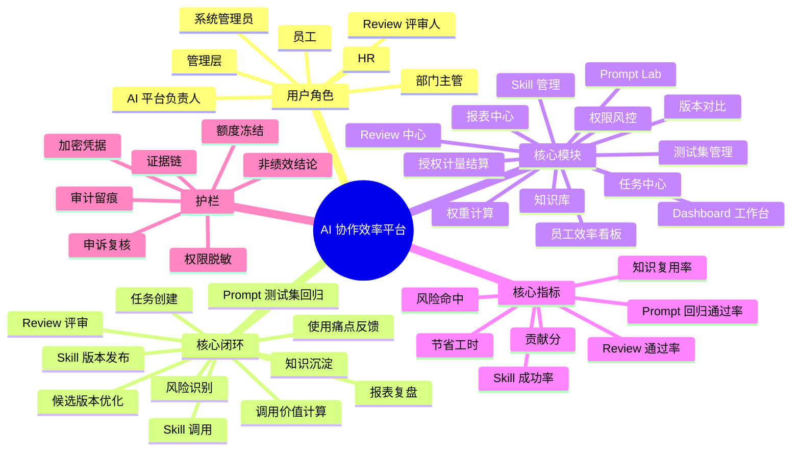
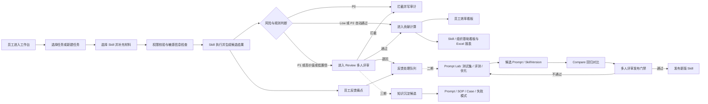
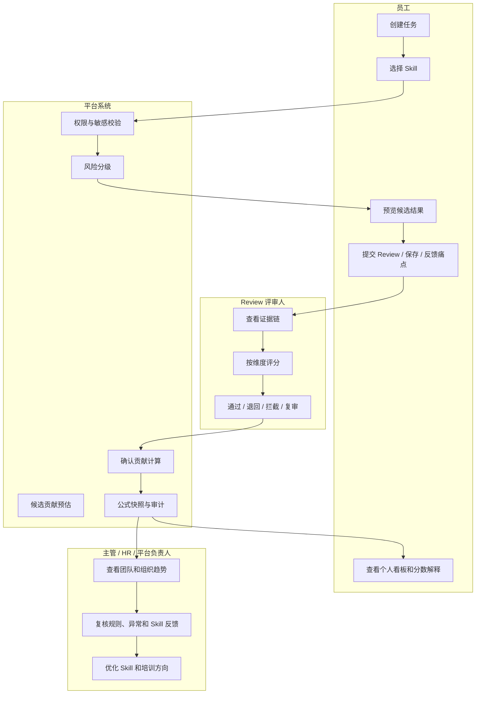
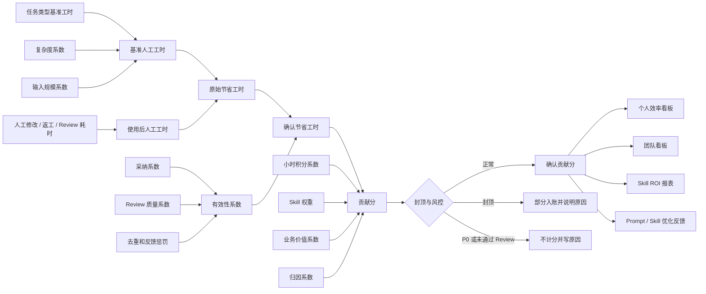
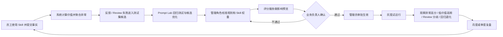

# AI 协作效率平台 PRD

- 文档状态: 产品方案 Ready / 一期开发范围待确认 / 上线前业务参数待补齐
- 文档版本: v1.4
- 生成日期: 2026-05-08
- 适用读者: 业务负责人、产品经理、研发负责人、评审人、HR、AI 平台负责人
- 核心交付口径: PRD、原型图、开发文档为主；业务思维说明作为单独补充文档保留。
- 配套文档:
  - 原始产品文档归档: [01_product_document_original_2026-05-08.md](/Users/liujun/Desktop/产品经理skill/projects/ai-collaboration-efficiency-platform/00_originals/01_product_document_original_2026-05-08.md)
  - 原型图: [06_prototype_wireframes.md](/Users/liujun/Desktop/产品经理skill/projects/ai-collaboration-efficiency-platform/06_prototype_wireframes.md)
  - 开发文档: [02_development_document.md](/Users/liujun/Desktop/产品经理skill/projects/ai-collaboration-efficiency-platform/02_development_document.md)
  - 一期开发文档: [02_phase1_development_document.md](/Users/liujun/Desktop/产品经理skill/projects/ai-collaboration-efficiency-platform/02_phase1_development_document.md)
  - 二期开发文档: [02_phase2_development_document.md](/Users/liujun/Desktop/产品经理skill/projects/ai-collaboration-efficiency-platform/02_phase2_development_document.md)
  - 三期开发文档: [02_phase3_development_document.md](/Users/liujun/Desktop/产品经理skill/projects/ai-collaboration-efficiency-platform/02_phase3_development_document.md)
  - 四期开发文档: [02_phase4_development_document.md](/Users/liujun/Desktop/产品经理skill/projects/ai-collaboration-efficiency-platform/02_phase4_development_document.md)
  - 五期开发文档: [02_phase5_development_document.md](/Users/liujun/Desktop/产品经理skill/projects/ai-collaboration-efficiency-platform/02_phase5_development_document.md)

---

> 文档维护规则: 本文件为总产品文档，后续修改以增量方式进入本文；原始产品文档只归档不直接修改。分期文档用于执行收敛，不替代总 PRD。

## 0. 核心结论

### 0.0 总产品文档维护规则

本文件是“总产品文档”，后续产品口径、范围收敛、分期调整、商业化规划和工程边界变化应以增量方式进入本文。分期开发文档、原型说明和补充说明只用于执行收敛或专题展开，不能替代总 PRD。

原始产品文档已经归档到 [00_originals/01_product_document_original_2026-05-08.md](/Users/liujun/Desktop/产品经理skill/projects/ai-collaboration-efficiency-platform/00_originals/01_product_document_original_2026-05-08.md)，归档文件只用于追溯，不直接修改。

本轮总文档增量:

- 保留原始 PRD 主体口径，继续在总 PRD 中追加阶段演进。
- 增加一期到五期开发文档引用，但分期文档不替代总 PRD。
- 增加 Skill 消费平台四期规划，覆盖线上 SaaS 与本地部署 / 私有化授权。
- 增加智能化平台五期规划，延后到内部管理和商业化链路稳定后建设。

- Skill 管理平台的核心是价值计算，不是简单配置管理；价值通过 Skill 维度、人调用 Skill 维度、组织维度、时间维度体现。
- 使用 Skill 的员工不参与 Skill、Prompt、权重、风险等级或 Review 规则管理；员工只提供任务上下文、结果采纳状态、人工修改耗时、返工情况和使用痛点。
- 调研表只适合做 Skill 上线前的初始化校准；长期价值计算必须嵌入真实调用流程，通过调用前上下文、调用后确认卡片、痛点反馈和 Review 表单采集事实。
- Prompt 管理必须融入 Skill 管理平台，但属于二期。PromptVersion 是 SkillVersion 的底层资产，测试集是验证 Prompt 是否变好的依据，Compare 只给建议，多人评审才是发布门禁。
- Prompt 管理平台中“通过测试集推动 Prompt 优化”的思想适用于 Skill 管理，但二期才落地: 员工反馈、Review 退回、低分输出和失败 Case 进入测试集候选池，驱动候选 Prompt 优化和 SkillVersion 迭代。
- Prompt 管理平台中的多人评审机制适用于 Skill 管理，但 SkillVersion 发布门禁属于二期；一期只做任务输出的基础 Review。
- “加密、授权、充值”在本平台中必须按控制面顺序落地: 审计 -> 授权 -> 版本控制 -> 风险分级 -> 价值计量 -> 成本归集 -> 结算。这里的加密首先指 Skill 源码 / 能力实现包加密: 未获得源码查看或导出授权的人，不能拿到 Prompt 源、Workflow DAG、工具适配代码、执行脚本、规则配置等 Skill 源码；有调用权限也只代表可通过平台运行时调用，不代表可查看、下载、复制源码。充值、license 和内部收费不能前置，必须建立在可审计调用、授权范围、资产版本、风险等级、价值计量和成本归集之后。
- Skill 可以支持并发执行，但一期不做。二期必须作为受控的执行编排能力落地: 一个 `SkillCall` 可生成 `ExecutionPlan`，并行执行多个独立 `SkillSubCall`，再由 `Reducer` 汇总结果；所有分支继承同一授权、加密、风险、计量和审计边界。
- Skill 消费平台作为四期商业化交付侧能力，面向外部客户和企业业务用户。客户购买的是 Skill 使用权和运行授权，可以像 SaaS 工具一样选择 Skill、提交任务、获得结果、查看历史和管理额度；无论线上 SaaS 还是本地部署 / 私有化授权，都不交付 Skill 源码、Prompt、Workflow、工具代码和私有规则明文。
- 智能化平台顺延为五期，在内部管理闭环、字段治理、商业化消费链路稳定后，再做智能评分、成长建议、ROI 归因、能力地图和自动运营建议。

## 1. 产品定位

AI 协作效率平台是面向企业内部的 AI 能力运营平台，用于把 Prompt、模型、测试集、Review 规则和业务使用场景封装成可调用、可评审、可计算价值、可持续优化的 Skill。

平台的核心不是“管理 Skill 配置”，而是通过四个维度计算 Skill 价值:

```text
Skill 维度
人调用 Skill 维度
组织维度
时间维度
```

平台一期记录员工调用 AI / Skill 完成任务的业务上下文、输入输出、结果采纳、人工修改耗时、Review 评审和反馈痛点；二期再记录 Prompt 版本和测试集回归结果，帮助企业从“员工各自使用 AI”升级为“可衡量、可评审、可优化、可沉淀”的组织级 AI 协作体系。

产品结构上，Skill 是员工可感知、可调用的业务能力；Prompt 是 Skill 背后的底层可版本化资产；测试集是驱动 Prompt 和 Skill 持续优化的质量基准；多人评审是 Prompt 候选版本和高风险 Skill 结果进入正式链路前的质量门禁。

平台不直接替代绩效评定，不做员工监控，也不输出自动奖惩结论。它提供的是可解释、可追溯、可复核的 AI 协作效能数据，用于管理者复盘、HR 培训辅助、Skill 负责人优化能力供给、员工本人改进工作方式。

### 1.1 加密、授权、充值机制定位

“加密、授权、充值”不是独立收费模块，而是 AI 能力运营平台的控制面能力。正确产品顺序如下:

```text
1. 审计: 先知道发生了什么
2. 授权: 再决定谁能做什么
3. 版本控制: 再保证能力资产可追溯
4. 风险分级: 再区分哪些必须审核，哪些可以放开
5. 价值计量: 再谈这个资产到底有没有贡献
6. 成本归集: 再看资源用了多少钱
7. 结算: 最后才谈内部收费、外部收费、充值或 license
```

四层产品结构:

| 层级 | 产品含义 | 关键对象 |
|---|---|---|
| 消费端 | 员工在 Cursor / Codex / Web 工作台中调用能力 | 任务、Skill 调用、结果确认、痛点反馈 |
| 控制面 | 平台负责注册、授权、审计、计量、结算 | 权限、审计、风险规则、价值计量、成本归集、充值、license |
| 资产层 | 能力资产被版本化和加密管理 | Skill、SkillSourcePackage、Workflow、Knowledge Pack、Tool Permission、PromptVersion、Dataset |
| 证据层 | 每次调用形成可归因记录 | SkillCall、TaskResult、ReviewRecord、ScoreRecord、UsageMeterRecord、AuditLog |

其中“加密”首先用于保护 Skill 源码和能力实现包: Skill 可以被授权调用，但源码不随调用下发，Prompt 源、Workflow DAG、工具适配代码、执行脚本、私有规则和测试集答案等只在受控运行时解密执行；普通员工、外部客户和未授权管理者都不能下载或复制源码。同时也可以限制私有 Skill 是否进入未授权用户的搜索、列表、推荐、URL 直达和 API 枚举结果，并保护附件、API Key、license key、结算凭证和成本明细。“授权”用于决定谁能发现、调用、查看源码、导出源码、管理、评审和结算；“充值 / license”只在价值计量和成本归集成立后，用于内部额度、外部客户收费、License 授权或预付费额度管理。

本阶段不追求复杂加密体系。加密只做简单包级防护，防止源码明文出现在对象存储、接口、前端、日志和报表中；开发重点是权限管理、版本管理、版本绑定不可覆盖、授权边界和审计追溯。

### 1.2 Skill 消费平台定位（四期）

Skill 消费平台是面向外部客户和企业业务用户的 AI Skill 使用平台。它不是内部 Skill 管理后台的简单开放版，而是独立的客户使用侧产品，目标是让客户像使用 SaaS 工具一样选择 Skill、提交任务、获得结果、查看历史和管理额度。

消费平台承接的能力包括:

- Skill Marketplace / Skill 目录: 展示可购买或可授权使用的 Skill。
- 客户任务提交: 客户按输入协议提交业务材料和任务参数。
- 结果查看与历史: 客户查看任务结果、下载交付物、复用历史。
- 额度与授权: 客户查看套餐、调用次数、token、license、到期时间和不可用原因。
- SaaS 多租户: 在线上版本中隔离客户、数据、额度、审计和报表。
- 私有化授权: 在本地部署 / 私有化部署中，通过加密 Skill 包、运行时授权和 license 校验解决企业数据不出域。

四期产品边界:

- 客户购买的是 Skill 使用权和运行授权，不是 Skill 资产所有权。
- 客户可以看到 Skill 名称、用途说明、输入要求、输出格式、价格 / 额度、调用历史、结果和可用状态。
- 客户不能看到 Prompt 源、Workflow DAG、工具代码、LangChain 代码段、私有规则、完整 SOP 内部实现、底层 API 密钥和源码包明文。
- 私有化部署也不默认交付源码，只交付加密 Skill 包、授权运行时、license 和必要的部署配置。
- 线上 SaaS 与私有化部署共用同一套授权、审计、计量、版本和源码保护原则。

## 2. 背景与问题

企业内部 AI 工具、Prompt 和 Agent Skill 使用正在普及，但使用方式往往分散在个人账号、聊天工具、浏览器插件、内部脚本、零散 Prompt 和未治理的 Skill 中。管理者很难判断 AI 是否真正提升效率，哪些 Skill 有价值，哪些 Prompt 版本更稳定，哪些输出值得复用，哪些内容存在风险。

当前主要问题:

- AI 使用不可度量: 只知道有人在用，难以看到任务类型、成功率、节省工时和质量。
- 产出质量不可复核: 候选结果、输入材料、模型版本、Prompt 版本、Review 过程缺少证据链。
- Skill 价值不可评估: 调用次数不能代表真实价值，缺少通过率、复用率、风险命中率和 ROI。
- Prompt 优化缺少闭环: 员工反馈、Review 退回和失败 Case 没有自动进入测试集，Prompt 改完以后缺少回归对比和发布门禁。
- 组织知识无法沉淀: 优秀 Prompt、SOP、Case 和失败模式停留在个人经验中。
- 高风险输出缺少治理: 客户材料、合同、财务、对外发布内容可能绕过人工审核。
- 评分容易被误用: 如果只看调用量或分数，容易变成不透明、不公平的员工评价工具。

## 3. 产品目标与非目标

### 3.1 产品目标

- 建立 AI / Skill 调用、结果评审、知识沉淀、贡献计算、报表复盘的完整闭环。
- 建立 Prompt 管理、测试集管理、批量评测、候选优化、回归对比、多人评审、Skill 版本发布的优化闭环。
- 让每一次有效贡献都有证据链: 任务、Skill、输入输出摘要、耗时、版本、评分、评审人和复用记录。
- 让每一次 Skill 价值计算都能解释: 基准工时、使用后人工耗时、采纳状态、Review 质量、Skill 权重、业务价值、封顶和异常规则。
- 支持员工、评审人、主管、HR、AI 平台负责人在同一套口径下查看 AI 协作效率。
- 帮助 AI 平台负责人判断哪些 Skill 值得推广、优化、下线或限制。
- 通过权限、Review、审计和风险分级，降低敏感数据泄露和错误输出进入业务流程的风险。

### 3.2 非目标

一期不做:

- 不做完整绩效系统，不直接生成绩效结论。
- 不做员工屏幕监控、键鼠监控或实时行为监控。
- 不接管企业所有外部 AI 工具账号。
- 不做复杂多 Agent 编排平台。
- 不做跨企业 Skill 市场。
- 不做自动奖惩、自动晋升、自动淘汰。
- 不开放无限制数据采集，员工个人隐私和敏感数据必须受控。
- 不允许普通员工直接管理生产 Skill、Prompt 模板、权重、风险等级、Review 规则、发布、暂停或回滚。

### 3.3 一期范围冻结

一期只做 Skill 价值计算闭环，范围冻结为:

```text
账号导入 + RBAC
Skill 清单
SkillSourcePackage 加密上传与运行时解密
任务创建
SkillCall
TaskResult
结果确认
Skill 反馈
基础 Review
ScoreRecord
公式快照
个人 / Skill / 组织基础看板
授权校验
审计
基础计量证据
Excel 报表
```

一期明确不做:

```text
Prompt Lab
Prompt 候选优化
测试集回归
SkillVersion 多人发布门禁
成本归集
充值
license
真实结算
Skill 并发执行
复杂 DAG
完整知识库
通知
申诉
```

开发拆任务必须以开发文档 `0.3 一期开发冻结清单` 为准，不能从二期规划或全文说明中自行扩大一期范围。

## 4. 目标用户与角色

| 角色 | 核心目标 | 核心任务 | 关键风险 |
|---|---|---|---|
| 员工 / 使用者 | 用 AI 更快完成工作并保留贡献证据 | 选择任务、调用 Skill、提交产出、自检结果、反馈 Skill 使用痛点、沉淀经验 | 误输入敏感数据、直接使用错误输出 |
| Review 评审人 | 控制高风险或高价值输出质量 | 审核结果、多人评分、填写意见、通过/退回/拦截 | 审核标准不一致、评审超时 |
| 部门主管 | 看清团队 AI 协作效率和风险 | 查看团队看板、识别优秀案例、发现培训需求 | 把分数误当绩效结论 |
| HR / 绩效负责人 | 辅助观察能力与培训需求 | 配置评分口径、查看趋势、管理复核边界；申诉不进入一期 | 过度查看个人敏感明细 |
| AI 平台负责人 | 评估和治理 Skill 供给 | 管理 Skill、配置权重、跟踪 ROI、优化或下线低价值 Skill | Skill 版本混乱、低价值 Skill 刷分 |
| Prompt / Skill 优化人员 | 基于测试集和失败 Case 优化底层 Prompt | 管理 Prompt 版本、测试集、评测、候选优化、回归对比、发布建议 | 候选 Prompt 未充分评测就进入生产 Skill |
| 系统管理员 | 维护组织、权限、审计和风控 | SSO、组织架构、角色权限、审计日志、规则配置 | 权限配置错误、高风险规则误放行 |
| 结算 / 授权管理员（二期） | 管理能力额度、充值、license 和成本归集口径 | 配置账号额度、授权周期、成本中心、结算周期、冻结与调整 | 越权发放额度、绕过审批、成本归因错误 |
| 管理层 | 了解公司级 AI 效能和组织成熟度 | 查看组织趋势、节省工时、复用价值、高潜能力 | 用单一指标做管理决策 |

### 4.1 产品结构示意图



## 5. 核心业务流程

标准流程:

1. 员工进入工作台，选择任务池中的任务或新建任务。
2. 员工选择或搜索合适 Skill，补充输入材料并设置参数。
3. 系统进行权限校验、敏感信息检查、任务分类和 Skill 路由。
4. Skill 执行后生成候选结果，系统记录输入输出摘要、耗时、版本、风险等级和置信度。
5. 员工预览结果并自检。满意后可保存或提交 Review；不满意则修改输入或更换 Skill。知识沉淀不进入一期。
6. 员工可以反馈 Skill 使用痛点，例如输出不准、字段缺失、格式不符、耗时无明显降低、风险提示不足或场景不匹配。
7. 高风险、高价值或低置信任务进入基础 Review；多人发布门禁属于二期 SkillVersion / PromptCandidate 发布链路。
8. 评审人给出评分、意见和处理动作: 通过、退回、拦截、复审、沉淀知识。
9. 评审通过或低风险自动通过后，价值计算引擎生成确认节省工时、贡献分、质量状态和公式快照。
10. 一期到此结束。员工反馈只进入 Skill 反馈处理队列，不进入 Prompt Lab。
11. 二期: 员工反馈、Review 退回、低分输出和失败结果由管理角色判断是否转入 Prompt Lab。
12. 二期: Prompt / Skill 优化人员把有效失败样本沉淀为测试集 Case，基于测试集发起 Prompt 优化、候选版本生成、回归测试和 Compare 对比。
13. 二期: 候选 Prompt 或 SkillVersion 必须通过多人评审门禁后，才能发布为生产 Skill 版本；未通过则退回继续优化。
14. 三期: 优秀结果沉淀为 Prompt、SOP、Case、失败模式或评审经验，并记录复用情况。

### 5.1 主链路示意图



### 5.2 角色协作泳道示意图



## 6. MVP 核心模块

### 6.1 Dashboard 工作台

目标: 让不同角色进入平台后看到自己最需要处理的任务、Review、风险和效率概览。

能力范围:

- 员工看到我的任务、最近结果、常用 Skill、待处理 Review、风险提醒。
- 评审人看到待审任务数、P0/P1 风险分布、超时队列。
- 主管看到团队 AI 任务量、Review 通过率、节省工时、知识复用趋势。
- 管理员看到 Skill 异常、权限异常、风控命中和审计提醒。

验收标准:

- 不同角色工作台信息不同。
- 工作台指标可点击进入明细。
- 敏感输入内容不在概览页暴露。

### 6.2 任务中心 / Skill 调用

目标: 员工可以按任务快速找到合适 Skill，完成调用并保留过程记录。

能力范围:

- 任务创建: 支持任务类型、目标说明、输入材料、输出要求、截止时间。
- 调用前上下文采集: 员工需要提供任务类型、业务场景、业务对象、期望产出、任务复杂度、输入材料；预计不用 Skill 的人工耗时可选填，用于校准而不直接入账。
- Skill 选择: 支持按部门、任务类型、关键词、风险等级、通过率筛选。
- 输入校验: 检查敏感数据、必填材料、权限范围。
- 执行记录: 记录 Skill、模型、Prompt 版本、执行耗时、候选结果、失败原因。
- 一期执行模式: 只记录 `single` SkillCall，不创建 ExecutionPlan 和 SkillSubCall，不开放 execution-plan 接口。
- 结果确认: 员工在保存、提交、复制或导出前确认采用状态、人工修改耗时、是否返工、是否已提交到业务流程。
- 结果操作: 保存、提交 Review、申请沉淀、反馈错误、重新执行。
- Skill 反馈: 员工可以提交使用痛点和新场景建议，但不能修改生产 Skill、权重、Prompt、Review 规则或风险等级。

二期预留说明:

- 并发执行仅作为二期能力预留。对多文档、多数据源、批量 Case、多候选生成等可拆分任务，二期再支持 ExecutionPlan、SkillSubCall 和 Reducer。
- 一期任务中心不得展示并发详情页入口，也不得让员工选择或提高并发数。

验收标准:

- 员工能完成一次从选 Skill 到获得结果的闭环。
- 员工完成一次有效调用时，必须留下任务上下文、采用状态和人工修改耗时，作为价值计算输入。
- 高风险输入被拦截或进入强制 Review。
- 任务结果能追溯 Skill 版本、生成时间、风险等级和评审状态。
- 员工反馈被记录到 Skill 反馈处理队列，并能关联任务、Skill 版本和反馈类型；进入优化任务、测试集或 Prompt Lab 属于二期。

### 6.3 基础 Review 评审中心

目标: 对高风险、高价值或低置信 AI 输出进行基础人工复核，保证质量和风险可控。PromptCandidate 和 SkillVersion 的多人发布门禁属于二期。

能力范围:

- 待审队列: 按部门、Skill、风险等级、提交人、状态、时间筛选。
- 评审详情: 展示原始输入摘要、输出结果、风险提示、来源、模型记录、历史版本。
- 评分维度: 完整性、准确性、可用性、风险控制、复用价值。
- 评审动作: 通过、退回、拦截、复审、标记优秀案例、沉淀知识。
- 评审留痕: 记录评审人、时间、动作、分数、意见和原因。

验收标准:

- P0 风险不得自动通过。
- 退回和拦截必须填写原因。
- 多人评分结果可追溯。
- 被拦截内容不能进入知识库或对外发布链路。

### 6.4 员工效率看板

目标: 以可解释方式展示员工和团队 AI 协作效率。

能力范围:

- 个人指标: AI 任务数、任务成功率、Review 通过率、节省工时、知识贡献、风险命中。
- 团队指标: 部门趋势、Skill 使用分布、复用资产、风险分布。
- 能力雷达: 任务完成效率、Skill 使用效率、产出质量、任务复杂度、协作响应、经验沉淀。
- 证据链: 指标可点击查看来源任务和评审记录。
- 边界提示: 数据用于效率分析和培训建议，不直接等同绩效。

验收标准:

- 员工可查看自己的明细和解释。
- 主管可查看授权范围内的团队汇总。
- HR 默认只能看汇总趋势和分布，不看敏感输入明细。

### 6.5 Skill 管理与权重配置

目标: 一期先管理可调用 Skill 的展示、授权、反馈、计分和源码包保护；二期再管理完整 SkillVersion 发布生命周期。

能力范围:

- Skill 清单: 名称、版本、负责人、适用部门、适用场景、风险等级、状态。
- Skill 详情: 输入要求、输出格式、示例、权限、Review 规则、released 版本摘要、模型配置摘要。
- 一期生命周期: released 版本读取、暂停、归档、源码包上传和绑定；创建候选版本、测试、发布评审、回滚、复制为新版本属于二期。
- 权重配置: 员工层级权重、业务板块权重、任务复杂度系数、Skill 权重。
- 指标: 调用量、成功率、Review 通过率、复用率、风险命中率、预计节省工时。
- 员工反馈聚合: 按反馈类型、任务类型、Skill 版本、Review 退回率、执行失败率、风险命中率聚合使用痛点。
- 一期反馈处理: 管理人员只查看聚合反馈和更新处理状态。
- 二期优化闭环: 管理人员基于反馈创建优化任务，进入 Prompt Lab 进行测试集回归、候选 Prompt 优化、Compare 对比和多人评审，经审批后上架或回滚。

验收标准:

- 一期 Skill 必须有 released 版本、模型配置摘要、输入输出 Schema、Review 规则和计分规则版本。
- 二期 SkillVersion 上架前必须有测试记录，并明确绑定 PromptVersion、模型配置、测试集基线和计分规则版本。
- 高风险 Skill 上架需要人工确认。
- 下线 Skill 后员工不能继续调用。
- 版本变更和权重调整均可追溯。
- 员工只能反馈使用痛点和场景建议，不能修改 Skill 配置、权重、风险等级、Review 规则、上架、下线或回滚。

### 6.6 Skill 使用反馈与优化闭环

目标: 让员工把使用中的真实痛点反馈给管理角色，由管理角色统一评估和优化 Skill。

员工可反馈:

- 输出不准确。
- 数据口径不一致。
- 缺字段或缺步骤。
- 格式不符合业务要求。
- 结果不可直接使用。
- 耗时没有明显降低。
- 风险提示不充分。
- 参数太复杂。
- 场景不匹配。
- 希望支持新任务类型。

管理端处理:

- 汇总反馈次数、反馈类型、关联任务类型、Skill 版本和影响范围。
- 结合 Review 退回率、执行失败率、节省工时变化、风险命中率和复用率判断是否需要优化。
- 一期只更新反馈处理状态，不创建 Skill 优化任务。
- 二期再将有效反馈转成 Skill 优化任务，测试新版 Skill，完成 Review 或审批后上架。
- 对反馈人展示处理状态: 已收到、分析中、已处理、不采纳及原因；已纳入优化、已发布新版属于二期状态。

核心边界:

```text
员工是 Skill 使用者和反馈提供者，不是 Skill 管理者。
一期反馈处理由管理角色基于反馈、Review 数据、风险数据和效率数据统一处理；二期 Skill 优化再进入测试集、候选版本和发布门禁。
```

验收标准:

- 员工可在任务结果页或 Skill 详情页提交反馈。
- 反馈必须关联 Skill ID、Skill 版本、任务 ID、反馈类型和可选说明。
- 员工看不到未授权的其他人输入内容。
- 管理角色能在 Skill 管理页查看聚合反馈和处理状态；优化队列二期再做。
- 反馈不能直接改变 Skill 权重、Prompt、风险等级、Review 规则或版本状态。

### 6.7 Prompt Lab 与测试集驱动优化（二期）

目标: 二期把 Prompt 管理平台中的测试集、批量运行、教师模型评分、候选优化、版本对比和多人评审机制融入 Skill 管理平台，让 Skill 优化建立在真实失败 Case 和回归测试上。一期只记录 Skill 反馈和处理状态，不转 DatasetCase，不生成 Candidate，不做 Compare。

核心定位:

```text
Prompt Lab 是 Skill 的研发和调优工作台。
Skill 管理是 Skill 的发布、治理、权重和价值计算工作台。
员工只使用 Skill 和反馈痛点，不直接管理 Prompt。
```

能力范围:

- Prompt 管理: 支持 Prompt 创建、结构化编辑、版本保存、版本 Diff、发布状态和关联 Skill。
- 测试集管理: 支持从员工反馈、Review 退回、低分 Case、人工导入中沉淀测试集 Case。
- 批量运行: 选择 PromptVersion、Dataset、模型配置后批量运行，记录每个 Case 的输入、输出、耗时、失败原因。
- 教师模型评测: 使用独立教师模型对输出进行评分、归因和优化建议生成。
- 候选优化: 基于失败 Case 和评测结果生成候选 Prompt，不直接进入生产。
- 回归对比: 对比旧 Prompt 与候选 Prompt 的总分、通过率、改好 Case、改坏 Case、风险 Case、响应耗时。
- 多人评审门禁: 候选 Prompt 或 SkillVersion 发布前必须经过多人评审，Compare 只给建议，不自动发布。
- Skill 版本打包: 通过评审的 PromptVersion 与模型配置、输入输出规范、Review 规则、计分规则一起打包为新的 SkillVersion。

测试集来源:

| 来源 | 进入方式 | 用途 |
|---|---|---|
| 员工痛点反馈 | 管理员确认后转为 DatasetCase | 覆盖真实业务失败场景 |
| Review 退回 / 拦截 | 自动生成候选 Case，评审人补充原因 | 覆盖质量和风险问题 |
| 低分输出 | 系统按评分阈值进入候选池 | 覆盖模型不稳定问题 |
| 业务样本导入 | 管理员批量导入 | 建立标准回归基线 |
| 优秀案例 | 评审通过后沉淀 | 形成正向样例和 few-shot 资产 |

验收标准:

- 一个 Skill 的优化任务能关联至少一个 PromptVersion 和一个测试集。
- 员工反馈或 Review 失败 Case 能被管理角色转入测试集候选池。
- 候选 Prompt 必须完成回归测试和 Compare 对比后才能进入发布评审。
- 多人评审未通过时，候选 Prompt 不能成为生产 SkillVersion。
- 新 SkillVersion 发布后，必须能按版本追踪节省工时、Review 通过率、反馈问题率和 Prompt 回归表现。

### 6.8 知识沉淀

目标: 把优秀 Prompt、SOP、Case、评审经验和失败模式沉淀为组织资产。

能力范围:

- 支持从通过评审的任务结果沉淀知识资产。
- 支持知识类型: Prompt、SOP、Case、失败模式、评审经验。
- 支持来源追溯: 原任务、Skill、作者、评审人、版本、沉淀时间。
- 支持复用记录: 被谁复用、复用到哪个任务、复用后质量表现。

验收标准:

- 未通过 Review 的高风险内容不能沉淀。
- 每个知识资产都能追溯来源。
- 知识复用次数能进入报表统计。

### 6.9 报表导出

目标: 给主管、HR、AI 平台负责人提供可解释、可导出的 AI 协作效率报告。

能力范围:

- 员工月报。
- 团队报表。
- Review 质量报表。
- Skill ROI 报表。
- 知识复用报表。
- 导出 Excel / PDF。

验收标准:

- 报表展示统计口径和数据限制。
- 导出动作写入审计日志。
- HR 报表不默认包含员工敏感输入明细。

### 6.10 权限与风控

目标: 确保 AI 使用、评审、评分、报表和知识沉淀在权限边界内运行。

能力范围:

- 角色权限: 员工、评审人、主管、HR、Skill 管理员、系统管理员。
- 风险等级: P0、P1、P2、Low。
- 风控动作: 拦截、强制 Review、风险提示、二次确认、审计。
- 防刷分: 低价值 Skill 计分上限、重复任务识别、异常调用检测。
- 申诉复核: 对评分、风险命中、评审结论支持复核入口。
- Skill 管理边界: 员工只能使用和反馈，不能管理生产 Skill；所有 Skill 配置变更必须由授权管理角色完成并留痕。

验收标准:

- P0 风险 100% 拦截。
- 未授权用户无法访问受限 Skill、任务结果和报表。
- 高风险配置变更必须二次确认并留痕。

### 6.11 加密授权充值与结算控制面（一期基础 / 二期增强）

目标: 一期先把 Skill 从“可调用能力”升级为“可授权、可审计、可计量、源码受保护”的能力资产；二期再把 Prompt、Workflow、Knowledge Pack、Tool Permission 扩展为可归集成本、可充值、可 license 和可结算的能力资产。

一期边界:

- 只做审计、授权、版本快照、风险分级、价值计量、基础 UsageMeterRecord 和源码包加密保护。
- 不做 CostAllocationRecord、SettlementAccount、RechargeTransaction、LicenseEntitlement、真实扣费、真实充值或真实结算。

能力范围:

- 审计: 一期每次调用、授权变更、源码包上传、运行时解密、计分和报表导出都写入审计；二期额度调整、license 发放、结算冻结、成本调整也必须写入审计，不允许先结算后补证据。
- 授权: 支持按用户、角色、部门、成本中心、Skill、Workflow、Knowledge Pack、Tool Permission、动作范围配置授权。
- 加密: Skill 源码 / 能力实现包加密存储，调用时只在受控运行时解密执行；普通调用方不能查看、下载、复制 Prompt 源、Workflow DAG、工具适配代码、执行脚本和私有规则。敏感输入输出、附件、API Key、license key、结算凭证、外部客户标识和成本明细也要做加密存储或密钥引用，页面默认脱敏展示。
- 版本控制: SkillVersion、PromptVersion、Dataset、Workflow、Knowledge Pack、Tool Permission 的版本必须进入调用快照，保证每笔价值和成本都能回到资产版本。
- 风险分级: P0/P1/P2/Low 决定是否拦截、强审、提示、自动通过，也决定是否允许计费、冻结或进入人工复核。
- 价值计量: 以 `SkillCall`、`ScoreRecord`、Review 结果和采用状态计算贡献，不用调用量直接代表价值。
- 成本归集（二期）: 按模型 token、工具调用、存储、人工 Review、外部 API、license 成本归集到组织、成本中心、Skill、用户和时间周期。
- 结算 / 充值 / license（二期）: 在价值和成本可解释后，再支持内部额度扣减、预充值、外部客户收费、license 配额、周期结算、退款、调整和冻结。

验收标准:

- 二期没有 `SkillCall`、`UsageMeterRecord` 和审计记录的消耗，不允许进入成本归集和结算。
- 没有有效授权的用户不能调用受限 Skill、Workflow、Knowledge Pack 或 Tool Permission。
- 只有具备 `source_read` 或 `source_export` 授权的管理角色才能查看或导出 Skill 源码；`call` 授权只允许运行，不允许拿到源码。
- 员工端一期只展示可用 / 不可用状态、不可用原因和申请入口；二期再展示额度摘要。不展示充值、license 发放、成本调整等管理操作。
- 二期充值、license 发放、结算冻结和成本调整必须由授权角色操作，必须填写原因，并写入审计。
- Skill 源码、加密字段和密钥引用不能在普通 API 响应中返回明文，只能返回脱敏值、对象引用、版本号或权限范围内的摘要。

### 6.12 Skill 并发执行

目标: 二期对可以拆分的复杂任务，通过多线程 / 多 Worker 并发执行提升处理效率，同时保持授权、源码加密、风险、计量和审计可控。一期只保留 `single` 执行证据，不启用并发。

适用场景:

- 多文档并行解析、摘要、抽取和对比。
- 多数据源并行查询，例如 CRM、财务表、合同库、知识库。
- 批量测试集评测，同一 PromptVersion 并行运行多个 Case。
- 多候选方案生成，再由评测器或汇总器筛选。
- 长报告分章节生成，再统一润色和一致性检查。
- 多工具并行调用，例如 OCR、表格解析、搜索、模型调用。

能力范围:

- 并发执行计划: 一期 `SkillVersion.execution_mode` 固定为 `single`，不向用户或管理端开放配置；二期开始支持 `parallel`，三期再扩展复杂 DAG。
- 子任务拆分: 一个 `SkillCall` 可拆成多个 `SkillSubCall`，每个子任务独立记录输入摘要、输出摘要、耗时、状态、失败原因和计量。
- 汇总器 Reducer: 并发结果不能简单拼接，必须由 Skill 配置的汇总策略做去重、冲突处理、一致性校验、排序和最终结论生成。
- 并发控制: 每个 SkillVersion 配置最大并发数、超时、重试、失败策略、预算上限和降级策略。
- 成本控制: 并发执行前做预算预估，执行中写计量记录；超过预算或额度时按规则中断、降级或转人工。
- 风险控制: 子任务可并发，最终结果必须统一经过风险分级、Review 门禁和价值计算。

约束:

- 并发子任务继承父级 `SkillCall` 的授权、源码加密、license、额度、风险和审计上下文。
- 并发执行不能把 Skill 源码、Prompt 源或工具适配代码下发给调用方。
- 强顺序依赖、高风险审批链路、共享写状态操作不默认启用并发。
- 并发只提升执行效率，不改变贡献分公式；节省工时仍以最终结果采纳、Review 和人工修改耗时为准。

验收标准:

- 并发任务能展示总耗时、最长子任务耗时、子任务数量、成功 / 失败数量和汇总策略。
- 任一 `SkillSubCall` 都能追溯父级 `SkillCall`、SkillVersion、授权快照、计量记录和审计日志。
- Reducer 失败时任务不得直接进入确认计分，必须显示失败原因或进入人工处理。
- 并发执行的成本和额度消耗能被单独归集，不能只记录最终总数。

## 7. 评分模型

### 7.1 单次任务贡献

Skill 价值计算以一次真实业务调用为最小单元。系统先判断这次调用是否有效，再计算节省工时和贡献分，最后按 Skill、人、组织、时间和版本聚合。

核心公式:

```text
基准人工工时 =
任务类型基准工时
× 任务复杂度系数
× 输入规模系数

使用后人工工时 =
人工修改耗时
+ 返工耗时
+ Review 人工耗时
+ 阻塞等待耗时

原始节省工时 =
max(基准人工工时 - 使用后人工工时, 0)

有效性系数 =
采纳系数
× 质量系数
× Review 门禁系数
× 去重系数
× 反馈惩罚系数

确认节省工时 =
原始节省工时 × 有效性系数

贡献分 =
确认节省工时
× 小时积分系数
× Skill 权重
× 业务价值系数
× 归因系数
```

原则:

- 员工提供事实: 任务上下文、输入材料、期望产出、采用状态、人工修改耗时、返工情况和使用痛点。
- 系统采集过程: 调用时间、Skill 版本、Prompt 版本、模型配置、输入输出规模、运行耗时、错误、Review 状态。
- 管理端配置规则: 基准工时、Skill 权重、业务价值系数、Review 规则、质量阈值、封顶和反刷分规则。
- 候选结果不直接计分，必须通过 Review 或满足低风险自动通过规则。
- 每个贡献分必须有证据链。
- 员工自填的预计人工耗时只用于校准和异常复核，不直接决定最终基准工时。
- 低价值 Skill 设置计分上限，避免刷调用次数。
- 每次计分必须保存公式版本、输入值、权重、封顶结果和 Review 结果快照，后续规则变化不能覆盖历史解释。

采用系数建议:

| 结果状态 | 系数 | 说明 |
|---|---:|---|
| 直接采用 | 1.00 | 输出可直接进入业务流程 |
| 少量修改后采用 | 0.85 | 有人工编辑，但主体可用 |
| 大量修改后采用 | 0.45 | 有参考价值，但质量明显不足 |
| 仅参考 | 0.25 | 只提供思路，不构成完整产出 |
| 未采用 | 0 | 不计贡献 |

Review 门禁:

```text
P0 = 拦截，不计贡献
P1 / 高价值 / 低置信 = 必须多人 Review 后才确认计分
Review 未通过 = 不计贡献
Review 分歧过大 = 进入复审，暂不确认计分
Review 通过 = 按质量系数参与计算
```

### 7.2 员工效率总分

建议维度:

| 维度 | 权重建议 | 说明 |
|---|---:|---|
| 任务完成效率 | 20% | AI 辅助完成任务数量、及时性、成功率 |
| AI Skill 使用效率 | 20% | Skill 选择准确性、执行成功率、重复返工率 |
| 产出质量 | 25% | Review 评分、通过率、退回率、优秀案例 |
| 任务复杂度与业务价值 | 15% | 高复杂、高价值任务贡献 |
| 协作与响应效率 | 10% | Review 响应、补充材料、跨角色协同 |
| 经验沉淀与持续改进 | 10% | Prompt、SOP、Case、失败模式沉淀与复用 |

不同员工层级可使用不同模板:

- 新手: 更看学习、规范、正确使用 Skill。
- 成长期: 更看独立完成任务和质量提升。
- 熟手: 更看复杂任务、业务价值和复用。
- 专家 / 负责人: 更看方法沉淀、团队赋能和 Skill 优化。

### 7.3 评分模型示意图



### 7.4 评分边界

- 平台分数只作为绩效辅助数据，不直接替代最终绩效决定。
- 员工应能看到自己的任务明细、评分来源和解释。
- 主管调整、HR 复核和最终确认必须留痕。
- 评分规则和权重调整必须可追溯；申诉流程不进入一期。

### 7.5 看板权重解释要求

- 效率看板、Skill 管理和报表中的每个分数都必须能展开说明: 来源任务、基准工时、使用后人工耗时、采纳状态、任务复杂度、输入规模、业务价值系数、Skill 权重、Review 质量系数、有效性系数、反作弊系数和封顶结果。
- Skill 权重采用系统建议值与管理员审批值分离: 系统根据通过率、节省工时、复用率、风险命中率和失败率生成建议，管理员审批后才生效。
- Review 评分维度权重必须可配置、可版本化，默认完整性 40%、准确性 25%、可用性 20%、复用价值 10%、合规安全 5%。
- 候选贡献分只能作为预估，确认贡献分必须来自 Review 通过或低风险自动通过后的评分服务。
- 分数为 0、被封顶、被复核或被人工调整时，必须展示原因；申诉入口二期或三期再做。

### 7.6 使用者事实采集与规则校准机制

评分引擎只负责把规则计算准确、存储准确、解释准确。一次调用的真实业务事实由使用 Skill 的员工提供；长期规则由管理角色和业务负责人校准；系统负责自动采集过程数据并保存证据链。

| 环节 | 使用者需要提供 | 管理端需要配置 | 系统自动采集 / 计算 |
|---|---|---|---|
| 调用前上下文 | 任务类型、业务场景、业务对象、期望产出、任务复杂度、输入材料 | 任务类型字典、适用 Skill、必填字段 | Skill 推荐、权限校验、输入规模 |
| 基准工时 | 预计不用 Skill 的耗时，可选，用于校准 | 任务类型基准工时、复杂度系数、输入规模系数 | 按规则计算基准人工工时并记录来源 |
| 调用过程 | 追加说明、是否重新生成、是否中断 | 可重试次数、超时、敏感信息规则 | Skill 版本、Prompt 版本、模型配置、执行耗时、失败原因 |
| 调用后确认 | 是否采纳、人工修改耗时、是否返工、是否提交业务流程 | 采纳系数、返工扣减、有效产出定义 | 使用后人工工时、原始节省工时、有效性系数 |
| 质量确认 | 对结果是否可用的主观反馈 | Review 模板、多人评审规则、通过阈值 | Review 质量系数、分歧检测、门禁状态 |
| 痛点反馈 | 问题类型、问题描述、错误样例、正确示例 | 反馈处理 SLA、反馈处理责任人 | 一期只进入反馈处理队列；二期再创建测试集候选 Case、进入 Prompt Lab |
| 封顶与反刷分 | 不参与配置 | 低价值任务上限、重复调用规则、异常复核规则 | 去重、封顶、异常标记、审计 |

规则变更流程:

```text
员工使用和反馈积累真实样本
-> 系统聚合异常、高频低价值、Review 退回和失败 Case
-> 管理角色校准任务类型 / 基准工时 / Review 模板 / 权重
-> 使用历史样本做影响预览
-> 业务负责人确认
-> 管理员审批生效
-> 试运行观察异常
-> 月度或季度复盘校准
```

约束:

- 员工参与的是事实提供和痛点反馈，不参与 Skill 管理、Prompt 管理、权重配置或逐条改分。
- 管理角色参与的是规则定义和周期校准，不是逐条随意改分。
- 每次权重调整必须说明原因、生效范围、生效时间和审批人。
- 历史分数读取当时的公式快照，不被新规则覆盖。
- 校准会议应重点检查异常高分、低价值高频、Review 分歧、基准工时偏差、Skill 权重失真、测试集覆盖不足和 Prompt 候选版本回归退化。

### 7.7 业务规则校准闭环示意图



## 8. 权限矩阵

| 角色 / 动作 | 查看任务 | 创建任务 | 调用 Skill | 反馈 Skill 痛点 | 查看他人结果 | Review | 发布知识 | 修改 Skill | 下线 Skill | 查看个人看板 | 查看团队看板 | 导出报表 | 配置权限 |
|---|---|---|---|---|---|---|---|---|---|---|---|---|---|
| 员工 | 自己 | 允许 | 授权范围 | 允许 | 不允许 | 不允许 | 申请沉淀 | 不允许 | 不允许 | 允许 | 不允许 | 个人导出 | 不允许 |
| Review 评审人 | 授权队列 | 允许 | 授权范围 | 允许 | 授权范围 | 允许 | 允许 | 不允许 | 不允许 | 允许 | 按权限 | Review 报表 | 不允许 |
| 部门主管 | 本部门 | 允许 | 授权范围 | 可查看本部门聚合 | 本部门汇总 | 可参与 | 可推荐 | 不允许 | 不允许 | 允许 | 本部门 | 本部门报表 | 不允许 |
| HR | 汇总趋势 | 不默认 | 不默认 | 看汇总趋势 | 不看敏感输入 | 不允许 | 不允许 | 不允许 | 不允许 | 不看敏感明细 | 跨部门汇总 | HR 报表 | 不允许 |
| Skill 管理员 | Skill 相关 | 允许 | 测试范围 | 查看并处理 | Skill 测试结果 | 可参与 | 允许 | 允许 | 允许 | 允许 | Skill 维度 | Skill 报表 | Skill 权限 |
| Prompt / Skill 优化人员 | 授权优化任务 | 允许 | 测试范围 | 查看授权聚合 | 授权 Case | 可参与候选评审 | 可沉淀 | 候选版本 | 不允许直接下线生产 | 允许 | Skill 维度 | 优化报表 | 不允许 |
| 结算 / 授权管理员 | 结算相关 | 不默认 | 测试范围 | 看聚合 | 不看敏感输入 | 不默认 | 不允许 | 不允许 | 不允许 | 允许 | 成本中心 / 授权范围 | 成本与结算报表 | 授权 / 额度 / license |
| 系统管理员 | 审计授权范围 | 允许 | 全部授权 | 可配置 | 按审计授权 | 可配置 | 可配置 | 可配置 | 可配置 | 可配置 | 可配置 | 全部 | 允许 |

补充约束:

- 一期只做基础字段过滤，确保普通接口不返回源码、密钥和未授权敏感明细；二期完整 Skill 看板字段按账号权限做服务端字段级过滤: 员工只看可调用说明和结果，评审人只看授权 Review 所需证据，主管 / HR 默认看聚合，Skill 管理员看授权范围内配置，源码和底层实现必须额外具备 `source_read` 或 `source_export`。
- 充值、license 发放、成本调整、结算冻结只开放给 `settlement_admin`、`system_admin` 或被显式授权的 `skill_admin`，且必须二次确认和审计。
- 员工不能直接充值、发放 license、调整成本、跳过额度或修改授权；员工只能查看自己是否有可用权限、可用额度和不可用原因。
- 结算 / 授权管理员默认不读取员工敏感输入全文，只查看计量摘要、成本归集、额度状态和审计凭证。

## 9. 风险分级与处理

| 风险等级 | 示例 | 处理方式 |
|---|---|---|
| P0 | 敏感数据泄露、违法违规、客户承诺、越权访问、绕过审核对外发布 | 直接拦截，进入审计，必要时通知管理员 |
| P1 | 对外发布内容、客户材料、合同财务、低置信高影响结论 | 强制 Review |
| P2 | 一般内部材料、低风险效率任务、可能存在口径不完整 | 风险提示后保存或员工确认 |
| Low | 个人草稿、通用总结、格式整理 | 可直接保存 |

## 10. 成功指标

| 指标 | MVP 目标 | 统计口径 | 护栏 |
|---|---:|---|---|
| AI 任务完成率 | >= 85% | 提交任务后获得可用结果的比例 | 排除测试任务和重复提交 |
| Review 通过率 | >= 70% | 审核通过数 / 进入 Review 数 | 不能为提高通过率降低标准 |
| 人均节省工时 | 可被部门主管确认 | 自报 + 任务类型估算 + 抽样复核 | 不作为单独绩效依据 |
| 知识复用率 | >= 20% | 被复用知识 / 被沉淀知识 | 复用必须有来源和版本 |
| Skill 调用成功率 | >= 95% | 成功执行次数 / 调用次数 | 失败要记录原因 |
| Prompt 回归通过率 | 上线候选版本高于现网版本 | 候选 Prompt 与现网 Prompt 在同一测试集上的通过率对比 | 不能只看平均分，必须看改坏 Case |
| Skill 反馈闭环率 | >= 80% | 已处理反馈 / 总反馈 | 不采纳必须说明原因 |
| Review 处理时长 | P1 <= 24h | 从提交到处理完成 | 高风险内容不得自动发布 |
| 高风险拦截率 | 100% 拦截 P0 | 命中敏感数据、违规、越权等 | P0 不可绕过人工复核 |
| 权限越权拦截 | 100% | 未授权访问受限数据或 Skill | 记录审计日志 |
| 计量证据完整率 | 100% | 进入看板或结算的记录必须有关联 SkillCall、ScoreRecord / UsageMeterRecord 和 AuditLog | 无证据不计量、不结算 |
| 成本归集覆盖率 | 二期 >= 95% | 可计费消耗中已归集到成本中心 / Skill / 组织的比例 | 未归集消耗进入待处理队列 |
| 充值 / license 审批留痕率 | 100% | 额度调整、license 发放、冻结、退款等有审批和审计 | 不允许后台直接改余额 |
| Skill 源码保护 | 100% | 普通调用、列表、看板、报表、计量接口不返回源码明文 | 源码查看和导出必须独立授权 |
| 并发执行加速比 | 二期试点可量化 | 同类任务单线程耗时 / 并发执行耗时 | 不以牺牲质量、风险和成本为代价 |

## 11. 分期规划

产品按五期规划。研发执行时以每期独立开发文档为准，不得从后续阶段反向扩大前一阶段范围。

| 阶段 | 时间建议 | 目标 | 范围 |
|---|---|---|---|
| 一期: Skill 价值计算闭环 | 0-6 周 | 先证明 Skill 调用能被记录、授权、确认、评审、计分和聚合 | 工作台、任务中心、Skill 清单、Skill 调用、Skill 源码包加密上传和运行时解密、调用前上下文、调用后结果确认、Skill 反馈、基础 Review、价值计算、个人/Skill/组织基础看板、权限审计、基础授权校验、计量证据 |
| 二期: Prompt Lab + Skill 字段治理 + 计量结算闭环 | 7-14 周 | 在一期真实反馈和失败 Case 基础上，打通测试集驱动优化，同时补齐 Skill 元数据字段、字段级可见性、成本归集、充值和 license 基础能力 | Skill 字段治理、字段级权限矩阵、Prompt 管理、测试集、反馈转 DatasetCase、批量运行、教师模型评测、候选优化、Compare、多人评审发布门禁、SkillVersion 发布/回滚、成本归集、结算账户、充值 / license 管理、Skill 并发执行基础 |
| 三期: 治理增强与知识协同 | 15-22 周 | 强化治理、知识沉淀和跨系统协同 | 权重模板、复杂回归、报表模板、通知、申诉、知识推荐、异常检测、OA/IM/Agent 平台集成、复杂 DAG 编排 |
| 四期: Skill 消费平台 / SaaS 与私有化交付版 | 23-32 周 | 面向外部客户和企业业务用户提供 AI Skill 使用平台，支持线上 SaaS 和本地部署 / 私有化授权 | 客户租户、Skill Marketplace、客户任务提交、结果历史、额度 / license、SaaS 多租户隔离、私有化部署授权、加密 Skill 包分发、本地运行时授权校验、客户侧审计 |
| 五期: 智能化平台 | 33 周以后 | 提升自动化分析和组织级 AI 能力运营 | 智能评分、成长建议、成本 ROI、数据治理、跨组织能力地图、自动运营建议、异常自动归因 |

一期不做:

- 不做 Prompt 候选自动优化。
- 不做完整测试集回归。
- 不做 SkillVersion 多人发布门禁。
- 不做 Skill 并发执行和复杂 DAG 编排；一期只按单次 SkillCall 记录执行证据。
- 不做复杂知识库、通知和申诉。
- 不做外部收费、充值入账、license 发放和周期结算；一期只保留授权校验、审计和计量证据。

二期进入条件:

- 一期已有真实 Skill 调用、Review 退回、员工反馈和低分结果。
- 至少 1 个高频 Skill 有可复用 PromptVersion。
- 管理角色能够确认哪些反馈可以进入测试集候选池。
- 计量证据模型稳定，能够把消耗归因到用户、组织、Skill、版本和时间周期。
- 并发执行增强启动前，再确认至少一个适合并发的 Skill 场景，例如多文档处理、批量 Case、章节生成或多数据源查询。

三期进入条件:

- 一期和二期的调用、反馈、Review、测试集、计量、成本和授权链路稳定。
- 已有可复用知识资产、通知场景、申诉场景和跨系统协同诉求。
- 管理角色已经确认知识沉淀的审核口径、可见范围和复用规则。

四期进入条件:

- 内部 Skill 管理、版本、授权、审计、计量和源码保护机制已经稳定。
- 成本归集、充值 / license 和客户额度模型已可解释、可审计。
- 已确认首批外部客户或企业业务用户场景、交付形态、合同授权边界和数据留存口径。
- 已确认 SaaS 多租户隔离和私有化部署授权策略。

五期进入条件:

- 内部运营数据、外部消费数据、成本数据、质量数据和反馈数据达到稳定采样量。
- 业务负责人认可智能评分、成长建议和 ROI 归因只作为辅助建议，不作为自动奖惩。

## 12. 已确认决策与后续问题

### 12.1 已确认决策

- 一期必须做 Skill 源码包加密、加密存储、运行时解密执行和执行后清理。
- 一期用账号导入 + RBAC，不把企业 SSO 作为阻塞项。
- 后端使用 FastAPI 技术栈，开发文档按 FastAPI、Pydantic、SQLAlchemy / Alembic 落地。
- 一期授权校验覆盖用户、部门、角色、Skill、SkillSourcePackage、TaskResult 和基础计量证据；Workflow、Knowledge Pack、Tool Permission 二期增强。
- 一期不做 Skill 并发执行；二期再做 ExecutionPlan、SkillSubCall 和 Reducer。
- 一期不做 Prompt Lab、教师模型评测、成本归集、充值入账、license 发放、真实支付 / 开票 / 合同对接。
- Review 默认规则: P0 拦截，P1 强制 Review，多人评审默认 2/3 通过，合规安全低于 60 分复审。
- 报表一期 Excel 优先，PDF 后置；通知一期只做站内待办。
- Prompt 管理和测试集驱动优化放入二期，且候选版本必须经过 Compare 和多人评审门禁。
- Skill 字段治理、字段级可见性、业务域、标签、触发描述、SOP 摘要、置信度阈值等完整字段能力放入二期。
- Skill 消费平台放入四期，客户购买 Skill 使用权和运行授权，不获得源码、Prompt、Workflow、工具代码和私有规则明文。
- 智能化平台放入五期，智能评分、成长建议和 ROI 分析只作为辅助建议，不自动执行奖惩或生产变更。

### 12.2 上线前业务确认

| 确认项 | 需要业务提供什么 | 默认口径 / 未确认处理 |
|---|---|---|
| 试点部门 | 部门 ID、负责人、数据范围 | 未确认不开放真实用户 |
| 首批用户 | 用户名单、角色、部门、是否评审人 | 仅导入白名单账号 |
| 首批 1-2 个 Skill | Skill 名称、负责人、风险等级、输入输出要求、源码包 | 未确认不发布 Skill |
| 基准工时库 owner | 维护人、任务类型、基准分钟、校准周期 | 先由 AI 平台负责人维护，灰度每周复核 |
| Review 人员和 SLA | 评审人名单、适用任务、SLA、替补规则 | P1 默认强制 Review，SLA 默认 1 个工作日 |
| 风险规则 owner | P0/P1/P2 规则维护人、审批人、更新频率 | 未确认规则只允许低风险 Skill 灰度 |
| HR 可见范围 | HR 是否看个人明细、可见部门、导出权限 | 默认只看汇总，不看敏感明细 |
| 数据留存口径 | 输入附件、输出附件、报表、审计日志留存周期 | 默认附件 180 天、审计 3 年 |
| 生产加密密钥保存方式 | 环境变量 / 部署 Secret 的保管人、轮换负责人、泄露应急处理人 | 默认部署 Secret + 简单包级加密；外部密钥服务属于后续增强 |

### 12.3 P2 细节问题

- Skill 卡片展示哪些运营标签？
- 知识库是否需要收藏、点赞、评论？
- 报表是否需要定时推送？
- 团队排行榜是否进入一期？
- 员工端是否展示剩余额度，还是只在不可用时展示“额度不足 / 未授权 / license 过期”的原因？
- 并发执行详情页对员工展示到子任务级，还是只展示总体进度？

## 13. Definition of Done

- 产品文档明确目标用户、范围、非目标、指标、风险、评分边界和开放问题。
- MVP 主链路可以被研发拆成任务。
- 高风险场景有权限、Review、审计和拦截机制。
- 员工评分有解释、证据链和非绩效化边界；申诉不进入一期。
- 一期 Skill 生命周期只覆盖 released 版本读取、源码包加密上传、调用、暂停、归档；创建候选版本、发布评审、回滚进入二期。
- Prompt 管理与 Skill 管理的关系明确: PromptVersion 是 SkillVersion 的底层资产，测试集驱动优化，多人评审控制发布，但全部属于二期。
- 一期员工反馈能进入反馈处理队列，但不能直接修改 Prompt、Skill 或权重；测试集候选池和优化队列属于二期。
- 加密、授权、计量、成本归集、充值和 license 的产品顺序明确；一期只落地加密、授权、审计和基础计量，二期再做成本归集、充值和 license。
- Skill 源码 / 能力实现包有独立保护边界，调用权限不等于源码查看或导出权限。
- Skill 并发执行作为二期预留，有明确适用场景、子任务证据、Reducer、成本计量、风险复检和失败处理；一期不实现。
- 报表和看板展示统计口径，不泄露未授权敏感明细。
- 开发文档已按一期、二期、三期、四期、五期拆分，每期边界和进入条件清晰。
- 四期 Skill 消费平台明确 SaaS 和私有化部署两种交付形态，且保持源码不明文交付。
- 五期智能化平台明确辅助建议边界，不直接替代人工治理和审批。
