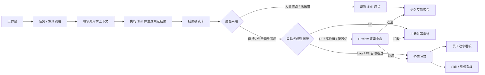
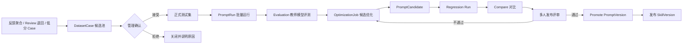
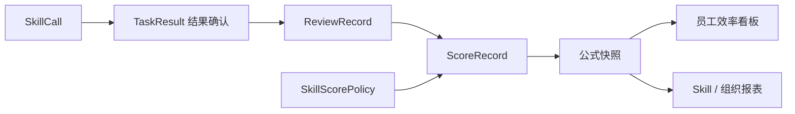
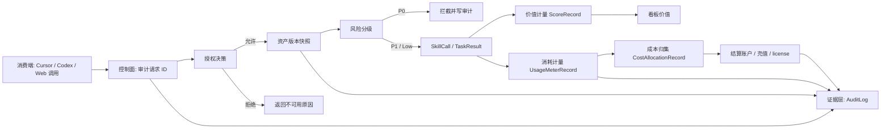

# AI 协作效率平台 - 页面级原型图

- 文档状态: 产品方案 Ready / 一期开发范围待确认 / 上线前业务参数待补齐
- 文档版本: v1.4
- 生成日期: 2026-05-08
- 适用读者: 产品经理、UI/UX、前端、后端、测试、开发 Agent
- HTML 原型: [prototype/html/index.html](/Users/liujun/Desktop/产品经理skill/projects/ai-collaboration-efficiency-platform/prototype/html/index.html)
- 单文件版本: [prototype/html/standalone.html](/Users/liujun/Desktop/产品经理skill/projects/ai-collaboration-efficiency-platform/prototype/html/standalone.html)
- 原始资料图: [prototype/images](/Users/liujun/Desktop/产品经理skill/projects/ai-collaboration-efficiency-platform/prototype/images)
- 核心交付口径: PRD、原型图、开发文档为主；业务思维说明作为单独补充文档保留。
- 配套文档:
  - PRD: [01_product_document.md](/Users/liujun/Desktop/产品经理skill/projects/ai-collaboration-efficiency-platform/01_product_document.md)
  - 开发文档: [02_development_document.md](/Users/liujun/Desktop/产品经理skill/projects/ai-collaboration-efficiency-platform/02_development_document.md)

---

## 0. 原型核心结论

- 原型按五期规划承接。一期只做 Skill 价值计算闭环和 Skill 源码包加密上传；二期再做 Prompt Lab、Skill 字段治理、成本结算和 Skill 并发执行；三期做知识、通知、申诉和跨系统协同；四期做 Skill 消费平台；五期做智能化平台。
- 员工端原型只暴露 Skill 使用、结果确认、Review 提交和痛点反馈，不暴露 Prompt、权重、风险等级、发布和回滚管理入口。
- 所有看板分数必须能下钻到 `SkillCall`、`TaskResult`、`ReviewRecord`、`ScoreRecord` 和公式快照。
- Prompt Lab 页面只面向 `prompt_optimizer`、`skill_admin` 等管理角色，用于 PromptVersion、Dataset、Evaluation、Candidate、Compare 和 SkillVersion 发布。
- 加密授权充值机制按控制面顺序呈现: 审计 -> 授权 -> 版本控制 -> 风险分级 -> 价值计量 -> 成本归集 -> 结算。本阶段加密对象是 Skill 源码 / 能力实现包: 员工和外部调用方只能运行 Skill，不能查看、下载或复制 Prompt 源、Workflow DAG、工具适配代码和执行脚本。
- Skill 并发执行页面属于二期，需要展示 ExecutionPlan、SkillSubCall、Reducer、耗时、失败和计量摘要，但不展示 Skill 源码。
- 静态 HTML 原型用于页面结构和交互说明；最终开发以本文页面状态、权限、接口依赖和开发文档接口契约为准。

## 1. 原型原则

页面原型图负责解释每个页面怎么布局、展示什么、用户点什么、状态怎么变；流程和状态说明作为本文内的辅助说明，不再拆成独立文档。

页面原型需要满足:

- 一个页面只承载一个核心任务。
- 主操作必须明确，例如“提交 Review”“通过评审”“发布 Skill”。
- 页面只展示必要数据，不在同一屏堆满所有规则。
- 风险、权限、证据链、评分说明必须可见，但不喧宾夺主。
- 复杂规则放到详情抽屉、弹窗或二级页，不塞进主画布。
- 页面必须标注所属期、使用角色、数据依赖、关键状态和不可执行条件。
- Skill 看板字段必须按账号权限展示: 员工看可调用说明，评审人看授权 Review 证据，主管 / HR 看聚合，Skill 管理员看授权配置，源码、底层 API 和代码段不进入普通看板。
- 开发 Agent 不得根据线框图自行新增接口字段，页面数据以开发文档 API 契约为准。

## 2. 页面清单

### 2.1 一期页面: Skill 价值计算闭环

| 页面 | 目标 | 主操作 | 使用角色 | 关键接口 |
|---|---|---|---|---|
| 工作台总览 | 进入系统后快速处理任务和待办 | 新建任务、进入 Review、查看看板 | 员工、评审人、主管 | `GET /api/me`、`GET /api/dashboard/personal` |
| 任务 / Skill 调用 | 创建任务并选择合适 Skill | 提交上下文、开始处理 | 员工 | `POST /api/tasks`、`PATCH /api/tasks/{id}/context`、`POST /api/tasks/{id}/run` |
| 任务结果与确认 | 查看输出并确认是否产生价值 | 确认采用、提交 Review、反馈痛点 | 员工 | `PATCH /api/task-results/{id}/confirmation`、`POST /api/skills/{id}/feedback` |
| Review 评审中心 | 集中处理待审任务 | 通过、退回、拦截、复审 | Review 评审人 | `GET /api/reviews`、`POST /api/reviews/{id}/decision` |
| 员工效率看板 | 查看个人和团队 AI 协作贡献 | 查看证据链、查看公式解释 | 员工、主管、HR | `GET /api/dashboard/personal`、`GET /api/score-records/{id}/explanation` |
| Skill 管理 | 查看 Skill、反馈聚合和价值表现 | 查看反馈、调整管理配置 | Skill 管理员 | `GET /api/skills`、`GET /api/admin/skill-feedback` |
| 权重计算 | 解释贡献分、Skill 权重和封顶口径 | 查看公式、分数拆解、权重来源 | 员工、主管、HR、Skill 管理员 | `GET /api/score-formulas/current` |
| 授权与计量控制台 | 查看授权、调用计量和不可用原因 | 创建授权、查看调用证据 | Skill 管理员、结算管理员、系统管理员 | `GET /api/authorization/effective`、`GET /api/metering/skill-calls/{id}` |
| 报表中心 | 导出一期基础 Excel 报表 | 创建导出、查看状态、下载授权文件 | 员工、主管、HR、Skill 管理员 | `POST /api/reports/export`、`GET /api/reports/exports/{id}` |
| 管理后台 | 配置组织、权限、风控和审计 | 修改规则、查看日志 | 系统管理员 | `GET /api/admin/audit-logs` |

### 2.2 二期页面: Prompt Lab 优化闭环

| 页面 | 目标 | 主操作 | 使用角色 | 关键接口 |
|---|---|---|---|---|
| Prompt 管理 | 管理 Prompt 和版本 | 创建版本、查看 Diff、关联 Skill | Prompt 优化人员、Skill 管理员 | `GET /api/prompts`、`POST /api/prompts/{id}/versions` |
| 测试集管理 | 管理 Dataset 和 Case | 反馈转 Case、导入 JSON、确认 Case | Prompt 优化人员、Skill 管理员 | `POST /api/admin/skill-feedback/{id}/convert-dataset-case`、`POST /api/datasets/{id}/cases` |
| 批量运行 | 用同一测试集运行 PromptVersion | 创建 Run、查看日志、失败重试 | Prompt 优化人员 | `POST /api/prompt-runs` |
| 教师模型评测 | 对 Run 结果评分和归因 | 创建 Evaluation、查看失败原因 | Prompt 优化人员 | `POST /api/prompt-evaluations` |
| 候选优化 | 基于失败 Case 生成候选 Prompt | 创建优化任务、生成 Candidate | Prompt 优化人员 | `POST /api/prompt-optimization-jobs` |
| Compare 对比 | 判断候选版本是否优于现网版本 | 查看改好/改坏 Case、提交评审 | Prompt 优化人员、Skill 管理员 | `POST /api/prompt-compares` |
| 发布评审 | 控制 PromptCandidate 和 SkillVersion 上线 | 多人评审、发布、回滚 | 评审人、Skill 管理员 | `POST /api/prompt-candidates/{id}/promote`、`POST /api/skill-versions/{id}/release` |
| 成本归集与结算 | 将计量消耗归集到成本中心并处理充值 / license | 归集成本、充值、发放 license、冻结账期 | 结算管理员、系统管理员 | `GET /api/admin/cost-allocations`、`POST /api/admin/settlement/accounts/{id}/recharge`、`POST /api/admin/license-entitlements` |
| Skill 并发执行详情 | 查看并发任务进度和子任务状态 | 查看子任务、Reducer、失败原因 | 员工、主管、Skill 管理员 | `GET /api/skill-calls/{id}/execution-plan` |

### 2.3 三期增强页面

| 页面 | 目标 | 主操作 | 使用角色 |
|---|---|---|---|
| 知识沉淀 | 把优秀结果转成组织资产 | 发布知识、推荐复用 | 评审人、主管、HR |
| 通知与申诉 | 处理 Review 超时、分数争议和反馈闭环 | 发起申诉、处理通知 | 员工、主管、HR |

## 3. 页面流程与状态

### 3.1 一期主链路



### 3.2 二期 Prompt Lab 优化链路



### 3.3 贡献计算页面关系



### 3.4 加密授权充值控制面关系



## 4. 页面线框图

### 4.1 一期: 工作台总览

```text
┌──────────────────────────────────────────────────────────────────────────────┐
│ AI 协作效率平台   工作台 | 任务 | Review | 看板 | Skill | 报表 | 后台       │
├──────────────────────────────────────────────────────────────────────────────┤
│ 今日摘要：我的任务 12 | 待 Review 3 | 节省工时 4.5h | 风险提醒 1            │
├──────────────────────────────┬───────────────────────────────────────────────┤
│ 待办任务                      │ 常用 Skill                                    │
│ - 客户会议纪要总结 待 Review   │ - 周报生成        成功率 96%                  │
│ - 竞品资料提炼    进行中       │ - 客户画像分析    通过率 88%                  │
│ - SOP 优化建议    已通过       │ - 合同风险初筛    P1 强制 Review              │
├──────────────────────────────┼───────────────────────────────────────────────┤
│ 风险提醒                      │ 常用报表                                      │
│ - 1 条 P1 内容等待评审         │ - 个人贡献月报                                │
│ - 2 个 Skill 近期失败率升高    │ - Skill 价值报表                              │
└──────────────────────────────┴───────────────────────────────────────────────┘
```

核心要求:

- 工作台只做入口，不承载完整流程讲解。
- 指标卡可点击进入明细。
- HR 和主管默认只看汇总，不展示敏感输入全文。
- 一期只展示 Skill 调用、Review、贡献分、反馈待办和 Excel 报表入口；Prompt Lab、知识推荐、通知、申诉待办二期或三期再展示。

数据依赖:

- `GET /api/me`
- `GET /api/dashboard/personal`
- `GET /api/analytics/skills`

### 4.2 一期: 任务 / Skill 调用页

```text
┌──────────────────────────────────────────────────────────────────────────────┐
│ 新建任务                                                                      │
├──────────────────────┬───────────────────────────────────────────────────────┤
│ 调用前上下文         │ Skill 推荐                                             │
│ 任务类型 *           │ 1. 智能分析报告生成 v2.3    推荐                      │
│ 业务场景 *           │    适合: 数据分析报告 / P1 Review                     │
│ 业务对象 *           │ 2. 会议纪要总结 v1.8                                  │
│ 期望产出 *           │ 3. 通用助手                                           │
│ 任务复杂度 *         │                                                       │
│ 输入材料 *           │                                                       │
├──────────────────────┴───────────────────────────────────────────────────────┤
│ 输入检查：权限通过 | 源码运行时保护 | 执行模式 single | 当前结果将进入 P1 Review   │
│ [保存草稿] [开始处理]                                                         │
└──────────────────────────────────────────────────────────────────────────────┘
```

核心要求:

- Skill 选择和输入检查必须在执行前完成。
- 员工只能看到 Skill 是否可调用和执行模式摘要，不能看到 Prompt 源、Workflow DAG、工具适配代码或执行脚本。
- 一期固定展示 `single` 执行模式；二期如 SkillVersion 支持并发，页面才显示 `auto / single / parallel` 摘要，但不允许员工手工提高并发数。
- 结果进入 Review 的原因需要展示。
- 失败时展示失败原因、可重试动作和替代 Skill。
- 必填项未完成时，“开始处理”置灰，并提示缺失字段。
- 员工自填预计人工耗时只作为校准字段，不在页面上承诺直接计分。

关键状态:

| 状态 | 页面表现 | 可操作 |
|---|---|---|
| `draft` | 可编辑上下文 | 保存草稿、开始处理 |
| `running` | 展示执行中和日志摘要 | 不允许重复提交 |
| `failed` | 展示失败原因 | 重试、更换 Skill |
| `blocked` | 展示 P0 拦截原因 | 查看审计摘要 |

数据依赖:

- `POST /api/tasks`
- `PATCH /api/tasks/{id}/context`
- `POST /api/tasks/{id}/run`

### 4.3 一期: 任务结果与确认页

```text
┌──────────────────────────────────────────────────────────────────────────────┐
│ 任务结果：生成月度经营分析报告                                                │
├──────────────────────┬───────────────────────────────────────────────────────┤
│ 证据链               │ 候选结果                                                │
│ 任务 ID              │ 结论摘要                                                │
│ 使用 Skill / 版本    │ 关键数据点                                              │
│ 模型 / Prompt 版本   │ 风险提示                                                │
│ 实际耗时 / 节省工时  │ 来源附件                                                │
├──────────────────────┴───────────────────────────────────────────────────────┤
│ 结果确认：直接采用 / 少量修改 / 大量修改 / 仅参考 / 未采用                    │
│ 人工修改耗时：__ 分钟 | 是否返工：是/否 | 是否进入业务流程：是/否                │
│ [确认结果] [提交 Review 多人评审] [反馈 Skill 痛点] [重新生成]                │
└──────────────────────────────────────────────────────────────────────────────┘
```

核心要求:

- 候选结果不直接计分。
- 提交 Review 或进入计分前必须完成结果确认。
- 对外发布、高风险和低置信结果必须进入 Review。
- 员工反馈 Skill 痛点只进入反馈队列，不暴露 Skill 管理、权重、上架、下线和回滚能力。
- `大量修改` 和 `未采用` 必须引导填写问题类型或反馈原因。

结果确认状态:

| 选择 | 页面后续动作 | 计分含义 |
|---|---|---|
| 直接采用 | 可提交 Review 或直接低风险计分 | 采纳系数 1.00 |
| 少量修改 | 要求填写修改耗时 | 采纳系数 0.85 |
| 大量修改 | 弹出痛点反馈 | 采纳系数 0.45 |
| 仅参考 | 要求说明用途 | 采纳系数 0.25 |
| 未采用 | 弹出问题原因 | 不计贡献 |

数据依赖:

- `GET /api/skill-calls/{id}`
- `PATCH /api/task-results/{id}/confirmation`
- `POST /api/skill-calls/{id}/calculate`

#### 4.3.1 Skill 反馈弹窗

```text
┌──────────────────────────────────────────────────────────────────────────────┐
│ 反馈 Skill 使用痛点                                                           │
├──────────────────────────────────────────────────────────────────────────────┤
│ Skill：智能分析报告生成 v2.3                                                  │
│ 关联任务：生成月度经营分析报告                                                │
│ 反馈类型：输出不准确 / 缺字段 / 格式不符 / 不可直接使用 / 无明显节省 / 新场景 │
│ 严重程度：低 / 中 / 高                                                        │
│ 说明：                                                                       │
│ [请描述你遇到的问题、期望结果、可复现条件]                                    │
│ 可选附件：截图 / 结果文件                                                     │
├──────────────────────────────────────────────────────────────────────────────┤
│ [取消] [提交反馈]                                                             │
└──────────────────────────────────────────────────────────────────────────────┘
```

核心要求:

- 反馈必须关联 Skill、版本和任务。
- 员工只能查看自己提交的反馈状态。
- 反馈不直接改变 Skill 配置，也不直接影响贡献分。
- 同一任务同一结果的重复反馈需要提示“已提交过类似反馈”。

数据依赖:

- `POST /api/skills/{id}/feedback`
- `GET /api/skills/{id}/feedback/mine`

### 4.4 一期: Review 评审中心

```text
┌──────────────────────────────────────────────────────────────────────────────┐
│ Review 评审中心                                                               │
├──────────────────────────────────────────────────────────────────────────────┤
│ 筛选：部门 | Skill | 风险等级 | 提交人 | 状态 | 超时                         │
├──────────────┬──────────────┬──────────────┬──────────────┬───────────────┤
│ 任务         │ 提交人       │ 风险等级     │ SLA          │ 操作          │
├──────────────┼──────────────┼──────────────┼──────────────┼───────────────┤
│ 经营分析报告 │ 张三         │ P1           │ 18h          │ 查看          │
│ 合同风险初筛 │ 李四         │ P0           │ 已拦截       │ 查看审计      │
└──────────────┴──────────────┴──────────────┴──────────────┴───────────────┘
```

评审详情区域:

```text
┌──────────────────────────────────────────────────────────────────────────────┐
│ 评审详情                                                                      │
├──────────────────────┬───────────────────────────────────────────────────────┤
│ 任务与证据链         │ 评分表                                                  │
│ 输入摘要             │ 完整性 40%                                              │
│ 输出摘要             │ 准确性 25%                                              │
│ Skill / 版本         │ 效率提升 20%                                            │
│ 风险命中             │ 业务价值 10%                                            │
│ 历史评审             │ 合规安全 5%                                             │
├──────────────────────┴───────────────────────────────────────────────────────┤
│ 评审意见：必填                                                                 │
│ [通过] [退回] [拦截] [发起复审]                                                │
└──────────────────────────────────────────────────────────────────────────────┘
```

核心要求:

- P0 不提供“通过”主操作。
- 退回和拦截必须填写原因。
- 多人评审展示评审进度和通过阈值。
- 评审人不能评审自己提交的高风险任务。
- 分差超过阈值时进入复审，不展示“进入计分”的成功状态。

数据依赖:

- `GET /api/reviews`
- `GET /api/reviews/{id}`
- `POST /api/reviews/{id}/decision`

### 4.5 一期: 员工效率看板

```text
┌──────────────────────────────────────────────────────────────────────────────┐
│ 员工效率看板                                                                  │
├──────────────────────────────────────────────────────────────────────────────┤
│ 指标卡：节省工时 | 贡献分 | Review 通过率 | 有效调用 | 风险命中               │
├──────────────────────────────┬───────────────────────────────────────────────┤
│ 能力雷达                      │ 贡献趋势                                      │
│ 任务完成效率                  │ 周 / 月贡献分、节省工时、通过率                │
│ Skill 使用效率                │                                               │
│ 产出质量                      │                                               │
├──────────────────────────────┴───────────────────────────────────────────────┤
│ 证据链明细：任务、Skill、Review、公式快照、计量证据                           │
│ 说明：数据用于效率分析和培训建议，不直接作为绩效结论。                        │
└──────────────────────────────────────────────────────────────────────────────┘
```

核心要求:

- 所有分数能下钻到证据链。
- 员工能查看自己的分数解释；申诉入口不进入一期。
- HR 默认只看汇总趋势和分布。
- 看板必须区分原始节省工时、确认节省工时、贡献分、Review 质量分。
- `pending` 和 `rejected` 分数不进入确认指标，只进入过程统计。

数据依赖:

- `GET /api/dashboard/personal`
- `GET /api/score-records/{id}/explanation`
- `GET /api/analytics/users`

### 4.6 一期: Skill 管理

```text
┌──────────────────────────────────────────────────────────────────────────────┐
│ Skill 管理                                                                    │
├──────────────────────────────────────────────────────────────────────────────┤
│ 筛选：部门 | 风险等级 | 状态 | 负责人 | 版本                                  │
├──────────────┬──────────────┬──────────────┬──────────────┬───────────────┤
│ Skill        │ 风险等级     │ 通过率       │ 复用率       │ 状态          │
├──────────────┼──────────────┼──────────────┼──────────────┼───────────────┤
│ 分析报告生成 │ P1           │ 86%          │ 28%          │ 已上架        │
│ 合同风险初筛 │ P0           │ 需强审       │ 12%          │ 测试中        │
└──────────────┴──────────────┴──────────────┴──────────────┴───────────────┘
```

Skill 详情区域:

```text
┌──────────────────────────────────────────────────────────────────────────────┐
│ Skill 详情                                                                    │
├──────────────────────┬───────────────────────────────────────────────────────┤
│ 基本信息             │ 计分与规则                                              │
│ 名称 / 负责人        │ Skill 权重                                              │
│ 输入要求             │ 业务板块权重                                            │
│ 输出格式             │ 任务复杂度系数                                          │
│ 版本记录             │ Review 规则                                             │
├──────────────────────┴───────────────────────────────────────────────────────┤
│ [查看调用] [查看反馈] [查看计分规则]                                           │
└──────────────────────────────────────────────────────────────────────────────┘
```

核心要求:

- 一期 Skill 管理只展示 released 版本和配置，不做 SkillVersion 发布门禁。
- 权重调整和高风险配置写入审计。
- Skill 管理页展示员工反馈聚合，不展示员工敏感输入全文。
- 一期管理人员只能查看和处理反馈状态，不创建 Prompt Lab、DatasetCase 或 Skill 优化任务；二期再进入优化闭环。

数据依赖:

- `GET /api/skills`
- `GET /api/skills/{id}`
- `GET /api/admin/skill-feedback`

#### 4.6.1 Skill 反馈聚合区

```text
┌──────────────────────────────────────────────────────────────────────────────┐
│ Skill 反馈聚合                                                                │
├──────────────────────────────┬───────────────────────────────────────────────┤
│ 痛点分布                      │ Top 反馈任务                                  │
│ 输出不准确 38%                │ 月度经营分析报告  18 条                       │
│ 缺字段 21%                    │ 客户复盘分析      12 条                       │
│ 格式不符 16%                  │ 销售周报          9 条                        │
│ 参数复杂 11%                  │                                               │
├──────────────────────────────┴───────────────────────────────────────────────┤
│ 明细：反馈类型 | Skill 版本 | 关联任务类型 | 严重程度 | 状态 | 操作          │
│ 输出不准确 | v2.3 | 经营分析 | 高 | 分析中 | [更新状态]                      │
│ 缺字段     | v2.3 | 客户复盘 | 中 | 已纳入 | [查看]                          │
└──────────────────────────────────────────────────────────────────────────────┘
```

核心要求:

- 员工反馈以聚合方式进入管理视角。
- 管理端结合 Review 退回率、执行失败率、风险命中率和节省工时变化判断优化优先级。
- 一期只能查看聚合和更新反馈处理状态。
- 二期才能把反馈转 DatasetCase、创建优化任务并进入 Prompt Lab。

### 4.7 一期: 权重计算说明页

```text
┌──────────────────────────────────────────────────────────────────────────────┐
│ 权重计算说明                                                                  │
├──────────────────────────────┬───────────────────────────────────────────────┤
│ 单次调用价值                  │ 公式快照                                      │
│ 基准人工工时 480 分钟         │ formula_version: score_v1_2026_05             │
│ 使用后人工工时 52 分钟        │ adoption_factor: 0.85                         │
│ 原始节省工时 7.13h            │ quality_factor: 0.90                          │
│ 确认节省工时 5.45h            │ skill_weight: 1.15                             │
│ 贡献分 62.7                   │ cap_applied: false                            │
├──────────────────────────────┴───────────────────────────────────────────────┤
│ [查看来源任务] [查看 Review] [查看 Skill 规则] [查看审计]                    │
└──────────────────────────────────────────────────────────────────────────────┘
```

核心要求:

- 页面必须解释每个值从哪里来，不只展示最终分。
- 当分数为 0、被封顶、被复核或被调整时，必须展示原因。
- 员工看到自己的解释；主管和 HR 按权限看到汇总解释。

数据依赖:

- `GET /api/score-records/{id}/explanation`
- `GET /api/score-formulas/current`

### 4.8 二期: Prompt 管理页

```text
┌──────────────────────────────────────────────────────────────────────────────┐
│ Prompt 管理                                                                   │
├──────────────────────────────────────────────────────────────────────────────┤
│ 筛选：任务类型 | 业务场景 | 关联 Skill | 状态 | 标签                         │
├──────────────┬──────────────┬──────────────┬──────────────┬───────────────┤
│ Prompt       │ 当前版本     │ 关联 Skill   │ 最近评分     │ 操作          │
├──────────────┼──────────────┼──────────────┼──────────────┼───────────────┤
│ 分析报告生成 │ v2.3         │ 分析报告 Skill│ 82.1         │ 查看版本      │
└──────────────┴──────────────┴──────────────┴──────────────┴───────────────┘
```

版本详情:

```text
┌──────────────────────────────────────────────────────────────────────────────┐
│ PromptVersion v2.3                                                            │
├──────────────────────┬───────────────────────────────────────────────────────┤
│ 结构化模块           │ 版本与关联                                              │
│ 角色设定             │ 关联 SkillVersion                                      │
│ 输入说明             │ 关联测试集                                             │
│ 输出格式             │ 最近 Run / Evaluation                                  │
│ 约束规则             │ Diff / 变更说明                                        │
├──────────────────────┴───────────────────────────────────────────────────────┤
│ [保存新版本] [加入测试集回归] [创建优化任务]                                  │
└──────────────────────────────────────────────────────────────────────────────┘
```

核心要求:

- 普通员工不可访问 Prompt 管理。
- PromptVersion 是底层资产，不能直接对员工发布。
- 保存新版本后默认不进入生产，必须经过测试和发布门禁。

数据依赖:

- `GET /api/prompts`
- `POST /api/prompts`
- `POST /api/prompts/{id}/versions`

### 4.9 二期: 测试集管理页

```text
┌──────────────────────────────────────────────────────────────────────────────┐
│ 测试集管理                                                                    │
├──────────────────────────────┬───────────────────────────────────────────────┤
│ Dataset 列表                  │ DatasetCase 候选池                            │
│ 财务分析回归集 v1             │ 来源：反馈 / Review 退回 / 低分 / 手工导入      │
│ 合同风险回归集 v1             │ 状态：candidate / accepted / rejected          │
├──────────────────────────────┴───────────────────────────────────────────────┤
│ Case 明细：输入摘要 | 期望输出 | 风险等级 | 来源 | 状态 | 操作              │
│ 月报格式错误 | 必须包含三段式报告 | P1 | feedback | candidate | [接受] [拒绝] │
└──────────────────────────────────────────────────────────────────────────────┘
```

核心要求:

- 反馈转 Case 先进入候选池，不自动进入正式测试集。
- 管理角色必须确认 Case 质量，防止脏样本污染回归基线。
- 每个 Case 展示来源对象和版本。

数据依赖:

- `POST /api/admin/skill-feedback/{id}/convert-dataset-case`
- `POST /api/datasets/{id}/cases`

### 4.10 二期: 批量运行与评测页

```text
┌──────────────────────────────────────────────────────────────────────────────┐
│ PromptRun / Evaluation                                                        │
├──────────────────────┬───────────────────────────────────────────────────────┤
│ Run Builder          │ Evaluation                                             │
│ PromptVersion        │ 教师模型                                               │
│ Dataset              │ 总分 / 通过率                                          │
│ Answer Model         │ 失败原因                                               │
│ 并发 / 超时 / 重试   │ Case 级评分                                            │
├──────────────────────┴───────────────────────────────────────────────────────┤
│ [创建 Run] [失败重试] [创建 Evaluation] [导出评测报告]                       │
└──────────────────────────────────────────────────────────────────────────────┘
```

核心要求:

- Run 必须绑定 PromptVersion、Dataset、ModelProfile。
- Evaluation 必须基于已成功的 Run。
- 失败 Case 可一键加入优化任务。

数据依赖:

- `POST /api/prompt-runs`
- `POST /api/prompt-evaluations`

### 4.11 二期: 候选优化与 Compare 页

```text
┌──────────────────────────────────────────────────────────────────────────────┐
│ 候选优化与 Compare                                                            │
├──────────────────────┬───────────────────────────────────────────────────────┤
│ OptimizationJob      │ Compare                                                │
│ 基础 PromptVersion   │ 基准分 82.1                                            │
│ 失败 Case            │ 候选分 86.4                                            │
│ 允许修改模块         │ 改好 Case 9                                            │
│ 候选 Prompt 列表     │ 改坏 Case 2                                            │
├──────────────────────┴───────────────────────────────────────────────────────┤
│ [生成候选] [回归测试] [查看改坏 Case] [提交多人评审]                          │
└──────────────────────────────────────────────────────────────────────────────┘
```

核心要求:

- Compare 只给建议，不自动发布。
- 存在改坏 Case 时，必须展示明细并要求评审人确认。
- 候选 Prompt 未通过多人评审，不能成为正式 PromptVersion。

数据依赖:

- `POST /api/prompt-optimization-jobs`
- `POST /api/prompt-compares`
- `POST /api/prompt-candidates/{id}/submit-review`

### 4.12 二期: 发布评审与 SkillVersion 页

```text
┌──────────────────────────────────────────────────────────────────────────────┐
│ SkillVersion 发布评审                                                          │
├──────────────────────┬───────────────────────────────────────────────────────┤
│ 候选版本             │ 发布门禁                                                │
│ SkillVersion v2.4    │ PromptVersion v2.4                                     │
│ 绑定模型             │ Dataset 基线                                           │
│ 输入输出 Schema      │ Compare 结果                                           │
│ 计分策略             │ Review 2/3 通过                                        │
├──────────────────────┴───────────────────────────────────────────────────────┤
│ [通过发布] [退回优化] [回滚上一版]                                             │
└──────────────────────────────────────────────────────────────────────────────┘
```

核心要求:

- SkillVersion 发布必须绑定 PromptVersion、模型配置、测试集基线和计分策略。
- 同一 Skill 同一时间只能有一个 released 版本。
- 发布、退回、回滚必须写审计日志。

数据依赖:

- `POST /api/prompt-candidates/{id}/promote`
- `POST /api/skills/{id}/versions`
- `POST /api/skill-versions/{id}/release`
- `POST /api/skill-versions/{id}/rollback`

### 4.13 一期: 报表中心

```text
┌──────────────────────────────────────────────────────────────────────────────┐
│ 报表中心                                                                      │
├──────────────────────────────┬───────────────────────────────────────────────┤
│ 可导出报表                    │ 导出记录                                       │
│ 个人贡献月报                  │ queued / running / succeeded / failed          │
│ Skill 价值报表                │ 导出人 / 时间 / 范围 / 文件                    │
│ 组织基础报表                  │                                               │
│ Review 汇总报表               │                                               │
├──────────────────────────────┴───────────────────────────────────────────────┤
│ [导出 Excel] [查看状态] [下载文件]                                             │
└──────────────────────────────────────────────────────────────────────────────┘
```

核心要求:

- 一期只支持 Excel，不支持 PDF。
- 报表导出必须显示统计口径并写入审计。
- 报表数据必须按操作者权限过滤，不导出源码、密钥、成本单价或未授权敏感输入全文。

三期再做完整知识沉淀页面，包括 Prompt、SOP、Case、失败模式、复用次数和推荐。

### 4.14 一期: 管理后台

```text
┌──────────────────────────────────────────────────────────────────────────────┐
│ 管理后台                                                                      │
├──────────────────────────────────────────────────────────────────────────────┤
│ 模块：账号导入 | 角色权限 | 授权计量 | 风控规则 | 审计日志                │
├──────────────────────┬───────────────────────────────────────────────────────┤
│ 配置区               │ 日志区                                                  │
│ 角色与数据范围       │ 操作人、时间、对象、动作、前后变化、原因                │
│ P0/P1/P2 规则        │ 越权拦截、报表导出、Skill 上下线、评分调整              │
│ 授权 Grant           │ 源码包上传、运行时解密、报表导出、密钥轮换               │
│ 强制 Review 场景     │                                                       │
├──────────────────────┴───────────────────────────────────────────────────────┤
│ [保存配置] [二次确认] [导出审计]                                              │
└──────────────────────────────────────────────────────────────────────────────┘
```

核心要求:

- 高风险配置需要二次确认。
- 审计日志不可由普通管理员删除。
- 权限变更立即生效并留痕。

### 4.15 一期基础 / 二期增强: 授权与计量控制台

```text
┌──────────────────────────────────────────────────────────────────────────────┐
│ 授权与计量控制台                                                              │
├──────────────────────────────────────────────────────────────────────────────┤
│ 一期控制顺序：审计 → 授权 → 版本 → 风险 → 价值计量 → 基础计量证据             │
├──────────────────────┬───────────────────────────────────────────────────────┤
│ 消费端                │ 控制面                                                │
│ Cursor / Codex / Web  │ 授权 Grant | 调用审计 | 计量证据 | 不可用原因         │
│ 当前用户：张三         │ 查询：用户 / 部门 / Skill / 时间                       │
├──────────────────────┼───────────────────────────────────────────────────────┤
│ 资产层                │ 证据层                                                │
│ Skill v2.3            │ SkillCall call_001                                    │
│ SourcePackage SPKG-1  │ AuthorizationSnapshot 允许                            │
│ Manifest 摘要         │ UsageMeterRecord 1 条                                 │
│                       │ AuditLog 4 条                                         │
├──────────────────────┴───────────────────────────────────────────────────────┤
│ 操作：[创建授权] [暂停授权] [查看计量证据] [导出审计]                         │
└──────────────────────────────────────────────────────────────────────────────┘
```

核心要求:

- 页面首屏必须让管理者看到四层结构: 消费端、控制面、资产层、证据层。
- 授权查询展示 `allowed / denied`、命中的 Grant、有效期、风险约束和不可用原因。
- 计量证据展示 UsageMeterRecord，不在一期展示完整成本单价。
- 创建授权只能由 `skill_admin`、`system_admin` 操作；员工没有入口。`settlement_admin` 属于二期。
- 不可用原因必须可读: 未授权、风险等级超出授权、Skill 暂停、密钥不可用。license 过期和额度不足属于二期。

关键状态:

| 状态 | 页面表现 | 主操作 |
|---|---|---|
| `allowed` | 绿色状态，展示有效期和授权范围 | 查看证据 |
| `denied` | 红色状态，展示原因和申请入口 | 创建授权 / 申请续期 |
| `secret_unavailable` | 红色状态，禁止调用 | 查看密钥审计 |

数据依赖:

- `GET /api/authorization/effective`
- `GET /api/metering/skill-calls/{id}`
- `GET /api/admin/audit-logs`

### 4.16 二期: 成本归集、充值与 License

```text
┌──────────────────────────────────────────────────────────────────────────────┐
│ 成本归集与结算                                                                │
├──────────────────────────────────────────────────────────────────────────────┤
│ 账期：2026-05 | 成本中心：财务部 | 状态：待冻结 | 余额：¥10,000             │
├──────────────────────┬──────────────────────┬───────────────────────────────┤
│ 成本归集              │ 结算账户              │ License                        │
│ 模型 token ¥320       │ 账户状态 active        │ 财务部 Skill 套餐 active        │
│ 工具调用 ¥86          │ 本月扣减 ¥406          │ 月调用上限 1000                 │
│ Review 人工 ¥120      │ 可用余额 ¥9,594        │ 已用 312                        │
│ 未归集 2 条           │ [充值] [冻结账期]      │ [发放] [暂停] [撤销]            │
├──────────────────────┴──────────────────────┴───────────────────────────────┤
│ 证据链：CostAllocationRecord → RechargeTransaction / LicenseEntitlement → 审计 │
└──────────────────────────────────────────────────────────────────────────────┘
```

核心要求:

- 充值 / license 页面必须排在成本归集之后，不能让用户先填充值再反推消耗。
- 没有 UsageMeterRecord 的消耗显示为“待计量”，不能进入成本归集。
- 没有 CostAllocationRecord 的消耗显示为“待归集”，不能扣减余额。
- 充值按钮打开审批弹窗，字段包含交易类型、金额、来源、外部引用、原因、审批备注。
- License 发放弹窗包含主体、资产范围、配额、有效期、原因；明文 license key 不展示。
- 冻结账期后，页面只允许追加调整记录，不允许覆盖原始成本。

数据依赖:

- `GET /api/admin/cost-allocations`
- `GET /api/admin/settlement/accounts`
- `POST /api/admin/settlement/accounts/{id}/recharge`
- `POST /api/admin/settlement/accounts/{id}/freeze`
- `GET /api/admin/license-entitlements`
- `POST /api/admin/license-entitlements`

### 4.17 二期增强: Skill 并发执行详情

```text
┌──────────────────────────────────────────────────────────────────────────────┐
│ Skill 并发执行详情                                                            │
├──────────────────────────────────────────────────────────────────────────────┤
│ SkillCall call_001 | Skill v2.3 | 模式 parallel | 子任务 6 | Reducer pending │
├──────────────────────┬───────────────────────────────────────────────────────┤
│ 执行计划              │ 子任务列表                                             │
│ max_parallelism 6     │ doc_001_extract  succeeded  22s  tokens 9.5k          │
│ timeout 180s          │ doc_002_extract  running    --   --                  │
│ failure best_effort   │ doc_003_extract  failed     18s  OCR_TIMEOUT         │
│ budget ¥20            │ doc_004_extract  queued     --   --                  │
├──────────────────────┴───────────────────────────────────────────────────────┤
│ Reducer：structured_merge | 缺失范围：doc_003 | 风险复检：待执行              │
│ 源码保护：runtime_only，调用方不可查看 / 下载 / 复制 Skill 源码包             │
│ [查看最终结果] [查看计量摘要] [重试失败子任务] [提交 Review]                  │
└──────────────────────────────────────────────────────────────────────────────┘
```

核心要求:

- 页面展示并发执行状态，不展示 Prompt 源、Workflow DAG、工具适配代码、执行脚本或私有规则。
- 员工只能查看自己的执行摘要；Skill 管理员可查看授权范围内更多错误和计量摘要。
- 子任务状态包括 queued、running、succeeded、failed、skipped、canceled。
- Reducer 失败时，最终结果不可确认计分，必须展示失败原因和可重试范围。
- 并发任务仍要在最终结果处进入风险分级和 Review 门禁。

数据依赖:

- `GET /api/skill-calls/{id}/execution-plan`
- `GET /api/metering/skill-calls/{id}`

## 5. 静态原型浏览页

HTML 原型入口:

- [prototype/html/index.html](/Users/liujun/Desktop/产品经理skill/projects/ai-collaboration-efficiency-platform/prototype/html/index.html)
- [prototype/html/standalone.html](/Users/liujun/Desktop/产品经理skill/projects/ai-collaboration-efficiency-platform/prototype/html/standalone.html)
- [prototype/ai-collaboration-efficiency-html-prototype.zip](/Users/liujun/Desktop/产品经理skill/projects/ai-collaboration-efficiency-platform/prototype/ai-collaboration-efficiency-html-prototype.zip)

该 HTML 原型基于 `/Users/liujun/Downloads/ai_collab_png_wireframes` 重建:

- 左侧为模块导航。
- 中间为当前页面主内容。
- 右侧为证据链、风险、Review 和权限说明。
- 使用静态 HTML / CSS / JS，不依赖外部网络资源。
- `00_page_flow.png` 和 `10_interaction_notes.png` 仅作为理解参考。
- `01_dashboard.png` 到 `09_permissions_risk.png` 重建为可点击页面。
- 因评分是平台核心，新增加 `权重计算引擎` 页面，用于解释候选贡献分、确认贡献分、Skill 权重建议、Review 维度、封顶和反刷分规则。
- 当前静态 HTML 仍是一期基础可点击原型；授权与计量控制台可作为一期增强补页，二期 Prompt Lab、Skill 字段治理、成本归集、充值、license 和 Skill 并发执行页面以二期开发文档为准；四期 Skill 消费平台和五期智能化平台后续单独补原型。

## 6. 原始资料图处理方式

资料包中的 PNG 仍保留为参考资料，但不作为最终页面原型:

| 原始参考图 | 文件 |
|---|---|
| 用户使用流程图 | [01_overview.png](/Users/liujun/Desktop/产品经理skill/projects/ai-collaboration-efficiency-platform/prototype/images/01_overview.png) |
| 主链路交互原型图 | [02_main_flow.png](/Users/liujun/Desktop/产品经理skill/projects/ai-collaboration-efficiency-platform/prototype/images/02_main_flow.png) |
| Review 评审中心页面交互图 | [03_review_page.png](/Users/liujun/Desktop/产品经理skill/projects/ai-collaboration-efficiency-platform/prototype/images/03_review_page.png) |
| 员工效率看板页面交互图 | [04_employee_dashboard.png](/Users/liujun/Desktop/产品经理skill/projects/ai-collaboration-efficiency-platform/prototype/images/04_employee_dashboard.png) |
| Skill 管理与权重配置页面交互图 | [05_skill_management.png](/Users/liujun/Desktop/产品经理skill/projects/ai-collaboration-efficiency-platform/prototype/images/05_skill_management.png) |
| 开发文档 / 系统架构总览图 | [06_knowledge_system.png](/Users/liujun/Desktop/产品经理skill/projects/ai-collaboration-efficiency-platform/prototype/images/06_knowledge_system.png) |

## 7. 原型验收点

- 页面级原型与流程图分离，不再用一张大图承载全部信息。
- 每个页面有明确目标、所属期、主操作、关键状态、权限边界和数据依赖。
- 一期页面只能支持 Skill 调用、结果确认、基础 Review、反馈、价值计算、基础看板、授权计量和 Excel 报表闭环。
- 二期页面才能支持反馈转测试集、PromptRun、Evaluation、候选优化、Compare、多人发布评审和 SkillVersion 发布。
- 员工反馈 Skill 痛点有入口，且与 Skill 管理权限隔离。
- 员工端不展示 Prompt 管理、Skill 权重调整、风险等级修改、发布、回滚等管理入口。
- Skill 管理页一期只有反馈聚合和处理状态，不提供优化任务入口；二期进入 Prompt Lab。
- 看板上的分数和权重有独立计算口径页面，能解释字段来源、公式版本和落库快照。
- 授权与计量页面能解释消费端、控制面、资产层和证据层，不把充值入口暴露给员工。
- 成本归集与结算页面是二期页面，必须先展示计量证据和成本归集，再展示充值、license 和冻结操作。
- Skill 并发执行页面是二期页面，能展示 ExecutionPlan、SkillSubCall、Reducer 和计量摘要，并明确不暴露 Skill 源码。
- 评分非绩效化边界在看板和报表中可见。
- Prompt Lab 的 Compare 不能出现“一键自动发布”，必须进入多人评审门禁。
- 静态原型可直接打开，不依赖外部网络资源。
