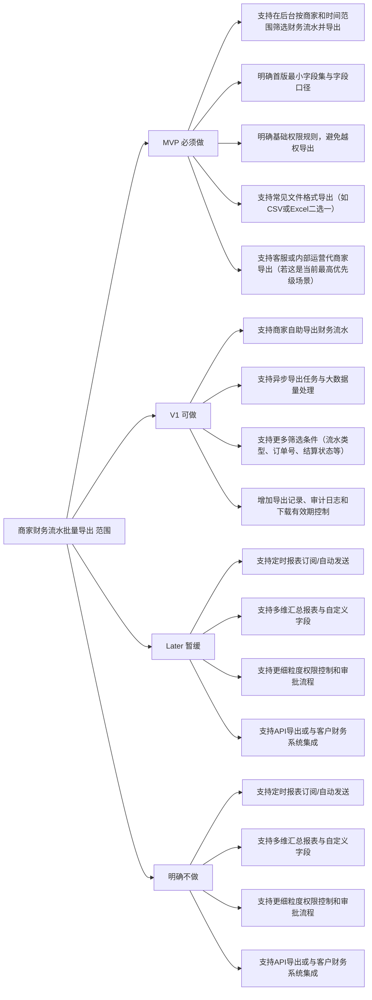
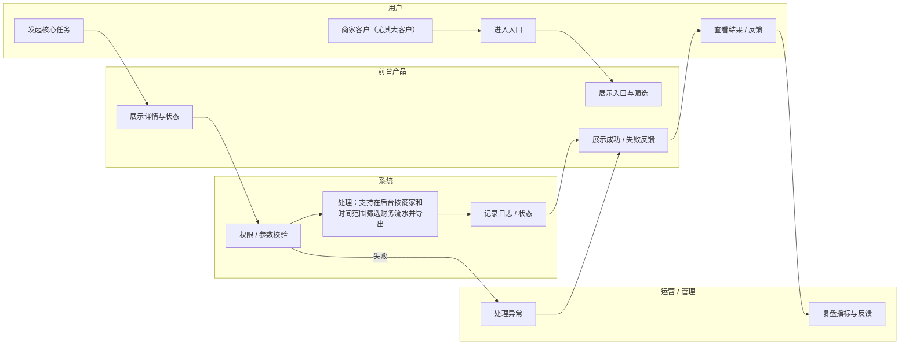
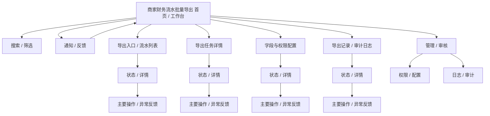
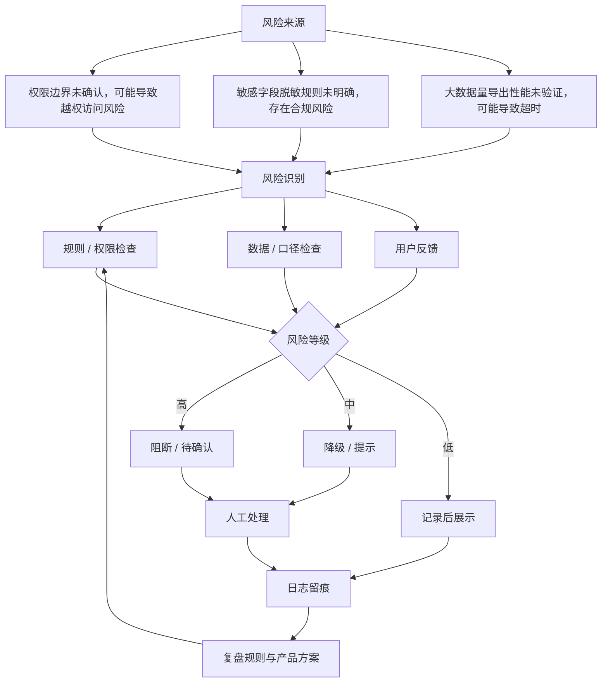

# 商家财务流水批量导出

- 文档状态：draft
- 文档版本：v0.1

## 1. 摘要
围绕“商家财务流水批量导出”构建最小可上线闭环，优先解决当前缺少商家财务流水批量导出能力，导致大客户报表诉求无法高效满足，客服月底被动响应报表需求，对账效率低；同时导出字段范围与权限边界尚未确认。

### 1.1 产品总览思维导图

```mermaid
flowchart TB
  P["商家财务流水批量导出"]
  P --> U["目标用户"]
  P --> S["核心场景"]
  P --> M["MVP 范围"]
  P --> R["风险边界"]
  P --> K["成功指标"]
  U --> U1["商家客户（尤其大客户）"]
  U --> U2["客服"]
  U --> U3["销售"]
  U --> U4["财务/对账相关内部人员"]
  S --> S1["商家在月底或结算周期内需要批量导出财务流水用于对账和内部报表"]
  S --> S2["销售在推进大客户合作时，需要提供财务流水批量导出能力作为交付能力之一"]
  S --> S3["客服响应商家报表诉求时，需要快速提供可下载的财务流水数据"]
  S --> S4["内部财务或运营人员需要基于导出数据辅助排查账务问题"]
  M --> M1["支持在后台按商家和时间范围筛选财务流水并导出"]
  M --> M2["明确首版最小字段集与字段口径"]
  M --> M3["明确基础权限规则，避免越权导出"]
  M --> M4["支持常见文件格式导出（如CSV或Excel二选一）"]
  M --> M5["支持客服或内部运营代商家导出（若这是当前最高优先级场景）"]
  R --> R1["权限边界未确认，可能导致越权访问风险"]
  R --> R2["敏感字段脱敏规则未明确，存在合规风险"]
  R --> R3["大数据量导出性能未验证，可能导致超时"]
  K --> K1["商家财务流水批量导出主流程使用量"]
  K --> K2["商家财务流水批量导出成功率"]
  K --> K3["相关人工支持工单量"]
```

## 2. 背景与问题定义
- 背景：销售反馈大客户提出批量导出财务流水需求；客服在月底频繁收到报表催促；当前商家对账效率较低。
- 问题：当前缺少商家财务流水批量导出能力，导致大客户报表诉求无法高效满足，客服月底被动响应报表需求，对账效率低；同时导出字段范围与权限边界尚未确认。

## 3. 为什么现在做
- 业务目标：提升商家对账效率，降低客服月底人工报表响应压力，满足大客户财务流水导出诉求，支持销售成交与客户维护。
- 紧急度：p1

## 4. 目标用户 / 角色 / JTBD
- 商家客户（尤其大客户）
- 客服
- 销售
- 财务/对账相关内部人员

## 5. 使用场景
- 商家在月底或结算周期内需要批量导出财务流水用于对账和内部报表
- 销售在推进大客户合作时，需要提供财务流水批量导出能力作为交付能力之一
- 客服响应商家报表诉求时，需要快速提供可下载的财务流水数据
- 内部财务或运营人员需要基于导出数据辅助排查账务问题

## 6. 范围定义
### 6.1 In Scope（本期包含）
- 支持在后台按商家和时间范围筛选财务流水并导出
- 明确首版最小字段集与字段口径
- 明确基础权限规则，避免越权导出
- 支持常见文件格式导出（如CSV或Excel二选一）
- 支持客服或内部运营代商家导出（若这是当前最高优先级场景）

### 6.2 Out of Scope（本期不包含）
- 支持定时报表订阅/自动发送
- 支持多维汇总报表与自定义字段
- 支持更细粒度权限控制和审批流程
- 支持API导出或与客户财务系统集成

### 6.3 分阶段规划
#### MVP
- 支持在后台按商家和时间范围筛选财务流水并导出
- 明确首版最小字段集与字段口径
- 明确基础权限规则，避免越权导出
- 支持常见文件格式导出（如CSV或Excel二选一）
- 支持客服或内部运营代商家导出（若这是当前最高优先级场景）

#### V1
- 支持商家自助导出财务流水
- 支持异步导出任务与大数据量处理
- 支持更多筛选条件（流水类型、订单号、结算状态等）
- 增加导出记录、审计日志和下载有效期控制
- 支持字段配置优化与标准报表模板

#### Later
- 支持定时报表订阅/自动发送
- 支持多维汇总报表与自定义字段
- 支持更细粒度权限控制和审批流程
- 支持API导出或与客户财务系统集成

### 6.4 MVP 范围地图

## 7. 方案概述
### 7.1 方案摘要
基于现有后台流程补齐核心入口、权限控制、审计和数据反馈，先上线最小闭环，再视使用情况扩展。

### 7.2 核心业务泳道图

### 7.3 功能流程图
- 产品总流程：用户进入 -> 核心入口 -> 主流程任务 -> 成功/失败反馈 -> 留存或复用。
- 核心业务流程：触发条件 -> 用户动作 -> 系统校验 -> 系统处理 -> 成功状态或异常处理。
- 异常/审核流程：异常触发 -> 权限/数据/合规检查 -> 阻断或进入审核 -> 记录日志 -> 用户可见反馈。

### 7.4 页面信息架构图

### 7.5 页面说明
- 全局工作台：首页承接商家客户（尤其大客户）的主入口，展示搜索/筛选、待处理状态、快捷动作、异常提示和最近记录。
- 导出入口 / 流水列表：说明页面目标、入口来源、核心信息区、主要动作、退出路径、空状态、无权限状态和异常反馈。
- 导出任务详情：说明页面目标、入口来源、核心信息区、主要动作、退出路径、空状态、无权限状态和异常反馈。
- 字段与权限配置：说明页面目标、入口来源、核心信息区、主要动作、退出路径、空状态、无权限状态和异常反馈。
- 导出记录 / 审计日志：说明页面目标、入口来源、核心信息区、主要动作、退出路径、空状态、无权限状态和异常反馈。
- 管理与审计页：面向管理员/审核角色，覆盖配置、审批、日志追踪、撤回或回滚入口。

### 7.6 页面跳转关系
- 主路径：首页/工作台 -> 导出入口 / 流水列表 -> 详情/表单 -> 提交或确认 -> 成功状态 -> 返回列表或进入下一任务。
- 管理路径：管理入口 -> 配置/审核列表 -> 详情处理 -> 通过/拒绝/退回 -> 审计日志留痕。
- 异常路径：入口无权限、参数错误、空结果、系统失败时，页面必须给出原因、下一步动作和可追踪状态。
- 反馈路径：用户完成主流程后进入通知/反馈入口，系统沉淀问题、指标和后续优化线索。

### 7.7 原型图层
- 当前边界：PRD 阶段必须给出页面级低保真原型图或页面原型说明；本阶段不输出 PNG，不输出 HTML，不输出高保真 UI，除非用户确认进入原型/UI 阶段。
- 全局布局：商家财务流水批量导出默认由主入口、核心任务区、状态反馈区、异常提示区和管理/审核入口组成，必须和页面说明、页面跳转关系保持一致。
- 页面级低保真原型 - 导出入口 / 流水列表：标明入口来源、核心信息区、主要动作、成功/失败状态、权限提示、异常反馈和返回路径。
- 页面级低保真原型 - 导出任务详情：标明入口来源、核心信息区、主要动作、成功/失败状态、权限提示、异常反馈和返回路径。
- 页面级低保真原型 - 字段与权限配置：标明入口来源、核心信息区、主要动作、成功/失败状态、权限提示、异常反馈和返回路径。
- 页面级低保真原型 - 导出记录 / 审计日志：标明入口来源、核心信息区、主要动作、成功/失败状态、权限提示、异常反馈和返回路径。
- 交付衔接：原型图层只作为 UI 设计和 Codex 开发文档的产品参考；PNG、HTML、完整原型和视觉设计在用户确认方向后单独进入后续阶段。

## 8. 详细需求（按模块写）
- 支持在后台按商家和时间范围筛选财务流水并导出
- 明确首版最小字段集与字段口径
- 明确基础权限规则，避免越权导出
- 支持常见文件格式导出（如CSV或Excel二选一）
- 支持客服或内部运营代商家导出（若这是当前最高优先级场景）
- 支持商家自助导出财务流水
- 支持异步导出任务与大数据量处理
- 支持更多筛选条件（流水类型、订单号、结算状态等）
- 增加导出记录、审计日志和下载有效期控制
- 支持字段配置优化与标准报表模板

## 9. 需求明细表
| ID | 需求 | 优先级 | 备注 |
| --- | --- | --- | --- |
| REQ-001 | 支持在后台按商家和时间范围筛选财务流水并导出 | p1 | 首版纳入 |
| REQ-002 | 明确首版最小字段集与字段口径 | p1 | 首版纳入 |
| REQ-003 | 明确基础权限规则，避免越权导出 | p1 | 首版纳入 |
| REQ-004 | 支持常见文件格式导出（如CSV或Excel二选一） | p1 | 首版纳入 |
| REQ-005 | 支持客服或内部运营代商家导出（若这是当前最高优先级场景） | p1 | 首版纳入 |
| REQ-006 | 支持商家自助导出财务流水 | p1 | 首版纳入 |
| REQ-007 | 支持异步导出任务与大数据量处理 | p1 | 首版纳入 |
| REQ-008 | 支持更多筛选条件（流水类型、订单号、结算状态等） | p1 | 首版纳入 |
| REQ-009 | 增加导出记录、审计日志和下载有效期控制 | p1 | 首版纳入 |
| REQ-010 | 支持字段配置优化与标准报表模板 | p1 | 首版纳入 |

## 10. 用户故事与验收标准
### 10.1 核心验收关注点
- 系统支持：支持在后台按商家和时间范围筛选财务流水并导出
- 系统支持：明确首版最小字段集与字段口径
- 系统支持：明确基础权限规则，避免越权导出
- 系统支持：支持常见文件格式导出（如CSV或Excel二选一）
- 风险兜底：权限边界未确认，可能导致越权访问风险
- 风险兜底：敏感字段脱敏规则未明确，存在合规风险

### 10.2 Definition of Done
- 字段清单、字段口径与权限矩阵已评审确认
- 核心主流程、无权限、空结果、超量四类场景已验收
- 埋点、日志、监控与告警已联调通过
- 灰度范围、回滚开关与对外口径已准备完成

## 11. 异常、边界与兼容性
### 11.1 异常与边界
- 字段范围未明确，无法直接确认导出模板
- 权限边界未明确，存在数据越权风险
- 导出的核心目标用户是谁：商家自助导出，还是客服后台代导出，或两者都要？
- “财务流水”具体包含哪些业务单据/资金变动类型？
- 导出字段清单、字段定义、排序方式、筛选条件分别是什么？
- 数据权限如何定义：按商家、门店、账号、时间范围还是资金账户隔离？
- 空结果返回需明确提示且不误导用户
- 权限不足时必须阻断并记录审计日志

### 11.2 兼容性
- 需覆盖主流桌面浏览器与常见商家办公环境
- 导出文件需验证 Excel 打开兼容性与编码格式
- 若支持异步导出，任务状态刷新在弱网下仍需可用

## 12. 非功能要求
- 服务端必须执行强权限校验，不依赖前端隐藏入口
- 导出链路需具备基础监控、告警与失败原因归因能力
- 大数据量场景需控制超时、排队与资源隔离风险
- 敏感字段需按已确认规则脱敏，并保留审计记录

## 13. 埋点与数据方案
- 商家财务流水批量导出主流程使用量
- 商家财务流水批量导出成功率
- 相关人工支持工单量

## 14. 成功指标
- 商家财务流水批量导出主流程使用量
- 商家财务流水批量导出成功率
- 相关人工支持工单量

## 15. 目标 / 非目标
### 15.1 业务目标
- 提升商家对账效率，降低客服月底人工报表响应压力，满足大客户财务流水导出诉求，支持销售成交与客户维护。
- 让目标用户更快完成关键任务

### 15.2 用户目标
- 商家客户（尤其大客户）可以更快完成“商家财务流水批量导出”相关任务，减少人工协作与等待成本。
- 客服可以更快完成“商家财务流水批量导出”相关任务，减少人工协作与等待成本。
- 销售可以更快完成“商家财务流水批量导出”相关任务，减少人工协作与等待成本。

### 15.3 非目标（本期明确不做）
- 支持定时报表订阅/自动发送
- 支持多维汇总报表与自定义字段
- 支持更细粒度权限控制和审批流程
- 支持API导出或与客户财务系统集成

## 16. 依赖、风险与开放问题
### 16.1 外部依赖
- 财务流水数据源及字段口径确认
- 权限模型确认（商家可见范围、子账号范围、客服代导出权限等）
- 导出文件格式与模板设计确认
- 可能需要后端导出任务能力与下载链路支持
- 可能需要审计日志、数据脱敏或合规评审支持

### 16.2 风险清单
- 权限边界未确认，可能导致越权访问风险
- 敏感字段脱敏规则未明确，存在合规风险
- 大数据量导出性能未验证，可能导致超时

### 16.3 风险控制闭环图

### 16.4 开放问题
- 导出的核心目标用户是谁：商家自助导出，还是客服后台代导出，或两者都要？
- “财务流水”具体包含哪些业务单据/资金变动类型？
- 导出字段清单、字段定义、排序方式、筛选条件分别是什么？
- 数据权限如何定义：按商家、门店、账号、时间范围还是资金账户隔离？
- 是否允许导出全部历史数据？单次最大时间跨度和最大数据量是多少？
- 导出形式是同步下载还是异步任务？是否需要邮件/站内通知？
- 支持哪些文件格式（CSV、Excel）？是否有模板要求？
- 是否需要脱敏字段（如账户信息、联系人信息）？
- 是否需要操作审计、审批流或水印？
- 成功指标如何定义：客服工单下降、导出使用率、对账耗时下降、成交支持数等？
- 期望上线时间和客户承诺时间是什么？

## 17. 上线与灰度方案
建议先灰度给内部或小范围用户，监控成功率、时延和投诉情况，异常时支持快速回退。

## 18. 验收 Checklist
- 字段清单、字段口径与权限矩阵已评审确认
- 核心主流程、无权限、空结果、超量四类场景已验收
- 埋点、日志、监控与告警已联调通过
- 灰度范围、回滚开关与对外口径已准备完成

## 19. 版本记录
- v0.1 初始自动生成草稿

## 20. 附录 / 链接资料
### Facts
- 已存在来自销售渠道的大客户导出诉求
- 客服在月底频繁收到报表需求催促
- 当前对账效率较低
- 导出字段范围尚未确认
- 数据权限范围尚未确认

### Assumptions
- 当前系统可能已有单次查询或非批量查看能力，但缺少标准化批量导出能力
- 需求优先面向商家财务流水场景，而非所有报表类型
- 月底是高频使用时段，导出需求可能与月结/对账周期强相关
- 若字段和权限定义清晰，批量导出可显著降低客服人工处理成本
