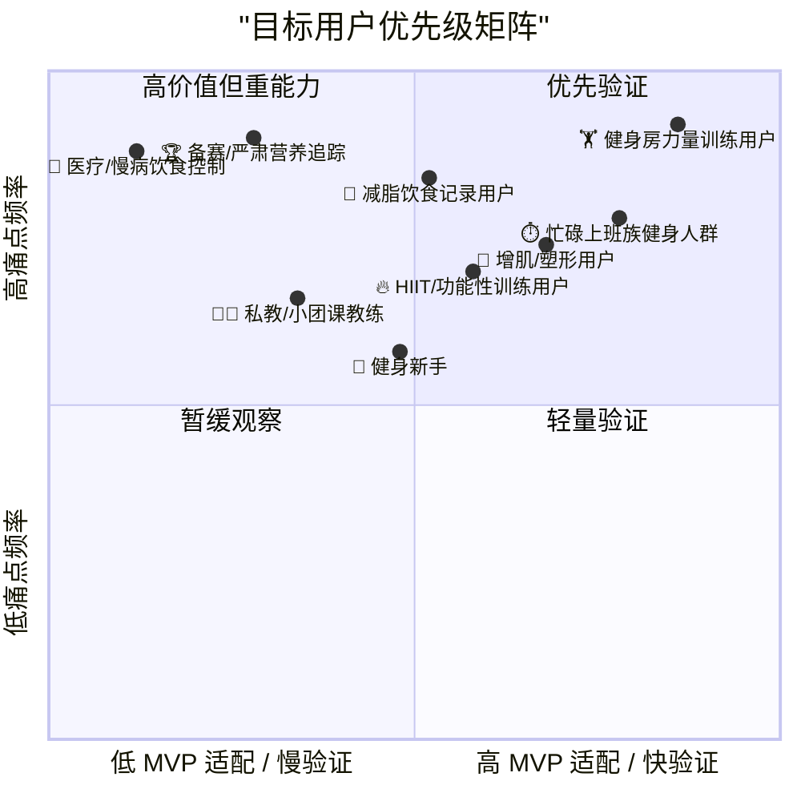
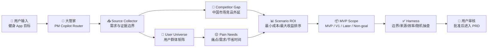
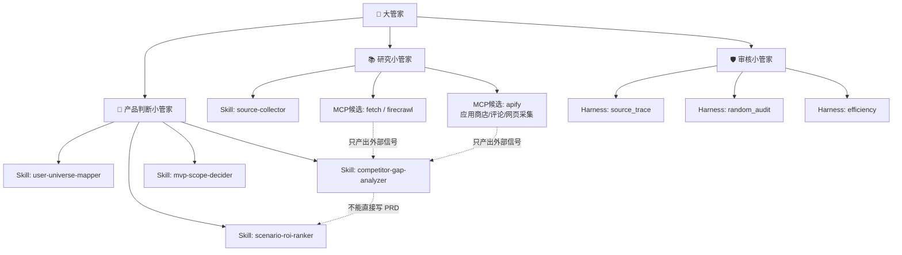

# 健身 APP MVP 分析包

生成时间：2026-04-24
运行链路：`prd-analysis-suite` 插件
状态：根据用户审阅反馈修订，仍待用户审核，不进入 PRD 定稿
默认市场：如果你没有特别说明，竞品和市场判断默认按**中国市场**处理。

## 用户群体矩阵

第一优先仍是**健身房力量训练用户 + 时间敏感用户**。原因是他们的组间歇计时场景高频、实现成本低、验证速度快；减脂饮食记录用户价值很强，但拍照热量估算需要食物识别、份量判断、营养数据和信任兜底，所以更适合作为 MVP 内的辅助验证能力。

## 主方案流程

## Skill / MCP 分工图

本次我没有实际接入新的外部 MCP，只把可接 MCP 的角色画入方案：`fetch/firecrawl` 用于网页和官网证据，`apify` 更适合后续抓应用商店、评论、榜单和结构化竞品数据。所有 MCP 只能提供外部信号，不能直接决定 MVP、PRD 或 Skill 更新。

## 结论

当前最建议的首发核心场景仍是：**健身房力量训练组间休息计时**。

原因：它高频、低成本、Android 本地可快速验证，最符合“用最小成本为健身人群节省时间”的目标。食物热量拍摄计算仍然保留在 MVP，但定位应是“估算 + 置信度 + 手动修正”，不应承诺精确。

## 推荐 MVP

- Android 首发。
- 组间休息计时作为核心能力：60/90/120/180 秒快捷按钮、声音/震动/通知提醒、后台/锁屏可用。
- 餐食拍照热量估算作为辅助能力：拍照后返回估算热量/宏量、置信度、免责声明、手动修正。
- 今日页形成闭环：今天训练计时次数/时长 + 今天餐食估算热量。

## 用户优先级

- 第一优先：健身房力量训练用户。
- 第二优先：忙碌上班族健身人群。
- 第三优先：减脂期饮食记录用户。
- 暂缓：医疗/慢病饮食控制、私教管理、严肃备赛营养追踪。

## 中国市场竞品信号

- Keep 是直接竞品/强相邻竞品：覆盖课程、训练工具、社区、运动消耗和饮食摄入，说明“训练 + 饮食 + 社区”闭环在中国市场已经被教育过。
- 薄荷健康是饮食与体重管理强竞品：食物热量查询、饮食运动记录、AI 体重管理师、减肥食谱和减重社区会直接影响拍照热量功能的用户预期。
- 训记是力量训练记录强竞品：面向更硬核的力量训练用户，训练记录、计划和 AI 相关能力会影响我们对“组间歇 + 训练日闭环”的差异化判断。
- 华为运动健康、手机系统计时器、穿戴设备是平台级替代：它们不一定做完整健身 PRD，但会替代计时、运动消耗、今日健康数据等基础入口。
- 小红书、抖音是间接竞品：它们抢占健身内容、减脂饮食、打卡、社区和决策链路，不是垂类工具，但会影响用户从“看内容”到“开始工具记录”的转化。
- 乐刻运动等线下健身/团课平台是相邻竞品：它们通过门店、课程、教练和运动数据把线下训练场景数字化，影响健身房用户的工具选择。

## 需要你审核的问题

1. 是否批准把“健身房力量训练组间休息计时”作为核心场景？
2. 是否接受食物热量拍摄计算在 MVP 中只做估算，不承诺精确？
3. 是否接受首期不做账号体系、完整食物数据库、训练计划、私教管理和会员付费？
4. Android 计时提醒是否必须支持锁屏、后台、声音/震动？
5. 中国市场默认假设是否正式固化为你的长期偏好：除非你指定海外市场，否则竞品与市场分析默认按中国市场做？

## 外部信息真实性提醒

竞品信息来自外部网页、App Store 页面、官网和搜索结果，只能作为产品判断信号。你需要在真实决策前验证来源日期、地区、Android 可用性、版本、价格、隐私和实际体验。
