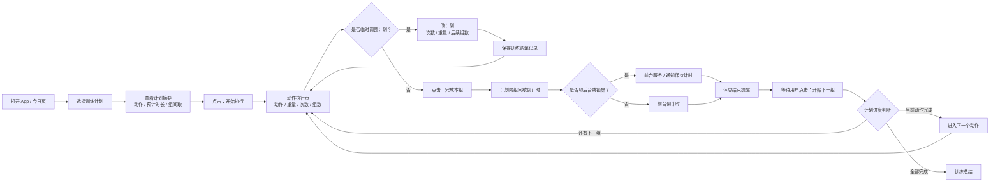

# 训练计划执行核心业务流程

状态：第三版预览草稿，待用户审阅。  
范围：只定义“训练计划执行 + 计划内组间歇”的核心路径，不生成完整全流程原型。

## 流程定义

- `flow_id`: `plan-first-rest-timer-flow`
- `flow_name`: 训练计划执行路径
- `target_user`: 健身房力量训练用户、忙碌上班族健身人群、减脂/增肌训练用户
- `scenario`: 用户选择已定义训练计划后，系统按计划中的动作、重量、组数和组间歇自动推进训练
- `trigger`: 用户准备开始当天训练计划
- `entry_point`: 今日页 / 训练页的“开始实施计划”模块
- `approved_preference`: `PREF-FITNESS-20260425-003`, `PREF-FITNESS-20260425-004`, `PREF-FITNESS-20260425-005`, `PREF-FITNESS-20260425-006`

## 主路径

1. 用户打开 App 或回到今日页。
2. 用户在“开始实施计划”模块中选择已定义训练计划，例如“胸肩训练 A 计划”。
3. 系统展示计划摘要：动作数量、预计时长、当前计划组间歇设置。
4. 用户点击“开始执行”。
5. 系统进入动作执行页，展示当前动作、重量、目标次数、当前组数和计划进度。
6. 如果用户临时调整训练安排，点击“改计划”，修改次数、重量或后续组数；系统保存到训练记录，并可按规则同步影响后续计划。
7. 用户完成一组后点击“完成本组”。
8. 系统读取该动作配置的组间歇时长，并进入组间歇倒计时。
9. 用户锁屏或切到后台时，系统保持前台服务/通知计时。
10. 倒计时结束，系统通过声音、震动、通知或全屏提醒提示可以进入下一组，但不自动推进。
11. 用户根据自己的节奏点击“开始下一组”，系统回到动作执行页；用户完成下一组后再点击“完成本组”进入下一次组间歇。
12. 如果当前动作组数完成，系统进入下一个动作；用户完成所有计划动作后，系统进入训练总结。

## 分支与异常

- 如果用户没有训练计划：展示“新建计划”和“临时组间歇”两个入口，避免阻断开始训练。
- 如果计划内某动作未设置组间歇：默认使用用户最近一次休息时长，并提示可保存到计划。
- 如果用户点击“改计划”：支持修改次数、重量和后续组数，记录实际调整；是否同步更新原训练计划，需要用户明确确认。
- 如果用户跳过休息：系统记录为 skipped，不计入完整休息完成率。
- 如果用户跳过动作：系统记录跳过原因，可选“太累 / 器械被占 / 临时调整”。
- 如果用户暂停计时：系统保留剩余时间，提供继续、跳过、结束训练。
- 如果通知权限未开启：计时开始前提示开启通知，否则只保证前台提醒。

## 流程图

## 第二版预览只覆盖的页面

- 今日页：选择计划并开始执行。
- 动作执行页：展示动作、重量、组数、目标次数，支持`改计划`并完成本组。
- 组间歇计时页：读取计划休息时长，进入倒计时并提示下一步；倒计时结束后等待用户手动点击`开始下一组`。

## 等你确认的问题

1. `改计划`入口是否需要在预览阶段展开成一个弹层/半屏抽屉？
2. 动作执行页是否需要加入“实际完成次数输入”，还是先只记录计划调整？
3. 如果器械被占，是否需要“跳过当前动作，稍后补做”？
