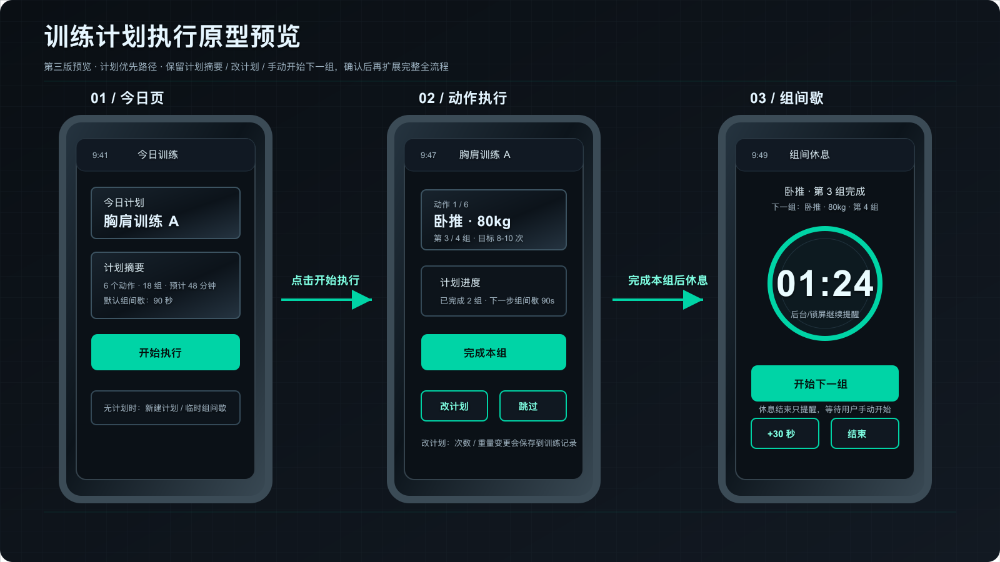

# 训练计划执行低保真原型预览

状态：`draft`
模式：`prototype_preview`
版本：第三版预览
范围：只画“训练计划执行 + 计划内组间歇”关键路径，不画完整全流程。
审批要求：你确认预览后，才允许继续画 `full_prototype`。

## 预览图

如果 Markdown 预览器仍不显示图片，直接打开同目录下的 `prototype_preview.png` 或 `prototype_preview.svg`。

## 页面清单

| 页面 | 目标 | 主按钮 | 下一步 |
| --- | --- | --- | --- |
| 1. 今日页 | 选择当天训练计划并开始执行 | 开始执行 | 进入动作执行页 |
| 2. 动作执行 | 按计划完成当前动作当前组 | 完成本组 | 进入计划内组间歇 |
| 3. 组间歇 | 根据计划休息时长提醒下一组 | 开始下一组 | 回到动作执行页 |

## 页面说明

### 1. 今日页

- 页面目标：让用户从已定义训练计划开始，而不是临时设置计时器。
- 入口：用户打开 App 或训练中回到 App。
- 关键区域：今日计划、计划摘要、默认组间歇、无计划兜底入口。
- 保留规则：计划摘要必须保留，用于帮助用户预估训练时间和降低执行前的不确定性。
- 主按钮：`开始执行`。
- 异常状态：如果没有计划，提供`新建计划`和`临时组间歇`。

### 2. 动作执行

- 页面目标：让用户知道当前该做哪个动作、多少重量、第几组、目标次数。
- 入口：从今日页点击`开始执行`。
- 关键区域：动作进度、动作名称、重量、当前组数、目标次数、计划进度。
- 主按钮：`完成本组`。
- 次级动作：`改计划`、`跳过`。
- `改计划`：支持修改本组/后续计划中的次数和重量，并把调整记录进训练记录。

### 3. 组间歇

- 页面目标：按计划配置自动进入组间休息，并提醒下一组。
- 入口：用户点击`完成本组`。
- 关键区域：上一组完成状态、下一组提示、倒计时、后台/锁屏提醒。
- 主按钮：`开始下一组`。
- 次级动作：`+30 秒`、`结束`。
- 交互规则：倒计时结束只做提醒，不自动进入下一组；用户根据自己的节奏点击`开始下一组`回到动作执行页，练完后再点击`完成本组`进入下一次组间歇。

## 本次预览只需要你审的点

1. `改计划`入口是否需要在预览阶段展开成一个弹层/半屏抽屉？
2. 动作执行页是否需要加入“实际完成次数输入”，还是先只记录计划调整？
3. 如果器械被占，是否需要“跳过当前动作，稍后补做”的分支？
