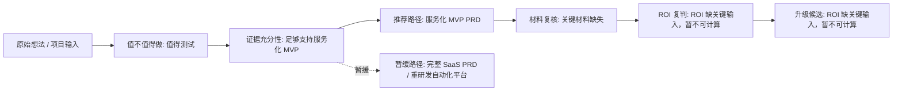
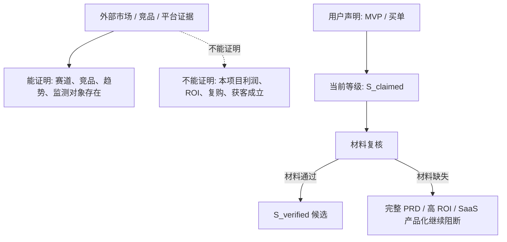

# geo-service-prd - 商业拍板报告

## 0. 先看这里：决策总览
- 结论：值得继续做，但只值得先做服务化 MVP；不值得现在直接做完整 SaaS 或重研发自动化平台。
- 统一主路由：服务化 MVP PRD
- 当前建议：服务化 MVP PRD
- 当前门禁：B：服务化 MVP / 低成本 MVP / 服务化 MVP PRD
- 证据充分性：足够支持服务化 MVP
- 证据复核等级：S_claimed（用户声明，待材料复核）
- ROI 状态：ROI 缺关键输入，暂不可计算
- 投资门禁：ROI 缺关键输入，暂不可计算
- 是否允许完整 PRD：否
- 你现在真正要决策：是否按服务化 MVP 路径推进，而不是直接做完整 SaaS。

### 0.1 阅读顺序
1. 先看 `0.2 决策路径图`，判断当前走哪条路。
2. 再看 `0.4 你需要补的材料`，决定要不要给我补证据。
3. 如果要深究，再看后面的证据表、竞品表、ROI 表。

### 0.2 决策路径图

### 0.3 证据漏斗

### 0.4 你需要补的材料
**P0｜付款 / 合同证据**
- 当前状态：缺失
- 用来判断：真实买单 / 预算 / 采购流程 / S_claimed 复核
- 不能证明：复购 / ROI / SaaS 产品化成立
- 不提供的后果：不能升级 S_verified / ROI / 完整 PRD 候选

**P0｜客户 / 行业记录**
- 当前状态：缺失
- 用来判断：目标客户清晰 / 决策 / 付费对象清晰
- 不能证明：客户复购 / 获客成本可控
- 不提供的后果：不能升级 S_verified / ROI / 完整 PRD 候选

**P0｜MVP 实验记录**
- 当前状态：缺失
- 用来判断：服务闭环已试跑 / 核心价值链路可复判
- 不能证明：真实利润 / 规模化产品化
- 不提供的后果：不能升级 S_verified / ROI / 完整 PRD 候选

**P0｜复购 / 续费 / 转介绍记录**
- 当前状态：缺失
- 用来判断：持续价值 / LTV / 产品化升级候选
- 不能证明：首单获客成本 / 交付边际成本下降
- 不提供的后果：不能升级 S_verified / ROI / 完整 PRD 候选

**P1｜报价 / 客单价证据**
- 当前状态：缺失
- 用来判断：收入输入 / 最低利润条件
- 不能证明：成交真实 / 交付成本可控
- 不提供的后果：不能证明复购或产品化升级

**P1｜交付工时证据**
- 当前状态：缺失
- 用来判断：交付成本 / 边际成本判断
- 不能证明：客户愿意付费 / 获客可控
- 不提供的后果：不能证明复购或产品化升级

**P1｜获客来源证据**
- 当前状态：缺失
- 用来判断：冷启动来源 / CAC/LTV 复判输入
- 不能证明：服务价值成立 / 复购成立
- 不提供的后果：不能证明复购或产品化升级

### 0.5 当前阻断点
- 付款 / 合同证据
- 客户 / 行业记录
- MVP 实验记录
- 报价 / 客单价证据
- 交付工时证据
- 获客来源证据
- 经营证据
- 产品化证据
- 首期服务价格 / 最低客单价
- 单个有效客户获客成本

### 0.6 当前可以做 / 不能做
- 可以做：服务化 MVP, 客户项目验证, PRD 小修订
- 暂缓做：完整 SaaS PRD, 自动化平台建设
- 禁止做：承诺 AI 推荐结果, 黑灰产 GEO, 无验证直接重研发

## 1. 值不值得做
- 结论：值得继续做，但只值得先做服务化 MVP；不值得现在直接做完整 SaaS 或重研发自动化平台。
- 价值判定：值得测试
- 置信度：medium_high
- 下一步真正要决策：是否按服务化 MVP 路径推进，而不是直接做完整 SaaS。

## 2. 证据决策表
| 证据 | 来源 | 可达性 | 强度 | 能证明什么 | 不能证明什么 | 对结论的影响 |
|---|---|---|---|---|---|---|
| 用户声明已经完成过 MVP 实验。 | 项目原始输入 (`projects/geo-service-prd/00_raw_input.md`) | not_applicable | A：强业务事实（用户提供，仍需附件 / 记录复核） | 证明不是纯想法，已经有初步实验或试跑基础。 | 不能证明可规模化、可复购、真实利润成立或 SaaS 产品化成立。 | 支持“值得测试 / 服务化 MVP”，但不足以支持直接完整 SaaS。 |
| 用户声明已有同行或客户为相关服务买单。 | 项目原始输入 (`projects/geo-service-prd/00_raw_input.md`) | not_applicable | A：强业务事实（用户提供，仍需附件 / 记录复核） | 证明存在真实付费信号或预算意愿，商业价值不是零。 | 不能证明客单价、复购、获客成本、交付工时、毛利或 SaaS 产品化已经成立。 | 支持“值得测试 / 服务化 MVP”，但不足以支持直接完整 SaaS。 |
| Gartner 预测到 2026 年传统搜索量将下降 25%，搜索营销会被 AI chatbots 和虚拟代理分流。 | [Gartner search volume forecast](https://www.gartner.com/en/newsroom/press-releases/2024-02-19-gartner-predicts-search-engine-volume-will-drop-25-percent-by-2026-due-to-ai-chatbots-and-other-virtual-agents) | non_success_status/403 | B：行业趋势证据 | 证明传统搜索流量可能被 AI 助手分流，企业搜索营销预算存在被重新配置的外部压力。 | 不能证明你的 GEO 服务一定能获客、成交、盈利或取得高 ROI。 | 支持“值得服务化 MVP 验证”，但 ROI 仍必须用价格、成本、复购和获客数据证明。 |
| Bain 引用 Sensor Tower 数据显示 2025 年上半年 ChatGPT prompt 量增长近 70%，购物相关 prompts 在占比和绝对量上明显增长。 | [Bain AI Search Research](https://www.bain.com/insights/how-customers-are-using-ai-search/) | reachable/200 | B：用户行为趋势证据 | 证明用户正在把 AI 用于搜索、购物和链接点击，品牌需要关注 AI 搜索可见度。 | 不能证明国内目标客户愿意持续付费，也不能证明单个 GEO 项目的投产比。 | 支持“值得服务化 MVP 验证”，但 ROI 仍必须用价格、成本、复购和获客数据证明。 |
| 公开 GEO agency pricing 资料显示，GEO 服务常见月费区间约为 3,000-25,000 美元。 | [RevvGrowth GEO pricing guide](https://www.revvgrowth.com/geo/geo-agency-pricing) | reachable/200 | B：价格锚点证据 | 证明海外 GEO 服务存在公开价格锚点，可用于设计本项目价格验证区间。 | 不能证明国内客户接受同等价格，也不能证明在本团队交付成本下 ROI 高。 | 支持“值得服务化 MVP 验证”，但 ROI 仍必须用价格、成本、复购和获客数据证明。 |
| Goodie 将 AI search visibility 定义为品牌被 ChatGPT、Perplexity、Gemini 等 AI 搜索引用的频率，并跟踪引用频率、排名位置、情绪和 share of voice。 | [Goodie pricing and FAQ](https://higoodie.com/pricing/) | reachable/200 | B：竞品产品化证据 | 证明 AI search visibility 已被竞品拆成引用频率、排名位置、情绪、share of voice 等可产品化指标。 | 不能证明本项目已具备同等产品能力，也不能证明客户会为本项目复购。 | 支持“值得服务化 MVP 验证”，但 ROI 仍必须用价格、成本、复购和获客数据证明。 |
| SEORCE 定义 prompt tracking 为监测 ChatGPT、Gemini、Perplexity、Google AI 中品牌或 URL 是否出现在回答里，并提供面向个人站点的低价 Lite 计划。 | [SEORCE pricing](https://seorce.com/pricing) | reachable/200 | B：竞品产品化证据 | 证明 AI tracking 已出现 SaaS 化低价入口，说明该方向有工具化竞争形态。 | 不能证明服务化交付利润更高，也不能证明应立即重研发完整平台。 | 支持“值得服务化 MVP 验证”，但 ROI 仍必须用价格、成本、复购和获客数据证明。 |
| DeepSeek 有公开官方服务和 API 文档，是 GEO 监测可覆盖的 AI 平台之一。 | [DeepSeek API Docs](https://api-docs.deepseek.com/api/deepseek-api/) | reachable/200 | C：外部官方事实 | 证明 GEO 监测对象真实存在，PRD 可以把这些平台作为检测范围候选。 | 不能证明客户一定愿意持续付费，也不能证明 GEO 服务商业化成立。 | 支持“场景对象真实存在”，不直接支持“商业价值已成立”。 |
| 豆包有公开 AI 助手入口，是 GEO 监测可覆盖的 AI 平台之一。 | [豆包官网](https://www.doubao.com/chat/) | reachable/200 | C：外部官方事实 | 证明 GEO 监测对象真实存在，PRD 可以把这些平台作为检测范围候选。 | 不能证明客户一定愿意持续付费，也不能证明 GEO 服务商业化成立。 | 支持“场景对象真实存在”，不直接支持“商业价值已成立”。 |
| Qwen 官方页面将 Qwen Studio 定位为面向用户的 AI assistant。 | [Qwen Chat](https://qwen.ai/qwenchat) | reachable/200 | C：外部官方事实 | 证明 GEO 监测对象真实存在，PRD 可以把这些平台作为检测范围候选。 | 不能证明客户一定愿意持续付费，也不能证明 GEO 服务商业化成立。 | 支持“场景对象真实存在”，不直接支持“商业价值已成立”。 |
| 腾讯元宝官网将元宝描述为可问答和创作的智能助手。 | [腾讯元宝官网](https://yuanbao.tencent.com/) | reachable/200 | C：外部官方事实 | 证明 GEO 监测对象真实存在，PRD 可以把这些平台作为检测范围候选。 | 不能证明客户一定愿意持续付费，也不能证明 GEO 服务商业化成立。 | 支持“场景对象真实存在”，不直接支持“商业价值已成立”。 |
| 可以先用人工 + 半自动方式交付，降低首期研发成本。 | 价值门禁规则推断 | not_applicable | D：推理判断 | 提供判断线索。 | 只能作为推论，不能写成已验证事实。 | 只支持待验证判断，不作为拍板事实。 |

### 2.1 证据来源质量门禁
- 总体状态：可用于 MVP 判断，不足以支持完整 PRD
- 用户提供事实：2 条
- 外部公开来源：9 条
- 可达外部来源：8 条
- 非成功 / 不可达外部来源：1 条
- 竞品参照：11 条
- 完整 PRD 阻断缺口：经营证据, 产品化证据, 强业务事实尚未附件 / 内部记录复核，不能当作 S 级已验证证据。, 付款 / 买单 / MVP 信号目前只能作为用户提供事实，不能直接证明完整 PRD 或 SaaS 产品化成立。, 首期服务价格 / 最低客单价, 单个有效客户获客成本, 单客户交付工时, 人工复核成本, 工具 / 模型 / 监测成本, 维护 / 售后成本, 复购 / 续费 / 复测信号, 付款 / 合同 / 复购材料尚未复核
- 使用规则：只有 safe_facts_for_prd 和已标注来源的事实可进入 PRD；claimed 用户事实必须标注为用户提供，不能伪装成独立验证。
- 来源质量提醒：
  - 部分外部公开来源返回非成功状态，需要替换或人工复核。

### 2.2 Evidence Research Agent 下一步任务
- 模式：v2_research_plan
- 任务：收集可溯源证据，判断当前项目是否值得投入、投入到什么范围，以及是否允许升级完整 PRD / SaaS。
- 当前路径：mvp_input_package

| 研究轨道 | 目的 | 当前来源 | 还要补的来源 | 影响什么决策 |
|---|---|---|---|---|
| customer_payment_verification | 确认真实付款、预算、合同或采购流程 | 付款 / 合同证据, 客户 / 行业记录 | 付款截图, 合同 / 报价单, 客户脱敏记录, 预算或采购流程记录 | 决定 S_claimed 是否可升级为 S_verified，并决定是否允许完整 PRD。 |
| roi_operating_inputs | 补齐真实利润和 ROI 的关键输入 | 报价 / 客单价证据, 交付工时证据, 获客来源证据 | 首期价格, 获客成本, 单客户交付工时, 工具 / 模型成本, 维护和售后成本 | 决定是否只能服务化 MVP，还是可以讨论产品化放大。 |
| competitor_productization | 继续跟踪国内外 GEO 竞品的产品形态、定价和交付边界 | KAWO GEO域见, 商脉通GEO, GT-GEO, GEOBase, 711AI, Profound | 竞品定价页, 功能页, 案例页, 服务条款, 公开客户案例 | 只能证明市场和产品形态存在，不能单独证明本项目利润成立。 |
| platform_rule_risk | 确认 DeepSeek、豆包、Qwen、元宝等平台对自动化采集、内容优化和排名承诺的边界 | 平台官方页面 / API 文档 | 平台条款, robots / API 限制, 数据授权, 内容安全规则 | 决定是否存在红线风险，以及 PRD 是否必须限制采集和承诺边界。 |
| acquisition_channel_validation | 验证第一批客户从哪里来以及 CAC 是否可控 | 获客来源证据 | 免费检测提交记录, 加顾问记录, 转介绍记录, 内容获客记录, 销售触达记录 | 决定获客路径是否足以支撑服务化 MVP 或后续产品化。 |
| market_shift_monitoring | 补充 AI 搜索行为变化、品牌 AI 可见度需求和行业预算变化 | Gartner / Bain / 公开行业资料 | 行业报告, 平台公开数据, 品牌营销预算变化, AI 搜索使用数据 | 只能证明机会窗口，不证明本项目必然盈利。 |

### 2.3 研究任务执行队列
- 队列状态：ready_for_manual_or_agentic_research
- 当前路径：mvp_input_package
- 最大并行任务数：3
- P0 任务数：2

| 任务 | 优先级 | 目标 | 需要来源 | 是否需要你提供材料 | 完成标准 | 失败 / 降级规则 |
|---|---|---|---|---|---|---|
| research.01.customer_payment_verification | P0 | 确认真实付款、预算、合同或采购流程 | 付款截图, 合同 / 报价单, 客户脱敏记录, 预算或采购流程记录 | 是 | 至少补齐一条可追溯证据，或明确记录未找到可验证来源及其降级影响。 | 找不到材料时不得编造；当前路径保持 MVP / 调研 / 客户项目验证，完整 PRD 和 SaaS 升级继续阻断。 |
| research.02.roi_operating_inputs | P0 | 补齐真实利润和 ROI 的关键输入 | 首期价格, 获客成本, 单客户交付工时, 工具 / 模型成本, 维护和售后成本 | 是 | 至少补齐一条可追溯证据，或明确记录未找到可验证来源及其降级影响。 | 找不到材料时不得编造；当前路径保持 MVP / 调研 / 客户项目验证，完整 PRD 和 SaaS 升级继续阻断。 |
| research.03.competitor_productization | P1 | 继续跟踪国内外 GEO 竞品的产品形态、定价和交付边界 | 竞品定价页, 功能页, 案例页, 服务条款, 公开客户案例 | 否 | 至少补齐一条可追溯证据，或明确记录未找到可验证来源及其降级影响。 | 找不到材料时不得编造；当前路径保持 MVP / 调研 / 客户项目验证，完整 PRD 和 SaaS 升级继续阻断。 |
| research.04.platform_rule_risk | P1 | 确认 DeepSeek、豆包、Qwen、元宝等平台对自动化采集、内容优化和排名承诺的边界 | 平台条款, robots / API 限制, 数据授权, 内容安全规则 | 否 | 至少补齐一条可追溯证据，或明确记录未找到可验证来源及其降级影响。 | 找不到材料时不得编造；当前路径保持 MVP / 调研 / 客户项目验证，完整 PRD 和 SaaS 升级继续阻断。 |
| research.05.acquisition_channel_validation | P1 | 验证第一批客户从哪里来以及 CAC 是否可控 | 免费检测提交记录, 加顾问记录, 转介绍记录, 内容获客记录, 销售触达记录 | 是 | 至少补齐一条可追溯证据，或明确记录未找到可验证来源及其降级影响。 | 找不到材料时不得编造；当前路径保持 MVP / 调研 / 客户项目验证，完整 PRD 和 SaaS 升级继续阻断。 |
| research.06.market_shift_monitoring | P2 | 补充 AI 搜索行为变化、品牌 AI 可见度需求和行业预算变化 | 行业报告, 平台公开数据, 品牌营销预算变化, AI 搜索使用数据 | 否 | 至少补齐一条可追溯证据，或明确记录未找到可验证来源及其降级影响。 | 找不到材料时不得编造；当前路径保持 MVP / 调研 / 客户项目验证，完整 PRD 和 SaaS 升级继续阻断。 |
- 输出字段要求：task_id, source_type, source_title, source_url_or_material_path, captured_at, proof_excerpt_or_material_summary, proves, does_not_prove, confidence, decision_effect
- 不能接受的输出：没有来源的市场规模数字, 无法追溯的客户付款说法, 把竞品存在当作本项目 ROI 成立, 把用户声明伪装成外部验证, 把未验证材料升级为 S_verified
- 交接规则：任务输出只能作为 value gate 复判输入，不得绕过门禁直接进入完整 PRD。

## 3. 材料接收与复判准备
### 3.1 复判状态
- 材料状态：关键材料缺失
- 复判准备：未达到复判条件
- 当前证据复核等级：S_claimed（用户声明，待材料复核）
- 是否允许升级 S_verified：否
- 规则：材料存在不等于验证通过；只有 reviewed_accepted 材料才能作为 verified evidence 候选。

### 3.2 材料槽位清单
**付款 / 合同证据**
- 当前状态：缺失
- 用来判断：真实买单 / 预算 / 采购流程 / S_claimed 复核
- 不能证明：复购 / ROI / SaaS 产品化成立

**客户 / 行业记录**
- 当前状态：缺失
- 用来判断：目标客户清晰 / 决策 / 付费对象清晰
- 不能证明：客户复购 / 获客成本可控

**MVP 实验记录**
- 当前状态：缺失
- 用来判断：服务闭环已试跑 / 核心价值链路可复判
- 不能证明：真实利润 / 规模化产品化

**交付 / 验收记录**
- 当前状态：缺失
- 用来判断：交付结果和验收状态 / 返工 / 维护成本复判
- 不能证明：获客成本 / 复购意愿

**复购 / 续费 / 转介绍记录**
- 当前状态：缺失
- 用来判断：持续价值 / LTV / 产品化升级候选
- 不能证明：首单获客成本 / 交付边际成本下降

**报价 / 客单价证据**
- 当前状态：缺失
- 用来判断：收入输入 / 最低利润条件
- 不能证明：成交真实 / 交付成本可控

**交付工时证据**
- 当前状态：缺失
- 用来判断：交付成本 / 边际成本判断
- 不能证明：客户愿意付费 / 获客可控

**获客来源证据**
- 当前状态：缺失
- 用来判断：冷启动来源 / CAC/LTV 复判输入
- 不能证明：服务价值成立 / 复购成立

### 3.3 升级阻断
- 付款 / 合同证据, 客户 / 行业记录, MVP 实验记录, 报价 / 客单价证据, 交付工时证据, 获客来源证据

## 4. 外部证据研究结果
- 外部证据状态：可用
- 外部证据数量：20
- 来源质量：有来源风险，需复核
- 竞品价格证据：可用
- 平台规则证据：需要平台边界复核
- 决策边界：外部证据只能证明市场、竞品、趋势、规则或对象存在；不能单独证明本项目利润、ROI、获客、复购或产品化成立。

| 来源 | 链接 | 能证明什么 | 不能证明什么 | 对决策的影响 |
|---|---|---|---|---|
| [Gartner search volume forecast](https://www.gartner.com/en/newsroom/press-releases/2024-02-19-gartner-predicts-search-engine-volume-will-drop-25-percent-by-2026-due-to-ai-chatbots-and-other-virtual-agents) | https://www.gartner.com/en/newsroom/press-releases/2024-02-19-gartner-predicts-search-engine-volume-will-drop-25-percent-by-2026-due-to-ai-chatbots-and-other-virtual-agents | 证明传统搜索流量可能被 AI 助手分流，企业搜索营销预算存在被重新配置的外部压力。 | 不能证明你的 GEO 服务一定能获客、成交、盈利或取得高 ROI。 | 支持“值得服务化 MVP 验证”，但 ROI 仍必须用价格、成本、复购和获客数据证明。 |
| [Bain AI Search Research](https://www.bain.com/insights/how-customers-are-using-ai-search/) | https://www.bain.com/insights/how-customers-are-using-ai-search/ | 证明用户正在把 AI 用于搜索、购物和链接点击，品牌需要关注 AI 搜索可见度。 | 不能证明国内目标客户愿意持续付费，也不能证明单个 GEO 项目的投产比。 | 支持“值得服务化 MVP 验证”，但 ROI 仍必须用价格、成本、复购和获客数据证明。 |
| [RevvGrowth GEO pricing guide](https://www.revvgrowth.com/geo/geo-agency-pricing) | https://www.revvgrowth.com/geo/geo-agency-pricing | 证明海外 GEO 服务存在公开价格锚点，可用于设计本项目价格验证区间。 | 不能证明国内客户接受同等价格，也不能证明在本团队交付成本下 ROI 高。 | 支持“值得服务化 MVP 验证”，但 ROI 仍必须用价格、成本、复购和获客数据证明。 |
| [Goodie pricing and FAQ](https://higoodie.com/pricing/) | https://higoodie.com/pricing/ | 证明 AI search visibility 已被竞品拆成引用频率、排名位置、情绪、share of voice 等可产品化指标。 | 不能证明本项目已具备同等产品能力，也不能证明客户会为本项目复购。 | 支持“值得服务化 MVP 验证”，但 ROI 仍必须用价格、成本、复购和获客数据证明。 |
| [SEORCE pricing](https://seorce.com/pricing) | https://seorce.com/pricing | 证明 AI tracking 已出现 SaaS 化低价入口，说明该方向有工具化竞争形态。 | 不能证明服务化交付利润更高，也不能证明应立即重研发完整平台。 | 支持“值得服务化 MVP 验证”，但 ROI 仍必须用价格、成本、复购和获客数据证明。 |
| [DeepSeek API Docs](https://api-docs.deepseek.com/api/deepseek-api/) | https://api-docs.deepseek.com/api/deepseek-api/ | 证明 GEO 监测对象真实存在，PRD 可以把这些平台作为检测范围候选。 | 不能证明客户一定愿意持续付费，也不能证明 GEO 服务商业化成立。 | 支持“场景对象真实存在”，不直接支持“商业价值已成立”。 |
| [豆包官网](https://www.doubao.com/chat/) | https://www.doubao.com/chat/ | 证明 GEO 监测对象真实存在，PRD 可以把这些平台作为检测范围候选。 | 不能证明客户一定愿意持续付费，也不能证明 GEO 服务商业化成立。 | 支持“场景对象真实存在”，不直接支持“商业价值已成立”。 |
| [Qwen Chat](https://qwen.ai/qwenchat) | https://qwen.ai/qwenchat | 证明 GEO 监测对象真实存在，PRD 可以把这些平台作为检测范围候选。 | 不能证明客户一定愿意持续付费，也不能证明 GEO 服务商业化成立。 | 支持“场景对象真实存在”，不直接支持“商业价值已成立”。 |
| [腾讯元宝官网](https://yuanbao.tencent.com/) | https://yuanbao.tencent.com/ | 证明 GEO 监测对象真实存在，PRD 可以把这些平台作为检测范围候选。 | 不能证明客户一定愿意持续付费，也不能证明 GEO 服务商业化成立。 | 支持“场景对象真实存在”，不直接支持“商业价值已成立”。 |
| [GEO域见 - KAWO](https://geo.kawo.com/zh/) | https://geo.kawo.com/zh/ | 中国市场已有面向品牌的 GEO/AEO 监测和优化产品形态。 | 不能证明本项目能获客、盈利或高 ROI。 | 证明竞品形态、市场参照或价格锚点存在；不证明本项目利润、ROI、复购或获客成立。 |
| [商脉通GEO](https://www.smt.wang/) | https://www.smt.wang/ | 国内已有围绕 DeepSeek、豆包等平台做 GEO 服务化交付的公开竞品。 | 不能证明本项目的交付成本、复购和利润成立。 | 证明竞品形态、市场参照或价格锚点存在；不证明本项目利润、ROI、复购或获客成立。 |
| [广拓时代 GT-GEO](https://geo.cantotimes.com/) | https://geo.cantotimes.com/ | 国内竞品已把多平台监测、竞品分析和报告交付打包成 GEO 服务。 | 不能证明本项目可直接做完整 SaaS。 | 证明竞品形态、市场参照或价格锚点存在；不证明本项目利润、ROI、复购或获客成立。 |

## 5. 国内外竞品标杆表
- 状态：available
- 覆盖：中国 5 个，海外 6 个
- 决策规则：竞品只能证明赛道和能力形态存在，不能单独证明本项目商业价值、利润或 ROI 成立；是否值得做仍必须由付款、ROI、获客、交付、复购和资源优势证据决定。

| 竞品 | 市场 | 链接 | 重点能力 | 标杆信号 | 能证明什么 | 不能证明什么 |
|---|---|---|---|---|---|---|
| KAWO GEO域见 | 中国 | [GEO域见 - KAWO](https://geo.kawo.com/zh/) | 品牌 AI 可见度监测、叙事健康度、竞品对标、提示词挖掘和优化建议。 | 国内品牌监测 + 合规/技术准备 + 闭环优化。 | 中国市场已有面向品牌的 GEO/AEO 监测和优化产品形态。 | 不能证明本项目能获客、盈利或高 ROI。 |
| 商脉通GEO | 中国 | [商脉通GEO](https://www.smt.wang/) | 面向中国企业的 AI 搜索优化，覆盖豆包、DeepSeek、Kimi 等平台的品牌曝光诊断和周期看板。 | 国内服务化 GEO 诊断 + 持续监测看板。 | 国内已有围绕 DeepSeek、豆包等平台做 GEO 服务化交付的公开竞品。 | 不能证明本项目的交付成本、复购和利润成立。 |
| GT-GEO | 中国 | [广拓时代 GT-GEO](https://geo.cantotimes.com/) | 覆盖 DeepSeek、豆包、文心一言、通义千问、Kimi、腾讯元宝的品牌监测、竞品分析和诊断报告。 | 国内多 AI 平台覆盖 + 竞品分析 + 诊断报告。 | 国内竞品已把多平台监测、竞品分析和报告交付打包成 GEO 服务。 | 不能证明本项目可直接做完整 SaaS。 |
| GEOBase | 中国 | [GEOBase](https://geobase.org.cn/) | GEO 排名检测、GEO 指数查询、品牌可见度和引用/推荐路径分析。 | 免费/轻量工具入口 + 品牌可见度检测。 | 国内存在低门槛检测工具，说明服务化 MVP 需要差异化深度和交付质量。 | 不能证明低价工具模式适合本项目。 |
| 711AI | 中国 | [711AI-GEO优化监测平台](https://www.711.cn/) | AI 搜索查询、品牌检测、关键词热度趋势和行业 GEO 数据报告。 | 查询工具 + 行业数据报告。 | 国内已有用行业报告和查询工具承接 GEO 需求的竞品形态。 | 不能证明单客户服务利润或复购成立。 |
| Profound | 海外 | [Profound](https://www.tryprofound.com/) | AI search visibility、answer engine 监测、引用和品牌表现分析。 | 海外企业级 AI 可见度平台参照。 | 海外已有企业级 AI visibility/GEO 平台方向。 | 不能证明中国市场客户愿意按海外价格付费。 |
| Peec AI | 海外 | [Peec AI](https://peec.ai/) | AI search analytics、品牌可见度、情绪、位置、来源和竞品 benchmark。 | 可见度指标 + 竞品 benchmark + action 建议。 | 海外产品已把品牌可见度、竞品、来源和行动建议做成平台能力。 | 不能证明本项目已具备同等产品能力。 |
| Scrunch | 海外 | [Scrunch](https://scrunch.com/faqs/) | AI search monitoring、AEO/GEO audit、optimization、agent traffic/referral tracking。 | 监测 + 审计 + 优化 + AI agent traffic/referral 数据。 | 海外成熟竞品已把 prompt、presence、citation、referral traffic 组合成完整监测框架。 | 不能证明本项目第一版需要完整复制这些能力。 |
| Otterly.AI | 海外 | [Otterly AI](https://otterly.ai/) | ChatGPT、Google AI Overviews/AI Mode、Gemini、Perplexity、Copilot 的品牌覆盖和竞品 share of voice。 | 多平台品牌覆盖率 + 竞品 share of voice。 | 海外存在偏轻量、面向 SEO/营销团队的 AI visibility tracker。 | 不能证明服务化交付利润成立。 |
| Goodie | 海外 | [Goodie](https://higoodie.com/pricing/) | 品牌在 AI 搜索中的引用频率、排名位置、情绪和 share of voice。 | GEO 指标产品化 + 定价参照。 | AI visibility 可被拆成可监测指标并作为 SaaS/服务销售。 | 不能证明本项目高 ROI 已成立。 |
| Evertune | 海外 | [Evertune](https://www.evertune.ai/) | AI brand monitoring、AI search optimization、品牌在 LLM 响应中的推荐和提及监测。 | 品牌监测 + AI search optimization。 | 海外已有围绕 AI 品牌监测和优化的 SaaS 公司。 | 不能证明国内 GEO 产品化速度或定价。 |

## 6. 外部商业证据与 ROI 证明状态
- 外部商业证据数量：5
- 已能证明：AI 搜索正在影响传统搜索 / 搜索营销；AI 搜索使用和购物相关使用在增长；海外 GEO 服务存在公开价格锚点；AI 可见度监测已有竞品指标和工具形态。
- 还不能证明：本项目已经能稳定获客、持续成交、低成本交付、复购或取得高 ROI。
- ROI 仍缺证据：客单价, 获客成本, 单客户交付工时, 人工复核成本, 维护 / 售后成本
- 允许的商业结论：值得服务化 MVP / 客户项目验证。
- 不允许的商业结论：完整 SaaS 已成立、高 ROI 已证明、可以直接重研发自动化平台。

### 6.1 价值类型与商业结果收敛
- 主价值类型：对外商业价值
- 次级价值类型：内部降本价值, 内部增效价值, 风险降低价值, 服务收入价值, 项目收入价值, 产品化收入候选, 数据 / 能力沉淀价值
- 价值类型判断：GEO 当前首要验证对外服务收入和项目收入；内部 Agent / 工作台只作为交付降本工具，不能当作客户核心产品价值。
- 主商业结果：服务收入 / 项目收入 / 复购或复测收入
- 次级商业结果：AI 提及率提升, 品牌推荐率提升, 竞品覆盖差距缩小, 引用来源质量改善, 后续优化项目转化, 月度代运营复购 / 续费
- 结果指标：免费检测提交数, 有效线索率, 加顾问率, 体检报告成交率, 后续优化项目转化率, 月度代运营复购 / 续费率, 单客户交付工时, 真实利润
- 当前不能证明：高 ROI 已成立, 完整 SaaS 收入成立, 规模化获客成立, 复购周期稳定, 边际交付成本已下降
- 禁止误写：不能把内部 Agent 降本工具当作客户核心产品价值。, 不能把一次服务买单直接写成完整 SaaS 产品化成立。, 不能把竞品存在直接写成本项目利润或 ROI 成立。

## 7. 证据等级门禁
- 当前证据等级：S/A + B
- 门禁状态：passes_current_gate_but_not_full_prd
- 当前路径最低要求：B 级或 C+ 级证据即可，但必须有清晰核心假设和核心价值闭环。
- 是否满足当前路径：是
- 完整 PRD 缺口：经营证据, 产品化证据, 当前 decision_gate 不是 A_ENTER_PRD
- 升级需要补的证据：
  - 付款 / 合同 / 明确预算附件
  - 第二个相似客户或复购 / 复测证据
  - 客单价和获客成本
  - 单客户交付工时和工具成本
  - 可标准化交付流程和边际成本下降证据

### 7.1 强证据复核门禁
- 状态：claimed_strong_evidence_pending_verification
- 声明证据等级：S_claimed
- 复核证据等级：unverified
- 是否可当作 S 级已验证证据：否
- PRD 使用规则：用户提供事实可以进入 PRD 事实层，但必须标注为用户提供；未经附件或内部记录复核，不得写成独立验证或 S 级已验证证据。
- 用户声明的强证据：
  - 用户声明已经完成过 MVP 实验。
  - 用户声明已有同行或客户为相关服务买单。
- 已复核的强证据：
  - 无
- 复核需要补的材料：
  - 付款截图 / 收款记录 / 发票 / 合同
  - 客户名称或可脱敏客户记录
  - MVP 实验记录、交付物或复测记录
  - 客户验收记录或明确预算记录
  - 复购、续费、复测或转介绍记录
- 对完整 PRD 的阻断缺口：
  - 强业务事实尚未附件 / 内部记录复核，不能当作 S 级已验证证据。
  - 付款 / 买单 / MVP 信号目前只能作为用户提供事实，不能直接证明完整 PRD 或 SaaS 产品化成立。

### 7.2 付费证据 claimed / verified 分离
- 声明付费层级：第 5 层
- 已复核付费层级：第 0 层
- 当前可用于决策层级：第 4 层
- 当前可支撑：服务化 MVP / 客户项目验证
- 不能支撑：完整 SaaS PRD, 高 ROI 结论, 规模化产品化判断
- 规则：用户声明的第 5 层付费信号未复核前，只能作为 claimed evidence；不得当作 S_verified 或完整 PRD 证据。

| 层级 | 含义 | 状态 | 需要证据 |
|---|---|---|---|
| 第 1 层 | 感兴趣 | claimed | 用户行为或意向记录 |
| 第 2 层 | 愿意试用 | claimed | 用户行为或意向记录 |
| 第 3 层 | 愿意留资 / 预约 / 进群 | claimed | 用户行为或意向记录 |
| 第 4 层 | 愿意付定金 / 预付款 / 进入采购流程 | claimed | 客户记录、预算、定金、付款、合同或复购材料 |
| 第 5 层 | 真实支付 / 签合同 / 复购 | claimed | 客户记录、预算、定金、付款、合同或复购材料 |

### 7.3 证据复核入口
- 状态：verification_required
- 目的：把用户声明、外部来源和项目材料分层复核，决定哪些证据能进入 PRD 事实层、哪些只能作为假设或待验证项。
- 升级规则：只有付款 / 合同、MVP 实验、交付验收、报价、交付工时或复购等材料被项目内记录复核后，才允许从 S_claimed 升级为 S_verified；未补齐前只能支持服务化 MVP 或客户项目验证。
- 下一步：补齐付款、客户、MVP、交付、复购、报价、工时和获客来源材料后重新运行价值门禁；未补齐前只能支撑服务化 MVP 或客户项目验证。

| 复核槽位 | 当前状态 | 接受材料 | 能升级什么判断 | 不能证明什么 | 用于什么判断 |
|---|---|---|---|---|---|
| 付款 / 合同证据 | missing | 付款截图, 收款记录, 发票, 合同, 定金记录, 采购流程记录 | 将用户声明的买单信号从 S_claimed 推进到 S_verified 候选。 | 不能单独证明复购、获客成本、交付利润或 SaaS 产品化成立。 | 完整 PRD / 产品化复判 |
| 客户 / 行业记录 | missing | 客户名称, 脱敏客户记录, 行业类型, 联系人角色, 预算方 / 决策方说明 | 证明付费对象、决策者和第一批行业不是泛泛假设。 | 不能单独证明客户会复购、转介绍或接受标准化产品。 | 获客和目标客户边界 |
| MVP 实验记录 | missing | 实验目标, 样本客户, 检测结果, 报告样例, 复测记录, 客户反馈 | 证明已有实验不是概念讨论，而是有可复判过程。 | 不能单独证明真实利润、获客效率或多客户可复制。 | 服务化 MVP / 价值兑现周期 |
| 交付 / 验收记录 | missing | 交付周期, 交付工时, 人工复核轮次, 返工次数, 客户验收记录 | 证明交付成本和验收结果可被记录。 | 不能单独证明长期复购或获客成本可控。 | 真实利润和交付成本判断 |
| 复购 / 续费 / 转介绍记录 | missing | 复购记录, 续费意向, 复测意愿, 转介绍记录, 代运营意向 | 证明价值不是一次性项目，有持续收入或扩展机会。 | 不能单独证明边际交付成本已经下降或 SaaS 产品化已成立。 | 产品化升级和 ROI 复判 |
| 报价 / 客单价证据 | missing | 报价单, 客户接受价格记录, 服务套餐价格, 议价记录, 最低可接受价格确认 | 证明服务价格区间和最低客单价不是主观假设。 | 不能单独证明毛利成立，仍需交付、获客、工具和维护成本。 | ROI / 最小利润复判 |
| 交付工时证据 | missing | 报告制作工时, 数据采集工时, 人工复核工时, 返工工时, 客户解释 / 售后工时 | 证明单客户交付成本可被核算。 | 不能单独证明客户愿意付费或复购。 | 真实利润 / 是否可标准化 |
| 获客来源证据 | missing | 线索来源, 转介绍记录, 内容获客记录, 销售触达记录, 免费检测提交记录, 加顾问记录 | 证明第一批客户从哪里来，以及 CAC/LTV 是否可以继续验证。 | 不能单独证明服务价值成立，仍需成交和交付结果。 | 获客路径 / CAC 复判 |

### 7.4 附件验真计划
- 当前状态：waiting_for_user_materials
- 是否禁止自动验真：是
- 你需要做什么：提供可脱敏材料，或确认本轮只按 claimed evidence 做服务化 MVP。
- S_verified 规则：只有付款 / 合同、MVP 实验、交付验收、报价、交付工时或复购等材料被项目内记录复核后，才允许从 S_claimed 升级为 S_verified；未补齐前只能支持服务化 MVP 或客户项目验证。

| 验真槽位 | 当前状态 | 需要材料 | 验真方式 | 能升级什么 | 不能证明什么 |
|---|---|---|---|---|---|
| 付款 / 合同证据 | missing | 付款截图, 收款记录, 发票, 合同, 定金记录, 采购流程记录 | 由用户提供附件 / 截图 / 脱敏记录后人工核对真实性、时间、客户对象和可复用性。 | 将用户声明的买单信号从 S_claimed 推进到 S_verified 候选。 | 不能单独证明复购、获客成本、交付利润或 SaaS 产品化成立。 |
| 客户 / 行业记录 | missing | 客户名称, 脱敏客户记录, 行业类型, 联系人角色, 预算方 / 决策方说明 | 由用户提供附件 / 截图 / 脱敏记录后人工核对真实性、时间、客户对象和可复用性。 | 证明付费对象、决策者和第一批行业不是泛泛假设。 | 不能单独证明客户会复购、转介绍或接受标准化产品。 |
| MVP 实验记录 | missing | 实验目标, 样本客户, 检测结果, 报告样例, 复测记录, 客户反馈 | 由用户提供附件 / 截图 / 脱敏记录后人工核对真实性、时间、客户对象和可复用性。 | 证明已有实验不是概念讨论，而是有可复判过程。 | 不能单独证明真实利润、获客效率或多客户可复制。 |
| 交付 / 验收记录 | missing | 交付周期, 交付工时, 人工复核轮次, 返工次数, 客户验收记录 | 由用户提供附件 / 截图 / 脱敏记录后人工核对真实性、时间、客户对象和可复用性。 | 证明交付成本和验收结果可被记录。 | 不能单独证明长期复购或获客成本可控。 |
| 复购 / 续费 / 转介绍记录 | missing | 复购记录, 续费意向, 复测意愿, 转介绍记录, 代运营意向 | 由用户提供附件 / 截图 / 脱敏记录后人工核对真实性、时间、客户对象和可复用性。 | 证明价值不是一次性项目，有持续收入或扩展机会。 | 不能单独证明边际交付成本已经下降或 SaaS 产品化已成立。 |
| 报价 / 客单价证据 | missing | 报价单, 客户接受价格记录, 服务套餐价格, 议价记录, 最低可接受价格确认 | 由用户提供附件 / 截图 / 脱敏记录后人工核对真实性、时间、客户对象和可复用性。 | 证明服务价格区间和最低客单价不是主观假设。 | 不能单独证明毛利成立，仍需交付、获客、工具和维护成本。 |
| 交付工时证据 | missing | 报告制作工时, 数据采集工时, 人工复核工时, 返工工时, 客户解释 / 售后工时 | 由用户提供附件 / 截图 / 脱敏记录后人工核对真实性、时间、客户对象和可复用性。 | 证明单客户交付成本可被核算。 | 不能单独证明客户愿意付费或复购。 |
| 获客来源证据 | missing | 线索来源, 转介绍记录, 内容获客记录, 销售触达记录, 免费检测提交记录, 加顾问记录 | 由用户提供附件 / 截图 / 脱敏记录后人工核对真实性、时间、客户对象和可复用性。 | 证明第一批客户从哪里来，以及 CAC/LTV 是否可以继续验证。 | 不能单独证明服务价值成立，仍需成交和交付结果。 |

## 8. 证据到结论的推导
- 证据规则：没有来源的数据不能进入结论；用户提供事实必须标注来源；外部公开事实可以证明趋势、价格锚点、竞品形态或监测对象存在，但不能单独证明本项目利润和高 ROI 已成立。
- 当前结论：值得继续做，但只值得先做服务化 MVP；不值得现在直接做完整 SaaS 或重研发自动化平台。
- 为什么允许当前路径：
  - 用户声明已经完成过 MVP 实验。
  - 用户声明已有同行或客户为相关服务买单。
  - Gartner 预测到 2026 年传统搜索量将下降 25%，搜索营销会被 AI chatbots 和虚拟代理分流。
  - Bain 引用 Sensor Tower 数据显示 2025 年上半年 ChatGPT prompt 量增长近 70%，购物相关 prompts 在占比和绝对量上明显增长。
  - 公开 GEO agency pricing 资料显示，GEO 服务常见月费区间约为 3,000-25,000 美元。
  - Goodie 将 AI search visibility 定义为品牌被 ChatGPT、Perplexity、Gemini 等 AI 搜索引用的频率，并跟踪引用频率、排名位置、情绪和 share of voice。
- 为什么不能直接做大：
  - 真实利润未核算完成
  - 获客成本未验证
  - 交付工时未记录
  - 复购周期未确认
  - 完整 SaaS 产品化证据不足
  - 不能证明可规模化、可复购、真实利润成立或 SaaS 产品化成立。
  - 不能证明客单价、复购、获客成本、交付工时、毛利或 SaaS 产品化已经成立。
  - 不能证明你的 GEO 服务一定能获客、成交、盈利或取得高 ROI。

## 9. 证据充分性结论
- 充分性状态：sufficient_for_mvp
- 当前支持路径：服务化 MVP, 客户项目验证
- 当前不支持路径：完整 SaaS PRD, 重研发自动化平台, 规模化产品化判断
- 允许 PRD 类型：服务化 MVP PRD
- 降级原因：已有 MVP 和买单信号支持服务化 MVP / 客户项目验证，但客单价、获客成本、交付工时、复购周期、多客户复用和 SaaS 产品化证据不足。
- 缺失证据类型：经营证据, 产品化证据
- 禁止声称：
  - 不得把服务化 MVP 证据写成完整 SaaS 产品化已经成立。
  - 不得把用户提供的买单事实伪装成外部验证。
  - 不得把平台存在性证据写成客户愿意持续付费。
  - 不得把未验证价格、成本、复购、获客写成事实。
- 下一步应收集证据：
  - 真实付款 / 合同 / 明确预算附件或记录
  - 首期服务价格区间
  - 外部价格锚点与国内目标行业可接受价格对比
  - 单客户交付工时
  - 单客户 ROI 计算：收入 - 获客成本 - 交付成本 - 工具成本 - 维护成本
  - 复购 / 复测 / 续费意愿
  - 获客成本和第一批行业来源
  - 多客户相似需求
  - GEO 指标复测变化和归因材料

### 9.1 价值兑现周期
- 状态：timeline_unverified_blocks_scaling
- 决策影响：价值兑现周期未被真实记录前，只能支撑验证路径，不能支撑完整 SaaS、重研发或规模化产品化判断。
- 未知项：真实报告交付周期, 成交周期, 复购周期, 单客户交付工时, 复测归因周期, 最低客单价, 获客成本, 复购 / 复测意愿, 第一批行业边界, 平台规则风险

| 阶段 | 预期周期 | 证据状态 | 需要材料 |
|---|---|---|---|
| 初筛检测 | 1-3 天 | 待用首批客户记录确认 | 品牌 / 关键词 / 竞品在 DeepSeek、豆包、Qwen、元宝等平台的首轮检测记录。 |
| 首单成交 | 2-4 周 | 待确认 | 真实付款、合同、预算或明确付费承诺记录。 |
| 报告交付 | 待确认 | 待确认 | 单客户报告交付周期、人工复核轮次和返工记录。 |
| 复测验证 | 2-4 周复测 | 待确认 | AI 提及率、品牌推荐率、竞品覆盖差距、引用来源质量、多模型一致性复测变化。 |
| 复购 / 续费 | 4-8 周观察 | 待确认 | 复购、续费、代运营意向或转介绍记录。 |
| 产品化复判 | 完成 2-3 个相似客户后 | 未满足 | 相似客户、标准化流程、边际交付成本下降和可复用能力证据。 |

## 10. 行业红线规则包
- 状态：needs_human_confirmation
- 触发领域：医疗, 法律, 教育, 支付资金, 平台规则
- 场景化状态：contextual_review_required
- 当前真正活跃领域：平台规则, 数据隐私, 内容安全, 品牌风险
- 条件触发领域：法律服务行业, 教育行业, 医疗 / 医美行业, 财税 / 金融相邻行业
- 已排除领域：支付资金
- 过滤原因：GEO 当前核心风险是平台规则、数据授权、内容安全和品牌承诺；医疗、法律、教育、金融等只在选定对应客户行业时进入专项红线复核。
- 完整 PRD 规则：红线未解除或行业边界未确认前，不允许进入完整 PRD。
- 不确定时允许路径：可进入调研、风险复核、低成本 MVP 或服务化验证，但必须保留边界和人工确认。
- 当前活跃规则：
  - 不得承诺 AI 推荐、排名或确定性曝光。
  - 不得刷量、伪造内容、虚假评价、虚假报道、伪造背书或黑帽 GEO。
  - 必须确认客户授权材料、监测样本、截图和看板数据的使用边界。
  - 必须避免误导性品牌承诺和平台规则违规。
- 未解决问题：
  - 需确认各 AI 平台可接受的监测、内容优化和复测边界

## 11. 轻量真实利润模型
- 公式：真实利润 = 收入 - 获客成本 - 交付成本 - 人工成本 - 维护成本 - 沟通成本 - 售后成本 - 合规成本 - 风险成本
- 当前状态：初步成立，仍需核算
- 已检查成本项：获客成本, 交付成本, 人工成本, 维护成本, 沟通成本, 售后成本, 合规成本, 风险成本
- 未知输入：客单价, 获客成本, 单客户交付工时, 人工复核成本, 维护 / 售后成本
- 最小利润条件：客单价必须覆盖获客、交付、人工复核、维护、售后、合规和风险成本，并保留可接受毛利。
- 计算规则：没有证据的数值只能标记为待确认，不能编造金额、工时或毛利。

## 12. ROI 决策模型
- ROI 输入表状态：missing_critical_roi_inputs
- 是否可计算 ROI：否
- 是否允许声称高 ROI：否
- 最低可行 ROI 规则：只有首期价格、获客成本、交付工时、工具成本、维护成本和复购 / 复测信号可被证据支持后，才允许讨论高 ROI 或产品化放大。
- ROI 缺失关键输入：首期服务价格 / 最低客单价, 单个有效客户获客成本, 单客户交付工时, 人工复核成本, 工具 / 模型 / 监测成本, 维护 / 售后成本, 复购 / 续费 / 复测信号

| ROI 输入项 | 当前值 | 来源状态 | 需要证据 | 决策规则 |
|---|---|---|---|---|
| 首期服务价格 / 最低客单价 | 待确认 | missing | 报价单、合同、付款记录或客户接受价格记录 | 低于获客、交付、工具、维护和风险成本总和时，不允许声称 ROI 成立。 |
| 单个有效客户获客成本 | 待确认 | missing | 渠道投放、转介绍、销售工时或线索转化记录 | 获客成本高于客单价或无法回收时，停止产品化或降级服务项目。 |
| 单客户交付工时 | 待确认 | missing | 服务记录、报告制作记录、人工复核和返工记录 | 交付工时持续过高时，服务化可继续验证，但不能升级 SaaS 或重研发。 |
| 人工复核成本 | 待确认 | missing | 审核轮次、审核人力、报告修改记录 | 人工复核不可控时，说明边际交付成本难以下降。 |
| 工具 / 模型 / 监测成本 | 待确认 | missing | API、工具订阅、监测工具、人工采样脚本成本记录 | 工具成本必须纳入真实利润，不得只看收入。 |
| 维护 / 售后成本 | 待确认 | missing | 复测、客户答疑、报告解释、后续优化记录 | 维护成本不可控时，不允许把一次成交写成长期利润成立。 |
| 复购 / 续费 / 复测信号 | 待确认 | missing | 复购记录、续费意向、复测预约、代运营合同或转介绍 | 没有复购或复测信号时，只能证明首单价值，不能证明 LTV 或产品化价值。 |

- 状态：roi_not_proven
- 是否允许声称高 ROI：否
- 公式：ROI = (收入 - 获客成本 - 交付成本 - 人工成本 - 工具成本 - 维护 / 售后成本 - 风险成本) / 总投入
- 决策影响：当前不能声称高 ROI，只能用服务化 MVP 收集 ROI 所需数据。
- 升级条件：三档 ROI 中至少中性场景可盈利，且复购或第二客户信号出现后，才允许讨论产品化放大。
- 停止条件：保守和中性场景都无法覆盖获客、交付、工具和维护成本时，停止产品化或降级为服务项目。

| 场景 | 计算规则 | 收入 | 获客成本 | 交付成本 | 工具成本 | 维护成本 | 预估利润 | ROI 状态 |
|---|---|---|---|---|---|---|---|---|
| 保守 | 按最低可接受客单价、最高获客成本和最高交付工时计算。 | 待确认 | 待确认 | 待确认 | 待确认 | 待确认 | 不可计算，缺少真实数值 | not_proven |
| 中性 | 按目标客单价、可控获客成本和可复用交付流程计算。 | 待确认 | 待确认 | 待确认 | 待确认 | 待确认 | 不可计算，缺少真实数值 | not_proven |
| 乐观 | 按复购 / 转介绍成立、边际交付成本下降后计算。 | 待确认 | 待确认 | 待确认 | 待确认 | 待确认 | 不可计算，缺少真实数值 | not_proven |

### 12.1 真实利润计算与投资门禁
- 真实利润计算状态：missing_required_inputs
- 是否可计算：否
- 缺失输入：首期服务价格 / 最低客单价, 单个有效客户获客成本, 单客户交付工时, 人工复核成本, 工具 / 模型 / 监测成本, 维护 / 售后成本, 复购 / 续费 / 复测信号
- 计算结论：缺少关键 ROI 输入，不能证明高 ROI。
- ROI 场景状态：roi_unavailable_missing_inputs
- 投资门禁结论：roi_unavailable_missing_inputs
- 投资门禁原因：强业务证据尚未从 S_claimed 升级到 S_verified。
- 允许下一步：服务化 MVP / 客户项目验证
- 阻断路径：完整 SaaS PRD, 重研发自动化平台, 高 ROI 对外承诺
- 是否需要你拍板：是

| 场景 | 假设 | 收入 | 总成本 | 毛利 | ROI 状态 | 决策影响 |
|---|---|---|---|---|---|---|
| 保守场景 | 按最低客单价、最高获客成本、最高交付工时和最高维护成本估算。 | 待确认 | 待确认 | 待确认 | not_calculable | 不能支持高 ROI 或产品化升级 |
| 基准场景 | 按当前最可能成交价格、可控获客成本和可复用交付流程估算。 | 待确认 | 待确认 | 待确认 | not_calculable | 不能支持高 ROI 或产品化升级 |
| 乐观场景 | 按复购 / 转介绍出现、边际交付成本下降后估算。 | 待确认 | 待确认 | 待确认 | not_calculable | 不能支持高 ROI 或产品化升级 |

## 13. 价值质量评分表
- 总体状态：needs_validation
- 阻断完整 PRD 的质量项：轻交付 / 重交付
- 规则：价值质量关键项未被证据支持时，只能进入 MVP / 项目验证，不能直接进入完整 PRD 或产品化放大。

| 质量项 | 状态 | 当前判断 | 需要证据 | 决策影响 |
|---|---|---|---|---|
| 一次性 / 持续价值 | Pass | 持续价值 | 持续价值或周期性复购证据 | 允许继续验证，但不能当作产品化已成立 |
| 高毛利 / 低毛利风险 | Pass | 中 | 扣除交付、人工、工具、维护后的毛利证据 | 允许继续验证，但不能当作产品化已成立 |
| 轻交付 / 重交付 | Warning | 偏重交付 | 单客户交付工时和返工记录 | 阻断完整 PRD / 产品化放大 |
| 标准化 / 强定制 | Pass | 具备标准化线索 | 标准化流程、配置边界和模板化交付 | 允许继续验证，但不能当作产品化已成立 |
| 可复购 / 一次性 | Pass | 具备复购 / 续费线索 | 复购、续费、复测或转介绍记录 | 允许继续验证，但不能当作产品化已成立 |
| 可复制 / 单客户 | Pass | 可复制性待用多客户数据验证 | 第二个相似客户和多行业复用证据 | 允许继续验证，但不能当作产品化已成立 |
| 能力沉淀 | Pass | 监测、诊断报告、竞品对比、复测 | 可沉淀的数据、流程、报告、词库或工具能力 | 允许继续验证，但不能当作产品化已成立 |
| 壁垒 / 易替代 | Pass | 行业词库、提示词样本库、历史监测数据和优化案例可能形成壁垒 | 数据积累、行业 know-how、交付质量或渠道优势 | 允许继续验证，但不能当作产品化已成立 |

## 14. 资源优势矩阵
- 总体状态：needs_evidence
- 为什么是我们做：已有客户 / SEO / 内容营销 / AI 转型资源可作为切入口。
- 声明中的资源优势：SEO, 内容营销, AI 转型
- 已复核资源优势：无
- 未复核资源优势：SEO, 内容营销, AI 转型
- 为什么还不能证明是我们做：客户资源尚未形成可复核清单
- 缺失资源：客户资源
- 规则：市场有机会不等于我们能拿到价值；资源优势未被证据支持时，只能验证，不能放大投入。

| 资源项 | 状态 | 证据状态 | 需要证据 | 决策影响 |
|---|---|---|---|---|
| 客户资源 | missing | 缺证据 | 客户资源对应的客户记录、案例、流程、能力或成本证明 | missing 时不能声称我们有稳定进入优势 |
| 获客渠道 | candidate | 输入中有线索，需复核 | 获客渠道对应的客户记录、案例、流程、能力或成本证明 | missing 时不能声称我们有稳定进入优势 |
| 行业认知 | candidate | 输入中有线索，需复核 | 行业认知对应的客户记录、案例、流程、能力或成本证明 | missing 时不能声称我们有稳定进入优势 |
| 技术能力 | candidate | 输入中有线索，需复核 | 技术能力对应的客户记录、案例、流程、能力或成本证明 | missing 时不能声称我们有稳定进入优势 |
| 交付能力 | candidate | 输入中有线索，需复核 | 交付能力对应的客户记录、案例、流程、能力或成本证明 | missing 时不能声称我们有稳定进入优势 |
| 案例背书 | candidate | 输入中有线索，需复核 | 案例背书对应的客户记录、案例、流程、能力或成本证明 | missing 时不能声称我们有稳定进入优势 |
| 成本优势 | candidate | 输入中有线索，需复核 | 成本优势对应的客户记录、案例、流程、能力或成本证明 | missing 时不能声称我们有稳定进入优势 |
| 合规能力 | candidate | 输入中有线索，需复核 | 合规能力对应的客户记录、案例、流程、能力或成本证明 | missing 时不能声称我们有稳定进入优势 |
| 团队资源 | candidate | 输入中有线索，需复核 | 团队资源对应的客户记录、案例、流程、能力或成本证明 | missing 时不能声称我们有稳定进入优势 |

## 15. 获客判断表
- 总体状态：needs_validation
- 阻断完整 PRD 的获客项：获客成本是否可控, 是否有复购 / LTV 信号
- CAC/LTV 风险：需要验证客单价能否覆盖获客、诊断、交付和持续监测成本。
- 规则：获客路径、信任来源、CAC 和复购信号未被证据支持时，不允许进入完整 PRD 或规模化增长结论。

| 获客项 | 状态 | 当前判断 | 需要证据 |
|---|---|---|---|
| 第一批用户在哪里 | candidate | SEO、内容营销、AI 转型、私域、转介绍 | 首批客户名单、行业、来源或线索记录 |
| 如何触达 | candidate | 从已有客户、服务商和内容营销需求切入。 | 渠道、转介绍、私域、内容、销售或服务商触达记录 |
| 为什么信任我们 | candidate | MVP、买单、服务商 | 案例、MVP 记录、成交记录、服务商背书或客户反馈 |
| 获客成本是否可控 | missing | 待确认 | 渠道投放、转介绍、销售工时或线索转化记录 |
| 是否有复购 / LTV 信号 | missing | 持续监测、复测和服务商工具授权可能带来复购。 | 复购、续费、复测、转介绍或代运营意向记录 |

## 16. 经营决策面板
- 建议打法：2-4 周服务化 MVP，不做完整 SaaS。
- 投入上限：低成本验证，优先人工 + 半自动，不投入重研发。
- 人天上限：待确认
- 现金成本：待确认
- 工具成本：待确认
- 管理精力：低到中，聚焦 2-4 周验证
- 验证周期：2-4 周
- 最小收入目标：真实付款 / 合同 / 明确预算; 至少拿到第二个付费信号或明确复购 / 复测意愿
- 最小利润条件：客单价必须覆盖获客、交付、人工复核、维护、售后、合规和风险成本，并保留可接受毛利。
- 客单价：待确认
- 单客户交付工时：待确认
- 升级条件：连续出现相似客户需求; 单客户交付工时下降到可控范围; 客户愿意复测 / 续费 / 转介绍; GEO 指标有可解释变化; 核心流程可标准化为工具或看板
- 停止条件：2-4 周内拿不到第二个付费信号; 客户只愿免费试用不愿付费; 获客成本高于客单价; 单客户交付工时持续过高; GEO 效果无法归因; 客户不愿复测 / 续费 / 推荐

## 17. 为什么值得做
- 用户声明已经完成过 MVP 实验。
- 用户声明已有同行或客户为相关服务买单。
- Gartner 预测到 2026 年传统搜索量将下降 25%，搜索营销会被 AI chatbots 和虚拟代理分流。
- Bain 引用 Sensor Tower 数据显示 2025 年上半年 ChatGPT prompt 量增长近 70%，购物相关 prompts 在占比和绝对量上明显增长。
- Goodie 将 AI search visibility 定义为品牌被 ChatGPT、Perplexity、Gemini 等 AI 搜索引用的频率，并跟踪引用频率、排名位置、情绪和 share of voice。
- SEORCE 定义 prompt tracking 为监测 ChatGPT、Gemini、Perplexity、Google AI 中品牌或 URL 是否出现在回答里，并提供面向个人站点的低价 Lite 计划。
- DeepSeek 有公开官方服务和 API 文档，是 GEO 监测可覆盖的 AI 平台之一。
- 豆包有公开 AI 助手入口，是 GEO 监测可覆盖的 AI 平台之一。

## 18. 为什么不能直接做大
- 真实利润未核算完成
- 获客成本未验证
- 交付工时未记录
- 复购周期未确认
- 完整 SaaS 产品化证据不足

## 19. 当前最值得做的形态
- 推荐路径：服务化 MVP PRD
- 值得投入范围：服务化 MVP PRD, 客户项目验证, PRD 小修订
- 推荐原因：已有 MVP 和买单信号，但真实利润、获客、交付成本和 SaaS 产品化仍需验证。

## 20. 承接输入包完整度
- 当前承接包：mvp_input_package
- 完整度状态：complete
- 是否允许进入下一模块：是
- 缺失字段：无
- 过泛字段：无
- 回退规则：缺字段时退回前置模块补齐；字段过泛时允许进入验证路径，但不得进入完整 PRD。

### 20.1 服务化 MVP 执行承接包
- 目标：用 2-4 周服务化 MVP 验证 GEO 商业闭环：免费检测获客、体检报告成交、复测证明价值、后续优化 / 代运营转化。
- 核心交付：免费检测结果 + 付费 GEO 体检报告 + 复测记录 + 后续优化建议，不是完整 SaaS。
- 核心反馈：客户是否购买体检报告、认可报告、愿意复测、愿意进入后续优化 / 代运营。
- 服务成交路径：免费检测提交 → 有效线索筛选 → 加顾问 / 沟通需求 → 付费体检报告 → 报告解释和优化建议 → 复测 → 后续优化项目 / 月度代运营
- 成功标准：免费检测提交数达到本轮验证目标, 有效线索率可被记录并解释, 加顾问率可被记录并解释, 体检报告成交率可被记录并解释, 复盘预约率可被记录并解释, 至少出现第二个付费信号或明确复测 / 续费 / 后续优化 / 代运营意向, 单客户交付工时进入可接受上限, 客户认可报告和复测结果
- 失败标准：客户只愿免费检测但不愿付费体检报告, 报告结论不被客户认可, 单客户交付工时持续过高, GEO 指标变化无法归因, 客户不愿复测 / 复购 / 续费 / 推荐, 获客成本高于客单价且无法回收
- 执行记录模板：客户行业, 线索来源, 免费检测提交时间, 是否有效线索, 是否加顾问, 是否购买体检报告, 首期服务价格, 报告交付周期, 单客户交付工时, 是否复测, 是否转后续优化 / 代运营, 客户认可度
- 免费检测入口：用低门槛免费检测获取目标客户线索。
- 体检报告：把 GEO 价值转成客户能理解和愿意付费的服务结果。
- 指标看板：用轻量表格 / 看板记录验证数据，不做完整 SaaS。
- 复测机制：通过复测证明服务动作是否带来可解释变化。

### 20.2 输出边界门禁
- 状态：within_boundary
- 当前路径：mvp_input_package
- 规则：价值门禁只决定是否值得做、走哪条验证路径、给下一模块哪些输入；不能替代 PRD、原型、开发文档、商业执行方案或跨项目优先级决策。
- 优先级边界：前置模块只判断单个想法有没有价值、证据是否达标、应进入哪条验证路径；不判断它在所有机会中的优先级、资源排名或公司级投资顺序。
- 检测到的越界风险：无
- 允许输出：值不值得做的商业判断, 证据表和证据充分性结论, 经营边界和验证周期, A/B/C/D/E/F/G 路径输入包, 给 PRD 模块的事实 / 假设 / 禁止声称边界, 单个想法的后续承接路径建议
- 禁止输出：完整 PRD 正文, 完整功能清单, 完整页面结构和交互流, 技术架构和开发排期, 自动化运营方案, 未经验证的 ROI 承诺, 跨项目优先级排序, 资源分配排名, 所有机会里的投资优先级判断

## 21. 当前不值得做的范围
- 不值得投入范围：完整 SaaS PRD, 自动化平台建设, 无验证重研发
- 暂缓路径：完整 SaaS PRD, 自动化平台建设
- 阻断路径：承诺 AI 推荐结果, 黑灰产 GEO, 无验证直接重研发

## 22. 关键缺口
- 待确认：价值归因 - PRD 必须记录产品动作、服务动作、外部干扰和复测材料。
- 待确认：真实利润 - 补齐客单价、获客成本、交付工时、人工复核和售后维护成本。
- 待确认：获客路径 - 确认第一批用户、触达方式、信任来源和 CAC/LTV 风险。
- 待确认：资源匹配 - 把缺失资源转为 PRD 上线前拍板项。
- 待确认：产品化价值 - 先区分项目价值、服务价值和完整 SaaS 产品化价值。

## 23. 需要你拍板的问题
### 1. 是否确认本轮只做 2-4 周服务化 MVP？
- 选 A 的结果：进入低成本验证，只做报告、复测、看板或半自动服务闭环。
- 选 B 的结果：不进入 PRD，继续调研或等待更多证据。
- 我的建议：建议确认，先验证商业闭环，不直接重研发。
### 2. 是否确认不投入完整 SaaS 研发？
- 选 A 的结果：避免在真实利润、获客、交付工时未确认前扩大成本。
- 选 B 的结果：如果现在投入完整 SaaS，研发和维护风险会明显升高。
- 我的建议：建议确认，完整 SaaS 等升级条件满足后再做。
### 3. 是否确认最低客单价 / 价格区间？
- 选 A 的结果：可以核算最低利润条件，判断是否值得继续交付。
- 选 B 的结果：价格继续待确认，真实利润仍不能通过。
- 我的建议：建议先给出最低可接受价格区间。
### 4. 是否确认单客户交付工时上限？
- 选 A 的结果：可以判断服务化 MVP 是否有可接受毛利。
- 选 B 的结果：无法判断交付是否过重，产品化仍需暂缓。
- 我的建议：建议设定单客户交付工时上限。
### 5. 是否确认第一批行业和客户来源？
- 选 A 的结果：PRD 可以聚焦行业词库、场景、指标和获客动作。
- 选 B 的结果：范围会发散，获客和交付风险上升。
- 我的建议：建议先限定 1-2 个行业和明确客户来源。
### 6. 是否确认达到什么结果才升级产品化？
- 选 A 的结果：后续能根据复购、交付工时、指标变化和标准化程度决定是否升级。
- 选 B 的结果：缺少升级标准时，容易把服务项目误放大成 SaaS。
- 我的建议：建议明确升级条件后再进入服务化 MVP PRD。
### 7. 是否确认失败后停止或降级为服务项目？
- 选 A 的结果：如果 2-4 周拿不到第二个付费信号、无法归因或交付过重，就停止产品化投入。
- 选 B 的结果：没有止损条件会导致持续投入但无法判断价值。
- 我的建议：建议确认停止 / 降级条件。

## 24. 不同选择的结果
- 接受推荐路径：进入 服务化 MVP PRD，先验证价值闭环，避免过早重研发。
- 坚持做大：需要先补齐 完整 SaaS PRD, 自动化平台建设 相关证据，否则风险偏高。
- 暂缓推进：保留现有证据，继续补充客户、价格、交付和复购材料。

## 25. 下一步动作
- 先确认是否接受“值不值得做”的判断。
- 如果接受，再确认经营边界：投入上限、验证周期、最低收入信号、升级条件和停止条件。
- 让 PRD 模块只读取 `00_value_gate_prd_input.json`。
- PRD 中必须保留事实 / 假设 / 禁止声称边界。
- PRD 中必须保留经营边界章节，不得把待确认成本或价格写成事实。

## 26. 停止 / 降级条件
- 2-4 周内拿不到第二个付费信号
- 客户只愿免费试用不愿付费
- 获客成本高于客单价
- 单客户交付工时持续过高
- GEO 效果无法归因
- 客户不愿复测 / 续费 / 推荐

## 27. 复判与证据归档
- 复判触发：完成低成本 MVP 核心价值闭环验证后复判。
- 是否要求下一路径执行记录：是
- 必须记录的验证数据：免费检测提交数, 有效线索率, 加顾问率, 体检报告成交率, 报告交付周期, 单客户交付工时, 看板查看率, 复盘预约率, 后续优化 / 代运营意向, 客户对报告和看板的认可度
- 复判输入要求：免费检测提交数, 有效线索率, 加顾问率, 体检报告成交率, 报告交付周期, 单客户交付工时, 看板查看率, 复盘预约率, 后续优化 / 代运营意向, 客户对报告和看板的认可度, 真实付款 / 合同 / 明确预算附件或记录, 首期服务价格区间, 外部价格锚点与国内目标行业可接受价格对比, 单客户 ROI 计算：收入 - 获客成本 - 交付成本 - 工具成本 - 维护成本
- 复判材料：客户证据, 指标基线和结果, 成本核算, 交付复盘, 风险记录, 真实付款 / 合同 / 明确预算附件或记录, 首期服务价格区间, 外部价格锚点与国内目标行业可接受价格对比, 单客户交付工时, 单客户 ROI 计算：收入 - 获客成本 - 交付成本 - 工具成本 - 维护成本
- 证据快照文件：00_value_gate_evidence_snapshot.json
- 原始 HTML 是否保存：False
- 归档规则：项目 closeout 前保留；归档时和用户对齐是否进入项目档案、删除候选或长期证据库。

### 27.1 复判执行计划
- 当前路径包：mvp_input_package
- 当前建议：2-4 周服务化 MVP，不做完整 SaaS。
- 复判周期：2-4 周
- 是否需要你复核：是
- 记录要求：客户行业, 线索来源, 免费检测提交时间, 是否有效线索, 是否加顾问, 是否购买体检报告, 首期服务价格, 报告交付周期, 单客户交付工时, 是否复测, 是否转后续优化 / 代运营, 客户认可度, 免费检测提交数, 有效线索率, 加顾问率, 体检报告成交率, 看板查看率, 复盘预约率, 后续优化 / 代运营意向, 客户对报告和看板的认可度, 真实付款 / 合同 / 明确预算附件或记录, 首期服务价格区间, 外部价格锚点与国内目标行业可接受价格对比, 单客户 ROI 计算：收入 - 获客成本 - 交付成本 - 工具成本 - 维护成本, 复购 / 复测 / 续费意愿
- 升级检查：连续出现相似客户需求; 单客户交付工时下降到可控范围; 客户愿意复测 / 续费 / 转介绍; GEO 指标有可解释变化; 核心流程可标准化为工具或看板
- 停止 / 降级检查：2-4 周内拿不到第二个付费信号; 客户只愿免费试用不愿付费; 获客成本高于客单价; 单客户交付工时持续过高; GEO 效果无法归因; 客户不愿复测 / 续费 / 推荐
- 规则：复判只更新 value gate 结论和候选路径；是否进入 stable、完整 PRD 或长期规则仍需用户批准。

## 附录：核心硬门禁评分
| 门禁项 | 状态 | 原因 | 是否阻断完整 PRD | 下一步 |
|---|---|---|---|---|
| 价值对象 | Pass | 已识别付费者、决策者、使用者和潜在反对者。 | 否 | 保持价值对象矩阵，PRD 不要混淆付费者、使用者和验收方。 |
| 商业结果 | Pass | 商业结果为：服务收入 / 项目收入 / 复购或复测收入。 | 否 | 把商业结果写成可验收指标，不写泛泛的“提升体验”。 |
| 衡量指标 | Pass | 已给出可衡量指标。 | 否 | 补齐基线值、复测周期和指标口径。 |
| 价值归因 | Warning | 归因风险：中。 | 否 | PRD 必须记录产品动作、服务动作、外部干扰和复测材料。 |
| 证据等级 | Pass | 证据等级为 S。 | 否 | 低于 A 级时，不得直接进入完整 PRD。 |
| 付费证据 | Pass | 付费证据第 5 层。 | 否 | 确认真实付款、合同、预算或复购证据。 |
| 真实利润 | Warning | 客单价必须覆盖获客、交付、人工复核、维护、售后、合规和风险成本，并保留可接受毛利。 | 否 | 补齐客单价、获客成本、交付工时、人工复核和售后维护成本。 |
| 获客路径 | Warning | 需要验证客单价能否覆盖获客、诊断、交付和持续监测成本。 | 否 | 确认第一批用户、触达方式、信任来源和 CAC/LTV 风险。 |
| 资源匹配 | Warning | 可用资产：SEO、内容营销、AI 转型；缺失资产：客户资源。 | 否 | 把缺失资源转为 PRD 上线前拍板项。 |
| 产品化价值 | Warning | 同行买单可能先证明服务价值，不必然证明 SaaS 产品化价值。 | 是 | 先区分项目价值、服务价值和完整 SaaS 产品化价值。 |
| 红线风险 | Pass | 未识别到不可控红线，但仍需保留行业和平台规则边界。 | 否 | 红线不可控时禁止推进；可控时进入风险约束版路径。 |
