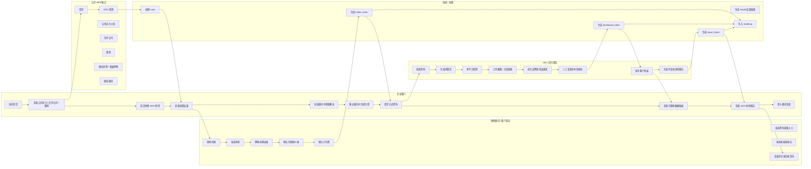

# GEO 服务商业化 PRD v0.6

- 文档状态：Draft
- 文档版本：v0.6
- 文档 Owner：刘俊
- 最后更新时间：2026-05-07
- 文档定位：本 PRD 是 GEO 服务商业化 MVP 的主口径文档，原型图层和开发文档必须服从本 PRD。
- 本次升级范围：版本统一、导航冲突修复、token 访问边界、GEO 指标公式、MVP 必做 / 可选 / 暂不做、上线前人工拍板项、研发交付口径补齐。
- 不做事项：不做完整客户登录后台、完整 SaaS 多租户后台、在线支付、合同、发票、自动大规模检测平台、自动内容发布、自动外链建设、黑帽 GEO、虚假信号、代理商后台、独立服务开通页、独立解决方案页、客户侧 Agent 平台。

---

## 1. 摘要

GEO 服务商业化 MVP 面向高客单、高信任、强比较决策行业客户，通过公开 Web 页面获客，用免费 GEO 检测制造认知冲击，再由顾问在私域完成服务范围确认和付费确认。付费后客户填写正式资料，交付团队完成问题库、检测、证据链、标注、评分、看板和 GEO 体检报告，最后由顾问复盘并记录后续意向。

MVP 主链路固定为：

```text
Web 引流
-> 免费检测
-> 初筛结果
-> 顾问解读
-> 付费确认
-> 资料采集
-> 可溯源看板
-> 体检报告
-> 顾问复盘
```

本期验证的不是完整 SaaS，也不是自动检测平台，而是“免费检测获客 + 私域承接成交 + 付费体检报告交付 + 可溯源看板建立信任”的闭环是否成立。

### 1.1 产品总览思维导图

```mermaid
flowchart TB
  P["GEO 服务商业化 MVP"]
  P --> U["目标客户"]
  P --> S["核心场景"]
  P --> M["MVP 产品包"]
  P --> T["公开转化触点"]
  P --> D["交付机制"]
  P --> R["风险边界"]
  P --> K["成功指标"]

  U --> U1["ToB SaaS / 企业服务"]
  U --> U2["财税 / 法律 / 咨询"]
  U --> U3["教育 / 医美 / 高客单服务"]

  S --> S1["担心 AI 推荐竞品"]
  S --> S2["SEO 流量下降"]
  S --> S3["官网改版 / 内容营销"]
  S --> S4["品牌信任信号不足"]

  T --> T1["首页"]
  T --> T2["GEO 检测"]
  T --> T3["公司实力介绍"]
  T --> T4["合作公司"]
  T --> T5["案例"]
  T --> T6["报告样例"]
  T --> T7["联系顾问"]

  M --> M1["免费检测"]
  M --> M2["初筛结果"]
  M --> M3["顾问解读"]
  M --> M4["付费后资料采集"]
  M --> M5["可溯源数据看板"]
  M --> M6["GEO 体检报告"]
  M --> M7["顾问复盘"]

  D --> D1["问题库"]
  D --> D2["多平台检测"]
  D --> D3["竞品分析"]
  D --> D4["证据链"]
  D --> D5["人工标注复核"]
  D --> D6["报告交付"]

  R --> R1["不承诺排名"]
  R --> R2["不承诺 AI 一定推荐"]
  R --> R3["不操控 AI 答案"]
  R --> R4["不做虚假信号"]
  R --> R5["客户可见前必须人工复核"]

  K --> K1["免费检测提交数"]
  K --> K2["有效线索率"]
  K --> K3["加顾问率"]
  K --> K4["体检报告成交率"]
  K --> K5["报告交付周期"]
  K --> K6["看板查看率"]
  K --> K7["复盘预约率"]
```



### 1.2 事实、假设与开放问题

#### 1.2.1 已确认事实

| 编号 | 事实 |
|---|---|
| F1 | 原始材料是 PRD 前置工作，不是 PRD 目录；其中收集的信息用于提供思考线索和产品判断输入。 |
| F2 | 业务目标是把 GEO 做成面向企业客户的赚钱服务，不是单纯解释 GEO 概念。 |
| F3 | 客户真正关心的是 AI 是否推荐自己、是否推荐竞品、是否正确理解和描述自己。 |
| F4 | 第一阶段不先做复杂平台，而是先跑通 GEO 体检报告服务。 |
| F5 | MVP 商业路径收敛为免费检测获客、私域承接成交、可溯源看板建立信任、GEO 体检报告交付和顾问复盘。 |
| F6 | 服务必须规避确定性承诺，不能说“保证推荐、保证排名、操控 AI 答案、7 天见效”。 |
| F7 | 同行常见路径是 Web 端引流到私域，在私域售卖服务，并在服务期间提供可溯源数据看板做实时反馈。 |
| F8 | 公开交互需要补齐首页、公司实力介绍、合作公司和案例，先建立信任再推动检测提交。 |
| F9 | 资料采集只在用户与顾问确认服务并完成付费后开放，不作为免费检测或顾问解读前置步骤。 |
| F10 | 真实客户数据看板、真实客户报告、资料采集和内部工作区都不能进入公开导航。 |

#### 1.2.2 当前假设

| 编号 | 假设 | 影响 |
|---|---|---|
| A1 | 首期客户优先选择高客单、高信任、强比较、强决策链路行业。 | 决定销售样板和问题库优先级。 |
| A2 | MVP 交付以人工 + 半自动为主，AI 只作为内部草稿辅助。 | 控制上线成本和交付风险。 |
| A3 | 客户侧 MVP 需要轻量数据看板，但不做完整 SaaS 客户后台。 | 原型图层只做 token 看板和报告，不做账号后台。 |
| A4 | GEO 体检报告是最关键的低价成交产品。 | PRD 重点描述报告标准、交付流程和转化机制。 |
| A5 | 优化项目、代运营和持续监测只在复盘后记录意向。 | 防止 MVP 范围发散。 |
| A6 | 证据链比复杂自动化更能建立首期客户信任。 | 看板必须能回溯样本、截图或对话链接。 |

#### 1.2.3 默认决策与剩余开放问题

| 类型 | 问题 | v0.6 默认方案 | 是否还需拍板 |
|---|---|---|---|
| 默认决策 | 公开导航 | 仅保留：首页、GEO 检测、公司实力介绍、合作公司、案例、报告样例、联系顾问。 | 否 |
| 默认决策 | 免费检测和体检报告边界 | 免费检测是获客钩子和认知冲击；体检报告才是正式诊断交付。 | 否 |
| 默认决策 | 首期私域承接工具 | 首期默认企微承接，个人微信只作备份；所有线索状态必须回填。 | 否 |
| 默认决策 | 资料采集开放时机 | 仅在顾问确认服务范围并标记已付费后开放 `intake_token`。 | 否 |
| 默认决策 | 客户看板访问方式 | 正式看板只能通过 `dashboard_token` 访问，只展示已复核且证据完整的数据。 | 否 |
| 默认决策 | 客户报告访问方式 | 正式报告只能通过 `report_token` 访问，关键结论必须能回到证据链。 | 否 |
| 默认决策 | AI 辅助边界 | AI 可辅助问题库、标注建议、报告草稿和风险检查，客户可见内容必须人工复核。 | 否 |
| 人工拍板 | 首批试点行业 | 默认从 ToB SaaS / 企业服务、财税法律咨询、教育医美高客单服务中选择 1-3 个。 | 是，销售启动前确认 |
| 人工拍板 | 体检报告价格 | 默认先按低价体检报告验证成交，具体价格由销售负责人确认。 | 是，首批销售前确认 |
| 人工拍板 | 报告和看板视觉模板 | 默认先用轻量 Web / Markdown 模板，首批样板前确认视觉风格。 | 是，设计开工前确认 |
| 人工拍板 | 高风险行业承接 | 涉及医疗、金融、法律等高风险表达时，需要人工确认是否首期承接。 | 是，行业试点前确认 |

### 1.3 核心业务泳道图



---

## 2. 版本主口径

| 文档 | 版本 | 作用 | 服从关系 |
|---|---|---|---|
| PRD | v0.6 | 产品范围、业务规则、指标口径、验收边界 | 主口径 |
| 原型图层 | v0.6 | 页面、跳转、权限、低保真草图 | 必须服从 PRD |
| 开发文档 | v0.6 | 数据结构、API、状态机、测试和交付门禁 | 必须服从 PRD |
| MVP 试点上线方案 | v0.1 | 试点执行、运营模板、复盘机制 | 必须服从 PRD |

若文档之间冲突，以本 PRD 为准。

---

## 3. MVP 范围

### 3.1 MVP 必做

| 模块 | 说明 |
|---|---|
| Web 首页 / 引流页 | 承接冷流量，解释 GEO 价值，放置免费检测入口。 |
| 公司实力介绍 | 展示服务能力、检测方法、证据链能力和人工复核边界。 |
| 合作公司 | 展示合作生态、适配行业和服务经验，只能使用合规表达。 |
| 案例 | 展示模拟案例、看板样例、报告样例，不连接真实客户项目。 |
| 免费 GEO 检测 | 公开表单，收集公司、官网、行业、竞品、联系方式。 |
| 初筛结果页 | 展示免费检测的简版结果和顾问 CTA。 |
| 顾问解读 / 联系顾问 | 首期默认企微承接，完成解读、范围确认和付费确认。 |
| 付费后资料采集 | 仅 `scope_confirmed + paid_confirmed` 后用 `intake_token` 访问。 |
| 客户可溯源数据看板 | 仅 `dashboard_token` 访问，展示已复核样本、指标和证据链。 |
| GEO 体检报告 | 仅 `report_token` 访问，关键结论可追溯到样本和证据。 |
| 内部交付工作区 | 线索、项目、资料、问题、样本、证据、标注、评分、报告和发布管理。 |
| 顾问复盘 / 后续意向记录 | 解读报告，记录后续深度诊断、优化项目或代运营意向，不做独立模块。 |

### 3.2 MVP 可选

| 能力 | 说明 |
|---|---|
| AI 草稿辅助 | 可辅助问题库、标注建议、报告草稿和风险检查；客户可见前必须人工复核。 |
| 报告导出 PDF | 首期可先 Web / Markdown，PDF 不阻塞主链路。 |
| 看板样例页 | 可在案例中展示模拟数据，不得连接真实项目。 |
| 埋点统计 | 建议做核心转化事件，若资源不足可先用后台记录替代。 |

### 3.3 暂不做

- 完整客户登录后台。
- 完整 SaaS 多租户后台。
- 在线支付、合同、发票系统。
- 自动大规模检测平台。
- 自动内容发布。
- 自动外链建设。
- 黑帽 GEO / 虚假信号。
- 代理商后台。
- 独立服务开通页。
- 独立解决方案页。
- 客户侧 Agent 平台。

---

## 4. 公开导航与访问边界

公开导航只能包含：

```text
首页 / GEO 检测 / 公司实力介绍 / 合作公司 / 案例 / 报告样例 / 联系顾问
```

公开导航不得包含：

- 真实客户数据看板。
- 真实客户报告。
- 资料采集。
- 内部工作区。
- 顾问解读作为独立后台入口。

访问规则：

| 页面 / 资源 | 访问方式 | 数据规则 |
|---|---|---|
| 免费检测页 | 公开访问 | 可创建 Lead。 |
| 初筛结果页 | `leadId` 或一次性结果链接 | 只展示免费检测简版结果。 |
| 顾问解读页 | `leadId` 或顾问链接 | 顾问承接和服务范围解释。 |
| 资料采集页 | `intake_token` | 仅 `scope_confirmed + paid_confirmed` 后开放。 |
| 客户数据看板 | `dashboard_token` | 只展示本项目已复核、证据完整的数据。 |
| 客户报告 | `report_token` | 只展示本项目已发布报告。 |
| 内部工作区 | 内部账号 + 角色权限 | 客户不可访问。 |
| 报告样例 / 看板样例 | 公开访问 | 只能使用模拟数据。 |

---

## 5. 免费检测 vs GEO 体检报告

| 维度 | 免费 GEO 检测 | GEO 体检报告 |
|---|---|---|
| 定位 | 获客钩子和认知冲击 | 正式诊断交付 |
| 目标 | 让客户看到 AI 是否提到自己或竞品 | 系统诊断品牌、竞品、引用、描述和内容缺口 |
| 问题数量 | 3 个高价值问题 | 30 个问题 |
| 平台数量 | 1-2 个平台 | 3 个平台 |
| 竞品数量 | 可提示 0-2 个竞品发现 | 固定 3 个竞品，需客户确认 |
| 证据链 | 内部保留原始答案，客户只看摘要 | 客户可见结论必须有截图或对话链接 |
| 指标 | 只展示初筛判断，不输出正式 GEO 综合评分 | 输出正式指标和 GEO 综合评分 |
| 结论 | 只写初筛发现和建议体检 | 可输出诊断结论，但必须说明样本范围 |
| 交付方式 | 初筛结果页 + 顾问 CTA | 客户看板 + 体检报告 + 顾问复盘 |
| 风险边界 | 不承诺推荐、排名、线索 | 不承诺推荐、排名、线索和固定见效周期 |

---

## 6. GEO 指标计算口径

### 6.1 通用样本口径

- 正式指标只统计已复核样本。
- 有效样本必须具备：问题、平台、检测时间、原始答案、人工复核状态。
- 客户可见样本必须具备原始答案，且 `screenshot_ref` 或 `conversation_url` 至少有一个。
- 看板和报告必须展示样本范围、平台范围、检测时间和评分版本。
- 不同批次、平台、问题数量、检测时间不同的指标必须提示“不可直接同比”。
- 免费检测不输出正式 GEO 综合评分。

### 6.2 指标公式

| 指标 | 公式 | 样本范围 | 复核要求 | 不可比提示 |
|---|---|---|---|---|
| 品牌提及率 | 品牌被提及样本数 / 有效样本总数 | 全部有效样本 | 必须已复核 | 平台、问题和检测时间不同不可直接比较 |
| 品牌推荐率 | 品牌被明确推荐样本数 / 推荐类问题样本数 | 推荐类问题样本 | 必须已复核 | 推荐类问题数量变化不可直接比较 |
| 引用率 | AI 引用客户官网或客户资料来源次数 / 有效样本总数 | 全部有效样本 | 来源需复核 | 平台引用机制不同不可直接比较 |
| 竞品出现率 | 竞品出现样本数 / 有效样本总数 | 已确认竞品范围 | 竞品需客户或顾问确认 | 竞品清单变化不可直接比较 |
| 竞品压制率 | 竞品出现但客户未出现样本数 / 有效样本总数 | 全部有效样本 | 必须已复核 | 竞品范围变化不可直接比较 |
| 描述准确率 | 品牌描述准确样本数 / 品牌被提及样本数 | 品牌被提及样本 | 描述准确性必须人工复核 | 品牌未被提及时不计算 |
| 证据完整度 | 具备原始答案且具备截图或对话链接的样本数 / 客户可见样本总数 | 客户可见样本 | 证据必须可打开或可追溯 | 证据补录前后不可直接比较 |

### 6.3 GEO 综合评分

```text
竞品压制反向得分 = 1 - 竞品压制率

GEO 综合评分 v0.1 =
  品牌提及率 * 25%
+ 品牌推荐率 * 25%
+ 引用率 * 15%
+ 描述准确率 * 15%
+ 竞品压制反向得分 * 15%
+ 证据完整度 * 5%
```

说明：

- 所有分项按 0-1 计算，最终输出 0-100 分。
- GEO 综合评分不是绝对排名，不代表 AI 平台长期稳定表现。
- 有效样本不足 30 条时，不输出正式综合评分，只展示“样本不足”。
- 每次发布正式看板或报告必须固化 `MetricSnapshot`，记录 `sample_scope`、`platform_scope`、`scoring_version`、`created_at`。

---

## 7. Lead / Project 状态机

| 状态 | 触发人 | 触发条件 | 客户可见 | 顾问 / 内部动作 | 异常处理 |
|---|---|---|---|---|---|
| submitted | 客户 / 系统 | 提交免费检测 | 提交成功、联系顾问入口 | 30 分钟内首次触达 | 字段缺失则补充；重复提交合并 |
| initial_detecting | 分析师 | 有效线索开始初筛 | 检测中 | 选择 3 个问题、1-2 个平台 | 官网不可访问则联系补充 |
| result_ready | 分析师 | 初筛完成 | 初筛结果页 | 推动添加顾问 | 样本不足显示提示 |
| advisor_added | 客户 / 顾问 | 客户添加企微 / 微信 | 顾问信息 | 2 小时内沟通，24 小时二次跟进 | 72 小时无回复进入回收 |
| scope_confirmed | 顾问 | 确认体检报告范围和价格 | 服务范围说明 | 记录 30 问题、3 平台、3 竞品、看板、报告、复盘 | 超范围诉求记录为后续意向 |
| paid_confirmed | 顾问 / 财务 | 付款凭证或财务确认 | 等待资料采集 | 标记已付费 | 付款争议暂停 |
| intake_pending | 系统 / 顾问 | 生成 `intake_token` | 资料采集页 | 催填资料 | token 失效重发 |
| intake_submitted | 客户 | 提交资料 | 提交成功 | 审核资料完整性 | 缺资料退回补充 |
| detecting | 分析师 | 资料通过 | 看板可显示检测中 | 30 问题 * 3 平台检测 | 平台不可用记录异常 |
| review_pending | 交付负责人 | 样本、证据、评分待复核 | 复核中，不展示未复核结论 | 复核样本、证据和风险文案 | 证据缺失退回 |
| dashboard_published | 交付负责人 | 看板发布 | 专属看板 | 发送 `dashboard_token` | 发布错误撤销重发 |
| report_published | 交付负责人 | 报告发布 | 体检报告 | 发送 `report_token` 并预约复盘 | 报告问题修订 |
| review_done | 顾问 | 完成复盘 | 复盘结论 | 记录异议和后续意向 | 不认可则修订或关闭 |
| upsell_pending | 顾问 | 有后续意向 | 顾问沟通 | 记录预算、需求和跟进人 | 暂缓则长期跟进 |
| closed_lost | 顾问 / 负责人 | 明确流失或关闭 | 不再更新 | 记录原因 | 可重新激活为新线索 |

关键规则：

- 未 `paid_confirmed` 不得进入 `intake_pending`。
- 未 `intake_submitted` 不得进入 `detecting`。
- 未复核通过不得发布 dashboard。
- 未发布 dashboard 不得发布正式报告。
- 未复核样本不得进入正式指标。
- 客户不得访问其他项目看板。
- 内部备注不得客户可见。

---

## 8. 私域承接规则

| 规则 | v0.6 默认 |
|---|---|
| 首期承接工具 | 默认企微，个人微信作为备份。 |
| 首次跟进 | 有效线索提交后 30 分钟内，最迟不超过 2 小时。 |
| 二次跟进 | 24 小时未回复二次跟进，72 小时无回复进入回收。 |
| 服务范围确认 | 必须明确体检报告交付范围：30 问题、3 平台、3 竞品、看板、报告、一次复盘。 |
| 已付费确认 | 顾问记录付款凭证或财务确认后才可标记 `paid_confirmed`。 |
| 资料采集开放 | 仅 `scope_confirmed + paid_confirmed` 后开放 `intake_token`。 |
| 未成交回收 | 拒绝、无回复、预算不匹配、行业不适配均记录原因。 |

禁止话术：

- 保证被 AI 推荐。
- 保证排名提升。
- 操控 AI 答案。
- 7 天见效。
- 不做 GEO 就会被淘汰。
- 保证带来线索。
- 保证超过竞品。

允许表达：

- 本次检测样本中发现。
- 基于当前平台和问题范围。
- 建议补齐可被 AI 理解和引用的内容。
- 后续效果受平台变化、内容执行和外部信号影响。
- 本报告用于诊断和优化建议，不代表确定性排名承诺。

---

## 9. 上线前人工拍板项

| 拍板项 | 默认方案 | 负责人 | 截止点 |
|---|---|---|---|
| 试点行业 | 从 ToB SaaS / 企业服务、财税法律咨询、教育医美高客单服务中选 1-3 个 | 业务负责人 | 销售启动前 |
| 体检报告价格 | 999-2999 元意向金区间 | 销售负责人 | 首批报价前 |
| 报告和看板视觉模板 | 轻量 Web / Markdown 模板先行 | 产品 / 设计 | 首批样板前 |
| 企微承接配置 | 顾问二维码、欢迎语、跟进 SOP | 销售负责人 | 上线前 |
| 高风险行业承接 | 默认暂不接或需专业审核 | 业务负责人 | 接单前 |

---

## 10. 成功指标 / 失败条件

| 指标 | 目标值 | 失败条件 |
|---|---:|---|
| 免费检测提交数 | >= 50 / 月 | 连续 30 天 < 30 |
| 有效线索率 | >= 60% | 连续 30 天 < 40% |
| 加顾问率 | >= 45% | 连续 30 天 < 30% |
| 体检报告成交率 | >= 10% | 连续 30 天 < 5% |
| 报告交付周期 | <= 3 个工作日 | 连续 3 个项目 > 5 个工作日 |
| 报告重改率 | <= 10% | 连续 30 天 > 20% |
| 看板查看率 | >= 70% | 连续 30 天 < 50% |
| 复盘预约率 | >= 60% | 连续 30 天 < 40% |

继续投入判断：

- 体检报告成交率 >= 10%。
- 报告交付周期 <= 3 个工作日。
- 报告重改率 <= 10%。
- 看板查看率 >= 70%。
- 复盘预约率 >= 60%。

---

## 11. 运营模板

### 11.1 免费检测问题模板

| 类型 | 问题模板 |
|---|---|
| 推荐类 | `请推荐适合[目标客户]的[产品 / 服务]品牌。` |
| 对比类 | `[客户品牌]和[竞品]相比，哪个更适合[场景]？` |
| 选择类 | `如果我要解决[客户痛点]，有哪些公司可以选择？` |
| 风险类 | `选择[行业服务]时需要注意哪些风险？有哪些品牌值得了解？` |
| 替代类 | `[竞品]有哪些替代品牌？` |

### 11.2 体检报告目录模板

1. 执行摘要。
2. 检测范围与样本说明。
3. GEO 综合评分。
4. 品牌提及与推荐表现。
5. 竞品出现与压制分析。
6. 引用来源分析。
7. 品牌描述准确性。
8. 官网内容缺口。
9. 第三方信任信号缺口。
10. P0 / P1 / P2 优化建议。
11. 检测样本与证据链。
12. 风险说明与口径声明。

### 11.3 顾问解读话术模板

```text
这次免费检测只覆盖少量问题和平台，目的是先看 AI 答案中是否出现您的品牌、竞品是否更常被提到。
如果要形成正式判断，需要进入 GEO 体检报告：我们会按 30 个问题、3 个平台、3 个竞品做检测，并保留原始答案、截图或对话链接。
报告会给出样本范围内的提及率、推荐率、引用率、竞品压制情况和内容缺口，但不承诺 AI 一定推荐或排名变化。
```

### 11.4 风险禁用话术模板

禁止使用：

- 保证被 AI 推荐。
- 保证排名提升。
- 操控 AI 答案。
- 7 天见效。
- 不做 GEO 就会被淘汰。
- 保证带来线索。
- 保证超过竞品。

允许使用：

- 本次检测样本中发现。
- 基于当前平台和问题范围。
- 建议补齐可被 AI 理解和引用的内容。
- 后续效果受平台变化、内容执行和外部信号影响。
- 本报告用于诊断和优化建议，不代表确定性排名承诺。

### 11.5 客户质疑处理模板

| 质疑 | 回答模板 |
|---|---|
| 为什么不同时间答案不一样？ | AI 答案会受平台、账号、地区、时间和上下文影响，所以报告会记录检测时间和样本范围。 |
| 为什么样本不代表全部 AI 答案？ | 本报告是诊断样本，不是全网监控。我们用固定问题、平台和时间形成可复核样本。 |
| 为什么不能保证推荐？ | GEO 优化影响的是内容可理解性和可信信号，不等于控制 AI 答案。 |
| 为什么要看证据链？ | 每个关键结论都需要回到原始答案、截图或对话链接，避免黑箱判断。 |
| 免费检测和付费报告区别是什么？ | 免费检测只做少量样本形成初筛，付费报告才做 30 问题、3 平台、3 竞品和完整证据链。 |

---

## 12. 验收 Checklist

- [ ] 公开导航已统一为：首页、GEO 检测、公司实力介绍、合作公司、案例、报告样例、联系顾问。
- [ ] 公开导航不包含真实客户数据看板。
- [ ] 公开导航不包含资料采集。
- [ ] 公开导航不包含真实客户报告。
- [ ] 资料采集只能通过 `intake_token` 访问。
- [ ] 看板只能通过 `dashboard_token` 访问。
- [ ] 报告只能通过 `report_token` 访问。
- [ ] 看板样例使用模拟数据。
- [ ] 客户只能访问自己的项目。
- [ ] 未复核样本不得进入正式指标。
- [ ] 无证据样本不得进入客户看板。
- [ ] 报告结论可追溯到样本、证据和指标。
- [ ] 客户可见文案通过风险审查。
- [ ] 禁止承诺排名、推荐、操控 AI 答案、固定线索量。
- [ ] 关键发布动作写入 AuditLog。

---

## 13. 版本记录

| 版本 | 日期 | 说明 |
|---|---|---|
| v0.5 | 2026-05-06 | 收敛 MVP，补成功指标、评分口径、状态机和私域承接规则。 |
| v0.6 | 2026-05-07 | 统一交付包版本，修复导航和 token 冲突，补 GEO 指标权重、MVP 清单、人工拍板项和运营模板。 |
