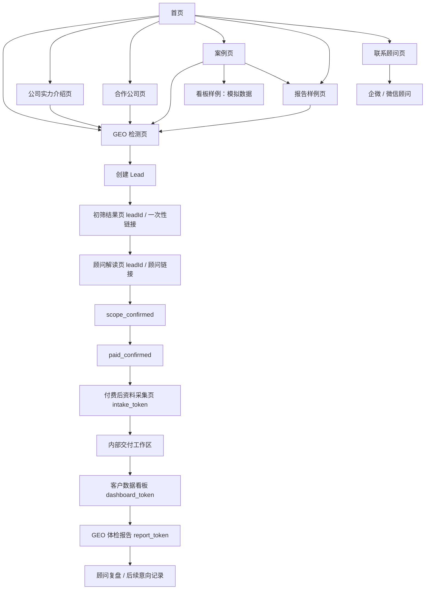

# GEO 服务商业化原型图层 v0.6

- 文档状态：Draft
- 文档版本：v0.6
- 最后更新时间：2026-05-07
- 文档目标：基于 PRD v0.6 输出页面信息架构、跳转关系、页面清单、权限、状态、异常和低保真草图，供 HTML 原型 Agent 和设计 / 测试使用。
- 主口径：必须服从 [01_GEO服务商业化_PRD_v0.6.md](/Users/liujun/Desktop/产品经理skill/projects/geo-service-prd/01_GEO服务商业化_PRD_v0.6.md)。
- 不做事项：不设计完整 SaaS 后台、客户侧 Agent 平台、独立服务开通页、独立解决方案页、真实公开数据看板、真实公开客户报告。

---

## 1. 页面信息架构图



---

## 2. 页面跳转关系

| 路径类型 | 跳转 |
|---|---|
| 公开获客 | 首页 -> GEO 检测页 -> 初筛结果页 -> 顾问解读 / 联系顾问 |
| 信任补充 | 首页 -> 公司实力介绍 / 合作公司 / 案例 / 报告样例 -> GEO 检测页 |
| 成交链路 | 初筛结果页 -> 顾问解读页 -> scope_confirmed -> paid_confirmed -> 资料采集页 |
| 交付链路 | 资料采集页 -> 内部交付工作区 -> 客户数据看板 -> GEO 体检报告 -> 顾问复盘 |
| 样例链路 | 案例页 -> 看板样例 / 报告样例，且只使用模拟数据 |
| 异常链路 | token 过期 / 无权限 -> 无权限提示页；未付费访问资料采集 -> 联系顾问确认服务 |

---

## 3. 页面清单

| 编号 | 页面 | 建议路由 | 页面目标 | 入口 |
|---|---|---|---|---|
| P01 | 首页 | `/` | 解释 GEO 价值，承接免费检测 | 公开导航 |
| P02 | GEO 检测页 | `/geo-check` | 提交免费检测表单 | 公开导航 |
| P03 | 公司实力介绍页 | `/strength` | 建立服务可信度 | 公开导航 |
| P04 | 合作公司页 | `/partners` | 展示合作生态和适配行业 | 公开导航 |
| P05 | 案例页 | `/cases` | 展示案例、看板样例、报告样例 | 公开导航 |
| P06 | 报告样例页 | `/report-sample` | 展示模拟报告结构 | 公开导航 |
| P07 | 联系顾问页 | `/contact` | 展示企微 / 微信顾问入口 | 公开导航 |
| P08 | 初筛结果页 | `/result/:leadId` | 展示免费检测简版结果 | leadId / 一次性链接 |
| P09 | 顾问解读页 | `/advisor/:leadId` | 解释初筛、确认范围和付费 | leadId / 顾问链接 |
| P10 | 付费后资料采集页 | `/intake/:token` | 收集正式检测资料 | intake_token |
| P11 | 客户数据看板页 | `/dashboard/:token` | 展示项目状态、指标和证据链 | dashboard_token |
| P12 | GEO 体检报告页 | `/report/:token` | 展示正式体检报告 | report_token |
| P13 | 内部交付工作区 | `/internal` | 内部交付管理 | 内部账号 |

---

## 4. 页面权限表

| 页面 | 访客 | 免费线索 | 付费客户 | 顾问 | 分析师 | 交付负责人 | 管理员 |
|---|---|---|---|---|---|---|---|
| 首页 / 公开页 | 可见 | 可见 | 可见 | 可见 | 可见 | 可见 | 可见 |
| GEO 检测页 | 可提交 | 可重复校验 | 可提交 | 可查看 | 可查看 | 可查看 | 可查看 |
| 初筛结果页 | 不可直接遍历 | leadId 可见 | 可见 | 可见 | 可见 | 可见 | 可见 |
| 顾问解读页 | 不可直接遍历 | leadId / 顾问链接可见 | 可见 | 可编辑状态 | 可查看 | 可查看 | 可查看 |
| 资料采集页 | 不可见 | 不可见 | intake_token 可见 | 可查看 | 可查看 | 可查看 | 可查看 |
| 客户数据看板 | 不可见 | 不可见 | dashboard_token 可见 | 可查看 | 可查看 | 可发布 | 可管理 |
| GEO 体检报告 | 不可见 | 不可见 | report_token 可见 | 可查看 | 可编辑复盘 | 可发布 | 可管理 |
| 内部工作区 | 不可见 | 不可见 | 不可见 | 按角色 | 按角色 | 按角色 | 全部 |

---

## 5. 页面状态表

| 页面 | 状态 | 展示 / 行为 |
|---|---|---|
| GEO 检测页 | 默认、填写中、提交中、提交成功、提交失败、重复提交 | 表单校验；成功后进入初筛结果或等待页 |
| 初筛结果页 | initial_detecting、result_ready、样本不足、已添加顾问 | 免费结果不输出正式 GEO 综合评分 |
| 顾问解读页 | advisor_added、scope_confirmed、paid_confirmed、closed_lost | 付费确认后才出现资料采集入口 |
| 资料采集页 | token 有效、草稿、提交成功、需补充、过期、撤销 | 只允许 intake_token |
| 客户看板页 | 待检测、检测中、复核中、已发布、待更新、无权限 | 未复核数据和无证据样本不展示 |
| 体检报告页 | 草稿不可见、待复核、已发布、风险阻断、无权限 | 关键结论可回到看板证据链 |
| 内部工作区 | 无数据、处理中、待复核、发布成功、发布失败 | 内部备注不得客户可见 |

---

## 6. 页面异常状态

| 异常 | 页面 | 处理 |
|---|---|---|
| 必填字段缺失 | GEO 检测 / 资料采集 | 标红字段并禁止提交 |
| leadId 不存在 | 初筛结果 / 顾问解读 | 展示结果不存在或联系顾问 |
| 未付费访问资料采集 | 资料采集 | 403 或展示“请先联系顾问确认服务” |
| token 过期 | 资料采集 / 看板 / 报告 | 展示无权限，并引导联系顾问 |
| token 类型不匹配 | 资料采集 / 看板 / 报告 | 403，无数据返回 |
| 看板未发布 | 客户看板 | 展示“数据复核中” |
| 样本无证据 | 客户看板 | 不进入客户可见样本 |
| 报告风险阻断 | 报告页 | 客户不可见，内部提示修订 |
| 跨项目访问 | 看板 / 报告 | 403，写入审计日志 |

---

## 7. 关键页面低保真草图

### 7.1 首页

```text
┌──────────────────────────────────────────────┐
| LOGO | 首页 | GEO检测 | 公司实力介绍 | 合作公司 | 案例 | 报告样例 | 联系顾问 |
├──────────────────────────────────────────────┤
| 你的品牌在 AI 搜索里被推荐了吗？              |
| 免费检测 ChatGPT / Gemini / Kimi 等 AI 可见性 |
| [公司名称] [官网] [行业] [主要竞品] [联系方式] |
| [免费检测我的品牌]                            |
| 注：免费检测为初筛，不代表正式诊断。           |
├──────────────────────────────────────────────┤
| 公司实力入口 | 合作公司入口 | 案例入口 | 报告样例入口 |
└──────────────────────────────────────────────┘
```

### 7.2 GEO 检测页

```text
┌──────────────────────────────┐
| 免费 GEO 检测                 |
| 公司名称 *                    |
| 官网 *                        |
| 行业 *                        |
| 主要竞品                      |
| 联系方式 *                    |
| [提交检测]                    |
| 提示：3 个问题初筛，不输出正式 GEO 综合评分 |
└──────────────────────────────┘
```

### 7.3 初筛结果页

```text
┌──────────────────────────────┐
| 初筛结果：样本 3 个问题 / 1-2 平台 |
| 品牌是否出现：是 / 否              |
| 竞品是否出现：是 / 否              |
| 初筛发现：...                     |
| [添加顾问解读] [查看报告样例]       |
| 注：免费检测不等同正式体检报告。     |
└──────────────────────────────┘
```

### 7.4 顾问解读页

```text
┌──────────────────────────────┐
| GEO 顾问                      |
| 初筛发现说明                   |
| 体检报告范围：30 问题 / 3 平台 / 3 竞品 |
| 服务边界：不承诺排名 / 推荐 / 线索 |
| [添加企微] [确认服务范围] [标记已付费-内部] |
└──────────────────────────────┘
```

### 7.5 付费后资料采集页

```text
┌──────────────────────────────┐
| 正式检测资料采集 intake_token |
| 品牌基础信息                  |
| 官网 / 产品 / 目标客户         |
| 3 个竞品                      |
| 资料链接 / 文件上传            |
| [保存草稿] [提交资料]          |
└──────────────────────────────┘
```

### 7.6 内部交付工作区

```text
┌──────────────────────────────────────────────┐
| 项目状态 | 资料 | 问题库 | 样本 | 证据 | 标注 | 指标 | 看板 | 报告 |
├──────────────────────────────────────────────┤
| 当前状态：review_pending                      |
| 待处理：2 条样本缺证据，1 条标注待复核          |
| [重算指标] [发布看板] [生成报告]                |
└──────────────────────────────────────────────┘
```

---

## 8. 客户看板样例

看板样例只能使用模拟数据；正式客户看板必须通过 `dashboard_token` 访问。

```text
┌──────────────────────────────────────────────┐
| 客户 A GEO 项目看板       最近更新：2026-05-07 |
| 状态：报告复核中                              |
├──────────────────────────────────────────────┤
| GEO 分数 62 | 提及率 40% | 推荐率 25% | 引用率 10% |
| 竞品压制率 35% | 证据完整度 100%              |
├──────────────────────────────────────────────┤
| 问题 | 平台 | 品牌出现 | 竞品出现 | 复核 | 证据 |
| ... | ... | 是       | 是       | 已复核 | [截图][对话链接] |
└──────────────────────────────────────────────┘
```

规则：

- 未复核数据不得进入客户看板。
- 无证据样本不得进入客户正式看板。
- 指标必须可回到样本范围和评分版本。
- 筛选平台后必须展示不可比提示或重新计算口径。

---

## 9. 报告样例

报告样例只能使用模拟数据；正式客户报告必须通过 `report_token` 访问。

```text
┌──────────────────────────────────────────────┐
| GEO 体检报告样例                              |
| 1. 执行摘要                                   |
| 2. 检测范围与样本说明                          |
| 3. GEO 综合评分                                |
| 4. 品牌提及与推荐表现                          |
| 5. 竞品出现与压制分析                          |
| 6. 引用来源分析                                |
| 7. 描述准确性                                  |
| 8. 内容缺口                                    |
| 9. 优化建议                                    |
| 10. 样本与证据链                               |
| 11. 风险说明                                   |
└──────────────────────────────────────────────┘
```

报告关键结论必须能回到看板证据链。

---

## 10. 访问 token 规则

| token | 访问页面 | 生成条件 | 失效条件 | 审计 |
|---|---|---|---|---|
| `intake_token` | `/intake/:token` | `scope_confirmed + paid_confirmed` | 过期、撤销、项目关闭 | 访问和提交写 AuditLog |
| `dashboard_token` | `/dashboard/:token` | 看板复核通过并发布 | 过期、撤销、重新发布 | 访问、证据点击、发布写 AuditLog |
| `report_token` | `/report/:token` | 报告复核和风险审查通过 | 过期、撤销、重新发布 | 访问、发布写 AuditLog |

token 类型不可混用；客户不能通过 token 访问其他项目。

---

## 11. 原型验收 Checklist

- [ ] 首页导航不出现真实客户数据看板。
- [ ] 首页导航不出现资料采集。
- [ ] 首页导航不出现真实客户报告。
- [ ] 首页导航不出现顾问解读作为独立后台入口。
- [ ] 看板样例只使用模拟数据。
- [ ] 客户正式看板通过 `dashboard_token` 访问。
- [ ] 客户正式报告通过 `report_token` 访问。
- [ ] 资料采集通过 `intake_token` 访问。
- [ ] 未复核数据不进入客户看板。
- [ ] 无证据样本不进入客户正式看板。
- [ ] 报告关键结论能回到看板证据链。

---

## 12. 版本记录

| 版本 | 日期 | 说明 |
|---|---|---|
| v0.6 | 2026-05-07 | 修复旧导航冲突，补页面权限、状态、异常、低保真草图、看板样例、报告样例和 token 规则。 |
