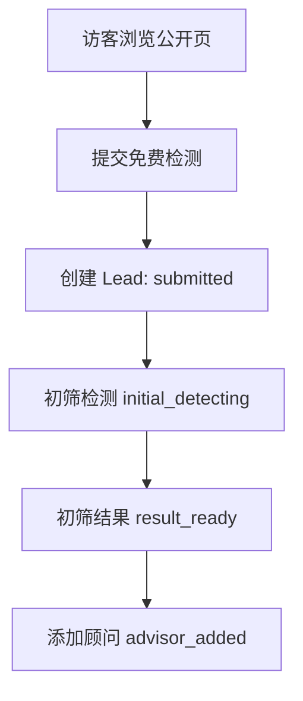
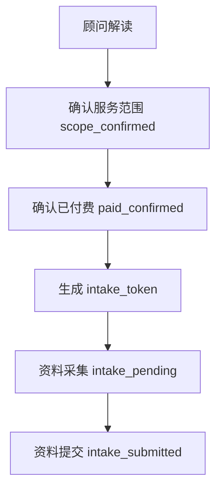
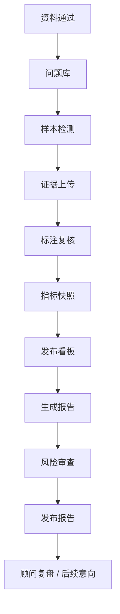

# GEO 服务商业化开发文档 v0.6

- 文档状态：Draft
- 文档版本：v0.6
- 最后更新时间：2026-05-07
- 文档目标：把 GEO 服务商业化 MVP 交付给研发负责人、Codex 开发 Agent 和测试 Agent，用于第一版开发拆解。
- 主口径：服从 [01_GEO服务商业化_PRD_v0.6.md](/Users/liujun/Desktop/产品经理skill/projects/geo-service-prd/01_GEO服务商业化_PRD_v0.6.md)。
- 不做事项：不做完整 SaaS、支付、合同、发票、代理商后台、自动检测平台、自动内容发布、自动外链、黑帽 GEO、独立服务开通页、独立解决方案页、客户侧 Agent 平台。

---

## 1. 开发目标

本期开发目标是跑通 GEO 服务商业化 MVP 主链路：

```text
公开页
-> 免费检测
-> 初筛结果
-> 顾问解读
-> scope_confirmed
-> paid_confirmed
-> intake_token 资料采集
-> 内部交付工作区
-> dashboard_token 客户看板
-> report_token 体检报告
-> 顾问复盘 / 后续意向记录
```

研发交付结果需要支持真实表单、真实线索、真实项目状态、真实 token 权限、真实证据链、真实指标快照、真实报告发布和审计日志。

---

## 2. 范围边界

### 2.1 本期必须做

| 模块 | 说明 |
|---|---|
| 公开页 | 首页、GEO 检测、公司实力介绍、合作公司、案例、报告样例、联系顾问。 |
| 免费检测 | 创建 Lead，展示初筛结果，不输出正式 GEO 综合评分。 |
| 顾问承接 | 记录添加顾问、范围确认、付费确认、流失原因。 |
| 资料采集 | `scope_confirmed + paid_confirmed` 后通过 `intake_token` 访问。 |
| 内部工作区 | 管理资料、竞品、问题、平台、样本、证据、标注、指标、报告和发布。 |
| 客户看板 | 通过 `dashboard_token` 展示已复核、证据完整的客户项目数据。 |
| 体检报告 | 通过 `report_token` 展示已复核、风险审查通过的报告。 |
| 审计日志 | 记录 token 访问、证据变更、复核、指标重算、看板发布、报告发布。 |

### 2.2 本期明确不做

| 不做 | 说明 |
|---|---|
| 完整客户登录后台 | 客户用 token 链接访问。 |
| 完整 SaaS 多租户后台 | 只做内部工作区和项目级隔离。 |
| 在线支付 / 合同 / 发票 | 由现有销售财务流程处理，系统只记录状态。 |
| 自动大规模检测平台 | 首期人工 / 半自动录入样本。 |
| 自动内容发布 / 外链建设 | 后置，且需要合规评估。 |
| 代理商后台 | 后置。 |
| 客户侧 Agent 平台 | 不做。 |
| 独立服务开通页 / 独立解决方案页 | 不做，服务确认由顾问承接。 |

---

## 3. 用户与权限

| 角色 | 权限 |
|---|---|
| 访客 | 浏览公开页，提交免费检测。 |
| 免费线索 | 通过 leadId / 一次性链接查看初筛结果和顾问入口。 |
| 付费客户 | 通过 intake / dashboard / report token 访问本项目资料采集、看板和报告。 |
| 顾问 | 查看线索、更新承接状态、确认服务范围、标记已付费、发送 token、记录复盘。 |
| 分析师 | 处理资料、问题库、样本、证据和标注草稿。 |
| 交付负责人 | 复核样本、证据、指标、看板、报告和客户可见文案。 |
| 管理员 | 管理角色、配置、token 撤销和审计日志。 |

权限原则：

- 客户不得访问其他项目数据。
- token 类型不可混用。
- 未复核样本不得进入正式指标。
- 无证据样本不得进入客户看板。
- 内部备注不得客户可见。

---

## 4. 页面与前端模块

| 页面 | 路由 | 核心模块 | 权限 |
|---|---|---|---|
| 首页 | `/` | 导航、免费检测入口、价值说明、信任入口 | 公开 |
| GEO 检测 | `/geo-check` | 免费检测表单、校验、提交 | 公开 |
| 公司实力介绍 | `/strength` | 能力、方法、证据链、人工复核 | 公开 |
| 合作公司 | `/partners` | 行业、生态、合作类型 | 公开 |
| 案例 | `/cases` | 模拟案例、看板样例、报告样例 | 公开 |
| 报告样例 | `/report-sample` | 模拟报告目录、模拟指标 | 公开 |
| 联系顾问 | `/contact` | 企微 / 微信入口、预约说明 | 公开 |
| 初筛结果 | `/result/:leadId` | 初筛结果、样本说明、顾问 CTA | leadId / 一次性链接 |
| 顾问解读 | `/advisor/:leadId` | 顾问信息、服务范围、付费确认状态 | leadId / 顾问 |
| 资料采集 | `/intake/:token` | 正式资料表单、草稿、提交 | intake_token |
| 客户看板 | `/dashboard/:token` | 项目状态、指标、样本、证据弹窗 | dashboard_token |
| 体检报告 | `/report/:token` | 报告章节、证据链入口、风险声明 | report_token |
| 内部工作区 | `/internal` | Lead、Project、Sample、Evidence、Metric、Report | 内部角色 |

公开导航必须为：首页、GEO 检测、公司实力介绍、合作公司、案例、报告样例、联系顾问。

---

## 5. 核心业务流程

### 5.1 获客流程



### 5.2 成交流程



### 5.3 交付流程



---

## 6. 数据模型

### 6.1 ER 关系概览

```text
leads -> advisor_handoffs -> customers -> projects
projects -> intake_submissions / competitors / assets / questions / detection_samples / metric_snapshots / reports / dashboard_publishes
detection_samples -> evidence / annotations
projects -> ai_jobs / audit_logs
```

### 6.2 数据库表结构草案

#### leads

| 字段名 | 类型 | 必填 | 默认值 | 主键 | 外键 | 索引 | 唯一 | 说明 |
|---|---|---|---|---|---|---|---|---|
| id | uuid | 是 | gen | 是 | 否 | 是 | 是 | 线索 ID |
| company_name | varchar(120) | 是 | 无 | 否 | 否 | 是 | 否 | 公司名称 |
| website | varchar(255) | 是 | 无 | 否 | 否 | 是 | 否 | 官网 |
| industry | varchar(80) | 是 | 无 | 否 | 否 | 是 | 否 | 行业 |
| competitors_text | text | 否 | null | 否 | 否 | 否 | 否 | 用户输入竞品 |
| contact_method | varchar(120) | 是 | 无 | 否 | 否 | 是 | 否 | 手机 / 微信 / 邮箱 |
| status | varchar(40) | 是 | submitted | 否 | 否 | 是 | 否 | Lead 状态 |
| source | varchar(80) | 否 | web | 否 | 否 | 是 | 否 | 来源 |
| created_at | datetime | 是 | now | 否 | 否 | 是 | 否 | 创建时间 |
| updated_at | datetime | 是 | now | 否 | 否 | 否 | 否 | 更新时间 |

#### advisor_handoffs

| 字段名 | 类型 | 必填 | 默认值 | 主键 | 外键 | 索引 | 唯一 | 说明 |
|---|---|---|---|---|---|---|---|---|
| id | uuid | 是 | gen | 是 | 否 | 是 | 是 | 承接 ID |
| lead_id | uuid | 是 | 无 | 否 | leads.id | 是 | 否 | 线索 |
| advisor_id | uuid | 否 | null | 否 | users.id | 是 | 否 | 顾问 |
| channel | varchar(40) | 是 | wecom | 否 | 否 | 是 | 否 | 企微 / 微信 |
| status | varchar(40) | 是 | pending | 否 | 否 | 是 | 否 | 承接状态 |
| scope_confirmed_at | datetime | 否 | null | 否 | 否 | 否 | 否 | 范围确认 |
| paid_confirmed_at | datetime | 否 | null | 否 | 否 | 否 | 否 | 付费确认 |
| lost_reason | varchar(255) | 否 | null | 否 | 否 | 否 | 否 | 流失原因 |
| created_at | datetime | 是 | now | 否 | 否 | 是 | 否 | 创建时间 |
| updated_at | datetime | 是 | now | 否 | 否 | 否 | 否 | 更新时间 |

#### customers

| 字段名 | 类型 | 必填 | 默认值 | 主键 | 外键 | 索引 | 唯一 | 说明 |
|---|---|---|---|---|---|---|---|---|
| id | uuid | 是 | gen | 是 | 否 | 是 | 是 | 客户 ID |
| lead_id | uuid | 是 | 无 | 否 | leads.id | 是 | 是 | 来源线索 |
| name | varchar(120) | 是 | 无 | 否 | 否 | 是 | 否 | 客户名 |
| contact_method | varchar(120) | 是 | 无 | 否 | 否 | 否 | 否 | 联系方式 |
| created_at | datetime | 是 | now | 否 | 否 | 是 | 否 | 创建时间 |

#### projects

| 字段名 | 类型 | 必填 | 默认值 | 主键 | 外键 | 索引 | 唯一 | 说明 |
|---|---|---|---|---|---|---|---|---|
| id | uuid | 是 | gen | 是 | 否 | 是 | 是 | 项目 ID |
| customer_id | uuid | 是 | 无 | 否 | customers.id | 是 | 否 | 客户 |
| lead_id | uuid | 是 | 无 | 否 | leads.id | 是 | 否 | 线索 |
| status | varchar(40) | 是 | paid_confirmed | 否 | 否 | 是 | 否 | 项目状态 |
| package_type | varchar(40) | 是 | health_check | 否 | 否 | 是 | 否 | 服务包 |
| owner_id | uuid | 是 | 无 | 否 | users.id | 是 | 否 | 负责人 |
| intake_token | varchar(128) | 否 | null | 否 | 否 | 是 | 是 | 资料 token 哈希或引用 |
| dashboard_token | varchar(128) | 否 | null | 否 | 否 | 是 | 是 | 看板 token 哈希或引用 |
| report_token | varchar(128) | 否 | null | 否 | 否 | 是 | 是 | 报告 token 哈希或引用 |
| token_expires_at | datetime | 否 | null | 否 | 否 | 是 | 否 | token 默认过期时间 |
| created_at | datetime | 是 | now | 否 | 否 | 是 | 否 | 创建时间 |
| updated_at | datetime | 是 | now | 否 | 否 | 否 | 否 | 更新时间 |

#### intake_submissions

| 字段名 | 类型 | 必填 | 默认值 | 主键 | 外键 | 索引 | 唯一 | 说明 |
|---|---|---|---|---|---|---|---|---|
| id | uuid | 是 | gen | 是 | 否 | 是 | 是 | 资料 ID |
| project_id | uuid | 是 | 无 | 否 | projects.id | 是 | 是 | 项目 |
| brand_name | varchar(120) | 是 | 无 | 否 | 否 | 是 | 否 | 品牌 |
| website | varchar(255) | 是 | 无 | 否 | 否 | 否 | 否 | 官网 |
| industry | varchar(80) | 是 | 无 | 否 | 否 | 是 | 否 | 行业 |
| target_audience | text | 是 | 无 | 否 | 否 | 否 | 否 | 目标客户 |
| status | varchar(40) | 是 | draft | 否 | 否 | 是 | 否 | 草稿 / 已提交 |
| submitted_at | datetime | 否 | null | 否 | 否 | 是 | 否 | 提交时间 |

#### competitors

| 字段名 | 类型 | 必填 | 默认值 | 主键 | 外键 | 索引 | 唯一 | 说明 |
|---|---|---|---|---|---|---|---|---|
| id | uuid | 是 | gen | 是 | 否 | 是 | 是 | 竞品 ID |
| project_id | uuid | 是 | 无 | 否 | projects.id | 是 | 否 | 项目 |
| name | varchar(120) | 是 | 无 | 否 | 否 | 是 | 否 | 竞品名称 |
| website | varchar(255) | 否 | null | 否 | 否 | 否 | 否 | 官网 |
| source | varchar(40) | 是 | customer | 否 | 否 | 是 | 否 | 客户提供 / 顾问建议 |
| confirmed | boolean | 是 | false | 否 | 否 | 是 | 否 | 是否确认 |

#### assets

| 字段名 | 类型 | 必填 | 默认值 | 主键 | 外键 | 索引 | 唯一 | 说明 |
|---|---|---|---|---|---|---|---|---|
| id | uuid | 是 | gen | 是 | 否 | 是 | 是 | 资料 ID |
| project_id | uuid | 是 | 无 | 否 | projects.id | 是 | 否 | 项目 |
| asset_type | varchar(40) | 是 | link | 否 | 否 | 是 | 否 | 文件 / 链接 |
| url | varchar(500) | 是 | 无 | 否 | 否 | 否 | 否 | 资料地址 |
| title | varchar(160) | 否 | null | 否 | 否 | 否 | 否 | 标题 |
| created_at | datetime | 是 | now | 否 | 否 | 是 | 否 | 创建时间 |

#### questions

| 字段名 | 类型 | 必填 | 默认值 | 主键 | 外键 | 索引 | 唯一 | 说明 |
|---|---|---|---|---|---|---|---|---|
| id | uuid | 是 | gen | 是 | 否 | 是 | 是 | 问题 ID |
| project_id | uuid | 是 | 无 | 否 | projects.id | 是 | 否 | 项目 |
| question_text | text | 是 | 无 | 否 | 否 | 否 | 否 | 问题 |
| question_type | varchar(40) | 是 | recommendation | 否 | 否 | 是 | 否 | 推荐 / 对比 / 风险等 |
| status | varchar(40) | 是 | draft | 否 | 否 | 是 | 否 | 状态 |
| created_at | datetime | 是 | now | 否 | 否 | 是 | 否 | 创建时间 |

#### platforms

| 字段名 | 类型 | 必填 | 默认值 | 主键 | 外键 | 索引 | 唯一 | 说明 |
|---|---|---|---|---|---|---|---|---|
| id | uuid | 是 | gen | 是 | 否 | 是 | 是 | 平台 ID |
| code | varchar(40) | 是 | 无 | 否 | 否 | 是 | 是 | 平台代码 |
| name | varchar(80) | 是 | 无 | 否 | 否 | 是 | 否 | 平台名称 |
| enabled | boolean | 是 | true | 否 | 否 | 是 | 否 | 是否启用 |

#### detection_samples

| 字段名 | 类型 | 必填 | 默认值 | 主键 | 外键 | 索引 | 唯一 | 说明 |
|---|---|---|---|---|---|---|---|---|
| id | uuid | 是 | gen | 是 | 否 | 是 | 是 | 样本 ID |
| project_id | uuid | 是 | 无 | 否 | projects.id | 是 | 否 | 项目 |
| question_id | uuid | 是 | 无 | 否 | questions.id | 是 | 否 | 问题 |
| platform_id | uuid | 是 | 无 | 否 | platforms.id | 是 | 否 | 平台 |
| raw_answer | text | 是 | 无 | 否 | 否 | 否 | 否 | 原始答案 |
| detected_at | datetime | 是 | 无 | 否 | 否 | 是 | 否 | 检测时间 |
| status | varchar(40) | 是 | draft | 否 | 否 | 是 | 否 | 状态 |

#### evidence

| 字段名 | 类型 | 必填 | 默认值 | 主键 | 外键 | 索引 | 唯一 | 说明 |
|---|---|---|---|---|---|---|---|---|
| id | uuid | 是 | gen | 是 | 否 | 是 | 是 | 证据 ID |
| sample_id | uuid | 是 | 无 | 否 | detection_samples.id | 是 | 否 | 样本 |
| screenshot_ref | varchar(500) | 否 | null | 否 | 否 | 否 | 否 | 截图引用 |
| conversation_url | varchar(500) | 否 | null | 否 | 否 | 否 | 否 | 对话链接 |
| source_urls | json | 否 | [] | 否 | 否 | 否 | 否 | 引用来源 |
| evidence_status | varchar(40) | 是 | pending | 否 | 否 | 是 | 否 | 状态 |
| created_at | datetime | 是 | now | 否 | 否 | 是 | 否 | 创建时间 |

约束：`screenshot_ref` 或 `conversation_url` 至少有一个。

#### annotations

| 字段名 | 类型 | 必填 | 默认值 | 主键 | 外键 | 索引 | 唯一 | 说明 |
|---|---|---|---|---|---|---|---|---|
| id | uuid | 是 | gen | 是 | 否 | 是 | 是 | 标注 ID |
| sample_id | uuid | 是 | 无 | 否 | detection_samples.id | 是 | 是 | 样本 |
| brand_mentioned | boolean | 是 | false | 否 | 否 | 是 | 否 | 是否提及 |
| brand_recommended | boolean | 是 | false | 否 | 否 | 是 | 否 | 是否推荐 |
| brand_cited | boolean | 是 | false | 否 | 否 | 是 | 否 | 是否引用 |
| competitor_present | boolean | 是 | false | 否 | 否 | 是 | 否 | 竞品出现 |
| competitor_suppressed | boolean | 是 | false | 否 | 否 | 是 | 否 | 竞品压制 |
| description_accuracy | varchar(40) | 否 | unknown | 否 | 否 | 是 | 否 | accurate / inaccurate |
| review_status | varchar(40) | 是 | pending | 否 | 否 | 是 | 否 | 复核状态 |
| reviewer_id | uuid | 否 | null | 否 | users.id | 是 | 否 | 复核人 |
| reviewed_at | datetime | 否 | null | 否 | 否 | 是 | 否 | 复核时间 |

#### metric_snapshots

| 字段名 | 类型 | 必填 | 默认值 | 主键 | 外键 | 索引 | 唯一 | 说明 |
|---|---|---|---|---|---|---|---|---|
| id | uuid | 是 | gen | 是 | 否 | 是 | 是 | 快照 ID |
| project_id | uuid | 是 | 无 | 否 | projects.id | 是 | 否 | 项目 |
| sample_scope | json | 是 | 无 | 否 | 否 | 否 | 否 | 样本范围 |
| platform_scope | json | 是 | 无 | 否 | 否 | 否 | 否 | 平台范围 |
| scoring_version | varchar(40) | 是 | geo_v0.1 | 否 | 否 | 是 | 否 | 评分版本 |
| metrics | json | 是 | 无 | 否 | 否 | 否 | 否 | 指标结果 |
| created_at | datetime | 是 | now | 否 | 否 | 是 | 否 | 创建时间 |

#### reports

| 字段名 | 类型 | 必填 | 默认值 | 主键 | 外键 | 索引 | 唯一 | 说明 |
|---|---|---|---|---|---|---|---|---|
| id | uuid | 是 | gen | 是 | 否 | 是 | 是 | 报告 ID |
| project_id | uuid | 是 | 无 | 否 | projects.id | 是 | 否 | 项目 |
| version | int | 是 | 1 | 否 | 否 | 是 | 否 | 报告版本 |
| content_ref | varchar(500) | 是 | 无 | 否 | 否 | 否 | 否 | 内容引用 |
| risk_review_status | varchar(40) | 是 | pending | 否 | 否 | 是 | 否 | 风险审查 |
| status | varchar(40) | 是 | draft | 否 | 否 | 是 | 否 | 报告状态 |
| published_at | datetime | 否 | null | 否 | 否 | 是 | 否 | 发布时间 |

#### dashboard_publishes

| 字段名 | 类型 | 必填 | 默认值 | 主键 | 外键 | 索引 | 唯一 | 说明 |
|---|---|---|---|---|---|---|---|---|
| id | uuid | 是 | gen | 是 | 否 | 是 | 是 | 发布 ID |
| project_id | uuid | 是 | 无 | 否 | projects.id | 是 | 否 | 项目 |
| metric_snapshot_id | uuid | 是 | 无 | 否 | metric_snapshots.id | 是 | 否 | 指标快照 |
| status | varchar(40) | 是 | draft | 否 | 否 | 是 | 否 | 发布状态 |
| published_at | datetime | 否 | null | 否 | 否 | 是 | 否 | 发布时间 |
| published_by | uuid | 否 | null | 否 | users.id | 是 | 否 | 发布人 |

#### ai_jobs

| 字段名 | 类型 | 必填 | 默认值 | 主键 | 外键 | 索引 | 唯一 | 说明 |
|---|---|---|---|---|---|---|---|---|
| id | uuid | 是 | gen | 是 | 否 | 是 | 是 | AI 任务 ID |
| project_id | uuid | 是 | 无 | 否 | projects.id | 是 | 否 | 项目 |
| job_type | varchar(40) | 是 | 无 | 否 | 否 | 是 | 否 | 问题草稿 / 风险检查 |
| input_ref | varchar(500) | 是 | 无 | 否 | 否 | 否 | 否 | 输入引用 |
| output_ref | varchar(500) | 否 | null | 否 | 否 | 否 | 否 | 输出引用 |
| status | varchar(40) | 是 | pending | 否 | 否 | 是 | 否 | 状态 |
| created_at | datetime | 是 | now | 否 | 否 | 是 | 否 | 创建时间 |

#### audit_logs

| 字段名 | 类型 | 必填 | 默认值 | 主键 | 外键 | 索引 | 唯一 | 说明 |
|---|---|---|---|---|---|---|---|---|
| id | uuid | 是 | gen | 是 | 否 | 是 | 是 | 日志 ID |
| actor_id | uuid | 否 | null | 否 | users.id | 是 | 否 | 操作人 |
| entity_type | varchar(80) | 是 | 无 | 否 | 否 | 是 | 否 | 实体类型 |
| entity_id | uuid | 是 | 无 | 否 | 否 | 是 | 否 | 实体 ID |
| action | varchar(80) | 是 | 无 | 否 | 否 | 是 | 否 | 动作 |
| before_hash | varchar(128) | 否 | null | 否 | 否 | 否 | 否 | 变更前哈希 |
| after_hash | varchar(128) | 否 | null | 否 | 否 | 否 | 否 | 变更后哈希 |
| created_at | datetime | 是 | now | 否 | 否 | 是 | 否 | 创建时间 |

---

## 7. API 边界

统一错误码：

| HTTP | 说明 |
|---|---|
| 400 | 字段缺失或格式错误 |
| 401 | 未登录 |
| 403 | 无权限或 token 无效 |
| 404 | 资源不存在 |
| 409 | 重复提交或状态冲突 |
| 422 | 数据不满足发布条件 |
| 500 | 服务异常 |

### 7.1 POST /api/leads

- 权限要求：公开。
- 失败场景：字段缺失、重复提交、官网格式错误。

请求：

```json
{"company_name":"示例科技","website":"https://example.com","industry":"ToB SaaS","competitors":["竞品A"],"contact_method":"wecom:demo","source":"home"}
```

响应：

```json
{"lead_id":"lead_001","status":"submitted","result_url":"/result/lead_001"}
```

### 7.2 GET /api/detect/:leadId

- 权限要求：leadId 或一次性结果链接。
- 失败场景：线索不存在、结果未生成。

请求：

```json
{"lead_id":"lead_001"}
```

响应：

```json
{"lead_id":"lead_001","status":"result_ready","sample_count":3,"summary":{"brand_appeared":true,"competitor_appeared":true},"advisor_url":"/advisor/lead_001"}
```

### 7.3 POST /api/internal/leads/:id/handoff

- 权限要求：顾问 / 销售。
- 失败场景：未登录、无权限、状态冲突。

请求：

```json
{"advisor_id":"user_001","status":"advisor_added","channel":"wecom","note":"客户已添加企微"}
```

响应：

```json
{"handoff_id":"handoff_001","lead_id":"lead_001","status":"advisor_added"}
```

### 7.4 POST /api/internal/projects

- 权限要求：顾问 / 交付负责人。
- 失败场景：未 `scope_confirmed`、未 `paid_confirmed`、重复创建。

请求：

```json
{"lead_id":"lead_001","customer_name":"示例科技","package_type":"health_check","scope_confirmed":true,"paid_confirmed":true}
```

响应：

```json
{"project_id":"proj_001","status":"intake_pending","intake_url":"/intake/tok_intake_xxx"}
```

### 7.5 GET /api/intake/:token

- 权限要求：有效 `intake_token`。
- 失败场景：token 过期、撤销、类型错误、未付费。

请求：

```json
{"token":"tok_intake_xxx"}
```

响应：

```json
{"project_id":"proj_001","status":"intake_pending","required_fields":["brand_name","website","industry","target_audience","competitors"]}
```

### 7.6 POST /api/intake/:token

- 权限要求：有效 `intake_token`。
- 失败场景：字段缺失、token 无效、状态冲突。

请求：

```json
{"brand_name":"示例品牌","website":"https://example.com","industry":"ToB SaaS","target_audience":"中大型企业市场部","competitors":["竞品A","竞品B","竞品C"],"assets":[{"type":"link","url":"https://example.com/cases"}]}
```

响应：

```json
{"intake_id":"intake_001","project_id":"proj_001","status":"intake_submitted"}
```

### 7.7 POST /api/internal/projects/:id/questions

- 权限要求：分析师 / 交付负责人。
- 失败场景：资料未提交、问题为空、重复导入。

请求：

```json
{"questions":[{"question_text":"请推荐适合企业市场部的SaaS工具","question_type":"recommendation"},{"question_text":"示例品牌和竞品A相比哪个更适合？","question_type":"comparison"}]}
```

响应：

```json
{"project_id":"proj_001","created_count":2,"status":"detecting"}
```

### 7.8 POST /api/internal/projects/:id/samples

- 权限要求：分析师。
- 失败场景：问题不存在、平台无效、原始答案为空。

请求：

```json
{"question_id":"q_001","platform_code":"chatgpt","raw_answer":"示例品牌和竞品A均可考虑...","detected_at":"2026-05-07T10:00:00+08:00"}
```

响应：

```json
{"sample_id":"sample_001","status":"evidence_pending"}
```

### 7.9 POST /api/internal/samples/:id/evidence

- 权限要求：分析师 / 交付负责人。
- 失败场景：截图和对话链接均为空、样本不存在。

请求：

```json
{"screenshot_ref":"files/evidence/sample_001.png","conversation_url":"https://ai.example/share/abc","source_urls":["https://example.com"]}
```

响应：

```json
{"evidence_id":"ev_001","sample_id":"sample_001","evidence_status":"pending"}
```

### 7.10 POST /api/internal/samples/:id/annotations

- 权限要求：分析师。
- 失败场景：样本无证据、字段格式错误。

请求：

```json
{"brand_mentioned":true,"brand_recommended":false,"brand_cited":true,"competitor_present":true,"competitor_suppressed":true,"description_accuracy":"accurate"}
```

响应：

```json
{"annotation_id":"ann_001","review_status":"pending"}
```

### 7.11 POST /api/internal/projects/:id/recalculate

- 权限要求：交付负责人。
- 失败场景：未复核样本、样本不足、评分版本缺失。

请求：

```json
{"sample_scope":{"batch":"v1"},"platform_scope":["chatgpt","gemini","kimi"],"scoring_version":"geo_v0.1"}
```

响应：

```json
{"metric_snapshot_id":"metric_001","geo_score":63.5,"metrics":{"mention_rate":0.4,"recommendation_rate":0.25,"citation_rate":0.1,"competitor_suppression_rate":0.35,"evidence_completeness":1}}
```

### 7.12 GET /api/dashboard/:token/metrics

- 权限要求：有效 `dashboard_token`。
- 失败场景：token 无效、看板未发布、跨项目访问。

请求：

```json
{"token":"tok_dash_xxx","platform_scope":["chatgpt"]}
```

响应：

```json
{"project_id":"proj_001","scoring_version":"geo_v0.1","sample_scope":{"reviewed":90},"metrics":{"geo_score":63.5,"mention_rate":0.4},"comparability_note":"筛选后指标不可与全量直接比较"}
```

### 7.13 GET /api/dashboard/:token/evidence/:sampleId

- 权限要求：有效 `dashboard_token` 且样本属于本项目。
- 失败场景：样本不属于项目、证据缺失、未复核。

请求：

```json
{"token":"tok_dash_xxx","sample_id":"sample_001"}
```

响应：

```json
{"sample_id":"sample_001","raw_answer_excerpt":"示例品牌...","screenshot_ref":"files/evidence/sample_001.png","conversation_url":"https://ai.example/share/abc","review_status":"approved"}
```

### 7.14 POST /api/internal/projects/:id/publish-dashboard

- 权限要求：交付负责人。
- 失败场景：未复核、无证据样本、指标未计算。

请求：

```json
{"metric_snapshot_id":"metric_001","expires_at":"2026-06-07T00:00:00+08:00"}
```

响应：

```json
{"dashboard_publish_id":"dashpub_001","dashboard_url":"/dashboard/tok_dash_xxx","status":"dashboard_published"}
```

### 7.15 POST /api/internal/projects/:id/reports

- 权限要求：报告撰写人 / 交付负责人。
- 失败场景：看板未发布、指标缺失、章节缺失。

请求：

```json
{"metric_snapshot_id":"metric_001","template_version":"report_v0.1","content_ref":"reports/proj_001_v1.md"}
```

响应：

```json
{"report_id":"report_001","version":1,"status":"draft","risk_review_status":"pending"}
```

### 7.16 GET /api/report/:token

- 权限要求：有效 `report_token`。
- 失败场景：token 无效、报告未发布、跨项目访问。

请求：

```json
{"token":"tok_report_xxx"}
```

响应：

```json
{"report_id":"report_001","project_id":"proj_001","version":1,"sections":["执行摘要","GEO综合评分","证据链"],"risk_note":"本报告不代表确定性排名承诺"}
```

### 7.17 POST /api/internal/reports/:id/publish

- 权限要求：交付负责人。
- 失败场景：风险审查未通过、看板未发布、报告未复核。

请求：

```json
{"expires_at":"2026-06-07T00:00:00+08:00","notify_advisor":true}
```

响应：

```json
{"report_id":"report_001","report_url":"/report/tok_report_xxx","status":"report_published","published_at":"2026-05-07T18:00:00+08:00"}
```

---

## 8. 看板证据链要求

- 客户可见样本必须已复核。
- 客户可见样本必须具备原始答案。
- `screenshot_ref` 或 `conversation_url` 至少有一个。
- 看板指标必须显示样本范围、平台范围、检测时间、评分版本。
- 证据弹窗必须展示原始答案摘要、截图 / 对话链接、平台、检测时间、复核状态。
- 无证据样本不得进入客户正式看板。
- 报告关键结论必须能回到看板证据链。

---

## 9. AI 辅助实现

AI 辅助不是 MVP 必做，只能作为内部草稿能力。

| 能力 | 客户可见 | 规则 |
|---|---|---|
| 问题库草稿 | 否 | 分析师确认后使用。 |
| 标注建议 | 否 | 交付负责人复核后才计入指标。 |
| 内容缺口草稿 | 否 | 必须追溯官网或样本。 |
| 报告草稿 | 复核后可见 | 风险审查通过后发布。 |
| 风险检查 | 否 | 命中风险词阻断发布。 |

---

## 10. 工程任务拆分

| 编号 | 任务 | 输出 | 验收 |
|---|---|---|---|
| T1 | 公开页和免费检测 | 首页、公开导航、表单、Lead API | 导航正确，表单可提交 |
| T2 | 初筛结果和顾问承接 | 结果页、顾问页、handoff API | lead 状态可流转 |
| T3 | 付费后资料采集 | intake token、资料表单 | 未付费不可访问 |
| T4 | 内部交付工作区 | 项目、资料、问题、样本、证据、标注 | 可维护交付数据 |
| T5 | 指标和看板 | 指标重算、快照、看板发布 | 已复核样本才计入 |
| T6 | 体检报告 | 报告草稿、风险审查、报告发布 | 看板发布后才能发布正式报告 |
| T7 | 审计日志和权限 | token 校验、AuditLog | 关键动作可追踪 |
| T8 | 测试和门禁 | Given / When / Then 用例 | 测试可执行 |

---

## 11. 测试要求

### 11.1 验收用例 Given / When / Then

#### 免费检测 5 条

1. 用例：公开用户提交完整免费检测  
Given 用户填写公司、官网、行业、联系方式  
When 提交 `/api/leads`  
Then 创建 Lead，状态为 `submitted`。

2. 用例：官网字段为空  
Given 用户未填写官网  
When 提交免费检测  
Then 返回 400，提示字段缺失。

3. 用例：重复提交  
Given 同一官网和联系方式已提交  
When 再次提交  
Then 返回 409 或合并线索。

4. 用例：免费检测不显示正式评分  
Given Lead 状态为 `result_ready`  
When 用户打开初筛结果页  
Then 不展示正式 GEO 综合评分。

5. 用例：初筛结果可进入顾问承接  
Given Lead 状态为 `result_ready`  
When 用户点击添加顾问  
Then 进入顾问解读页或企微入口。

#### 顾问承接 5 条

6. 用例：顾问记录已添加  
Given Lead 状态为 `result_ready`  
When 顾问提交 handoff 状态 `advisor_added`  
Then 状态更新成功。

7. 用例：未确认范围不能确认付费  
Given 状态不是 `scope_confirmed`  
When 顾问标记 `paid_confirmed`  
Then 返回 409。

8. 用例：范围确认记录服务边界  
Given 顾问完成解读  
When 提交 `scope_confirmed`  
Then 记录 30 问题、3 平台、3 竞品、看板、报告、复盘。

9. 用例：72 小时无回复进入回收  
Given 状态为 `advisor_added` 且超过 72 小时无跟进  
When 系统检查超时  
Then 标记待回收或 `closed_lost`。

10. 用例：禁用话术风险拦截  
Given 顾问备注包含“保证排名”  
When 保存话术  
Then 返回 422 或标记风险。

#### 付费后资料采集 5 条

11. 用例：未付费用户不能访问资料采集页  
Given 线索状态为 `result_ready`，且 `paid_confirmed=false`  
When 用户访问 `/intake/:token`  
Then 系统返回 403 或展示“请先联系顾问确认服务”  
And 不创建正式 Project。

12. 用例：已付费生成 intake token  
Given `scope_confirmed=true` 且 `paid_confirmed=true`  
When 创建 Project  
Then 返回 `intake_url`。

13. 用例：intake token 类型错误  
Given 用户使用 dashboard_token 访问资料采集  
When GET `/api/intake/:token`  
Then 返回 403。

14. 用例：资料缺竞品  
Given 客户未填写竞品  
When 提交资料  
Then 保存失败或标记需补充。

15. 用例：资料提交后进入检测准备  
Given intake 字段完整  
When POST `/api/intake/:token`  
Then 项目进入 `intake_submitted`。

#### 内部交付工作区 5 条

16. 用例：未提交资料不能建问题库  
Given Project 未 `intake_submitted`  
When 新增 questions  
Then 返回 409。

17. 用例：样本必须有原始答案  
Given raw_answer 为空  
When 创建 sample  
Then 返回 400。

18. 用例：证据至少有截图或链接  
Given screenshot_ref 和 conversation_url 均为空  
When 创建 evidence  
Then 返回 400。

19. 用例：未复核标注不参与指标  
Given annotation review_status=pending  
When recalculate  
Then 该样本不进入正式指标。

20. 用例：内部备注不客户可见  
Given 样本有 internal_note  
When 客户访问看板  
Then 响应不包含 internal_note。

#### 看板证据链 5 条

21. 用例：无证据样本不得发布看板  
Given 样本无 evidence  
When publish dashboard  
Then 返回 422。

22. 用例：未复核样本不得发布看板  
Given 样本 review_status=pending  
When publish dashboard  
Then 返回 422。

23. 用例：客户不能访问其他项目看板  
Given token 属于 proj_A  
When 请求 proj_B 样本证据  
Then 返回 403。

24. 用例：看板指标显示评分版本  
Given dashboard 已发布  
When 客户访问 metrics  
Then 响应包含 scoring_version。

25. 用例：证据弹窗可打开  
Given 样本证据完整  
When 客户点击证据  
Then 返回原始答案摘要、截图或对话链接。

#### 报告发布 5 条

26. 用例：未发布 dashboard 不得发布正式报告  
Given Project 未 `dashboard_published`  
When publish report  
Then 返回 409。

27. 用例：风险审查未通过不得发布报告  
Given report risk_review_status=blocked  
When publish report  
Then 返回 422。

28. 用例：report token 只能访问报告  
Given 用户使用 report_token 访问 dashboard  
When 请求 dashboard API  
Then 返回 403。

29. 用例：报告结论可追溯证据  
Given 报告已发布  
When 用户查看关键结论  
Then 可跳转到对应样本证据。

30. 用例：报告发布写审计日志  
Given 报告发布成功  
When 查询 audit_logs  
Then 存在 entity_type=report、action=publish 的记录。

---

## 12. 质量门禁

| 门禁 | 要求 |
|---|---|
| 范围门禁 | 不加入 MVP 范围外大模块。 |
| 导航门禁 | 公开导航不含真实客户看板、资料采集、真实报告。 |
| 权限门禁 | token 类型隔离，客户只能访问自己的项目。 |
| 数据门禁 | 未复核样本不进入指标，无证据样本不进客户看板。 |
| 报告门禁 | 看板发布后才能发布报告，报告风险审查通过。 |
| 审计门禁 | 关键发布动作写入 AuditLog。 |

---

## 13. 安全、隐私与合规

- token 不保存明文，建议保存哈希或引用。
- token 支持过期和撤销。
- 原始截图和对话链接按项目隔离。
- 客户资料、内部备注和交付记录不得泄露到公开页。
- 销售和报告文案禁止承诺排名、推荐、操控 AI 答案和固定线索量。
- 高风险行业需专业审核或暂不承接。

---

## 14. 人工确认点

| 确认点 | 负责人 | 时机 |
|---|---|---|
| 试点行业 | 业务负责人 | 销售启动前 |
| 报告价格 | 销售负责人 | 首批报价前 |
| 顾问企微配置 | 销售负责人 | 上线前 |
| 视觉模板 | 产品 / 设计 | 首批样板前 |
| 样本复核 | 交付负责人 | 指标计算前 |
| 风险文案 | 交付负责人 | 看板 / 报告发布前 |

---

## 15. 交付 Checklist

- [ ] 公开导航已统一为：首页、GEO 检测、公司实力介绍、合作公司、案例、报告样例、联系顾问。
- [ ] 公开导航不包含真实客户数据看板。
- [ ] 公开导航不包含资料采集。
- [ ] 公开导航不包含真实客户报告。
- [ ] 资料采集只能通过 `intake_token` 访问。
- [ ] 看板只能通过 `dashboard_token` 访问。
- [ ] 报告只能通过 `report_token` 访问。
- [ ] 看板样例使用模拟数据。
- [ ] 客户只能访问自己的项目。
- [ ] 未复核样本不得进入正式指标。
- [ ] 无证据样本不得进入客户看板。
- [ ] 报告结论可追溯到样本、证据和指标。
- [ ] 客户可见文案通过风险审查。
- [ ] 禁止承诺排名、推荐、操控 AI 答案、固定线索量。
- [ ] 关键发布动作写入 AuditLog。

---

## 16. 建议实现顺序

1. 公开导航、首页、GEO 检测表单、Lead 创建。
2. 初筛结果页、顾问解读页、handoff 状态。
3. Project 创建、`scope_confirmed + paid_confirmed`、`intake_token`。
4. 资料采集和内部项目工作区。
5. 问题、样本、证据、标注和复核。
6. 指标计算和 `MetricSnapshot`。
7. 客户看板、证据弹窗和 `dashboard_token`。
8. 报告草稿、风险审查、`report_token`。
9. 审计日志、权限测试和完整验收用例。

---

## 17. 状态机 × 权限联动表

| 状态 | 可见角色 | 可操作角色 | 可执行动作 | 下一个状态 | 禁止动作 | 异常处理 |
|---|---|---|---|---|---|---|
| submitted | 顾问、管理员 | 顾问 | 确认有效线索 | initial_detecting、closed_lost | 创建项目 | 字段缺失则补充 |
| initial_detecting | 顾问、分析师 | 分析师 | 初筛检测 | result_ready | 发布报告 | 平台不可用则记录 |
| result_ready | 客户、顾问、分析师 | 顾问 | 邀请加顾问 | advisor_added、closed_lost | 开放资料采集 | 样本不足提示 |
| advisor_added | 客户、顾问 | 顾问 | 解读、确认范围 | scope_confirmed、closed_lost | 创建报告 | 72 小时无回复回收 |
| scope_confirmed | 顾问、管理员 | 顾问 | 标记付费确认 | paid_confirmed、closed_lost | 开放看板 | 付款争议暂停 |
| paid_confirmed | 顾问、交付负责人 | 顾问、交付负责人 | 创建项目、生成 intake_token | intake_pending | 跳过资料采集 | 重复项目返回 409 |
| intake_pending | 客户、顾问、分析师 | 客户 | 填写资料 | intake_submitted | 检测 | token 过期重发 |
| intake_submitted | 顾问、分析师、交付负责人 | 分析师 | 审核资料、建问题库 | detecting | 发布看板 | 资料缺失退回 |
| detecting | 分析师、交付负责人 | 分析师 | 录入样本和证据 | review_pending | 发布报告 | 样本异常标记 |
| review_pending | 分析师、交付负责人 | 交付负责人 | 复核样本、证据、指标 | dashboard_published | 客户可见未复核结论 | 证据缺失退回 |
| dashboard_published | 客户、顾问、交付负责人 | 交付负责人 | 发布报告草稿 | report_published | 发布未复核报告 | 看板错误撤销 |
| report_published | 客户、顾问、交付负责人 | 顾问 | 预约复盘 | review_done | 修改已发布内容无版本 | 报告问题修订版本 |
| review_done | 顾问、客户成功 | 顾问 | 记录后续意向 | upsell_pending、closed_lost | 创建 MVP 外模块 | 客户异议记录 |
| upsell_pending | 顾问、销售负责人 | 顾问 | 跟进后续服务 | closed_lost | 自动开通服务 | 长期跟进 |
| closed_lost | 顾问、管理员 | 顾问、管理员 | 归档 / 重新激活 | submitted | 访问有效 token | 记录原因 |

---

## 18. 版本记录

| 版本 | 日期 | 说明 |
|---|---|---|
| v0.6 | 2026-05-07 | 补 API JSON 示例、数据库表结构、状态机权限联动、验收用例和交付 Checklist。 |
