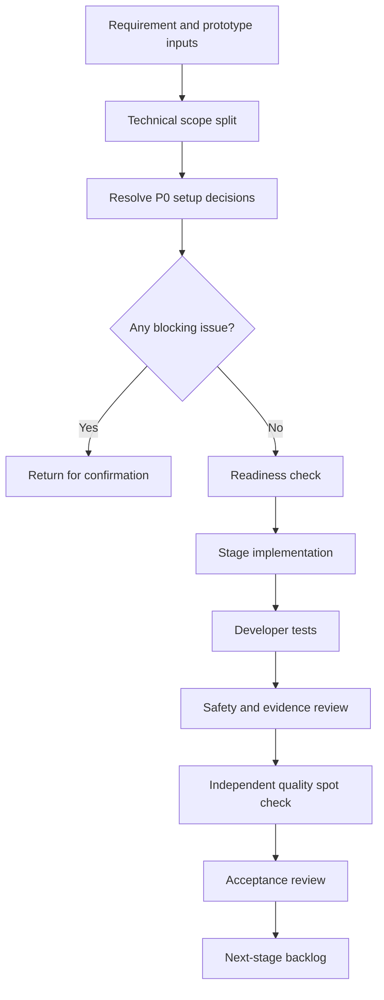

# B

- Document goal: define the implementation scope, phased delivery route, quality gates, acceptance standards, and task boundaries for the GEO service commercialization product.
- Paired requirement file: `01_prd.md`
- Paired prototype layer: `02_prototype_layer.md`
- Status: Draft
- Package level: B execution pack
- Last updated: 2026-05-05

---

## 0. Use Boundary

This document describes the implementation work needed to build the MVP conversion loop for the GEO service business:

Web acquisition, private-channel handoff, free GEO check, paid health-check report, traceable client dashboard, upgrade quote, and internal assisted delivery workflow.

This document does not include private operating frameworks, reusable governance rules, internal automation details, or owner-specific process assets. It also does not authorize a full SaaS platform, automated large-scale AI answer collection, automated content publishing, payment processing, invoicing, reseller portals, or black-hat GEO tactics.

---

## 1. Development Inputs

| Input | Path / Source | Required Use |
|---|---|---|
| Source brief | `00_source_brief.md` | Treat as normalized upstream thinking and constraints. |
| Product requirements | `01_prd.md` | Use as the source of truth for scope, product packages, service flow, metrics, risk boundaries, and acceptance. |
| Prototype layer | `02_prototype_layer.md` | Use for page / touchpoint structure, navigation, low-fidelity screen notes, and traceability requirements. |
| External references | PRD section 23 | Use only for context; verify source truth before production decisions. |

### 1.1 Confirmed Scope

- Web acquisition page and free check landing page.
- Free check submission and private-channel handoff.
- Lightweight free check result page.
- Customer intake form for paid health-check work.
- Traceable client dashboard with project status, samples, sources, metrics, actions, and update time.
- GEO health-check report generation workflow.
- Upgrade quote page / section for deep diagnosis, optimization project, and monthly operation.
- Internal data entry and review flow for questions, detection samples, annotations, evidence, metrics, reports, and risk checks.
- AI-assisted internal drafting for question generation, structured annotation, content-gap analysis, report drafting, and risk review.

### 1.2 Out of Scope

- Full customer account system with complex tenant administration.
- Fully automated AI platform crawling or large-scale detection.
- Automatic content publishing to customer CMS.
- Automatic backlink or third-party signal creation.
- Contract, payment, invoice, or accounting modules.
- Reseller / agency backend.
- Any guarantee that an AI platform will recommend, rank, or quote a customer.

### 1.3 Open Questions

| Priority | Question | Recommended Default | Implementation Impact |
|---|---|---|---|
| P0 | Which private-channel tool is used first? | Start with a configurable WeChat / enterprise contact link field. | Affects lead handoff and tracking fields. |
| P0 | What carrier is used for the MVP dashboard? | Build a lightweight Web dashboard with project-token access. | Affects authentication and permissions. |
| P1 | Which AI platforms are manually sampled first? | Use configurable platform names, not hard-coded platform logic. | Affects sample schema and filters. |
| P1 | Which report export format is required first? | Start with HTML / Markdown export, then PDF. | Affects reporting pipeline. |
| P1 | Should dashboard access require login or signed link? | MVP should use expiring signed links or project access tokens. | Affects access control and audit logging. |

Implementation can start with the recommended defaults, but production release must confirm P0 decisions.

---

## 2. Product / Development Boundary

The product promise is a measurable, traceable GEO service process: collect customer data, inspect AI answer samples, preserve evidence, calculate visibility metrics, show progress, and support service conversion.

The system must not present the service as AI answer control, ranking manipulation, or guaranteed lead generation. The product may show detected samples, trends, and recommendations, but every customer-visible conclusion must preserve source, sample, time, review status, and risk note.

Internal AI assistance is an efficiency layer. AI-generated questions, annotations, content-gap summaries, report drafts, and risk flags must remain reviewable by humans before customer delivery.

---

## 3. Development Flow

---

## 4. Delivery Route

### 4.1 Stage 1: MVP Conversion Loop

Goal: build the smallest usable loop from Web lead capture to traceable paid health-check delivery.

Deliverables:

- Web acquisition content page.
- Free GEO check landing page.
- Lead submission form with validation and duplicate handling.
- Configurable private-channel handoff link / QR code.
- Free check result page with sample count, preliminary score, risk note, and consultant CTA.
- Customer intake form for paid health-check service.
- Internal project workspace for questions, samples, annotations, evidence, metrics, and review status.
- Traceable client dashboard with project status, metric cards, sample table, source table, optimization actions, and update timestamp.
- Health-check report view / export.
- Upgrade quote section for deep diagnosis, optimization project, and monthly operation.

Delivered effect:

- A customer can enter through Web, submit a free check, move to private-channel contact, buy a health-check report, and view traceable progress and evidence.

Acceptance standards:

- Required lead fields validate correctly.
- A submitted lead can be converted into a customer project.
- A project can store at least 30 questions, 3 platforms, 3 competitors, raw answer records, annotations, source evidence, metrics, and report output.
- Dashboard metrics can be traced back to samples and calculation logic.
- Customer-visible views include update time and risk boundaries.
- No customer-visible copy promises ranking, guaranteed recommendation, or guaranteed leads.

### 4.2 Stage 2: Efficiency, Quality, and Retention

Goal: improve delivery efficiency, report quality, and monthly retention proof.

Deliverables:

- AI-assisted question generation from customer profile.
- AI-assisted structured annotation suggestions.
- AI-assisted content-gap and report draft generation.
- Risk-expression review before report / dashboard publication.
- Monthly trend dashboard.
- Optimization action tracking with status, owner, source problem, and update time.
- Report versioning and review status.

Delivered effect:

- The team can deliver reports faster while preserving human review and evidence traceability.
- Customers can see ongoing progress and trend changes during monthly operation.

Acceptance standards:

- AI suggestions are marked as draft until reviewed.
- Customer-visible findings require reviewed source evidence.
- Trend comparison warns when sample set or platform set changes.
- Monthly dashboard shows metric changes, actions completed, competitor changes, and next actions.

### 4.3 Stage 3: Operations, Permissions, and Scale

Goal: make the workflow reliable for multiple customers, operators, and service packages.

Deliverables:

- Role-based access for admin, service lead, analyst, sales / customer success, content operator, and customer viewer.
- Project templates for free check, health-check report, deep diagnosis, optimization project, and monthly operation.
- Dashboard access control with signed link or lightweight login.
- Audit log for sample changes, metric recalculation, report publication, dashboard updates, and quote changes.
- Configurable scoring weights and risk terms.
- Private-channel follow-up status tracking.
- Operational export for CSV / XLSX records.

Delivered effect:

- The service can handle more customers without losing data quality, access control, or review accountability.

Acceptance standards:

- Customer viewers cannot access other customer projects.
- Unreviewed high-risk conclusions cannot be published.
- Scoring changes are versioned and auditable.
- Follow-up states can show Web-to-private-channel conversion and sales progress.

### 4.4 Final Stage: Stable Release and Long-Term Evolution

Goal: prepare the product for stable release and future automation.

Deliverables:

- Production deployment plan.
- Monitoring and alerting for failed submissions, dashboard errors, report export errors, and delayed updates.
- Backup and recovery plan.
- Data retention policy.
- External AI / data integration approval checklist.
- Future backlog for automatic detection adapters, customer account system, agency portal, and deeper CRM / private-channel integration.

Delivered effect:

- The MVP can operate as a stable service product and has a controlled path toward platformization.

Acceptance standards:

- Production release has rollback instructions.
- Critical user paths are monitored.
- Data backup and recovery are tested.
- Future automation items are separated from MVP scope.

---

## 5. Recommended Technical Scope

### 5.1 Frontend Surfaces

| Surface | Users | Required Capabilities |
|---|---|---|
| Web acquisition content page | Public visitors | GEO value explanation, free check CTA, risk boundary copy. |
| Free check landing page | Prospective customers | Lead form, field validation, duplicate state, private-channel CTA. |
| Free check result page | Prospective customers | Preliminary score, 3-sample result, competitor signal, sample note, consultant CTA. |
| Customer intake form | Paid customers / sales | Brand, website, industry, competitors, target customers, files / links. |
| Traceable client dashboard | Paid customers / service team | Project status, metrics, sample evidence, source evidence, actions, update time, risk notes. |
| Health-check report view | Customer / sales | Metric summary, competitor comparison, content gaps, recommendations, quote CTA. |
| Quote page / section | Customer / sales | Package options, delivery scope, price range, service boundaries. |
| Monthly trend dashboard | Operation customers | Trend metrics, actions, competitor movement, next plan, comparability warning. |
| Internal workspace | Service team | Lead, project, question, sample, evidence, annotation, review, report, quote, and dashboard publication management. |

### 5.2 Backend Domains

- Lead and private-channel handoff.
- Customer and project management.
- Question bank and sample plan.
- Detection sample storage.
- Annotation and review.
- Source evidence storage.
- Metric calculation and snapshots.
- Dashboard publication.
- Report generation and versioning.
- Quote and package recommendation.
- Optimization action tracking.
- AI assistance jobs and review states.
- Audit logging.

### 5.3 Suggested Data Model

| Entity | Key Fields |
|---|---|
| Lead | id, company_name, website, industry, competitors_text, contact, source_channel, private_contact_status, created_at, status. |
| Customer | id, name, website, industry, owner_id, contact_info, created_at. |
| Project | id, customer_id, package_type, stage, owner_id, status, dashboard_access_mode, last_updated_at. |
| Competitor | id, project_id, name, website, notes, source. |
| Question | id, project_id, text, category, commercial_value, priority, status. |
| Platform | id, name, region, active, notes. |
| DetectionSample | id, project_id, question_id, platform_id, raw_answer, detected_at, collector_id, sample_batch, status. |
| Annotation | id, sample_id, brand_mentioned, brand_recommended, brand_cited, competitors_mentioned, sentiment, description_accuracy, reviewer_id, review_status. |
| SourceEvidence | id, project_id, sample_id, source_type, title, url, captured_at, evidence_summary, reliability_label. |
| MetricSnapshot | id, project_id, sample_scope, platform_scope, scoring_version, mention_rate, recommendation_rate, citation_rate, competitor_suppression_rate, accuracy_rate, geo_score, created_at. |
| OptimizationAction | id, project_id, action_type, linked_question_id, linked_gap, owner, status, due_date, updated_at. |
| Report | id, project_id, report_type, version, content, risk_review_status, published_at. |
| Quote | id, project_id, package_type, scope_summary, price_range, status, created_at. |
| DashboardEvent | id, project_id, event_type, actor_type, actor_id, created_at, metadata. |
| AiJob | id, project_id, job_type, input_ref, output_ref, model_tier, status, risk_flags, created_at, reviewed_at. |
| AuditLog | id, actor_id, entity_type, entity_id, action, before_hash, after_hash, created_at. |

### 5.4 API Boundary

| API Area | Example Endpoints | Notes |
|---|---|---|
| Lead | `POST /api/leads`, `GET /api/leads/:id` | Public create; internal read. |
| Private handoff | `POST /api/leads/:id/private-handoff`, `PATCH /api/leads/:id/follow-up` | Tracks private-channel conversion status. |
| Customer project | `POST /api/projects`, `GET /api/projects/:id`, `PATCH /api/projects/:id` | Internal first; customer access through dashboard link. |
| Questions | `POST /api/projects/:id/questions`, `GET /api/projects/:id/questions` | Supports manual and AI-assisted creation. |
| Samples | `POST /api/projects/:id/samples`, `GET /api/projects/:id/samples` | Must store raw answer and detected_at. |
| Annotations | `POST /api/samples/:id/annotations`, `PATCH /api/annotations/:id/review` | Review state required for publication. |
| Evidence | `POST /api/projects/:id/evidence`, `GET /api/projects/:id/evidence` | Stores source URL and captured time. |
| Metrics | `POST /api/projects/:id/recalculate`, `GET /api/projects/:id/metrics` | Calculation version must be recorded. |
| Dashboard | `GET /dashboard/:token`, `POST /api/projects/:id/publish-dashboard` | Token access must be scoped and auditable. |
| Reports | `POST /api/projects/:id/reports`, `GET /api/reports/:id`, `POST /api/reports/:id/export` | Publication blocked by risk review. |
| Quotes | `POST /api/projects/:id/quotes`, `GET /api/projects/:id/quotes` | No payment processing in MVP. |
| AI jobs | `POST /api/projects/:id/ai-jobs`, `GET /api/ai-jobs/:id` | Draft output only until reviewed. |

---

## 6. AI Implementation Requirements

### 6.1 AI Tasks

| Task | Input | Output | Customer Visible | Required Review |
|---|---|---|---|---|
| Customer profile analysis | Website, industry, competitors | Target users, buying scenarios, question directions | No | Analyst confirmation. |
| Question generation | Customer profile, industry template | Categorized AI search questions | No | Remove low-value and duplicate questions. |
| Structured annotation suggestion | Raw AI answer, brand, competitors | Mention / recommendation / citation / sentiment suggestions | No | Review before metrics or report use. |
| Content-gap analysis | Website summary, questions, competitor notes | Page and content gap suggestions | Only after review | Source and feasibility check. |
| Report draft | Metrics, samples, gaps, actions | Draft report text | Only after review | Fact, source, and risk check. |
| Risk review | Report and dashboard copy | Risk flags and blocked terms | No | Required before publication. |

### 6.2 AI Guardrails

- AI outputs must be stored as draft until reviewed.
- Customer-visible claims must link to reviewed samples or source evidence.
- Confidence, source status, and risk notes must be stored for AI-assisted conclusions.
- The system must block or flag phrases that imply guaranteed recommendation, ranking, platform control, or guaranteed leads.
- Medical, financial, legal, or other high-risk industry conclusions require additional professional review or exclusion from MVP service.
- Model provider, cost tier, cross-border data behavior, and data retention policy require approval before production use.

---

## 7. Readiness Check

| Check | Requirement | Blocking |
|---|---|---|
| Scope | MVP includes Web acquisition, private handoff, free check, health-check report, traceable dashboard, quote, and review workflow | Yes |
| Prototype input | Touchpoint IA, navigation, low-fidelity notes, and traceability rules are available in `02_prototype_layer.md` | Yes |
| Private handoff | First private-channel tool and handoff method are selected | Yes for release, No for local prototype |
| Dashboard access | Signed link or lightweight login decision is confirmed | Yes for release |
| Data model | Lead, project, sample, annotation, evidence, metric, report, quote, and audit models are approved | Yes |
| AI plan | AI tasks, draft/review boundaries, risk review, and provider policy are clear | Yes before AI production |
| Safety | No guaranteed ranking / recommendation / lead wording is enforced | Yes |
| Report export | First export format is selected | No for MVP preview, Yes for delivery |

---

## 8. Engineering Task Packages

Each task package must include:

- Goal.
- Input documents.
- Allowed change scope.
- Forbidden change scope.
- Expected output.
- Data / API impact.
- Testing requirements.
- Safety and compliance requirements.
- Approval points.
- Minimal fix strategy.

### 8.1 Task Package Matrix

| Package | Goal | Allowed Change Scope | Expected Output | Validation |
|---|---|---|---|---|
| T1 Lead and landing flow | Build Web acquisition and free check submission | Public pages, lead API, validation, tracking events | Landing page, lead form, private handoff CTA | Form validation and duplicate tests. |
| T2 Internal project workspace | Convert lead into customer project | Internal project UI, project API, customer / competitor / question models | Project setup and sample plan management | CRUD and permission tests. |
| T3 Traceable dashboard | Show customer-visible evidence and progress | Dashboard UI, token access, metric and evidence API | Project status, metrics, samples, sources, actions | Traceability and access tests. |
| T4 Detection and annotation records | Store samples, raw answers, annotations, review states | Sample, annotation, evidence models and screens | Reviewed sample dataset | Review-state tests and metric recalculation tests. |
| T5 Reporting and quote | Generate health-check report and upgrade quote | Report view, export pipeline, quote model | Report page / export and quote section | Risk-blocking and export tests. |
| T6 AI-assisted drafting | Add internal AI draft jobs | AI job service, prompt templates, draft outputs, risk flags | Draft question / annotation / report assistance | Draft-only and review-required tests. |
| T7 Monthly trend and actions | Support retention and monthly operation | Trend dashboard, action tracker, comparability warning | Monthly dashboard and action status | Trend scope and warning tests. |
| T8 Release readiness | Prepare stable release | Monitoring, logs, backup, deployment config, acceptance records | Release checklist and rollback plan | Smoke, backup, and rollback checks. |

---

## 9. Quality Gates

| Gate | Pass Standard |
|---|---|
| Scope gate | No full SaaS backend, payment system, auto-crawling, auto-publishing, reseller backend, or black-hat GEO features are added to MVP. |
| Conversion gate | Web lead, private handoff, free result, paid project, dashboard, report, and quote path works end to end. |
| Traceability gate | Metrics trace to sample set, platform, raw answer, detected time, source evidence, and calculation version. |
| Review gate | Unreviewed AI output or high-risk conclusions cannot be published to customer views. |
| Safety gate | Customer-visible copy avoids guaranteed recommendation, ranking, platform control, or guaranteed leads. |
| Access gate | Customer dashboard access is scoped to one project and logged. |
| Testing gate | Unit, API, UI, access, metric, report, and safety tests pass or documented substitute checks are completed. |
| Release gate | Monitoring, backup, rollback, and known-risk notes are ready. |

---

## 10. Testing Requirements

### 10.1 Core Path Tests

- Visitor submits free check form.
- Submitted lead shows private-channel handoff CTA.
- Lead converts to customer project.
- Analyst creates / imports questions.
- Analyst records raw answer samples.
- Analyst adds annotations and evidence.
- Reviewer approves sample and report.
- Metrics recalculate from reviewed samples.
- Customer dashboard shows project status, metrics, samples, sources, actions, update time, and risk note.
- Health-check report can be generated and linked to dashboard.
- Quote can be displayed after report.

### 10.2 Negative and Edge Tests

- Missing required lead fields.
- Invalid website URL.
- Duplicate lead submission.
- Project with insufficient competitors.
- Sample without raw answer.
- Metric calculation with unreviewed samples.
- Dashboard token for wrong project.
- Expired dashboard link.
- Report with blocked risk terms.
- Trend view with changed sample set.
- AI job failure and fallback to manual workflow.

### 10.3 Data Quality Tests

- Every sample has platform, question, raw answer, detected time, and collector.
- Every source has source type, URL when applicable, captured time, and reliability label.
- Every metric snapshot has sample scope and scoring version.
- Every dashboard publication has update time.
- Every customer-visible report has review status.

---

## 11. Security, Privacy, and Compliance

- Store customer non-public materials as restricted project data.
- Do not expose raw internal notes on customer dashboards.
- Do not show one customer's samples, competitors, reports, or actions to another customer.
- Log dashboard access and publication events.
- Do not send sensitive customer materials to AI providers without approved data policy.
- Customer-visible pages must include service boundary language: detection, diagnosis, optimization, tracking, and review are provided; guaranteed AI recommendation, ranking, and lead volume are not.
- High-risk industries require an additional review flag before delivery.

---

## 12. Approval Points

Approval is required before:

- Changing MVP product scope.
- Adding a full customer account system or tenant administration.
- Adding payment, invoice, or contract modules.
- Adding external CRM, private-channel, AI platform, or data-source integrations.
- Changing database schema after development starts.
- Changing AI model provider, high-cost model tier, cross-border data behavior, or data retention policy.
- Publishing production customer-facing pages.
- Displaying automated AI-derived conclusions without human review.
- Deleting or migrating customer data.

---

## 13. Delivery Checklist

- [ ] Product scope and non-scope match `01_prd.md`.
- [ ] Touchpoints match `02_prototype_layer.md`.
- [ ] P0 setup decisions are resolved or documented with MVP defaults.
- [ ] Lead capture and private handoff work end to end.
- [ ] Customer intake and project setup work.
- [ ] Questions, samples, annotations, evidence, and metrics are stored with source and time.
- [ ] Traceable dashboard shows project status, metrics, samples, sources, actions, update time, and risk note.
- [ ] Health-check report and upgrade quote are generated from reviewed data.
- [ ] AI assistance remains draft-only until reviewed.
- [ ] Customer-visible copy passes safety review.
- [ ] Access control prevents cross-customer data exposure.
- [ ] Tests and release checks are recorded.
- [ ] Known issues and next-stage backlog are documented.

---

## 14. Handoff Notes

Recommended MVP implementation order:

1. Build the lead and free check submission path.
2. Build internal project, question, sample, annotation, and evidence management.
3. Build metric calculation and traceable dashboard.
4. Build report and quote generation.
5. Add private-channel status tracking.
6. Add AI-assisted internal drafting.
7. Add monthly trend and action tracking.

Keep automation shallow until the service package, dashboard evidence model, and report review flow are proven with real pilot customers.
