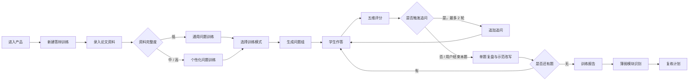
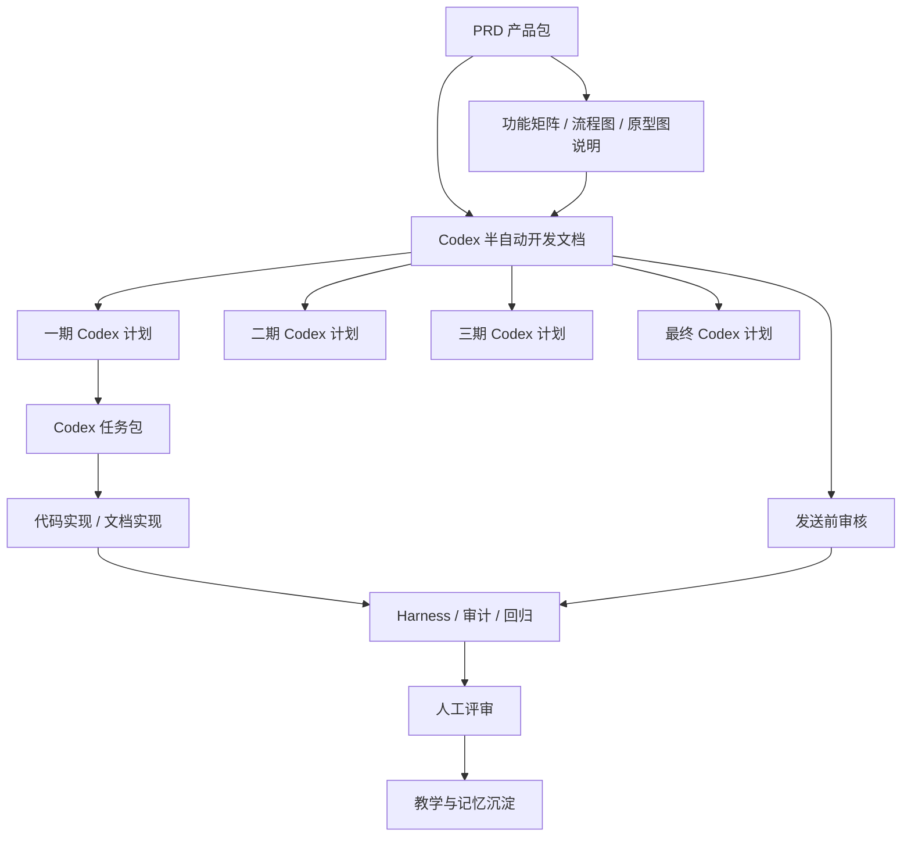

# 毕业答辩辅导智能体：完整交付包预览

- 项目 ID：`graduation-defense-agent`
- 文档状态：Draft Review
- 生成时间：2026-04-25
- 生成方式：基于用户资料 `text/.md/答辩.md`、PRD 产品包、功能矩阵、流程图、原型图和 Codex 分期开发文档整理
- 阅读目标：让评审者一次性看到“产品要做什么”和“Codex 如何分期开发”。PRD 部分可以合并为一个产品包；Codex 开发执行部分必须单独输出。

---

## 0. 交付包结构

| 序号 | 文档 | 作用 | 评审重点 |
| --- | --- | --- | --- |
| 1 | `02_prd.generated.md` | PRD 产品包，包含用户、场景、目标、范围、需求、功能矩阵、流程图、原型图说明、风险 | 产品判断是否成立 |
| 2 | `feature_matrix.md` | PRD 产品包的同步拆分文件，便于单独评审功能优先级 | MVP 是否收敛 |
| 3 | `prototype/product_flow.md` | PRD 产品包的同步拆分文件，便于渲染主流程、页面流、状态流、异常流 | 流程是否完整 |
| 4 | `prototype/prototype_preview.md` | PRD 产品包的同步拆分文件，便于查看 MVP 四个核心页面 | MVP 页面是否支撑一期流程 |
| 5 | `prototype/full_prototype.md` | PRD 产品包的同步拆分文件，覆盖一期、二期、三期和最终阶段页面 | 全量页面是否覆盖产品规划 |
| 6 | `delivery/codex_development_plan.md` | Codex 半自动开发总文档 | 开发框架是否可执行 |
| 7 | `delivery/phase_1_codex_plan.md` | 一期开发文档 | MVP 文字训练闭环 |
| 8 | `delivery/phase_2_codex_plan.md` | 二期开发文档 | 个人训练效率增强 |
| 9 | `delivery/phase_3_codex_plan.md` | 三期开发文档 | 导师与机构协作 |
| 10 | `delivery/final_codex_plan.md` | 最终阶段开发文档 | 平台化和多模态扩展 |
| 11 | `delivery/codex_development_review.md` | Codex 开发文档发送前审核 | 是否最优、可执行、存在阻碍 |

---

## 1. 产品一句话

毕业答辩辅导智能体面向即将答辩的学生，通过“录入论文信息 -> 模拟老师提问 -> 学生作答 -> 智能追问 -> 五维评分 -> 示范改写 -> 薄弱点复练”的训练闭环，帮助学生在正式答辩前发现回答空泛、证据不足、逻辑混乱、不会反思和临场应变弱等问题。

---

## 2. 用户与问题

### 2.1 首发用户

MVP 首发聚焦：

- 本科毕业生；
- 成人教育 / 专升本学生；
- 即将参加毕业答辩、需要低成本多轮练习的人群。

后续扩展：

- 硕士研究生；
- 导师 / 辅导老师；
- 教培机构；
- 学校 / 学院。

### 2.2 核心问题

| 问题 | 用户表现 | 产品机会 |
| --- | --- | --- |
| 不知道老师怎么问 | 只背 PPT 和摘要 | 提供模块化问题库和模拟提问 |
| 回答缺少证据 | 只讲结论，不讲数据、文献、实验或章节 | 通过追问强化证据意识 |
| 不会解释方法 | 只说用了某方法，不知道为什么适合 | 用方法证据类问题训练 |
| 不会回应质疑 | 被问不足、局限、创新点时卡壳 | 做压力追问和示范改写 |
| 通用 AI 容易编造 | 生成看似完整但不属于自己论文的答案 | 做学术诚信边界和待补充占位 |

---

## 3. 产品定位

本产品不是“答辩稿生成器”，而是“答辩训练系统”。

| 不主打 | 主打 |
| --- | --- |
| 一键生成标准答案 | 根据学生回答继续追问 |
| 替学生编论文内容 | 基于真实资料组织表达 |
| 承诺答辩通过 | 提升训练完成度和复练效率 |
| 静态题库 | 问题、追问、评分、改写、报告闭环 |

---

## 4. MVP 范围

### 4.1 In Scope

| 模块 | MVP 内容 |
| --- | --- |
| 论文资料 | 论文题目、专业、学历、论文类型、摘要、目录、研究方法、核心结论、创新点、不足 |
| 训练配置 | 训练模式、题数、追问强度 |
| 问题库 | 150 题结构化，包含模块、主问题、追问、考察点、回答要点、常见失误 |
| 模拟答辩 | 老师问题、文字作答、追问、评分 |
| 五维评分 | 熟悉度、逻辑性、证据意识、反思能力、表达能力 |
| 单题复盘 | 原回答、扣分原因、示范改写、待补充依据 |
| 训练报告 | 五维均分、薄弱模块、典型问题、复练题单 |
| 复练计划 | 根据低分模块加权抽题 |
| 学术诚信 | 拦截代写、编造、规避检测等请求 |
| 隐私控制 | 删除论文资料和训练记录 |

### 4.2 Out of Scope

- 语音输入、录音回放、视频模拟；
- 上传完整论文并自动解析；
- 导师端、机构后台、班级管理；
- 学校规范库和教务系统集成；
- 支付、会员和商业化；
- 论文查重、降重或规避 AI 检测。

---

## 5. 核心产品流程



---

## 6. 页面原型

MVP 原型预览图：


全量低保真原型图：


| 页面 | 目标 | 核心内容 | 主按钮 |
| --- | --- | --- | --- |
| P1 新建训练 | 建立训练上下文 | 论文资料、资料完整度、训练模式、追问强度 | 开始生成问题 |
| P2 模拟答辩 | 完成老师提问和学生作答 | 问题卡、考察点、回答输入、追问原因、五维评分 | 提交回答 |
| P3 单题复盘 | 学会如何改回答 | 原回答、扣分原因、示范改写、待补充依据 | 下一题 |
| P4 训练报告 | 明确薄弱点和下一步 | 五维均分、模块表现、典型问题、复练计划 | 开始复练 |
| P5-P6 | 完成一期闭环和隐私控制 | 复练训练、资料管理、删除提示 | 提交复练 / 删除资料 |
| P7-P11 | 二期个人效率增强 | PPT/章节输入、趋势、专项复练、导出、题库标签 | 生成页级问题 / 导出 |
| P12-P15 | 三期协作 | 学生授权、导师任务、授权报告、班级批量报告 | 确认授权 / 发布任务 |
| P16-P18 | 最终平台化 | 语音、视频、规范库、组织看板 | 提交语音 / 查看脱敏趋势 |

---

## 7. 功能矩阵摘要

| 模块 | P0 MVP | P1 V1 | P2 V1.5 / Future |
| --- | --- | --- | --- |
| 论文资料 | 基本资料、摘要、目录、方法、结论、完整度判断 | PPT 大纲输入 | 完整论文上传解析 |
| 训练配置 | 训练模式 | 题数、难度、追问强度细化 | 多端训练策略 |
| 问题库 | 150 题结构化、按模式抽题、去重 | 专业分类题库、题库标签扩展 | 学校规范库和知识图谱 |
| 模拟答辩 | 文字作答、动态追问 | 计时、专项复练 | 语音、视频模拟 |
| 评分反馈 | 五维评分、原因、建议 | 历史趋势 | 组织级质量分析 |
| 单题复盘 | 示范改写、待补充依据 | 按章节/PPT 页复盘 | 多模态表达反馈 |
| 训练报告 | 薄弱模块、典型问题、复练题单 | 导出复习清单 | 导师/机构批量报告 |
| 隐私诚信 | 删除资料、删除记录、诚信拦截 | 历史可删除、导出边界 | 授权、脱敏、撤回 |

---

## 8. 训练模式

| 模式 | 目标 | 默认题数 | 典型问题 |
| --- | --- | ---: | --- |
| 基础核验 | 检查是否熟悉论文基本内容 | 5 | 论文做了什么、为什么选题、核心结论是什么 |
| 理解深挖 | 检查理解深度和章节逻辑 | 6 | 文献不足、理论基础、研究问题之间的关系 |
| 方法证据 | 检查方法、数据和证据链 | 6 | 为什么选这个方法、数据是否可靠、结果如何证明结论 |
| 压力反驳 | 模拟老师质疑 | 5 | 创新点是否成立、不足如何回应、如果老师不同意怎么办 |
| 全流程模拟 | 接近真实答辩 | 8 | 混合抽题，覆盖开场、方法、结果、不足和展望 |

---

## 9. 评分与追问规则

### 9.1 五维评分

| 维度 | 高分表现 | 低分表现 | 权重建议 |
| --- | --- | --- | ---: |
| 熟悉度 | 能说出论文细节、章节、数据、过程 | 只会背摘要或 PPT | 25% |
| 逻辑性 | 先结论后依据，层次清楚 | 语序混乱，答非所问 | 20% |
| 证据意识 | 能引用数据、文献、实验、案例 | 只有主观判断 | 25% |
| 反思能力 | 能承认不足并提出改进 | 一味说没有问题 | 15% |
| 表达能力 | 简洁、准确、自然 | 过长、空泛、术语堆砌 | 15% |

### 9.2 追问触发

| 回答问题 | 识别线索 | 追问方向 |
| --- | --- | --- |
| 回答空泛 | 泛化词多，缺少论文对象 | 要求结合章节、数据或案例 |
| 缺少依据 | 有判断无来源 | 追问数据、文献、实验来源 |
| 背诵感强 | 长句堆砌，不能解释 | 要求用自己的话说明 |
| 没有体现个人工作 | 只讲资料来源或他人成果 | 追问哪些工作是自己完成的 |
| 过度夸大 | 使用绝对化表达 | 要求更谨慎并补证据 |
| 回避不足 | 不回应局限或质疑 | 追问如何承认边界和改进 |
| 方法解释不清 | 只列方法名 | 追问为什么适合研究问题 |
| 答非所问 | 没回答原因、依据、过程或结果 | 拉回老师问题本身 |

---

## 10. 学术诚信与隐私边界

| 风险请求 | 系统处理 |
| --- | --- |
| 帮我编一个实验数据 | 拒绝，并提示只能基于真实数据组织表达 |
| 帮我写不存在的访谈结果 | 拒绝，并提示可整理真实访谈记录 |
| 帮我规避 AI 检测 | 拒绝，并提示遵守学校学术规范 |
| 我没做这部分，帮我答得像做过 | 拒绝，并引导如实说明研究边界 |

隐私规则：

- 论文摘要、目录、回答记录属于敏感学习资料；
- MVP 必须支持删除论文资料和训练记录；
- 导出报告默认不包含完整论文资料；
- 未经授权，不向导师或第三方展示个人训练内容；
- 外部模型调用需要明确数据处理边界。

---

## 11. Codex 半自动开发总结构



主开发流程：

```mermaid
flowchart LR
  A["1. PRD 产品包"] --> D["2. Codex 总开发文档"]
  D --> E["3. 分期 Codex 计划"]
  E --> F["4. Codex 任务包"]
  F --> R["5. 发送前审核"]
  R --> G["6. 人工确认"]
  G --> H["7. Codex 半自动开发"]
  H --> I["8. Harness / 测试 / 审计"]
  I --> J["9. 用户评审"]
  J --> K["10. 教学与记忆沉淀"]
  K --> L["11. 下一期迭代"]
```



---

## 12. 分期开发总览

| 阶段 | 阶段目标 | 用户可见效果 | Codex 开发重点 | 需要人工确认 |
| --- | --- | --- | --- | --- |
| 一期 | 打通 MVP 文字版训练闭环 | 学生能完成训练、看报告、进入复练 | 页面、题库、会话、评分追问、报告、诚信拦截 | 范围、账号、模型、数据存储 |
| 二期 | 提升个人训练效率和复练质量 | 可按 PPT/章节训练，看历史趋势 | PPT 大纲、历史趋势、题库标签、复练优化 | 是否做语音、题库扩展策略 |
| 三期 | 支持导师/机构协作 | 导师可授权查看报告，机构可批量训练 | 多角色、授权、班级、批量报告、后台 | B 端范围、组织权限、数据脱敏 |
| 最终 | 平台化答辩训练 | 多模态训练和组织质量管理 | 语音视频、学校规范库、知识图谱、组织看板 | 商业化、隐私、长期数据策略 |

---

## 12.1 Codex 开发文档发送前审核

| 项目 | 结论 |
| --- | --- |
| 审核 Skill | `codex-development-plan-reviewer` |
| 审核报告 | `delivery/codex_development_review.md` |
| 审核结论 | `warn` |
| 可发送状态 | 可以发送用户评审 |
| 可实现状态 | 暂缓实现，先完成 P0 人工确认 |
| 主要阻碍 | 技术栈、数据存储、模型供应商、题库 schema、Prompt 回归样例未确认 |

审核规则：以后所有 Codex 开发文档在发送给用户前，都必须先经过该审核 Skill，明确是否为 `pass`、`warn` 或 `fail`。`warn` 可以发送评审，但不能直接开工；`fail` 需要先修文档结构。

---

## 13. 一期 Codex 开发文档摘要

### 13.1 阶段目标

打通 MVP 文字训练闭环。学生录入论文资料后，完成模拟答辩、获得追问和五维评分、查看单题复盘、生成训练报告，并从报告进入复练。

### 13.2 一期范围

包含：

- 论文资料录入和资料完整度判断；
- 训练模式选择；
- 问题库结构化和抽题；
- 文字作答；
- 动态追问；
- 五维评分；
- 单题复盘和示范改写；
- 训练报告和复练计划；
- 学术诚信拦截；
- 删除论文资料和训练记录。

不包含：

- 语音、视频、导师端、机构后台；
- 上传完整论文并自动解析；
- 学校规范库；
- 支付和商业化。

### 13.3 一期任务包

| task_id | goal | allowed_write_paths | forbidden_write_paths | validation | human_confirmation_points |
| --- | --- | --- | --- | --- | --- |
| P1-T1 | 建立题库数据和抽题规则 | `app/data/**`, `app/services/question*` | `projects/**/02_prd.generated.md` | 单场不重复抽题 | 题库结构 |
| P1-T2 | 实现训练会话主链路 | `app/services/training*`, `app/api/training*` | `memory-cache/**` | 创建、开始、完成训练 | 数据模型 |
| P1-T3 | 实现回答评价和追问 | `app/services/evaluation*`, `app/ai/**` | `plugins/**` | 固定样例评分稳定 | 模型调用 |
| P1-T4 | 实现前端四页面 | `web/**`, `app/static/**` | `projects/**/delivery/**` | 页面流程可走通 | UI 评审 |
| P1-T5 | 实现报告、复练、删除 | `app/services/report*`, `app/services/retry*` | `projects/**/02_prd.generated.md` | 报告生成、删除可用 | 隐私文案 |
| P1-T6 | 风控和学术诚信拦截 | `app/services/moderation*`, `app/ai/**` | `pm-prd-copilot/memory/**` | 高风险样例拦截 | 拦截策略 |

### 13.4 一期验收

- 主流程完整可用；
- 资料不足时不编造事实；
- 高风险请求可拦截；
- 删除资料和训练记录可用；
- 报告可自然进入复练；
- Harness 无 fail。

---

## 14. 二期 Codex 开发文档摘要

### 14.1 阶段目标

提升个人复练效率和个性化程度。学生可按 PPT 页或论文章节训练，查看多轮训练趋势，并针对指定薄弱模块进行专项复练。

### 14.2 二期范围

包含：

- PPT 大纲 / 章节文本输入；
- 按页或按章节生成问题；
- 训练历史趋势；
- 专项复练；
- 题库标签扩展；
- 难度和追问强度配置；
- 导出复习清单。

不包含：

- 导师端、班级管理、机构后台；
- 视频训练；
- 学校规范库。

### 14.3 二期任务包

| task_id | goal | validation | human_confirmation_points |
| --- | --- | --- | --- |
| P2-T1 | PPT/章节输入与页级题目绑定 | 大纲生成题目 | 输入字段 |
| P2-T2 | 历史趋势服务 | 两轮训练趋势展示 | 数据保留周期 |
| P2-T3 | 专项复练 | 指定模块复练 | 模块策略 |
| P2-T4 | 导出复习清单 | 不导出完整论文资料 | 导出范围 |

---

## 15. 三期 Codex 开发文档摘要

### 15.1 阶段目标

从个人训练扩展到辅导协作。学生授权后，导师可查看训练报告；机构或班级可查看训练完成率和薄弱模块汇总。

### 15.2 三期范围

包含：

- 多角色账号；
- 学生授权导师查看报告；
- 导师创建训练任务；
- 班级训练完成情况；
- 批量薄弱模块报告；
- 机构后台基础统计。

不包含：

- 学校教务系统深度集成；
- 视频模拟；
- 商业支付系统。

### 15.3 三期任务包

| task_id | goal | validation | human_confirmation_points |
| --- | --- | --- | --- |
| P3-T1 | 多角色和授权模型 | 未授权不可查看 | 权限模型 |
| P3-T2 | 导师端任务 | 创建班级任务 | B 端范围 |
| P3-T3 | 批量报告 | 报告脱敏 | 脱敏规则 |
| P3-T4 | 导出与审计日志 | 权限日志完整 | 导出权限 |

---

## 16. 最终阶段 Codex 开发文档摘要

### 16.1 阶段目标

把产品升级为答辩训练平台。个人可进行更真实的多模态训练，导师/机构/学校可在授权和脱敏前提下做质量管理。

### 16.2 候选能力

- 语音训练；
- 视频模拟；
- 学校规范库；
- 个性化知识图谱；
- 组织质量看板；
- 多端入口。

### 16.3 最终阶段任务包

| task_id | goal | validation | human_confirmation_points |
| --- | --- | --- | --- |
| PF-T1 | 语音训练子阶段 | 权限和删除测试 | 语音权限 |
| PF-T2 | 学校规范库 | source trace 检查 | 规范来源 |
| PF-T3 | 长期画像 | 删除和解释测试 | 画像策略 |
| PF-T4 | 组织看板 | 脱敏检查 | 组织指标 |

---

## 17. 人工确认点

| gate | 说明 |
| --- | --- |
| `prd_scope` | 修改 MVP、目标用户、核心流程 |
| `database_schema` | 新增或变更数据库结构 |
| `external_api` | 接入外部模型、存储、监控、支付 |
| `mcp_integration` | 接入新 MCP 或扩大 MCP 权限 |
| `registry_harness` | 新增 registry、artifact、steward、harness 规则 |
| `model_change` | 选择、替换、升级模型 |
| `github_push` | 推送远程仓库、创建 PR |
| `destructive_data` | 删除数据库、清理历史数据 |
| `skill_update` | 修改通用 Skill 或记忆机制 |
| `memory_update` | 写入长期记忆或项目 approved cache |

---

## 18. Harness 与质量门禁

| 检查 | 用途 |
| --- | --- |
| `registry` | 检查 artifact、skill、steward 注册完整 |
| `plugin_boundary` | 检查通用插件不泄漏项目路径和项目特定内容 |
| `agentic_delivery` | 检查 Codex 半自动开发文档结构完整 |
| `codex_development_review` | 检查开发文档发送前是否完成最优性、阻碍、可执行性和确认点审核 |
| `ai_solution` | 检查模型、Prompt、RAG、Memory 方案 |
| `source_trace` | 检查资料来源和外部信号边界 |
| `prototype_preview_gate` | 检查流程图和原型图存在 |
| `efficiency` | 检查重复输出和无效调用 |
| `random_audit` | 抽查越界风险 |
| `skill_generalization` | 检查通用 Skill 是否可跨项目复用 |

当前项目验证命令：

```bash
.venv/bin/python harness/run_harness.py --base-dir . --project graduation-defense-agent --mode advisory
```

当前验证状态：

- Harness status：`pass`
- 关键门禁：`registry`、`plugin_boundary`、`agentic_delivery`、`ai_solution`、`skill_generalization` 均通过

---

## 19. 教学与记忆沉淀

本项目中已经形成的通用规则：

| 用户反馈 | 沉淀位置 | 规则 |
| --- | --- | --- |
| PRD 不要混开发方案 | 通用 Skill / open lesson | Codex 开发文档必须从 PRD 产品包分离；功能矩阵、流程图和原型图说明可放在 PRD 内 |
| 每期都要 Codex 半自动开发文档 | `agentic-delivery-orchestrator` | 一期、二期、三期、最终都要有独立 Codex 执行文档 |
| 开发文档发送前要专门审核 | `codex-development-plan-reviewer` | 发送前检查是否最优、能否执行、是否有阻碍、是否缺人工确认 |
| 要有原型图、流程图、功能矩阵 | PRD 产物契约 | PRD 产品包必须包含或同步拆分这些评审产物 |
| Codex 开发放到开发文档里 | delivery planning 模块 | 开发任务包、GitHub、Harness、教学沉淀都进入开发文档 |

记忆写入原则：

- 当前项目页面、题库、报告偏好先进入项目候选偏好；
- 跨项目通用规则进入 open lesson 或 Skill update proposal；
- 稳定记忆、Skill、Harness 更新必须人工确认；
- 不同项目的 Skill 和记忆不能互相污染。

---

## 20. 当前评审建议

建议你按以下顺序看：

1. 先看本文件，判断整体结构是否符合你要的“完整交付包”；
2. 再看 `02_prd.generated.md`，它现在是 PRD 产品包，重点看产品判断、功能矩阵、流程图和原型图说明；
3. 如果需要单独评审，再看 `feature_matrix.md`、`prototype/product_flow.md`、`prototype/prototype_preview.md` 和 `prototype/full_prototype.md`；
4. 看 `delivery/codex_development_plan.md`，确认 Codex 开发总框架；
5. 看 `delivery/codex_development_review.md`，确认发送前审核结论和阻碍点；
6. 看一期到最终阶段文档，确认开发拆解是否能直接交给 Codex 执行。

---

## 21. 下一步可改进项

| 优先级 | 改进项 | 说明 |
| --- | --- | --- |
| P0 | 补更细的题库结构样例 | 从 150 题中抽 20-30 题做标准化 JSON / YAML 样例 |
| P0 | 补 Prompt 回归样例 | 针对空泛回答、编造数据、回避不足做测试样例 |
| P1 | 做高保真交互原型 | 从四页低保真升级到可点击 Web 原型 |
| P1 | 拆数据库 ERD | 把 ThesisProfile、TrainingSession、AnswerEvaluation 等模型细化 |
| P1 | 拆接口文档 | 为 Codex 开发一期接口和前后端协作准备 |
| P2 | 做导师端扩展原型 | 三期前再展开授权和班级报告 |

---

## 22. 版本记录

| 版本 | 日期 | 修改人 | 内容 |
| --- | --- | --- | --- |
| v1.0 | 2026-04-25 | Codex | 生成完整交付包预览，串联 PRD、功能矩阵、流程图、原型图和 Codex 分期开发文档 |
| v1.1 | 2026-04-25 | Codex | 按用户口径调整：PRD 部分可整合为产品包，只有 Codex 开发部分必须单独输出 |
| v1.2 | 2026-04-25 | Codex | 新增 Codex 开发文档发送前审核机制和审核报告 |
| v1.3 | 2026-04-25 | Codex | 新增全量低保真原型图，覆盖一期、二期、三期和最终阶段页面 |
