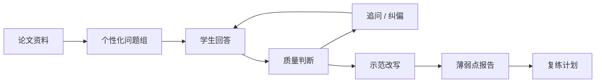
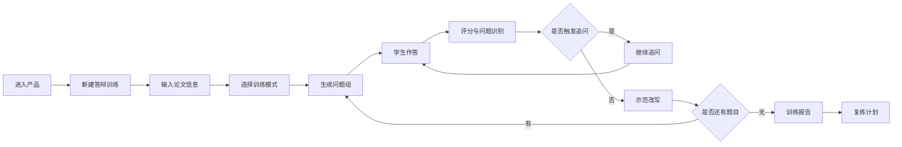
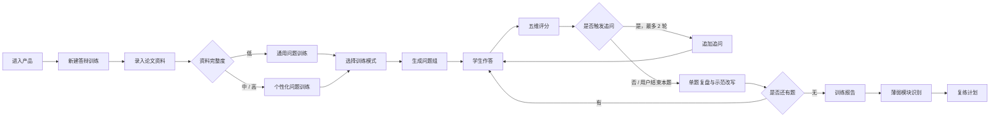
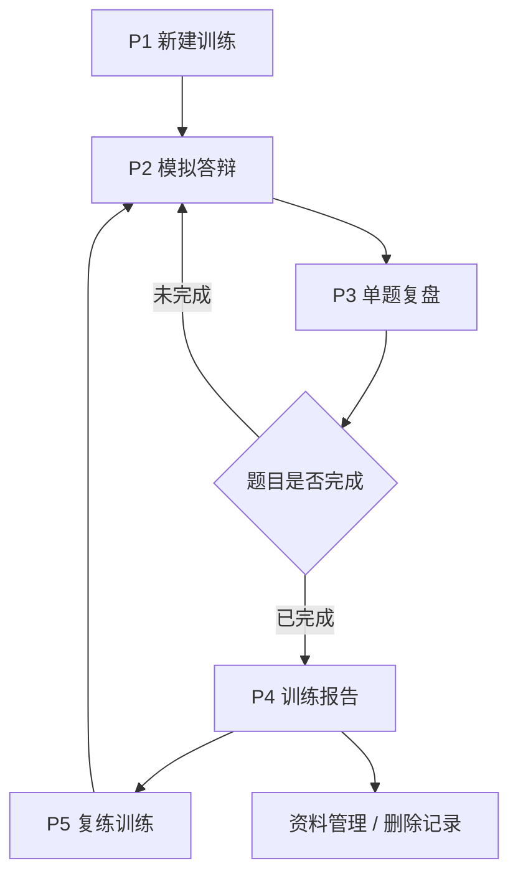

# 毕业答辩辅导智能体 PRD

- 文档状态：Draft
- 文档 Owner：PM Copilot
- 业务线 / 项目：AI 教育工具 / 毕业答辩训练
- 项目 ID：`graduation-defense-agent`
- 需求来源：用户提供资料 `/Users/liujun/Desktop/产品经理skill/text/.md/答辩.md`
- 优先级：P0
- 首发平台假设：Web/H5，兼容 PC 与移动浏览器
- 文档版本：v0.5
- 最后更新时间：2026-04-25
- 外部信息状态：本版主要基于用户资料和项目内已有规划，不把外部网页信号作为已验证事实
- 文档口径：
  - 本 PRD 是产品包，可包含功能矩阵、流程图和原型图说明。
  - `feature_matrix.md`、`prototype/product_flow.md`、`prototype/prototype_preview.md`、`prototype/full_prototype.md` 作为产品包的同步拆分文件，便于渲染、复用和单独评审。
  - Codex 半自动开发文档必须单独输出：`projects/graduation-defense-agent/delivery/codex_development_plan.md`

---

## 1. 一句话摘要

毕业答辩辅导智能体面向即将参加毕业答辩的学生，通过“录入论文信息 → 模拟老师提问 → 学生作答 → 智能追问 → 五维评分 → 示范改写 → 薄弱点复练”的训练闭环，帮助学生在正式答辩前发现回答空泛、证据不足、逻辑混乱、不会反思和临场应变弱等问题，并提升答辩准备效率。

---

## 2. 背景与问题定义

### 2.1 当前背景

毕业答辩不是简单复述论文，而是老师对学生研究理解、方法掌握、证据链、表达能力、学术规范和临场应变的综合考察。用户提供的资料已经整理出 150 个典型答辩问题，覆盖开场概括、选题背景、文献综述、核心概念、理论基础、研究问题、研究方法、数据来源、问卷设计、访谈研究、实验设计、统计分析、理工技术、结果结论、创新贡献、不足反思、应用落地、论文结构、写作规范、学术伦理、答辩表达、压力追问、专业基础和未来展望等模块。

当前学生常见准备方式包括背 PPT、背摘要、搜索模板答案、请同学模拟、向导师请教或使用通用 AI 问答。这些方式能解决部分材料准备问题，但不足在于：

- 难以根据学生回答质量继续追问；
- 难以判断回答是否真正结合自己的论文；
- 难以持续记录薄弱点并安排复练；
- 难以在学术诚信边界内给出可用的表达改写。

### 2.2 问题定义

| 角色 | 发生场景 | 问题表现 | 影响 |
| --- | --- | --- | --- |
| 本科毕业生 | 答辩前 1-2 周集中准备 | 只会背稿，不知道老师会追问什么 | 现场被问细节时卡壳 |
| 成人教育 / 专升本学生 | 对论文流程和答辩规范不熟 | 不知道如何解释选题、方法和结论 | 准备效率低，依赖模板 |
| 硕士研究生 | 方法、数据、创新点被深挖 | 不能清楚解释依据、边界和局限 | 显得研究不扎实 |
| 导师 / 辅导老师 | 批量辅导学生 | 重复提问和纠错耗时 | 个性化辅导不足 |
| 教培机构 | 提供答辩辅导服务 | 标准化训练和反馈难 | 服务质量不稳定 |

### 2.3 根因假设

- 学生准备重点偏“材料产出”，如 PPT、讲稿和模板答案，缺少问答训练。
- 普通题库只能列问题，不能判断学生回答质量，也不能追问。
- 学生缺少稳定回答结构，不知道如何把论文中的章节、数据、方法和结论组织成现场回答。
- 答辩现场存在打断、反问、质疑和压力追问，学生缺少低成本、多轮次的模拟环境。
- 通用 AI 容易给出看似完整但未必来自学生论文的答案，存在学术诚信和事实幻觉风险。

### 2.4 证据与资料来源

| 来源 | 内容 | 可用方式 | 边界 |
| --- | --- | --- | --- |
| 用户资料 `答辩.md` | 150 个答辩问题、追问规则、评分维度、回答模板 | 作为问题库、追问规则和评分体系的核心来源 | 不等于完整产品需求，需要产品化拆解 |
| 项目内已有产物 | `feature_matrix.md`、`product_flow.md`、`prototype_preview.md`、`full_prototype.md` | 作为 PRD 产品包的同步拆分文件 | 若与本 PRD 冲突，以本版 PRD 为待评审版本 |
| 外部工具/竞品信号 | 答辩 PPT、答辩稿、问题预测、通用 AI 问答等替代方案 | 仅作为竞品类型参考 | 未做真实性、市场规模和效果验证 |

---

## 3. 为什么现在做

| 维度 | 判断 |
| --- | --- |
| 时间窗口 | 毕业季前后学生集中准备答辩，需求高峰明显，但准备周期短。 |
| 用户痛点 | 学生不是缺“一个答案”，而是缺“老师式追问、纠偏和复练”。 |
| 技术窗口 | 大模型适合执行提问、追问、评分、改写和训练报告生成，但需要边界控制。 |
| 产品机会 | 多数替代方案偏材料生成，本产品可聚焦动态答辩训练闭环。 |
| 不做的代价 | 如果只做题库或答辩稿生成，容易同质化，难以形成持续训练价值。 |

---

## 4. 目标用户 / 角色 / JTBD

### 4.1 目标用户

| 用户群体 | 高频场景 | 核心痛点 | 使用动机 | 优先级 |
| --- | --- | --- | --- | --- |
| 本科毕业生 | 答辩前快速自测 | 不知道老师会怎么问，回答空泛 | 低成本多轮练习 | P0 |
| 成人教育 / 专升本学生 | 对论文和答辩流程不熟 | 学术表达和规范意识弱 | 需要结构化辅导 | P0 |
| 硕士研究生 | 方法、数据、创新点被深挖 | 需要更专业的证据链训练 | 降低现场问答风险 | P1 |
| 导师 / 辅导老师 | 批量辅导学生 | 重复提问、逐个纠错耗时 | 提升辅导效率 | P1 |
| 教培机构 | 标准化答辩辅导服务 | 服务难规模化 | 产品化交付训练服务 | P2 |
| 学校 / 学院 | 提升答辩准备质量 | 需要规范训练和质量观察 | 组织级质量管理 | P2 |

### 4.2 首发目标用户

MVP 首发聚焦 **本科毕业生和成人教育/专升本学生**。原因：

- 准备周期短，答辩焦虑明显；
- 通用问题库和回答模板已经能提供较高价值；
- 对文字版训练接受度高，不需要一开始做语音和导师端；
- 产品验证成本低，适合先验证训练闭环。

### 4.3 JTBD

| 场景 | 用户希望 | 以便 |
| --- | --- | --- |
| 答辩前第一次准备 | 快速知道老师可能怎么问 | 避免只背 PPT |
| 回答被追问时 | 学会补充依据、边界和反思 | 降低现场卡壳风险 |
| 对研究方法不熟 | 用自己的论文内容解释方法选择 | 证明自己真正理解论文 |
| 答辩前最后复盘 | 针对低分模块集中复练 | 把有限时间用在最薄弱处 |

---

## 5. 目标 / 非目标

### 5.1 业务目标

| 目标 | 说明 | MVP 指标建议 |
| --- | --- | --- |
| 降低答辩准备成本 | 让学生无需反复找人陪练，也能完成多轮模拟 | 完成一次完整模拟训练率 ≥ 45% |
| 提高回答训练质量 | 通过评分、追问和改写帮助学生提升表达结构 | 复练后同模块评分提升率 ≥ 20% |
| 建立可复用训练引擎 | 将问题库产品化为可抽题、追问、评分、复练的系统 | 问题模块覆盖率 ≥ 90% |
| 控制学术诚信风险 | 明确辅助表达训练，不代写、不编造、不承诺通过 | 高风险请求拦截覆盖核心场景 |

### 5.2 用户目标

- 知道老师可能从哪些方向提问；
- 能用自己的论文内容回答，而不是背通用模板；
- 能发现自己在哪些模块薄弱；
- 能获得更好的回答结构和示范表达；
- 能在正式答辩前完成多轮低成本模拟；
- 能知道哪些内容需要回到论文原文补证据。

### 5.3 非目标

- 不代写论文、开题报告、答辩稿或论文正文；
- 不虚构数据、实验、文献、访谈、代码或研究过程；
- 不承诺答辩通过率、成绩或老师评价；
- MVP 不做视频模拟、表情识别、情绪识别；
- MVP 不做学校教务系统集成；
- MVP 不做完整论文查重、降重或 AI 检测规避；
- MVP 不做导师端、班级管理和机构后台。

---

## 6. 成功指标

| 指标层级 | 指标名 | 当前基线 | 目标值 | 统计口径 | 观察窗口 | 护栏说明 |
| --- | ---: | ---: | ---: | --- | --- | --- |
| 核心指标 | 完成一次完整模拟训练率 | 待测 | ≥ 45% | 新建训练后完成报告的用户数 / 新建训练用户数 | 7 天 | 防止只生成题不训练 |
| 核心指标 | 复练完成率 | 待测 | ≥ 25% | 查看报告后完成至少 1 次复练的用户数 / 查看报告用户数 | 7 天 | 验证闭环价值 |
| 过程指标 | 单次训练平均有效答题数 | 待测 | ≥ 5 题 | 提交有效回答的问题数 | 单次训练 | 避免浅尝辄止 |
| 过程指标 | 追问触发率 | 待测 | 30%-70% | 触发追问题数 / 有效回答题数 | 单次训练 | 过低像题库，过高压迫感强 |
| 结果指标 | 复练后评分提升率 | 待测 | ≥ 20% | 同一薄弱模块前后平均分变化 | 14 天 | 不作为真实答辩结果承诺 |
| 护栏指标 | 学术诚信拦截覆盖率 | 待测 | 持续监控 | 命中代写、编造、规避检测等请求的比例 | 每周 | 防止产品被误用 |
| 护栏指标 | 资料不足提示率 | 待测 | 持续监控 | 个性化训练中资料不足提示次数 | 每周 | 防止模型编造论文事实 |

---

## 7. 使用场景

### 7.1 核心场景

1. 答辩前自测
   - 触发条件：学生完成论文或 PPT 初稿。
   - 用户目标：快速知道自己可能被问什么，哪里答不好。
   - 当前问题：只背稿，不知道老师追问方式。
   - 预期变化：完成一次模拟后获得评分报告和复练题单。

2. 针对薄弱模块复练
   - 触发条件：训练报告指出“方法解释不清”“证据意识不足”或“不会回应质疑”。
   - 用户目标：针对某类问题重复练习。
   - 当前问题：学生不知道如何修改回答。
   - 预期变化：系统给出示范结构并继续追问。

3. 压力答辩模拟
   - 触发条件：正式答辩前 1-3 天。
   - 用户目标：适应老师打断、质疑和追问。
   - 当前问题：紧张时回答混乱、回避不足。
   - 预期变化：训练简洁、礼貌、证据明确的应答方式。

4. 论文资料补强
   - 触发条件：系统多次提示“缺少章节、数据、文献或实验依据”。
   - 用户目标：回到论文原文补齐可答辩证据。
   - 当前问题：学生不知道自己论文哪些部分不够熟。
   - 预期变化：形成“训练问题 → 论文补证据 → 再训练”的循环。

### 7.2 次要场景

- 导师让学生先完成模拟训练，再针对报告做辅导；
- 教培机构用训练报告判断学生需要哪类辅导；
- 学生按 PPT 页或论文章节逐页练习答辩问题；
- 学生把高频薄弱题导出为复习清单。

### 7.3 反场景 / 不支持场景

- 用户要求编造论文数据、实验结果、访谈记录或文献；
- 用户要求生成可直接替代个人真实研究的标准答案；
- 用户要求规避查重、AI 检测或学校学术规范；
- 用户完全不提供论文信息，却要求系统给出“个性化事实回答”；
- 用户把训练分数当成真实答辩成绩预测。

---

## 8. 竞品与替代方案外延

本版不做已验证竞品结论，只按用户可能替代路径做类型拆解。

| 替代方案 | 用户获得什么 | 对本产品的威胁 | 本产品机会 |
| --- | --- | --- | --- |
| 通用 AI 问答 | 生成问题、答案、讲稿 | 门槛低，用户可直接使用 | 做结构化训练、追问、评分和复练记录 |
| AI PPT / 答辩稿工具 | 快速生成材料 | 满足一部分准备需求 | 聚焦“会答”和“会被追问” |
| 人工辅导 | 真实反馈、个性化强 | 质量高 | 做低成本高频预练，提高辅导前效率 |
| 静态题库 / 模板答案 | 问题覆盖广，成本低 | 容易被免费内容替代 | 动态抽题、根据回答质量追问 |
| 同学互练 | 有互动 | 质量不稳定，难评分 | 提供标准化评价和报告 |

### 8.1 差异化定位

本产品不主打“一键生成答辩材料”，而主打“像老师一样持续追问和纠偏”。核心差异是训练闭环：

---

## 9. 范围定义

### 9.1 In Scope

| 模块 | MVP 是否包含 | 说明 |
| --- | --- | --- |
| 论文信息录入 | 是 | 论文题目、专业、学历层次、论文类型、摘要、目录、方法、结论、创新点、不足。 |
| 问题库结构化 | 是 | 基于用户资料将 150 题拆成模块、主问题、追问、考察点、要点、失误。 |
| 训练模式选择 | 是 | 基础核验、理解深挖、方法证据、压力反驳、全流程模拟。 |
| 动态抽题 | 是 | 按训练模式、资料完整度和薄弱模块抽题。 |
| 文字作答 | 是 | MVP 支持文本输入，不做语音优先。 |
| 智能追问 | 是 | 根据回答空泛、缺依据、背诵感、回避不足等触发。 |
| 五维评分 | 是 | 熟悉度、逻辑性、证据意识、反思能力、表达能力。 |
| 示范改写 | 是 | 给出更优回答结构，但不编造事实。 |
| 训练报告 | 是 | 汇总题目、回答、追问、评分、薄弱模块。 |
| 复练计划 | 是 | 将低分模块加入下一轮训练。 |
| 学术诚信拦截 | 是 | 拦截代写、编造、规避检测等请求。 |
| 数据删除 | 是 | 用户可删除论文资料和训练记录。 |

### 9.2 Out of Scope

- 上传完整论文文件并自动解析；
- 语音输入、录音回放、语速评分；
- 视频模拟、表情识别、情绪识别；
- 导师端、班级管理、机构后台；
- 学校答辩规范库和教务系统集成；
- 自动验证论文事实真实性；
- 商业化支付和会员体系。

### 9.3 分阶段规划

| 阶段 | 目标 | 包含内容 |
| --- | --- | --- |
| POC | 验证题库结构化和评分追问是否可用 | 20-30 题样例、单轮文字训练、人工审核输出质量 |
| MVP | 打通文字版训练闭环 | 新建训练、抽题、作答、追问、评分、改写、报告、复练、诚信拦截 |
| V1 | 提升个人训练效率 | PPT 大纲输入、历史趋势、题库扩展、难度调节、计时 |
| V1.5 | 支持辅导协作 | 导师授权查看、班级训练、批量报告、机构后台 |
| Future | 升级平台能力 | 语音/视频模拟、学校规范库、个性化知识图谱、组织质量看板 |

---

## 10. 方案概述

### 10.1 方案摘要

系统将用户提供的问题库拆成结构化训练单元。学生创建训练时输入论文资料并选择训练模式。系统根据资料完整度、训练模式和历史薄弱点生成问题组。学生每次作答后，系统按五维评分标准评价回答质量，并判断是否需要追问。训练结束后，系统生成报告，指出薄弱模块、典型问题、示范改写和下一轮复练计划。

### 10.2 主流程

### 10.3 训练模式

| 模式 | 目标 | 主要问题来源 | 适用阶段 | 默认题数 |
| --- | --- | --- | --- | --- |
| 基础核验 | 检查是否熟悉论文基本内容 | 开场概括、核心概念、论文结构、专业基础 | 初次训练 | 5 |
| 理解深挖 | 检查理解深度和章节逻辑 | 文献综述、理论基础、研究问题、结果结论 | 中期准备 | 6 |
| 方法证据 | 检查方法、数据和证据链 | 研究方法、数据来源、实验/统计、理工技术 | 重点攻克 | 6 |
| 压力反驳 | 模拟老师质疑 | 创新贡献、不足反思、压力追问、学术伦理 | 答辩前 | 5 |
| 全流程模拟 | 接近真实答辩 | 混合抽题 | 最后复盘 | 8 |

### 10.4 状态流转

| 当前状态 | 触发动作 | 下一个状态 | 限制条件 | 备注 |
| --- | --- | --- | --- | --- |
| draft_profile | 保存论文资料 | profile_ready | 至少有论文题目和专业方向 | 资料少则仅支持通用训练 |
| profile_ready | 创建训练 | session_created | 已选择训练模式 | 生成题目序列 |
| session_created | 点击开始 | in_progress | 有至少 1 道题 | 记录开始时间 |
| in_progress | 提交回答 | evaluating | 回答非空 | 空回答提示重答 |
| evaluating | 评分完成 | follow_up / question_review | 根据触发规则判断 | 最多追问 2 轮 |
| follow_up | 提交追问回答 | evaluating | 追问未结束 | 追问同样评分 |
| question_review | 点击下一题 | in_progress | 有剩余题 | 无剩余则完成 |
| in_progress | 完成所有题 | completed | 题目全部完成 | 生成训练报告 |
| completed | 开始复练 | retry_created | 有薄弱模块 | 新建复练 session |
| completed | 删除记录 | deleted | 用户确认 | 删除训练资料和报告 |

---

## 11. 详细需求

### 11.1 模块 A：论文资料与训练创建

#### 目标

让学生用最小成本建立一次可训练的答辩上下文。

#### 功能说明

- 支持录入论文题目、学历层次、专业方向、论文类型。
- 支持粘贴摘要、目录、研究方法、核心结论、创新点、不足。
- 支持输入 PPT 大纲或答辩讲稿片段，但 MVP 不要求完整解析。
- 支持选择训练模式、题目数量和追问强度。
- 支持跳过论文资料，进入通用问题训练。

#### 页面 / 交互要求

- 资料输入页应区分“必填”和“可选”。
- 资料完整度用明确提示展示：低 / 中 / 高。
- 对资料不足场景提示：只能生成通用问题，无法做论文事实追问。
- 提供示例占位文案，但不能诱导用户编造。

#### 业务规则

- 最低创建条件：论文题目 + 专业方向 + 训练模式。
- 个性化训练建议条件：摘要、目录、研究方法、核心结论至少填写 2 项。
- 如果用户输入包含“帮我编数据”“伪造实验”“规避查重”等请求，触发诚信拦截。
- MVP 先支持结构化文本输入，不支持完整文件上传解析。

#### 验收标准

- 用户可在 2 分钟内创建一次训练。
- 缺少资料时有明确提示，不阻塞通用训练。
- 系统能根据学历层次和论文类型调整问题难度。

### 11.2 模块 B：问题库结构化与抽题引擎

#### 目标

把静态问题库变成可按阶段、模块、难度、论文类型和薄弱点动态调用的问题系统。

#### 功能说明

- 问题结构包含：模块、主问题、常见追问、老师考察点、回答要点、常见失误、难度、适用论文类型。
- 支持按训练模式抽题。
- 支持按薄弱模块加权抽题。
- 支持同一问题的不同变体，避免机械重复。
- 支持题目去重和最近训练避让。

#### 抽题规则

| 规则 | 说明 |
| --- | --- |
| 模式优先 | 先按训练模式确定模块池。 |
| 基础覆盖 | 初次训练必须覆盖开场概括、研究问题、研究方法、结果结论。 |
| 资料匹配 | 如果用户未提供数据/实验资料，减少具体数据追问，改为提示补充。 |
| 薄弱加权 | 复练时低分模块权重提升。 |
| 压力控制 | 压力模式可增加追问题，但单题最多 2 轮追问。 |
| 不重复 | 同一训练内主问题不重复。 |

#### 验收标准

- MVP 至少覆盖 20 个问题模块。
- 每个问题必须有考察点和回答要点。
- 同一训练中问题不重复。
- 资料不足时不生成具体事实型追问。

### 11.3 模块 C：模拟答辩与动态追问

#### 目标

模拟老师提问与追问，让学生在低风险环境中练习表达。

#### 功能说明

- 展示当前老师问题、问题模块、考察点和答题提示。
- 支持文字输入回答。
- 支持提交回答后立即评分。
- 支持系统根据回答质量继续追问。
- 支持用户主动结束本题并查看示范改写。
- 支持训练暂停和继续。

#### 追问触发规则

| 学生回答情况 | 识别线索 | 系统追问方向 |
| --- | --- | --- |
| 回答太空泛 | 多为泛化词，缺少论文对象 | “请结合你论文中的章节、数据或案例说明。” |
| 只说结论没有依据 | 有判断无来源 | “这个结论来自什么数据、文献或实验？” |
| 背诵感太强 | 长句堆砌，无法解释 | “请不用论文原话，用自己的话解释。” |
| 没有体现个人工作 | 只讲资料来源或他人成果 | “这里哪些工作是你自己完成的？” |
| 过度夸大 | 使用绝对化、突破性表达 | “这个说法是否有证据支撑，能否更谨慎？” |
| 回避不足 | 避开局限或质疑 | “如果老师认为这里有缺陷，你会如何回应？” |
| 方法解释不清 | 只列方法名，不说明原因 | “这个方法为什么适合你的研究问题？” |
| 答非所问 | 没回答原因、依据、过程或结果 | “请回到老师的问题，他问的是原因、依据、过程还是结果？” |

#### 业务规则

- 单题最多追问 2 轮，防止训练挫败。
- 连续 3 题低分时，提示用户切换到基础模式或查看模板。
- 追问必须引用原问题、学生回答或评分原因，不能随机追问。
- 对情绪化或过度紧张表达，降低追问强度并提供短回答模板。

#### 验收标准

- 系统至少能识别 8 类回答问题。
- 追问内容与原问题和回答相关。
- 用户可以跳过追问并查看示范回答。

### 11.4 模块 D：五维评分

#### 目标

把主观答辩表现拆成可理解、可复练的分项反馈。

#### 评分维度

| 维度 | 高分表现 | 低分表现 | 权重建议 |
| --- | --- | --- | --- |
| 熟悉度 | 能说出论文细节、章节、数据、过程 | 只会背摘要或 PPT | 25% |
| 逻辑性 | 先结论后依据，层次清晰 | 语序混乱，答非所问 | 20% |
| 证据意识 | 能引用数据、文献、实验、案例 | 只有主观判断 | 25% |
| 反思能力 | 能承认不足并提出改进 | 一味说没有问题 | 15% |
| 表达能力 | 简洁、准确、自然 | 过长、空泛、术语堆砌 | 15% |

#### 评分规则

- 每个维度 1-5 分。
- 每个维度必须给出一句扣分或加分原因。
- 评分必须区分“表达问题”和“资料不足问题”。
- 总分只作为训练反馈，不代表真实答辩成绩。
- 如果系统无法判断论文事实，必须提示“需要用户核验论文原文”。

#### 验收标准

- 每次提交回答后返回五维评分。
- 每个低分维度给出至少一条修改建议。
- 评分报告中包含“本评分不代表真实答辩结果”的提示。

### 11.5 模块 E：示范改写与回答模板

#### 目标

帮助学生把低质量回答改成可现场使用的表达结构。

#### 功能说明

- 根据用户原回答给出改写版本。
- 使用“结论 → 依据 → 边界/反思”的结构。
- 保留用户已提供事实，不编造论文细节。
- 对缺失依据使用占位提示，例如“这里补充你的第三章数据”。
- 支持展示通用回答框架和针对本题的个性化建议。

#### 常用模板

| 场景 | 推荐结构 |
| --- | --- |
| 研究意义 | “我的研究意义主要体现在两个方面：第一……；第二……。结合我的研究对象来看……” |
| 方法选择 | “我选择这个方法，主要是因为它适合解决……问题。相比……方法，它的优势是……，但也存在……局限。” |
| 结论来源 | “这个结论主要来自……数据 / 实验 / 文献分析。具体来看……，因此我得出……” |
| 不足反思 | “我认为本研究主要有两个不足：第一是……，第二是……。后续我会从……方面改进。” |
| 老师质疑 | “老师您指出的问题确实存在。我当时这样处理的原因是……，但从更严谨的角度看，后续可以……” |
| 不会的问题 | “这个问题我目前还没有深入展开，但根据我的理解，可以从……角度初步考虑。后续我会进一步查阅……来完善。” |

#### 禁止行为

- 不编造文献、数据、实验结果、访谈内容或代码实现。
- 不把通用模板包装成用户论文事实。
- 不生成规避学校规范或学术检测的内容。

#### 验收标准

- 示范回答能明显改善结构。
- 所有事实性内容来自用户输入或明确标为待补充。
- 高风险请求被拦截，并给出安全替代建议。

### 11.6 模块 F：训练报告与复练计划

#### 目标

让学生知道下一步该练什么，而不是只看一次评分。

#### 功能说明

- 汇总本次训练的问题、回答、追问和评分。
- 识别薄弱模块，例如方法解释、证据意识、不足反思、创新表达。
- 给出复练题单。
- 展示推荐回答模板。
- 支持导出训练摘要。
- 支持一键开始复练。

#### 报告结构

| 区块 | 内容 |
| --- | --- |
| 总览 | 训练模式、题数、平均分、主要薄弱点 |
| 五维评分 | 各维度平均分和低分原因 |
| 模块表现 | 每个问题模块的表现 |
| 典型问题 | 最需要修改的 3 个回答 |
| 示范改写 | 每个典型问题的更优回答结构 |
| 复练计划 | 下一轮推荐题目和原因 |
| 风险提示 | 资料不足、事实待补充、学术诚信提醒 |

#### 验收标准

- 训练结束后生成报告。
- 报告至少包含总览、五维评分、薄弱模块、复练题单、示范回答。
- 用户可以从报告一键进入复练。

### 11.7 模块 G：学术诚信与隐私控制

#### 目标

确保产品定位为答辩表达训练工具，而不是代写、编造或规避检测工具。

#### 功能说明

- 对用户输入和模型候选输出做诚信风险识别。
- 对代写、编造、规避检测类请求进行拒绝。
- 提供安全替代建议，例如“请补充你论文中的真实数据，我可以帮你组织表达”。
- 支持用户删除论文资料、训练记录和报告。
- 对外部模型调用场景提示数据处理边界。

#### 高风险请求示例

| 请求类型 | 处理方式 |
| --- | --- |
| “帮我编一个实验数据” | 拒绝，提示只能基于真实数据组织表达 |
| “帮我写一段不存在的访谈结果” | 拒绝，提示可整理真实访谈记录 |
| “帮我规避 AI 检测” | 拒绝，提示遵守学校学术规范 |
| “我没有做这部分，帮我答得像做过” | 拒绝，提示如实说明研究边界和后续改进 |

#### 验收标准

- 核心高风险请求能被拦截。
- 拦截文案清楚说明原因和安全替代路径。
- 用户可删除自己的训练资料。

---

## 12. 需求明细表

| 模块 | 场景 | 用户动作 | 系统行为 | 前置条件 | 规则/约束 | 优先级 |
| --- | --- | --- | --- | --- | --- | --- |
| 论文资料 | 初次使用 | 输入论文信息 | 建立训练上下文 | 无 | 资料不足则通用训练 | P0 |
| 模式选择 | 创建训练 | 选择训练模式 | 确定模块池和题数 | 已进入创建页 | 默认推荐基础核验 | P0 |
| 问题库 | 生成问题 | 点击开始 | 抽取问题组 | 有问题库 | 不重复抽题 | P0 |
| 模拟答辩 | 回答问题 | 提交回答 | 评分并判断追问 | 已生成问题 | 回答不能为空 | P0 |
| 动态追问 | 回答不充分 | 提交回答 | 追加追问 | 评分完成 | 单题最多 2 轮 | P0 |
| 五维评分 | 查看反馈 | 提交答案 | 输出分数和原因 | 有回答文本 | 不预测真实通过率 | P0 |
| 示范改写 | 修改回答 | 查看示范 | 给出结构化改写 | 有原回答 | 不编造事实 | P0 |
| 训练报告 | 训练结束 | 查看报告 | 汇总薄弱点 | 完成训练 | 可进入复练 | P0 |
| 复练计划 | 针对薄弱点 | 开始复练 | 抽取低分模块题 | 有历史报告 | 薄弱模块加权 | P1 |
| 诚信拦截 | 高风险输入 | 输入违规请求 | 拒绝并引导 | 无 | 不代写、不编造 | P0 |
| 数据删除 | 隐私管理 | 删除资料 | 删除资料和训练记录 | 用户确认 | 删除不可逆 | P0 |
| PPT 页练习 | 按页训练 | 输入 PPT 大纲 | 按页生成提问 | 有 PPT 大纲 | V1 支持 | P1 |
| 语音练习 | 口头训练 | 语音回答 | 转文字并评分 | 语音权限 | V1/Future 支持 | P2 |
| 导师端 | 批量辅导 | 查看报告 | 汇总班级薄弱点 | 授权学生数据 | V1.5 支持 | P2 |

---

## 13. 用户故事与验收标准

### 13.1 学生创建训练

作为毕业生，我希望输入论文题目、摘要和目录后开始模拟答辩，以便系统能围绕我的论文提问。

验收标准：

- 用户可输入论文基本信息；
- 系统能生成不少于 5 个问题；
- 系统标明问题所属模块和考察点；
- 资料不足时展示限制说明。

### 13.2 学生获得追问

作为毕业生，我希望系统能根据我的回答继续追问，以便我练习真实答辩压力。

验收标准：

- 当回答空泛时，系统要求补充章节、数据或案例；
- 当回答缺少依据时，系统要求说明文献、数据或实验来源；
- 追问内容与原问题和回答相关；
- 单题追问不超过 2 轮。

### 13.3 学生获得改写示范

作为毕业生，我希望看到更好的回答示范，以便学习如何组织表达。

验收标准：

- 示范回答使用清晰结构；
- 不添加用户未提供的具体数据或文献；
- 对缺失事实使用待补充占位；
- 高风险改写请求被拒绝。

### 13.4 学生复练薄弱点

作为毕业生，我希望系统告诉我最薄弱的问题类型，以便集中练习。

验收标准：

- 训练报告展示低分维度；
- 系统生成复练题单；
- 用户可从报告进入复练；
- 复练题目优先覆盖低分模块。

### 13.5 用户删除训练资料

作为学生，我希望能删除论文资料和训练记录，以便控制自己的隐私数据。

验收标准：

- 用户能在资料管理入口删除论文资料；
- 删除前有二次确认；
- 删除后训练列表不再展示相关记录；
- 若存在后端存储，需要记录删除状态和时间。

### 13.6 Definition of Done

- MVP 主路径可用：创建训练、生成问题、提交回答、追问、评分、改写、报告、复练；
- 学术诚信拦截覆盖代写、编造、规避检测等核心场景；
- 资料不足时不生成虚构事实；
- 关键指标统计口径已确认；
- 用户可删除个人训练资料；
- PRD、技术方案、测试用例和上线 checklist 齐全。

---

## 14. 页面与交互要求

### 14.1 页面 1：新建训练

| 区域 | 内容 |
| --- | --- |
| 顶部 | 产品名称、当前训练目标、隐私提示入口 |
| 论文资料 | 题目、学历层次、专业、论文类型、摘要、目录、方法、结论、创新点、不足 |
| 资料完整度 | 低 / 中 / 高，以及个性化能力说明 |
| 模式选择 | 基础核验、理解深挖、方法证据、压力反驳、全流程模拟 |
| 训练配置 | 题目数量、追问强度、是否包含压力题 |
| 主按钮 | 开始生成问题 |
| 异常提示 | “资料不足时将使用通用问题库训练” |

### 14.2 页面 2：模拟答辩

| 区域 | 内容 |
| --- | --- |
| 进度区 | 当前题号、总题数、训练模式 |
| 问题卡 | 老师问题、模块、考察点、答题提示 |
| 回答区 | 文本输入、字数提示、提交按钮 |
| 追问区 | 系统追问、追问原因、追问轮次 |
| 反馈区 | 五维评分、低分原因、改进建议 |
| 操作区 | 下一题、查看示范、结束训练 |

### 14.3 页面 3：单题复盘

| 区域 | 内容 |
| --- | --- |
| 原问题 | 主问题和追问记录 |
| 原回答 | 学生原回答 |
| 评分详情 | 五维分数和原因 |
| 示范改写 | 结构化改写版本 |
| 补充建议 | 需要回到论文补充的章节、数据或依据 |

### 14.4 页面 4：训练报告

| 区域 | 内容 |
| --- | --- |
| 总览 | 本次训练题数、平均分、薄弱模块 |
| 五维评分 | 熟悉度、逻辑性、证据意识、反思能力、表达能力 |
| 模块表现 | 各模块得分和典型问题 |
| 回答复盘 | 低分题、追问记录、示范改写 |
| 复练计划 | 推荐下一轮训练题 |
| 风险提示 | 资料不足、事实待补充、诚信边界 |
| 主按钮 | 开始复练、导出摘要、删除记录 |

### 14.5 全量原型页面

MVP 页面是一期开发范围；二期、三期、最终阶段页面需要在对应阶段重新经过 Codex 开发文档、发送前审核和人工确认。

| 阶段 | 页面 | 页面目标 | 当前定位 |
| --- | --- | --- | --- |
| 一期 MVP | P1 新建训练 | 建立论文资料和训练上下文 | 一期实现 |
| 一期 MVP | P2 模拟答辩 | 展示老师问题、学生作答、追问和评分 | 一期实现 |
| 一期 MVP | P3 单题复盘 | 展示扣分原因、示范改写和待补充依据 | 一期实现 |
| 一期 MVP | P4 训练报告 | 汇总五维表现、薄弱模块和复练计划 | 一期实现 |
| 一期 MVP | P5 复练训练 | 围绕低分模块重新训练 | 一期实现 |
| 一期 MVP | P6 资料管理 / 删除 | 管理论文资料和隐私删除 | 一期实现 |
| 二期 | P7 PPT / 章节输入 | 按页或章节生成问题 | 二期原型 |
| 二期 | P8 历史趋势 | 查看多轮训练变化 | 二期原型 |
| 二期 | P9 专项复练 | 指定薄弱模块集中复练 | 二期原型 |
| 二期 | P10 导出复习清单 | 导出低风险训练摘要 | 二期原型 |
| 二期 | P11 题库标签管理 | 扩展专业题库和抽题标签 | 二期原型 |
| 三期 | P12 学生授权 | 学生授权导师查看训练摘要 | 三期原型 |
| 三期 | P13 导师任务台 | 导师创建班级训练任务 | 三期原型 |
| 三期 | P14 授权学生报告 | 导师查看授权范围内报告 | 三期原型 |
| 三期 | P15 班级批量报告 | 脱敏汇总班级薄弱点和完成率 | 三期原型 |
| 最终 | P16 语音训练 | 口头回答、转写和表达反馈 | 最终候选 |
| 最终 | P17 视频模拟 | 模拟现场答辩和视频回放 | 最终候选 |
| 最终 | P18 学校规范库 / 组织看板 | 规范来源核验和组织质量管理 | 最终候选 |

---

## 15. 权限、隐私与合规边界

| 角色 | 查看 | 新建训练 | 编辑论文资料 | 删除资料 | 查看报告 | 导出报告 |
| --- | --- | --- | --- | --- | --- | --- |
| 学生 | 自己的数据 | 是 | 是 | 是 | 是 | 是 |
| 导师 V1.5 | 授权学生数据 | 否 | 否 | 否 | 是 | 是 |
| 管理员 | 脱敏统计 | 否 | 否 | 否 | 脱敏 | 是 |

### 15.1 隐私规则

- 论文原文、摘要、目录、回答记录属于敏感学习资料。
- MVP 必须支持用户删除训练数据。
- 未经用户授权，不向导师或第三方展示个人训练内容。
- 外部模型调用需要明确隐私协议和数据处理策略。
- 导出报告默认不包含完整论文资料，只包含训练表现和建议。

---

## 16. 异常、边界与兼容性

| 异常场景 | 系统处理 |
| --- | --- |
| 用户不输入论文资料 | 使用通用问题库，提示个性化能力受限。 |
| 用户回答为空 | 阻止提交，提示输入至少一句回答。 |
| 用户回答极短 | 引导按“一句结论 + 两点依据”重答。 |
| 用户要求编造数据 | 拒绝，并提示只能基于真实论文材料训练。 |
| 模型生成事实性断言 | 标记为待用户核验，不作为论文事实。 |
| 用户情绪紧张 | 提供短回答模板，降低追问强度。 |
| 连续低分 | 建议切换基础核验或查看示范回答。 |
| 网络或模型超时 | 允许重试，或返回固定题库和模板。 |
| 重复提交回答 | 前端禁用按钮，后端幂等处理。 |
| 删除资料后访问旧报告 | 提示资料已删除，报告不可恢复或仅显示脱敏摘要。 |

---

## 17. PRD 产品包整合

本 PRD 可以作为完整产品包阅读。功能矩阵、流程图和原型图说明属于产品判断材料，可以放在 PRD 内；Codex 开发方案、任务包、GitHub 流程、数据库变更、Prompt/RAG/Memory 实现和 Harness 执行细节必须放在独立开发文档中。

### 17.1 产品包文档边界

| 内容 | 是否可放入 PRD 产品包 | 说明 |
| --- | --- | --- |
| 用户、场景、问题、目标 | 是 | PRD 核心内容 |
| 范围、非范围、成功指标 | 是 | 产品决策内容 |
| 功能矩阵 | 是 | 用于说明 MVP / V1 / Future 范围 |
| 页面流、业务流、状态流 | 是 | 用于说明用户体验和产品逻辑 |
| 原型图、页面说明 | 是 | 用于产品评审和交互理解 |
| 数据库 schema | 否 | 进入 Codex 开发文档或技术方案 |
| API contract | 否 | 进入 Codex 开发文档或接口文档 |
| Prompt/RAG/Memory 实现 | 否 | 进入 AI 技术方案或 Codex 开发文档 |
| Codex 任务包 | 否 | 进入独立 Codex 开发文档 |
| GitHub / PR / Harness 执行 | 否 | 进入独立 Codex 开发文档 |

### 17.2 功能矩阵

| 功能模块 | MVP | V1 | V1.5 / Future | 备注 |
| --- | --- | --- | --- | --- |
| 论文资料 | 论文题目、专业、学历、论文类型、摘要、目录、方法、结论、完整度判断 | PPT 大纲输入 | 完整论文文件上传解析 | MVP 不上传完整论文 |
| 训练配置 | 训练模式选择 | 题数、难度、追问强度细化 | 多端训练策略 | MVP 可用默认题数 |
| 问题库 | 150 题结构化、按模式抽题、题目去重 | 专业分类题库、题库标签扩展 | 学校规范库和知识图谱 | MVP 先覆盖通用答辩 |
| 模拟答辩 | 问题卡、文字作答、动态追问 | 计时、专项复练 | 语音、视频模拟 | MVP 不做语音视频 |
| 评分反馈 | 五维评分、评分原因、修改建议 | 历史趋势 | 组织级质量分析 | 不预测真实成绩 |
| 单题复盘 | 原回答、扣分原因、示范改写、待补充依据 | 按章节 / PPT 页复盘 | 多模态表达反馈 | 不新增未提供事实 |
| 训练报告 | 五维均分、薄弱模块、典型问题、复练题单 | 导出复习清单 | 导师 / 机构批量报告 | 报告用于复练 |
| 隐私与诚信 | 删除资料、删除记录、高风险拦截 | 历史可删除、导出边界 | 授权、脱敏、撤回 | P0 护栏 |

### 17.3 页面功能矩阵

| 页面 | 展示内容 | 用户操作 | 系统反馈 | 异常处理 |
| --- | --- | --- | --- | --- |
| P1 新建训练 | 论文资料表单、资料完整度、训练模式 | 填写资料、选择模式、开始训练 | 生成题组或提示资料不足 | 高风险输入触发诚信拦截 |
| P2 模拟答辩 | 老师问题、考察点、回答框、追问区 | 输入回答、提交、跳过追问 | 评分、追问或进入复盘 | 空回答提示重答 |
| P3 单题复盘 | 原回答、扣分原因、示范改写、待补充依据 | 查看改写、补资料、下一题 | 保存单题结果 | 缺事实时显示待补充占位 |
| P4 训练报告 | 五维均分、薄弱模块、典型问题、复练计划 | 开始复练、导出摘要、删除记录 | 创建复练 session | 删除前二次确认 |

### 17.4 能力依赖矩阵

| 功能 | 依赖题库 | 依赖论文资料 | 依赖 AI | 可规则兜底 | 说明 |
| --- | --- | --- | --- | --- | --- |
| 通用问题训练 | 是 | 否 | 否 | 是 | 资料不足时使用 |
| 个性化问题训练 | 是 | 是 | 是 | 部分 | 不足事实必须提示 |
| 动态追问 | 是 | 是 | 是 | 部分 | 可按固定触发规则兜底 |
| 五维评分 | 是 | 否 | 是 | 部分 | 规则只能给粗粒度提示 |
| 示范改写 | 是 | 是 | 是 | 部分 | 必须防止新增事实 |
| 复练计划 | 是 | 否 | 部分 | 是 | 可按低分模块生成 |
| 学术诚信拦截 | 否 | 否 | 部分 | 是 | 规则优先，模型辅助 |
| 删除资料 | 否 | 否 | 否 | 是 | 确定性能力 |

### 17.5 产品流程图

### 17.6 页面流

### 17.7 原型图说明

MVP 原型预览：

全量低保真原型：

| 页面 | 目标 | 主按钮 | 下一步 |
| --- | --- | --- | --- |
| P1 新建训练 | 收集论文资料、判断资料完整度、选择训练模式 | 开始生成问题 | 进入模拟答辩 |
| P2 模拟答辩 | 展示老师问题、学生作答、触发追问和五维评分 | 提交回答 | 进入单题复盘或下一轮追问 |
| P3 单题复盘 | 展示扣分原因、示范改写和待补充依据 | 下一题 | 继续答题或完成训练 |
| P4 训练报告 | 汇总五维表现、薄弱模块、复练计划和诚信提醒 | 开始复练 | 创建复练 session |
| P5 复练训练 | 围绕低分模块重新训练 | 提交复练 | 更新报告 |
| P6 资料管理 / 删除 | 管理论文资料和隐私删除 | 删除资料 / 补充资料 | 返回训练或结束 |
| P7 PPT / 章节输入 | 按页或章节生成问题 | 生成页级问题 | 进入模拟答辩 |
| P8 历史趋势 | 查看多轮训练变化 | 进入专项复练 | 选择薄弱模块 |
| P9 专项复练 | 指定薄弱模块集中复练 | 开始专项复练 | 进入模拟答辩 |
| P10 导出复习清单 | 导出低风险训练摘要 | 导出 | 文件下载 / 分享 |
| P11 题库标签管理 | 扩展专业题库和抽题标签 | 保存标签规则 | 题库生效 |
| P12 学生授权 | 授权导师查看训练摘要 | 确认授权 | 导师可查看报告 |
| P13 导师任务台 | 导师创建班级训练任务 | 发布训练任务 | 学生收到任务 |
| P14 授权学生报告 | 导师查看授权范围内报告 | 写辅导备注 | 学生/导师复盘 |
| P15 班级批量报告 | 脱敏汇总班级薄弱点和完成率 | 导出脱敏报告 | 机构辅导 |
| P16 语音训练 | 口头回答、转写和表达反馈 | 提交语音 | 语音复盘 |
| P17 视频模拟 | 模拟现场答辩和视频回放 | 开始视频模拟 | 视频复盘 |
| P18 学校规范库 / 组织看板 | 规范来源核验和组织质量管理 | 查看脱敏趋势 | 组织分析 |

### 17.8 同步拆分文件

| 文档 | 位置 | 内容边界 |
| --- | --- | --- |
| PRD 产品包 | `projects/graduation-defense-agent/02_prd.generated.md` | 背景、用户、目标、范围、场景、产品需求、功能矩阵、流程图、原型图说明、风险和开放问题 |
| 功能矩阵拆分文件 | `projects/graduation-defense-agent/feature_matrix.md` | 从 PRD 产品包同步拆出，便于单独评审功能优先级 |
| 流程图拆分文件 | `projects/graduation-defense-agent/prototype/product_flow.md` | 从 PRD 产品包同步拆出，便于渲染流程图 |
| 原型预览拆分文件 | `projects/graduation-defense-agent/prototype/prototype_preview.md` | 从 PRD 产品包同步拆出，便于查看低保真图 |
| 全量原型拆分文件 | `projects/graduation-defense-agent/prototype/full_prototype.md` | 从 PRD 产品包同步拆出，覆盖一期、二期、三期、最终阶段页面 |
| Codex 半自动开发文档 | `projects/graduation-defense-agent/delivery/codex_development_plan.md` | 独立开发拆解，按一期、二期、三期、最终输出阶段目标、工程范围和验收标准 |

---

## 18. 风险与对策

| 风险 | 严重度 | 表现 | 对策 |
| --- | --- | --- | --- |
| 学术诚信风险 | 高 | 用户要求编造数据或答案 | 明确拒绝，提供真实表达训练路径 |
| 模型幻觉 | 高 | 生成不存在的论文细节 | 仅基于用户输入改写，缺失处标注待补充 |
| 评分不稳定 | 高 | 同一回答多次评分差异大 | 固定评分 rubric，建立样例回归集 |
| 训练挫败感 | 中 | 压力追问过多导致放弃 | 控制追问轮数，连续低分时降低强度 |
| 内容同质化 | 中 | 示范回答过于模板化 | 结合问题模块和用户资料生成，不足处占位 |
| 隐私风险 | 高 | 上传论文和回答记录泄露 | 删除机制、隔离存储、隐私提示 |
| 效果不可验证 | 中 | 难证明提升真实答辩结果 | 以训练完成率、复练提升率为产品指标，不承诺通过 |
| 题库覆盖不足 | 中 | 专业差异导致问题不贴合 | MVP 先覆盖通用答辩，V1 扩专业题库 |
| 滥用为代写工具 | 高 | 用户绕过边界要求生成完整答案 | 风控规则、输出约束和安全替代建议 |

---

## 19. 上线与灰度方案

| 阶段 | 时间建议 | 目标 | 交付物 | 验收重点 |
| --- | --- | --- | --- | --- |
| POC | 1 周 | 验证题库结构化和追问评分可行 | 内部 Demo、20-30 题样例、追问评分样例 | 输出是否可评审，是否不编造事实 |
| MVP Alpha | 2-3 周 | 完成文字版训练闭环 | 新建训练、模拟答辩、评分、改写、报告 | 主流程打通 |
| MVP Beta | 2 周 | 小范围学生测试 | 数据看板、复练、诚信拦截 | 完成率、复练率、风险拦截 |
| MVP Release | 毕业季前 | 面向真实用户发布 | Web/H5、隐私提示、反馈入口 | 稳定性和隐私风险 |

### 19.1 灰度策略

- Alpha：内部测试账号和 5-10 个真实样例；
- Beta：小范围学生白名单；
- Release：公开入口，但保留模型能力开关；
- 回滚条件：模型大面积幻觉、诚信拦截失效、隐私删除异常、主链路不可用。

---

## 20. 验收 Checklist

- [ ] 核心流程可用：创建训练、生成问题、回答、追问、评分、改写、报告、复练；
- [ ] 资料不足时不生成具体论文事实；
- [ ] 高风险请求可被拦截；
- [ ] 单题追问轮数受控；
- [ ] 五维评分有原因和建议；
- [ ] 示范改写不编造数据、文献或实验；
- [ ] 用户可删除论文资料和训练记录；
- [ ] 核心指标统计口径已确认；
- [ ] 系统异常有可理解的兜底提示；
- [ ] 文案明确“不承诺答辩通过”；
- [ ] 隐私提示和导出边界已确认；
- [ ] POC 样例通过人工评审。

---

## 21. 开放问题

| 问题 | 当前建议 | 需要谁确认 |
| --- | --- | --- |
| 首发平台是否确定 Web/H5？ | 先按 Web/H5 做 MVP | 用户 / PM |
| MVP 是否允许游客模式？ | 建议支持游客试用，但保存历史需登录 | 用户 / 产品 |
| 是否需要上传完整论文文件？ | MVP 先不做，先支持结构化文本输入 | 用户 / 技术 |
| 语音输入是否进入 MVP？ | 不建议进入 MVP，后置 V1 或 Future | 用户 / PM |
| 商业验证先 C 端还是 B 端？ | 先 C 端学生自用验证训练闭环 | 用户 / 业务 |
| 评分更偏老师评语还是产品分数？ | 二者结合：分数用于复练，评语用于理解 | 用户 / PM |
| 是否需要专业分类题库？ | V1 建议按论文类型和专业扩展 | 用户 / 内容 |

---

## 22. 附录：问题库模块映射

用户资料中的 150 题可映射为以下产品模块：

| 模块 | 产品用途 |
| --- | --- |
| 开场概括 | 基础核验、全流程模拟开场 |
| 选题背景 | 训练选题动机和现实/理论意义 |
| 文献综述 | 训练研究现状、研究不足和差异化 |
| 核心概念 | 训练术语定义、研究对象和边界 |
| 理论基础 | 训练理论选择、框架和假设来源 |
| 研究问题 | 训练问题意识、目标层次和章节逻辑 |
| 研究方法 | 训练方法选择、流程和局限 |
| 数据来源 | 训练数据真实性、代表性和偏差 |
| 问卷设计 | 训练量表、题项、预测试和规范性 |
| 访谈研究 | 训练访谈对象、提纲和质性分析 |
| 实验设计 | 训练实验变量、对照和可重复性 |
| 统计分析 | 训练显著性、相关因果、模型诊断 |
| 理工技术 | 训练系统架构、算法原理、复杂度和性能 |
| 结果结论 | 训练证据链、稳健性和文献对照 |
| 创新贡献 | 训练创新点真实性和贡献表达 |
| 不足反思 | 训练局限承认和改进计划 |
| 应用落地 | 训练使用对象、落地条件和风险 |
| 论文结构 | 训练章节逻辑和摘要一致性 |
| 写作规范 | 训练格式、引用、图表和表达规范 |
| 学术伦理 | 训练 AI 使用、隐私、版权和原创说明 |
| 答辩表达 | 训练时间控制、打断回应和现场态度 |
| 压力追问 | 训练质疑、反驳和科学态度 |
| 专业基础 | 训练专业课程、公式、模型和术语 |
| 未来展望 | 训练后续研究和个人收获 |

---

## 23. 版本记录

| 版本 | 日期 | 修改人 | 变更内容 |
| --- | --- | --- | --- |
| v0.1 | 2026-04-25 | PM Copilot | 初版 PRD，覆盖训练闭环和核心模块 |
| v0.2 | 2026-04-25 | Codex | 补齐目标用户、JTBD、范围、状态流、详细需求、隐私、风险、上线和验收标准 |
| v0.3 | 2026-04-25 | Codex | 拆分功能矩阵和开发方案，PRD 移除实现层内容 |
| v0.4 | 2026-04-25 | Codex | 明确 PRD 是产品包，可整合功能矩阵、流程图和原型图说明；Codex 开发文档继续单独输出 |
| v0.5 | 2026-04-25 | Codex | 补齐全量低保真原型，覆盖 MVP、二期、三期和最终阶段页面 |
