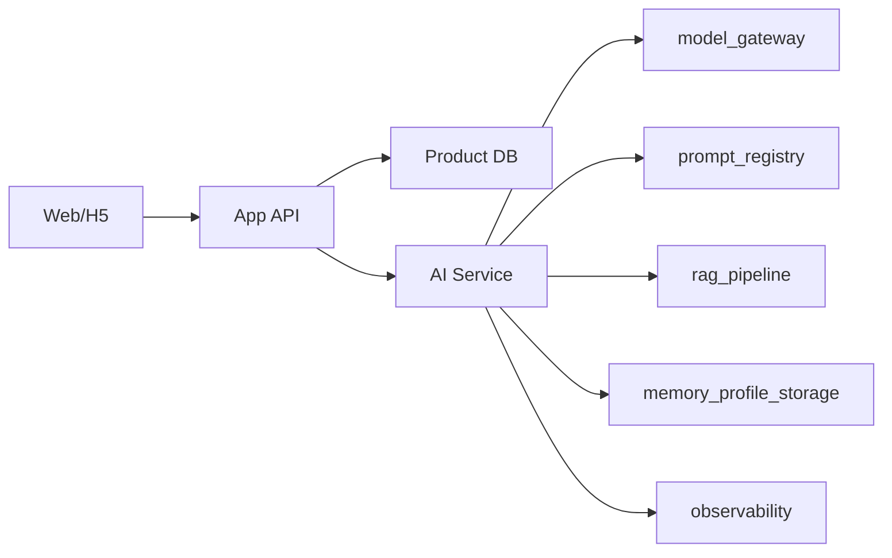

# AI Technical Architecture：毕业答辩辅导智能体

ai_architecture_id: `ai-technical-architecture-20260425`

## ai_service_boundary

AI 能力集中在独立 AI service 内，业务服务只通过 API 调用 AI 能力。业务服务负责权限、会话、状态、持久化、删除和审计；AI service 负责模型网关、Prompt 注册、RAG 检索、结构化输出校验和 fallback。

## api_contracts

| endpoint | input | output | fallback |
| --- | --- | --- | --- |
| `POST /ai/question-set` | thesis_profile、mode、weakness_tags | question_set JSON | 规则题库抽题 |
| `POST /ai/follow-up` | question、answer、rubric、context | follow_up JSON | 改进建议 |
| `POST /ai/evaluate` | question、answer、rubric | score_card JSON | 待人工评分模板 |
| `POST /ai/rewrite` | answer、missing_points、thesis_profile | rewrite Markdown | 回答结构模板 |
| `POST /ai/retry-plan` | score_cards、learner_profile | retry_plan JSON | 按最低分维度复练 |
| `POST /ai/moderate` | user_input、candidate_output | moderation_result JSON | 规则拦截 |

## model_gateway

- 任务级配置：provider、model、temperature、max_output_tokens、timeout、retry、fallback。
- 每次调用记录 request_id、task_type、model_config_version、prompt_version、latency、error_code。
- 模型更新需要通过 benchmark_plan，并由用户或负责人批准。

## prompt_registry

- Prompt 以 `prompt_id@version` 管理。
- Prompt 变更必须绑定测试样例和回归结果。
- Prompt 不直接写业务数据，只返回结构化候选结果。

## rag_pipeline

- rag_pipeline 包含题库索引、论文资料索引和训练历史摘要索引。
- 检索结果必须带 source_id、field、confidence 和 permission_scope。
- 外部/学校规范源后续接入时必须标记 source_trace 和 human_verification_required。

## memory_profile_storage

- session_memory 存在训练会话表或缓存。
- thesis_profile、training_history、learner_profile 分表存储，支持删除和重置。
- 用户删除资料后，需要同步清除关联向量和摘要缓存。

## observability

- 记录模型调用成功率、latency、fallback 比例、结构化输出失败率、诚信拦截率。
- 记录 Prompt 版本与评分变化，方便回归。
- 异常输出进入人工抽查样本池。

## fallback

- 模型不可用：题库规则抽题 + 手动评分模板。
- RAG 不可用：通用问题组 + 个性化程度下降提示。
- Prompt 输出格式错误：重试一次，仍失败则返回安全降级文案。
- 用户资料不足：先要求补充资料，不继续虚构。

## delivery_dependencies

- MVP 需要先实现 model_gateway、prompt_registry、AI API contract、基础题库索引和学术诚信拦截。
- 画像和自适应教练可先以规则汇总实现，后续再做复杂推荐。
- 语音、视频、学校规则库和导师端不进入 MVP。
