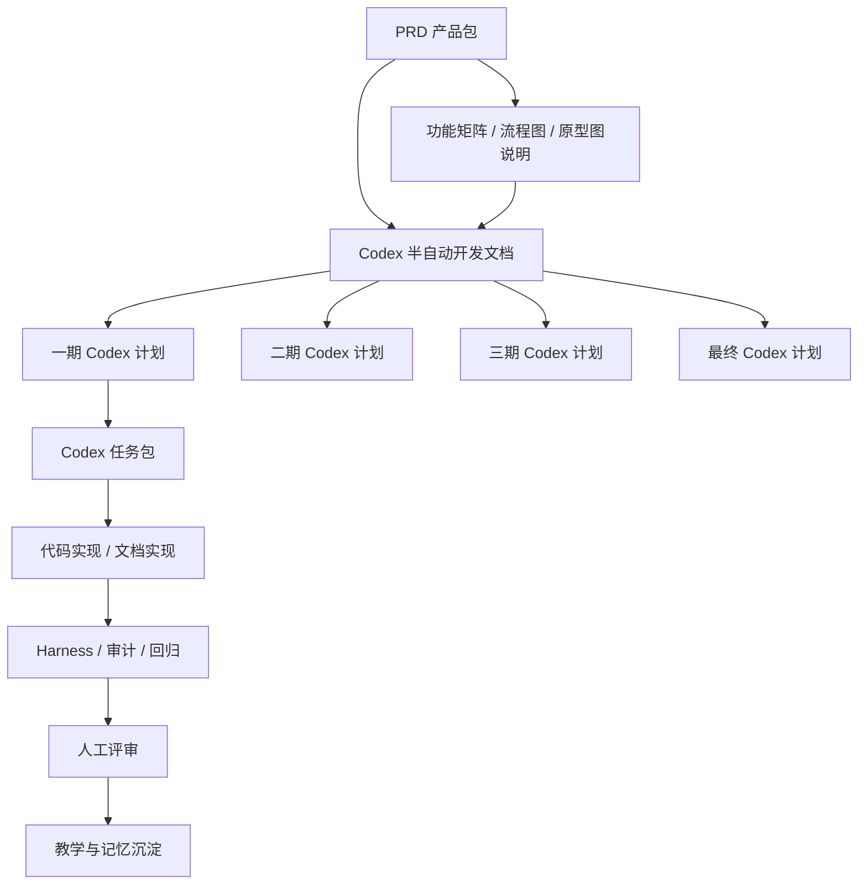
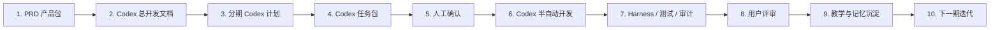
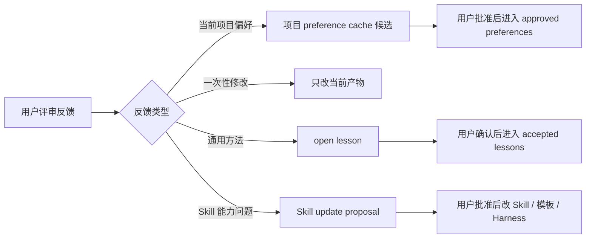

# 毕业答辩辅导智能体：Codex 半自动开发文档

文档目标：把产品 PRD、功能矩阵、流程图和原型图转成“可交给 Codex 半自动开发”的执行方案。  
当前状态：开发前规划版。Codex 可以按本文档拆任务执行，但模型、MCP、GitHub 推送、数据库变更、Skill 更新和记忆写入都需要人工确认后才能进入实现。  
配套产品文档：

- PRD 产品包：`projects/graduation-defense-agent/02_prd.generated.md`，可包含功能矩阵、流程图和原型图说明。
- 产品包同步拆分文件：
  - 功能矩阵：`projects/graduation-defense-agent/feature_matrix.md`
  - 流程图：`projects/graduation-defense-agent/prototype/product_flow.md`
  - MVP 原型图：`projects/graduation-defense-agent/prototype/prototype_preview.md`
  - 全量原型图：`projects/graduation-defense-agent/prototype/full_prototype.md`

---

## 1. 当前状态

| 项目 | 状态 |
| --- | --- |
| PRD 产品包 | 已整合产品判断、功能矩阵、流程图和原型图说明，不承载 Codex 开发实现 |
| 功能矩阵 | 已作为产品包同步拆分文件输出，可用于排期和范围评审 |
| 流程图 / 原型图 | 已作为产品包同步拆分文件输出，MVP 预览覆盖一期核心路径，全量原型覆盖一期、二期、三期和最终阶段页面 |
| Codex 开发总文档 | 本文档 |
| 分期 Codex 文档 | 一期、二期、三期、最终已拆分 |
| 发送前审核 | 已由 `codex-development-plan-reviewer` 输出 `codex_development_review.md` |
| 可进入开发 | 仅在人工确认一期范围、账号策略、模型调用和数据存储后进入 |

---

## 2. 总体结构

### 2.1 管家与职责

| 角色 | 责任 | 不负责 |
| --- | --- | --- |
| 大管家 `pm-copilot-chief` | 阶段推进、人工确认、harness 结果解释 | 直接绕过审批写记忆或改通用 Skill |
| 产品判断小管家 | 用户、场景、范围、指标评审 | 写代码 |
| 交付规划小管家 | 一期/二期/三期/最终开发拆解 | 改 PRD 范围 |
| AI 架构小管家 | 模型、Prompt、RAG、记忆技术方案 | 自动批准模型供应商 |
| 开发治理小管家 | Codex 任务包、写入边界、GitHub/PR 流程 | 直接执行高风险改动 |
| 教学/学习角色 | 用户反馈分类、项目记忆、Skill 提案 | 直接更新稳定记忆或 Skill |
| 随机审计 / 效率审计 | 抽查越界、重复输出、成本浪费 | 降低质量标准 |

---

## 3. 主开发流程

---

## 4. 阶段总览

| 阶段 | 阶段目标 | 用户可见效果 | Codex 开发重点 | 需要人工确认 |
| --- | --- | --- | --- | --- |
| 一期 | 打通 MVP 文字版答辩训练闭环 | 学生能完成训练、看报告、进入复练 | 页面、题库、会话、评分追问、报告、诚信拦截 | 范围、账号、模型、数据存储 |
| 二期 | 提升个人训练效率和复练质量 | 可按 PPT/章节训练，看历史趋势 | PPT 大纲、历史趋势、题库标签、复练优化 | 是否做语音、题库扩展策略 |
| 三期 | 支持导师/机构协作 | 导师可授权查看报告，机构可批量训练 | 多角色、授权、班级、批量报告、后台 | B 端范围、组织权限、数据脱敏 |
| 最终 | 平台化答辩训练 | 多模态训练和组织质量管理 | 语音视频、学校规范库、知识图谱、组织看板 | 商业化、隐私、长期数据策略 |

阶段文档：

- `projects/graduation-defense-agent/delivery/phase_1_codex_plan.md`
- `projects/graduation-defense-agent/delivery/phase_2_codex_plan.md`
- `projects/graduation-defense-agent/delivery/phase_3_codex_plan.md`
- `projects/graduation-defense-agent/delivery/final_codex_plan.md`

---

## 5. 通用 Codex 执行框架

每个 Codex 任务包必须包含：

| 字段 | 要求 |
| --- | --- |
| task_id | 唯一任务编号 |
| goal | 单一目标，不混合多个阶段 |
| inputs | PRD 产品包、产品包同步拆分文件或上游开发产物 |
| allowed_write_paths | 允许修改的文件路径 |
| forbidden_write_paths | 禁止修改的文件路径 |
| expected_outputs | 预期输出 |
| validation | 测试命令、harness 命令或人工检查项 |
| human_confirmation_points | 需要人工确认的高风险点 |
| minimal_fix_strategy | 出错时只做最小修复，不扩大范围 |

通用写入边界：

- 产品 PRD 不由 Codex 开发任务随意改动。
- 开发任务不能跨期修改未批准范围。
- Skill、MCP、Harness、记忆、模型供应商、数据库迁移、GitHub push 必须列为人工确认点。

---

## 6. Skill / MCP / Harness 框架

| 类型 | 一期建议 | 后续扩展 |
| --- | --- | --- |
| Skill 复用 | PRD、功能矩阵、原型、交付规划、AI 方案、agentic delivery | 新增答辩题库清洗、评分回归、报告质检 Skill |
| MCP | 一期默认不接外部 MCP，避免范围扩张 | GitHub、浏览器、数据库、学校规范源可后续接入 |
| Harness | registry、plugin_boundary、agentic_delivery、ai_solution、efficiency、random_audit | 增加跨项目污染、PRD/开发文档混写检查 |
| 开发文档审核 | `codex-development-plan-reviewer` 发送前审核 | 检查最优性、执行阻碍、任务包可执行性、人工确认和回滚 |
| Source trace | 外部资料只作为信号，不直接决定产品范围 | 学校规范库必须有来源和更新时间 |

---

## 7. AI / Prompt / RAG / Memory 框架

| 能力 | 一期 | 二期 | 三期 | 最终 |
| --- | --- | --- | --- | --- |
| AI 问题生成 | 题库规则 + 模型辅助个性化 | 加入 PPT/章节 | 可按导师任务生成 | 按学校规范和画像个性化 |
| Prompt | 问题、追问、评分、改写、诚信拦截 | 增加趋势和专项复练 Prompt | 增加导师评语 Prompt | 多模态和组织看板 Prompt |
| RAG | 一期不做复杂 RAG | 题库 + 用户资料检索 | 机构知识库 | 学校规范库 + 知识图谱 |
| Memory | 当前训练 session + 项目资料 | 多轮训练历史 | 授权后的组织记忆 | 长期学习画像 |
| 隐私 | 用户可删除资料和训练记录 | 历史可删除 | 授权可撤回 | 长期画像可解释、可删除 |

---

## 8. 教学与记忆沉淀

本项目的教学规则：

- 用户说“PRD 不要混开发方案”属于通用文档分层规则，应进入 open lesson / Skill 更新提案；这里的分离对象是 Codex 开发方案，不是功能矩阵、流程图和原型图。
- 用户说“每期都要 Codex 半自动开发文档”属于通用 delivery planning 规则，应沉淀到 `agentic-delivery-orchestrator`。
- 当前答辩项目里的页面文案、题库风格、训练模式细节属于项目偏好，先进入项目候选记忆。
- 任何稳定记忆、Skill、Harness 更新都需要人工批准。

---

## 9. 人工确认点

| gate | 说明 |
| --- | --- |
| `prd_scope` | 修改 MVP、目标用户、核心流程 |
| `database_schema` | 新增或变更数据库结构 |
| `external_api` | 接入外部模型、存储、监控、支付 |
| `mcp_integration` | 接入新 MCP 或扩大 MCP 权限 |
| `registry_harness` | 新增 registry、artifact、steward、harness 规则 |
| `model_change` | 选择、替换、升级模型 |
| `github_push` | 推送远程仓库、创建 PR |
| `destructive_data` | 删除数据库、清理历史数据 |
| `skill_update` | 修改通用 Skill 或记忆机制 |
| `memory_update` | 写入长期记忆或项目 approved cache |

---

## 10. 验收与回归

| 检查 | 用途 |
| --- | --- |
| 单元 / 接口测试 | 验证训练、题库、评分、报告等功能 |
| Prompt 回归 | 验证追问、评分、改写、诚信拦截稳定 |
| Harness | 验证 registry、plugin、agentic delivery、AI solution、source trace |
| 发送前审核 | 验证开发文档是否最优、可执行、无隐藏阻碍，并明确 pass/warn/fail |
| Random audit | 抽查 Skill/MCP/产物越界 |
| Efficiency audit | 检查重复输出、无效调用、token-like 浪费 |
| 人工评审 | 确认产品质量、学术诚信和隐私边界 |

---

## 11. 阶段文档索引

| 阶段 | 文档 |
| --- | --- |
| 一期 | `projects/graduation-defense-agent/delivery/phase_1_codex_plan.md` |
| 二期 | `projects/graduation-defense-agent/delivery/phase_2_codex_plan.md` |
| 三期 | `projects/graduation-defense-agent/delivery/phase_3_codex_plan.md` |
| 最终 | `projects/graduation-defense-agent/delivery/final_codex_plan.md` |
| 发送前审核 | `projects/graduation-defense-agent/delivery/codex_development_review.md` |
