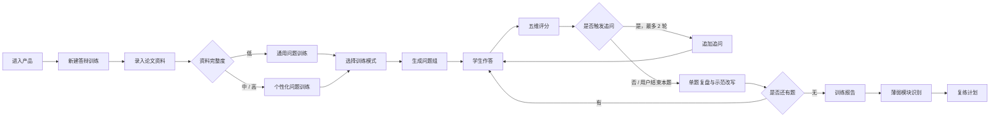
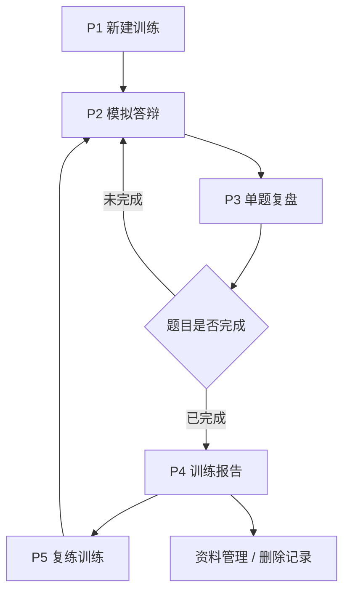
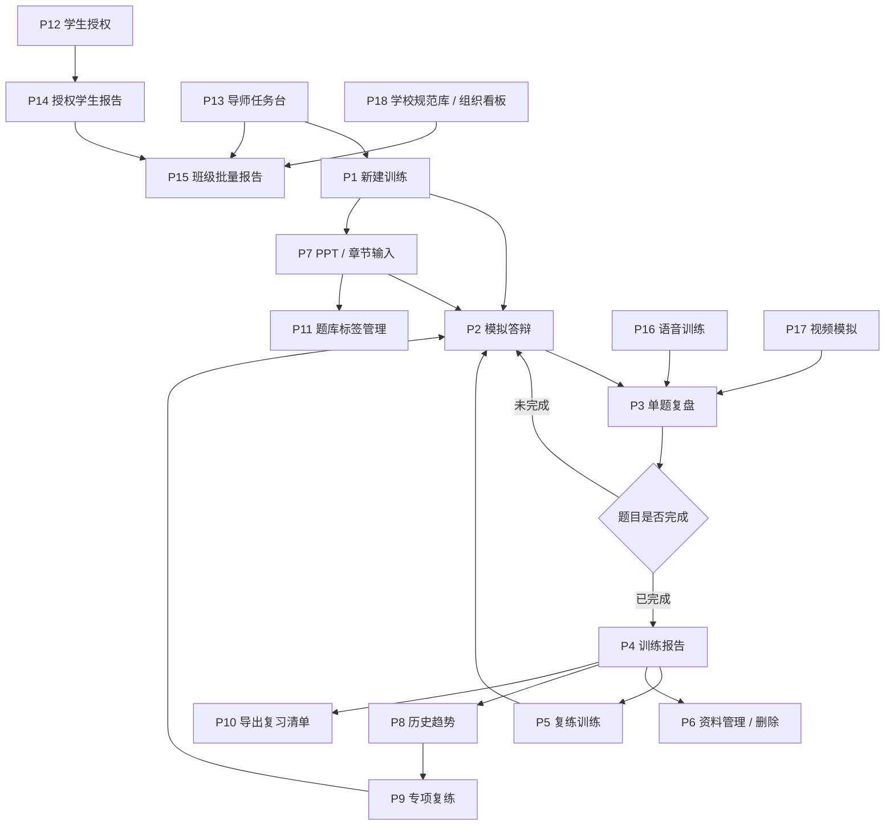
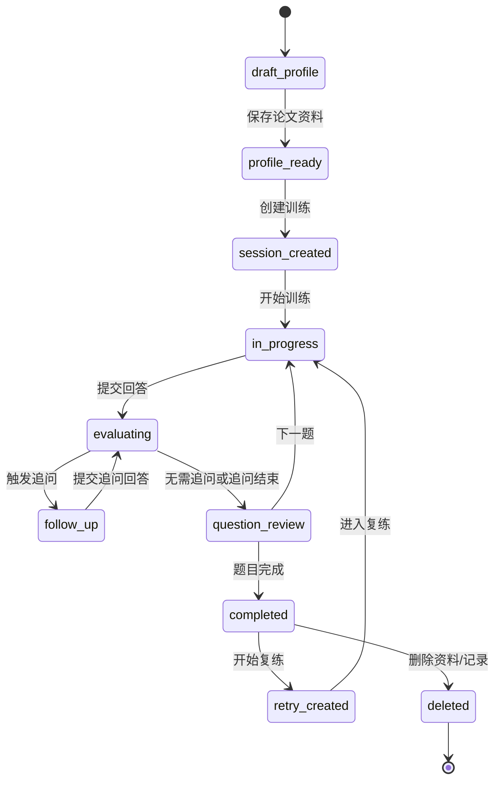
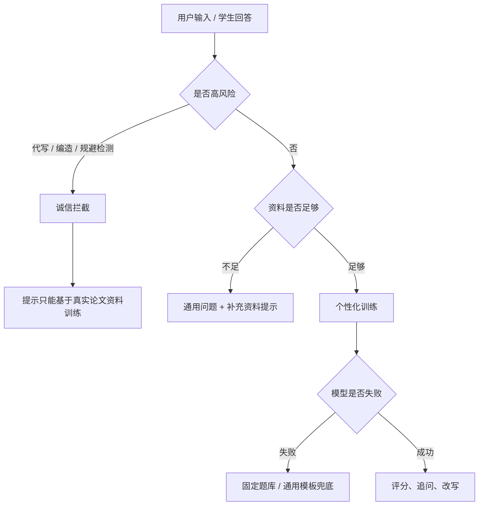

# 毕业答辩辅导智能体产品流程图

状态：`draft`  
来源：`projects/graduation-defense-agent/02_prd.generated.md` v0.5 产品包  
范围：MVP 文字版答辩训练闭环 + 后续阶段页面流。本文是 PRD 产品包的同步拆分文件，便于流程图渲染和单独评审。

---

## 1. 核心业务流程

## 2. MVP 页面流

## 3. 全量页面流

## 4. 训练会话状态流

## 5. 关键决策点

| 决策点 | 决策方 | 判断依据 | 系统行为 |
| --- | --- | --- | --- |
| 是否个性化训练 | 系统 | 论文题目、专业、摘要、目录、方法、结论等资料完整度 | 资料不足时进入通用训练，并提示限制 |
| 选择训练模式 | 用户 | 当前准备阶段和薄弱目标 | 确定模块池、题数和追问强度 |
| 是否追问 | 系统 | 回答是否空泛、缺依据、答非所问、回避不足、过度夸大 | 触发 0-2 轮追问 |
| 是否给示范改写 | 用户 / 系统 | 单题评分完成或用户主动查看 | 输出结构化回答，不编造事实 |
| 是否进入复练 | 用户 | 报告中的低分模块和推荐题单 | 创建复练 session，低分模块加权抽题 |
| 是否拦截 | 系统 | 代写、编造数据、伪造实验、规避检测等风险 | 拒绝并给安全替代建议 |

## 6. 异常与安全路径

## 7. 页面清单

### 7.1 MVP 页面清单

| 页面 | 目标 | 关键内容 | 主按钮 |
| --- | --- | --- | --- |
| P1 新建训练 | 建立训练上下文 | 论文资料、资料完整度、训练模式、追问强度 | 开始生成问题 |
| P2 模拟答辩 | 完成老师提问和学生作答 | 问题卡、考察点、回答输入、追问原因、五维评分 | 提交回答 |
| P3 单题复盘 | 学会如何改回答 | 原回答、扣分原因、示范改写、待补充依据 | 下一题 |
| P4 训练报告 | 明确薄弱点和下一步 | 五维均分、模块表现、典型问题、复练计划 | 开始复练 |

### 7.2 全量原型页面清单

| 阶段 | 页面 | 目标 |
| --- | --- | --- |
| 一期 MVP | P1 新建训练 | 建立论文资料和训练上下文 |
| 一期 MVP | P2 模拟答辩 | 展示老师问题、学生作答、追问和评分 |
| 一期 MVP | P3 单题复盘 | 展示扣分原因、示范改写和待补充依据 |
| 一期 MVP | P4 训练报告 | 汇总表现、薄弱模块和复练计划 |
| 一期 MVP | P5 复练训练 | 围绕低分模块重新训练 |
| 一期 MVP | P6 资料管理 / 删除 | 管理论文资料和隐私删除 |
| 二期 | P7 PPT / 章节输入 | 按页或章节生成问题 |
| 二期 | P8 历史趋势 | 查看多轮训练变化 |
| 二期 | P9 专项复练 | 指定薄弱模块集中复练 |
| 二期 | P10 导出复习清单 | 导出低风险训练摘要 |
| 二期 | P11 题库标签管理 | 扩展专业题库和抽题标签 |
| 三期 | P12 学生授权 | 学生授权导师查看训练摘要 |
| 三期 | P13 导师任务台 | 导师创建班级训练任务 |
| 三期 | P14 授权学生报告 | 导师查看授权范围内报告 |
| 三期 | P15 班级批量报告 | 脱敏汇总班级薄弱点和完成率 |
| 最终 | P16 语音训练 | 口头回答、转写和表达反馈 |
| 最终 | P17 视频模拟 | 模拟现场答辩和视频回放 |
| 最终 | P18 学校规范库 / 组织看板 | 规范来源核验和组织质量管理 |

## 8. 本期不实现但已画原型的流程

- 二期的 PPT/章节输入、历史趋势、专项复练、导出复习清单、题库标签管理；
- 三期的学生授权、导师任务台、授权学生报告、班级批量报告；
- 最终阶段的语音训练、视频模拟、学校规范库、组织看板；
- 上传完整论文并自动解析；
- 支付、会员和商业化路径。
