# 价小前投研 AI 投研平台 PRD

- 文档状态：Draft
- 文档 Owner：待定
- 业务线 / 项目：AI 投研信息聚合与 A 股事件分析
- 需求来源：PDF 资料与原型截图整理
- 优先级：P0
- 目标上线时间：MVP 8 周内可内测，正式上线时间待确认
- 文档版本：v0.1
- 最后更新时间：2026-04-26
- 关联文档：
  - 资料依据：[00_source_notes.md](/Users/liujun/Desktop/产品经理skill/projects/jiaxiaoqian-ai-invest-research/00_source_notes.md)
  - 开发方案：[02_development_design.md](/Users/liujun/Desktop/产品经理skill/projects/jiaxiaoqian-ai-invest-research/02_development_design.md)
  - 排期计划：[03_mvp_release_plan.md](/Users/liujun/Desktop/产品经理skill/projects/jiaxiaoqian-ai-invest-research/03_mvp_release_plan.md)
  - 埋点验收：[04_tracking_and_acceptance.md](/Users/liujun/Desktop/产品经理skill/projects/jiaxiaoqian-ai-invest-research/04_tracking_and_acceptance.md)
  - 功能流程图展开版：[05_function_flow.md](/Users/liujun/Desktop/产品经理skill/projects/jiaxiaoqian-ai-invest-research/05_function_flow.md)
  - 原型图展开版：[06_prototype_wireframes.md](/Users/liujun/Desktop/产品经理skill/projects/jiaxiaoqian-ai-invest-research/06_prototype_wireframes.md)
  - AI 模型选型展开版：[07_ai_model_selection.md](/Users/liujun/Desktop/产品经理skill/projects/jiaxiaoqian-ai-invest-research/07_ai_model_selection.md)
  - 辅助理解图表包：[11_visual_prd_preview.md](/Users/liujun/Desktop/产品经理skill/projects/jiaxiaoqian-ai-invest-research/11_visual_prd_preview.md)
  - 低保真 HTML 原型：[prototype/index.html](/Users/liujun/Desktop/产品经理skill/projects/jiaxiaoqian-ai-invest-research/prototype/index.html)

---

## 1. 一句话摘要

价小前投研是一个面向 A 股主动研究用户的 AI 投研辅助平台，聚合新闻、公告、研报、行情、财务、资金和股东等数据，自动识别事件、题材和个股影响，帮助用户快速完成“热点发现、事件理解、个股拆解、复盘验证和关注提醒”。

### 1.1 产品总览思维导图

```mermaid
flowchart TB
  P["价小前 AI 投研平台"]

  P --> U["目标用户"]
  U --> U1["高频主动投资者"]
  U --> U2["财经内容创作者"]
  U --> U3["机构 / 私募研究助理"]
  U --> U4["普通研究用户"]
  U --> U5["运营 / 合规管理员"]

  P --> S["核心场景"]
  S --> S1["盘中事件追踪"]
  S --> S2["盘后行情复盘"]
  S --> S3["概念题材研究"]
  S --> S4["个股深度研究"]
  S --> S5["关注与提醒"]

  P --> M["核心模块"]
  M --> M1["高频跟踪 / 事件中心"]
  M --> M2["行情复盘"]
  M --> M3["概念中心"]
  M --> M4["个股详情"]
  M --> M5["AI 投研助手"]
  M --> M6["管理后台"]

  P --> A["AI 能力"]
  A --> A1["事件摘要"]
  A --> A2["概念解释"]
  A --> A3["个股结构化分析"]
  A --> A4["风险识别"]
  A --> A5["来源引用 / 置信度"]

  P --> R["合规边界"]
  R --> R1["不荐股"]
  R --> R2["不承诺收益"]
  R --> R3["不接入交易"]
  R --> R4["无来源不输出事实结论"]
  R --> R5["高风险内容审核"]

  P --> K["成功指标"]
  K --> K1["次日留存"]
  K --> K2["研究会话数"]
  K --> K3["事件详情点击率"]
  K --> K4["AI 摘要成功率"]
  K --> K5["高风险内容拦截率"]
```

看图要点：

- 1 分钟内看懂产品面向谁、解决什么场景、有哪些核心模块。
- 把 AI 能力和合规边界同时放进总览，避免读者只看到“智能分析”而忽略金融投研风险。

---

## 2. 背景与问题定义

### 2.1 当前背景

主动投研用户每天需要同时追踪行情异动、政策新闻、公司公告、研报观点、市场传闻、资金流和财务数据。现有工具通常把行情、资讯、财务、研报和讨论社区分散在不同产品里，用户需要反复切换、手工筛选和人工判断影响链路。

LLM 与 agent 工作流已经可以承担信息抽取、事件归因、概念拆分、关联股票识别、观点汇总和结构化报告生成。本产品的机会在于把“信息抓取 + 金融实体识别 + 事件评分 + AI 研究摘要 + 可视化复盘”做成一个闭环工作台。

### 2.2 问题定义

- 受影响角色：主动投资者、财经内容创作者、投研助理、机构研究员、私募/投顾团队内部研究人员。
- 发生场景：开盘前选题、盘中异动追踪、盘后复盘、个股深度研究、热点题材跟踪。
- 问题表现：
  - 热点信息多而散，用户难以判断哪个事件真正影响市场。
  - 概念、题材、股票、上下游链条关系不清晰。
  - 新闻、公告、研报与行情反应之间缺少可追溯关联。
  - 个股研究需要跨页面查财务、资金、股东、业务和竞争格局。
  - 市场传闻和 AI 生成内容容易混淆事实与推断。
- 造成损失 / 障碍：
  - 错过高影响事件。
  - 研究效率低，复盘不可沉淀。
  - 依赖碎片化信息，容易产生偏差。
  - 产品若合规边界不清，会触发投顾、研报、荐股和数据版权风险。

### 2.3 证据

- PDF 明确提出“全网抓取投研信息、公开调研、小作文、爆拉原因、利好板块、相关个股、相关概念、热点逻辑、机会、风险、机构观点、优势劣势、护城河、驱动力、预期差”等需求。
- 截图原型已覆盖高频跟踪、事件中心、概念中心、行情复盘、个股详情、AI 深度分析、财务全景和公司档案。
- 当前资料未提供真实用户访谈、转化数据、数据源授权和合规资质证明，因此本 PRD 中涉及商业化和合规的内容均作为待确认假设。

---

## 3. 为什么现在做

- 时间窗口：AI agent 可以把过去需要人工筛选、归因和写摘要的流程自动化，明显缩短投研信息处理链路。
- 用户价值：高频研究用户愿意为“更快发现事件、更快看懂影响、更少切换工具”付费。
- 技术成熟度：信息抽取、RAG、实体链接、事件分类、摘要生成、可视化图表和通知系统均可用成熟工程方案实现。
- 不做的代价：如果只做传统行情页，难以与同花顺、东方财富、TradingView、券商 App 等成熟产品竞争；必须通过 AI 研究链路形成差异。

---

## 4. 目标 / 非目标

### 4.1 业务目标

- MVP 完成一套可内测的 AI 投研工作台，覆盖热点发现、事件追踪、概念复盘和个股研究主流程。
- 形成可持续迭代的数据与 AI 能力底座，包括数据采集、实体识别、事件评分、RAG 摘要、引用追溯和内容审核。
- 为后续订阅 Pro、机构工作台或 API 服务验证用户付费意愿。

### 4.2 用户目标

- 在 1 分钟内理解当天最重要的事件、题材和影响股票。
- 在 3 分钟内从一个事件进入相关概念、相关股票、背景、风险和市场反应。
- 在 5 分钟内完成一个个股的结构化初筛，包括业务、竞争、财务、资金、事件催化和风险。
- 能关注股票、事件和概念，并在重要更新发生时收到提醒。

### 4.3 非目标

MVP 明确不做：

- 不提供确定性买入、卖出、持有、目标价、仓位和组合建议。
- 不承诺收益，不展示“必中”“稳赚”“强烈买入”等营销话术。
- 不接入真实交易下单。
- 不接入用户券商持仓与交易流水。
- 不发布需要持牌资质支撑的正式证券研究报告。
- 不开放用户发帖荐股社区。
- 不做全量全球市场，MVP 以 A 股为主。

---

## 5. 成功指标

| 指标层级 | 指标名 | 当前基线 | MVP 目标 | 统计口径 | 观察窗口 | 护栏说明 |
|---|---:|---:|---:|---|---|---|
| 核心指标 | 次日留存 | 待测 | >= 25% | 完成注册且次日访问核心页 | 内测 14 天 | 不通过诱导交易提高留存 |
| 核心指标 | 每活跃用户研究会话数 | 待测 | >= 3 次/日 | 打开事件、概念或个股详情算 1 次 | 内测 14 天 | 排除自动刷新 |
| 核心指标 | 事件详情点击率 | 待测 | >= 35% | 事件卡片曝光到详情点击 | 内测 14 天 | 标题不得夸大 |
| 过程指标 | 数据入库延迟 | 待测 | 新闻/公告采集后 5 分钟内入库 | source_published_at 到 collected_at | 每日 | 受数据源授权和抓取限制影响 |
| 过程指标 | AI 摘要生成成功率 | 待测 | >= 95% | AI 任务成功数 / 任务总数 | 每日 | 超时或模型异常需降级 |
| 过程指标 | 引用覆盖率 | 待测 | >= 98% | AI 生成结论附带来源引用比例 | 每日 | 无来源不得输出事实性断言 |
| 护栏指标 | 高风险内容拦截率 | 待测 | 100% 拦截 P0 违规 | 买卖建议、收益承诺、虚假事实 | 每日 | 违规内容不得上线 |
| 护栏指标 | 数据源授权覆盖 | 待确认 | 100% 核心数据有授权或合法来源 | 数据源清单 | 上线前 | 未确认授权的数据不得商业化展示 |

---

## 6. 目标用户 / 角色 / JTBD

### 6.1 目标用户

| 角色 | 目标 | 关注点 | 风险点 |
|---|---|---|---|
| 高频主动投资者 | 快速发现热点、理解影响链路 | 事件时效、概念强度、相关个股、风险提醒 | 可能把研究辅助误认为荐股 |
| 财经内容创作者 | 高效整理选题和市场逻辑 | 热点标题、背景资料、事件线索、引用来源 | 传播未核实内容 |
| 机构/私募研究助理 | 做信息初筛和报告底稿 | 数据完整性、可追溯、导出、团队协作 | 数据授权和内部合规 |
| 普通研究用户 | 学会看懂行情和基本面 | 易懂解释、结构化内容、可视化 | 过度依赖 AI 结论 |
| 运营/合规管理员 | 管理数据源、AI 内容和风险 | 审核、留痕、告警、配置 | 漏审导致合规风险 |

### 6.2 核心 JTBD

- 当盘中出现异动时，用户希望快速知道异动来自哪个事件、影响哪些股票、市场是否已经充分反应，以便决定是否继续深入研究。
- 当某个概念突然升温时，用户希望看到概念定义、政策/产业背景、上下游、核心标的和风险，以便构建研究框架。
- 当研究一个个股时，用户希望一次性看到业务、商业模式、竞争地位、财务、资金、公告、新闻和股东结构，以便完成初筛。
- 当关注的股票/概念/事件发生变化时，用户希望及时收到提醒，以便不错过关键进展。

### 6.3 用户场景 / JTBD 思维导图

```mermaid
flowchart TB
  JTBD["用户场景 / JTBD"]

  JTBD --> U1["高频事件用户"]
  U1 --> U1A["目标：快速判断事件影响"]
  U1 --> U1B["触发点：盘中异动、公告、新闻、题材爆发"]
  U1 --> U1C["关键动作：查看事件详情、来源、相关股票、相关概念"]
  U1 --> U1D["期望结果：决定是否继续深入研究"]
  U1 --> U1E["风险点：误把研究辅助当买卖建议"]

  JTBD --> U2["概念研究用户"]
  U2 --> U2A["目标：看懂题材逻辑和产业链"]
  U2 --> U2B["触发点：概念热度上升、政策或行业事件出现"]
  U2 --> U2C["关键动作：搜索概念、查看定义、历史时间轴、相关个股"]
  U2 --> U2D["期望结果：形成概念研究框架"]
  U2 --> U2E["风险点：概念定义无来源或股票关联过度推断"]

  JTBD --> U3["个股研究用户"]
  U3 --> U3A["目标：快速完成单只股票初筛"]
  U3 --> U3B["触发点：搜索股票、从事件或概念进入个股"]
  U3 --> U3C["关键动作：查看行情、财务、动态、公司档案、AI 深度分析"]
  U3 --> U3D["期望结果：获得结构化研究底稿"]
  U3 --> U3E["风险点：AI 竞争评分或投资逻辑被误读为专业评级"]

  JTBD --> U4["合规管理员"]
  U4 --> U4A["目标：控制 AI 内容和数据合规风险"]
  U4 --> U4B["触发点：AI 命中风险、用户举报、来源授权异常"]
  U4 --> U4C["关键动作：审核、拦截、修改规则、记录日志"]
  U4 --> U4D["期望结果：高风险内容不上线且可追溯"]
  U4 --> U4E["风险点：漏审、规则过松或日志缺失"]
```

看图要点：

- 这张图用于判断功能是不是围绕真实用户任务，而不是堆功能。
- 后续 UI 设计应优先服务高频事件、概念研究、个股研究和合规处理四类任务。

---

## 7. 使用场景

### 7.1 核心场景

1. 盘中事件追踪
   - 触发条件：新闻、公告、研报、传闻或行情异动被系统识别为事件。
   - 用户目标：确认事件背景、影响方向、相关股票和风险。
   - 预期变化：从分散查信息变成在事件详情内完成初步判断。

2. 盘后行情复盘
   - 触发条件：交易日结束或用户进入行情复盘。
   - 用户目标：理解当天市场主线、涨停板块、强势概念和高位风险。
   - 预期变化：系统自动生成市场热力、概念词云、涨停统计和事件时间轴。

3. 个股深度研究
   - 触发条件：用户搜索股票或从事件/概念进入个股。
   - 用户目标：快速看懂业务、竞争、财务、资金、事件催化和风险。
   - 预期变化：系统生成结构化研究卡片，并标注来源和置信度。

4. 关注与提醒
   - 触发条件：用户关注股票、事件或概念。
   - 用户目标：在重要新闻、公告、价格异动、概念热度变化时收到提醒。
   - 预期变化：减少手工刷新和漏看。

### 7.2 反场景

- 用户要求系统直接告诉“今天买哪只股票”。
- 用户要求系统保证收益或给出确定目标价。
- 用户把平台输出作为唯一投资依据。
- 未经授权展示付费研报全文或受版权保护内容。
- 未经法务确认面向公众提供个性化证券投资建议。

---

## 8. 范围定义

### 8.1 In Scope

- 账号、登录、基础权限、关注股票/事件/概念。
- 全局搜索：股票、概念、事件、关键词。
- 高频跟踪：事件中心、实时要闻、事件详情、事件筛选、事件日历。
- 概念中心：概念列表、热度排序、概念详情、相关个股、历史时间轴。
- 行情复盘：市场概览、灵活屏、概念异动、涨停板块分析、市场全景。
- 个股详情：头部行情卡、深度分析、股票行情、概念板块、动态跟踪、财务全景、公司档案。
- AI 能力：事件摘要、概念解释、个股结构化分析、风险点、引用来源、置信度。
- 数据源管理：采集任务、来源配置、失败告警、授权标记。
- 内容安全：禁用荐股话术、收益承诺、无来源事实、传闻未标注。
- 埋点与运营后台：核心行为、AI 质量、数据延迟和内容风险看板。

### 8.2 Out of Scope

- 真实交易、券商开户、银证转账。
- 个性化仓位、组合、止盈止损、目标价建议。
- 需要人工投顾资质的收费投顾服务。
- 社区发帖荐股、直播带单、跟单。
- 移动 App 原生开发。
- 全量港股、美股、期货、期权、加密资产。

### 8.3 分阶段规划

- MVP：A 股事件追踪、概念中心、行情复盘、个股详情、AI 摘要、关注提醒、合规护栏。
- V1：Pro 订阅、导出、团队空间、更多数据源、个股对比、历史回测。
- V1.1：机构版权限、研究模板、自定义监控策略、API 输出、更多市场。

### 8.4 MVP 范围地图 / 分阶段路线图

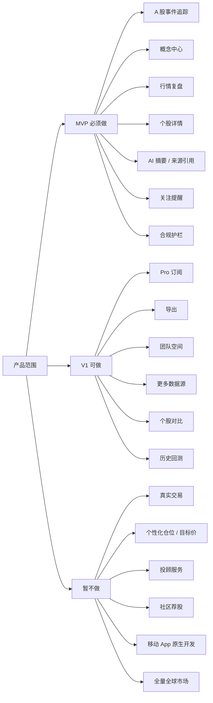

看图要点：

- 这张图把范围压成 MVP 必须做、V1 可做、暂不做三层。
- 它解决“PRD 看起来偏大”的问题，也方便后续排期和验收只盯 MVP 边界。

---

## 9. 方案概述

### 9.1 方案摘要

平台把外部数据统一采集到事件和实体中心，使用 AI 抽取“事件-概念-股票-影响-证据-风险”的结构，再通过高频跟踪、行情复盘、概念中心和个股详情四条主路径展示。所有 AI 结论必须带来源、置信度、更新时间和风险提示。

### 9.2 用户主流程

#### 9.2.1 核心业务泳道图

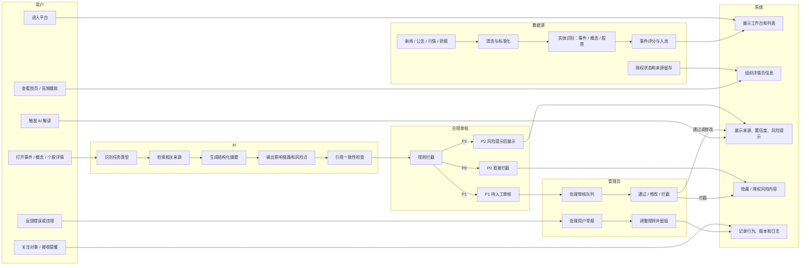

看图要点：

- 这张图用来说明“谁在什么时候做什么”，尤其是数据源、AI、合规审核、管理员的介入点。
- 异常点包括：来源不足、命中 P0/P1、人工拦截、用户举报、规则调整。

#### 9.2.2 主路径流程图

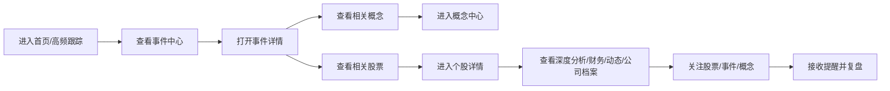

### 9.3 状态流转

| 对象 | 当前状态 | 触发动作 | 下一个状态 | 备注 |
|---|---|---|---|---|
| 原始资讯 | 已采集 | 清洗成功 | 已标准化 | 保留原文和来源 |
| 标准资讯 | 已标准化 | 实体识别成功 | 已关联实体 | 股票、概念、行业、机构、人物 |
| 候选事件 | 待评分 | AI/规则评分完成 | 已入事件池 | 低置信度进入待复核 |
| 事件 | 已发布 | 数据更新或用户反馈 | 已更新 | 记录版本 |
| AI 摘要 | 待生成 | RAG 生成成功 | 待安全检查 | 必须附来源 |
| AI 摘要 | 待安全检查 | 通过审核 | 已发布 | 不通过则降级或隐藏 |
| AI 摘要 | 待安全检查 | 命中违规 | 已拦截 | 进入审核队列 |

#### 9.3.1 事件状态流转图

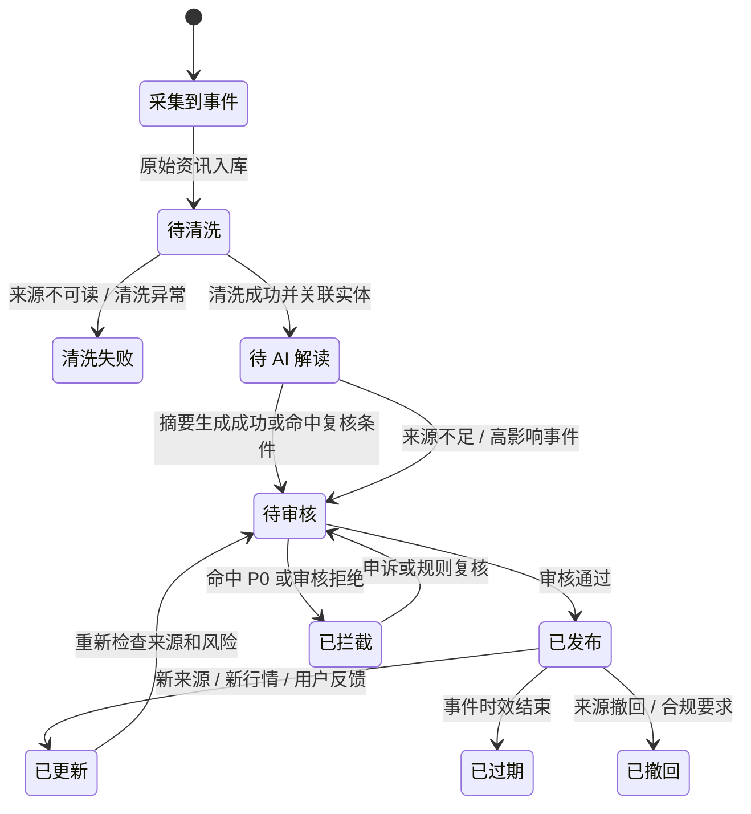

看图要点：

- 这张图把文字状态表变成状态机，研发可以直接据此设计状态字段和状态迁移。
- 重点测试边界：清洗失败、来源不足、命中 P0、人工通过、发布后更新、过期、撤回。

### 9.4 功能流程图

PRD 正文必须包含功能流程图；展开版见 [05_function_flow.md](/Users/liujun/Desktop/产品经理skill/projects/jiaxiaoqian-ai-invest-research/05_function_flow.md)。

#### 9.4.1 产品总流程

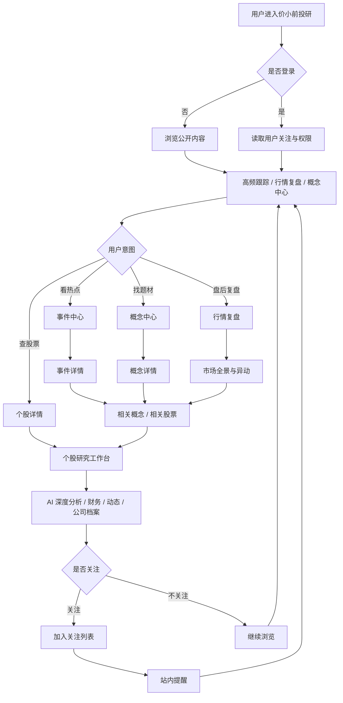

#### 9.4.2 AI 生成与审核流程

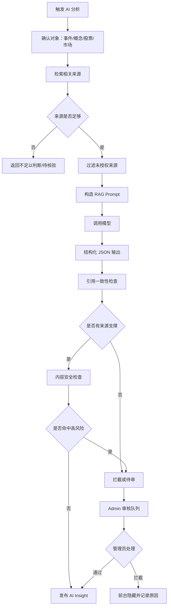

#### 9.4.3 核心页面跳转

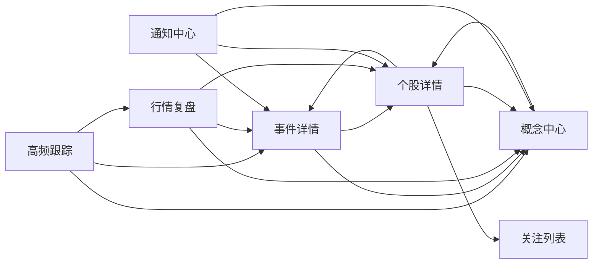

#### 9.4.4 页面信息架构图 / 页面跳转图

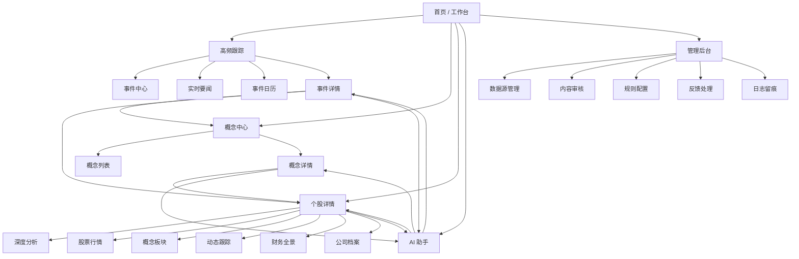

看图要点：

- 这张图展示首页、高频跟踪、概念中心、个股详情、AI 助手、管理后台之间的关系。
- 它直接服务 UI 设计和 Codex 开发文档，后续可据此拆导航、页面路由和页面权限。

### 9.5 原型图 / 线框图

PRD 正文必须包含主要页面原型图；展开版见 [06_prototype_wireframes.md](/Users/liujun/Desktop/产品经理skill/projects/jiaxiaoqian-ai-invest-research/06_prototype_wireframes.md)，可打开原型见 [prototype/index.html](/Users/liujun/Desktop/产品经理skill/projects/jiaxiaoqian-ai-invest-research/prototype/index.html)。

#### 9.5.0 完整页面级 PNG 原型图

这些 PNG 是从可打开 HTML 原型截取的完整页面级原型图，用于 UI 设计、研发拆页面和 Codex 开发文档衔接。它们不是最终高保真视觉稿。

| 页面 | 文件 | 覆盖模块 |
|---|---|---|
| 高频跟踪 / 首页工作台 | [01_home_tracking.png](/Users/liujun/Desktop/产品经理skill/projects/jiaxiaoqian-ai-invest-research/prototype/screenshots/01_home_tracking.png) | 高频跟踪、事件中心、财经日历、事件排行 |
| 事件详情 | [02_event_detail.png](/Users/liujun/Desktop/产品经理skill/projects/jiaxiaoqian-ai-invest-research/prototype/screenshots/02_event_detail.png) | 事件背景、相关股票、相关概念、AI 摘要、风险提示 |
| 概念中心 | [03_concept_center.png](/Users/liujun/Desktop/产品经理skill/projects/jiaxiaoqian-ai-invest-research/prototype/screenshots/03_concept_center.png) | 概念搜索、概念卡片、热度、历史时间轴 |
| 行情复盘 | [04_market_review.png](/Users/liujun/Desktop/产品经理skill/projects/jiaxiaoqian-ai-invest-research/prototype/screenshots/04_market_review.png) | 市场全景、板块热力、概念异动 |
| 个股详情 | [05_stock_detail.png](/Users/liujun/Desktop/产品经理skill/projects/jiaxiaoqian-ai-invest-research/prototype/screenshots/05_stock_detail.png) | 个股头部、六类标签、深度分析 |
| AI 投研助手 | [06_ai_assistant.png](/Users/liujun/Desktop/产品经理skill/projects/jiaxiaoqian-ai-invest-research/prototype/screenshots/06_ai_assistant.png) | 对象上下文、模型路由、AI 结果、反馈 |
| Admin 审核后台 | [07_admin_review.png](/Users/liujun/Desktop/产品经理skill/projects/jiaxiaoqian-ai-invest-research/prototype/screenshots/07_admin_review.png) | 内容审核、规则命中、人工处理、日志入口 |


#### 9.5.1 全局框架

```text
┌──────────────────────────────────────────────────────────────────────────────┐
│ 价小前投研  高频跟踪▼  行情复盘▼  AI助手▼    联系我们▼   搜索框   我的主页 │
├───────────────┬──────────────────────────────────────────────┬───────────────┤
│ 左侧边距       │ 主工作区                                      │ 右侧快捷栏     │
│               │ 高频跟踪 / 概念中心 / 行情复盘 / 个股详情       │ 关注股票       │
│               │                                              │ 关注事件       │
│               │                                              │ 热门概念       │
└───────────────┴──────────────────────────────────────────────┴───────────────┘
```

#### 9.5.2 高频跟踪页面

```text
┌──────────────────────────────────────────────────────────────────────────────┐
│ 事件中心  [日期选择]                                                        │
├───────────────┬──────────────┬──────────────┬──────────────┬───────────────┤
│ 事件胜率      │ 大盘上涨率   │ 平均振幅     │ 最大振幅     │ 事件数 / TOP10 │
└───────────────┴──────────────┴──────────────┴──────────────┴───────────────┘

┌──────────────────────────────┬───────────────────────────────────────────────┐
│ 财经日历 / TOP 事件排行       │ 月历：每日事件数、涨停数、未来事件            │
└──────────────────────────────┴───────────────────────────────────────────────┘

┌──────────────────────────────────────────────────────────────────────────────┐
│ 实时要闻·动态追踪  [列表] [题材]  搜索  日期筛选  行业筛选  重要度筛选       │
├──────────────────────┬───────────────────────────────────────────────────────┤
│ 事件卡片             │ 事件描述 / 来源 / 相关股票 / 相关概念 / 传播链        │
└──────────────────────┴───────────────────────────────────────────────────────┘
```

#### 9.5.3 概念中心页面

```text
┌──────────────────────────────────────────────────────────────────────────────┐
│ 概念中心                                                                     │
│ 概念板块 500+   相关个股 5000+   实时监控 24/7                               │
│ [ 搜索概念板块、个股、关键词...                         ][搜索]              │
└──────────────────────────────────────────────────────────────────────────────┘

┌──────────────────────────────┬───────────────────────────────────────────────┐
│ 筛选：今天 / 昨天 / 一周前    │ 右侧：概念统计中心                            │
├──────────────────────────────┴───────────────────────────────────────────────┤
│ 概念卡片：名称、涨跌幅、热度、定义摘要、查看个股、历史时间轴、关注           │
└──────────────────────────────────────────────────────────────────────────────┘
```

#### 9.5.4 个股详情页面

```text
┌──────────────────────────────────────────────────────────────────────────────┐
│ 个股详情                                      [输入股票代码/名称] [对比] [☆] │
├──────────────────────────────────────────────────────────────────────────────┤
│ 股票名称 / 代码 / 行业标签 / 价格 / 涨跌幅 / 开收高低                         │
├──────────────────────┬──────────────────────┬──────────────────────────────┤
│ 估值指标             │ 市值股本             │ 主力动态                     │
└──────────────────────┴──────────────────────┴──────────────────────────────┘

┌──────────────────────────────────────────────────────────────────────────────┐
│ Tab: 深度分析 | 股票行情 | 概念板块 | 动态跟踪 | 财务全景 | 公司档案          │
├──────────────────────────────────────────────────────────────────────────────┤
│ 核心定位 / 投资亮点 / 商业模式 / 竞争地位评分 / 竞争优势 / 竞争劣势           │
└──────────────────────────────────────────────────────────────────────────────┘
```

### 9.6 AI 模型选型

PRD 正文必须说明 AI 模型选型原则和默认模型路由；展开版见 [07_ai_model_selection.md](/Users/liujun/Desktop/产品经理skill/projects/jiaxiaoqian-ai-invest-research/07_ai_model_selection.md)。

#### 9.6.1 选型结论

本产品不采用单一模型完成全部任务，采用“模型路由 + RAG + 安全审核”的组合。原因是投研场景同时有高频低成本任务、复杂长文本推理任务和高合规风险任务，单一模型无法同时做到成本、速度、准确性和合规可控。

#### 9.6.2 AI 模型路由决策树

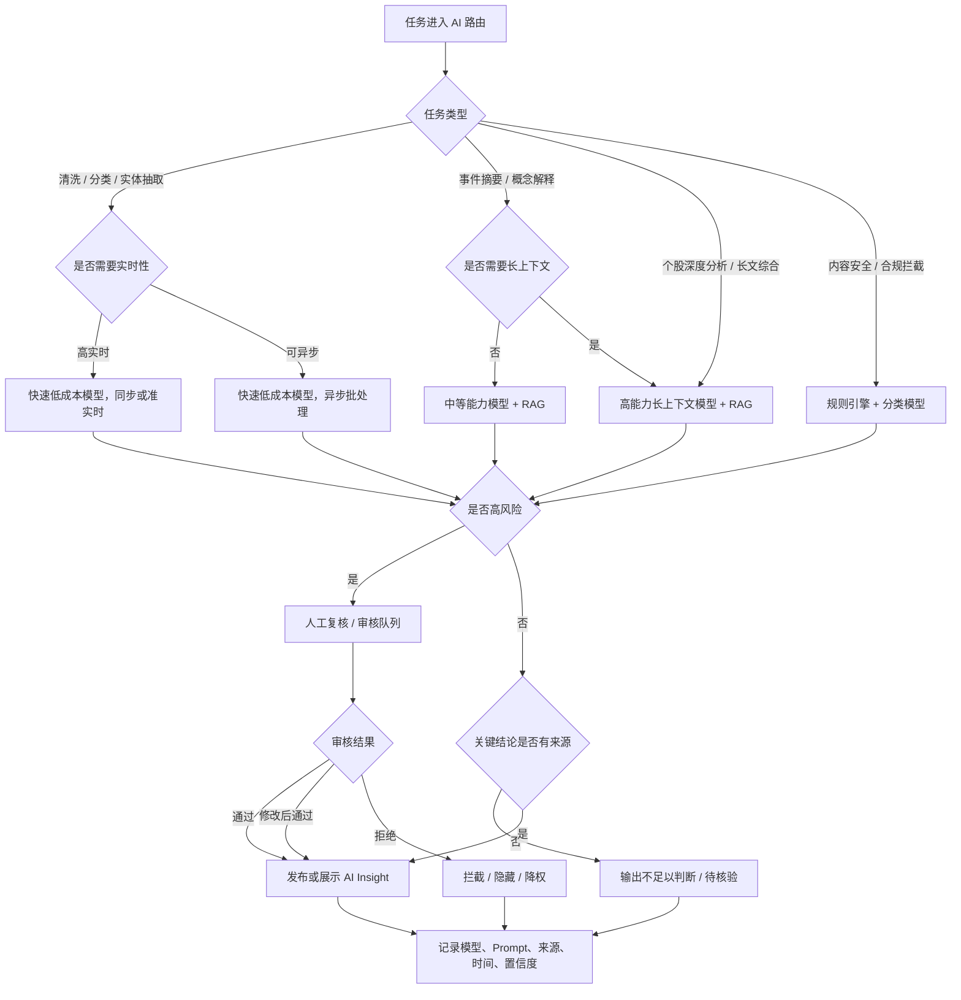

看图要点：

- 这张图把模型选型从“结论表”变成可执行路由规则。
- 每个判断点都可以转成工程规则：任务类型、实时性、长上下文、高风险、来源充分性、人工复核。

| 任务 | 推荐模型等级 | 处理方式 | 审核要求 |
|---|---|---|---|
| 新闻/公告清洗、分类、实体抽取 | 快速低成本模型 | 异步批处理 | 抽样审核 |
| 事件摘要、概念解释 | 中等能力模型 + RAG | 异步生成，缓存结果 | 高影响事件审核 |
| 个股深度分析、长文档综合 | 高能力长上下文模型 | 异步生成，分块检索 | Pro/高风险内容审核 |
| 内容安全与合规拦截 | 规则引擎 + 分类模型 | 同步检查 | 命中规则人工复核 |
| 向量检索 | 独立 embedding 模型 | 与生成模型解耦 | 评测召回率 |

#### 9.6.3 MVP 默认模型路由

```yaml
model_router:
  fast_extract:
    primary: deepseek-v4-flash
    fallback: gpt-5.4-nano
  event_summary:
    primary: gpt-5.4-mini
    fallback: deepseek-v4-pro
  stock_deep_analysis:
    primary: gpt-5.5
    fallback: gpt-5.4-mini
  long_context_review:
    primary: gpt-5.5
    fallback: gemini-3.1-pro-preview
  safety_review:
    primary: rules
    fallback: gpt-5.4-mini
```

#### 9.6.4 选型评测标准

| 维度 | 权重 | 通过要求 |
|---|---:|---|
| 事实准确性 | 30% | 关键事实必须被来源支持 |
| 引用完整性 | 20% | 关键结论引用覆盖率 >= 98% |
| 金融表达质量 | 15% | 表达清晰，区分事实、推断、风险 |
| 合规安全 | 20% | P0 违规内容拦截率 100% |
| 延迟 | 5% | 不阻塞核心页面 |
| 成本 | 10% | 低于 MVP 调用预算 |

#### 9.6.5 上线前必须复核

- 官方模型可用性、价格、上下文长度、速率限制。
- 是否支持结构化输出、工具调用、JSON 模式和批处理。
- 模型供应商的数据处理协议、跨境数据风险和合规要求。
- 面向境内公众提供生成式 AI 服务时的备案/登记、公示和内容安全要求。

当前模型选型参考来源：

- [OpenAI Models](https://developers.openai.com/api/docs/models)
- [OpenAI Pricing](https://developers.openai.com/api/docs/pricing)
- [DeepSeek API Docs](https://api-docs.deepseek.com/)
- [DeepSeek Pricing](https://api-docs.deepseek.com/quick_start/pricing)
- [Google Gemini 3 Docs](https://ai.google.dev/gemini-api/docs/gemini-3)
- [Anthropic Claude Pricing](https://platform.claude.com/docs/en/about-claude/pricing)

---

## 10. 详细需求

### 10.1 账号与权限

#### 目标

支持用户登录、权限识别、关注列表、Pro 权益和管理后台访问。

#### 功能说明

- 支持手机号/邮箱登录，第三方登录可作为后续能力。
- 用户可关注股票、概念、事件。
- 用户有 `free`、`pro`、`admin` 三类权限。
- Pro 能看到更多历史数据、AI 深度分析、导出和高级筛选。
- Admin 可管理数据源、内容审核、用户和系统配置。

#### 权限矩阵

| 角色 / 动作 | 查看公开内容 | 生成 AI 解读 | 编辑关注对象 | 审核内容 | 发布内容 | 撤回内容 | 配置规则 | 管理数据源 | 查看日志 |
|---|---|---|---|---|---|---|---|---|---|
| 未登录用户 | 允许，限公开列表 | 不允许 | 不允许 | 不允许 | 不允许 | 不允许 | 不允许 | 不允许 | 不允许 |
| Free 用户 | 允许 | 部分允许，限基础摘要 | 允许 | 不允许 | 不允许 | 不允许 | 不允许 | 不允许 | 不允许 |
| Pro 用户 | 允许 | 允许，含深度分析 | 允许 | 不允许 | 不允许 | 不允许 | 不允许 | 不允许 | 不允许 |
| 合规审核员 | 允许 | 允许 | 允许 | 允许 | 可提交发布建议 | 允许撤回风险内容 | 可提交规则修改 | 只读 | 允许 |
| Admin 管理员 | 允许 | 允许 | 允许 | 允许 | 允许 | 允许 | 允许，需二次确认 | 允许 | 允许 |

看图要点：

- 这张矩阵直接服务研发鉴权、测试用例和后台权限设计。
- 高风险动作包括审核、发布、撤回、规则配置和数据源管理，必须有日志留痕。

#### 验收标准

- 用户未登录时可浏览公开列表，但关注、提醒、导出和 Pro 内容需要登录。
- 免费用户访问 Pro 内容时展示升级提示，但不得遮挡基础信息。
- Admin 入口不向普通用户展示。

### 10.2 高频跟踪 / 事件中心

#### 目标

帮助用户在盘前、盘中、盘后快速发现高影响事件，并理解事件影响。

#### 功能说明

- 首页展示事件中心指标：事件胜率、大盘上涨率、平均/最大振幅、事件数、热点股票/概念。
- 提供日历视图，按交易日展示事件数量、涨停数、未来事件。
- 提供事件列表，支持列表/题材切换。
- 支持筛选：时间范围、行业、重要度、情绪、相关概念、是否关注、是否 Pro。
- 事件卡片展示标题、时间、重要度、平均影响、最大影响、超预期强度、看涨/看跌反馈、收藏、分享。
- 事件详情展示描述、背景、来源、相关股票、相关概念、历史事件对比、传播链分析、讨论区。

#### 业务规则

- 事件必须至少有 1 个原始来源；传闻类事件必须显式标记“未证实”。
- 事件重要度采用 S/A/B/C 四级，不能只依赖 AI 单次输出，必须结合来源权重、实体相关性、市场反应和人工规则。
- 事件影响不能表达为确定投资收益，只能表达为历史相关性、价格振幅和市场反应。
- AI 摘要必须展示“AI 生成，仅供研究参考，不构成投资建议”。

#### 验收标准

- 用户可从事件列表进入事件详情，详情页可跳转到相关股票和概念。
- 切换时间筛选后，事件列表、日历计数和指标卡同步更新。
- 无来源事件不得发布到正式列表。
- 命中收益承诺、明确买卖建议、虚假确定性表述时，内容被拦截。

### 10.3 概念中心

#### 目标

把市场热点题材结构化，帮助用户理解概念逻辑、热度变化和相关股票。

#### 功能说明

- 支持按关键词搜索概念、个股和关键词。
- 展示概念列表：涨跌幅、热度、股票数量、更新时间、标签。
- 支持时间范围：今天、昨天、一周前、一月前、自定义日期。
- 支持排序：涨跌幅、热度、事件数量、关注数、更新时间。
- 概念详情展示概念定义、核心逻辑、政策/产业背景、上中下游、相关股票、历史时间轴、核心事件。
- Pro 权限可查看更长历史时间轴、深度逻辑和导出。

#### 业务规则

- 概念定义必须来自授权数据源或经过人工维护。
- AI 对概念逻辑的解释必须给出来源列表。
- 概念与股票关联需记录关联原因：主营业务、公告披露、研报提及、产业链关系、市场交易共振等。

#### 验收标准

- 用户搜索“煤炭”等关键词时，能看到概念列表和匹配股票。
- 概念详情至少包含定义、热度、相关股票、近期事件和风险提示。
- 关联股票列表可跳转到个股详情。

### 10.4 行情复盘

#### 目标

帮助用户在盘中和盘后理解市场全貌、强势板块和异常资金/情绪变化。

#### 功能说明

- 个股中心展示大盘涨跌幅、涨停/跌停、多空对比、成交额、A 股总市值、连板龙头。
- 市场全景展示板块热力图、板块关系图、板块分布、热门概念词云、高位股统计。
- 灵活屏支持自选指数卡片、指数折线图、清空列表、恢复默认。
- 概念异动监控展示分时价格曲线、气泡事件点、异动明细卡。
- 涨停板块分析展示日历、AI 总结、核心指标、超短高涨日、高涨日、平稳日、偏冷日。

#### 业务规则

- 行情延迟必须在页面明显位置标注。
- 涨跌停、连板、高位股等统计必须以交易所/授权行情数据为准。
- AI 市场总结必须区分事实、解释和推断。

#### 验收标准

- 用户能从行情复盘进入板块、概念和个股。
- 热力图、词云、关系图和列表之间选中状态一致。
- 当行情数据不可用时，页面展示数据延迟/不可用状态，不展示错误数值。

### 10.5 个股详情

#### 目标

为单只股票提供结构化研究工作台，减少跨工具查询。

#### 功能说明

- 头部展示股票名称、代码、行业标签、最新价、涨跌幅、开盘价、昨收、最高、最低、估值、市值、股本、主力动态。
- 支持关注、分享、对比、刷新、搜索跳转。
- 一级标签：
  - 深度分析：核心定位、投资亮点、商业模式、战略分析、竞争地位、优势/劣势。
  - 股票行情：K 线、均线、MACD、融资融券、龙虎榜、股权质押。
  - 概念板块：概念卡片、相关题材、事件贡献。
  - 动态跟踪：新闻、公告、财报日程、业绩预告。
  - 财务全景：成长、盈利、运营、偿债、费用、现金流、主营业务。
  - 公司档案：股权结构、实际控制人、管理团队、十大股东、十大流通股东、工商信息。

#### 业务规则

- 股票头部数据必须标注更新时间和数据延迟。
- 财务数据必须展示报告期和来源。
- AI 深度分析不得给出“必涨”“必须买入”等投资指令。
- 竞争评分应标明评分维度，不得伪装为专业评级。

#### 验收标准

- 用户搜索股票代码或名称后进入个股详情。
- 六个一级标签可切换，页面不丢失当前股票上下文。
- 财务、公司档案、动态跟踪为空时展示可解释空态。
- AI 分析模块显示来源、更新时间、置信度和风险提示。

### 10.6 AI 投研助手

#### 目标

用 AI 自动生成结构化摘要、事件解释、概念逻辑和个股研究底稿。

#### 功能说明

- 对事件生成：一句话摘要、背景、影响链路、相关股票、相关概念、风险点、待观察变量。
- 对概念生成：定义、产业链、政策背景、核心驱动、上中下游、代表公司、风险。
- 对个股生成：核心定位、商业模式、竞争格局、护城河、财务变化、短中长期逻辑、风险。
- 支持用户对 AI 输出反馈：有用、无用、事实错误、内容违规、缺少来源。
- 所有 AI 输出记录 Prompt 版本、模型、输入来源、生成时间和审核状态。

#### 业务规则

- AI 输出必须基于检索到的来源，不允许无依据编造事实。
- 无法确认的信息必须输出“不足以判断”或“待核验”。
- 涉及传闻、小作文、非公开信息必须显式标记可信度。
- 禁止输出买卖指令、收益承诺、诱导交易、冒充持牌分析师。

#### 验收标准

- 每条 AI 结论至少关联 1 个来源，关键结论可回溯。
- 用户举报事实错误后，该内容进入审核队列，并在前台降权或隐藏。
- 模型异常时系统展示降级摘要或“暂无法生成”，不阻塞主页面。

### 10.7 关注与提醒

#### 目标

让用户持续跟踪关心的股票、概念和事件。

#### 功能说明

- 用户可关注股票、概念、事件。
- 支持提醒类型：新事件、重要公告、价格异动、概念热度变化、AI 摘要更新。
- MVP 支持站内提醒，邮件/短信/微信作为后续能力。
- 用户可在设置页关闭提醒或选择提醒等级。

#### 验收标准

- 用户关注后，右侧快捷栏显示已关注对象。
- 关注对象发生 P0/P1 事件时，站内通知可见。
- 用户取消关注后不再收到对应提醒。

### 10.8 管理后台与合规审核

#### 目标

管理数据源、AI 内容、用户反馈和风险配置。

#### 功能说明

- 数据源管理：来源名称、类型、授权状态、采集频率、失败率。
- 内容审核：待审核 AI 内容、命中规则、原始来源、处理动作。
- 规则配置：禁用词、风险表达、来源白名单/黑名单、重要度阈值。
- 反馈处理：用户举报、事实错误、违规内容、产品建议。
- 日志留痕：AI 输入输出、审核记录、发布记录、管理员操作。

#### 验收标准

- Admin 能查看所有被拦截内容及原因。
- 每次人工审核操作必须记录操作者、时间、动作和备注。
- 修改高风险规则需要二次确认。

---

## 11. 需求明细表

| 模块 | 场景 | 用户动作 | 系统行为 | 优先级 |
|---|---|---|---|---|
| 高频跟踪 | 看当天热点 | 打开高频跟踪 | 展示事件指标、日历和事件列表 | P0 |
| 事件详情 | 理解事件 | 点击事件卡片 | 展示事件描述、来源、关联股票/概念、AI 摘要 | P0 |
| 事件筛选 | 找特定事件 | 设置时间/行业/等级 | 刷新列表与统计 | P0 |
| 概念中心 | 搜索概念 | 输入关键词 | 返回概念和相关股票 | P0 |
| 行情复盘 | 看市场全景 | 打开行情复盘 | 展示市场指标、热力、词云、涨停统计 | P0 |
| 个股详情 | 查股票 | 搜索股票 | 展示头部行情和六类分析标签 | P0 |
| AI 分析 | 生成研究摘要 | 打开事件/概念/股票 | 调用 RAG 生成结构化内容 | P0 |
| 关注提醒 | 追踪目标 | 点击关注 | 保存关注关系并产生提醒 | P1 |
| Pro 权限 | 访问高级内容 | 点击 Pro 模块 | 展示升级提示或内容 | P1 |
| 管理后台 | 审核内容 | 处理风险内容 | 更新内容状态并留痕 | P0 |
| 埋点看板 | 观察转化 | 用户使用产品 | 记录核心事件并汇总指标 | P1 |

---

## 12. 用户故事与验收标准

### 12.1 用户故事地图

| 用户旅程 | 发现热点 | 理解事件 | 研究概念 | 研究个股 | AI 解读 | 关注提醒 | 合规处理 |
|---|---|---|---|---|---|---|---|
| 高频事件用户 | 打开首页 / 高频跟踪 | 查看事件详情、来源、影响方向 | 跳转相关概念 | 跳转相关股票 | 获取事件摘要、影响链路、风险点 | 关注事件 / 股票 / 概念 | 看到风险提示，不接收买卖建议 |
| 概念研究用户 | 从热点或搜索进入概念 | 查看概念相关事件 | 查看定义、产业链、历史时间轴 | 查看相关个股 | 获取概念解释和驱动因素 | 关注概念热度变化 | 避免把概念热度当确定机会 |
| 个股研究用户 | 搜索股票或从事件进入 | 查看个股相关事件 | 查看相关概念板块 | 查看行情、财务、动态、公司档案 | 获取结构化研究底稿 | 关注个股更新 | 区分事实、推断和风险 |
| 合规管理员 | 监控异常内容 | 查看命中规则和来源 | 维护概念定义风险 | 处理个股相关违规内容 | 审核 AI 输出 | 管理高风险提醒 | 拦截、撤回、留痕、复盘 |
| MVP 必须做 | 事件中心、实时要闻 | 事件详情、来源、相关实体 | 概念列表、概念详情 | 个股详情六大标签 | RAG 摘要、引用、置信度 | 站内关注提醒 | P0 拦截、P1 待审、日志 |
| V1 可做 | 更丰富榜单 | 历史影响对比 | 导出和更长时间轴 | 个股对比、历史回测 | 团队协作底稿 | 邮件 / 微信提醒 | 团队审核流 |
| Later 暂缓 | 全市场智能扫描 | 自动生成专题报告 | 自定义主题库 | 深度组合研究 | API 输出 | 短信强提醒 | 复杂机构权限 |

看图要点：

- 横向是用户旅程，纵向是功能切片，底部标出 MVP / V1 / Later。
- 这张图比单条用户故事更适合判断开发优先级和测试覆盖范围。

### 12.2 高频事件用户

作为高频主动投资者，我希望进入首页就看到当天重要事件和相关股票，以便快速决定需要深入研究哪些方向。

验收标准：

- 页面首屏展示当天事件指标、事件日历和事件列表。
- 事件卡片展示时间、标题、重要度、影响指标和相关实体。
- 点击事件后能看到来源、背景、相关股票、相关概念、风险提示。

### 12.3 概念研究用户

作为概念研究用户，我希望搜索一个热点概念后看到定义、产业链和相关个股，以便理解题材逻辑。

验收标准：

- 搜索概念关键词返回概念列表。
- 概念详情展示定义、近期事件、热度、相关股票和历史变化。
- 相关股票可跳转个股详情。

### 12.4 个股研究用户

作为个股研究用户，我希望在一个页面看到行情、财务、业务、新闻、公告和股东信息，以便完成初步研究。

验收标准：

- 搜索股票代码或名称进入个股详情。
- 六个一级标签均可切换。
- AI 深度分析有来源和风险提示。
- 数据为空或延迟时页面有明确状态。

### 12.5 合规管理员

作为合规管理员，我希望看到所有 AI 高风险输出和用户举报，以便及时处理违规内容。

验收标准：

- 后台展示被拦截内容、命中规则、来源和处理状态。
- 审核动作被记录并可追溯。
- P0 风险内容不能出现在前台正式页面。

### 12.6 Definition of Done

- 需求文档：PRD、技术方案、埋点、验收清单齐全。
- 研发完成：核心接口、页面、数据流、AI 生成和审核链路完成。
- 测试通过：单元测试、接口测试、核心 E2E、数据延迟和降级测试通过。
- 埋点验证：核心行为事件上报正确，数据看板可查询。
- 合规可控：AI 输出、数据授权、免责声明、风险拦截、日志留痕完成。
- 上线检查：灰度名单、回滚方案、监控告警、运营手册齐全。

---

## 13. 异常、边界与兼容性

| 异常场景 | 系统处理 |
|---|---|
| 行情数据延迟 | 页面展示延迟状态和最后更新时间 |
| 数据源抓取失败 | 记录失败任务，展示降级内容，触发告警 |
| AI 生成超时 | 返回缓存摘要或展示暂不可用 |
| AI 命中高风险 | 前台不展示，进入审核队列 |
| 无法关联股票/概念 | 事件保留为未关联状态，不进入高影响榜 |
| 用户搜索无结果 | 展示空态、推荐热门关键词 |
| Pro 权限不足 | 展示升级提示，不泄漏完整内容 |
| 来源版权未知 | 不展示全文，仅展示摘要和来源标识，待授权确认 |

---

## 14. 合规与风险控制

### 14.1 风险控制闭环图

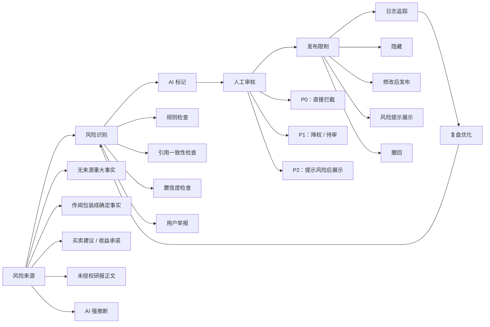

看图要点：

- 这张图把合规从单点审核变成闭环：风险来源、识别、标记、审核、发布限制、日志和复盘。
- 金融投研产品必须把边界视觉化，否则读者容易忽略“AI 输出不能直接当投资建议”。

### 14.2 产品表达边界

- 默认口径：信息聚合、研究辅助、行情复盘。
- 禁止口径：荐股、投顾、承诺收益、保证胜率、替用户决策。
- 每个事件、概念、个股 AI 分析页必须有风险提示。
- AI 内容必须标注生成时间、来源和“仅供研究参考，不构成投资建议”。

### 14.3 内容审核规则

P0 直接拦截：

- “建议买入/卖出/满仓/梭哈/稳赚/必涨/目标价必到”等指令或承诺。
- 无来源的重大事实断言。
- 将传闻包装为确定事实。
- 伪造机构观点、分析师观点或公告内容。
- 未授权展示付费研报正文。

P1 降权或待审：

- 低置信度事件。
- 来源单一且影响较大的内容。
- AI 对公司商业模式或竞争格局给出强判断但来源不足。

### 14.4 数据合规

- 行情、财务、公告、新闻、研报、股东、资金等数据必须维护数据源授权状态。
- 用户个人信息只采集账号、关注、提醒和使用行为等必要信息。
- 所有用户行为数据应提供隐私政策说明和删除/注销路径。

---

## 15. 依赖项

- 数据源授权：行情、公告、新闻、研报、财务、股东、融资融券、龙虎榜、概念库。
- AI 模型服务：文本生成、向量检索、实体识别、内容审核。
- 法务/合规：证券投资咨询边界、数据版权、AI 服务备案/公示、隐私政策。
- 设计：暗色投研工作台 UI、图表组件、响应式布局、空态和错误态。
- 运维：任务队列、数据采集监控、模型调用监控、日志留痕和回滚。

---

## 16. 事实 / 假设 / 待确认

### facts

- 输入材料明确要求做 AI 投研信息抓取、汇总、热点、概念、个股和风险分析。
- 原型截图显示产品名为“价小前投研”，且已覆盖高频跟踪、行情复盘、概念中心和个股详情。
- 当前材料没有提供真实数据源、用户访谈、商业模式和合规资质证明。

### assumptions

- MVP 首期以 A 股为主。
- 产品先作为研究辅助工具，而不是持牌投顾服务。
- 首期不接入交易、不接入用户持仓、不做社区荐股。
- 可以采购或接入合法授权的数据源。

### open_questions

- 目标用户优先级：个人高频投资者、财经创作者、机构研究助理，谁是首批付费用户？
- 是否已有证券投资咨询、研报发布或数据分发相关资质？
- 数据源供应商和预算是多少？
- Pro 订阅价格、免费额度、团队版是否已确定？
- AI 输出是否需要全部人工复核，还是只复核高风险内容？
- 是否要保留“AGENT 社群”入口，社群具体承载什么能力？
