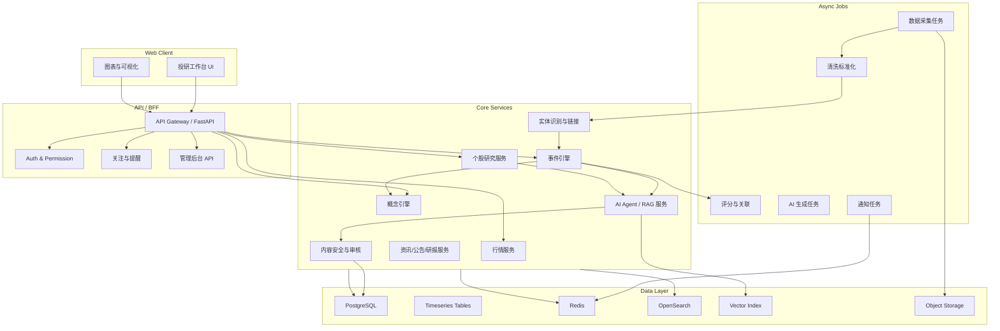
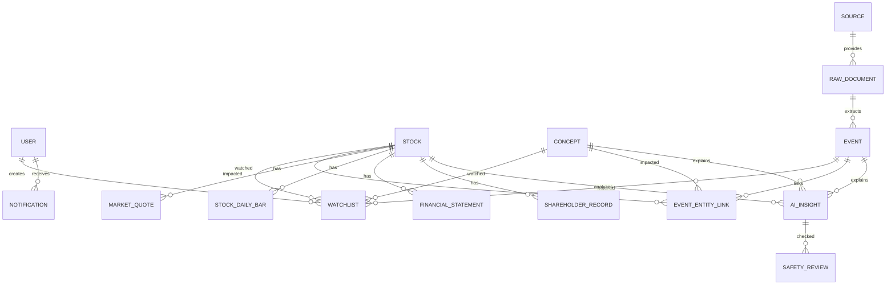
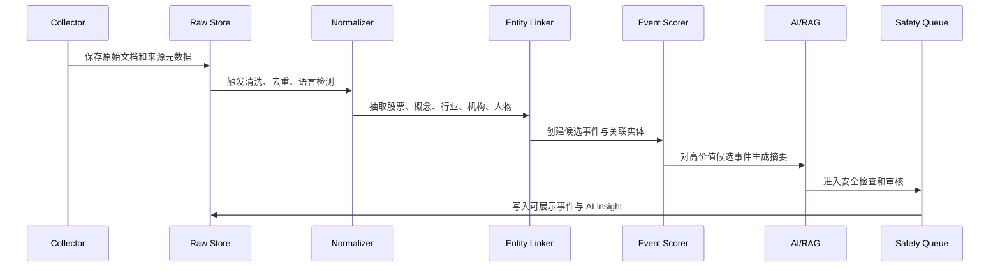
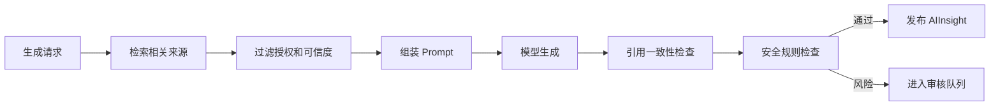

# 价小前投研开发文档

- 文档状态：Draft
- 适用阶段：MVP 技术方案与研发启动
- 最后更新：2026-04-26
- 关联 PRD：[01_prd.md](/Users/liujun/Desktop/产品经理skill/projects/jiaxiaoqian-ai-invest-research/01_prd.md)
- Codex 开发运行框架：[10_开发文档.md](/Users/liujun/Desktop/产品经理skill/projects/jiaxiaoqian-ai-invest-research/10_开发文档.md)

> 本文件保留技术设计与阶段效果；Codex 半自动开发时，以 `10_开发文档.md` 的产品经理 Skill 框架、内部多管家、效率部、教师、Skill/MCP Discovery、harness 和任务包规则为准。

---

## 1. 技术目标

MVP 需要实现一套可内测的 AI 投研工作台，重点不是先追求完整金融终端能力，而是把“数据采集 -> 结构化 -> 事件/概念/个股关联 -> AI 摘要 -> 前台展示 -> 关注提醒 -> 审核留痕”跑通。

技术目标：

- 数据可追溯：所有事件、摘要、AI 结论必须回溯到来源。
- AI 可控：模型输出经过来源约束、安全检查和审核留痕。
- 页面可用：核心页面首屏稳定、图表可交互、异常可降级。
- 合规优先：不输出交易指令，不承诺收益，不展示未授权内容。
- 可迭代：模块边界清晰，后续可增加 Pro、团队版、更多数据源和策略监控。

---

## 2. 分阶段实现效果

本节是研发阶段验收的核心。每个阶段都必须能回答“这个阶段做完后，用户看到什么、业务能验证什么、技术底座具备什么能力”。如果阶段效果没有达成，不能只因为代码写完就进入下一阶段。

### Phase 0：需求确认与开发启动

#### 阶段目标

把产品方向、合规边界、MVP 范围、数据源策略、AI 输出边界和开发节奏确认清楚，避免研发在关键假设不一致的情况下开工。

#### 实现效果

- 产品侧：明确首期目标用户、MVP 主路径、做什么和不做什么。
- 设计侧：确认低保真原型、页面优先级和主要信息架构。
- 研发侧：确认技术栈、仓库结构、服务拆分、数据库方案和部署方式。
- AI 侧：确认 AI 任务拆分、模型路由、内容安全和人工审核边界。
- 合规侧：确认“研究辅助，不构成投资建议”的产品表达边界。

#### 可验收结果

- PRD 正文包含功能流程图、原型图、AI 模型选型。
- P0 待确认问题有明确结论或被标记为假设。
- 研发任务拆分到前端、后端、数据、AI、测试、运维。
- 明确不能上线的能力：交易、荐股、目标价、收益承诺、未授权研报全文。

### Phase 1：工程底座与基础框架

#### 阶段目标

搭建项目可运行底座，让前端、后端、数据库、任务队列、缓存和基础部署跑起来。

#### 实现效果

- 用户侧：可以打开 Web 页面，看到全局导航、主布局、右侧快捷栏和基础空态。
- 产品侧：可以基于真实页面检查信息架构是否符合 PRD。
- 研发侧：前后端项目可启动，接口规范、统一响应结构、错误处理和基础日志可用。
- 运维侧：本地或测试环境能一键启动，健康检查可用。

#### 可验收结果

- `/health` 接口正常。
- 前端首页可访问。
- 数据库迁移可执行。
- Docker Compose 或等价本地启动方式可用。
- 基础 lint / test / build 流程可跑通。

### Phase 2：数据源、基础实体与搜索

#### 阶段目标

先把股票、概念、数据源、原始文档等基础数据对象建起来，让系统具备“能导入、能检索、能追溯来源”的底层能力。

#### 实现效果

- 用户侧：可以搜索股票、概念、事件关键词，并看到基础结果。
- 产品侧：可以验证股票、概念、资讯、公告、研报摘要等数据对象是否覆盖核心场景。
- 数据侧：数据源授权状态、发布时间、采集时间、来源 URL、可信度等级可记录。
- 技术侧：PostgreSQL、Redis、搜索索引和基础导入脚本可用。

#### 可验收结果

- 至少导入 100 只股票、50 个概念、300 条原始文档样例。
- 股票和概念支持名称/代码/关键词检索。
- 每条原始文档有来源、发布时间、授权状态和内容 hash。
- 未授权来源可被标记，后续展示层可识别。

### Phase 3：事件引擎与关联关系

#### 阶段目标

把原始文档转成可展示的结构化事件，并建立“事件-股票-概念-来源”的关联关系。

#### 实现效果

- 用户侧：可以看到事件列表、事件详情、事件日历和相关股票/概念。
- 产品侧：可以验证事件重要度、情绪、置信度、来源数量是否支持投研判断。
- 数据侧：事件去重、实体识别、事件评分、关联实体写入数据库。
- AI 侧：为后续 AI 摘要提供结构化输入。

#### 可验收结果

- 发布事件必须至少有 1 个来源。
- 事件详情展示来源、重要度、情绪、置信度、相关股票、相关概念。
- 低置信度或传闻事件进入待审核或显式标记。
- 事件列表筛选和事件日历统计一致。

### Phase 4：前台核心页面闭环

#### 阶段目标

完成用户能直接体验的核心页面，包括高频跟踪、概念中心、行情复盘和主要跳转路径。

#### 实现效果

- 用户侧：可以从高频跟踪发现事件，进入事件详情，再跳转概念和股票。
- 产品侧：可以验证 MVP 主路径是否顺畅，页面信息密度是否合理。
- 前端侧：图表、筛选、列表、详情、空态、错误态、权限态基本完整。
- 后端侧：核心列表和详情接口稳定返回。

#### 可验收结果

- 高频跟踪、事件详情、概念中心、行情复盘首版可用。
- 核心页面 P95 响应时间达到内测要求。
- 图表有更新时间、数据口径和不可用状态。
- 核心跳转链路：事件 -> 概念/股票 -> 个股详情可走通。

### Phase 5：个股详情与研究工作台

#### 阶段目标

完成个股研究承接页，让用户可以围绕单只股票完成基础研究。

#### 实现效果

- 用户侧：搜索或点击股票后，可以看到行情、估值、市值、主力动态、AI 分析、概念、新闻、财务和公司档案。
- 产品侧：可以验证“事件追踪 -> 个股研究”的承接是否成立。
- 数据侧：财务、股东、公告、新闻、概念关系被组织到同一股票上下文。
- 前端侧：六个一级 Tab 可切换且不丢失股票上下文。

#### 可验收结果

- 个股详情头部信息可展示：名称、代码、行业标签、价格、涨跌幅、开高低收、估值、市值、主力动态。
- 六个 Tab 可用：深度分析、股票行情、概念板块、动态跟踪、财务全景、公司档案。
- 数据为空时有明确空态，不展示错误数值。
- 所有金融数据展示来源和更新时间。

### Phase 6：AI 投研、RAG 与内容安全

#### 阶段目标

让 AI 能基于来源生成事件摘要、概念解释和个股分析，并通过安全规则与审核流程控制风险。

#### 实现效果

- 用户侧：可以看到有来源、有置信度、有风险提示的 AI 研究内容。
- 产品侧：可以验证 AI 是否真正提升事件理解和个股分析效率。
- AI 侧：RAG 检索、Prompt、结构化输出、引用检查、模型路由可用。
- 合规侧：买卖建议、收益承诺、无来源事实、传闻包装被拦截。
- 运营侧：管理员可以处理 AI 审核队列和用户举报。

#### 可验收结果

- AI 输出必须包含来源引用、生成时间、模型名、Prompt 版本、置信度和安全状态。
- 关键结论引用覆盖率 >= 98%。
- P0 风险表达拦截率 100%。
- 模型超时或失败时页面可降级。
- Admin 可审核通过、拦截、退回 AI 内容，并写入审计日志。

### Phase 7：关注提醒、埋点与运营看板

#### 阶段目标

让用户可以持续跟踪股票、事件和概念，同时让产品团队能看到核心漏斗和质量指标。

#### 实现效果

- 用户侧：可以关注股票、概念、事件，并收到站内提醒。
- 产品侧：可以看到事件详情点击率、个股研究会话、关注转化率等核心指标。
- 运营侧：可以监控数据源失败、AI 生成失败、风险内容拦截、用户反馈。
- 技术侧：通知任务、埋点上报、看板数据聚合可用。

#### 可验收结果

- 关注和取消关注可用。
- 关注对象发生 P0/P1 事件时生成站内通知。
- 核心埋点事件可查询。
- 产品增长、内容质量、合规安全三类看板可用。

### Phase 8：内测发布与上线准备

#### 阶段目标

完成内测环境发布、回归测试、性能优化、合规检查和灰度准备，让产品可以进入白名单内测。

#### 实现效果

- 用户侧：白名单用户可以稳定完成“事件追踪 -> 个股研究 -> 关注提醒”的完整路径。
- 产品侧：可以开始收集真实用户反馈，验证留存、使用频次和 AI 有用性。
- 技术侧：监控、告警、日志、备份、回滚和冒烟测试完整。
- 合规侧：免责声明、隐私政策、用户协议、数据源授权清单和 AI 风险规则已确认。

#### 可验收结果

- 核心 E2E 全部通过。
- 数据源断流、AI 超时、权限不足、内容违规等异常场景通过测试。
- 灰度名单、回滚方案、告警负责人明确。
- 内测发布 Checklist 全部完成。

### Phase 9：内测复盘与 V1 决策

#### 阶段目标

用内测数据决定是否进入 Pro 订阅、机构工作台、更多市场、导出和团队协作。

#### 实现效果

- 产品侧：基于真实数据判断主路径是否成立。
- 业务侧：判断是否具备收费、续费、转介绍或机构试用信号。
- 研发侧：识别性能瓶颈、数据质量问题、AI 质量问题和技术债。
- 合规侧：复盘风险内容、用户举报和审核效率。

#### 可验收结果

- 输出内测复盘报告。
- 明确 V1 范围和不做范围。
- 更新 PRD、开发文档、AI 模型选型和埋点方案。
- 决定是否启动 Pro 订阅、机构版或更多数据源采购。

---

## 3. 推荐技术栈

| 层级 | 推荐方案 | 说明 |
|---|---|---|
| Web 前端 | React + TypeScript + Next.js 或 Vite | 投研工作台页面多、交互重，前后端分离更合适 |
| UI / 图表 | Tailwind CSS、shadcn/ui、ECharts、TradingView Lightweight Charts | 暗色金融面板、K 线、热力图、关系图、词云 |
| BFF / API | Python FastAPI | 与 AI、数据处理生态兼容，接口开发快 |
| 任务队列 | Celery / Dramatiq / Temporal | 数据采集、AI 生成、重试、定时任务 |
| 数据库 | PostgreSQL + TimescaleDB 可选 | 业务数据、行情时间序列、任务状态 |
| 缓存 | Redis | 热榜、行情缓存、权限缓存、任务锁 |
| 搜索 | OpenSearch / Elasticsearch | 新闻、事件、股票、概念、全文检索 |
| 向量检索 | pgvector / Milvus | RAG 引用检索和相似事件召回 |
| 对象存储 | S3 兼容存储 | 原文快照、图表导出、AI 生成附件 |
| 监控 | Prometheus + Grafana / Sentry | 服务指标、前端错误、AI 调用异常 |
| 部署 | Docker Compose 起步，后续 Kubernetes | MVP 先保证可部署，后续扩容 |

MVP 若团队较小，可以先用 PostgreSQL + Redis + OpenSearch 三件套，向量库先用 pgvector，避免过早引入过多基础设施。

---

## 4. 总体架构



---

## 5. 领域模型

### 5.1 核心对象

- User：用户账号。
- Watchlist：关注股票、概念、事件。
- Stock：股票基础信息。
- Concept：概念/题材。
- Source：数据来源。
- RawDocument：原始新闻、公告、研报、调研纪要、传闻文本。
- Event：结构化事件。
- EventEntityLink：事件与股票/概念/行业的关联。
- MarketQuote：行情数据。
- StockDailyBar：日 K 数据。
- FinancialStatement：财务报表指标。
- ShareholderRecord：股东数据。
- AIInsight：AI 生成摘要与分析。
- SafetyReview：内容安全审核记录。
- Notification：提醒。

### 5.2 关系概览



---

## 6. 数据库设计

字段命名建议使用 snake_case。以下为 MVP 必备字段，真实实现可按 ORM 迁移脚本细化。

### 6.1 users

| 字段 | 类型 | 说明 |
|---|---|---|
| id | uuid | 主键 |
| email | varchar | 邮箱，可空 |
| phone | varchar | 手机号，可空 |
| display_name | varchar | 展示名 |
| role | enum | free / pro / admin |
| status | enum | active / disabled / deleted |
| created_at | timestamp | 创建时间 |
| updated_at | timestamp | 更新时间 |

### 6.2 stocks

| 字段 | 类型 | 说明 |
|---|---|---|
| id | uuid | 主键 |
| market | varchar | SSE / SZSE / BSE / US 等 |
| symbol | varchar | 股票代码 |
| name | varchar | 股票名称 |
| industry | varchar | 行业 |
| listing_status | enum | listed / suspended / delisted |
| tags | jsonb | 行业、风格、板块标签 |
| data_source_id | uuid | 数据来源 |
| updated_at | timestamp | 更新时间 |

唯一索引：`market + symbol`。

### 6.3 concepts

| 字段 | 类型 | 说明 |
|---|---|---|
| id | uuid | 主键 |
| name | varchar | 概念名称 |
| alias | varchar[] | 别名 |
| definition | text | 定义 |
| category | varchar | 产业、政策、事件、风格等 |
| heat_score | numeric | 当前热度 |
| status | enum | active / archived |
| updated_at | timestamp | 更新时间 |

### 6.4 raw_documents

| 字段 | 类型 | 说明 |
|---|---|---|
| id | uuid | 主键 |
| source_id | uuid | 来源 |
| source_type | enum | news / announcement / research / social / filing / market |
| title | text | 标题 |
| url | text | 原始链接 |
| author | varchar | 作者或机构 |
| published_at | timestamp | 来源发布时间 |
| collected_at | timestamp | 采集时间 |
| content_hash | varchar | 去重 hash |
| raw_text | text | 原文或摘要 |
| license_status | enum | authorized / public / unknown / forbidden |
| credibility_level | enum | official / media / institution / rumor / unknown |
| metadata | jsonb | 扩展信息 |

### 6.5 events

| 字段 | 类型 | 说明 |
|---|---|---|
| id | uuid | 主键 |
| title | text | 事件标题 |
| summary | text | 事件摘要 |
| event_type | enum | policy / company / industry / market / rumor / earnings / other |
| event_date | date | 事件日期 |
| occurred_at | timestamp | 发生时间 |
| importance_level | enum | S / A / B / C |
| sentiment | enum | bullish / bearish / neutral / mixed / unknown |
| confidence_score | numeric | 0-1 |
| heat_score | numeric | 热度 |
| status | enum | draft / published / hidden / review_required |
| source_count | integer | 来源数量 |
| primary_source_id | uuid | 主来源 |
| ai_generated | boolean | 是否由 AI 生成 |
| created_at | timestamp | 创建时间 |
| updated_at | timestamp | 更新时间 |

### 6.6 event_entity_links

| 字段 | 类型 | 说明 |
|---|---|---|
| id | uuid | 主键 |
| event_id | uuid | 事件 |
| entity_type | enum | stock / concept / industry |
| entity_id | uuid | 对象 ID |
| relation_type | enum | direct / upstream / downstream / peer / market_reaction / mentioned |
| impact_direction | enum | positive / negative / neutral / unknown |
| impact_score | numeric | 0-100 |
| evidence | jsonb | 来源证据 |
| created_at | timestamp | 创建时间 |

### 6.7 ai_insights

| 字段 | 类型 | 说明 |
|---|---|---|
| id | uuid | 主键 |
| subject_type | enum | event / stock / concept / market |
| subject_id | uuid | 对象 ID |
| insight_type | enum | summary / deep_analysis / risk / catalyst / business_model / financial_review |
| content | jsonb | 结构化内容 |
| source_refs | jsonb | 来源引用 |
| model_provider | varchar | 模型供应商 |
| model_name | varchar | 模型名称 |
| prompt_version | varchar | Prompt 版本 |
| confidence_score | numeric | 0-1 |
| safety_status | enum | pending / approved / blocked / needs_review |
| generated_at | timestamp | 生成时间 |
| reviewed_at | timestamp | 审核时间 |

### 6.8 notifications

| 字段 | 类型 | 说明 |
|---|---|---|
| id | uuid | 主键 |
| user_id | uuid | 用户 |
| subject_type | enum | event / stock / concept |
| subject_id | uuid | 对象 ID |
| notification_type | enum | new_event / price_move / heat_change / ai_update / announcement |
| title | text | 通知标题 |
| body | text | 通知正文 |
| priority | enum | P0 / P1 / P2 |
| read_at | timestamp | 已读时间 |
| created_at | timestamp | 创建时间 |

---

## 7. API 设计

接口前缀建议：`/api/v1`。所有列表接口统一支持 `page`、`page_size`、`sort`。所有需要登录的接口使用 Bearer Token 或 Session Cookie。

### 7.1 Auth

| 方法 | 路径 | 说明 |
|---|---|---|
| POST | `/auth/login` | 登录 |
| POST | `/auth/logout` | 登出 |
| GET | `/auth/me` | 当前用户 |

### 7.2 高频跟踪

| 方法 | 路径 | 说明 |
|---|---|---|
| GET | `/dashboard/high-frequency/summary` | 事件中心指标 |
| GET | `/events` | 事件列表 |
| GET | `/events/calendar` | 事件日历 |
| GET | `/events/{event_id}` | 事件详情 |
| GET | `/events/{event_id}/related-stocks` | 相关股票 |
| GET | `/events/{event_id}/related-concepts` | 相关概念 |
| POST | `/events/{event_id}/feedback` | 看涨/看跌/事实错误反馈 |

事件列表请求示例：

```http
GET /api/v1/events?date=2026-02-04&importance=S,A&industry=auto&sentiment=bullish&page=1&page_size=20
```

事件详情响应示例：

```json
{
  "id": "evt_001",
  "title": "嘉能可与美国固态电池企业达成合作",
  "summary": "市场监管总局已无条件批准相关经营者新设合营企业案。",
  "importance_level": "A",
  "sentiment": "mixed",
  "confidence_score": 0.82,
  "source_refs": [
    {
      "source_type": "news",
      "title": "来源标题",
      "url": "<source-url>",
      "published_at": "2026-02-04T10:25:00+08:00"
    }
  ],
  "related_stocks": [],
  "related_concepts": [],
  "ai_warning": "AI 生成内容仅供研究参考，不构成投资建议。"
}
```

### 7.3 概念中心

| 方法 | 路径 | 说明 |
|---|---|---|
| GET | `/concepts` | 概念列表 |
| GET | `/concepts/search` | 概念搜索 |
| GET | `/concepts/{concept_id}` | 概念详情 |
| GET | `/concepts/{concept_id}/stocks` | 概念相关股票 |
| GET | `/concepts/{concept_id}/timeline` | 概念历史时间轴 |

### 7.4 行情复盘

| 方法 | 路径 | 说明 |
|---|---|---|
| GET | `/market/overview` | 市场总览 |
| GET | `/market/heatmap` | 板块热力图 |
| GET | `/market/concept-moves` | 概念异动 |
| GET | `/market/limit-up-analysis` | 涨停板块分析 |
| GET | `/market/flexible-screen` | 灵活屏默认数据 |

### 7.5 个股详情

| 方法 | 路径 | 说明 |
|---|---|---|
| GET | `/stocks/search` | 股票搜索 |
| GET | `/stocks/{symbol}` | 个股头部信息 |
| GET | `/stocks/{symbol}/quotes` | 行情与分时 |
| GET | `/stocks/{symbol}/kline` | K 线 |
| GET | `/stocks/{symbol}/deep-analysis` | 深度分析 |
| GET | `/stocks/{symbol}/concepts` | 概念板块 |
| GET | `/stocks/{symbol}/news` | 新闻/公告 |
| GET | `/stocks/{symbol}/financials` | 财务全景 |
| GET | `/stocks/{symbol}/company-profile` | 公司档案 |

### 7.6 AI 生成

| 方法 | 路径 | 说明 |
|---|---|---|
| POST | `/ai/insights/generate` | 触发 AI 分析生成 |
| GET | `/ai/insights/{insight_id}` | 获取 AI 分析 |
| POST | `/ai/insights/{insight_id}/feedback` | AI 内容反馈 |

生成请求示例：

```json
{
  "subject_type": "stock",
  "subject_id": "stock_688256",
  "insight_type": "deep_analysis",
  "force_refresh": false
}
```

### 7.7 关注与提醒

| 方法 | 路径 | 说明 |
|---|---|---|
| GET | `/watchlists` | 我的关注 |
| POST | `/watchlists` | 新增关注 |
| DELETE | `/watchlists/{watch_id}` | 取消关注 |
| GET | `/notifications` | 通知列表 |
| POST | `/notifications/{id}/read` | 标记已读 |

### 7.8 管理后台

| 方法 | 路径 | 说明 |
|---|---|---|
| GET | `/admin/sources` | 数据源列表 |
| POST | `/admin/sources` | 新增数据源 |
| GET | `/admin/reviews` | 内容审核队列 |
| POST | `/admin/reviews/{id}/approve` | 审核通过 |
| POST | `/admin/reviews/{id}/block` | 拦截内容 |
| GET | `/admin/jobs` | 任务状态 |
| GET | `/admin/audit-logs` | 审计日志 |

---

## 8. 数据采集与事件引擎

### 8.1 数据采集流程



### 8.2 去重规则

- `content_hash` 完全相同：直接合并。
- 标题相似度高且来源时间接近：合并为同一事件的多个来源。
- 同一公告多平台转发：保留交易所/上市公司公告为主来源。
- 传闻和官方确认是两个状态，不可简单合并，需记录状态演进。

### 8.3 实体识别规则

识别对象：

- 股票：代码、简称、全称、历史简称。
- 概念：概念名称、别名、产业链关键词。
- 行业：申万/中信/自定义行业。
- 机构：券商、基金、上市公司、监管机构。
- 人物：实控人、高管、分析师、监管人物。

实体链接需要输出：

- `entity_type`
- `entity_id`
- `relation_type`
- `evidence_span`
- `confidence_score`

### 8.4 事件评分

MVP 评分建议：

```text
event_score =
  source_weight * 0.25 +
  entity_relevance * 0.20 +
  market_reaction * 0.20 +
  novelty_score * 0.15 +
  propagation_score * 0.10 +
  manual_rule_boost * 0.10
```

重要度映射：

| 分数 | 等级 | 前台展示 |
|---:|---|---|
| >= 85 | S | 高优先级、可触发提醒 |
| 70-84 | A | 默认展示 |
| 50-69 | B | 普通展示 |
| < 50 | C | 默认折叠或只在搜索展示 |

评分不能直接等同于投资价值，只代表事件在信息层面的关注优先级。

---

## 9. AI / RAG 设计

### 9.1 AI 任务类型

| 任务 | 输入 | 输出 | 展示位置 |
|---|---|---|---|
| 事件摘要 | 原始文档、实体、行情反应 | 摘要、背景、影响链路、风险 | 事件详情 |
| 概念解释 | 概念定义、事件、股票、产业链 | 定义、驱动、上下游、相关股票 | 概念详情 |
| 个股深度分析 | 财务、公告、新闻、研报摘要、行情 | 核心定位、商业模式、竞争、风险 | 个股详情 |
| 市场复盘 | 指数、涨停、概念热度、事件列表 | 主线、分歧、风险、待观察变量 | 行情复盘 |
| 内容安全 | AI 输出、规则库 | 通过/拦截/待审、原因 | 后台 |

### 9.2 RAG 流程



### 9.3 Prompt 输出结构

所有 AI 生成必须返回 JSON，避免纯自然语言难以验证：

```json
{
  "summary": "一句话摘要",
  "facts": ["可由来源支持的事实"],
  "inferences": ["基于事实的推断"],
  "risks": ["风险点"],
  "related_entities": [
    {
      "type": "stock",
      "id": "stock_688256",
      "reason": "来源中提及其产业链关系"
    }
  ],
  "source_refs": ["doc_001", "doc_002"],
  "confidence_score": 0.78,
  "not_investment_advice": true
}
```

### 9.4 内容安全规则

硬拦截词/意图：

- 买入、卖出、满仓、梭哈、必涨、稳赚、保本、目标价必到。
- 明示收益率承诺。
- 无资质情况下使用“投资建议”“荐股”“强烈推荐”。
- 伪造来源或引用不存在的公告、研报。

软审核场景：

- 传闻类来源。
- 低置信度但高影响事件。
- 涉及重大资产重组、监管调查、财务造假等敏感事项。
- 用户举报事实错误。

---

## 10. 前端页面结构

建议路由：

```text
/
/high-frequency
/events/:eventId
/concepts
/concepts/:conceptId
/market-review
/stocks/:symbol
/watchlist
/notifications
/profile
/admin
/admin/sources
/admin/reviews
/admin/jobs
```

### 10.1 页面状态

每个核心页面必须实现：

- loading：骨架屏，避免布局抖动。
- empty：无数据解释和推荐下一步。
- error：接口失败提示、重试按钮、错误 ID。
- stale：数据过期或延迟提示。
- permission：Pro 或 Admin 权限不足提示。

### 10.2 图表规范

- K 线和分时图必须支持区间选择、指标切换、tooltip。
- 热力图点击后联动右侧列表。
- 词云只用于概念热度展示，点击词条进入概念详情。
- 所有图表需要有数据更新时间和数据口径说明。

---

## 11. 权限与订阅

| 能力 | Free | Pro | Admin |
|---|---|---|---|
| 查看高频事件列表 | 是 | 是 | 是 |
| 查看事件详情基础信息 | 是 | 是 | 是 |
| 查看深度 AI 分析 | 部分 | 是 | 是 |
| 查看历史时间轴 | 近 7 天 | 全量授权范围 | 是 |
| 关注股票/概念/事件 | 限额 | 更高限额 | 是 |
| 导出 | 否 | 是 | 是 |
| 管理数据源 | 否 | 否 | 是 |
| 内容审核 | 否 | 否 | 是 |

权限判断建议放在后端，前端只做展示控制，避免 Pro 内容泄漏。

---

## 12. 安全、合规与审计

### 12.1 合规护栏

- 前台页脚和 AI 内容附近展示“不构成投资建议”。
- 行情数据展示延迟、来源和更新时间。
- AI 结论展示来源引用和置信度。
- 传闻类内容展示“未证实 / 待核验”。
- 未授权研报和付费内容不得展示全文。

### 12.2 审计日志

必须记录：

- 用户登录、关注、反馈、举报。
- 管理员审核、发布、隐藏、修改规则。
- AI 生成请求、输入文档 ID、Prompt 版本、模型、输出摘要、审核结果。
- 数据源采集失败、重试、授权状态变更。

### 12.3 隐私与数据最小化

- MVP 不接入券商账户、持仓和交易数据。
- 用户行为埋点只采集产品优化所需字段。
- 提供账号注销和关注数据删除能力。
- 敏感配置和 API Key 使用密钥管理，不写入仓库。

---

## 13. 缓存与性能

建议缓存策略：

| 数据 | 缓存时间 | 说明 |
|---|---:|---|
| 首页事件指标 | 30-60 秒 | 高频刷新 |
| 事件列表 | 30 秒 | 按筛选条件缓存 |
| 事件详情 | 5 分钟 | 来源更新时失效 |
| 概念列表 | 5 分钟 | 热度更新时失效 |
| 个股头部行情 | 5-30 秒 | 取决于行情授权 |
| AI 深度分析 | 24 小时 | 重要来源更新时重新生成 |
| 财务数据 | 1 天 | 财报更新时失效 |

性能目标：

- 核心列表接口 P95 < 500ms。
- 个股详情首屏 P95 < 900ms。
- AI 生成异步化，前台轮询或 SSE 获取状态。
- 图表数据分页/聚合，不一次性返回全量历史。

---

## 14. 部署与环境

### 14.1 环境

- `dev`：本地开发，使用模拟数据和少量真实样例。
- `staging`：内测环境，接入授权测试数据，启用审核。
- `prod`：正式环境，启用完整监控、告警和备份。

### 14.2 服务拆分

MVP 可以单仓单体起步，但内部模块要清晰：

```text
apps/web
apps/api
packages/shared
services/collectors
services/ai_worker
services/safety_worker
infra/docker
docs
```

### 14.3 CI/CD

建议流水线：

1. lint：前端 ESLint、后端 ruff/mypy。
2. test：单元测试、接口测试。
3. build：前端构建、后端镜像。
4. migration-check：数据库迁移检查。
5. security-check：依赖漏洞、密钥扫描。
6. deploy-staging：部署内测环境。
7. smoke-test：核心接口和页面冒烟。
8. manual-approval：正式发布人工确认。

---

## 15. 测试策略

### 15.1 单元测试

- 事件去重。
- 实体识别结果合并。
- 事件评分。
- 权限判断。
- AI 输出安全规则。
- 缓存 key 生成。

### 15.2 接口测试

- 高频事件列表筛选。
- 事件详情来源引用。
- 概念搜索。
- 个股详情各标签。
- 关注与取消关注。
- Admin 审核流程。

### 15.3 E2E 测试

核心路径：

1. 登录。
2. 打开高频跟踪。
3. 筛选 A 级事件。
4. 进入事件详情。
5. 跳转相关股票。
6. 查看深度分析。
7. 关注股票。
8. 收到提醒。

### 15.4 数据与 AI 质量测试

- 抽样检查事件来源是否真实可回溯。
- 抽样检查 AI 摘要是否被来源支持。
- 对风险词和买卖建议做红队测试。
- 对低置信度传闻做降权和标记测试。
- 对数据源断流做降级测试。

---

## 16. 开发约定

- 所有接口返回统一结构：

```json
{
  "data": {},
  "meta": {
    "request_id": "req_xxx",
    "generated_at": "2026-04-26T10:00:00+08:00"
  },
  "error": null
}
```

- 所有可展示金融数据包含：
  - `source`
  - `updated_at`
  - `delay_minutes`
  - `license_status`

- 所有 AI 内容包含：
  - `source_refs`
  - `confidence_score`
  - `model_name`
  - `prompt_version`
  - `safety_status`
  - `generated_at`

- 数据库迁移必须可回滚。
- 新增数据源必须补充授权状态和采集失败处理。
- 前端不得硬编码投资建议、收益承诺或高风险营销文案。

---

## 17. 人工确认点

以下事项不能由研发或 AI agent 自行决定，必须由负责人确认：

- 数据源采购和授权范围。
- 是否面向公众提供个性化证券投资建议。
- 是否启用付费 Pro。
- 是否接入第三方 AI 模型和数据跨境传输。
- 是否展示研报摘要、研报观点和机构观点。
- 是否打开用户评论、社群或 UGC。
- 上线前的免责声明、隐私政策、用户协议。
- 删除历史数据、修改审计日志或调整高风险审核规则。

---

## 18. 待确认技术问题

- 行情数据实时性要求：实时、延迟 15 分钟还是日级？
- 数据源供应商：是否已有采购对象和 API 文档？
- AI 模型供应商：是否要求使用已备案模型？
- 是否需要私有化部署或本地模型？
- 内测用户规模：100、1000 还是更高？
- 是否需要团队空间、协作批注和报告导出？
- 是否需要移动端专门适配？
