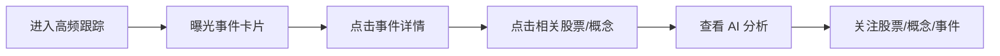
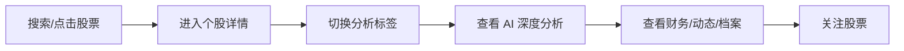

# 埋点、看板与验收测试

- 文档状态：Draft
- 关联 PRD：[01_prd.md](/Users/liujun/Desktop/产品经理skill/projects/jiaxiaoqian-ai-invest-research/01_prd.md)
- 最后更新：2026-04-26

---

## 1. 埋点目标

MVP 埋点服务三个目标：

- 证明用户是否真的完成核心研究路径。
- 发现事件、概念、个股、AI 分析中哪类内容最有价值。
- 监控数据和 AI 质量，避免高风险内容上线。

---

## 2. 核心漏斗

### 2.1 高频事件研究漏斗



指标：

- 高频跟踪访问人数。
- 事件卡片曝光数。
- 事件详情点击率。
- 相关实体跳转率。
- AI 分析展开率。
- 关注转化率。

### 2.2 个股研究漏斗



指标：

- 股票搜索成功率。
- 个股详情停留时长。
- 标签切换次数。
- AI 深度分析展开率。
- 关注股票转化率。

---

## 3. 事件命名规范

事件名使用小写 snake_case。公共字段：

| 字段 | 类型 | 说明 |
|---|---|---|
| event_name | string | 事件名 |
| user_id | string | 登录用户 ID，匿名则为空 |
| session_id | string | 会话 ID |
| role | string | free / pro / admin / anonymous |
| page | string | 页面 |
| referrer | string | 来源页面 |
| timestamp | datetime | 发生时间 |
| request_id | string | 请求 ID |
| client_version | string | 前端版本 |

---

## 4. 前端埋点

| 事件名 | 触发时机 | 关键属性 | 说明 |
|---|---|---|---|
| `page_viewed` | 页面打开 | page, path | 所有页面 |
| `search_submitted` | 用户搜索 | keyword, search_type | 股票/概念/事件/全文 |
| `search_result_clicked` | 点击搜索结果 | result_type, result_id, rank | 搜索转化 |
| `event_card_viewed` | 事件卡曝光 | event_id, importance_level, position | 曝光统计 |
| `event_card_clicked` | 点击事件卡 | event_id, importance_level | 详情点击 |
| `event_filter_changed` | 筛选变化 | filter_type, filter_value | 高频跟踪 |
| `event_detail_viewed` | 打开事件详情 | event_id, source_count, safety_status | 事件详情 |
| `related_entity_clicked` | 点击相关股票/概念 | entity_type, entity_id, event_id | 跳转路径 |
| `concept_viewed` | 打开概念详情 | concept_id, heat_score | 概念中心 |
| `market_review_viewed` | 打开行情复盘 | date, market | 复盘页 |
| `heatmap_cell_clicked` | 点击热力图 | sector, concept_id | 图表交互 |
| `stock_detail_viewed` | 打开个股详情 | symbol, source | 个股页 |
| `stock_tab_changed` | 切换个股标签 | symbol, tab_name | 标签使用 |
| `ai_insight_viewed` | AI 内容曝光 | insight_id, subject_type, safety_status | AI 价值 |
| `ai_insight_feedback` | AI 内容反馈 | insight_id, feedback_type | 有用/无用/错误/违规 |
| `watch_added` | 新增关注 | subject_type, subject_id | 关注 |
| `watch_removed` | 取消关注 | subject_type, subject_id | 关注 |
| `notification_clicked` | 点击通知 | notification_id, notification_type | 提醒转化 |
| `pro_gate_viewed` | 看到 Pro 门槛 | feature_key | 订阅机会 |
| `pro_upgrade_clicked` | 点击升级 | feature_key | 订阅转化 |

---

## 5. 后端与任务埋点

| 事件名 | 触发时机 | 关键属性 |
|---|---|---|
| `raw_document_collected` | 原始文档采集成功 | source_id, source_type, license_status |
| `raw_document_collect_failed` | 采集失败 | source_id, error_code |
| `document_normalized` | 文档清洗成功 | raw_document_id, content_hash |
| `entity_link_completed` | 实体识别完成 | raw_document_id, entity_count |
| `event_created` | 创建候选事件 | event_id, confidence_score |
| `event_published` | 事件发布 | event_id, importance_level |
| `event_review_required` | 事件待审 | event_id, reason |
| `ai_generation_started` | AI 任务开始 | subject_type, subject_id, insight_type |
| `ai_generation_succeeded` | AI 任务成功 | insight_id, model_name, latency_ms |
| `ai_generation_failed` | AI 任务失败 | subject_type, error_code |
| `ai_safety_blocked` | AI 内容被拦截 | insight_id, rule_id |
| `admin_review_action` | 管理员审核动作 | review_id, action, admin_id |
| `notification_created` | 创建提醒 | user_id, subject_type, priority |

---

## 6. 数据看板

### 6.1 产品增长看板

- DAU / WAU。
- 次日留存、7 日留存。
- 人均研究会话数。
- 搜索次数和搜索成功率。
- 事件详情点击率。
- 个股详情访问 Top 50。
- 概念访问 Top 50。
- 关注转化率。
- Pro 门槛曝光与点击。

### 6.2 内容质量看板

- 每日采集文档数。
- 数据源成功率。
- 数据入库延迟 P50/P95。
- 事件发布数。
- 事件待审数。
- AI 生成成功率。
- AI 平均生成耗时。
- AI 被拦截数。
- 用户反馈事实错误率。
- 无来源内容拦截数。

### 6.3 合规安全看板

- P0 风险拦截数。
- P1 待审内容数。
- 管理员平均处理时长。
- 命中买卖建议规则次数。
- 命中收益承诺规则次数。
- 传闻标记事件数。
- 未授权来源命中数。
- 审计日志异常数。

---

## 7. 测试用例

### 7.1 高频跟踪

| 用例 | 前置条件 | 操作 | 预期结果 | 优先级 |
|---|---|---|---|---|
| 高频首页加载 | 有事件样例数据 | 打开高频跟踪 | 指标卡、日历、事件列表展示 | P0 |
| 事件筛选 | 有 S/A/B/C 事件 | 选择 A 级事件 | 列表只展示 A 级事件，统计同步 | P0 |
| 事件详情 | 有发布事件 | 点击事件卡 | 打开详情，展示来源和关联实体 | P0 |
| 无来源事件 | 创建无来源事件 | 发布事件 | 发布失败或进入待审 | P0 |
| 传闻标记 | 来源可信度为 rumor | 打开事件详情 | 显示未证实/待核验标记 | P0 |
| 数据源失败 | 模拟采集失败 | 刷新页面 | 展示数据延迟或降级提示 | P1 |

### 7.2 概念中心

| 用例 | 前置条件 | 操作 | 预期结果 | 优先级 |
|---|---|---|---|---|
| 概念搜索 | 有概念样例 | 搜索“煤炭” | 返回概念和相关股票 | P0 |
| 概念详情 | 有概念事件 | 打开详情 | 展示定义、热度、事件、股票 | P0 |
| 相关股票跳转 | 概念有关联股票 | 点击股票 | 进入个股详情 | P0 |
| Pro 权限 | 免费用户 | 点击 Pro 历史时间轴 | 展示升级提示 | P1 |

### 7.3 行情复盘

| 用例 | 前置条件 | 操作 | 预期结果 | 优先级 |
|---|---|---|---|---|
| 复盘首页 | 有市场样例数据 | 打开行情复盘 | 市场概览和图表展示 | P0 |
| 热力图联动 | 有板块数据 | 点击热力图块 | 右侧列表或详情同步更新 | P1 |
| 行情延迟 | 模拟延迟数据 | 打开页面 | 显示延迟分钟和更新时间 | P0 |
| 无行情数据 | 删除样例行情 | 打开页面 | 展示空态，不展示错误数值 | P0 |

### 7.4 个股详情

| 用例 | 前置条件 | 操作 | 预期结果 | 优先级 |
|---|---|---|---|---|
| 股票搜索 | 有股票样例 | 搜索股票代码 | 进入对应个股详情 | P0 |
| 标签切换 | 个股数据完整 | 切换六个标签 | 页面正常展示，不丢股票上下文 | P0 |
| 财务空态 | 无财务数据 | 打开财务全景 | 展示空态和原因 | P1 |
| K 线指标 | 有 K 线数据 | 切换 MA/MACD | 图表更新 | P1 |
| 关注股票 | 用户已登录 | 点击关注 | 右侧关注栏新增股票 | P0 |

### 7.5 AI 与安全

| 用例 | 前置条件 | 操作 | 预期结果 | 优先级 |
|---|---|---|---|---|
| AI 生成成功 | 有来源文档 | 触发事件摘要 | 生成内容带来源和置信度 | P0 |
| AI 无来源 | 删除来源引用 | 触发生成 | 内容不发布或进入待审 | P0 |
| 买卖建议拦截 | AI 输出含“建议买入” | 安全检查 | 内容被拦截 | P0 |
| 收益承诺拦截 | AI 输出含“稳赚” | 安全检查 | 内容被拦截 | P0 |
| 模型超时 | 模拟模型超时 | 打开 AI 模块 | 展示降级提示 | P1 |
| 用户举报 | 用户反馈事实错误 | 点击举报 | 内容进入审核队列 | P0 |

### 7.6 Admin

| 用例 | 前置条件 | 操作 | 预期结果 | 优先级 |
|---|---|---|---|---|
| Admin 权限 | 普通用户 | 访问后台 | 403 或跳转无权限页 | P0 |
| 审核通过 | 有待审内容 | 点击通过 | 内容状态变为 approved，留痕 | P0 |
| 审核拦截 | 有待审内容 | 点击拦截 | 内容状态变为 blocked，前台不可见 | P0 |
| 数据源状态 | 有数据源 | 修改授权状态 | 记录管理员操作日志 | P0 |

---

## 8. 发布检查清单

### 8.1 产品与内容

- [ ] PRD 范围无未确认 P0 功能。
- [ ] 页面免责声明已出现。
- [ ] AI 内容免责声明已出现。
- [ ] 空态、错误态、延迟态、权限态完整。
- [ ] 样例数据不会被误认为真实数据。
- [ ] Pro 门槛不会泄漏高级内容。

### 8.2 技术

- [ ] 前端构建通过。
- [ ] 后端测试通过。
- [ ] 数据库迁移通过。
- [ ] 核心接口冒烟通过。
- [ ] E2E 核心路径通过。
- [ ] 日志和监控可用。
- [ ] 灰度和回滚方案可执行。

### 8.3 数据

- [ ] 数据源授权状态已登记。
- [ ] 未授权来源不展示全文。
- [ ] 行情数据延迟已标注。
- [ ] 来源引用可点击或可追溯。
- [ ] 采集失败告警可触达负责人。

### 8.4 AI 与合规

- [ ] AI 输出必须带来源。
- [ ] 买卖建议规则测试通过。
- [ ] 收益承诺规则测试通过。
- [ ] 传闻标记规则测试通过。
- [ ] 用户举报进入审核队列。
- [ ] 审计日志不可被普通管理员删除。
- [ ] 用户协议、隐私政策、风险提示已由负责人确认。

---

## 9. 内测反馈模板

```markdown
## 反馈标题

- 用户类型：
- 使用场景：
- 页面/模块：
- 发生时间：
- 问题描述：
- 预期表现：
- 实际表现：
- 影响程度：P0 / P1 / P2 / P3
- 是否涉及事实错误：
- 是否涉及合规风险：
- 截图/录屏：
- 处理结论：
```

---

## 10. 复盘问题

内测 2 周后必须回答：

- 用户最常打开的是事件、概念还是个股？
- 事件详情点击率是否达到 35%？
- 用户是否会从事件跳转到股票/概念？
- AI 深度分析是否真的被阅读？
- 用户反馈最多的问题是数据延迟、事实错误、页面复杂还是缺少功能？
- 哪类数据源贡献最大？
- 高风险内容是否全部被拦截？
- 是否具备转 Pro 的证据？

