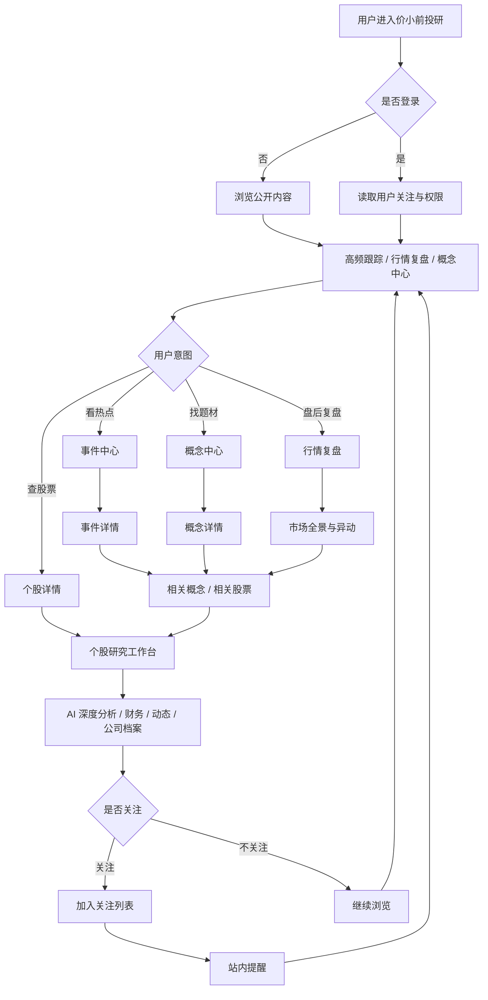
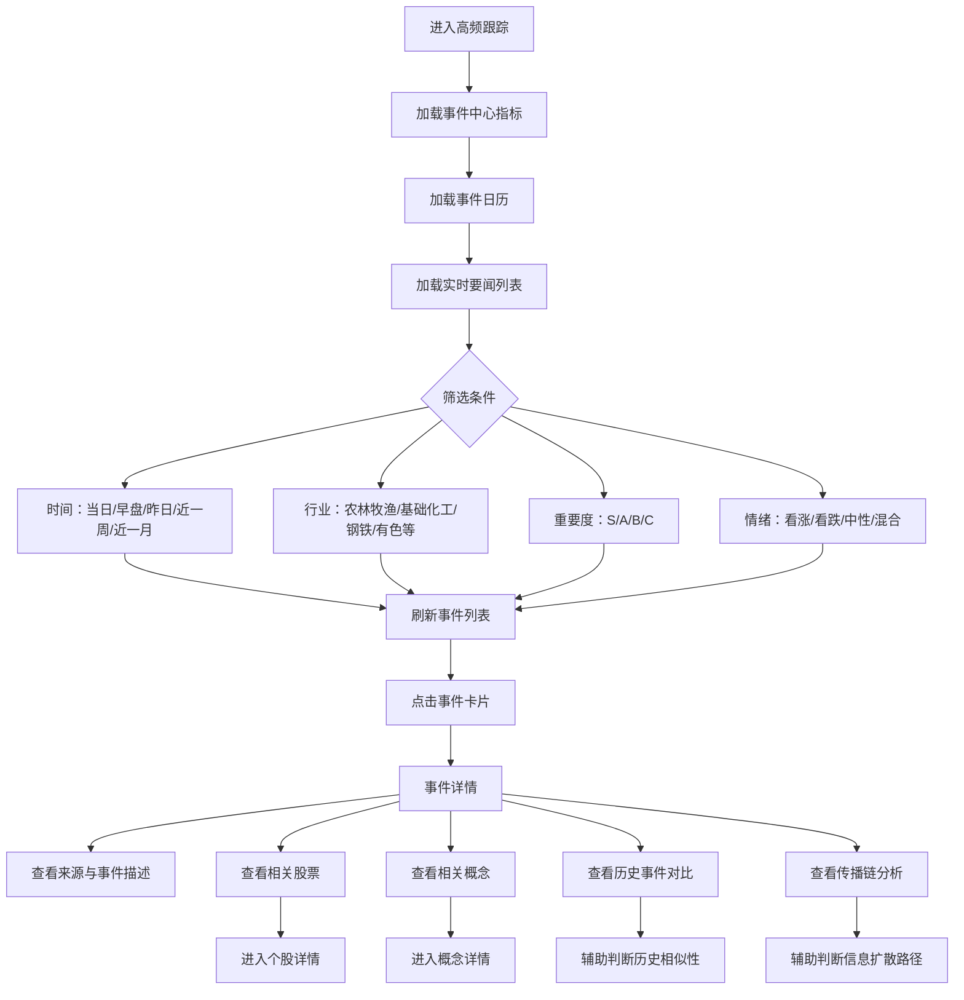
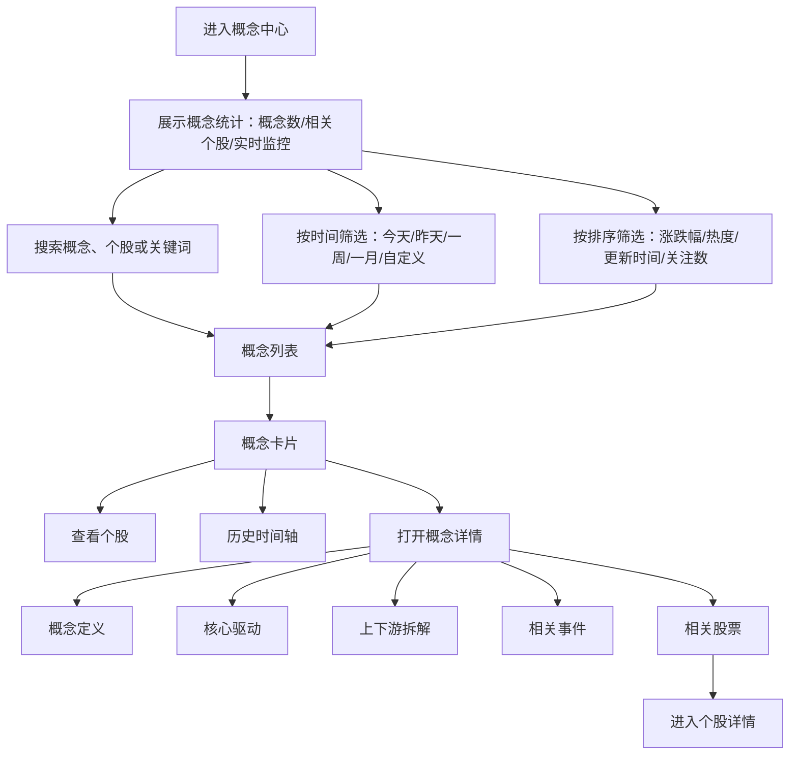
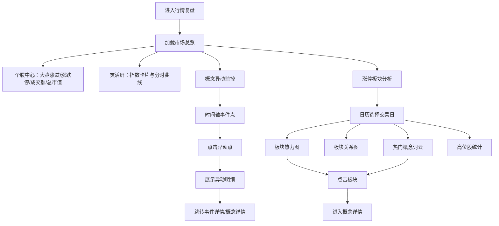
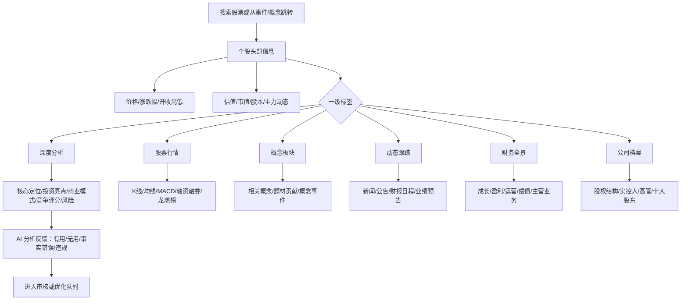
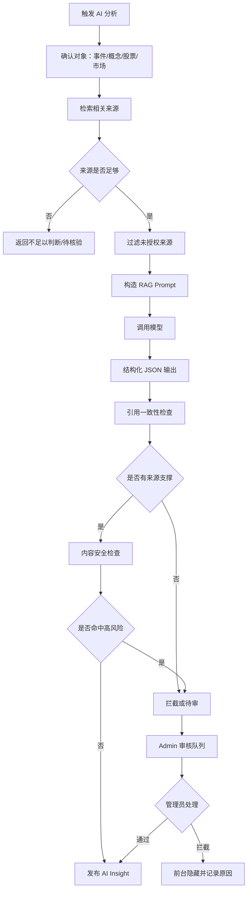
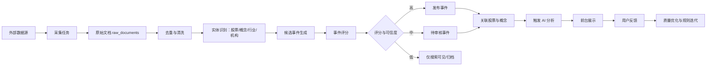
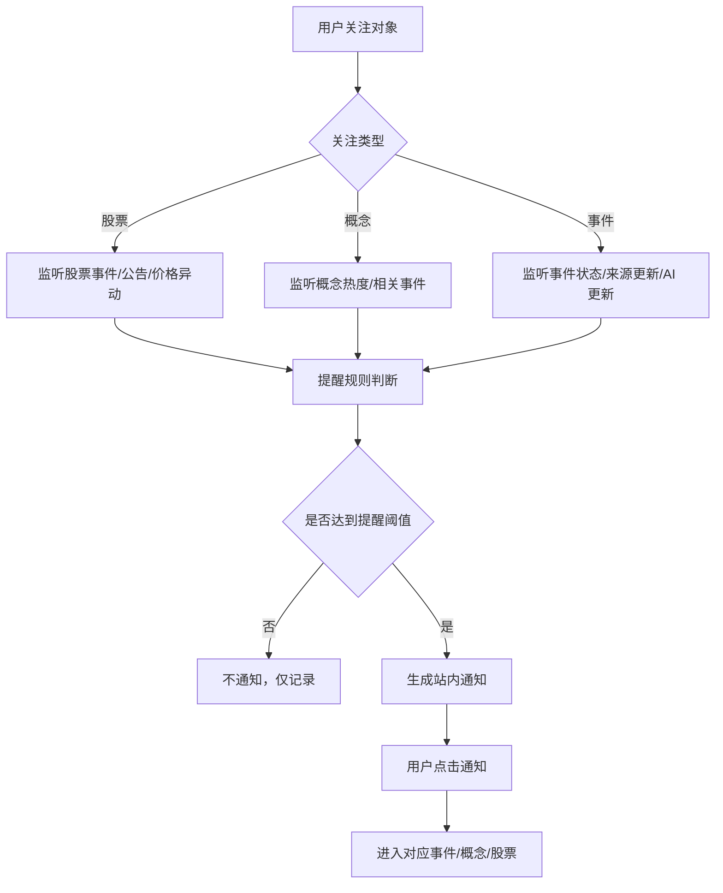
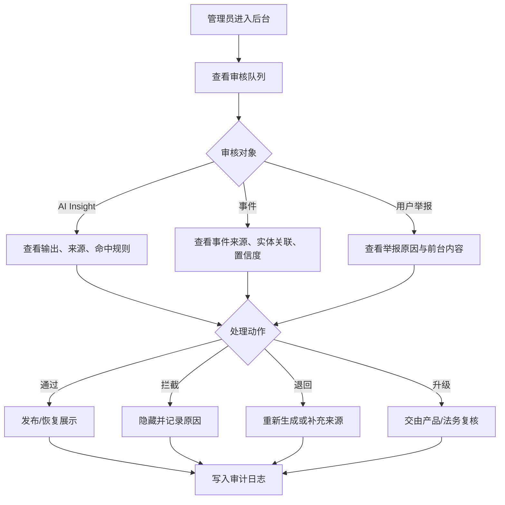
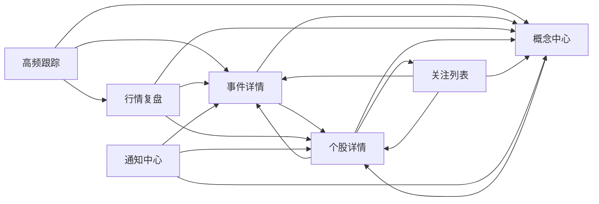

# 价小前投研功能流程图

- 文档状态：Draft
- 最后更新：2026-04-26
- 关联 PRD：[01_prd.md](/Users/liujun/Desktop/产品经理skill/projects/jiaxiaoqian-ai-invest-research/01_prd.md)

---

## 1. 产品总流程

---

## 2. 高频跟踪流程

---

## 3. 概念中心流程

---

## 4. 行情复盘流程

---

## 5. 个股详情流程

---

## 6. AI 生成与审核流程

---

## 7. 数据处理流程

---

## 8. 关注提醒流程

---

## 9. Admin 审核流程

---

## 10. 关键页面跳转关系

