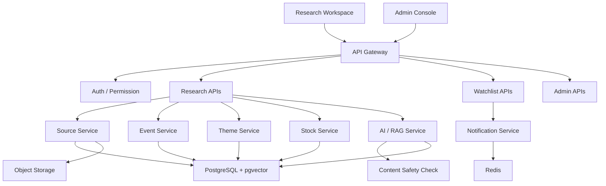
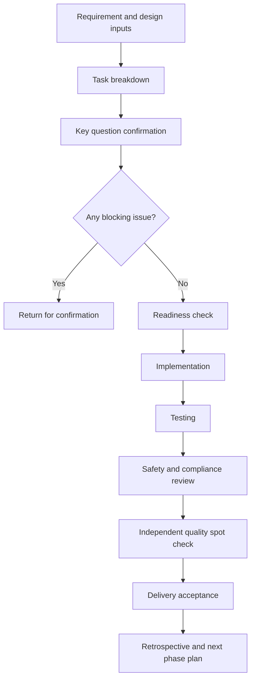

# B

- Status: Draft
- Audience: implementation team
- Paired requirement file: A
- Last updated: 2026-04-28

---

## 0. Use Boundary

This document describes implementation scope, technical approach, phased delivery, quality requirements, and acceptance standards.

It does not include process assets owned by the project owner, reusable templates, automation implementation details, or management methods. The implementation team only needs to follow this document to deliver the product.

---

## 1. Project Goal

Jiaxiaoqian Research is an AI-assisted investment research workspace for active A-share research users. The core workflow is:

```text
data collection
-> cleaning and deduplication
-> entity recognition
-> event / theme / stock linking
-> AI summary and analysis
-> content safety review
-> frontend display
-> watchlist alerts
-> tracking and review
```

MVP user-facing capabilities:

- High-frequency event tracking.
- Event detail page.
- Theme center.
- Market review.
- Stock detail page.
- AI research assistant.
- Watchlist alerts.
- Source citations.
- Risk notes.

---

## 2. Development Inputs

| Input | File |
|---|---|
| Product requirements | `A.md` |
| MVP release plan | `C.md` |
| Tracking and acceptance | `D.md` |
| Functional flow | `E.md` |
| Wireframe notes | `F.md` |
| AI plan | `G.md` |
| Open questions | `H.md` |
| HTML prototype | `prototype/index.html` |

---

## 3. Recommended Stack

| Layer | Recommendation | Notes |
|---|---|---|
| Frontend | React + TypeScript + Vite / Next.js | Multi-page research workspace |
| UI | Tailwind CSS + shadcn/ui | Fast implementation of a research dashboard |
| Charts | ECharts + Lightweight Charts | Heatmaps, trend lines, K-lines, and market charts |
| Backend API | Python FastAPI | Efficient for AI and data processing |
| ORM | SQLAlchemy / SQLModel | Clear data models and migrations |
| Database | PostgreSQL | Users, stocks, themes, events, tasks, and audit logs |
| Vector search | pgvector | Good enough for MVP and simpler operations |
| Cache / queue | Redis + RQ/Celery | Collection jobs, AI jobs, and notifications |
| Object storage | MinIO / S3-compatible storage | Source snapshots and report exports |
| Deployment | Docker Compose first | Simple local and staging setup |

---

## 4. Architecture



---

## 5. Development Flow



Implementation rules:

- Do not start implementation while a blocking issue remains unresolved.
- Do not add features outside the approved product requirements.
- Do not bypass source, permission, audit, content safety, or testing requirements.
- Confirm before changing data sources, model providers, database schema, or release behavior.
- If tests cannot run, state why and provide a substitute check.

---

## 6. Delivery Route

Delivery is managed in four top-level stages. Each stage must state goal, deliverables, delivered effect, and acceptance standards.

### 6.1 Stage 1: MVP Core Loop

Goal:

- Complete the minimum loop: event discovery -> event detail -> theme / stock -> stock research -> watchlist alert.
- Deliver baseline data, event engine, core pages, AI summary, and content safety.

Deliverables:

- Confirmed product requirements.
- Functional flow, wireframe notes, and AI plan.
- First version of the web workspace.
- Source and base entity setup.
- Event list, event detail, theme center, market review, and stock detail.
- AI summary, citations, confidence, and risk notes.

Delivered effect:

- Users can complete the core research path.
- The team can validate event tracking, theme navigation, and stock detail handoff.
- Frontend, backend, database, cache, job queue, AI/RAG, and safety review can run.
- Events, stocks, themes, and sources have baseline links.

Acceptance standards:

- Blocking questions are confirmed or marked as blocking.
- Core pages are accessible and the core navigation path works.
- AI output includes citations, confidence, risk notes, and generation state.
- Data includes source, authorization status, and update time.
- Basic tests, API checks, and core path manual checks are complete.

### 6.2 Stage 2: Efficiency, Quality, and Retention

Goal:

- Improve research efficiency, AI quality, watchlist alerts, and operational visibility.

Deliverables:

- Enhanced stock detail page.
- Watchlist and in-app notifications.
- AI content feedback.
- Growth dashboard, content quality dashboard, and safety dashboard.
- Data quality monitoring.

Delivered effect:

- Users can follow stocks, themes, and events and receive important updates.
- The team can observe event click-through, stock research sessions, watchlist conversion, and AI usefulness.
- AI quality, task duration, failure rate, and review backlog become observable.
- The team can handle reports, review tasks, source failures, and AI failures.

Acceptance standards:

- Follow, unfollow, and notification-read flows work.
- Core tracking events can be queried.
- AI feedback can be recorded.
- Content safety review actions are logged.
- Dashboards show growth, quality, and safety metrics.

### 6.3 Stage 3: Operations, Permissions, and Scale

Goal:

- Support stronger operations, data governance, permissions, and collaboration readiness.

Deliverables:

- Enhanced admin console.
- Source configuration and quality reports.
- Review, block, return, and correction workflow.
- User permissions and roles.
- Reserved foundation for Pro or team features.

Delivered effect:

- Frequent users can track and review with better stability.
- Operators can manage sources, review content, inspect failed jobs, and handle risks.
- Permissions, jobs, reviews, logs, retries, and rollback are more complete.
- The system has a foundation for subscriptions, team space, or institutional pilots.

Acceptance standards:

- Admin users can configure sources and view job states.
- Review queue supports approve, block, return, and correction actions.
- Permission control covers user, admin, and operator roles.
- Source failures, AI failures, and job failures have alert and retry strategies.

### 6.4 Final Stage: Stable Release and Long-Term Evolution

Goal:

- Prepare a stable, operable, reviewable, and evolvable AI research platform.

Deliverables:

- Staging and production environments.
- User agreement, privacy policy, and risk notices.
- Monitoring, alerting, backup, and rollback.
- Beta review report.
- V1 scope recommendation.

Delivered effect:

- Allowlisted users can reliably complete event tracking -> stock research -> watchlist alerts.
- Real data can validate core path, retention, AI usefulness, and commercial signals.
- Release, monitoring, backup, rollback, and exception handling can run sustainably.
- V1 scope is clear.

Acceptance standards:

- Core E2E checks pass.
- Source outage, AI timeout, permission failure, and content violation scenarios pass.
- Gray release and rollback plan can be executed.
- Beta review report and V1 scope are delivered.

---

## 7. Task Brief Format

Each task must include:

- Goal.
- Input documents.
- Allowed change scope.
- Forbidden change scope.
- Expected output.
- API / data impact.
- Testing requirements.
- Safety and compliance requirements.
- Approval points.
- Minimal fix strategy.

---

## 8. Quality Gates

| Gate | Pass standard |
|---|---|
| Scope gate | Do not add features outside approved requirements or change the MVP path |
| Design gate | Pages stay aligned with wireframes, flows, and states |
| Data gate | Key data keeps source, authorization status, update time, and credibility |
| AI gate | AI output includes citations, confidence, risk notes, and fallback |
| Safety gate | No trading instruction, guaranteed return, target price, or position sizing advice |
| Testing gate | Unit, API, core path tests, or substitute checks are complete |
| Release gate | Rollback, monitoring, error handling, and acceptance records are ready |

---

## 9. Approval Points

Confirm before:

- Product requirement scope changes.
- Data source authorization changes.
- Database schema changes.
- External API or model provider integration.
- High-cost model usage.
- Public release.
- GitHub push / PR / production release.
- Data deletion, data migration, or irreversible operations.

---

## 10. Start Checklist

- [ ] Product requirement scope is confirmed.
- [ ] Data source authorization strategy is confirmed.
- [ ] AI output boundary is confirmed.
- [ ] Technical stack is confirmed.
- [ ] Initial data model is confirmed.
- [ ] Initial API plan is confirmed.
- [ ] Stage delivered effects are confirmed.
- [ ] Testing strategy is confirmed.
- [ ] Quality gates are confirmed.
- [ ] Gray release and rollback plan are confirmed.
