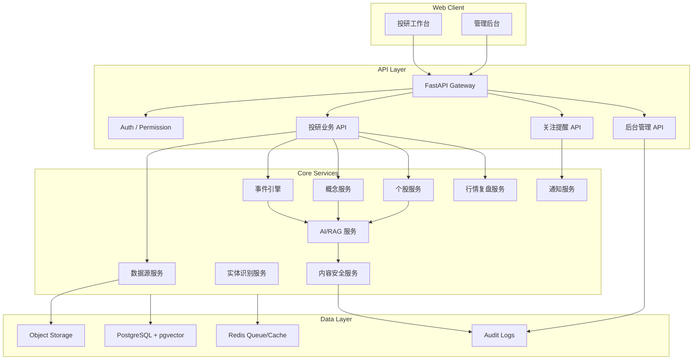
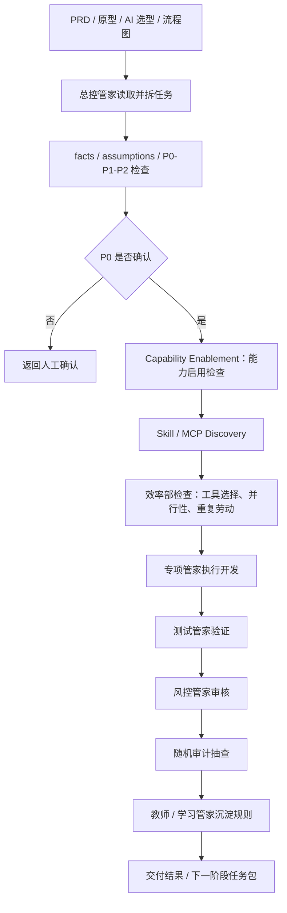

# 价小前投研开发文档（开发内部版）

- 文档状态：Draft
- 适用阶段：MVP 技术方案与自主开发启动
- 配套产品 PRD：[01_prd.md](/Users/liujun/Desktop/产品经理skill/projects/jiaxiaoqian-ai-invest-research/01_prd.md)
- 分发等级：内部完整版，仅在明确要求内部版 / 自己用 / 自己项目 / 我的项目 / 可信团队时使用
- 最后更新：2026-04-28

---

## 0. 文档边界

本文件是开发文档，只描述如何实现产品，不重新定义产品。

本文件嵌入完整产品经理 Skill 治理框架，适用于“这是我自己的项目”或明确可信的内部开发场景。若开发方案需要发给外部开发者、外包团队、合作方或投资人，应使用脱敏后的外部分发版，只暴露交付流程、质量门禁、验收要求和责任边界，不暴露内部多管家、效率部、教师、Skill/MCP、harness、registry、memory 等框架细节。

用户侧产品仍然是：

- 高频跟踪
- 事件详情
- 概念中心
- 行情复盘
- 个股详情
- AI 投研助手
- 关注提醒
- 来源引用
- 风险提示

以下内容只属于开发内部，不进入用户侧产品表达：

- 多 agent / 多管家开发协作
- Skill / MCP
- harness
- Codex 任务包
- 写入边界
- 内部审计
- 开发效率治理

AI 模型选型在产品 PRD 中可以作为能力边界和技术约束出现，但不能被包装成用户可见的“多管家产品形态”。最终用户只需要看到稳定、可追溯、可审核的 AI 投研结果。

---

## 1. 开发目标

MVP 要实现一个可内测的 AI 投研工作台，跑通核心链路：

```text
数据采集
-> 清洗去重
-> 实体识别
-> 事件/概念/个股关联
-> RAG 检索
-> AI 摘要与分析
-> 内容安全审核
-> 前台展示
-> 关注提醒
-> 埋点与复盘
```

开发目标：

- 数据可追溯：事件、概念、个股分析必须能回到来源。
- AI 可控：AI 输出必须经过引用检查、安全规则和必要的人工审核。
- 页面可用：用户能完成“事件发现 -> 事件详情 -> 概念/股票 -> 个股研究 -> 关注提醒”主路径。
- 合规优先：禁止交易指令、目标价、仓位建议、收益承诺和未授权内容分发。
- 工程可迭代：服务边界清晰，后续可扩展 Pro、团队空间、报告导出和更多数据源。

---

## 2. 技术栈建议

| 层级 | 推荐技术 | 说明 |
|---|---|---|
| 前端 | React + TypeScript + Vite / Next.js | 工作台、多页面、复杂交互 |
| UI | Tailwind CSS + shadcn/ui | 快速构建暗色投研工作台 |
| 图表 | ECharts + Lightweight Charts | 热力图、折线、K 线、雷达图 |
| 后端 API | Python FastAPI | AI、数据处理、接口开发效率高 |
| ORM | SQLAlchemy / SQLModel | 数据模型与迁移清晰 |
| 数据库 | PostgreSQL | 用户、股票、概念、事件、任务、审计 |
| 向量检索 | pgvector 起步 | RAG 召回，MVP 不引入复杂向量库 |
| 搜索 | PostgreSQL FTS 起步，后续 OpenSearch | MVP 控制基础设施复杂度 |
| 缓存 / 队列 | Redis + RQ/Celery | 采集、AI 生成、通知任务 |
| 对象存储 | 本地 MinIO / S3 兼容 | 原文快照、报告导出 |
| 监控 | Sentry + OpenTelemetry 可选 | 前后端错误、模型调用、任务耗时 |
| 部署 | Docker Compose 起步 | 自主开发、后续迁移云部署 |

MVP 先用 `web + api + postgres + redis` 四个服务，搜索和向量能力先由 PostgreSQL 承载。

---

## 3. 总体架构



---

## 4. 分阶段实现效果

每个阶段必须同时说明“交付物、阶段实现效果、验收标准”。代码完成不等于阶段完成，阶段效果没达到不能进入下一阶段。

### Phase 0：需求确认与工程启动

目标：

- 锁定 MVP 主路径、产品边界、AI 输出边界、数据源策略和开发范围。

交付物：

- PRD 确认版。
- 功能流程图、原型图、AI 模型选型。
- 开发任务拆分。
- 本开发文档。

阶段实现效果：

- 产品侧：明确用户侧产品不展示内部多 agent / 多管家概念。
- 研发侧：确认技术栈、仓库结构、服务边界和阶段计划。
- AI 侧：确认模型路由、RAG、内容安全和审核链路。
- 合规侧：明确“不构成投资建议”的表达边界。

验收标准：

- P0 问题已确认或显式标注为假设。
- 研发任务能拆到前端、后端、数据、AI、测试、运维。
- 明确禁止能力：真实交易、荐股、目标价、仓位建议、收益承诺、未授权研报全文。

### Phase 1：工程底座

目标：

- 跑通前端、后端、数据库、缓存、基础部署和健康检查。

交付物：

- `apps/web`
- `apps/api`
- `docker-compose.yml`
- PostgreSQL / Redis
- 基础布局和 `/health`

阶段实现效果：

- 用户效果：能打开 Web 壳页面，看到顶部导航、主内容区、右侧关注入口和基础空态。
- 技术效果：开发环境可启动，统一响应结构、错误处理、日志和数据库迁移可用。
- 运维效果：本地或测试环境可以一键启动和健康检查。

验收标准：

- `/health` 返回正常。
- 前端首页可访问。
- 数据库迁移可执行。
- lint / test / build 基础命令可跑通。

### Phase 2：数据源与基础实体

目标：

- 建立股票、概念、数据源、原始文档和搜索能力。

交付物：

- `sources`
- `raw_documents`
- `stocks`
- `concepts`
- 数据导入脚本
- 搜索接口

阶段实现效果：

- 用户效果：能搜索股票、概念、事件关键词。
- 数据效果：每条资料都有来源、发布时间、采集时间、授权状态和可信度。
- 风控效果：未授权、传闻、低可信来源在数据层被标记。

验收标准：

- 至少导入 100 只股票、50 个概念、300 条文档样例。
- 股票和概念支持名称/代码/关键词检索。
- 原始文档支持去重和来源追溯。
- 未授权来源不会进入正式展示内容。

### Phase 3：事件引擎

目标：

- 从原始文档生成结构化事件，并关联股票、概念和来源。

交付物：

- `events`
- `event_entity_links`
- 事件评分逻辑
- 事件列表 / 详情 / 日历 API

阶段实现效果：

- 用户效果：能在高频跟踪看到事件列表，进入事件详情，看到相关股票和概念。
- 产品效果：形成“资料 -> 事件 -> 影响对象”的核心投研链路。
- 技术效果：事件去重、实体链接、重要度、情绪、置信度可用。

验收标准：

- 发布事件至少有一个来源。
- 事件详情展示来源、重要度、情绪、置信度、相关股票、相关概念。
- 低置信度或传闻事件进入待审或显式标记。
- 事件列表筛选和事件日历统计一致。

### Phase 4：前台核心页面

目标：

- 完成用户侧 MVP 主路径页面。

交付物：

- 高频跟踪页。
- 事件详情页 / 弹窗。
- 概念中心页。
- 行情复盘页。
- 核心跳转链路。

阶段实现效果：

- 用户效果：能完成“发现事件 -> 进入事件详情 -> 跳转概念/股票”的路径。
- 产品效果：可以验证事件追踪主路径是否成立。
- 前端效果：列表、筛选、图表、详情、loading、empty、error、permission、stale 状态可用。

验收标准：

- 高频跟踪、概念中心、行情复盘可访问。
- 事件、概念、股票之间可跳转。
- 图表展示更新时间和数据口径。
- 数据不可用时展示降级状态，不展示错误数值。

### Phase 5：个股详情

目标：

- 建立单只股票的研究承接页。

交付物：

- 个股头部信息。
- 深度分析。
- 股票行情。
- 概念板块。
- 动态跟踪。
- 财务全景。
- 公司档案。

阶段实现效果：

- 用户效果：用户可以搜索或点击股票后完成单只股票初筛。
- 产品效果：个股详情承接事件和概念流量，形成研究闭环。
- 数据效果：财务、公告、新闻、股东、概念、行情都组织在同一股票上下文。

验收标准：

- 股票详情展示名称、代码、行业标签、价格、涨跌幅、估值、市值、主力动态。
- 六个 Tab 可切换且不丢失股票上下文。
- 数据为空时展示明确空态。
- 所有金融数据展示来源和更新时间。

### Phase 6：AI/RAG 与内容安全

目标：

- 让 AI 基于来源生成事件摘要、概念解释和个股分析，并通过安全规则控制风险。

交付物：

- RAG 检索。
- Prompt 模板。
- 模型路由。
- AI 生成任务队列。
- 引用一致性检查。
- 内容安全规则。
- 审核队列。

阶段实现效果：

- 用户效果：看到有来源、有置信度、有风险提示的 AI 投研内容。
- AI 效果：输出区分 facts、inferences、risks、unknowns。
- 合规效果：买卖建议、收益承诺、目标价、仓位建议、无来源重大事实被拦截。
- 运营效果：管理员可以审核、拦截、退回和修正 AI 内容。

验收标准：

- AI 输出包含 `source_refs`、`confidence_score`、`model_name`、`prompt_version`、`safety_status`。
- 关键结论引用覆盖率 >= 98%。
- P0 风险表达拦截率 100%。
- 模型超时或失败时页面可降级。
- 审核动作写入审计日志。

### Phase 7：关注提醒、埋点与看板

目标：

- 完成用户留存闭环和产品观测能力。

交付物：

- Watchlist。
- 站内通知。
- 埋点事件。
- 产品增长看板。
- 内容质量看板。
- 合规安全看板。

阶段实现效果：

- 用户效果：用户能关注股票、概念、事件，并收到重要更新提醒。
- 产品效果：能看到事件点击率、个股研究会话、关注转化、AI 有用率。
- 运营效果：能监控数据源失败、AI 失败、风险拦截和用户举报。

验收标准：

- 关注、取消关注、通知已读可用。
- P0/P1 关注事件生成站内通知。
- 核心埋点可查询。
- 三类看板可用：增长、内容质量、合规安全。

### Phase 8：内测发布

目标：

- 让白名单用户稳定使用完整 MVP。

交付物：

- 内测环境。
- 回归测试。
- 性能优化。
- 灰度名单。
- 回滚方案。
- 用户协议、隐私政策、风险提示。

阶段实现效果：

- 用户效果：白名单用户可稳定完成“事件追踪 -> 个股研究 -> 关注提醒”。
- 产品效果：开始收集真实留存、使用频次、AI 有用率和用户反馈。
- 技术效果：监控、告警、日志、备份、回滚和冒烟测试完整。
- 合规效果：免责声明、数据源授权清单、AI 风险规则和审核链路可用。

验收标准：

- 核心 E2E 全部通过。
- 数据源断流、AI 超时、权限不足、内容违规等异常场景通过。
- 灰度和回滚方案明确。
- 内测发布 Checklist 全部完成。

### Phase 9：内测复盘与 V1 决策

目标：

- 基于内测数据决定 V1 范围。

交付物：

- 内测复盘报告。
- V1 范围建议。
- 技术债清单。
- AI 质量评估。
- 数据源质量评估。

阶段实现效果：

- 产品效果：判断事件追踪主路径、个股详情承接和关注提醒是否成立。
- 业务效果：判断是否具备 Pro 订阅、机构版或数据服务信号。
- 技术效果：识别性能瓶颈、AI 质量问题、数据质量问题和工程债。

验收标准：

- 输出内测复盘报告。
- 明确 V1 做什么、不做什么。
- 更新 PRD、开发文档、AI 模型选型和埋点方案。

---

## 5. 数据模型

### 5.1 用户与权限

- `users`：账号、角色、状态、创建时间。
- `teams`：团队空间，V1 可做。
- `team_members`：团队角色，V1 可做。
- 角色建议：`free`、`pro`、`admin`。

### 5.2 数据源与原始文档

| 表 | 说明 |
|---|---|
| `sources` | 数据源配置、授权状态、可信度 |
| `raw_documents` | 新闻、公告、研报摘要、PDF、URL 原始资料 |
| `document_chunks` | RAG 分块文本 |
| `source_snapshots` | 原文快照或对象存储引用 |

关键字段：

- `source_type`
- `license_status`
- `credibility_level`
- `published_at`
- `collected_at`
- `content_hash`
- `raw_text`
- `metadata`

### 5.3 股票、概念、事件

| 表 | 说明 |
|---|---|
| `stocks` | 股票基础信息 |
| `concepts` | 概念 / 题材 |
| `events` | 结构化事件 |
| `event_entity_links` | 事件与股票/概念/行业关系 |
| `concept_stock_links` | 概念与股票关系 |

### 5.4 AI 与审核

| 表 | 说明 |
|---|---|
| `ai_tasks` | AI 生成任务 |
| `ai_insights` | AI 输出内容 |
| `safety_reviews` | 内容安全审核 |
| `audit_logs` | 操作审计 |
| `model_call_logs` | 模型调用记录 |

### 5.5 关注与通知

| 表 | 说明 |
|---|---|
| `watchlists` | 用户关注股票、概念、事件 |
| `notifications` | 站内提醒 |
| `notification_rules` | 提醒规则 |

---

## 6. API 设计

接口前缀：`/api/v1`

### 6.1 Auth

| 方法 | 路径 | 说明 |
|---|---|---|
| POST | `/auth/login` | 登录 |
| POST | `/auth/logout` | 登出 |
| GET | `/auth/me` | 当前用户 |

### 6.2 高频跟踪 / 事件

| 方法 | 路径 | 说明 |
|---|---|---|
| GET | `/events` | 事件列表 |
| GET | `/events/calendar` | 事件日历 |
| GET | `/events/{id}` | 事件详情 |
| GET | `/events/{id}/related-stocks` | 相关股票 |
| GET | `/events/{id}/related-concepts` | 相关概念 |
| POST | `/events/{id}/feedback` | 事件反馈 |

### 6.3 概念中心

| 方法 | 路径 | 说明 |
|---|---|---|
| GET | `/concepts` | 概念列表 |
| GET | `/concepts/search` | 概念搜索 |
| GET | `/concepts/{id}` | 概念详情 |
| GET | `/concepts/{id}/stocks` | 相关股票 |
| GET | `/concepts/{id}/timeline` | 概念时间轴 |

### 6.4 个股详情

| 方法 | 路径 | 说明 |
|---|---|---|
| GET | `/stocks/search` | 股票搜索 |
| GET | `/stocks/{symbol}` | 个股头部 |
| GET | `/stocks/{symbol}/quotes` | 行情 |
| GET | `/stocks/{symbol}/deep-analysis` | 深度分析 |
| GET | `/stocks/{symbol}/concepts` | 概念板块 |
| GET | `/stocks/{symbol}/news` | 新闻公告 |
| GET | `/stocks/{symbol}/financials` | 财务全景 |
| GET | `/stocks/{symbol}/company-profile` | 公司档案 |

### 6.5 AI

| 方法 | 路径 | 说明 |
|---|---|---|
| POST | `/ai/insights/generate` | 触发 AI 生成 |
| GET | `/ai/insights/{id}` | 获取 AI 内容 |
| POST | `/ai/insights/{id}/feedback` | AI 内容反馈 |

### 6.6 关注与提醒

| 方法 | 路径 | 说明 |
|---|---|---|
| GET | `/watchlists` | 我的关注 |
| POST | `/watchlists` | 新增关注 |
| DELETE | `/watchlists/{id}` | 取消关注 |
| GET | `/notifications` | 通知列表 |
| POST | `/notifications/{id}/read` | 标记已读 |

### 6.7 Admin

| 方法 | 路径 | 说明 |
|---|---|---|
| GET | `/admin/sources` | 数据源列表 |
| GET | `/admin/jobs` | 任务状态 |
| GET | `/admin/reviews` | 内容审核 |
| POST | `/admin/reviews/{id}/approve` | 审核通过 |
| POST | `/admin/reviews/{id}/block` | 拦截 |
| GET | `/admin/audit-logs` | 审计日志 |

---

## 7. AI 实现方案

AI 模型选型展开版见：[07_ai_model_selection.md](/Users/liujun/Desktop/产品经理skill/projects/jiaxiaoqian-ai-invest-research/07_ai_model_selection.md)。

开发实现只落“模型路由、RAG、引用检查、内容安全和审核队列”，不把模型供应商、内部 agent 或管家协作包装成用户侧产品功能。

### 7.1 模型路由

```yaml
model_router:
  extract:
    use_for: [entity_extract, classification, tagging]
    model_level: fast_low_cost
  summary:
    use_for: [event_summary, concept_explain]
    model_level: mid_quality
  deep_analysis:
    use_for: [stock_deep_analysis, market_review]
    model_level: high_quality
  safety:
    use_for: [compliance_check, forbidden_expression_check]
    model_level: rules_plus_classifier
```

这不是用户可见的多 agent 产品，而是内部模型路由。

### 7.2 RAG 流程

```text
生成请求
-> 检索相关来源
-> 过滤未授权和低可信来源
-> 组装 Prompt
-> 模型生成结构化 JSON
-> 引用一致性检查
-> 内容安全检查
-> 通过后发布 / 命中风险进入审核
```

### 7.3 AI 输出结构

```json
{
  "facts": [],
  "inferences": [],
  "risks": [],
  "unknowns": [],
  "source_refs": [],
  "confidence_score": 0.0,
  "not_investment_advice": true
}
```

### 7.4 安全规则

P0 必须拦截：

- 买入、卖出、满仓、梭哈。
- 目标价、仓位建议。
- 稳赚、保本、必涨。
- 无来源重大事实。
- 未授权研报全文。
- 把传闻包装成确定事实。

---

## 8. 前端页面实现

建议路由：

```text
/
/high-frequency
/events/:eventId
/concepts
/concepts/:conceptId
/market-review
/stocks/:symbol
/watchlist
/notifications
/admin
/admin/sources
/admin/reviews
/admin/jobs
```

页面必须实现：

- loading
- empty
- error
- stale
- permission
- safety blocked

图表必须展示：

- 数据来源
- 更新时间
- 延迟状态
- 口径说明

---

## 9. 内部开发治理

本节只用于开发，不进入用户侧产品。

### 9.0 分发等级与框架保护

开发文档按分发对象分为两种版本：

| 版本 | 使用对象 | 可暴露内容 | 必须隐藏内容 |
|---|---|---|---|
| 内部完整版 | 自有项目、本人、可信核心团队 | 完整多管家、效率部、教师、Skill/MCP、harness、registry、memory、任务包、审计规则 | 无需隐藏，但禁止进入用户侧产品 |
| B 执行包 | 外包、合作方、普通开发团队、投资人、非核心成员 | 阶段目标、交付物、接口、数据结构、验收标准、质量门禁、风险边界；文件名使用 `A.md`、`B.md`、`C.md` 等字母代号 | 多管家名称、内部部门设计、Skill/MCP 路由细节、harness 命令、registry/steward/memory/teacher 机制、内部学习规则 |

默认规则：

- 只有用户明确说“内部版 / 我自己用 / 自己项目 / 我的项目 / 可信团队”，才使用内部完整版。
- 其他所有情况默认生成 B 执行包。
- 用户说“给别人开发 / 发给外包 / 给合作方 / 对外方案”，必须生成 B 执行包。
- B 执行包可以写“质量门禁、独立复核、效率检查、经验复盘”，但不能写出我们的内部框架名称、组织方式、命令和模板细节。
- B 执行包打包前必须运行泄漏检查，命中保护词时禁止交付。

### 9.1 内部角色

| 内部角色 | 职责 |
|---|---|
| 产品负责人 | PRD、范围、验收、合规确认 |
| 前端负责人 | 页面、状态、交互、埋点 |
| 后端负责人 | API、数据模型、权限、任务队列 |
| 数据负责人 | 数据源、清洗、实体识别、入库 |
| AI 负责人 | RAG、Prompt、模型路由、AI 评测 |
| 风控负责人 | 内容安全、合规规则、审核队列 |
| 测试负责人 | 单测、接口、E2E、回归 |
| 运维负责人 | 部署、监控、告警、回滚 |

### 9.2 内部多 agent / 管家使用边界

多管家保留在开发内部，作为 Codex 开发时的分工、审查和提效机制。它不是用户侧产品能力，不进入导航、页面、商业卖点或用户可配置项。

可以用于开发内部：

- 拆任务。
- 检查代码。
- 跑测试。
- 做安全审核。
- 总结反馈。
- 生成报告。

禁止进入用户侧产品：

- 不把内部 agent 名称做成导航卖点。
- 不让用户理解开发协作结构。
- 不把 Skill/MCP/harness 写成产品功能。
- 不把开发审计等同于用户可见审计。

### 9.3 产品经理 Skill 框架接入 Codex 开发

Codex 开发不能只拿 PRD 写代码，必须把产品经理 Skill 里的优秀框架转成开发前置检查和过程约束。

必须接入的框架：

| 产品经理 Skill 框架 | Codex 开发中的用法 | 产出物 |
|---|---|---|
| facts / assumptions / open questions | 开发前区分事实、假设、待确认问题，P0 未确认不能擅自实现 | 需求澄清记录、假设清单 |
| P0 / P1 / P2 问题分级 | P0 阻塞开发，P1 可带假设推进，P2 进入后续优化 | 阶段启动门禁 |
| PRD 正文三件套 | 功能流程图、原型图、AI 模型选型必须作为开发输入 | 开发输入索引 |
| 用户故事与验收标准 | 每个任务包必须映射到可测试验收标准 | 任务验收清单 |
| 风险 / 边界 / Out of Scope | 防止 Codex 扩范围、做错产品边界 | 禁止事项清单 |
| 分阶段规划与阶段效果 | 每期必须说明用户看到什么、业务验证什么、技术具备什么 | 阶段交付计划 |
| AI 方案规划 | AI 任务拆分、模型路由、Prompt、RAG、安全审核进入工程方案 | AI 实施清单 |
| 评审与复盘 | 开发完成后进入审计、效率检查、教师沉淀 | 复盘与学习记录 |

开发时的统一流程：



### 9.4 内部多管家组织系统

多管家不是页面功能，而是 Codex 开发时的内部组织系统。它要复用当前产品经理 Skill 的 registry / steward / harness / teaching 架构。

| 管家 / 部门 | 来源框架 | 开发职责 | 输出物 | 禁止事项 |
|---|---|---|---|---|
| 总控管家 | `pm-copilot-chief` | 接收需求、拆分任务、维护阶段计划、控制门禁 | 任务包、阶段状态、风险清单 | 不替代用户确认产品范围 |
| 研究管家 | `research-steward` | 收集资料、保留来源、确认输入依据 | 来源索引、事实清单 | 不把未验证信息写成事实 |
| 产品判断管家 | `product-judgment-steward` | 检查目标用户、痛点、场景优先级、MVP 范围 | P0/P1/P2 问题、范围建议 | 不私自扩大产品范围 |
| PRD 写作管家 | `prd-writing-steward` | 检查 PRD、流程图、原型图、AI 选型是否完整 | PRD 差异、验收标准 | 不把开发机制写成产品功能 |
| 评审管家 | `review-steward` | 做 PRD 质量、风险、边界、开发前问题审查 | 评审问题、阻塞项 | 不跳过高风险问题 |
| 交付规划管家 | `delivery-planning-steward` | 拆阶段、定义阶段效果、估算工作量、规划交付 | 阶段计划、阶段效果、验收门槛 | 不只列任务不写效果 |
| 能力启用管家 | `capability-enablement-steward` | 判断是否需要复用 Skill、新建 Skill、接 MCP、加 harness | 能力启用计划 | 不先写代码后补能力 |
| 开发治理管家 | `development-governance-steward` | 规划 Skill/MCP 路由、任务包、写入边界、人工门禁 | 开发操作系统计划 | 不让 Codex 无边界写文件 |
| 架构管家 | 项目开发扩展 | 设计服务边界、数据模型、接口和部署方案 | 架构图、模块边界、技术决策 | 不引入无必要复杂架构 |
| 前端管家 | 项目开发扩展 | 实现页面、状态、交互、埋点和原型还原 | 页面代码、组件、前端测试 | 不私自改变产品信息架构 |
| 后端管家 | 项目开发扩展 | 实现 API、权限、任务队列、审计和数据访问 | API、服务、迁移、接口测试 | 不绕过数据权限和审计 |
| 数据管家 | 项目开发扩展 | 处理数据源、清洗、去重、实体识别和来源追溯 | 导入脚本、数据质量报告 | 不引入未授权数据 |
| AI 架构管家 | `ai-architecture-steward` | 实现 RAG、Prompt、模型路由、AI 评测和降级 | Prompt、模型路由、评测集、调用日志 | 不输出无来源投研结论 |
| 风控管家 | 项目开发扩展 | 检查金融表达、版权、传闻、隐私和违规内容 | 安全规则、审核队列、拦截报告 | 不放行买卖建议和收益承诺 |
| 测试管家 | 项目开发扩展 | 制定并执行单测、接口、E2E、回归和 AI 质量测试 | 测试报告、缺陷清单 | 不用“手工看起来可用”代替测试 |
| 运维管家 | 项目开发扩展 | 管理环境、CI/CD、监控、告警、备份和回滚 | 部署脚本、监控项、回滚方案 | 不跳过灰度和人工确认 |
| 随机审计管家 | `random-audit-inspector` | 抽查边界、来源、Skill/MCP 调用、阶段产物 | 随机审计报告 | 不直接修改产物 |
| 效率部 / 效率管家 | `efficiency-steward` | 检查耗时、重复输出、工具调用、并行机会和返工 | 效率审计报告、优化建议 | 不降低质量门槛换速度 |
| 教师 / 学习管家 | `pm-coach` + `learning-steward` | 捕获用户反馈、归类经验、提出记忆/Skill/harness 更新 | 学习提案、规则沉淀 | 不绕过人工审批直接改长期规则 |

执行要求：

- 每个开发阶段至少经过“总控管家 -> 能力启用管家 -> 专项管家 -> 测试管家 -> 风控管家 -> 效率部 -> 教师”的内部链路。
- 高风险任务必须追加随机审计：AI 输出、数据源、权限、财务/金融表达、GitHub 发布、数据库迁移、模型供应商变化。
- 多管家可以是 Codex 内部自检清单，也可以是明确授权后的并行子任务；无论哪种形式，都不改变用户侧产品形态。

### 9.5 Capability Enablement：开发前能力启用

每个阶段进入代码开发前，必须先判断当前能力是否足够。

检查项：

- 现有 Skill 是否覆盖任务。
- 是否需要新建 Skill 或只做一次性脚本。
- 是否需要 MCP 或外部工具。
- 是否需要新增 harness 检查。
- 是否需要更新 registry。
- 是否需要人工批准数据源、模型、成本、权限或发布动作。

输出格式：

| 检查项 | 结论 | 处理动作 | 是否需人工确认 |
|---|---|---|---|
| Skill 复用 | 复用 / 新建 / 不需要 | 说明具体 Skill 或原因 | 是 / 否 |
| MCP 接入 | 需要 / 不需要 | 说明数据源、权限、来源追踪 | 是 / 否 |
| harness | 需要 / 不需要 | 说明检查项和命令 | 是 / 否 |
| registry | 需要 / 不需要 | 说明新增或变更对象 | 是 / 否 |

### 9.6 Codex Skill / MCP 自动发现规则

Codex 每次执行开发任务前，必须先做 Skill / MCP Discovery，不能直接凭记忆开写。

执行顺序：

1. 读取任务包，确认任务目标、输入文件、允许修改文件和禁止修改文件。
2. 检查当前环境可用 Skill 列表；如果任务匹配某个 Skill，必须打开对应 `SKILL.md`，只读取完成任务所需的指令。
3. 在仓库内搜索项目级 Skill、脚本和配置，优先使用已有能力：

```text
rg --files | rg '(^|/)SKILL.md$|skill|mcp|harness|scripts'
```

4. 如果需要插件、外部工具、MCP 或尚未显式展示的工具，先使用工具发现能力检索，再决定是否调用。
5. 如果找到匹配 Skill，任务记录必须写明：
   - 使用的 Skill 名称。
   - 使用原因。
   - 读取的关键规则。
   - 影响的文件范围。
6. 如果没有匹配 Skill，也必须记录“未找到匹配 Skill”，再按基础开发流程执行。
7. 开始写文件前，再次核对写入边界，禁止改动任务包外文件。
8. 完成后记录实际执行的测试命令、失败项和未验证风险。

适用示例：

| 任务类型 | Codex 应优先查找的能力 |
|---|---|
| PRD / 文档 / `.docx` | 文档类 Skill、PRD 模板、项目输出规范 |
| 前端页面 / 原型 | 前端组件规范、浏览器预览、截图验证 |
| AI 模型接入 | OpenAI / 模型文档 Skill、AI 选型文档、模型路由配置 |
| 数据导入 | 数据脚本、清洗规则、来源授权策略 |
| 测试 / 回归 | harness、测试脚本、E2E 工具 |
| GitHub / CI | GitHub Skill、CI 日志工具、PR 检查流程 |

### 9.7 Harness / 审计 / 效率 / 教师闭环

开发不是“写完代码就结束”，必须有治理闭环。

| 机制 | 什么时候执行 | 检查内容 | 输出 |
|---|---|---|---|
| harness | 阶段启动前、阶段交付前 | registry、workflow gate、agentic delivery、AI solution、delivery plan、source trace | harness 报告 |
| 随机审计 | 高风险改动后、阶段交付前抽查 | 越权改文件、未用 Skill、来源缺失、范围泄漏、未验证交付 | 随机审计报告 |
| 效率部 | 任务拆分后、交付前 | 重复劳动、工具选择、并行机会、输出冗余、验证缺失 | 效率报告 |
| 教师 / 学习 | 用户纠正后、阶段复盘后 | 一次性问题、项目偏好、通用规则、Skill 更新、harness 更新 | 学习提案 |

建议命令：

```bash
python3 harness/run_harness.py --base-dir . --project jiaxiaoqian-ai-invest-research --mode advisory
python3 harness/run_harness.py --base-dir . --project jiaxiaoqian-ai-invest-research --mode advisory --audit
python3 harness/run_harness.py --base-dir . --project jiaxiaoqian-ai-invest-research --mode advisory --efficiency
```

如果项目还没有完整 harness 输入文件，Codex 必须记录为“harness 暂不可完整执行”，并补充最小替代验证，不能假装已通过。

### 9.8 教师 / 学习沉淀规则

教师不是产品角色，是开发内部学习机制。

用户反馈按四类处理：

| 反馈类型 | 处理方式 | 是否可直接写长期规则 |
|---|---|---|
| 一次性修正 | 只修当前交付物 | 否 |
| 项目偏好 | 写入项目级偏好或开发文档 | 需要用户确认 |
| 通用工作流规则 | 形成 lesson / proposal | 需要用户确认 |
| Skill / harness 改进 | 生成 Skill 或 harness 更新提案 | 必须人工审批 |

本次已沉淀的规则：

- 产品是产品，开发是开发。
- PRD 必须包含功能流程图、原型图、AI 模型选型。
- Codex 开发文档必须包含阶段实现效果。
- 多管家、效率部、教师、Skill/MCP、harness 属于开发内部机制。
- Codex 开发前必须做 Skill/MCP Discovery 和能力启用检查。

### 9.9 Codex 任务包格式

每个任务必须写：

- 任务目标。
- 输入文件。
- 允许修改文件。
- 禁止修改文件。
- 预期输出。
- 验收命令。
- 人工确认点。
- 失败时最小修复策略。
- Skill / MCP Discovery 结果。
- 使用的内部管家和审查结论。
- Capability Enablement 结论。
- 效率部检查结论。
- 随机审计是否触发。
- 教师 / 学习沉淀路径。

### 9.10 人工确认点

必须人工确认：

- PRD 范围变化。
- 数据源授权变化。
- 模型供应商变化。
- 高成本模型启用。
- 新 Skill 创建或稳定 Skill 修改。
- MCP 接入或外部数据源接入。
- registry / harness / memory 长期规则变更。
- 风控规则调整。
- 数据删除。
- 用户公开发布。
- GitHub push / PR / production release。

---

## 10. 测试策略

### 10.1 单元测试

- 事件去重。
- 实体识别合并。
- 事件评分。
- 权限判断。
- AI 输出 schema。
- 安全规则。
- 审计日志。

### 10.2 接口测试

- 事件列表筛选。
- 事件详情来源引用。
- 概念搜索。
- 个股详情各 Tab。
- 关注与取消关注。
- Admin 审核。

### 10.3 E2E 测试

核心路径：

```text
登录
-> 高频跟踪
-> 筛选 A 级事件
-> 事件详情
-> 相关股票
-> 个股深度分析
-> 关注股票
-> 收到提醒
```

### 10.4 AI 质量测试

- 关键事实是否被来源支持。
- 是否区分 facts / inferences / risks / unknowns。
- 是否保留 source_refs。
- 是否避免买卖建议、目标价、收益承诺。
- 低可信传闻是否标记。

---

## 11. 部署与运维

### 11.1 环境

- `dev`：本地开发，模拟数据。
- `staging`：内测环境，接入授权测试数据。
- `prod`：正式环境，启用完整监控、备份、告警。

### 11.2 CI/CD

流水线：

```text
lint
-> test
-> build
-> migration check
-> security check
-> deploy staging
-> smoke test
-> manual approval
-> deploy prod
```

### 11.3 监控

必须监控：

- API 错误率。
- API P95 延迟。
- 数据采集失败率。
- 数据入库延迟。
- AI 生成成功率。
- AI 平均耗时。
- 安全拦截数。
- 审核积压数。
- 通知发送失败率。

---

## 12. 开发启动 Checklist

- [ ] PRD 范围确认。
- [ ] 数据源授权策略确认。
- [ ] AI 输出边界确认。
- [ ] 技术栈确认。
- [ ] 数据模型初版确认。
- [ ] API 初版确认。
- [ ] 阶段实现效果确认。
- [ ] 测试策略确认。
- [ ] 内部开发治理和用户侧产品边界确认。
- [ ] 产品经理 Skill 框架接入确认。
- [ ] 内部多管家分工确认。
- [ ] Capability Enablement 规则确认。
- [ ] Codex Skill / MCP Discovery 规则确认。
- [ ] harness / 随机审计 / 效率部 / 教师闭环确认。
- [ ] 灰度和回滚方案确认。
