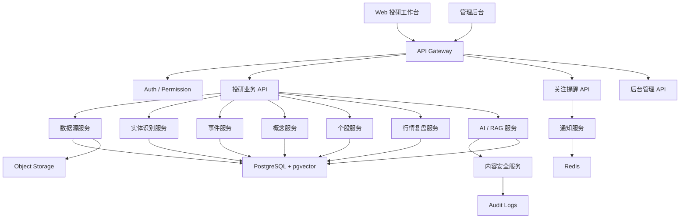
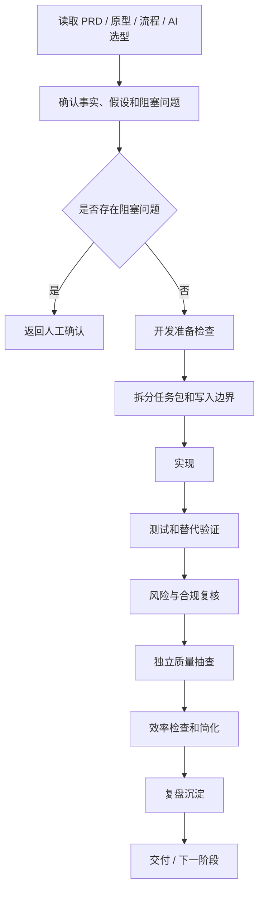

# 价小前投研开发文档（Review 版）

- 文档状态：Review Draft
- 适用阶段：MVP 开发启动前评审
- 分发等级：内部评审版（仅在明确要求内部版 / 自己用时使用）
- 配套 PRD：[01_prd.md](/Users/liujun/Desktop/产品经理skill/projects/jiaxiaoqian-ai-invest-research/01_prd.md)
- 外部执行包：`jiaxiaoqian-ai-invest-research-B-20260428.zip`
- 最后更新：2026-04-28

---

## 0. 文档边界

本文档用于把 PRD 转成可开发、可检查、可交付的执行方案。

用户侧产品只包含：

- 高频跟踪
- 事件详情
- 概念中心
- 行情复盘
- 个股详情
- AI 投研助手
- 关注提醒
- 来源引用
- 风险提示

开发过程中的任务拆分、检查、复核、学习沉淀和打包策略，只属于内部执行机制，不进入用户侧产品表达。

默认输出应使用 `B` 包；只有明确要求“内部版 / 自己用 / 自己项目 / 我的项目 / 可信团队”时，才发送或继续完善本文档。

---

## 1. 开发目标

MVP 要跑通一条完整投研链路：

```text
数据采集
-> 清洗去重
-> 实体识别
-> 事件 / 概念 / 个股关联
-> RAG 检索
-> AI 摘要与分析
-> 内容安全审核
-> 前台展示
-> 关注提醒
-> 埋点与复盘
```

目标：

- 数据可追溯：事件、概念、个股分析必须回到来源。
- AI 可控：AI 输出必须有引用、置信度、风险提示和降级方案。
- 页面可用：用户能完成“发现事件 -> 事件详情 -> 概念/股票 -> 个股研究 -> 关注提醒”。
- 合规优先：禁止交易指令、目标价、仓位建议、收益承诺和未授权内容分发。
- 可持续开发：每阶段都有交付物、实现效果、验收标准和复盘记录。

---

## 2. 输入文件

| 输入 | 文件 | 用途 |
|---|---|---|
| PRD | `01_prd.md` | 产品范围、用户流程、验收标准 |
| 技术设计 | `02_development_design.md` | 架构、阶段效果、技术路线 |
| MVP 排期 | `03_mvp_release_plan.md` | 阶段计划 |
| 埋点与验收 | `04_tracking_and_acceptance.md` | 指标、验收、监控 |
| 功能流程 | `05_function_flow.md` | 核心业务流程 |
| 原型图 | `06_prototype_wireframes.md` | 页面结构和状态 |
| AI 选型 | `07_ai_model_selection.md` | 模型路由、fallback、评测 |
| 待确认问题 | `08_requirement_clarification.md` | P0/P1/P2 问题 |
| 原型 | `prototype/index.html` | 页面参考 |
| 工作规则 | `agent.md` | 多层执行规则 |

---

## 3. 推荐技术栈

| 层级 | 推荐技术 | 说明 |
|---|---|---|
| 前端 | React + TypeScript + Vite / Next.js | 工作台、多页面、复杂交互 |
| UI | Tailwind CSS + shadcn/ui | 快速构建投研工作台 |
| 图表 | ECharts + Lightweight Charts | 热力图、折线、K 线、趋势图 |
| 后端 API | Python FastAPI | AI、数据处理、接口开发效率高 |
| ORM | SQLAlchemy / SQLModel | 数据模型与迁移清晰 |
| 数据库 | PostgreSQL | 用户、股票、概念、事件、任务、审计 |
| 向量检索 | pgvector 起步 | MVP 降低基础设施复杂度 |
| 缓存 / 队列 | Redis + RQ/Celery | 采集、AI 生成、通知任务 |
| 对象存储 | MinIO / S3 兼容 | 原文快照、报告导出 |
| 部署 | Docker Compose 起步 | 本地和内测环境快速启动 |

---

## 4. 总体架构



---

## 5. 开发过程嵌入方式

开发不是“看 PRD 后直接写代码”。每个阶段都按以下流程执行：



### 5.1 开发准备检查

每个任务开始前必须确认：

- 任务是否能追溯到 PRD、原型或流程图。
- P0 问题是否已确认。
- 是否存在可复用模板、脚本、规则或历史实现。
- 允许修改哪些文件。
- 禁止修改哪些文件。
- 是否涉及数据源、模型供应商、数据库、发布或高成本资源。
- 需要跑哪些测试或替代验证。

### 5.2 任务包格式

每个任务必须写：

- 任务目标。
- 输入文件。
- 允许修改文件。
- 禁止修改文件。
- 预期输出。
- 开发准备检查结果。
- 验证命令或手工检查。
- 人工确认点。
- 最小修复策略。
- 质量复核结论。
- 可沉淀的后续规则。

### 5.3 交付前检查

交付前必须确认：

- 是否改变了 PRD 范围。
- 页面是否与原型和流程一致。
- 空态、加载、错误、权限状态是否完整。
- 数据是否有来源、时间和状态。
- AI 输出是否有来源、置信度、风险提示和降级方案。
- 金融表达是否规避交易指令、目标价、仓位建议、收益承诺。
- 测试是否执行；未执行时是否说明原因和替代验证。
- 对外包是否只包含可分享内容。

---

## 6. 分期交付路线

开发交付先按“一期、二期、三期、最终”管理，每一期都要说明用户能看到什么、业务能验证什么、技术具备什么能力。Phase 0-9 只作为工程任务拆分，不作为对齐开发目标的主口径。

### 6.1 一期：MVP 主链路可用

目标：

- 跑通“事件发现 -> 事件详情 -> 概念/股票 -> 个股研究 -> 关注提醒”的最小闭环。
- 完成基础数据、事件引擎、核心页面、AI 摘要和内容安全。

包含工程任务：

- Phase 0：需求确认与工程启动。
- Phase 1：工程底座。
- Phase 2：数据源与基础实体。
- Phase 3：事件引擎。
- Phase 4：前台核心页面。
- Phase 5：个股详情首版。
- Phase 6：AI/RAG 与内容安全首版。

交付物：

- PRD 确认版。
- 功能流程图、原型图、AI 模型选型。
- Web 工作台首版。
- 数据源与基础实体。
- 事件列表、事件详情、概念中心、行情复盘、个股详情。
- AI 摘要、引用、置信度、风险提示。
- B 包。

阶段实现效果：

- 用户侧：白名单用户可以完成核心投研路径。
- 产品侧：可以验证事件追踪、概念跳转、个股详情承接是否成立。
- 技术侧：前后端、数据库、缓存、任务队列、AI/RAG、安全审核链路可运行。
- 数据侧：事件、股票、概念、来源之间建立基础关联。
- 风控侧：违规金融表达和无来源结论能被拦截或降级。

验收标准：

- P0 问题已确认或标记为阻塞。
- 核心页面可访问，核心跳转链路可走通。
- AI 输出包含来源、置信度、风险提示和生成状态。
- 数据有来源、授权状态、更新时间。
- 基础测试、接口检查和核心路径手测完成。

### 6.2 二期：效率、质量和留存增强

目标：

- 提升研究效率、AI 质量、关注提醒和运营观测能力。

包含工程任务：

- Phase 5 增强：个股详情补齐财务、公告、新闻、概念、股东、行情上下文。
- Phase 6 增强：AI 质量评测、Prompt 版本、模型降级、审核队列。
- Phase 7：关注提醒、埋点与看板。

交付物：

- 个股详情增强版。
- 关注列表和站内通知。
- AI 内容反馈。
- 产品增长看板、内容质量看板、安全看板。
- 数据质量监控。

阶段实现效果：

- 用户侧：用户能持续关注股票、概念、事件，并收到重要更新提醒。
- 产品侧：可以看到事件点击率、个股研究会话、关注转化、AI 有用率。
- 技术侧：AI 质量、任务耗时、失败率、审核积压可观测。
- 运营侧：能处理举报、审核、数据源失败和 AI 失败。

验收标准：

- 关注、取消关注、通知已读可用。
- 核心埋点可查询。
- AI 反馈可记录。
- 内容安全审核动作写入日志。
- 看板能显示增长、质量、安全核心指标。

### 6.3 三期：协作、后台和规模化

目标：

- 支持更稳定的运营后台、更完整的数据治理、更强的权限和团队协作能力。

包含工程任务：

- 后台数据源管理。
- 审核队列增强。
- 任务队列和失败重试。
- 权限与角色。
- 团队空间或 Pro 能力预留。
- 导出、报告、收藏增强。

交付物：

- 管理后台增强。
- 数据源配置和质量报表。
- 审核、拦截、退回、修正流程。
- 用户权限和角色。
- Pro / 团队版能力预留。

阶段实现效果：

- 用户侧：高频用户可以更稳定地做跟踪和复盘。
- 运营侧：后台能管理数据源、审核内容、查看任务失败和处理风险。
- 技术侧：权限、任务、审核、日志、重试、回滚机制更完整。
- 商业侧：具备 Pro 订阅、团队空间或机构试用的技术基础。

验收标准：

- 管理后台可配置数据源和查看任务状态。
- 审核队列支持通过、拦截、退回、修正。
- 权限控制覆盖用户、管理员、运营角色。
- 数据源失败、AI 失败、任务失败都有告警和重试策略。

### 6.4 最终：稳定发布与长期演进

目标：

- 形成可公开发布、可运营、可复盘、可持续演进的 AI 投研平台。

包含工程任务：

- Phase 8：内测发布。
- Phase 9：内测复盘与 V1 决策。
- 正式发布准备。
- 长期指标体系和版本演进。

交付物：

- 内测环境和正式环境。
- 用户协议、隐私政策、风险提示。
- 监控、告警、备份、回滚。
- 内测复盘报告。
- V1 范围建议。

阶段实现效果：

- 用户侧：白名单用户可稳定完成“事件追踪 -> 个股研究 -> 关注提醒”。
- 产品侧：用真实数据判断主路径、留存、AI 有用率和商业化信号。
- 技术侧：发布、监控、备份、回滚和异常处理可持续运行。
- 业务侧：明确 V1 做什么、不做什么。

验收标准：

- 核心 E2E 全部通过。
- 数据源断流、AI 超时、权限不足、内容违规等异常场景通过。
- 灰度和回滚方案可执行。
- 输出内测复盘报告和 V1 范围。

---

## 7. 工程任务拆分

以下 Phase 作为工程执行细分，归属于上面的“一期、二期、三期、最终”。

### Phase 0：需求确认与工程启动

目标：

- 锁定 MVP 主路径、产品边界、数据源策略、AI 输出边界和开发范围。

交付物：

- PRD 确认版。
- 功能流程图、原型图、AI 模型选型。
- 任务拆分。
- 开发文档和 B 包。

阶段实现效果：

- 产品侧：确认用户侧产品不展示内部开发机制。
- 研发侧：确认技术栈、仓库结构、服务边界和阶段计划。
- AI 侧：确认模型路由、RAG、内容安全和审核链路。
- 协作侧：确认内部开发包和对外 B 包的使用边界。

验收标准：

- P0 问题已确认或显式标注为阻塞。
- 任务能拆到前端、后端、数据、AI、测试、运维。
- 明确不做：真实交易、荐股、目标价、仓位建议、收益承诺、未授权研报全文。

### Phase 1：工程底座

目标：

- 跑通前端、后端、数据库、缓存、基础部署和健康检查。

交付物：

- `apps/web`
- `apps/api`
- `docker-compose.yml`
- PostgreSQL / Redis
- 基础布局和 `/health`

阶段实现效果：

- 用户效果：能打开 Web 壳页面，看到导航、主内容区、右侧关注入口和基础空态。
- 技术效果：开发环境可启动，统一响应、错误处理、日志和数据库迁移可用。
- 运维效果：本地或测试环境可以一键启动和健康检查。

验收标准：

- `/health` 返回正常。
- 前端首页可访问。
- 数据库迁移可执行。
- lint / test / build 基础命令可跑通。

### Phase 2：数据源与基础实体

目标：

- 建立股票、概念、数据源、原始文档和搜索能力。

阶段实现效果：

- 用户效果：能搜索股票、概念、事件关键词。
- 数据效果：资料有来源、发布时间、采集时间、授权状态和可信度。
- 风控效果：未授权、传闻、低可信来源在数据层被标记。

验收标准：

- 至少导入 100 只股票、50 个概念、300 条文档样例。
- 股票和概念支持名称 / 代码 / 关键词检索。
- 原始文档支持去重和来源追溯。
- 未授权来源不会进入正式展示内容。

### Phase 3：事件引擎

目标：

- 从原始文档生成结构化事件，并关联股票、概念和来源。

阶段实现效果：

- 用户效果：能在高频跟踪看到事件列表，进入事件详情，看到相关股票和概念。
- 产品效果：形成“资料 -> 事件 -> 影响对象”的核心投研链路。
- 技术效果：事件去重、实体链接、重要度、情绪、置信度可用。

验收标准：

- 发布事件至少有一个来源。
- 事件详情展示来源、重要度、情绪、置信度、相关股票、相关概念。
- 低置信度或传闻事件进入待审或显式标记。

### Phase 4：前台核心页面

目标：

- 完成高频跟踪、事件详情、概念中心、行情复盘主路径。

阶段实现效果：

- 用户效果：完成“发现事件 -> 进入事件详情 -> 跳转概念/股票”的路径。
- 产品效果：验证事件追踪主路径是否成立。
- 前端效果：列表、筛选、图表、详情、loading、empty、error、permission、stale 状态可用。

验收标准：

- 高频跟踪、概念中心、行情复盘可访问。
- 事件、概念、股票之间可跳转。
- 图表展示更新时间和数据口径。

### Phase 5：个股详情

目标：

- 建立单只股票的研究承接页。

阶段实现效果：

- 用户效果：用户可以搜索或点击股票后完成单只股票初筛。
- 产品效果：个股详情承接事件和概念流量，形成研究闭环。
- 数据效果：财务、公告、新闻、股东、概念、行情组织在同一股票上下文。

验收标准：

- 股票详情展示名称、代码、行业标签、价格、涨跌幅、估值、市值、主力动态。
- 深度分析、行情、概念、动态、财务、公司档案 Tab 可切换。
- 所有金融数据展示来源和更新时间。

### Phase 6：AI/RAG 与内容安全

目标：

- 让 AI 基于来源生成事件摘要、概念解释和个股分析，并通过安全规则控制风险。

阶段实现效果：

- 用户效果：看到有来源、有置信度、有风险提示的 AI 投研内容。
- AI 效果：输出区分 facts、inferences、risks、unknowns。
- 合规效果：买卖建议、收益承诺、目标价、仓位建议、无来源重大事实被拦截。
- 运营效果：管理员可以审核、拦截、退回和修正 AI 内容。

验收标准：

- AI 输出包含 `source_refs`、`confidence_score`、`model_name`、`prompt_version`、`safety_status`。
- 关键结论引用覆盖率 >= 98%。
- P0 风险表达拦截率 100%。
- 模型失败时页面可降级。

### Phase 7：关注提醒、埋点与看板

目标：

- 完成用户留存闭环和产品观测能力。

阶段实现效果：

- 用户效果：用户能关注股票、概念、事件，并收到重要更新提醒。
- 产品效果：能看到事件点击率、个股研究会话、关注转化、AI 有用率。
- 运营效果：能监控数据源失败、AI 失败、风险拦截和用户举报。

验收标准：

- 关注、取消关注、通知已读可用。
- P0/P1 关注事件生成站内通知。
- 核心埋点可查询。

### Phase 8：内测发布

目标：

- 让白名单用户稳定使用完整 MVP。

阶段实现效果：

- 用户效果：白名单用户可稳定完成“事件追踪 -> 个股研究 -> 关注提醒”。
- 产品效果：开始收集真实留存、使用频次、AI 有用率和用户反馈。
- 技术效果：监控、告警、日志、备份、回滚和冒烟测试完整。

验收标准：

- 核心 E2E 全部通过。
- 数据源断流、AI 超时、权限不足、内容违规等异常场景通过。
- 灰度和回滚方案明确。

### Phase 9：内测复盘与 V1 决策

目标：

- 基于内测数据决定 V1 范围。

阶段实现效果：

- 产品效果：判断事件追踪主路径、个股详情承接和关注提醒是否成立。
- 业务效果：判断是否具备 Pro 订阅、机构版或数据服务信号。
- 技术效果：识别性能瓶颈、AI 质量问题、数据质量问题和工程债。

验收标准：

- 输出内测复盘报告。
- 明确 V1 做什么、不做什么。
- 更新 PRD、开发文档、AI 选型和埋点方案。

---

## 8. 数据模型

### 8.1 核心表

| 表 | 说明 |
|---|---|
| `users` | 用户、角色、状态 |
| `sources` | 数据源、授权状态、可信度 |
| `raw_documents` | 原始资料 |
| `document_chunks` | RAG 分块 |
| `stocks` | 股票基础信息 |
| `concepts` | 概念 / 题材 |
| `events` | 结构化事件 |
| `event_entity_links` | 事件与股票/概念/行业关系 |
| `ai_tasks` | AI 生成任务 |
| `ai_insights` | AI 输出内容 |
| `safety_reviews` | 内容安全审核 |
| `watchlists` | 用户关注 |
| `notifications` | 站内提醒 |
| `audit_logs` | 操作审计 |

### 8.2 关键字段

- `source_type`
- `license_status`
- `credibility_level`
- `published_at`
- `collected_at`
- `content_hash`
- `source_refs`
- `confidence_score`
- `safety_status`
- `model_name`
- `prompt_version`

---

## 9. API 设计

接口前缀：`/api/v1`

| 模块 | 方法与路径 | 说明 |
|---|---|---|
| Auth | `POST /auth/login` | 登录 |
| Auth | `GET /auth/me` | 当前用户 |
| Events | `GET /events` | 事件列表 |
| Events | `GET /events/{id}` | 事件详情 |
| Events | `GET /events/calendar` | 事件日历 |
| Concepts | `GET /concepts` | 概念列表 |
| Concepts | `GET /concepts/{id}` | 概念详情 |
| Stocks | `GET /stocks/search` | 股票搜索 |
| Stocks | `GET /stocks/{symbol}` | 个股头部 |
| Stocks | `GET /stocks/{symbol}/deep-analysis` | 深度分析 |
| AI | `POST /ai/insights/generate` | 触发 AI 生成 |
| AI | `GET /ai/insights/{id}` | 获取 AI 内容 |
| Watch | `GET /watchlists` | 我的关注 |
| Watch | `POST /watchlists` | 新增关注 |
| Notify | `GET /notifications` | 通知列表 |
| Admin | `GET /admin/sources` | 数据源管理 |
| Admin | `GET /admin/reviews` | 内容审核 |
| Admin | `GET /admin/audit-logs` | 审计日志 |

---

## 10. AI 实现方案

AI 模型选型展开版见：[07_ai_model_selection.md](/Users/liujun/Desktop/产品经理skill/projects/jiaxiaoqian-ai-invest-research/07_ai_model_selection.md)

### 10.1 模型路由

```yaml
model_router:
  extract:
    use_for: [entity_extract, classification, tagging]
    model_level: fast_low_cost
  summary:
    use_for: [event_summary, concept_explain]
    model_level: mid_quality
  deep_analysis:
    use_for: [stock_deep_analysis, market_review]
    model_level: high_quality
  safety:
    use_for: [compliance_check, forbidden_expression_check]
    model_level: rules_plus_classifier
```

### 10.2 RAG 流程

```text
生成请求
-> 检索相关来源
-> 过滤未授权和低可信来源
-> 组装 Prompt
-> 模型生成结构化 JSON
-> 引用一致性检查
-> 内容安全检查
-> 通过后发布 / 命中风险进入审核
```

### 10.3 AI 输出结构

```json
{
  "facts": [],
  "inferences": [],
  "risks": [],
  "unknowns": [],
  "source_refs": [],
  "confidence_score": 0.0,
  "not_investment_advice": true
}
```

### 10.4 必须拦截

- 买入、卖出、满仓、梭哈。
- 目标价、仓位建议。
- 稳赚、保本、必涨。
- 无来源重大事实。
- 未授权研报全文。
- 把传闻包装成确定事实。

---

## 11. 前端页面

建议路由：

```text
/
/high-frequency
/events/:eventId
/concepts
/concepts/:conceptId
/market-review
/stocks/:symbol
/watchlist
/notifications
/admin
/admin/sources
/admin/reviews
/admin/jobs
```

页面状态必须包含：

- loading
- empty
- error
- stale
- permission
- safety blocked

图表必须展示：

- 数据来源
- 更新时间
- 延迟状态
- 口径说明

---

## 12. 测试策略

### 12.1 单元测试

- 事件去重。
- 实体识别合并。
- 事件评分。
- 权限判断。
- AI 输出 schema。
- 安全规则。
- 审计日志。

### 12.2 接口测试

- 事件列表筛选。
- 事件详情来源引用。
- 概念搜索。
- 个股详情各 Tab。
- 关注与取消关注。
- Admin 审核。

### 12.3 E2E

```text
登录
-> 高频跟踪
-> 筛选 A 级事件
-> 事件详情
-> 相关股票
-> 个股深度分析
-> 关注股票
-> 收到提醒
```

### 12.4 AI 质量测试

- 关键事实是否被来源支持。
- 是否区分 facts / inferences / risks / unknowns。
- 是否保留 source_refs。
- 是否避免买卖建议、目标价、收益承诺。
- 低可信传闻是否标记。

---

## 13. 部署与运维

### 13.1 环境

- `dev`：本地开发，模拟数据。
- `staging`：内测环境，接入授权测试数据。
- `prod`：正式环境，启用完整监控、备份、告警。

### 13.2 CI/CD

```text
lint
-> test
-> build
-> migration check
-> security check
-> deploy staging
-> smoke test
-> manual approval
-> deploy prod
```

### 13.3 监控

- API 错误率。
- API P95 延迟。
- 数据采集失败率。
- 数据入库延迟。
- AI 生成成功率。
- AI 平均耗时。
- 安全拦截数。
- 审核积压数。
- 通知发送失败率。

---

## 14. 分发与打包

### 14.1 内部评审包

用于自己或可信核心团队：

- 包含完整开发文档。
- 包含工作规则。
- 包含 B 包生成脚本和检查脚本。
- 不能直接发给外部开发者。

### 14.2 B 包

用于外部开发者、外包或合作方：

- 使用 `A.md`、`B.md`、`C.md` 等短文件名。
- 只包含产品需求、开发方案、流程、原型、AI 方案、验收要求。
- 不包含内部工作规则、可复用模板路径、自动化细节。
- 打包前必须通过最终内容检查。

---

## 15. 开发启动 Checklist

- [ ] PRD 范围确认。
- [ ] P0 问题确认。
- [ ] 数据源授权策略确认。
- [ ] AI 输出边界确认。
- [ ] 技术栈确认。
- [ ] 数据模型初版确认。
- [ ] API 初版确认。
- [ ] 阶段实现效果确认。
- [ ] 开发准备检查流程确认。
- [ ] 任务包格式确认。
- [ ] 测试策略确认。
- [ ] 风险与合规复核确认。
- [ ] B 包交付边界确认。
- [ ] 灰度和回滚方案确认。
