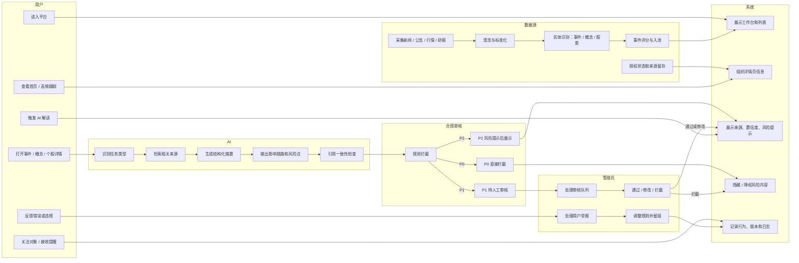
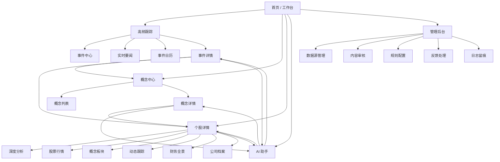
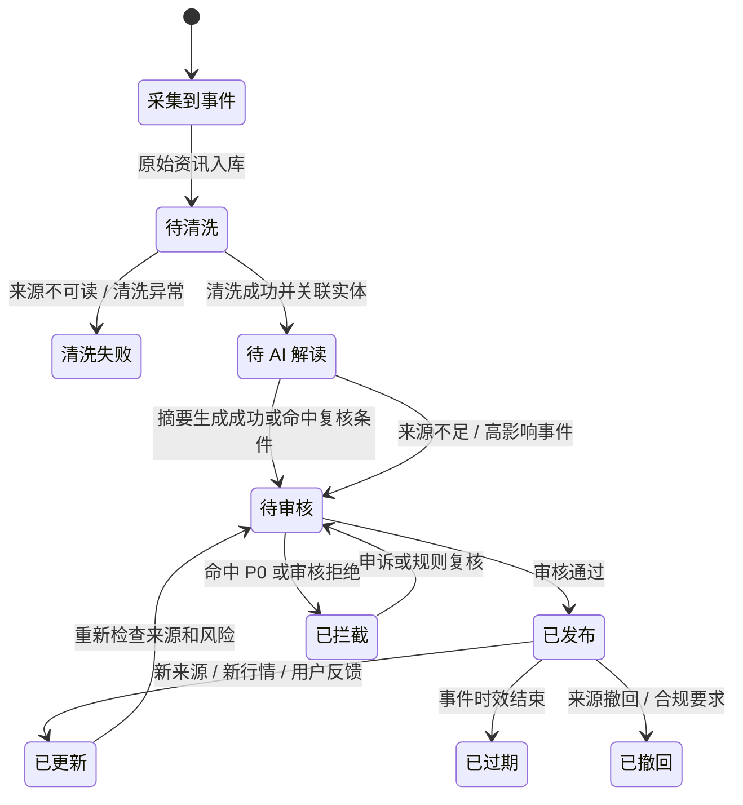
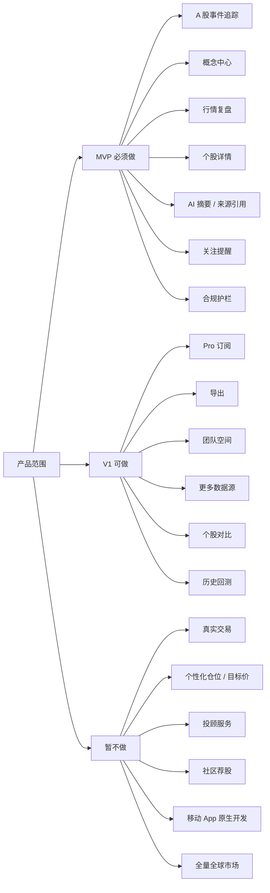
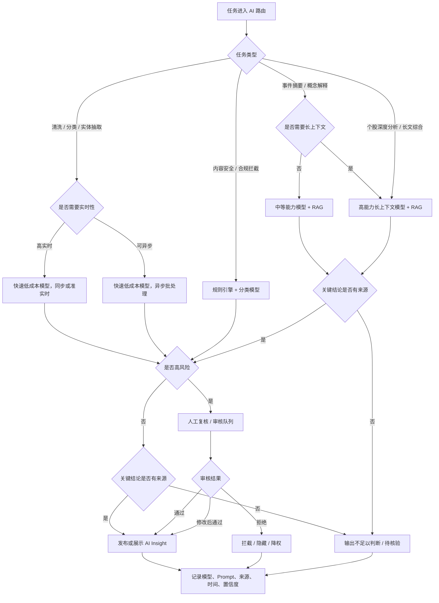
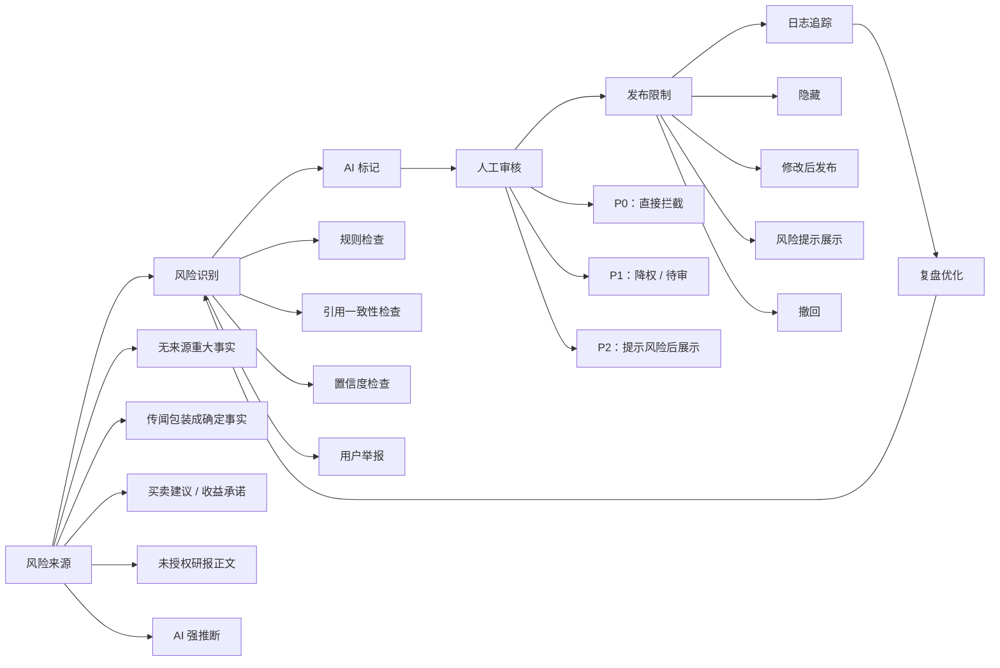

# 价小前投研 PRD 辅助理解图表包

- 文档状态：Ready for PRD merge
- 关联 PRD：[01_prd.md](/Users/liujun/Desktop/产品经理skill/projects/jiaxiaoqian-ai-invest-research/01_prd.md)
- 目标：把 PRD 中认知负担高、跨角色、跨流程、跨状态、跨权限、跨合规边界的内容图表化，方便 UI 设计、Codex 开发文档、研发拆解和测试验收。

---

## 0. 完成核对

| 序号 | 图表 | 对应 PRD 内容 | 状态 |
|---:|---|---|---|
| 1 | 产品总览思维导图 | 一句话摘要、目标用户、核心模块、指标、边界 | 已完成 |
| 2 | 用户场景 / JTBD 思维导图 | 目标用户、核心 JTBD、使用场景 | 已完成 |
| 3 | 核心业务泳道图 | 用户主流程、AI 生成与审核流程 | 已完成 |
| 4 | 页面信息架构图 / 页面跳转图 | 核心页面跳转、原型图、UI 设计输入 | 已完成 |
| 5 | 事件状态流转图 | 状态流转、事件入池、AI 摘要审核 | 已完成 |
| 6 | MVP 范围地图 / 分阶段路线图 | 范围定义、分阶段规划 | 已完成 |
| 7 | AI 模型路由决策树 | AI 模型选型、默认模型路由、审核要求 | 已完成 |
| 8 | 权限矩阵 | 账号与权限、Pro 权益、管理后台 | 已完成 |
| 9 | 风险控制闭环图 | 合规与风险控制、内容审核规则 | 已完成 |
| 10 | 用户故事地图 | 用户故事、验收标准、开发优先级 | 已完成 |

---

## 1. 产品总览思维导图

适合放在 PRD「一句话摘要」之后，用于让读者快速理解产品全貌。

```mermaid
flowchart TB
  P["价小前 AI 投研平台"]

  P --> U["目标用户"]
  U --> U1["高频主动投资者"]
  U --> U2["财经内容创作者"]
  U --> U3["机构 / 私募研究助理"]
  U --> U4["普通研究用户"]
  U --> U5["运营 / 合规管理员"]

  P --> S["核心场景"]
  S --> S1["盘中事件追踪"]
  S --> S2["盘后行情复盘"]
  S --> S3["概念题材研究"]
  S --> S4["个股深度研究"]
  S --> S5["关注与提醒"]

  P --> M["核心模块"]
  M --> M1["高频跟踪 / 事件中心"]
  M --> M2["行情复盘"]
  M --> M3["概念中心"]
  M --> M4["个股详情"]
  M --> M5["AI 投研助手"]
  M --> M6["管理后台"]

  P --> A["AI 能力"]
  A --> A1["事件摘要"]
  A --> A2["概念解释"]
  A --> A3["个股结构化分析"]
  A --> A4["风险识别"]
  A --> A5["来源引用 / 置信度"]

  P --> R["合规边界"]
  R --> R1["不荐股"]
  R --> R2["不承诺收益"]
  R --> R3["不接入交易"]
  R --> R4["无来源不输出事实结论"]
  R --> R5["高风险内容审核"]

  P --> K["成功指标"]
  K --> K1["次日留存"]
  K --> K2["研究会话数"]
  K --> K3["事件详情点击率"]
  K --> K4["AI 摘要成功率"]
  K --> K5["高风险内容拦截率"]
```

看图要点：

- 这张图解决“产品到底是什么、服务谁、边界在哪里”的问题。
- 适合作为 PRD 阅读入口，也适合作为 UI 设计前的产品全貌对齐图。

---

## 2. 用户场景 / JTBD 思维导图

适合放在 PRD「目标用户 / 角色 / JTBD」后，用于把不同用户的目标、触发点、关键动作和期望结果拆开。

```mermaid
flowchart TB
  JTBD["用户场景 / JTBD"]

  JTBD --> U1["高频事件用户"]
  U1 --> U1A["目标：快速判断事件影响"]
  U1 --> U1B["触发点：盘中异动、公告、新闻、题材爆发"]
  U1 --> U1C["关键动作：查看事件详情、来源、相关股票、相关概念"]
  U1 --> U1D["期望结果：决定是否继续深入研究"]
  U1 --> U1E["风险点：误把研究辅助当买卖建议"]

  JTBD --> U2["概念研究用户"]
  U2 --> U2A["目标：看懂题材逻辑和产业链"]
  U2 --> U2B["触发点：概念热度上升、政策或行业事件出现"]
  U2 --> U2C["关键动作：搜索概念、查看定义、历史时间轴、相关个股"]
  U2 --> U2D["期望结果：形成概念研究框架"]
  U2 --> U2E["风险点：概念定义无来源或股票关联过度推断"]

  JTBD --> U3["个股研究用户"]
  U3 --> U3A["目标：快速完成单只股票初筛"]
  U3 --> U3B["触发点：搜索股票、从事件或概念进入个股"]
  U3 --> U3C["关键动作：查看行情、财务、动态、公司档案、AI 深度分析"]
  U3 --> U3D["期望结果：获得结构化研究底稿"]
  U3 --> U3E["风险点：AI 竞争评分或投资逻辑被误读为专业评级"]

  JTBD --> U4["合规管理员"]
  U4 --> U4A["目标：控制 AI 内容和数据合规风险"]
  U4 --> U4B["触发点：AI 命中风险、用户举报、来源授权异常"]
  U4 --> U4C["关键动作：审核、拦截、修改规则、记录日志"]
  U4 --> U4D["期望结果：高风险内容不上线且可追溯"]
  U4 --> U4E["风险点：漏审、规则过松或日志缺失"]
```

看图要点：

- 这张图用于判断功能是不是围绕真实用户任务，而不是堆功能。
- 后续 UI 设计应优先服务高频事件、概念研究、个股研究和合规处理四类任务。

---

## 3. 核心业务泳道图

适合放在 PRD「方案概述」中，用于说明用户、系统、AI、数据源、合规审核、管理员之间的协作链路。

看图要点：

- 这张图用来说明“谁在什么时候做什么”，尤其是数据源、AI、合规审核、管理员的介入点。
- 异常点包括：来源不足、命中 P0/P1、人工拦截、用户举报、规则调整。

---

## 4. 页面信息架构图 / 页面跳转图

适合放在 PRD「核心页面跳转」和「原型图 / 线框图」之间，用于衔接 UI 设计和 Codex 开发文档。

看图要点：

- 这张图展示首页、高频跟踪、概念中心、个股详情、AI 助手、管理后台之间的关系。
- 后续做 UI 设计时，可以直接从这张图拆导航、页面层级和关键跳转。

---

## 5. 事件状态流转图

适合放在 PRD「状态流转」中，用于把事件、AI 摘要、审核和发布状态画成研发可执行的状态机。

看图要点：

- 这张图比文字状态表更适合研发实现状态机。
- 测试时要覆盖：低置信、命中 P0、人工通过、发布后更新、撤回、过期。

---

## 6. MVP 范围地图 / 分阶段路线图

适合放在 PRD「范围定义」中，用于把 MVP、V1、V1.1 和明确不做的内容压清楚。

看图要点：

- 这张图解决“这份 PRD 看起来偏大，边界不清”的问题。
- MVP 仍然偏重，研发排期时建议再按 P0/P1/P2 做一轮压缩。

---

## 7. AI 模型路由决策树

适合放在 PRD「AI 模型选型」中，用于把模型选择从结论变成可执行规则。

看图要点：

- 这张图避免“模型选型像结论”，让选型变成可执行的路由规则。
- 研发实现时可以把每个判断点变成 router 规则、审核规则或日志字段。

---

## 8. 权限矩阵

适合放在 PRD「账号与权限」和「管理后台与合规审核」中，用于比大段权限描述更清楚地做鉴权和测试。

| 角色 / 动作 | 查看公开内容 | 生成 AI 解读 | 编辑关注对象 | 审核内容 | 发布内容 | 撤回内容 | 配置规则 | 管理数据源 | 查看日志 |
|---|---|---|---|---|---|---|---|---|---|
| 未登录用户 | 允许，限公开列表 | 不允许 | 不允许 | 不允许 | 不允许 | 不允许 | 不允许 | 不允许 | 不允许 |
| Free 用户 | 允许 | 部分允许，限基础摘要 | 允许 | 不允许 | 不允许 | 不允许 | 不允许 | 不允许 | 不允许 |
| Pro 用户 | 允许 | 允许，含深度分析 | 允许 | 不允许 | 不允许 | 不允许 | 不允许 | 不允许 | 不允许 |
| 合规审核员 | 允许 | 允许 | 允许 | 允许 | 可提交发布建议 | 允许撤回风险内容 | 可提交规则修改 | 只读 | 允许 |
| Admin 管理员 | 允许 | 允许 | 允许 | 允许 | 允许 | 允许 | 允许，需二次确认 | 允许 | 允许 |

看图要点：

- 这张矩阵直接服务研发鉴权、测试用例和后台权限设计。
- 高风险动作包括审核、发布、撤回、规则配置和数据源管理，必须有日志留痕。

---

## 9. 风险控制闭环图

适合放在 PRD「合规与风险控制」前面，用于强化金融投研产品的安全边界。

看图要点：

- 这张图说明：风险不是只在发布前检查一次，而是识别、审核、发布限制、日志追踪、复盘优化的闭环。
- 对金融投研产品尤其关键，能避免读者忽略合规边界。

---

## 10. 用户故事地图

适合放在 PRD「用户故事与验收标准」前，用于把用户旅程、功能切片和开发优先级放到同一张图表里。

| 用户旅程 | 发现热点 | 理解事件 | 研究概念 | 研究个股 | AI 解读 | 关注提醒 | 合规处理 |
|---|---|---|---|---|---|---|---|
| 高频事件用户 | 打开首页 / 高频跟踪 | 查看事件详情、来源、影响方向 | 跳转相关概念 | 跳转相关股票 | 获取事件摘要、影响链路、风险点 | 关注事件 / 股票 / 概念 | 看到风险提示，不接收买卖建议 |
| 概念研究用户 | 从热点或搜索进入概念 | 查看概念相关事件 | 查看定义、产业链、历史时间轴 | 查看相关个股 | 获取概念解释和驱动因素 | 关注概念热度变化 | 避免把概念热度当确定机会 |
| 个股研究用户 | 搜索股票或从事件进入 | 查看个股相关事件 | 查看相关概念板块 | 查看行情、财务、动态、公司档案 | 获取结构化研究底稿 | 关注个股更新 | 区分事实、推断和风险 |
| 合规管理员 | 监控异常内容 | 查看命中规则和来源 | 维护概念定义风险 | 处理个股相关违规内容 | 审核 AI 输出 | 管理高风险提醒 | 拦截、撤回、留痕、复盘 |
| MVP 必须做 | 事件中心、实时要闻 | 事件详情、来源、相关实体 | 概念列表、概念详情 | 个股详情六大标签 | RAG 摘要、引用、置信度 | 站内关注提醒 | P0 拦截、P1 待审、日志 |
| V1 可做 | 更丰富榜单 | 历史影响对比 | 导出和更长时间轴 | 个股对比、历史回测 | 团队协作底稿 | 邮件 / 微信提醒 | 团队审核流 |
| Later 暂缓 | 全市场智能扫描 | 自动生成专题报告 | 自定义主题库 | 深度组合研究 | API 输出 | 微信/短信强提醒 | 复杂机构权限 |

看图要点：

- 这张图比单条用户故事更适合判断开发优先级。
- 底部 MVP / V1 / Later 可以直接转成研发排期、测试范围和交付验收范围。

---

## 11. 并入 PRD 的建议位置

| 图表 | 建议放置位置 |
|---|---|
| 产品总览思维导图 | `## 1. 一句话摘要` 后 |
| 用户场景 / JTBD 思维导图 | `## 6. 目标用户 / 角色 / JTBD` 后 |
| 核心业务泳道图 | `## 9. 方案概述` 内，放在用户主流程前 |
| 页面信息架构图 / 页面跳转图 | `### 9.4.3 核心页面跳转` 后，`### 9.5 原型图 / 线框图` 前 |
| 事件状态流转图 | `### 9.3 状态流转` 表格后 |
| MVP 范围地图 / 分阶段路线图 | `### 8.3 分阶段规划` 后 |
| AI 模型路由决策树 | `### 9.6 AI 模型选型` 内，放在默认模型路由前 |
| 权限矩阵 | `### 10.1 账号与权限` 内，放在验收标准前 |
| 风险控制闭环图 | `## 14. 合规与风险控制` 开头 |
| 用户故事地图 | `## 12. 用户故事与验收标准` 开头 |
