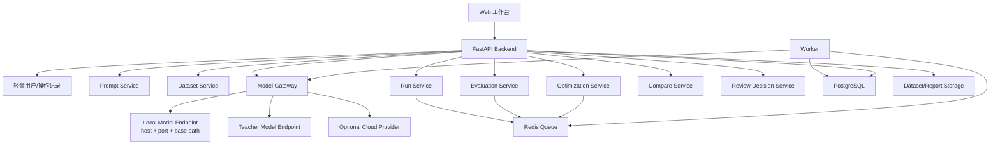
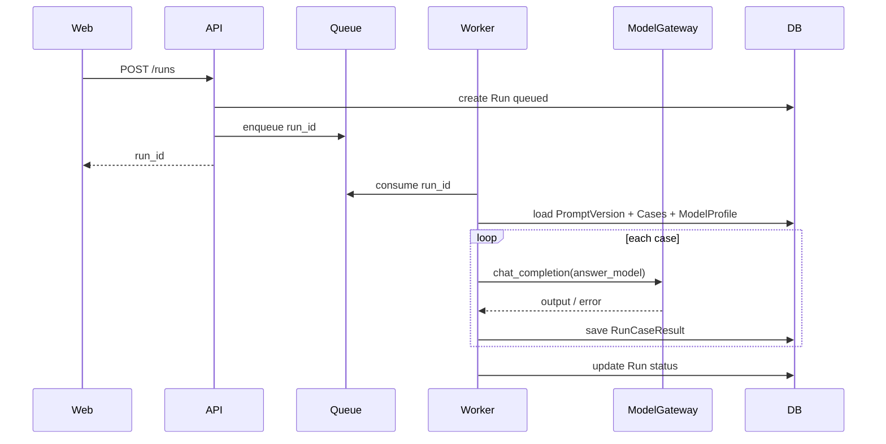
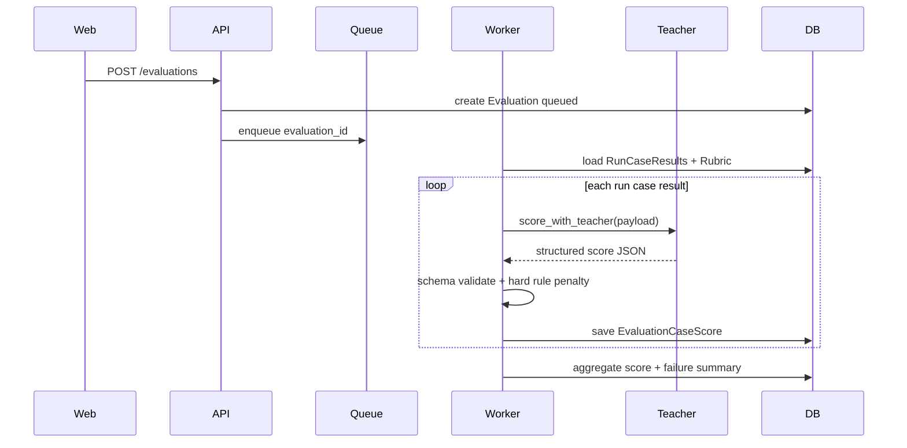

# 自动化 Prompt 优化平台一期开发文档

- 文档状态：Ready / 一期开发执行版
- 文档版本：v1.0
- 最后更新：2026-05-07
- 适用读者：产品、前端、后端、AI 工程、测试、部署运维
- 本期目标：打通 Prompt 管理、测试集管理、批量运行、教师模型评分、失败分析、候选优化、回归对比的最小可用闭环

---

## 0. 本次对齐结论

本期开发按“一期目标”收敛为内部可用的 Prompt 优化工作台，不做完整平台化。核心闭环如下：

```text
Prompt
-> PromptVersion
-> Run（绑定 Dataset + 被测模型）
-> Evaluation（教师模型评分）
-> OptimizationJob
-> CandidateVersion
-> Regression Run
-> Compare
-> 人工评审门禁
-> 保存为正式 PromptVersion
```

本次新增对齐点：

- 本地模型必须可接入。一期默认按 OpenAI-compatible HTTP 接口接入，优先兼容 vLLM / LM Studio / Ollama OpenAI-compatible 模式；host、port、base path 必须可配置，不能写死。
- 模型回答评分使用云端教师模型。Evaluations 的主评分链路以独立 teacher model profile 为准，规则校验只作为硬性格式校验、补充扣分或失败标记。
- 测试集一期强交付 JSON 导入。CSV、Ollama 原生 API、llama.cpp 原生接口和 custom_http driver 只作为后续扩展，不作为一期默认主链路。
- 候选 Prompt 必须经过人工评审才能保存为正式 PromptVersion。Compare 可以给发布建议，但不能自动替用户决策。
- 一期以可验证闭环为目标。多 Provider 重型管理、完整 Knowledge、权限协作、Skill 正式发布、复杂运维监控不进入一期。

---

## 1. 输入材料

### 1.1 已读取输入

- `一期目标 (1).pdf`
- `自动化Prompt优化平台 (3).pdf`
- `projects/prompt-optimization-workbench/prototype/prompt-optimization-workbench-html-prototype.zip`
- `projects/prompt-optimization-workbench/prototype/html/prototype_notes.md`
- `projects/prompt-optimization-workbench/prototype/html/prototype_manifest.json`

### 1.2 已确认事实

- 一期目标是搭建自动化 Prompt 优化的最小可用闭环。
- 一期必须覆盖 Prompt 管理、测试集管理、运行中心、评测中心、优化中心。
- Compare 一期只保留基础版本对比能力。
- Knowledge 一期只保留基础优化记录与经验沉淀入口。
- 权限与协作暂不纳入一期范围。
- 多 Provider 模型管理暂不做重型设计，一期优先支持内部主用模型。
- 本地模型一期默认按 OpenAI-compatible HTTP 接入，host、port、base path 可配置。
- 教师模型一期使用云端模型，并通过独立 teacher model profile 配置。
- answer model 和 teacher model 在数据结构、页面、Run/Evaluation 记录中明确区分。
- 测试集一期默认只强交付 JSON 导入，CSV 暂不作为一期强交付。
- 人工评审是候选 Prompt 发布前门禁；评审意见必填并入库。
- 人工评审建议需要沉淀到 Knowledge Lite / 优化记录。
- HTML 原型已覆盖 Dashboard、Prompts、Prompt Create、Datasets、Dataset Detail、Dataset Edit、Models、Runs、Review、Evaluations、Optimize、Compare、Knowledge、Settings。

### 1.3 当前开发假设

| 假设 | 影响范围 | 验证方式 | 失效时处理 |
|---|---|---|---|
| 一期 Web 端先做内部后台，不做移动端 | 前端路由、布局、权限 | 产品确认端侧范围 | 若要移动端，另拆响应式或移动端任务 |
| 后端采用 FastAPI + PostgreSQL + Redis + Worker | API、异步任务、部署 | 技术团队确认栈 | 若团队偏 Node/NestJS，保留接口和表结构，替换实现栈 |

### 1.4 已确认决策

| 决策项 | 一期方案 | 开发影响 |
|---|---|---|
| 本地模型接入 | 默认 OpenAI-compatible HTTP 接口，优先兼容 vLLM / LM Studio / Ollama OpenAI-compatible 模式 | Provider/Profile、连接测试、模型调用统一走 OpenAI-compatible driver；host、port、base path 可配置 |
| 后续模型 driver | Ollama 原生 API、llama.cpp 原生接口、其他 custom_http driver 后续扩展 | 一期不作为默认主链路，只保留可扩展枚举和 adapter 边界 |
| 教师模型 | 一期使用云端模型 | 必须支持独立 teacher model profile；Evaluation 创建时选择 teacher model |
| 模型职责 | answer model 只生成回答；teacher model 负责评分、归因、输出优化建议 | Run 记录 answer model；Evaluation 记录 teacher model；前端明确区分两类模型 |
| 测试集导入 | 一期默认只强交付 JSON 导入 | `/datasets/import-json` 首期按 JSON schema 校验；CSV 只作为后续扩展 |
| 人工评审门禁 | 一期必须有人工评审，但不做复杂审批流 | CandidateVersion 发布前必须存在 approved 的人工评审记录，且评审意见不能为空 |
| Compare 决策 | Compare 只给发布建议，不能自动替用户决策 | Compare 页面需要人工决策区和发布按钮状态控制 |
| Knowledge Lite | 一期不做完整知识库，但必须记录人工评审建议 | 人工评审后沉淀 Prompt、CandidateVersion、Evaluation/Compare、失败模式、建议、是否采用等记录 |

---

## 2. 一期开发范围

### 2.0 产品 / 开发边界

本开发文档只定义自动化 Prompt 优化平台的一期产品实现方案，不修改仓库级 Skill、harness、workflow、registry、governance 或长期偏好规则。

一期开发允许新增或修改的工程范围建议：

- Web 前端应用目录。
- API 服务目录。
- Worker 服务目录。
- 数据库 migration。
- Docker Compose / 环境变量示例。
- 本项目文档、测试 fixtures、验收脚本。

一期开发禁止默认触碰：

- 仓库根治理文件。
- `pm-prd-copilot/` 稳定模板、脚本、规则。
- `harness/`、`governance/`、`.github/workflows/`。
- 与本项目无关的历史项目目录。
- 真实 API Key、真实业务敏感数据、生产数据库。

一期轻量用户身份方案：

- 一期不做复杂权限、RBAC、多角色审批或 SSO。
- API 通过内部会话或 `X-User-Id` header 获取当前用户标识，开发环境默认 `dev_user`。
- `created_by`、`reviewer`、操作记录中的用户字段统一写入该用户标识。
- 该身份只用于归属和追溯，不用于细粒度权限控制。
- 后续如接企业登录，只替换身份来源，不改变一期业务表字段。

### 2.1 In Scope

| 模块 | 一期目标 | 必须交付 |
|---|---|---|
| Prompt 管理 | 统一创建、编辑、版本保存、历史查看 | Prompt 列表、创建、编辑、版本详情、版本发布状态 |
| Datasets | 通过 JSON 导入测试集并管理 Case | Dataset 列表、JSON 导入、Case 列表、评分规则、重点样本标记 |
| Models | 接入一个主模型和一个教师模型 | Provider/Profile 管理、本地端口配置、API Key 加密、连接测试 |
| Runs | 选择 PromptVersion、Dataset、被测模型后批量运行 | Run Builder、队列、状态、失败重试、Case 输出日志 |
| Evaluations | 使用教师模型给模型回答评分 | 评分任务、总分、分项分、失败原因、风险 Case、Case 详情 |
| Optimize | 基于失败 Case 生成候选 Prompt | 优化任务、候选版本、优化原因、回归测试入口 |
| Compare / Review | 对比新旧版本效果并完成人工发布门禁 | 总分、通过率、改好/改坏 Case、人工评审意见、发布决策 |
| Knowledge Lite | 记录轻量优化经验 | 人工评审建议、失败模式、是否采用、拒绝原因或修改建议 |
| Settings | 统一默认参数 | 默认运行参数、默认教师模型、日志保留、超时重试 |

### 2.2 Out of Scope

- 不做复杂权限体系、多角色审批流、细粒度角色权限；人工评审只作为发布前门禁和意见留痕。
- 不做完整 Knowledge 知识库，只保留优化记录和失败案例归档入口。
- 不做多 Provider 重型接入管理，只做可扩展的数据结构和一个可用接入链路。
- 不做 Prompt 到 Skill 的正式封装与发布，只保留候选标记字段。
- 不做高级监控大盘、完整审计系统、成本精细化分析。
- 不做面向外部用户的商业化、计费、租户隔离。

### 2.3 一期量化验收

- 至少支持 1 个被测模型接入并完成 Run。
- 至少支持 1 个教师模型接入并完成评分。
- 本地模型支持通过 host、port、base path 配置连接。
- JSON Dataset 导入可用，字段校验、错误提示、重复 Case 处理规则可验证。
- Prompt 支持创建、编辑、保存版本、历史查看。
- Dataset 支持导入、Case 管理、重点样本标记。
- 至少 1 条批量运行链路可正常执行并返回结果。
- 运行失败后支持基础重试。
- 至少 1 套教师模型评分流程可执行，并返回总分、分项得分、原因和建议。
- 至少可发起 1 次优化任务，生成 1 版候选 Prompt。
- 候选 Prompt 可做回归测试。
- 可完成新旧 Prompt 版本基础对比，并支持人工评审是否采用新版。
- 候选 Prompt 发布前必须存在 approved 人工评审记录，且 `review_comment` 不能为空。

---

## 3. 推荐技术架构

### 3.1 技术栈建议

| 层级 | 建议技术 | 说明 |
|---|---|---|
| Web 前端 | React + TypeScript | 内部效率后台，适合表格、表单、状态面板 |
| UI | shadcn/ui 或团队已有组件库 | 保持后台工具风格 |
| 后端 API | FastAPI | AI 调用和异步任务实现成本低 |
| Worker | Celery / RQ / Dramatiq 任选其一 | 批量 Run、评分、优化、回归测试 |
| 数据库 | PostgreSQL | Prompt 版本、Run、Evaluation、Case 明细 |
| 队列 / 缓存 | Redis | 异步任务队列、状态缓存、限流 |
| 文件存储 | 本地卷起步，后续 S3 / MinIO | Dataset 原始文件、导出报告 |
| 模型网关 | 自研轻量 Model Gateway | 统一本地模型、云端模型、教师模型调用 |
| 部署 | Docker Compose 起步 | 一期降低部署复杂度 |

### 3.2 服务拆分

MVP 可以采用单体 API + 独立 Worker，但代码边界按服务模块组织：

| 服务模块 | 职责 |
|---|---|
| `prompt` | Prompt、PromptVersion、Diff、发布状态 |
| `dataset` | Dataset、Case、导入、评分规则 |
| `model_gateway` | Provider、Profile、本地端口、连接测试、模型调用 |
| `run` | Run 创建、队列、Case 执行、失败重试、日志 |
| `evaluation` | 教师模型评分、规则校验、总分聚合、失败分析 |
| `optimization` | 优化任务、候选 Prompt 生成、回归测试入口 |
| `compare` | 版本对比、改好/改坏 Case、发布建议 |
| `review` | 人工评审意见、发布门禁、决策追溯 |
| `knowledge_lite` | 优化记录、失败模式、人工评审建议沉淀 |
| `settings` | 默认参数、默认模型、日志策略 |

### 3.3 总体架构图



---

## 4. 模型接入设计

### 4.1 模型角色

| 角色 | 用途 | 一期要求 |
|---|---|---|
| 被测模型 answer model | 执行 Prompt，对每个 Case 生成回答 | 至少 1 个可用；可使用本地 OpenAI-compatible 模型 |
| 教师模型 teacher model | 对被测模型回答进行评分、归因、给优化建议 | 一期使用云端模型，必须独立配置 teacher model profile |
| 优化模型 optimizer model | 基于失败分析生成候选 Prompt | 一期可复用云端 teacher model，也可单独配置 |

answer model 和 teacher model 必须在数据结构、页面、Run/Evaluation 记录中明确区分。被测模型只负责生成回答；教师模型只负责评分、归因和输出优化建议。

### 4.2 本地模型端口配置

Models 页面需要支持以下字段：

| 字段 | 类型 | 必填 | 说明 |
|---|---:|---:|---|
| `provider_type` | enum | 是 | 一期默认 `local_openai_compatible` / `cloud_openai_compatible`；`ollama_native` / `custom_http` 仅预留扩展 |
| `display_name` | string | 是 | 展示名，例如 `本地 vLLM` |
| `protocol` | enum | 是 | `http` / `https` |
| `host` | string | 是 | 默认 `127.0.0.1`，也可填内网 IP |
| `port` | int | 是 | 本地模型端口，必须可编辑 |
| `base_path` | string | 否 | OpenAI-compatible 默认 `/v1` |
| `base_url` | computed/string | 是 | 由 protocol、host、port、base_path 生成，也允许高级模式手填 |
| `api_key_ref` | string/null | 否 | 本地模型可为空，云端模型必须配置 |
| `healthcheck_path` | string | 否 | 默认 `/models` 或自定义 |
| `model_list_path` | string | 否 | 默认 `/models` |
| `timeout_ms` | int | 是 | 默认 60000 |
| `enabled_roles` | enum[] | 是 | `answer` / `teacher` / `optimizer` |

推荐默认连接模板：

| 本地服务 | 默认端口参考 | 建议 base path | 说明 |
|---|---:|---|---|
| OpenAI-compatible local gateway | 8000 | `/v1` | 内部统一网关或 vLLM 常见部署 |
| LM Studio | 1234 | `/v1` | 常见本地开发环境 |
| Ollama OpenAI-compatible 模式 | 11434 | `/v1` | 一期只兼容 OpenAI-compatible 模式 |

端口不能作为代码常量写死。部署层可给默认值，但前端和 API 必须支持保存、测试和修改。

Ollama 原生 API、llama.cpp 原生接口和其他 custom_http driver 不进入一期默认主链路。可以保留 adapter 接口边界，但不得影响一期 OpenAI-compatible 主链路交付。

### 4.3 模型调用统一接口

所有业务模块只调用 Model Gateway，不直接调用具体 Provider。

```text
Business Service
-> Model Gateway
-> Provider Driver
-> Local / Cloud Model Endpoint
```

Gateway 对外统一能力：

- `list_models(provider_id)`
- `test_connection(provider_id)`
- `chat_completion(model_profile_id, messages, params)`
- `score_with_teacher(model_profile_id, scoring_payload)`
- `generate_candidate_prompt(model_profile_id, optimization_payload)`

Gateway 必须记录：

- `provider_id`
- `model_profile_id`
- `base_url_masked`
- `latency_ms`
- `status`
- `error_code`
- `retry_count`
- `request_id`

不得记录：

- 明文 API Key
- 完整敏感输入
- 用户配置的密钥原文

---

## 5. 教师模型评分设计

### 5.1 评分链路

```text
RunCaseResult
-> 读取 Case 输入、参考答案、评分规则、被测模型回答
-> 规则预检查（格式、必填项、拒答、空输出）
-> Teacher Model Scoring
-> 结构化评分 JSON 校验
-> 聚合 Evaluation
-> 失败原因归类
-> 输出优化建议
```

教师模型是主评分来源。规则预检查只用于发现硬失败，不能替代教师模型评分。

### 5.2 教师模型输入

每个 Case 评分时，发送给教师模型的最小信息：

| 字段 | 说明 |
|---|---|
| `case_id` | Case 标识 |
| `task_type` | 任务类型 |
| `case_input` | 测试输入 |
| `reference_answer` | 参考答案，可为空 |
| `rubric` | 评分规则、维度、权重 |
| `answer_model_output` | 被测模型回答 |
| `expected_output_format` | 期望输出格式 |
| `risk_rules` | 风险、禁区、硬性扣分项 |
| `language` | 评分语言，默认中文 |

可选信息：

- PromptVersion 内容：仅当评分需要判断是否遵守 Prompt 指令时传入。
- 历史最佳回答：用于相对评分，一期可不做。
- 业务上下文：只传必要摘要，避免泄露敏感信息。

### 5.3 教师模型输出 JSON Schema

教师模型必须返回可解析 JSON。解析失败时进入重试；重试仍失败则标记 `needs_manual_review`。

```json
{
  "case_id": "case_001",
  "pass": true,
  "total_score": 86,
  "max_score": 100,
  "dimension_scores": [
    {
      "name": "accuracy",
      "score": 42,
      "max_score": 50,
      "reason": "回答覆盖主要事实，但缺少边界说明"
    }
  ],
  "failure_type": "missing_constraint",
  "risk_level": "low",
  "judge_reason": "整体满足任务，但输出格式不够稳定",
  "improvement_suggestion": "在 Prompt 中补充输出字段顺序和边界条件",
  "confidence": 0.82,
  "needs_manual_review": false
}
```

### 5.4 评分聚合

Evaluation 总分计算建议：

```text
case_score = teacher_total_score - hard_rule_penalty
evaluation_score = weighted_average(case_score, case_weight)
pass_rate = passed_case_count / total_case_count
risk_case_count = count(risk_level in ["medium", "high"])
```

硬规则包括：

- 空输出。
- 非法 JSON / 格式错误。
- 命中明确禁止项。
- 超时或模型调用失败。
- 输出与任务无关。

### 5.5 教师评分质量控制

- 每个 scoring_config 需要版本号。
- Teacher prompt、rubric、teacher_model_profile_id 必须写入 Evaluation 元数据。
- 同一 Evaluation 内使用固定 teacher model 和固定 rubric 版本。
- 教师模型输出必须做 JSON schema 校验。
- 对低置信度、解析失败、高风险 Case 标记人工复核。
- Compare 页面展示评分配置是否一致；评分配置不一致时不能发布，只能记录评审意见。

### 5.6 Teacher Scoring Prompt Template

教师模型评分 prompt 一期固定为模板 + rubric_config + Case payload 的组合。模板版本必须写入 Evaluation metadata。

```text
你是 Prompt 评测教师模型。请基于评分规则，对被测模型回答进行客观评分。

要求：
1. 只能依据输入、参考答案、评分规则、期望格式和被测模型回答评分。
2. 不要补充业务事实，不要因为表达风格不同而过度扣分。
3. 如回答命中 hard_fail_rules，必须标记 pass=false，并说明原因。
4. 输出必须是合法 JSON，不要输出 Markdown，不要输出额外解释。

评分配置：
{{rubric_config}}

Case 输入：
{{case_input}}

参考答案：
{{reference_answer}}

期望输出格式：
{{expected_output_format}}

被测模型回答：
{{answer_model_output}}

请输出 JSON：
{
  "case_id": "string",
  "pass": true,
  "total_score": 0,
  "max_score": 100,
  "dimension_scores": [
    {
      "name": "string",
      "score": 0,
      "max_score": 0,
      "reason": "string"
    }
  ],
  "failure_type": "none",
  "risk_level": "low",
  "judge_reason": "string",
  "improvement_suggestion": "string",
  "confidence": 0.0,
  "needs_manual_review": false
}
```

### 5.7 rubric_config 示例与评分阈值

```json
{
  "id": "customer_support_v1",
  "version": 1,
  "max_score": 100,
  "pass_threshold": 80,
  "confidence_threshold": 0.75,
  "high_risk_review_required": true,
  "dimensions": [
    {
      "name": "accuracy",
      "max_score": 45,
      "description": "回答是否准确，是否与参考答案和业务规则一致"
    },
    {
      "name": "completeness",
      "max_score": 35,
      "description": "是否覆盖必须信息、下一步动作和边界条件"
    },
    {
      "name": "format",
      "max_score": 10,
      "description": "是否符合 expected_output_format"
    },
    {
      "name": "tone",
      "max_score": 10,
      "description": "语气是否清晰、礼貌、无推诿"
    }
  ],
  "hard_fail_rules": [
    "输出为空",
    "输出与任务无关",
    "承诺无法保证的结果",
    "泄露或索取敏感凭证"
  ]
}
```

评分口径：

- `pass = total_score >= pass_threshold`，但命中 hard fail 时必须为 false。
- `confidence < confidence_threshold` 时标记 `needs_manual_review = true`。
- `risk_level = high` 的 Case 即使通过，也进入人工复核列表。
- 教师模型 JSON 解析失败时，最多重试 `EVALUATION_TEACHER_RETRY` 次；仍失败则该 Case 标记 `needs_manual_review`，Evaluation 状态为 `needs_manual_review` 或 `failed`。
- Compare 中 baseline 和 candidate 的 `teacher_model_profile_id`、`scoring_config_id`、Dataset 不一致时，不能给发布建议。
- Promote 时若 Compare 的评分配置不一致，接口必须拒绝发布，返回 `409 scoring_config_mismatch`。

`failure_type` 枚举：

| 值 | 说明 |
|---|---|
| `none` | 未发现明确失败 |
| `empty_output` | 空输出 |
| `format_error` | 格式错误或 JSON 不合法 |
| `missing_required_info` | 缺少必须信息 |
| `incorrect_answer` | 事实或结论错误 |
| `missing_constraint` | 未遵守约束或边界 |
| `unsafe_content` | 命中风险或安全禁区 |
| `off_topic` | 输出与任务无关 |
| `over_refusal` | 过度拒答 |
| `hallucination` | 编造信息 |
| `timeout_or_model_error` | 模型超时或调用失败 |
| `low_confidence` | 教师模型低置信度 |

---

## 6. 核心数据模型

### 6.1 Prompt

| 字段 | 类型 | 说明 |
|---|---|---|
| `id` | uuid | Prompt ID |
| `name` | string | 名称 |
| `description` | text | 描述 |
| `task_type` | string | 任务类型 |
| `tags` | text[] | 标签 |
| `status` | enum | `draft` / `active` / `archived` |
| `current_version_id` | uuid/null | 当前正式版本 |
| `created_by` | uuid/string | 创建人 |
| `created_at` / `updated_at` | timestamptz | 时间戳 |

### 6.2 PromptVersion

| 字段 | 类型 | 说明 |
|---|---|---|
| `id` | uuid | 版本 ID |
| `prompt_id` | uuid | 所属 Prompt |
| `version_no` | int | 版本号 |
| `content` | jsonb/text | 完整 Prompt 内容 |
| `modules` | jsonb | role、rules、workflow、output_format 等模块 |
| `change_note` | text | 修改说明 |
| `source_type` | enum | `manual` / `candidate` / `imported` |
| `source_candidate_id` | uuid/null | 来自候选版本时记录 |
| `source_review_decision_id` | uuid/null | 来自候选版本发布时记录对应人工评审 |
| `source_compare_id` | uuid/null | 来自候选版本发布时记录对比结果 |
| `status` | enum | `draft` / `candidate` / `published` / `archived` |
| `created_by` | uuid/string | 创建人 |
| `created_at` | timestamptz | 创建时间 |

### 6.3 Dataset

| 字段 | 类型 | 说明 |
|---|---|---|
| `id` | uuid | Dataset ID |
| `name` | string | 名称 |
| `description` | text | 描述 |
| `task_type` | string | 任务类型 |
| `tags` | text[] | 标签 |
| `case_count` | int | Case 数量 |
| `scoring_config_id` | uuid/null | 默认评分配置 |
| `status` | enum | `draft` / `ready` / `archived` |
| `created_at` / `updated_at` | timestamptz | 时间戳 |

### 6.4 Case

| 字段 | 类型 | 说明 |
|---|---|---|
| `id` | uuid | Case ID |
| `dataset_id` | uuid | 所属 Dataset |
| `input` | jsonb/text | 测试输入 |
| `reference_answer` | jsonb/text/null | 参考答案 |
| `rubric` | jsonb | Case 级评分规则 |
| `expected_output_format` | jsonb/text/null | 期望输出格式 |
| `weight` | numeric | 权重，默认 1 |
| `risk_level` | enum | `low` / `medium` / `high` |
| `is_key_case` | boolean | 重点样本 |
| `tags` | text[] | 标签 |
| `status` | enum | `active` / `disabled` |

### 6.4.1 JSON Dataset 导入契约

一期默认只强交付 JSON 导入。CSV 暂不作为一期强交付，只保留后续扩展可能。

完整 JSON 示例：

```json
{
  "dataset_name": "客服问答 Prompt 回归测试集",
  "task_type": "customer_support_qa",
  "description": "覆盖退款、物流、账号、风险提示等高频客服问题",
  "tags": ["客服", "回归测试", "一期验收"],
  "cases": [
    {
      "case_id": "refund_policy_001",
      "input": {
        "user_question": "我买错了，已经拆封，还能退款吗？",
        "context": {
          "product_type": "电子配件",
          "order_status": "delivered"
        }
      },
      "reference_answer": {
        "summary": "说明拆封后退款限制，引导查看售后政策并提供人工客服入口",
        "must_include": ["拆封可能影响退款", "售后政策", "人工客服"]
      },
      "rubric": {
        "max_score": 100,
        "dimensions": [
          {
            "name": "accuracy",
            "max_score": 45,
            "description": "回答是否准确解释退款条件"
          },
          {
            "name": "completeness",
            "max_score": 35,
            "description": "是否覆盖政策、下一步动作和客服入口"
          },
          {
            "name": "tone",
            "max_score": 20,
            "description": "语气是否礼貌、清晰、无推诿"
          }
        ],
        "hard_fail_rules": [
          "承诺一定可以退款",
          "要求用户提供银行卡密码",
          "输出与售后无关内容"
        ]
      },
      "expected_output_format": {
        "type": "text",
        "must_include_sections": ["结论", "原因", "下一步"]
      },
      "weight": 1.5,
      "risk_level": "medium",
      "is_key_case": true,
      "tags": ["退款", "售后", "重点样本"]
    },
    {
      "case_id": "shipping_delay_001",
      "input": {
        "user_question": "物流三天没更新怎么办？",
        "context": {
          "carrier": "示例快递",
          "last_update_days": 3
        }
      },
      "reference_answer": {
        "summary": "解释可能原因，建议查询物流并提供客服处理路径"
      },
      "rubric": {
        "max_score": 100,
        "dimensions": [
          {
            "name": "accuracy",
            "max_score": 50,
            "description": "是否准确解释物流延迟可能原因"
          },
          {
            "name": "actionability",
            "max_score": 50,
            "description": "是否给出可执行下一步"
          }
        ]
      },
      "expected_output_format": {
        "type": "text"
      },
      "weight": 1,
      "risk_level": "low",
      "is_key_case": false,
      "tags": ["物流"]
    }
  ]
}
```

字段校验规则：

| 字段 | 校验规则 | 错误提示 |
|---|---|---|
| `dataset_name` | 必填，字符串，长度 1-120 | `dataset_name 不能为空` |
| `task_type` | 必填，字符串，长度 1-80 | `task_type 不能为空` |
| `cases` | 必填，数组，长度至少 1 | `cases 至少包含 1 条 Case` |
| `cases[].case_id` | 可选；提供时同一 Dataset 内必须唯一 | `case_id 重复：{case_id}` |
| `cases[].input` | 必填，object 或 string | `cases[{index}].input 不能为空` |
| `cases[].reference_answer` | 可选，object 或 string | 类型错误时提示字段路径 |
| `cases[].rubric` | 必填，object，至少包含 `max_score` 或 `dimensions` | `cases[{index}].rubric 缺少评分规则` |
| `cases[].expected_output_format` | 可选，object 或 string | 类型错误时提示字段路径 |
| `cases[].weight` | 可选，数字，必须大于 0，默认 1 | `weight 必须大于 0` |
| `cases[].risk_level` | 必填，`low` / `medium` / `high` | `risk_level 只能是 low、medium、high` |
| `cases[].is_key_case` | 可选，boolean，默认 false | `is_key_case 必须是布尔值` |
| `cases[].tags` | 可选，字符串数组 | `tags 必须是字符串数组` |

重复 Case 处理规则：

- 同一导入文件内 `case_id` 重复时，整次导入失败，并返回所有重复 ID。
- 未提供 `case_id` 时，系统按 `input + reference_answer + task_type` 生成内容 hash。
- 导入到已有 Dataset 时，如果内容 hash 已存在，默认跳过重复 Case，并在导入结果中返回 `skipped_duplicates`。
- 如果用户选择覆盖模式，只允许更新 `reference_answer`、`rubric`、`expected_output_format`、`weight`、`risk_level`、`is_key_case`、`tags`，不得覆盖历史 Run/Evaluation 快照。

导入结果示例：

```json
{
  "dataset_id": "uuid",
  "created_cases": 2,
  "updated_cases": 0,
  "skipped_duplicates": 0,
  "errors": []
}
```

JSON 导入验收样例：

- 使用上方 JSON 可成功创建 Dataset，并生成 2 条 Case。
- 删除 `dataset_name` 时导入失败，并提示 `dataset_name 不能为空`。
- 将 `risk_level` 改为 `urgent` 时导入失败，并提示合法枚举值。
- 在同一文件内放入两个相同 `case_id` 时导入失败，并返回重复 ID。
- 对已有 Dataset 重复导入同一文件时，不新增重复 Case，返回 `skipped_duplicates > 0`。

### 6.5 ModelProvider

| 字段 | 类型 | 说明 |
|---|---|---|
| `id` | uuid | Provider ID |
| `provider_type` | enum | 一期默认 `local_openai_compatible` / `cloud_openai_compatible`；原生或 custom driver 后续扩展 |
| `display_name` | string | 展示名 |
| `protocol` | enum | `http` / `https` |
| `host` | string | 主机 |
| `port` | int | 端口 |
| `base_path` | string | 路径前缀 |
| `base_url` | string | 完整地址 |
| `api_key_secret_id` | string/null | 加密凭证引用 |
| `healthcheck_path` | string | 健康检查路径 |
| `status` | enum | `untested` / `online` / `offline` |
| `last_checked_at` | timestamptz/null | 最近检查时间 |

### 6.6 ModelProfile

| 字段 | 类型 | 说明 |
|---|---|---|
| `id` | uuid | 模型配置 ID |
| `provider_id` | uuid | 所属 Provider |
| `model_name` | string | 实际模型名 |
| `display_name` | string | 展示名 |
| `roles` | text[] | `answer` / `teacher` / `optimizer` |
| `default_params` | jsonb | temperature、top_p、max_tokens 等 |
| `is_default_answer` | boolean | 默认被测模型 |
| `is_default_teacher` | boolean | 默认教师模型 |
| `is_default_optimizer` | boolean | 默认优化模型 |
| `status` | enum | `active` / `disabled` |

### 6.7 Run

| 字段 | 类型 | 说明 |
|---|---|---|
| `id` | uuid | Run ID |
| `prompt_version_id` | uuid | 被测 Prompt 版本 |
| `dataset_id` | uuid | 测试集 |
| `answer_model_profile_id` | uuid | 被测模型 |
| `params` | jsonb | temperature、并发、超时、重试次数 |
| `status` | enum | `queued` / `running` / `succeeded` / `failed` / `canceled` |
| `idempotency_key` | string/null | 幂等键 |
| `total_cases` | int | 总 Case 数 |
| `completed_cases` | int | 完成 Case 数 |
| `failed_cases` | int | 失败 Case 数 |
| `started_at` / `finished_at` | timestamptz/null | 执行时间 |

### 6.8 RunCaseResult

| 字段 | 类型 | 说明 |
|---|---|---|
| `id` | uuid | 结果 ID |
| `run_id` | uuid | 所属 Run |
| `case_id` | uuid | Case |
| `answer_model_profile_id` | uuid | 被测模型 |
| `input_snapshot` | jsonb | 输入快照 |
| `output` | jsonb/text/null | 模型回答 |
| `status` | enum | `queued` / `running` / `succeeded` / `failed` |
| `latency_ms` | int/null | 耗时 |
| `retry_count` | int | 重试次数 |
| `error_message` | text/null | 错误摘要 |

### 6.9 Evaluation

| 字段 | 类型 | 说明 |
|---|---|---|
| `id` | uuid | Evaluation ID |
| `run_id` | uuid | 所属 Run |
| `teacher_model_profile_id` | uuid | 教师模型 |
| `scoring_config_id` | uuid | 评分配置 |
| `score` | numeric | 总分 |
| `pass_rate` | numeric | 通过率 |
| `risk_case_count` | int | 风险 Case 数 |
| `failure_summary` | jsonb | 失败类型汇总 |
| `status` | enum | `queued` / `running` / `succeeded` / `failed` / `needs_manual_review` |
| `idempotency_key` | string/null | 幂等键 |
| `metadata` | jsonb | teacher prompt 版本、rubric 版本等 |

### 6.10 EvaluationCaseScore

| 字段 | 类型 | 说明 |
|---|---|---|
| `id` | uuid | Case 评分 ID |
| `evaluation_id` | uuid | 所属 Evaluation |
| `case_id` | uuid | Case |
| `run_case_result_id` | uuid | 对应回答 |
| `total_score` | numeric | Case 得分 |
| `dimension_scores` | jsonb | 分项得分 |
| `pass` | boolean | 是否通过 |
| `failure_type` | string/null | 失败类型 |
| `risk_level` | enum | 风险等级 |
| `judge_reason` | text | 教师评分原因 |
| `improvement_suggestion` | text | 优化建议 |
| `confidence` | numeric | 教师置信度 |
| `raw_teacher_output` | jsonb/text | 原始评分输出 |

### 6.11 OptimizationJob

| 字段 | 类型 | 说明 |
|---|---|---|
| `id` | uuid | 优化任务 ID |
| `source_evaluation_id` | uuid | 来源 Evaluation |
| `base_prompt_version_id` | uuid | 基线 PromptVersion |
| `optimizer_model_profile_id` | uuid | 优化模型 |
| `selected_failure_case_ids` | uuid[] | 用于优化的失败 Case |
| `allowed_modules` | text[] | 允许修改的 Prompt 模块 |
| `strategy` | jsonb | 优化策略 |
| `status` | enum | `queued` / `running` / `succeeded` / `failed` |
| `idempotency_key` | string/null | 幂等键 |

### 6.12 CandidateVersion

| 字段 | 类型 | 说明 |
|---|---|---|
| `id` | uuid | 候选版本 ID |
| `optimization_job_id` | uuid | 来源优化任务 |
| `base_prompt_version_id` | uuid | 基线版本 |
| `content` | jsonb/text | 候选 Prompt 内容 |
| `diff_summary` | text | 修改摘要 |
| `expected_improvement` | text | 预期改善 |
| `regression_run_id` | uuid/null | 回归 Run |
| `regression_evaluation_id` | uuid/null | 回归 Evaluation |
| `status` | enum | `candidate` / `selected` / `rejected` / `promoted` |

### 6.12.1 Compare

| 字段 | 类型 | 说明 |
|---|---|---|
| `id` | uuid | Compare ID |
| `base_prompt_version_id` | uuid | 基线 PromptVersion |
| `candidate_version_id` | uuid | 候选版本 |
| `baseline_run_id` | uuid | 基线 Run |
| `baseline_evaluation_id` | uuid | 基线 Evaluation |
| `candidate_run_id` | uuid | 候选回归 Run |
| `candidate_evaluation_id` | uuid | 候选回归 Evaluation |
| `dataset_id` | uuid | 对比使用的 Dataset |
| `teacher_model_profile_id` | uuid | 对比使用的教师模型 |
| `scoring_config_id` | uuid | 对比使用的评分配置 |
| `metrics_snapshot` | jsonb | 总分、通过率、风险 Case、延迟等指标快照 |
| `case_diff_snapshot` | jsonb | 改好 / 改坏 / key_case / high risk case 变化快照 |
| `release_recommendation` | enum | `recommend_review` / `not_recommended` / `config_mismatch` |
| `status` | enum | `created` / `reviewed` / `archived` |
| `idempotency_key` | string/null | 幂等键 |
| `created_at` | timestamptz | 创建时间 |

### 6.13 ManualReviewDecision

人工评审是 CandidateVersion 发布前门禁，不做多角色、多层级审批流。每次人工评审必须填写 `review_comment`，不能为空。

| 字段 | 类型 | 说明 |
|---|---|---|
| `id` | uuid | 评审记录 ID |
| `candidate_version_id` | uuid | 被评审候选版本 |
| `compare_id` | uuid | 对应 Compare |
| `base_prompt_version_id` | uuid | 基线 PromptVersion |
| `target_prompt_version_id` | uuid/null | 发布后生成的正式 PromptVersion；发布前可为空 |
| `decision` | enum | `approved` / `rejected` / `needs_revision` |
| `review_comment` | text | 必填，人工评审意见 |
| `risk_note` | text/null | 可选，风险说明 |
| `suggested_changes` | text/null | 可选，建议修改点 |
| `reviewer` | uuid/string | 评审人 |
| `idempotency_key` | string/null | 幂等键 |
| `reviewed_at` | timestamptz | 评审时间 |
| `created_at` | timestamptz | 创建时间 |

约束：

- `review_comment` trim 后长度必须大于 0。
- 同一 CandidateVersion 可以有多条评审记录，以最新一条有效记录作为发布门禁判断。
- 只有最新有效记录的 `decision = approved` 时，CandidateVersion 才允许发布为正式 PromptVersion。
- `rejected` 和 `needs_revision` 只能留痕，不能发布。

### 6.14 KnowledgeLiteOptimizationRecord

一期 Knowledge 不做完整知识库，但必须记录人工评审建议，作为后续 Prompt 优化经验的一部分。

| 字段 | 类型 | 说明 |
|---|---|---|
| `id` | uuid | 记录 ID |
| `prompt_id` | uuid | 关联 Prompt |
| `candidate_version_id` | uuid | 关联 CandidateVersion |
| `evaluation_id` | uuid/null | 关联 Evaluation |
| `compare_id` | uuid/null | 关联 Compare |
| `review_decision_id` | uuid | 关联人工评审记录 |
| `failure_patterns` | jsonb/text[] | 失败模式 |
| `optimization_suggestion` | text | 优化建议 |
| `review_comment` | text | 人工评审意见 |
| `adopted` | boolean | 是否采用 |
| `reject_reason` | text/null | 拒绝原因 |
| `suggested_changes` | text/null | 修改建议 |
| `created_at` | timestamptz | 创建时间 |

### 6.15 数据库关系、约束与索引

主要外键关系：

| 子表 | 外键 | 父表 | 删除 / 归档规则 |
|---|---|---|---|
| `prompt_versions` | `prompt_id` | `prompts.id` | Prompt 归档不删除版本 |
| `datasets` | `scoring_config_id` | `scoring_configs.id` | 评分配置归档后历史 Dataset 仍保留引用 |
| `cases` | `dataset_id` | `datasets.id` | Dataset 归档不删除 Case |
| `model_profiles` | `provider_id` | `model_providers.id` | Provider 禁用不删除 Profile |
| `runs` | `prompt_version_id` / `dataset_id` / `answer_model_profile_id` | `prompt_versions` / `datasets` / `model_profiles` | Run 历史不可删除 |
| `run_case_results` | `run_id` / `case_id` | `runs` / `cases` | 重跑新增结果或更新状态，不覆盖历史快照 |
| `evaluations` | `run_id` / `teacher_model_profile_id` / `scoring_config_id` | `runs` / `model_profiles` / `scoring_configs` | Evaluation 历史不可删除 |
| `evaluation_case_scores` | `evaluation_id` / `run_case_result_id` / `case_id` | `evaluations` / `run_case_results` / `cases` | 评分失败重试新增或状态变更，不覆盖原始评分输出 |
| `optimization_jobs` | `source_evaluation_id` / `base_prompt_version_id` | `evaluations` / `prompt_versions` | 来源 Evaluation 不可变 |
| `candidate_versions` | `optimization_job_id` / `base_prompt_version_id` / `regression_run_id` / `regression_evaluation_id` | `optimization_jobs` / `prompt_versions` / `runs` / `evaluations` | Candidate 不物理删除，只状态变更 |
| `manual_review_decisions` | `candidate_version_id` / `compare_id` / `base_prompt_version_id` / `target_prompt_version_id` | `candidate_versions` / `compares` / `prompt_versions` | 评审记录不可覆盖，只能新增 |
| `knowledge_lite_optimization_records` | `prompt_id` / `candidate_version_id` / `evaluation_id` / `compare_id` / `review_decision_id` | 对应主表 | 只归档，不物理删除 |

唯一约束：

| 表 | 约束 | 说明 |
|---|---|---|
| `prompt_versions` | unique(`prompt_id`, `version_no`) | 同一 Prompt 下版本号唯一 |
| `cases` | unique(`dataset_id`, `case_id`) where `case_id is not null` | 导入文件内和 Dataset 内 Case ID 唯一 |
| `cases` | unique(`dataset_id`, `content_hash`) | 未提供 case_id 时防重复 |
| `model_profiles` | unique(`provider_id`, `model_name`, `roles`) | 避免同一 Provider 下重复 profile |
| `runs` | unique(`idempotency_key`) where `idempotency_key is not null` | 防止重复提交 Run |
| `evaluations` | unique(`idempotency_key`) where `idempotency_key is not null` | 防止重复提交 Evaluation |
| `optimization_jobs` | unique(`idempotency_key`) where `idempotency_key is not null` | 防止重复优化任务 |
| `candidate_versions` | unique(`optimization_job_id`, `candidate_no`) | 同一优化任务下候选编号唯一 |
| `compares` | unique(`idempotency_key`) where `idempotency_key is not null` | 防止重复创建 Compare |
| `manual_review_decisions` | unique(`idempotency_key`) where `idempotency_key is not null` | 防止重复保存评审 |

常用索引：

| 表 | 索引 | 用途 |
|---|---|---|
| `prompts` | (`status`, `updated_at desc`) | Prompt 列表 |
| `prompt_versions` | (`prompt_id`, `created_at desc`) | 版本历史 |
| `datasets` | (`status`, `updated_at desc`) | Dataset 列表 |
| `cases` | (`dataset_id`, `risk_level`, `is_key_case`) | Case 筛选 |
| `runs` | (`status`, `created_at desc`) | Run 列表和队列 |
| `runs` | (`prompt_version_id`, `dataset_id`, `created_at desc`) | 按 Prompt / Dataset 查运行历史 |
| `run_case_results` | (`run_id`, `status`) | Run 详情和失败重跑 |
| `evaluations` | (`run_id`, `created_at desc`) | Run 评测历史 |
| `evaluations` | (`status`, `created_at desc`) | Evaluation 列表 |
| `evaluation_case_scores` | (`evaluation_id`, `pass`, `risk_level`) | 失败 Case / 风险 Case 筛选 |
| `optimization_jobs` | (`source_evaluation_id`, `created_at desc`) | 从 Evaluation 查优化任务 |
| `candidate_versions` | (`optimization_job_id`, `status`) | 候选列表 |
| `candidate_versions` | (`regression_evaluation_id`) | 回归结果反查候选 |
| `compares` | (`base_prompt_version_id`, `candidate_version_id`, `created_at desc`) | Compare 历史 |
| `manual_review_decisions` | (`candidate_version_id`, `created_at desc`) | 候选评审历史 |
| `manual_review_decisions` | (`compare_id`, `created_at desc`) | Compare 评审历史 |
| `knowledge_lite_optimization_records` | (`prompt_id`, `created_at desc`) | Prompt 经验记录 |

软删除 / 归档规则：

- 一期默认不做物理删除，使用 `status = archived` 或 `archived_at` 标记归档。
- Prompt、Dataset、ModelProvider、ModelProfile、CandidateVersion、Knowledge Lite 记录允许归档。
- Run、Evaluation、RunCaseResult、EvaluationCaseScore、ManualReviewDecision 不允许归档后隐藏历史证据；列表可默认过滤，但详情必须可追溯。
- 生产数据删除、清理、迁移不进入一期能力范围。

Snapshot 固化规则：

- Run 创建时固化 `prompt_version_snapshot`、`dataset_snapshot`、`case_snapshot`、`answer_model_profile_snapshot`、`run_params_snapshot`。
- Evaluation 创建时固化 `run_snapshot`、`teacher_model_profile_snapshot`、`scoring_config_snapshot`、`teacher_prompt_template_version`。
- Compare 创建时固化 baseline 和 candidate 的 `run_id`、`evaluation_id`、Dataset、teacher model、scoring_config、核心指标和 Case 级变化。
- CandidateVersion 保存时固化 `base_prompt_version_snapshot`、`allowed_modules`、`diff_summary`、生成模型和优化输入摘要。
- 历史 Run / Evaluation / ReviewDecision 不允许覆盖，只能新增记录或变更有限状态字段；原始输入、输出、评分、评审意见必须保留。

---

## 7. API 设计

接口前缀建议：`/api/v1`

### 7.0 通用 API 契约

示例 ID 说明：

- 本文 request / response 示例中的 `prompt_001`、`pv_001`、`run_001` 等只用于阅读理解。
- 实际实现中，所有主键 ID 统一使用 uuid。
- API 入参、出参和数据库字段均按 uuid 处理，不依赖示例 ID 前缀。

统一错误响应：

```json
{
  "error": {
    "code": "validation_error",
    "message": "参数校验失败",
    "details": [
      {
        "field": "review_comment",
        "message": "review_comment 不能为空"
      }
    ],
    "request_id": "req_20260507_001"
  }
}
```

分页参数：

| 参数 | 默认 | 说明 |
|---|---:|---|
| `page` | 1 | 从 1 开始 |
| `page_size` | 20 | 最大 100 |
| `sort_by` | `created_at` | 支持白名单字段 |
| `sort_order` | `desc` | `asc` / `desc` |

分页响应：

```json
{
  "items": [],
  "page": 1,
  "page_size": 20,
  "total": 0
}
```

常用筛选参数：

- Prompt 列表：`status`、`task_type`、`tag`、`keyword`。
- Dataset 列表：`status`、`task_type`、`tag`、`keyword`。
- Run 列表：`status`、`prompt_version_id`、`dataset_id`、`answer_model_profile_id`、`created_from`、`created_to`。
- Evaluation 列表：`status`、`run_id`、`teacher_model_profile_id`、`scoring_config_id`、`created_from`、`created_to`。
- CandidateVersion 列表：`optimization_job_id`、`status`、`base_prompt_version_id`。
- ReviewDecision 列表：`candidate_version_id`、`compare_id`、`decision`。

幂等规则：

- 异步创建类接口支持 `Idempotency-Key` header：`POST /runs`、`POST /evaluations`、`POST /optimization-jobs`、`POST /candidate-versions/{candidate_id}/regression-run`、`POST /compares`、`POST /review-decisions`、`POST /candidate-versions/{candidate_id}/promote`。
- 同一 `Idempotency-Key` + 同一用户 + 同一路径重复提交时，返回第一次创建的资源。
- 同一 `Idempotency-Key` 但 request body 不一致时，返回 `409 idempotency_conflict`。
- 没有 `Idempotency-Key` 时，后端仍需做基本重复保护，例如同一 CandidateVersion 不能并发 promote 两次。

任务取消和重复提交规则：

- Run 支持取消：仅 `queued` / `running` 状态可取消；已完成状态不可取消。
- Evaluation 支持取消建议作为后续扩展；一期若未实现取消，前端不展示取消按钮。
- OptimizationJob 和 Regression Run 重复提交时，如果已有同一 CandidateVersion 的 `queued` / `running` 回归任务，返回现有任务。
- Promote 重复提交时，如果 CandidateVersion 已 `promoted`，返回已生成的 `target_prompt_version_id`；如果最新 ReviewDecision 不满足门禁，仍按门禁拒绝。

### 7.1 Models

| 方法 | 路径 | 用途 |
|---|---|---|
| `GET` | `/model-providers` | Provider 列表 |
| `POST` | `/model-providers` | 创建 Provider，包含本地端口配置 |
| `PATCH` | `/model-providers/{provider_id}` | 更新 host、port、base path、凭证引用 |
| `POST` | `/model-providers/{provider_id}/test` | 测试连接 |
| `GET` | `/model-providers/{provider_id}/models` | 拉取模型列表 |
| `POST` | `/model-profiles` | 创建模型 Profile |
| `PATCH` | `/model-profiles/{profile_id}` | 设置模型角色和默认参数 |

创建本地模型 Provider 示例：

```json
{
  "provider_type": "local_openai_compatible",
  "display_name": "Local vLLM",
  "protocol": "http",
  "host": "127.0.0.1",
  "port": 8000,
  "base_path": "/v1",
  "healthcheck_path": "/models",
  "enabled_roles": ["answer", "teacher", "optimizer"]
}
```

### 7.2 Prompts

| 方法 | 路径 | 用途 |
|---|---|---|
| `GET` | `/prompts` | Prompt 列表筛选 |
| `POST` | `/prompts` | 创建 Prompt |
| `GET` | `/prompts/{prompt_id}` | Prompt 详情 |
| `PATCH` | `/prompts/{prompt_id}` | 更新基础信息 |
| `POST` | `/prompts/{prompt_id}/versions` | 保存新版本 |
| `GET` | `/prompts/{prompt_id}/versions` | 版本历史 |
| `POST` | `/prompt-versions/{version_id}/publish` | 发布为当前版本 |

### 7.3 Datasets

| 方法 | 路径 | 用途 |
|---|---|---|
| `GET` | `/datasets` | Dataset 列表 |
| `POST` | `/datasets` | 创建 Dataset |
| `POST` | `/datasets/import-json` | JSON 导入测试集 |
| `GET` | `/datasets/{dataset_id}/cases` | Case 列表 |
| `POST` | `/datasets/{dataset_id}/cases` | 新增 Case |
| `PATCH` | `/cases/{case_id}` | 编辑 Case、重点样本、标签 |
| `POST` | `/datasets/{dataset_id}/scoring-config` | 保存评分配置 |

`POST /datasets/import-json` 要求：

- request body 使用 6.4.1 的 JSON Dataset schema。
- 导入前完成字段校验、枚举校验、重复 Case 校验。
- 导入失败返回字段路径和可读错误提示，不创建部分脏数据。
- 重复导入默认跳过重复 Case，并返回 `skipped_duplicates`。
- CSV 导入不进入一期强交付。

### 7.4 Runs

| 方法 | 路径 | 用途 |
|---|---|---|
| `POST` | `/runs` | 创建批量运行 |
| `GET` | `/runs` | Run 列表 |
| `GET` | `/runs/{run_id}` | Run 详情 |
| `GET` | `/runs/{run_id}/case-results` | Case 输出明细 |
| `POST` | `/runs/{run_id}/retry-failed` | 失败 Case 重跑 |
| `POST` | `/runs/{run_id}/cancel` | 中断任务 |

创建 Run 示例：

```json
{
  "prompt_version_id": "uuid",
  "dataset_id": "uuid",
  "answer_model_profile_id": "uuid",
  "params": {
    "temperature": 0.2,
    "top_p": 0.9,
    "max_tokens": 2048,
    "concurrency": 4,
    "timeout_ms": 60000,
    "max_retries": 2
  }
}
```

### 7.5 Evaluations

| 方法 | 路径 | 用途 |
|---|---|---|
| `POST` | `/evaluations` | 基于 Run 创建教师模型评分任务 |
| `GET` | `/evaluations` | Evaluation 列表 |
| `GET` | `/evaluations/{evaluation_id}` | 评测详情 |
| `GET` | `/evaluations/{evaluation_id}/case-scores` | Case 评分明细 |
| `POST` | `/evaluations/{evaluation_id}/retry-failed` | 评分失败重试 |
| `POST` | `/evaluations/{evaluation_id}/export` | 导出报告 |

创建 Evaluation 示例：

```json
{
  "run_id": "uuid",
  "teacher_model_profile_id": "uuid",
  "scoring_config_id": "uuid",
  "options": {
    "include_prompt_version": true,
    "mark_low_confidence_for_review": true
  }
}
```

### 7.6 Optimize

| 方法 | 路径 | 用途 |
|---|---|---|
| `POST` | `/optimization-jobs` | 创建优化任务 |
| `GET` | `/optimization-jobs/{job_id}` | 优化任务详情 |
| `GET` | `/optimization-jobs/{job_id}/candidates` | 候选版本列表 |
| `POST` | `/candidate-versions/{candidate_id}/regression-run` | 发起候选版本回归测试 |
| `POST` | `/candidate-versions/{candidate_id}/promote` | 校验人工评审门禁后转为正式 PromptVersion |

Candidate promote / publish 规则：

- 候选版本不能直接 promote。
- `POST /candidate-versions/{candidate_id}/promote` 必须校验是否存在最新有效的 approved 人工评审记录。
- 如果没有人工评审记录，接口返回 `409 review_decision_required`。
- 如果 `review_comment` 为空，接口返回 `422 review_comment_required`。
- 如果最新评审结果是 `rejected` 或 `needs_revision`，接口返回 `409 review_decision_not_approved`。
- 发布成功后创建新的正式 PromptVersion，并写入 `source_candidate_id`、`source_review_decision_id`、`source_compare_id`。
- 发布成功后回写 ManualReviewDecision 的 `target_prompt_version_id`。

### 7.7 Compare

| 方法 | 路径 | 用途 |
|---|---|---|
| `POST` | `/compares` | 创建版本对比 |
| `GET` | `/compares/{compare_id}` | 对比详情 |

Compare 只给发布建议和对比证据，不自动替用户决策。发布动作必须走 ReviewDecision 和 Candidate promote 门禁。

### 7.8 Review Decisions

| 方法 | 路径 | 用途 |
|---|---|---|
| `POST` | `/review-decisions` | 保存人工评审决策 |
| `GET` | `/candidate-versions/{candidate_id}/review-decisions` | 查询候选版本评审记录 |
| `GET` | `/compares/{compare_id}/review-decisions` | 查询 Compare 关联评审记录 |

`POST /review-decisions` request body：

```json
{
  "candidate_version_id": "uuid",
  "compare_id": "uuid",
  "decision": "approved",
  "review_comment": "新版在关键 Case 上通过率提升，格式稳定性更好，但仍需观察高风险 Case。",
  "risk_note": "高风险 Case 未退化，可以发布为新版。",
  "suggested_changes": "后续继续优化输出边界条件说明。"
}
```

校验规则：

- `candidate_version_id` 必填且必须存在。
- `compare_id` 必填且必须存在，并且 Compare 中包含该 CandidateVersion。
- `decision` 必须是 `approved` / `rejected` / `needs_revision`。
- `review_comment` 必填，trim 后长度必须大于 0。
- `risk_note` 可选。
- `suggested_changes` 可选。
- 保存成功后同步写入 Knowledge Lite 优化记录。

返回示例：

```json
{
  "id": "uuid",
  "candidate_version_id": "uuid",
  "compare_id": "uuid",
  "decision": "approved",
  "review_comment": "新版在关键 Case 上通过率提升，格式稳定性更好，但仍需观察高风险 Case。",
  "risk_note": "高风险 Case 未退化，可以发布为新版。",
  "suggested_changes": "后续继续优化输出边界条件说明。",
  "reviewer": "user_001",
  "reviewed_at": "2026-05-07T10:00:00Z",
  "created_at": "2026-05-07T10:00:00Z"
}
```

### 7.9 Knowledge Lite

| 方法 | 路径 | 用途 |
|---|---|---|
| `GET` | `/knowledge-lite/optimization-records` | 查询轻量优化记录 |
| `GET` | `/candidate-versions/{candidate_id}/knowledge-lite-records` | 查询候选版本沉淀记录 |

Knowledge Lite 一期只做记录和查询，不做完整知识库编辑、复杂分类、规则发布或 Skill 封装。

### 7.10 主链路接口 request / response 示例

#### POST /prompts

Request:

```json
{
  "name": "客服问答生成 Prompt",
  "description": "用于回答售后、物流、退款相关问题",
  "task_type": "customer_support_qa",
  "tags": ["客服", "售后"],
  "initial_version": {
    "modules": {
      "role": "你是客服助手",
      "rules": "不得承诺无法保证的退款结果",
      "workflow": "先判断问题类型，再给出下一步",
      "output_format": "按结论、原因、下一步输出"
    },
    "change_note": "创建初始版本"
  }
}
```

Response:

```json
{
  "id": "prompt_001",
  "name": "客服问答生成 Prompt",
  "status": "draft",
  "current_version_id": "pv_001",
  "created_at": "2026-05-07T10:00:00Z"
}
```

#### POST /prompts/{prompt_id}/versions

Request:

```json
{
  "modules": {
    "role": "你是客服助手",
    "rules": "不得承诺无法保证的退款结果；遇到高风险问题必须建议人工客服",
    "workflow": "识别问题类型 -> 检查约束 -> 输出下一步",
    "output_format": "结论：...\n原因：...\n下一步：..."
  },
  "change_note": "补充高风险问题转人工规则",
  "source_type": "manual"
}
```

Response:

```json
{
  "id": "pv_002",
  "prompt_id": "prompt_001",
  "version_no": 2,
  "status": "draft",
  "created_at": "2026-05-07T10:05:00Z"
}
```

#### POST /runs

Request:

```json
{
  "prompt_version_id": "pv_002",
  "dataset_id": "dataset_001",
  "answer_model_profile_id": "model_answer_local_001",
  "params": {
    "temperature": 0.2,
    "top_p": 0.9,
    "max_tokens": 2048,
    "concurrency": 4,
    "timeout_ms": 60000,
    "max_retries": 2
  }
}
```

Response:

```json
{
  "id": "run_001",
  "status": "queued",
  "total_cases": 20,
  "completed_cases": 0,
  "failed_cases": 0,
  "created_at": "2026-05-07T10:10:00Z"
}
```

#### POST /evaluations

Request:

```json
{
  "run_id": "run_001",
  "teacher_model_profile_id": "model_teacher_cloud_001",
  "scoring_config_id": "rubric_customer_support_v1",
  "options": {
    "include_prompt_version": true,
    "mark_low_confidence_for_review": true
  }
}
```

Response:

```json
{
  "id": "eval_001",
  "run_id": "run_001",
  "status": "queued",
  "teacher_model_profile_id": "model_teacher_cloud_001",
  "scoring_config_id": "rubric_customer_support_v1",
  "created_at": "2026-05-07T10:20:00Z"
}
```

#### POST /optimization-jobs

Request:

```json
{
  "source_evaluation_id": "eval_001",
  "base_prompt_version_id": "pv_002",
  "optimizer_model_profile_id": "model_teacher_cloud_001",
  "selected_failure_case_ids": ["case_001", "case_007"],
  "allowed_modules": ["rules", "workflow", "output_format"],
  "strategy": {
    "goal": "提升格式稳定性和退款边界表达",
    "max_candidates": 2
  }
}
```

Response:

```json
{
  "id": "opt_001",
  "status": "queued",
  "base_prompt_version_id": "pv_002",
  "candidate_count": 0,
  "created_at": "2026-05-07T10:30:00Z"
}
```

#### POST /candidate-versions/{candidate_id}/regression-run

Request:

```json
{
  "dataset_id": "dataset_001",
  "answer_model_profile_id": "model_answer_local_001",
  "teacher_model_profile_id": "model_teacher_cloud_001",
  "scoring_config_id": "rubric_customer_support_v1",
  "params": {
    "temperature": 0.2,
    "top_p": 0.9,
    "max_tokens": 2048,
    "concurrency": 4,
    "timeout_ms": 60000,
    "max_retries": 2
  }
}
```

Response:

```json
{
  "candidate_version_id": "cand_001",
  "regression_run_id": "run_002",
  "regression_evaluation_id": "eval_002",
  "status": "queued"
}
```

#### POST /compares

Request:

```json
{
  "base_prompt_version_id": "pv_002",
  "candidate_version_id": "cand_001",
  "baseline_evaluation_id": "eval_001",
  "candidate_evaluation_id": "eval_002"
}
```

Response:

```json
{
  "id": "compare_001",
  "base_prompt_version_id": "pv_002",
  "candidate_version_id": "cand_001",
  "score_delta": 4.5,
  "pass_rate_delta": 0.08,
  "key_case_regression_count": 0,
  "high_risk_regression_count": 0,
  "release_recommendation": "recommend_review",
  "can_promote_after_review": true
}
```

#### POST /candidate-versions/{candidate_id}/promote

Request:

```json
{
  "compare_id": "compare_001",
  "review_decision_id": "review_001",
  "publish_note": "人工评审通过，发布为 v3"
}
```

Response:

```json
{
  "candidate_version_id": "cand_001",
  "target_prompt_version_id": "pv_003",
  "prompt_id": "prompt_001",
  "version_no": 3,
  "status": "published",
  "source_review_decision_id": "review_001",
  "source_compare_id": "compare_001"
}
```

---

## 8. 前端页面实现范围

### 8.1 页面路由

| 页面 | 路由建议 | 一期实现 |
|---|---|---|
| Dashboard | `/` | 展示快捷入口、最近 Run、模型状态、待处理失败 Case |
| Prompts | `/prompts` | 列表、筛选、创建入口 |
| Prompt Create/Edit | `/prompts/new` `/prompts/:id` | 模块化编辑、保存版本、发布 |
| Datasets | `/datasets` | 列表、导入、Case 管理 |
| Dataset Detail | `/datasets/:id` | Case、评分规则、导入历史 |
| Models | `/models` | Provider、端口配置、模型 Profile、测试连接 |
| Runs | `/runs` | Run Builder、队列、列表、详情 |
| Evaluations | `/evaluations` | 指标、失败 Case、教师评分详情 |
| Optimize | `/optimize` | 失败分析选择、候选生成、回归入口 |
| Compare | `/compare` | 版本对比、发布建议、人工决策 |
| Knowledge | `/knowledge` | 轻量优化记录入口 |
| Settings | `/settings` | 默认参数、默认教师模型、日志配置 |

### 8.2 关键页面状态

| 页面 | 必须状态 |
|---|---|
| Models | 未配置、连接成功、连接失败、端口不可达、凭证错误、模型列表为空 |
| Runs | 草稿、排队、运行中、部分失败、成功、失败、取消中 |
| Evaluations | 等待评分、评分中、评分成功、部分评分失败、教师模型不可用、需要人工复核 |
| Optimize | 未选择失败 Case、生成中、候选已生成、回归测试中、候选选中 |
| Compare | 具备发布条件、建议谨慎、评分配置不一致、缺少回归评测、缺少人工评审、评审未通过 |

### 8.3 前端验收重点

- Models 页面必须能输入并保存本地模型端口。
- 连接测试失败时展示可读错误：端口不可达、超时、认证失败、模型列表为空。
- Run Builder 中区分被测模型和教师模型；教师模型不直接用于生成被测回答。
- Evaluation Case 详情展示教师模型评分原因、分项得分、失败类型、优化建议。
- Compare 展示新旧版本是否使用相同 Dataset、被测模型、教师模型、评分配置。
- Compare 能展示和记录人工评审建议，且评审意见为空时不能保存。

### 8.4 Compare 人工评审区域字段级验收

Compare 页面需要增加人工评审区域：

| 字段 / 控件 | 类型 | 必填 | 说明 |
|---|---|---:|---|
| 发布建议展示 | read-only panel | 否 | 展示系统基于回归结果、评分配置、key_case 变化给出的建议 |
| 人工决策选择 | segmented control / radio | 是 | `通过` / `拒绝` / `需要修改`，分别映射 `approved` / `rejected` / `needs_revision` |
| 人工评审意见输入框 | textarea | 是 | 保存 ReviewDecision.review_comment |
| 风险说明输入框 | textarea | 否 | 保存 ReviewDecision.risk_note |
| 建议修改点输入框 | textarea | 否 | 保存 ReviewDecision.suggested_changes |
| 保存评审按钮 | button | 否 | 调用 `POST /review-decisions` |
| 发布新版按钮 | button | 否 | 调用 `POST /candidate-versions/{candidate_id}/promote` |

按钮状态规则：

- 没有回归测试结果时，不能发布。
- 评分配置不一致时，不能一键发布，只能记录评审意见。
- 人工评审意见为空时，不能保存评审。
- 没有 approved 评审记录时，不能发布。
- 最新评审结果是 rejected 或 needs_revision 时，不能发布。
- key_case 退化时，默认提示“不建议发布”，但仍允许人工记录拒绝或需要修改意见。
- Compare 页面可以给发布建议，但不能自动替用户决策。

---

## 9. 异步任务流程

### 9.1 Run 执行流程



### 9.2 教师模型评分流程



### 9.3 Optimize 回归流程

```text
Evaluation failed cases
-> create OptimizationJob
-> teacher/optimizer model generates CandidateVersion
-> selected CandidateVersion starts regression Run
-> regression Run creates Evaluation with same teacher model and scoring config
-> Compare baseline vs candidate
-> human reviewer submits ManualReviewDecision with required review_comment
-> approved decision allows CandidateVersion promote
-> rejected / needs_revision decision blocks publish and records optimization experience
```

### 9.3.1 Optimize 防过拟合和发布保护

候选 Prompt 生成规则：

- 只能修改 `allowed_modules` 中声明的模块。
- 不得删除原 Prompt 的核心约束、风险边界、禁止项、输出安全要求。
- 必须输出 `diff_summary`，说明每处修改的原因、目标失败类型和预期改善。
- 必须保留 `base_prompt_version_id` 和 `base_prompt_version_snapshot`。
- 不允许只针对单个失败 Case 写死答案或加入 Case 专属关键词。
- 候选版本生成后状态为 `candidate`，必须完成回归测试后才能进入 Compare。

回归与发布保护：

- 回归测试必须使用同一 Dataset、teacher model、scoring_config，否则 Compare 不能给发布建议。
- key_case 退化时，默认提示“不建议发布”。
- 总分提升但 high risk case 退化时，默认提示“不建议发布”。
- pass_rate 提升但 `risk_case_count` 增加时，发布建议最多为 `needs_review`，不能显示具备发布条件。
- CandidateVersion 没有 `regression_run_id` 和 `regression_evaluation_id` 时，不能创建有效 Compare。
- Compare 评分配置不一致时，Promote 必须拒绝，返回 `409 scoring_config_mismatch`。
- 人工评审可以记录 rejected 或 needs_revision 意见，但不能绕过上述硬性发布门禁。

### 9.4 Knowledge Lite 记录流程

一期 Knowledge 不做完整知识库，但每次人工评审后必须写入一条轻量优化记录。

记录触发：

- `POST /review-decisions` 保存成功后同步写入 Knowledge Lite。
- 如果同一 CandidateVersion 后续新增评审记录，不覆盖旧记录，新增一条 Knowledge Lite 记录。

每条记录至少包含：

- 关联 Prompt。
- 关联 CandidateVersion。
- 关联 Evaluation / Compare。
- 失败模式。
- 优化建议。
- 人工评审意见。
- 是否采用。
- 拒绝原因或修改建议。

映射规则：

- `decision = approved` 时，`adopted = true`，`reject_reason` 为空。
- `decision = rejected` 时，`adopted = false`，`reject_reason` 优先取 `risk_note`，没有风险说明时取 `review_comment` 摘要。
- `decision = needs_revision` 时，`adopted = false`，`suggested_changes` 必须沉淀为后续优化建议的一部分。

---

## 10. 开发流程与任务拆分

### 10.1 开发流程

一期开发按以下顺序推进：

```text
确认输入和 OpenAI-compatible 本地模型接入参数
-> 固定数据模型和 API contract
-> 实现 Model Gateway 与本地端口连接测试
-> 实现 Prompt / Dataset 基础资产
-> 实现 Run Worker
-> 实现教师模型评分 Worker
-> 实现 Evaluations 页面和失败分析
-> 实现 Optimize 候选生成
-> 实现 Regression Run、Compare 和人工评审门禁
-> 跑主链路 E2E
-> 修复联调问题
-> 输出部署、测试、验收材料
```

Contract Freeze 建议放在 T1/T2 完成后：PromptVersion、Dataset Case、ModelProfile、Run、Evaluation 的字段和 API payload 冻结，后续只做兼容新增，不做破坏性改名。

### 10.2 任务拆分

每个任务必须可独立开发、验证和回滚。

| 任务 ID | 目标 | 输入材料 | 允许修改范围 | 预期输出 | 验证重点 | 人工确认点 |
|---|---|---|---|---|---|---|
| T0 | 工程骨架与配置 | 本开发文档 | repo 应用目录、Docker Compose、env 示例 | Web/API/Worker/DB/Redis 可启动 | 健康检查通过 | 技术栈确认 |
| T1 | 数据库模型 | 核心数据模型 | migration、ORM model、seed | Prompt、Dataset、Model、Run、Evaluation 等表 | migration up/down | 字段口径确认 |
| T2 | Model Gateway | 模型接入设计 | API、provider driver、加密凭证 | OpenAI-compatible 本地端口配置、云端 teacher profile、连接测试、模型列表 | 127.0.0.1:port 可测；teacher profile 可选 | 本地 host/port/base path 和云端教师模型凭证 |
| T3 | Prompt 管理 | 原型 Prompts | Prompt API、前端页面 | 创建、编辑、保存版本、发布 | 版本历史可追踪 | Prompt 模块字段 |
| T4 | Dataset 管理 | 一期目标、原型 Datasets、JSON 样例 | Dataset API、JSON 导入解析、前端页面 | JSON Dataset 导入、Case 管理、评分规则、重复 Case 处理 | JSON 导入样例成功；错误提示正确 | JSON schema 字段口径 |
| T5 | Runs | 一期运行目标 | Run API、Worker、前端 Runs | 批量执行、状态、重试、日志 | 成功跑完整 Dataset | 并发和超时默认值 |
| T6 | 教师模型评分 | 本次补充要求 | Evaluation API、Worker、scoring schema | 教师评分、分项得分、失败原因 | JSON schema 校验、失败重试 | 教师模型和评分 Rubric |
| T7 | Evaluations 页面 | 原型 Evaluations | 前端页面、详情接口 | 总分、通过率、失败 Case、Case 详情 | 可下钻到评分原因 | 报告展示字段 |
| T8 | Optimize | 一期优化目标 | 优化 API、Worker、前端 Optimize | 生成候选 Prompt、回归入口 | 至少生成 1 个候选 | 可修改模块范围 |
| T9 | Compare + 人工评审门禁 | 一期对比目标、人工评审规则 | Compare API、ReviewDecision API、前端 Compare/Review | 改好/改坏、必填评审意见、approved 门禁、发布追溯 | 无 approved 评审不能发布；评审意见为空不能保存 | 评审意见字段和发布门禁规则已确认 |
| T10 | 测试与部署 | 验收标准 | tests、fixtures、docker、README | 联调脚本、验收用例、部署说明 | 一键启动和主链路通过 | 上线环境参数 |

禁止范围：

- 不修改仓库级 skill、harness、workflow、governance、registry。
- 不把本项目特例沉淀为长期规则。
- 不在一期引入复杂权限、计费、多租户。
- 不记录明文 API Key 或敏感日志。

---

## 11. 测试计划

### 11.1 单元测试

- Provider URL 拼接：protocol、host、port、base_path 组合正确。
- 端口校验：端口必须为 1-65535。
- Teacher JSON schema 解析：合法、缺字段、非法 JSON、低置信度。
- Evaluation 聚合：权重、硬规则扣分、pass rate、risk count。
- JSON Dataset 导入：合法样例、缺字段、非法枚举、重复 Case、空文件。
- ManualReviewDecision：`review_comment` 必填、decision 枚举校验、latest approved 门禁判断。
- Candidate promote：无 approved 评审记录、空评审意见、rejected、needs_revision 均不能发布。

### 11.2 集成测试

- 本地 mock OpenAI-compatible server 可完成连接测试。
- Run Worker 能调用 mock answer model 并保存 RunCaseResult。
- Evaluation Worker 能调用 mock teacher model 并保存 EvaluationCaseScore。
- Optimize 能基于失败 Case 生成 CandidateVersion。
- Compare 能对 baseline 与 candidate 输出改好/改坏 Case。
- ReviewDecision 保存后能写入 Knowledge Lite 记录。
- CandidateVersion 只有在 approved ReviewDecision 存在时才能发布为 PromptVersion。

### 11.3 端到端验收用例

```text
1. 配置本地模型 Provider：127.0.0.1 + port + /v1
2. 测试连接成功并创建 answer model profile
3. 配置 teacher model profile
4. 创建 Prompt 并保存 v1
5. 通过 JSON 导入 Dataset，包含至少 5 个 Case
6. 创建 Run，选择 PromptVersion + Dataset + answer model
7. Run 完成后创建 Evaluation，选择 teacher model
8. 查看评分总览和 Case 评分原因
9. 选择失败 Case 发起 Optimize
10. 生成 CandidateVersion
11. 对 CandidateVersion 发起回归 Run + Evaluation
12. Compare baseline vs candidate
13. 在 Compare 页面填写人工评审意见并选择 approved
14. 发布新版，生成新的 PromptVersion
15. 在 PromptVersion 历史中查看 CandidateVersion 来源、评审意见和发布决策
```

### 11.4 验收门槛

- 主链路 E2E 通过。
- Run 失败不破坏历史数据。
- 教师模型不可用时，Evaluation 进入失败或待人工复核，不生成虚假成功结果。
- Compare 只在 Dataset、teacher model、scoring config 一致时显示具备发布条件建议。
- Compare 没有 approved 人工评审记录时，CandidateVersion 不能发布。
- 人工评审意见为空时不能保存评审。
- ReviewDecision 保存后能在 CandidateVersion、Compare、PromptVersion 历史和 Knowledge Lite 中追溯。
- 日志不出现明文 API Key。

---

## 12. 部署与配置

### 12.1 最小部署组件

| 服务 | 说明 |
|---|---|
| `web` | 前端工作台 |
| `api` | FastAPI 后端 |
| `worker` | 异步运行、评分、优化 |
| `postgres` | 主数据库 |
| `redis` | 队列和缓存 |
| `local-model` | 可选，本地模型服务由团队自行启动或接入 |

### 12.2 环境变量建议

| 变量 | 示例 | 说明 |
|---|---|---|
| `DATABASE_URL` | `postgresql://...` | 数据库 |
| `REDIS_URL` | `redis://redis:6379/0` | 队列 |
| `SECRET_KEY` | `change-me` | 加密和签名 |
| `MODEL_DEFAULT_LOCAL_HOST` | `127.0.0.1` | 本地模型默认 host |
| `MODEL_DEFAULT_LOCAL_PORT` | `8000` | 本地模型默认端口，只是默认值，可被配置覆盖 |
| `MODEL_DEFAULT_BASE_PATH` | `/v1` | 默认 OpenAI-compatible 路径 |
| `MODEL_CALL_TIMEOUT_MS` | `60000` | 单次模型调用超时 |
| `RUN_CASE_MAX_RETRIES` | `2` | Case 失败重试次数 |
| `EVALUATION_TEACHER_RETRY` | `2` | 教师评分重试次数 |
| `LOG_RETENTION_DAYS` | `30` | 日志保留天数 |

### 12.3 安全要求

- API Key 加密存储，不允许明文展示。
- 前端只展示掩码凭证，例如 `sk-****abcd`。
- 日志记录 request id、模型、耗时、错误码，不记录明文密钥。
- 本地模型 base_url 需要做 allowlist 或 SSRF 防护，至少限制内网地址策略由部署方确认。
- Teacher scoring payload 中只传必要业务内容，不传无关敏感上下文。

### 12.4 Docker 本地模型联调说明

如果 API / Worker 跑在 Docker 容器内，访问宿主机本地模型时，不能默认使用容器内的 `127.0.0.1`。容器内的 `127.0.0.1` 指向容器自身，不是宿主机。

三种配置示例：

| 场景 | Provider host | port | base_path | 说明 |
|---|---|---:|---|---|
| 本机直连，API / Worker 不在 Docker | `127.0.0.1` | `1234` | `/v1` | 适合本机直接启动后端，连接 LM Studio |
| 本机 Docker 访问宿主机模型 | `host.docker.internal` | `1234` | `/v1` | 适合 API / Worker 在 Docker，模型服务在宿主机 |
| 同一 Docker network 内模型服务 | `local-model` | `8000` | `/v1` | 适合 vLLM / OpenAI-compatible server 也作为 compose service |
| 同网段模型服务 | `192.168.1.50` | `8000` | `/v1` | 适合模型服务部署在局域网其他机器 |

Docker Compose 示例片段：

```yaml
services:
  api:
    environment:
      MODEL_DEFAULT_LOCAL_HOST: host.docker.internal
      MODEL_DEFAULT_LOCAL_PORT: "1234"
      MODEL_DEFAULT_BASE_PATH: /v1
    extra_hosts:
      - "host.docker.internal:host-gateway"
```

常见错误和处理：

| 错误 | 表现 | 处理 |
|---|---|---|
| 端口不可达 | `connection refused` / `ECONNREFUSED` | 确认模型服务已启动；Docker 内使用 `host.docker.internal` 或 service name；确认端口映射 |
| 模型列表为空 | `/models` 返回空数组 | 检查模型是否已加载；确认 base_path 是 `/v1`；确认 Provider driver 使用 OpenAI-compatible |
| 认证失败 | `401` / `403` | 检查 API Key；本地模型若不需要 Key，允许 api_key 为空 |
| 超时 | `timeout` | 增大 `MODEL_CALL_TIMEOUT_MS`；降低并发；确认模型首 token 延迟 |
| base path 错误 | `404 /models` | 检查 `base_path`，LM Studio / vLLM 通常为 `/v1` |

---

## 13. 人工确认点

| 节点 | 已确认方案 | 执行要求 |
|---|---|---|
| 开发启动前 | 一期范围、OpenAI-compatible 本地模型、云端教师模型、JSON 导入、人工评审门禁已确认 | 研发按本文方案拆任务，按已确认口径执行 |
| Models 联调前 | 本地模型 host、port、base path 必须可配置 | 使用手填配置和连接测试，不写死端口 |
| Evaluation 联调前 | 教师模型使用云端模型，并通过独立 teacher model profile 选择 | Evaluation 必须记录 teacher_model_profile_id 和 scoring_config_id |
| Optimize 启用前 | 允许自动改写的 Prompt 模块 | 默认只允许 rules、workflow、output_format |
| Promote 候选版本前 | 候选 Prompt 必须通过人工评审门禁 | 无 approved ReviewDecision 或 review_comment 为空时拒绝发布 |
| 上线前 | 日志脱敏、API Key 加密、错误提示 | 未通过不得上线 |

---

## 14. 一期交付清单

- 后端：
  - Prompt / Dataset / Models / Runs / Evaluations / Optimize / Compare / ReviewDecision API。
  - Model Gateway 支持本地模型端口配置和连接测试。
  - Worker 支持批量 Run、教师评分、优化候选、回归任务。
  - CandidateVersion promote 校验 approved 人工评审记录和必填评审意见。
  - PostgreSQL migration 和 seed 样例。
- 前端：
  - 按原型实现核心页面和状态。
  - Models 页面支持本地 host、port、base path。
  - Runs 页面支持选择被测模型。
  - Evaluations 页面支持选择教师模型并展示评分原因。
  - Compare 页面支持一致性检查、人工评审意见、发布门禁和发布按钮状态控制。
- 测试：
  - mock 本地模型服务。
  - mock 教师模型评分服务。
  - JSON Dataset 导入样例和错误样例。
  - ReviewDecision / Candidate promote 门禁测试。
  - 主链路 E2E 样例。
  - API Key 脱敏检查。
- 文档：
  - 本地启动说明。
  - 本地模型接入说明。
  - JSON Dataset 导入格式说明。
  - 教师模型评分 rubric 和 JSON schema。
  - 人工评审与发布门禁说明。
  - 一期验收 Checklist。

---

## 15. 后续分期建议

### 二期

- 多 Provider 管理增强：云端、本地、私有化网关统一驱动。
- Knowledge 从轻量记录升级为规则库、失败模式库、样例库。
- 更完整的 Review 流程和发布治理。
- 评分一致性抽检：同一 Case 多教师模型或重复评分对比。

### 三期

- 自动优化策略库。
- 成本、延迟、质量综合看板。
- 更细的团队协作、权限、审计。
- Prompt 到 Skill 候选评估与封装流程。

### 最终形态

- 形成 Prompt 资产管理、测试评测、自动优化、经验沉淀、发布治理一体化平台。
- 支持多业务线、多模型、多数据集、多评分口径的持续迭代。
- 能够在模型升级后快速回归测试和定位 Prompt 退化风险。

---

## 16. 开发前 Ready 标准

开发正式开始前，至少满足：

- 一期范围已确认。
- 本地模型默认按 OpenAI-compatible HTTP 接入。
- 教师模型使用云端模型，并已确认至少一个 teacher model profile。
- 测试集默认使用 JSON 导入，并已准备 JSON 样例。
- scoring rubric 初版已确认。
- 主链路验收样例已确认。
- 人工评审意见字段和发布门禁规则已确认。

## 17. Done 标准

一期完成必须满足：

- 能在平台内统一创建、编辑和维护 Prompt。
- 能导入测试集并完成 Case 管理。
- 能配置本地模型端口并完成连接测试。
- 能选择被测模型与参数后发起批量运行。
- 能使用教师模型完成自动评分。
- 能查看运行结果、评分结果、失败原因、优化建议。
- 能生成候选 Prompt 并完成回归测试。
- 能对比新旧版本效果，并由人工评审决定是否采用。
- 候选 Prompt 发布前必须完成人工评审。
- 人工评审意见必填并入库。
- 没有 approved 人工评审记录时不能发布 CandidateVersion。
- Compare 页面能展示和记录人工评审建议。
- PromptVersion 历史中能追溯候选版本来源、评审意见和发布决策。
- 测试、部署、验收文档齐全。

## 18. 打包、分发与回滚规则

### 18.1 开发交付包

一期开发完成后建议交付：

- 源码分支或代码包。
- 数据库 migration 与回滚脚本。
- `.env.example`。
- Docker Compose 启动文件。
- 本地模型接入说明。
- 教师模型评分 rubric 与 JSON schema。
- Dataset 导入样例。
- 主链路 E2E 验收记录。
- 已知问题和后续事项。

### 18.2 分发规则

- 内部研发版可以包含接口、表结构、部署参数和测试说明。
- 对外分享版必须移除真实内网地址、真实模型名称、真实 API Key、真实业务 Case。
- 原型仍按现有 HTML zip 分发：解压后打开 `html/index.html`。
- 开发文档对外分发前需要另出脱敏版，不能直接发送内部执行版。

### 18.3 回滚规则

- 数据库变更必须提供 down migration 或等价回滚说明。
- CandidateVersion 经 approved ManualReviewDecision 发布为正式 PromptVersion 后，旧版本不得删除，只切换 `current_version_id`。
- Run、Evaluation、Case Score 历史不得因失败重跑被覆盖，只能新增记录或更新状态。
- 模型 Provider 配置变更需要保留最近一次可用配置，连接失败时可回退。
- 若教师模型评分异常，Evaluation 标记失败或待复核，不自动发布候选版本。
- 若人工评审记录被撤销或修正，不删除旧记录，只新增 ReviewDecision 并以最新有效记录作为门禁判断。

## 19. 文档自检记录

### 19.1 第一轮检查

- 已覆盖一期目标中的 Prompt 管理、测试集管理、运行、评测、优化、版本对比。
- 已补入本地模型接入端口配置，明确端口不可写死。
- 已补入教师模型评分链路，明确教师模型是主评分来源。
- 已补入数据模型、API、前端页面、Worker、测试、部署。

### 19.2 第二轮检查

- 已区分 In Scope 和 Out of Scope，避免一期范围膨胀。
- 已补入人工确认点和 Ready / Done 标准。
- 已补入打包、分发和回滚规则。
- 未修改原型源码、稳定规则、workflow、harness 或其他项目文件。

### 19.3 本轮决策更新检查

- 已将本地模型接入、教师模型、JSON Dataset、人工评审门禁明确为已确认决策。
- 已补入 ManualReviewDecision 数据模型、API 和 Candidate promote 门禁。
- 已补入 Compare 人工评审区域字段级验收。
- 已补入 Knowledge Lite 人工评审建议记录规则。
- 已补入 JSON Dataset 导入样例、字段校验、错误提示、重复 Case 处理和验收样例。

### 19.4 P0 落地补丁检查

- 已补入数据库关系、约束、索引、归档、snapshot 和历史不可覆盖规则。
- 已补入主链路 API request / response、统一错误、分页筛选、幂等和重复提交规则。
- 已补入 teacher scoring prompt template、rubric_config、failure_type、阈值和异常处理规则。
- 已补入 Docker 内访问宿主机本地模型的联调说明和常见错误。
- 已补入 Optimize 防过拟合和发布保护规则。
- 本轮未新增复杂权限、多租户、计费、完整 Knowledge 或完整审计系统。

## 20. 本次新增/修改章节清单

- `0. 本次对齐结论`：补充 OpenAI-compatible 本地模型、云端教师模型、JSON 导入、人工评审门禁。
- `1.2 已确认事实`：新增本轮已确认的一期默认决策。
- `1.3 当前开发假设`：移除已确认事项，只保留仍属于实现选择的假设。
- `1.4 已确认决策`：承载明确一期方案。
- `2. 一期开发范围`：补充 Compare / Review、Knowledge Lite、JSON 导入和发布门禁验收。
- `4. 模型接入设计`：明确本地模型默认 OpenAI-compatible，教师模型使用云端独立 profile。
- `6. 核心数据模型`：补充 JSON Dataset 导入契约、ManualReviewDecision、KnowledgeLiteOptimizationRecord，并增强 PromptVersion 追溯字段。
- `7. API 设计`：新增 `/datasets/import-json`、ReviewDecision API、Candidate promote 校验规则、Knowledge Lite 查询接口。
- `8. 前端页面实现范围`：补充 Compare 人工评审区域和按钮状态规则。
- `9. 异步任务流程`：补充人工评审后写入 Knowledge Lite 的流程。
- `10. 开发流程与任务拆分`：更新 Dataset、Model Gateway、Compare/Review 任务包。
- `11. 测试计划`：补充 JSON 导入、ReviewDecision、Candidate promote 门禁和端到端验收。
- `13. 人工确认点`：改为已确认方案下的执行要求。
- `14. 一期交付清单`：补充 ReviewDecision、JSON Dataset、发布门禁交付项。
- `16. 开发前 Ready 标准`：按已确认决策更新。
- `17. Done 标准`：补充人工评审、approved 门禁和 PromptVersion 历史追溯。
- `18. 打包、分发与回滚规则`：补充评审记录和发布门禁回滚规则。
- `19. 文档自检记录`：补充本轮决策更新检查。

## 21. 本次 P0 补丁修改章节清单

- `5.6 Teacher Scoring Prompt Template`：新增教师模型评分模板。
- `5.7 rubric_config 示例与评分阈值`：新增 rubric_config、failure_type、pass/confidence 阈值、低置信度/高风险/解析失败处理、评分配置不一致处理。
- `6.15 数据库关系、约束与索引`：新增外键关系、唯一约束、常用索引、软删除/归档、snapshot 固化和历史不可覆盖规则。
- `7.0 通用 API 契约`：新增统一错误响应、分页参数、筛选参数、幂等规则、任务取消和重复提交规则。
- `7.10 主链路接口 request / response 示例`：新增 `POST /prompts`、`POST /prompts/{prompt_id}/versions`、`POST /runs`、`POST /evaluations`、`POST /optimization-jobs`、`POST /candidate-versions/{candidate_id}/regression-run`、`POST /compares`、`POST /candidate-versions/{candidate_id}/promote` 示例。
- `9.3.1 Optimize 防过拟合和发布保护`：新增 allowed_modules、核心约束保护、diff_summary、回归测试、key_case / high risk 退化、同配置回归等发布保护规则。
- `12.4 Docker 本地模型联调说明`：新增本机直连、本机 Docker、同 Docker network、同网段模型服务配置示例和常见错误处理。
- `19.4 P0 落地补丁检查`：新增本轮 P0 自检记录。
