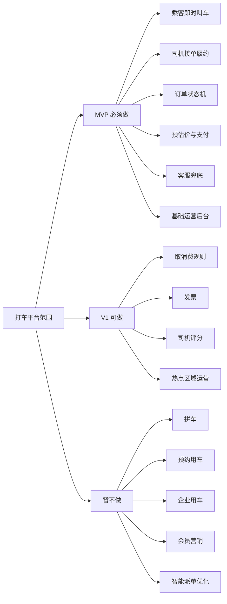
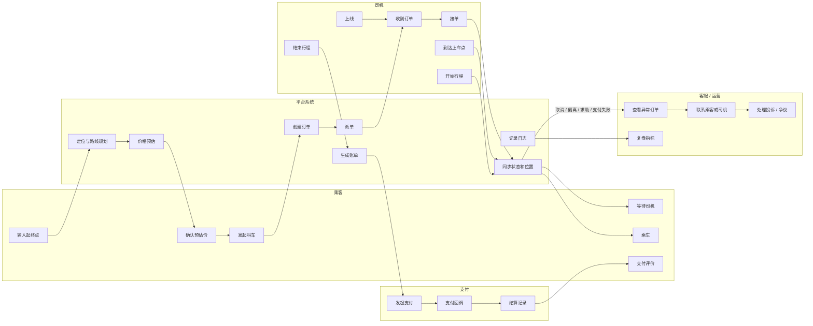
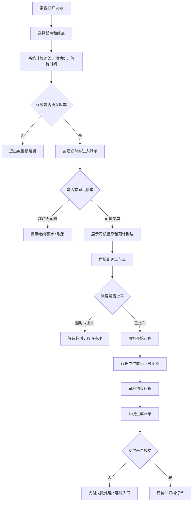
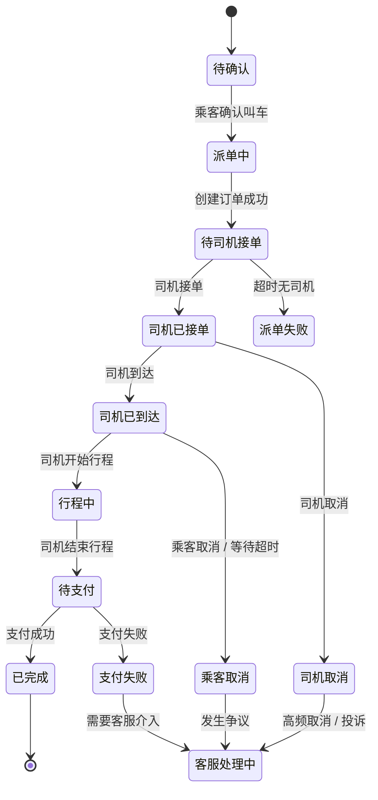
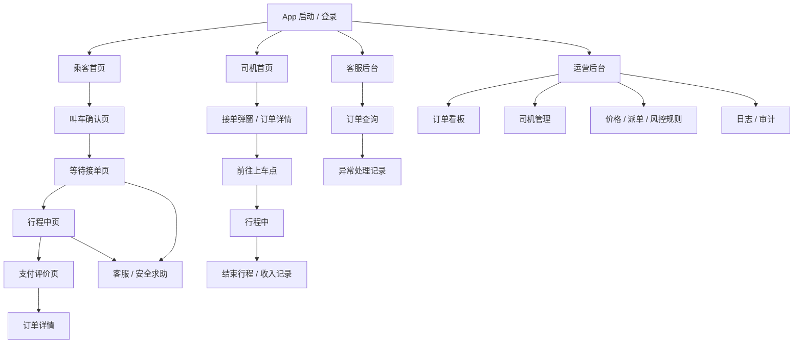
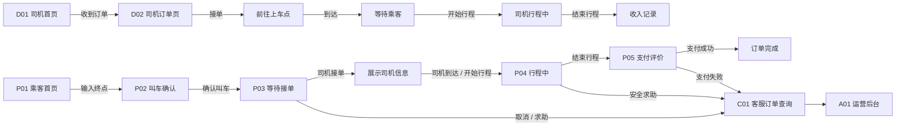
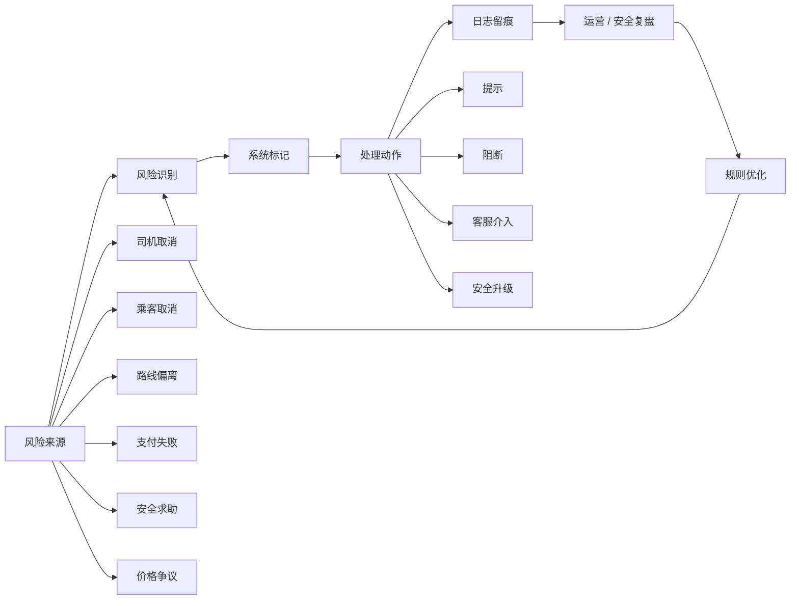

# 城市即时打车平台 MVP PRD

- 文档状态：Review Draft
- 文档版本：v0.2
- 生成日期：2026-04-28
- 文档用途：PRD 结构修复测试版
- 输入来源：[00_raw_input.md](/Users/liujun/Desktop/产品经理skill/projects/taxi-hailing-prd-test/00_raw_input.md)
- 当前边界：本阶段不输出 PNG，不输出 HTML；只输出 PRD 正文、辅助理解图、页面说明、页面跳转关系和原型图层。

---

## 1. 摘要

城市即时打车平台 MVP 面向乘客、司机、客服、运营和管理员，先完成“乘客即时叫车 - 平台派单 - 司机接单 - 行程服务 - 支付评价 - 客服兜底”的最小闭环。首期重点解决乘客等待不确定、价格不透明、订单状态不清楚、司机接单链路不稳定和安全兜底不足的问题。

本 PRD 不包含拼车、顺风车、预约用车、企业用车、会员体系和复杂营销能力。

### 1.1 产品总览思维导图

```mermaid
flowchart TB
  P["城市即时打车平台 MVP"]

  P --> U["目标用户"]
  U --> U1["乘客"]
  U --> U2["司机"]
  U --> U3["客服"]
  U --> U4["运营"]
  U --> U5["管理员"]

  P --> S["核心场景"]
  S --> S1["乘客即时叫车"]
  S --> S2["司机接单履约"]
  S --> S3["行程中位置与状态同步"]
  S --> S4["支付与评价"]
  S --> S5["异常订单客服介入"]

  P --> M["MVP 模块"]
  M --> M1["乘客端叫车"]
  M --> M2["司机端接单"]
  M --> M3["订单与状态机"]
  M --> M4["价格预估与支付"]
  M --> M5["客服与安全兜底"]
  M --> M6["运营后台"]

  P --> R["风险边界"]
  R --> R1["定位误差"]
  R --> R2["司机爽约 / 乘客取消"]
  R --> R3["价格争议"]
  R --> R4["安全事件"]
  R --> R5["支付失败"]

  P --> K["成功指标"]
  K --> K1["叫车成功率"]
  K --> K2["平均接单时长"]
  K --> K3["订单完成率"]
  K --> K4["支付成功率"]
  K --> K5["投诉率"]
```

---

## 2. 背景与问题定义

### 2.1 当前背景

城市用户有即时出行需求，尤其在上下班高峰、雨天、夜间、机场车站和商圈场景下，用户需要快速叫到车，并清楚知道等待时间、费用预估、司机位置和订单状态。

司机侧需要稳定获得订单、明确上车点、降低空驶和沟通成本。平台侧需要建立最小订单闭环，并具备客服、安全、支付、风控和运营干预能力。

### 2.2 问题定义

| 问题 | 影响对象 | 表现 | 业务影响 |
|---|---|---|---|
| 等待不确定 | 乘客 | 不知道是否有人接单、司机多久到 | 放弃叫车、投诉 |
| 价格不透明 | 乘客 / 客服 | 预估价和实付价差异无解释 | 支付争议、客服压力 |
| 状态不清楚 | 乘客 / 司机 | 叫车、接单、到达、开始、结束状态不明确 | 沟通成本高 |
| 派单效率低 | 司机 / 平台 | 司机接不到合适订单或接单后取消 | 完成率下降 |
| 安全兜底弱 | 乘客 / 平台 | 行程中异常缺少快速求助和客服介入 | 高风险事件 |
| 支付失败 | 乘客 / 平台 | 到达后无法顺利支付 | 订单结算异常 |

### 2.3 证据与假设

- 证据：本项目是测试样例，暂无真实城市订单、司机供给、转化率和投诉数据。
- 假设：一期先在单城市或少量区域试点。
- 假设：司机已完成基础准入，平台可获取司机实时定位。
- 假设：支付、短信/推送、地图定位和路线规划具备基础接入条件。

---

## 3. 为什么现在做

- 即时打车是高频、刚需、可验证的出行场景，适合用 MVP 验证供需匹配和履约闭环。
- 先做即时打车可以验证乘客端、司机端、订单状态机、支付和客服风控的基础能力。
- 如果不先建立订单闭环，后续预约、拼车、企业用车、会员体系都会缺少底层支撑。

---

## 4. 目标用户 / 角色 / JTBD

### 4.1 目标用户

| 角色 | 目标 | 核心任务 | 风险点 |
|---|---|---|---|
| 乘客 | 快速、安全、价格清楚地到达目的地 | 选择起终点、叫车、等车、乘车、支付、评价 | 等待过长、价格争议、安全问题 |
| 司机 | 稳定接单并完成行程 | 接单、导航到上车点、开始行程、结束行程 | 路线不清、乘客取消、结算异常 |
| 客服 | 处理异常订单和投诉 | 查看订单、联系双方、补偿或升级 | 缺少状态和证据 |
| 运营 | 监控供需和订单质量 | 查看订单、司机供给、取消率、投诉率 | 无法干预高风险区域 |
| 管理员 | 管理规则、权限和配置 | 维护城市、价格、司机、风控、权限 | 配置错误影响大 |

### 4.2 JTBD / 关键任务

- 当乘客需要立即出行时，希望快速叫到附近车辆，并清楚知道价格、司机位置和预计到达时间。
- 当司机在线接单时，希望获得距离合理、路线清楚、收益明确的订单。
- 当订单异常时，客服希望快速看到订单全链路状态，并能介入处理。
- 当运营复盘时，希望看到叫车成功率、接单时长、完成率、取消原因和投诉分布。

### 4.3 用户场景 / JTBD 思维导图

```mermaid
flowchart TB
  JTBD["用户场景 / JTBD"]

  JTBD --> PAX["乘客"]
  PAX --> P1["目标：快速到达目的地"]
  PAX --> P2["触发：上班、下班、雨天、夜间、赶车"]
  PAX --> P3["动作：选起终点、确认价格、叫车、支付评价"]
  PAX --> P4["期望：等待短、价格清楚、行程安全"]
  PAX --> P5["风险：等不到车、司机取消、支付失败"]

  JTBD --> DRV["司机"]
  DRV --> D1["目标：稳定获得订单"]
  DRV --> D2["触发：上线接单、附近有订单"]
  DRV --> D3["动作：接单、导航、开始行程、结束行程"]
  DRV --> D4["期望：路线清楚、结算准确、取消可控"]
  DRV --> D5["风险：乘客迟到、上车点不清、收入争议"]

  JTBD --> CS["客服"]
  CS --> C1["目标：快速处理异常"]
  CS --> C2["触发：投诉、取消争议、支付失败、安全求助"]
  CS --> C3["动作：查订单、联系双方、记录处理结果"]
  CS --> C4["期望：证据完整、状态清楚、可升级"]

  JTBD --> OPS["运营 / 管理"]
  OPS --> O1["目标：保障供需和安全"]
  OPS --> O2["触发：高峰、热点区域、异常指标"]
  OPS --> O3["动作：看监控、调规则、查日志"]
  OPS --> O4["期望：问题可定位、规则可配置、风险可追踪"]
```

---

## 5. 使用场景

### 5.1 核心场景

1. 乘客即时叫车
   - 乘客输入起点和终点。
   - 系统展示预估价、预计等待时间和可用车型。
   - 乘客确认叫车，系统进入派单。

2. 司机接单履约
   - 司机收到订单。
   - 司机确认接单并导航到乘客上车点。
   - 司机到达后等待乘客上车，开始行程。

3. 行程中状态同步
   - 乘客查看车辆位置、车牌、司机信息和路线。
   - 司机查看导航和订单状态。
   - 系统同步位置、时间、路线和安全状态。

4. 支付与评价
   - 行程结束后系统生成费用。
   - 乘客支付并评价。
   - 平台完成司机结算记录。

5. 异常处理
   - 支付失败、司机取消、乘客取消、路线偏离、安全求助进入异常处理。
   - 客服可查看订单全链路并处理。

### 5.2 次要场景

- 乘客修改上车点。
- 司机到达后等待超时。
- 乘客取消订单。
- 司机取消订单。
- 客服介入价格争议。

### 5.3 本期不支持场景

- 拼车。
- 顺风车。
- 预约用车。
- 企业用车。
- 会员权益。
- 优惠券和复杂营销。
- 多车型复杂定价。

---

## 6. 范围定义

### 6.1 In Scope

- 乘客端：定位、起终点输入、预估价、叫车、订单状态、司机信息、支付、评价、客服入口。
- 司机端：上线、接单、导航到上车点、到达、开始行程、结束行程、收入记录。
- 平台服务：订单状态机、基础派单、价格预估、位置同步、支付回调、消息通知。
- 客服后台：订单查询、异常标记、联系双方、处理记录。
- 运营后台：订单看板、司机供给、取消率、投诉率、基础规则配置。
- 风控安全：安全求助、路线偏离提示、敏感操作日志、异常订单升级。

### 6.2 Out of Scope

- 拼车、顺风车、预约用车。
- 企业支付和企业账户。
- 会员体系、积分、优惠券。
- 司机复杂分账和奖励系统。
- 多城市复杂运营策略。
- 自动化智能调度优化。

### 6.3 分阶段规划

| 阶段 | 范围 |
|---|---|
| MVP | 即时叫车、司机接单、订单状态、支付评价、客服兜底、基础后台 |
| V1 | 取消费、发票、司机评分、热点区域运营、更多支付渠道 |
| Later | 预约用车、拼车、企业用车、会员营销、智能派单优化 |

### 6.4 MVP 范围地图

---

## 7. 方案概述

### 7.1 方案摘要

MVP 采用双端产品加基础后台的方式：乘客端负责叫车、等待、乘车、支付；司机端负责上线、接单、履约；平台服务负责派单、状态机、价格、支付、消息和位置同步；客服与运营后台负责异常兜底和基础管理。

### 7.2 核心业务泳道图

### 7.3 功能流程图

### 7.4 订单状态流转图

### 7.5 派单策略

MVP 派单先采用规则派单，不做复杂智能调度。

| 优先级 | 规则 | 说明 |
|---|---|---|
| P0 | 司机在线且可接单 | 不向离线、忙碌、被封禁司机派单 |
| P0 | 距离上车点近 | 降低乘客等待时间 |
| P1 | 司机服务评分达标 | 降低投诉风险 |
| P1 | 司机取消率不过高 | 避免派给不稳定司机 |
| P2 | 路线方向合理 | 降低司机空驶和拒单 |

---

### 7.6 页面与原型说明

本阶段不输出 PNG 或 HTML。以下内容用于替代旧的集中原型描述，作为后续 UI 设计、PNG 原型、HTML 原型和 Codex 开发文档的依据。

#### 7.6.1 页面信息架构图

#### 7.6.2 页面清单

| 页面 ID | 页面 | 适用角色 | 页面目标 | 核心操作 |
|---|---|---|---|---|
| P01 | 乘客首页 | 乘客 | 选择起终点并发起叫车 | 定位、输入终点、查看预估价 |
| P02 | 叫车确认页 | 乘客 | 确认车型、价格、上车点 | 确认叫车、修改起终点 |
| P03 | 等待接单页 | 乘客 | 查看派单状态和司机信息 | 取消订单、联系司机、求助 |
| P04 | 行程中页 | 乘客 | 查看路线、状态和安全入口 | 分享行程、安全求助、联系客服 |
| P05 | 支付评价页 | 乘客 | 完成支付和评价 | 支付、评价、查看账单 |
| D01 | 司机首页 | 司机 | 上线接单并查看状态 | 上线/下线、接单 |
| D02 | 司机订单页 | 司机 | 查看订单并履约 | 接单、导航、到达、开始、结束 |
| C01 | 客服订单查询 | 客服 | 查询订单并处理异常 | 联系双方、记录处理 |
| A01 | 运营后台 | 运营 / 管理员 | 查看订单和配置规则 | 查订单、管司机、改规则、看日志 |

#### 7.6.3 页面说明

##### P01 乘客首页

- 页面目标：让乘客快速输入目的地并了解可叫车状态。
- 入口来源：App 启动后默认进入。
- 出口跳转：
  - 输入终点后进入 P02 叫车确认页。
  - 点击历史订单进入订单详情。
  - 点击客服进入帮助中心。
- 核心区域：
  - 地图定位。
  - 起点和终点输入框。
  - 常用地址。
  - 车型和预估等待提示。
- 核心字段：
  - 当前定位。
  - 目的地。
  - 预计等待时间。
  - 预估价区间。
- 异常状态：
  - 定位失败。
  - 当前区域无服务。
  - 目的地超出服务范围。

##### P02 叫车确认页

- 页面目标：让乘客确认路线、车型、价格和上车点。
- 入口来源：P01 输入终点后进入。
- 出口跳转：
  - 点击确认叫车进入 P03 等待接单页。
  - 修改地址返回 P01。
- 核心区域：
  - 路线预览。
  - 车型选择。
  - 预估价说明。
  - 上车点确认。
- 核心字段：
  - 起点、终点、距离、预计时长、预估价、车型。
- 异常状态：
  - 路线规划失败。
  - 价格计算失败。
  - 无可用车型。

##### P03 等待接单页

- 页面目标：让乘客知道当前派单状态、司机信息和等待时间。
- 入口来源：P02 确认叫车后进入。
- 出口跳转：
  - 司机接单后保持在等待页并展示司机信息。
  - 司机到达后进入上车提示。
  - 开始行程后进入 P04 行程中页。
  - 取消订单进入取消确认。
- 核心区域：
  - 派单进度。
  - 司机位置和预计到达。
  - 司机信息、车牌、车型。
  - 联系司机、取消订单、安全求助。
- 异常状态：
  - 派单超时。
  - 司机取消。
  - 乘客取消。
  - 司机位置长时间不更新。

##### P04 行程中页

- 页面目标：让乘客清楚知道行程路线、当前位置、预计到达和安全入口。
- 入口来源：司机开始行程。
- 出口跳转：
  - 司机结束行程后进入 P05 支付评价页。
  - 点击安全求助进入安全处理。
- 核心区域：
  - 地图和路线。
  - 司机和车辆信息。
  - 预计到达时间。
  - 分享行程、安全求助、联系客服。
- 异常状态：
  - 路线偏离。
  - 长时间停车。
  - 乘客发起安全求助。

##### P05 支付评价页

- 页面目标：让乘客完成支付、查看费用明细并评价。
- 入口来源：司机结束行程。
- 出口跳转：
  - 支付成功后进入评价完成。
  - 支付失败进入重试或客服。
- 核心区域：
  - 费用明细。
  - 支付方式。
  - 评价入口。
  - 发票/账单入口，发票可后续阶段实现。
- 异常状态：
  - 支付失败。
  - 价格争议。
  - 优惠或补偿异常，本期只记录，不做复杂营销。

##### D01 司机首页

- 页面目标：让司机管理在线状态并接收订单。
- 入口来源：司机登录后进入。
- 出口跳转：
  - 上线后等待订单。
  - 收到订单进入 D02 司机订单页。
- 核心区域：
  - 在线/离线状态。
  - 当前位置。
  - 今日订单和收入摘要。
  - 接单弹窗。
- 异常状态：
  - 定位失败。
  - 账号被限制接单。
  - 车辆或证件状态异常。

##### D02 司机订单页

- 页面目标：让司机完成接单、接乘客、开始行程、结束行程。
- 入口来源：D01 接单弹窗。
- 出口跳转：
  - 接单后进入前往上车点。
  - 到达后等待乘客上车。
  - 开始行程后进入导航。
  - 结束后进入收入记录。
- 核心字段：
  - 上车点、目的地、距离、预估收入、乘客联系入口、订单状态。
- 异常状态：
  - 乘客取消。
  - 司机取消。
  - 上车点无法到达。
  - 乘客未出现。

##### C01 客服订单查询

- 页面目标：让客服处理取消争议、支付失败、安全求助和投诉。
- 入口来源：客服后台。
- 核心区域：
  - 订单搜索。
  - 订单状态时间线。
  - 乘客与司机信息。
  - 位置、路线、费用、支付记录。
  - 处理记录。
- 操作：
  - 联系乘客。
  - 联系司机。
  - 标记问题类型。
  - 升级安全事件。
  - 记录处理结论。

##### A01 运营后台

- 页面目标：让运营和管理员查看订单、司机供给、异常和规则。
- 核心区域：
  - 订单看板。
  - 司机在线与接单情况。
  - 取消率、完成率、投诉率。
  - 价格规则、派单规则、风控规则。
  - 操作日志。
- 权限差异：
  - 运营可查看和处理订单。
  - 管理员可修改规则。
  - 客服只能看授权订单和处理记录。

#### 7.6.4 页面跳转关系

| 当前页面 | 操作 | 条件 | 下一页面 / 状态 |
|---|---|---|---|
| P01 乘客首页 | 输入终点 | 地址有效 | P02 叫车确认页 |
| P02 叫车确认页 | 确认叫车 | 价格和路线有效 | P03 等待接单页 |
| P03 等待接单页 | 司机接单 | 有司机接单 | 展示司机信息 |
| P03 等待接单页 | 取消订单 | 未开始行程 | 取消确认 |
| P04 行程中页 | 安全求助 | 任意行程中状态 | 客服 / 安全事件 |
| P05 支付评价页 | 支付失败 | 支付回调失败 | 支付重试 / 客服 |
| D01 司机首页 | 接单 | 司机在线且可接单 | D02 司机订单页 |
| D02 司机订单页 | 结束行程 | 行程中 | P05 支付评价页 |

#### 7.6.5 原型图层

当前边界：PRD 阶段提供页面级低保真原型图/页面原型说明，不输出 PNG、HTML 或高保真 UI。以下内容用于后续 UI 设计、PNG/HTML 原型和 Codex 开发文档承接。

| 页面 | 页面级低保真布局 | 核心组件 | 主要动作 | 状态反馈 | 权限 / 异常 |
|---|---|---|---|---|---|
| P01 乘客首页 | 地图为主，底部目的地输入与常用地址，顶部定位状态 | 地图、起终点、常用地址、预估等待 | 输入终点、选择地址、进入叫车确认 | 定位中、定位失败、无服务区 | 未登录、定位授权失败 |
| P02 叫车确认页 | 路线预览在上，车型和价格在中，确认按钮固定底部 | 路线、车型、预估价、上车点 | 确认叫车、修改地址、切换车型 | 价格计算中、路线失败 | 地址无效、无可用车型 |
| P03 等待接单页 | 派单状态居中，司机/车辆信息和操作区分层展示 | 派单进度、司机信息、取消、联系、安全求助 | 取消订单、联系司机、查看司机位置 | 派单中、已接单、司机到达、派单超时 | 司机取消、乘客取消、位置不更新 |
| P04 行程中页 | 地图和路线为主，底部行程状态与安全入口 | 路线、预计到达、司机车辆、分享、安全求助 | 分享行程、联系客服、安全求助 | 行程中、路线偏离、长时间停车 | 安全事件、网络异常 |
| P05 支付评价页 | 费用明细在上，支付方式和评价入口在下 | 账单、支付方式、评价、发票入口 | 支付、重试、评价、查看账单 | 待支付、支付中、支付成功、支付失败 | 价格争议、支付回调失败 |
| D01 司机首页 | 在线状态和接单弹窗突出，收入摘要辅助展示 | 上线状态、当前位置、订单弹窗、收入摘要 | 上线/下线、接单、拒单 | 可接单、忙碌、离线、账号受限 | 定位失败、证件异常 |
| D02 司机订单页 | 上车点/目的地与状态动作分区，导航入口固定可见 | 订单信息、导航、状态动作、乘客联系 | 接单、到达、开始行程、结束行程 | 前往上车点、等待乘客、行程中 | 乘客取消、上车点异常 |
| C01 客服订单查询 | 搜索在上，订单时间线和处理记录并列展示 | 搜索、订单时间线、双方信息、处理记录 | 查询、联系双方、升级、记录结果 | 正常、异常处理中、已关闭 | 权限不足、证据缺失 |
| A01 运营后台 | 指标看板、订单列表、规则配置和日志分区 | 订单看板、司机管理、规则、日志 | 查看、筛选、修改规则、审计 | 正常、告警、规则变更待确认 | 无权限、配置冲突 |

#### 7.6.6 权限矩阵

| 角色 / 动作 | 叫车 | 接单 | 查看订单 | 修改订单 | 取消订单 | 处理投诉 | 修改规则 | 查看日志 |
|---|---|---|---|---|---|---|---|---|
| 乘客 | 允许 | 不允许 | 自己订单 | 不允许 | 自己订单，行程开始前 | 发起投诉 | 不允许 | 不允许 |
| 司机 | 不允许 | 允许 | 自己订单 | 仅状态动作 | 接单后有限取消 | 反馈问题 | 不允许 | 不允许 |
| 客服 | 不允许 | 不允许 | 授权订单 | 记录处理结论 | 协助处理 | 允许 | 不允许 | 处理日志 |
| 运营 | 不允许 | 不允许 | 全局汇总和授权明细 | 不直接改订单事实 | 可配置部分规则 | 可查看 | 部分规则 | 运营日志 |
| 管理员 | 不允许 | 不允许 | 全部 | 配置级操作 | 可配置规则 | 可查看 | 允许 | 全部 |

---

## 8. 详细需求

### 8.1 乘客叫车

功能要求：

- 支持定位当前起点。
- 支持输入或选择目的地。
- 展示路线、距离、预计时长和预估价。
- 支持确认叫车。
- 支持取消订单，但需展示是否产生取消费。本期取消费规则可先配置为 0 或人工确认。

验收标准：

- 乘客可以从首页完成一次叫车发起。
- 起点或终点无效时不能创建订单。
- 预估价失败时不能直接叫车，需提示稍后重试。

### 8.2 司机接单

功能要求：

- 司机可上线/下线。
- 司机收到订单后可接单或超时未响应。
- 接单后展示上车点、目的地、乘客联系入口。
- 支持到达、开始行程、结束行程。

验收标准：

- 离线司机不接收订单。
- 已接单司机不能再接新订单。
- 状态动作必须按顺序执行。

### 8.3 订单状态机

功能要求：

- 订单必须记录状态、状态更新时间、操作者和触发来源。
- 关键状态包括派单中、已接单、司机到达、行程中、待支付、已完成、已取消、异常处理中。
- 异常状态必须可被客服查询。

验收标准：

- 状态不能跳过关键节点。
- 已完成订单不能被普通用户修改。
- 取消、支付失败、安全求助必须留下日志。

### 8.4 价格预估与支付

功能要求：

- 叫车前展示预估价。
- 行程结束后生成费用明细。
- 支持至少一种支付方式。
- 支付失败支持重试和客服入口。

验收标准：

- 费用明细包含基础价、里程、时长和其他费用项。
- 支付成功后订单进入已完成。
- 支付失败不得误标记为已完成。

### 8.5 客服与安全

功能要求：

- 客服可按订单号、手机号、司机、时间查询订单。
- 客服可查看状态时间线、位置、费用和支付记录。
- 乘客行程中可进入安全求助。
- 高风险事件可升级。

验收标准：

- 客服处理动作必须记录操作人、时间、原因和结果。
- 安全求助必须高优先级展示。
- 客服不可修改订单事实，只能记录处理结论和补偿建议。

### 8.6 运营后台

功能要求：

- 支持查看订单量、叫车成功率、接单时长、完成率、取消率、投诉率。
- 支持查看司机在线数量和区域分布。
- 支持基础价格、派单和风控规则配置。
- 支持操作日志。

验收标准：

- 管理员修改规则必须二次确认。
- 规则修改必须记录日志。
- 运营只能查看授权范围内数据。

---

## 9. 需求明细表

| ID | 模块 | 需求 | 优先级 | 验收要点 |
|---|---|---|---|---|
| REQ-001 | 乘客端 | 起终点选择和定位 | P0 | 起终点有效才能叫车 |
| REQ-002 | 乘客端 | 预估价和等待时间展示 | P0 | 叫车前必须展示 |
| REQ-003 | 乘客端 | 创建订单并等待接单 | P0 | 订单进入派单中 |
| REQ-004 | 司机端 | 上线、接单、到达、开始、结束 | P0 | 状态按顺序流转 |
| REQ-005 | 系统 | 基础派单 | P0 | 只派给在线可接单司机 |
| REQ-006 | 系统 | 订单状态机 | P0 | 状态变更有日志 |
| REQ-007 | 支付 | 支付和费用明细 | P0 | 支付成功进入已完成 |
| REQ-008 | 客服 | 订单查询和异常处理 | P0 | 可查看订单时间线 |
| REQ-009 | 安全 | 行程中安全求助 | P0 | 可进入客服/安全处理 |
| REQ-010 | 后台 | 订单和司机运营看板 | P1 | 可看核心指标 |
| REQ-011 | 后台 | 规则配置和审计日志 | P1 | 修改规则留痕 |

---

## 10. 用户故事与验收标准

### 10.1 用户故事地图

| 用户旅程 | 选择起终点 | 确认叫车 | 等待接单 | 行程中 | 支付评价 | 异常处理 | 后台管理 |
|---|---|---|---|---|---|---|---|
| 乘客 | 选起点和终点 | 看预估价并叫车 | 看司机位置 | 看路线和安全入口 | 支付评价 | 取消、投诉、求助 | 不涉及 |
| 司机 | 不涉及 | 接收订单 | 前往上车点 | 导航履约 | 结束行程 | 取消、反馈 | 不涉及 |
| 客服 | 查询订单 | 不涉及 | 查看派单状态 | 查看行程状态 | 查看支付状态 | 处理异常 | 记录处理 |
| 运营 | 看区域供需 | 看订单转化 | 看接单时长 | 看完成率 | 看支付成功率 | 看投诉率 | 配规则 |
| MVP | 必须做 | 必须做 | 必须做 | 必须做 | 必须做 | 必须做 | 基础看板 |
| V1 | 常用地址 | 取消费 | 热点调度 | 行程分享增强 | 发票 | 补偿规则 | 更多配置 |
| Later | 多端同步 | 预约 | 智能派单 | 安全评分 | 会员支付 | 自动仲裁 | 多城市运营 |

### 10.2 核心用户故事

1. 作为乘客，我希望输入目的地后看到价格和等待时间，以便决定是否叫车。
   - 验收标准：展示起终点、距离、预计时长、预估价和预计等待时间。
   - 验收标准：路线或价格失败时不能创建订单。

2. 作为乘客，我希望司机接单后能看到司机位置和车辆信息，以便安心等待。
   - 验收标准：展示司机姓名、车牌、车型、当前位置和预计到达时间。
   - 验收标准：司机取消后乘客看到明确提示。

3. 作为司机，我希望接单后获得清楚的上车点和导航，以便快速接到乘客。
   - 验收标准：接单后展示上车点、导航入口、乘客联系入口。
   - 验收标准：司机到达、开始、结束动作有状态校验。

4. 作为客服，我希望查询订单全链路状态，以便处理投诉和异常。
   - 验收标准：客服能看到订单状态时间线、费用、支付、取消和处理记录。
   - 验收标准：客服处理动作写入日志。

5. 作为运营，我希望查看叫车成功率和取消原因，以便优化供需。
   - 验收标准：后台展示订单量、接单时长、完成率、取消率、投诉率。

### 10.3 Definition of Done

- 乘客叫车主流程可完成。
- 司机接单履约主流程可完成。
- 订单状态机覆盖成功、取消、失败和客服处理。
- 支付成功和失败都有明确状态。
- 客服能查询异常订单并留痕。
- 运营后台能查看基础指标。
- 权限、日志、安全入口通过验收。

---

## 11. 异常、边界与兼容性

### 11.1 异常场景

| 异常 | 处理方式 |
|---|---|
| 定位失败 | 提示手动选择起点 |
| 路线规划失败 | 阻止叫车，提示重试 |
| 价格预估失败 | 阻止叫车，提示稍后重试 |
| 派单超时 | 提示继续等待或取消 |
| 司机取消 | 重新派单或订单取消 |
| 乘客取消 | 根据规则判断是否产生取消记录 |
| 司机到达后乘客未出现 | 进入等待超时处理 |
| 支付失败 | 支付重试或客服介入 |
| 路线偏离 | 记录风险并提示乘客 |
| 安全求助 | 进入高优先级客服/安全流程 |

### 11.2 边界条件

- 一期只支持单城市或指定试点区域。
- 一期只支持即时叫车。
- 起点和终点必须在服务范围内。
- 司机必须在线且状态可接单。
- 已开始行程后乘客不能直接取消订单。
- 已完成订单不能修改行程事实。

### 11.3 兼容性

- 乘客端优先移动端。
- 司机端优先移动端。
- 客服和运营后台优先 Web。
- 弱网下必须能看到订单当前状态和重试提示。

---

## 12. 非功能要求

- 性能：叫车确认、派单状态更新、司机位置更新需要在可接受延迟内完成。
- 可用性：订单状态和支付回调需要具备重试和补偿机制。
- 安全：行程中安全求助入口必须明显。
- 隐私：乘客和司机手机号默认脱敏，通过平台中转联系。
- 审计：取消、支付失败、客服处理、规则修改必须留痕。
- 可观测：订单创建、派单、接单、开始、结束、支付、取消和投诉需要埋点。

---

## 13. 埋点与数据方案

| 事件名 | 触发时机 | 关键属性 | 指标归属 |
|---|---|---|---|
| passenger_open_home | 乘客打开首页 | city、location_status | 首页转化 |
| route_estimate_success | 预估价成功 | distance、duration、estimated_price | 叫车前转化 |
| order_create | 乘客确认叫车 | origin、destination、car_type | 叫车量 |
| driver_accept | 司机接单 | driver_id、distance_to_pickup | 接单率 |
| driver_arrive | 司机到达 | waiting_time | 接驾效率 |
| trip_start | 开始行程 | order_id | 行程开始率 |
| trip_finish | 结束行程 | distance、duration | 完成率 |
| payment_success | 支付成功 | amount、pay_method | 支付成功率 |
| payment_failed | 支付失败 | fail_reason | 支付风险 |
| order_cancel | 订单取消 | cancel_role、cancel_reason | 取消率 |
| safety_help_click | 点击安全求助 | order_status | 安全事件 |
| support_case_create | 客服工单创建 | issue_type | 客服压力 |

---

## 14. 目标 / 非目标

### 14.1 业务目标

- 建立城市即时打车订单闭环。
- 提升乘客叫车成功率和等待确定性。
- 降低司机接单和履约沟通成本。
- 建立客服、安全和运营兜底能力。

### 14.2 用户目标

- 乘客能快速、清楚、安全地完成一次即时打车。
- 司机能清楚接单并完成履约。
- 客服能快速处理异常订单。
- 运营能看到基础指标并调整规则。

### 14.3 非目标

- 不做拼车。
- 不做顺风车。
- 不做预约用车。
- 不做企业用车。
- 不做会员体系。
- 不做复杂营销和优惠券。
- 不做复杂智能调度。

---

## 15. 成功指标

| 指标 | MVP 目标 | 统计口径 | 护栏 |
|---|---:|---|---|
| 叫车成功率 | 待试点确定 | 有司机接单订单 / 发起叫车订单 | 不能通过隐藏失败来提高 |
| 平均接单时长 | 待试点确定 | 从发起叫车到司机接单 | 分区域、分时段看 |
| 订单完成率 | 待试点确定 | 已完成订单 / 已接单订单 | 排除测试订单 |
| 支付成功率 | >= 95% | 支付成功订单 / 待支付订单 | 支付失败要可追踪 |
| 乘客取消率 | 待试点确定 | 乘客取消订单 / 发起叫车订单 | 需区分取消原因 |
| 司机取消率 | 待试点确定 | 司机取消订单 / 已接单订单 | 高频取消司机需风控 |
| 投诉率 | 待试点确定 | 投诉订单 / 完成订单 | 安全投诉单独标记 |
| 安全求助响应时长 | P0 优先 | 从求助到客服响应 | 高风险事件不得延迟 |

---

## 16. 依赖、风险与开放问题

### 16.1 外部依赖

- 地图定位。
- 路线规划。
- 司机实时定位。
- 支付系统。
- 短信 / 推送。
- 客服系统。
- 风控规则。
- 订单数据库。

### 16.2 风险控制闭环图

### 16.3 风险清单

| 风险 | 影响 | 应对 |
|---|---|---|
| 定位不准 | 司机找不到乘客 | 支持手动调整上车点 |
| 派单超时 | 乘客流失 | 提供继续等待/取消选择 |
| 司机频繁取消 | 完成率下降 | 记录司机取消率，进入风控 |
| 价格争议 | 投诉增加 | 展示费用明细，客服可查 |
| 支付失败 | 订单无法闭环 | 支付重试和客服兜底 |
| 安全事件 | 高风险 | 安全求助高优先级处理 |

### 16.4 开放问题

- 首城范围是什么？
- 计价规则由谁确认？
- 司机准入规则是什么？
- 安全联系人是否一期做？
- 支付渠道有哪些？
- 取消费规则是否一期启用？
- 客服介入标准是什么？
- 是否一期支持发票？

---

## 17. 上线与灰度方案

- 上线方式：单城市或指定区域灰度。
- 灰度人群：内部员工、白名单司机、少量真实乘客。
- 放量节奏：先小流量验证叫车、派单、支付、客服，再扩大区域。
- 回滚条件：
  - 支付失败率异常。
  - 司机接单链路异常。
  - 安全求助无法响应。
  - 投诉明显上升。
- 回滚方案：关闭叫车入口，保留订单查询、客服和支付处理能力。

---

## 18. 验收 Checklist

- [ ] 乘客能完成一次从选点到支付评价的完整流程。
- [ ] 司机能完成上线、接单、到达、开始、结束流程。
- [ ] 订单状态机覆盖成功、取消、失败和客服处理。
- [ ] 支付成功、支付失败都有明确状态。
- [ ] 客服能查询订单时间线并记录处理。
- [ ] 安全求助入口可用。
- [ ] 后台能查看订单、司机、取消、投诉基础指标。
- [ ] 权限矩阵通过验证。
- [ ] 关键日志和埋点可查。
- [ ] 灰度和回滚方案已确认。

---

## 19. 版本记录

| 版本 | 日期 | 修改人 | 变更内容 |
|---|---|---|---|
| v0.1 | 2026-04-28 | Codex | 当前生成链路自动输出测试 PRD |
| v0.2 | 2026-04-28 | Codex | 人工修复：图表按对应章节分布，补充流程图、页面说明和页面跳转关系，移除集中可视化层 |
