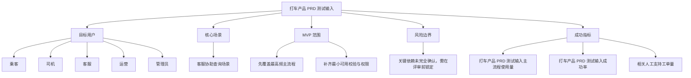
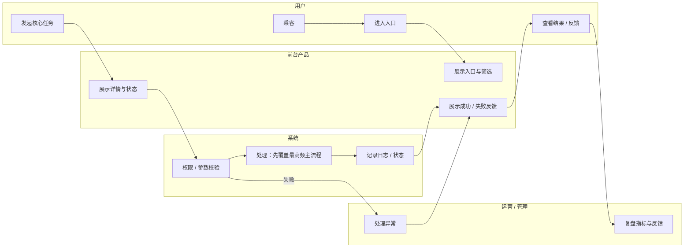
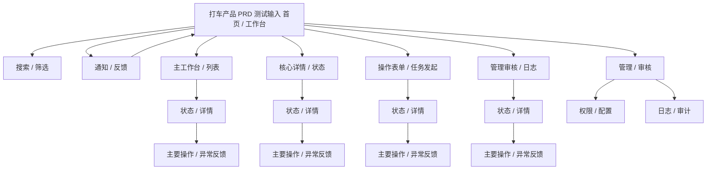
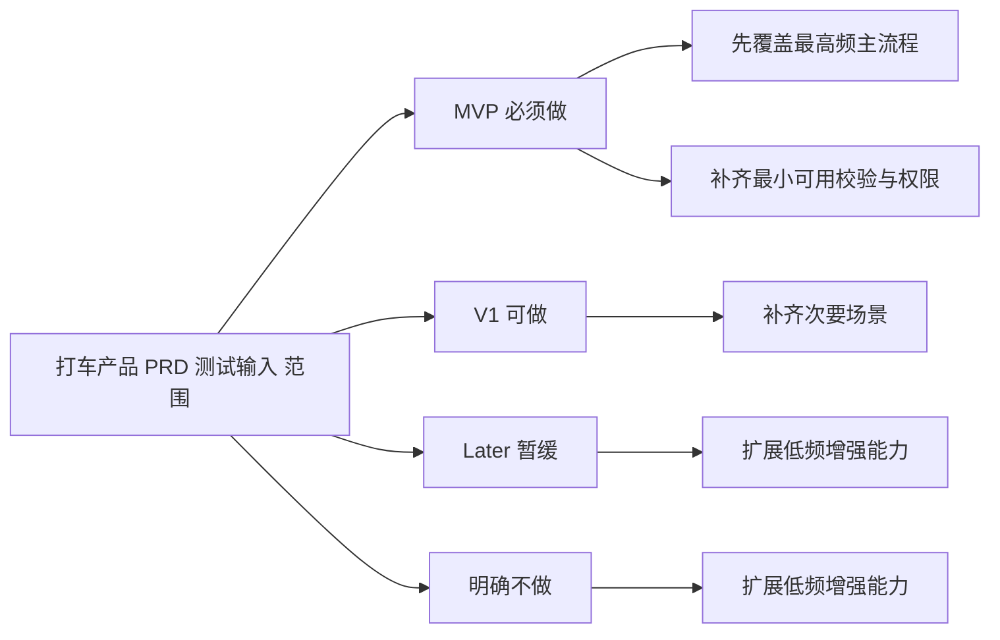
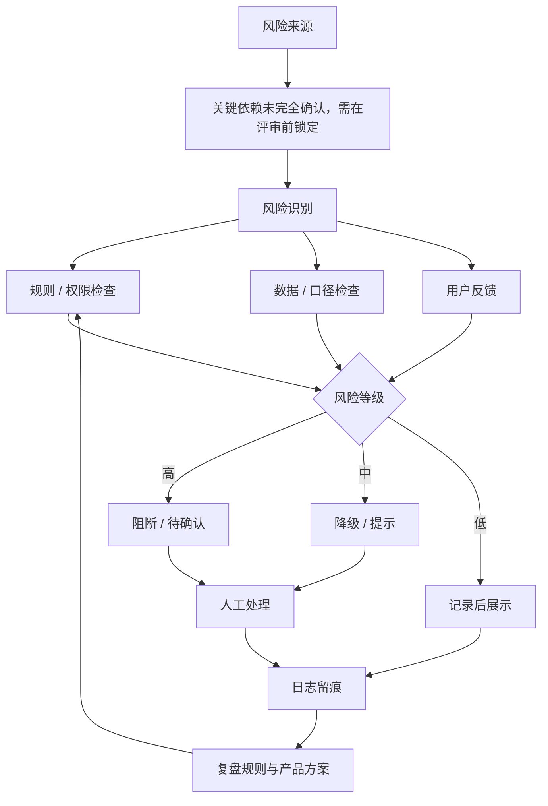

# 打车产品 PRD 测试输入

- 文档状态：draft
- 文档版本：v0.1

## 1. 摘要
围绕“打车产品 PRD 测试输入”构建最小可上线闭环，优先解决用户在高峰期叫车等待不确定，价格不透明，司机接单和乘客等待状态不清楚，平台缺少基础订单闭环和安全兜底。，导致无法验证最新 PRD 结构是否被改坏，也无法发现原型说明、页面跳转、目标指标后置后的阅读问题。。

## 2. 背景与问题定义
- 背景：出行服务
- 问题：用户在高峰期叫车等待不确定，价格不透明，司机接单和乘客等待状态不清楚，平台缺少基础订单闭环和安全兜底。，导致无法验证最新 PRD 结构是否被改坏，也无法发现原型说明、页面跳转、目标指标后置后的阅读问题。。

## 3. 为什么现在做
- 业务目标：降低无法验证最新 PRD 结构是否被改坏，也无法发现原型说明、页面跳转、目标指标后置后的阅读问题。
- 紧急度：unknown

## 4. 目标用户 / 角色 / JTBD
- 乘客
- 司机
- 客服
- 运营
- 管理员

## 5. 使用场景
- 客服协助查询场景

## 6. 范围定义
### 6.1 In Scope（本期包含）
- 先覆盖最高频主流程
- 补齐最小可用校验与权限

### 6.2 Out of Scope（本期不包含）
- 扩展低频增强能力

### 6.3 分阶段规划
#### MVP
- 先覆盖最高频主流程
- 补齐最小可用校验与权限

#### V1
- 补齐次要场景

#### Later
- 扩展低频增强能力

## 7. 方案概述
### 7.1 方案摘要
基于现有后台流程补齐核心入口、权限控制、审计和数据反馈，先上线最小闭环，再视使用情况扩展。

### 7.2 PRD 可视化层
#### 7.2.1 产品总览思维导图

#### 7.2.2 核心业务泳道图

#### 7.2.3 页面信息架构图

#### 7.2.4 MVP 范围地图

#### 7.2.5 风险控制闭环图

### 7.3 功能流程图
- 产品总流程：用户进入 -> 核心入口 -> 主流程任务 -> 成功/失败反馈 -> 留存或复用。
- 核心业务流程：触发条件 -> 用户动作 -> 系统校验 -> 系统处理 -> 成功状态或异常处理。
- 异常/审核流程：异常触发 -> 权限/数据/合规检查 -> 阻断或进入审核 -> 记录日志 -> 用户可见反馈。

### 7.4 原型图 / 线框图
- 主工作台：顶部导航 + 搜索/筛选 + 主内容区 + 右侧快捷入口。
- 核心详情页：标题/状态/关键指标 + 详情信息 + 主要操作 + 风险或异常提示。
- 管理/审核页：待处理列表 + 筛选 + 详情抽屉 + 通过/拒绝/退回操作 + 审计日志。

### 7.5 AI 模型选型
- 若本项目涉及 AI 能力，PRD 必须进一步拆分 AI 任务，并给出模型路由、fallback、评测标准、成本/延迟权衡和合规约束。
- 默认模型策略：低风险高频任务使用快速低成本模型；复杂推理或长文本任务使用高能力模型；高风险内容使用规则引擎、模型复核和人工审核。
- 若本项目不涉及 AI 能力，本期 AI 模型选型标记为不适用，但仍需在 PRD 正文明确说明。

## 8. 详细需求（按模块写）
- 先覆盖最高频主流程
- 补齐最小可用校验与权限
- 补齐次要场景

## 9. 需求明细表
| ID | 需求 | 优先级 | 备注 |
| --- | --- | --- | --- |
| REQ-001 | 先覆盖最高频主流程 | unknown | 首版纳入 |
| REQ-002 | 补齐最小可用校验与权限 | unknown | 首版纳入 |
| REQ-003 | 补齐次要场景 | unknown | 首版纳入 |

## 10. 用户故事与验收标准
### 10.1 核心验收关注点
- 系统支持：先覆盖最高频主流程
- 系统支持：补齐最小可用校验与权限
- 系统支持：补齐次要场景
- 风险兜底：关键依赖未完全确认，需在评审前锁定

### 10.2 Definition of Done
- 字段清单、字段口径与权限矩阵已评审确认
- 核心主流程、无权限、空结果、超量四类场景已验收
- 埋点、日志、监控与告警已联调通过
- 灰度范围、回滚开关与对外口径已准备完成

## 11. 异常、边界与兼容性
### 11.1 异常与边界
- 目标上线时间：待定
- 首城范围
- 计价规则
- 司机准入规则
- 安全联系人是否一期做
- 空结果返回需明确提示且不误导用户
- 权限不足时必须阻断并记录审计日志

### 11.2 兼容性
- 需覆盖主流桌面浏览器与常见商家办公环境
- 导出文件需验证 Excel 打开兼容性与编码格式
- 若支持异步导出，任务状态刷新在弱网下仍需可用

## 12. 非功能要求
- 服务端必须执行强权限校验，不依赖前端隐藏入口
- 导出链路需具备基础监控、告警与失败原因归因能力
- 大数据量场景需控制超时、排队与资源隔离风险

## 13. 埋点与数据方案
- 打车产品 PRD 测试输入主流程使用量
- 打车产品 PRD 测试输入成功率
- 相关人工支持工单量

## 14. 目标 / 非目标
### 14.1 业务目标
- 降低无法验证最新 PRD 结构是否被改坏，也无法发现原型说明、页面跳转、目标指标后置后的阅读问题。
- 让目标用户更快完成关键任务

### 14.2 用户目标
- 乘客可以更快完成“打车产品 PRD 测试输入”相关任务，减少人工协作与等待成本。
- 司机可以更快完成“打车产品 PRD 测试输入”相关任务，减少人工协作与等待成本。
- 客服可以更快完成“打车产品 PRD 测试输入”相关任务，减少人工协作与等待成本。

### 14.3 非目标（本期明确不做）
- 扩展低频增强能力

## 15. 成功指标
- 打车产品 PRD 测试输入主流程使用量
- 打车产品 PRD 测试输入成功率
- 相关人工支持工单量

## 16. 依赖、风险与开放问题
### 16.1 外部依赖
- 地图定位
- 路线规划
- 司机定位
- 支付系统
- 短信
- 推送
- 客服系统
- 风控规则
- 订单数据库

### 16.2 风险清单
- 关键依赖未完全确认，需在评审前锁定

### 16.3 开放问题
- 首城范围
- 计价规则
- 司机准入规则
- 安全联系人是否一期做
- 支付渠道
- 取消费规则
- 客服介入标准
- 是否需要发票

## 17. 上线与灰度方案
建议先灰度给内部或小范围用户，监控成功率、时延和投诉情况，异常时支持快速回退。

## 18. 验收 Checklist
- 字段清单、字段口径与权限矩阵已评审确认
- 核心主流程、无权限、空结果、超量四类场景已验收
- 埋点、日志、监控与告警已联调通过
- 灰度范围、回滚开关与对外口径已准备完成

## 19. 版本记录
- v0.1 初始自动生成草稿

## 20. 附录 / 链接资料
### Facts
- 需求标题：城市即时打车平台 MVP
- 提出人：产品测试
- 来源渠道：结构回归测试
- 业务线：出行服务
- 希望上线时间：待定
- 需求类型：新增功能
- 原始描述：面向城市用户提供即时叫车服务，用户可以选择起终点、查看预估价格、提交订单、等待司机接单、查看司机位置、完成行程并支付。司机可以接单、导航到乘客上车点、开始行程、结束行程。平台需要基础派单、订单状态、价格预估、支付、客服和安全风控。
- 当前痛点：用户在高峰期叫车等待不确定，价格不透明，司机接单和乘客等待状态不清楚，平台缺少基础订单闭环和安全兜底。
- 影响角色：乘客、司机、客服、运营、管理员
- 影响规模 / 证据：测试样例，用于检查 PRD 模板、章节顺序、页面说明和流程表达是否可读。
- 不做的后果：无法验证最新 PRD 结构是否被改坏，也无法发现原型说明、页面跳转、目标指标后置后的阅读问题。
- 现有假设：一期先做城市内即时打车，不做拼车、顺风车、预约用车、企业用车、会员体系。
- 依赖项：地图定位、路线规划、司机定位、支付系统、短信/推送、客服系统、风控规则、订单数据库
- 待确认问题：首城范围、计价规则、司机准入规则、安全联系人是否一期做、支付渠道、取消费规则、客服介入标准、是否需要发票

### Assumptions
- 一期先做城市内即时打车
- 不做拼车
- 顺风车
- 预约用车
- 企业用车
- 会员体系。
