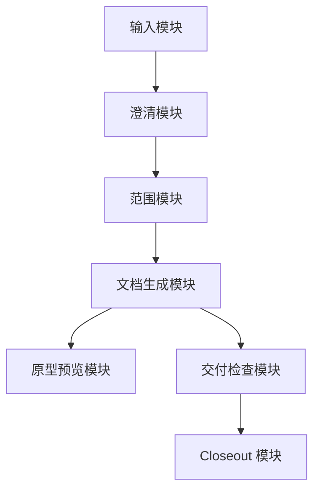

# 临时需求交付包生成器 - 开发文档

- 文档状态: Draft
- 适用阶段: MVP 评估与临时实现
- 配套 PRD: [02_prd.md](/Users/liujun/Desktop/产品经理skill/projects/temp-generated-project/02_prd.md)
- 配套原型: [03_prototype_spec.md](/Users/liujun/Desktop/产品经理skill/projects/temp-generated-project/03_prototype_spec.md)
- 最后更新: 2026-04-30

---

## 0. 开发边界

本开发文档只描述如何实现临时项目，不修改稳定架构。

禁止改动:

- `pm-prd-copilot/`
- `workflow/`
- `registry/`
- `harness/`
- `governance/`
- `docs/proposals/`
- `memory-cache/`
- 根目录文件

允许改动:

- `projects/temp-generated-project/` 下的文档、原型、运行产物和 closeout。

## 1. MVP 技术方案

MVP 建议采用静态优先方案:

| 层级 | 建议 | 说明 |
|---|---|---|
| 前端 | HTML + CSS + 少量原生 JS | 临时原型，避免引入构建链 |
| 文档 | Markdown | 便于审阅、版本管理和后续删除 |
| 数据 | JSON manifest | 记录项目状态和检查结果 |
| 运行 | 本地浏览器直接打开 | 不需要启动服务 |

如后续要产品化，再考虑 React / Next.js、后端 API、模型调用和持久化。

## 2. 模块划分



### 2.1 输入模块

职责:

- 收集项目英文名、中文名、目标用户、业务目标和原始需求。
- 校验项目英文名格式。
- 展示写入目录和禁止目录。

最小实现:

- 静态表单。
- 前端校验提示。

### 2.2 澄清模块

职责:

- 把输入拆成 facts、assumptions、P0/P1/P2 questions。
- 对 P0 问题做显著提示。

最小实现:

- MVP 使用模板化展示。
- 后续可接入 AI 生成，但必须保留人工确认。

### 2.3 文档生成模块

职责:

- 生成需求简报、PRD、原型说明、开发文档。
- 维护文档之间的引用。

最小实现:

- 当前版本直接落 Markdown 文件。
- 后续可用脚本读取模板生成。

### 2.4 检查模块

职责:

- 检查文件是否在允许目录。
- 检查必备产物是否齐全。
- 检查文档之间是否存在明显不一致。

最小实现:

- 人工检查 + `find` / `git status --short`。
- 检查结果写入 `05_delivery_check.md`。

## 3. 数据结构草案

### 3.1 ProjectState

```json
{
  "project_id": "temp-generated-project",
  "project_name": "临时需求交付包生成器",
  "status": "draft",
  "temporary": true,
  "write_root": "projects/temp-generated-project",
  "created_at": "2026-04-30",
  "artifacts": [
    "00_raw_input.md",
    "01_requirement_brief.md",
    "02_prd.md",
    "03_prototype_spec.md",
    "04_development_doc.md",
    "05_delivery_check.md",
    "prototype/index.html",
    "closeout/architecture-feedback.md"
  ]
}
```

### 3.2 CheckItem

```json
{
  "id": "scope-boundary",
  "name": "写入边界检查",
  "status": "pass",
  "evidence": "新增文件均位于 projects/temp-generated-project/"
}
```

## 4. 接口草案

MVP 无后端接口。如后续产品化，可设计以下接口:

| 方法 | 路径 | 用途 |
|---|---|---|
| POST | `/api/projects` | 创建临时项目 |
| POST | `/api/projects/{id}/brief` | 生成需求简报 |
| POST | `/api/projects/{id}/prd` | 生成 PRD |
| POST | `/api/projects/{id}/prototype` | 生成原型说明 |
| POST | `/api/projects/{id}/checks` | 执行交付检查 |

## 5. 开发任务拆分

### Phase 0: 临时交付包

目标:

- 产出完整可评审项目目录。

交付物:

- Markdown 文档。
- 静态 HTML 原型。
- 项目状态 JSON。
- 交付检查报告。

验收:

- 文件均在项目目录内。
- 原型可直接打开。
- 文档互相引用完整。

### Phase 1: 可交互静态原型

目标:

- 让表单和检查状态有基本交互。

任务:

- 表单校验。
- 产物状态切换。
- 检查项展开/收起。

验收:

- 不依赖外部网络。
- 窄屏布局不遮挡。
- 不写入本地文件。

### Phase 2: 可产品化服务

目标:

- 接入真实文档生成和项目存储。

前置审批:

- 是否允许新增后端服务。
- 是否允许接入 AI 模型。
- 是否允许改动稳定 workflow 或 harness。

注意:

- Phase 2 涉及稳定架构时必须先提交推荐计划并等待明确审批。

## 6. 测试策略

| 测试类型 | 检查内容 | MVP 方法 |
|---|---|---|
| 范围检查 | 是否只写项目目录 | `find projects/temp-generated-project -maxdepth 3 -type f` |
| 文档检查 | 必备文档是否齐全 | 人工核对清单 |
| 原型检查 | HTML 是否可打开 | 浏览器或静态文本检查 |
| 一致性检查 | PRD、原型、开发文档是否同范围 | 人工复查 |
| 禁止路径检查 | 稳定目录是否被本次修改 | `git status --short` 辅助判断 |

## 7. 交付风险

| 风险 | 处理 |
|---|---|
| 用户未给具体业务主题 | 使用临时主题并在原始输入中记录假设 |
| 静态原型不等于真实产品 | 文档中明确低保真 |
| 后续希望复用为长期能力 | 先写 architecture-feedback，不直接改稳定架构 |

